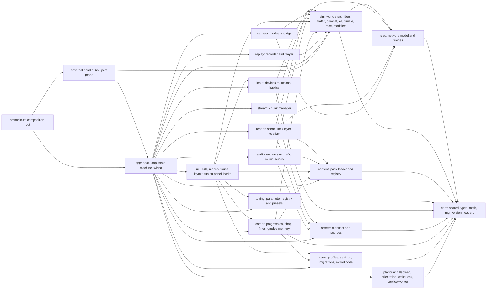

# throttlebrawl runtime architecture

## In plain words

This document describes how the game is put together inside, so that many coding agents can build different parts at the same time without tripping over each other.

- The game is split into separate parts: roads, simulation, controls, graphics, camera, sound, menus, saves, career rules and content. Each part lives in its own folder, has one owner at a time, and talks to the others through a small, fixed set of shared types.
- The **simulation** is the "rules of the world": where every rider, car, pedestrian and cop is, who hit whom, and who won. It runs in fixed ticks, like a board game played 60 moves per second, and gives the same result every time for the same inputs. Graphics and sound only *watch* it. That is what makes replays, robot test players and a future multiplayer mode possible.
- The world is a **network of roads** joined at junctions. Everything on a road is placed by "how far along" and "how far across" the road it is. Only a crashing rider tumbles freely through 3D space, and then lands back on the road model.
- Controls on the phone, keyboard, gamepad and tilt all turn into the same small list of actions, so the game never cares which one you used.
- The visual style is chosen after milestone 1, so the "look" is a swappable layer. The same applies to the photocopied-zine overlay.
- Saves, replays, tuning presets and content packs all carry version numbers, so old files keep working after updates.
- Rare "weird events" (a parade, a hurricane gust, a bounty on you), radio stations by genre and region, and a "cut this" veto you can trigger on any line, billboard or sign are all designed in as data and small seams. Most of them are built later; the seams are fixed now because they are hard to add afterwards.
- Performance budgets for the Galaxy A16 5G are written down as starting numbers, to be corrected once the real phone is measured.

## Tags used in this document

Every non-trivial choice carries one tag:

- `[decided]` traces to a maintainer answer.
- `[default]` is a proposal the maintainer or a later agent may change. Many of these are hard-to-change technical calls (such as a fixed-rate sim, versioned saves and packs, and one GIS coordinate system) that the maintainer delegated to the coordinator, who reports them.
- `[open]` needs the maintainer and is listed in [Open decisions](#open-decisions).

Sibling docs: content file formats live in [content-packs.md](./content-packs.md). This document owns the runtime side: the registry and the loading boundary ([Content registry](#content-registry)).

## Design principles

- `[decided]` TypeScript, Three.js and Vite, installed with npm. The simulation tracks riders in road coordinates. Tracks, rivals, bikes and taunts are data. Nothing blocks multiplayer. Every race quietly records its inputs.
- `[decided]` "focus on velocity not a million redundant checks": design only what is hard to change later, and leave seams for everything else. This document therefore fixes **contracts** (types, coordinate conventions, versioned formats, dependency directions). It does not implement shelved features.
- `[decided]` throttlebrawl is a **codename**, and the real name comes before M5. `[default]` No persisted identifier is derived from the name: save formats, export prefixes and storage keys are name-neutral, and the one place the app id appears is a single constant in `platform/`. A rename is then a one-line change plus a storage-key migration step that reads the old key once.
- `[default]` Things treated as hard to change, and so fixed here: the sim/render split, the tick rate and determinism rules, the road coordinate convention, the world coordinate system, the per-tick input command, the snapshot and event contracts, and version headers on every persisted format. Everything else is a seam.
- `[default]` SI units inside the code: metres, seconds, metres per second, radians. Display units are a setting `[decided]`.

## Module map

`[default]` The source tree is split into modules with disjoint folders. A lane (one agent working on one area) owns one folder at a time and edits only inside it. Other modules are reached only through that module's `index.ts`.

Arrows point from a module to what it depends on. `render --> sim` means "render imports the sim's public snapshot and event types", never sim internals. Every `--> sim` edge means "imports `src/sim/api.ts`" (types only), never anything deeper. Edges into `content` mean "imports registry read types".

`[default]` **This graph is the enforced allow-list.** A lint rule allows exactly these edges and nothing else, so a wrong import is a lint error rather than a review comment. It is a small local ESLint rule that reads the graph as data from `scripts/module-map.mjs` (chosen over per-folder `no-restricted-imports` patterns, which cannot resolve relative paths, and over `eslint-plugin-boundaries`, one more dependency); a unit test checks that file against the graph above, edge for edge. An agent that needs an edge that is not drawn changes this graph and that file in the same contract PR.

### Ownership table

| Folder | Owns | Typical lane |
|---|---|---|
| `src/core/` | shared low-level types (including the touch-layout record type), deterministic math tables, seeded RNG, version-header helpers | coordinator (contract owner) |
| `src/road/` | road network data model, arc-length tables, (edge, s, d) ↔ world queries, junction lookup | road-network lane |
| `src/sim/` | fixed-step world, sub-folders `riders/`, `traffic/`, `peds/`, `cops/`, `combat/`, `ai/`, `tumble/`, `race/`, `modifiers/` | sim lane; sub-folders can be split across lanes |
| `src/sim/api.ts` | public sim contract, types only: `SimInput`, `SimSnapshot`, `SimEvent`, `SimConfig`, `createSim`. Every presentation module may import it | coordinator (contract owner) |
| `src/content/` | pack loading, validation calls, merge, registry | content lane |
| `src/tuning/` | the parameter registry and preset load/save (declarations live beside the systems they tune, gathered by `app/`) | tuning lane |
| `src/input/` | touch, keyboard, gamepad, tilt devices; action mapping; haptics output | controls lane |
| `src/assets/` | asset manifest, baked and remote sources, cache | infra lane |
| `src/stream/` | chunk activation around focus points | infra lane |
| `src/render/` | Three.js scene, road mesh builder, entity views, quality tiers, look styles, post and overlay | render lane |
| `src/camera/` | camera modes, spring rigs, shake, FOV kick | camera lane (may share with render) |
| `src/audio/` | WebAudio graph, engine synthesis, SFX, music layers | audio lane |
| `src/career/` | progression, event objectives across races, tiers and unlocks, shop and cash ledger, fines and failure-mode policy, grudge memory (DOM-free; a M4 module, an empty seam before that) | career lane (M4) |
| `src/platform/` | fullscreen, orientation lock, wake lock, service worker, the Start-tap sequence, the app-id constant | infra lane |
| `src/ui/` | DOM HUD, menus, touch-control visuals and layout editor, barks and interludes, what's-new card (everything except `ui/tuning/` and `ui/narrative/`) | UI lane |
| `src/ui/tuning/` | the tuning panel | tuning lane |
| `src/ui/narrative/` | bark bubbles and interludes | narrative lane |
| `src/save/` | versioned profile and settings records, migrations, export codes | infra lane |
| `src/replay/` | input recording, playback, desync check | infra lane |
| `src/app/` | boot, main loop, game state machine, wiring of all modules | coordinator / integration lane |
| `src/dev/` | `window.__game` test handle, bot player, perf probe, debug report | QA lane |
| `tools/` | Node scripts: pack validation, bakes (GIS later) | per task |
| `tests/` | headless sim batches, browser end-to-end, perf runs | QA lane plus each owner's unit tests beside their code |

`[default]` One lane may own several disjoint folders (for example the tuning lane owns `src/tuning/` and `src/ui/tuning/`); what matters is that no folder has two writers.

### Dependency rules

- `[default]` `core` imports nothing from the project. `road` imports only `core`. `sim` imports only `core` and `road`. The sim reads content and tuning as **plain data handed in through `SimConfig`**, never by importing `content/` or `tuning/`.
- `[default]` The sim is DOM-free and Three.js-free. It gets its own `tsconfig` with `lib: ["ES2022"]` (no DOM types), and an ESLint `no-restricted-imports` rule bans `three` and every project module except `core/` and `road/` (and, inside `sim/`, `sim/` itself) from `sim/` and `road/`. Breaking the split becomes a compile or lint error, not a review comment. The determinism bans for `Math` and clocks ([Determinism rules](#determinism-rules)) are lint rules in the same config.
- `[default]` Presentation modules (`render`, `camera`, `audio`, `ui`) never write sim state. They read snapshots and events. The only way to change the world is a `SimInput` command.
- `[default]` Only `src/main.ts`, the composition root outside the module graph, imports `app/` and `dev/` (and `dev/` imports `app/` and `sim/` as drawn). Nothing else imports `app/` or `dev/`. `main.ts` injects the capabilities the graph does not draw as callbacks typed in `core/` (`onCopyReport`, `resumeAudio`, `recordTuningChange`, `packIndex`, `rendererStats`, `roadQueries`, `getReplayAndSettings`). Any other module that needs the layout record type finds it in `core/`, never in `ui/`.
- `[default]` (M1 app-1) The graph draws no edge to `core` from `app`, `ui`, `render`, `camera`, `audio`, `replay` or `dev`, so `src/sim/api.ts` re-exports the core types and helpers they need (the callback types, `TuningParamDecl`, the layout record and `placeElement`) and the road types `RoadNetwork` and `RouteProgress`. Each type is still defined once, in `core/` or `road/`; the re-export only carries it along a drawn edge. Likewise `stream/` (which may import `road`) builds the road network handle and the route tables that `app/` puts in `SimConfig` and hands to `render/` and `camera/`.
- `[default]` **Contract files** (`src/core/**`, `src/sim/api.ts`, the content schema types) change only in a small, dedicated "contract PR" that merges before the lanes that depend on it. Lanes that need a contract change say so in their report instead of editing it in their own branch. This is the main anti-collision rule for parallel agents.
- `[default]` **Exception until the walking skeleton exists.** Before the M1 walking skeleton (one crude race, playable on the phone end to end) is on `main`, every file is a contract and a contract-PR queue would be the slowest path to a playable build. Until then, one lane builds the skeleton vertically across all modules and owns the contracts. The contract-PR rule starts once the skeleton is merged.

## Simulation

### Fixed timestep and the loop

- `[default]` The sim steps at a fixed **60 Hz** (`dt = 1/60 s`). The maintainer delegated the tick rate. 60 Hz keeps input latency low and divides evenly into 60 and 120 Hz displays. A 90 Hz screen is handled by interpolation.
- `[default]` The main loop in `app/` uses `requestAnimationFrame` with an accumulator:
  1. Add real elapsed time, clamped to 0.25 s, to the accumulator. The clamp prevents a spiral of death after a stall: the game slows down rather than freezes.
  2. While the accumulator holds at least `dt` and fewer than 4 steps have run this frame, sample input into one `SimInput` per player slot and call `sim.step(inputs)`. Subtract `dt` after each step.
  3. If the cap of 4 steps was hit and the accumulator still holds at least `dt`, drop the backlog: `accumulator = accumulator % dt`. The game then slows down instead of freezing or drifting further behind.
  4. Render with interpolation factor `alpha = min(1, accumulator / dt)` between the previous and current snapshot, so a render never extrapolates past the newest snapshot.
- `[decided]` The game auto-pauses on an app switch, a screen lock or a call (`visibilitychange` to hidden, `pagehide`, a lost fullscreen), and resumes mid-race even after the tab reloads ([Resume after a reload](#resume-after-a-reload)). `[default]` A resume always lands behind the pause menu, never straight back into a race.
- `[default]` A frame-rate cap setting skips render frames only; the sim rate never changes. The options are divisors of the measured display refresh: full rate, half and a third (90, 45 and 30 fps on a 90 Hz panel; 60, 30 and 20 on a 60 Hz one). `[decided]` (cockpit answer, 2026-09-29): **smooth first**. The default is the display's full rate (60 fps or better), the picture gets softer under load through dynamic resolution rather than dropping frames, and a battery saver of about 30 fps (the divisor nearest 30) sits in settings. `[default]` Until dynamic resolution lands ([Quality tiers](#quality-tiers-and-dynamic-resolution)), the picture does not yet soften under load: a fixed pixel-ratio cap of 1.5 only lowers the steady load. Because the maintainer chose smooth first on the premise that resolution scaling protects the frame rate (`architecture-frame-rate-priority`), dynamic resolution is pulled forward from M5 as soon as a phone probe or playtest shows the default missing its frame interval.
- `[default]` The sim runs on the main thread in M1. Because it is DOM-free, it can move into a Web Worker later without a rewrite.

### Determinism rules

`[default]` Same sim code and sim content hash (together the replay key, see [Replay and input recording](#replay-and-input-recording)), same `SimConfig`, same seed and same input stream give the same state, tick for tick. That is what replays, bug reports and bot tests rely on. The rules:

- No `Date.now()`, `performance.now()` or `Math.random()` in `sim/` or `road/`. Time is the integer `tick`.
- Randomness comes from a seeded PRNG in `core/rng`, kept in sim state. There is one named stream per subsystem (traffic, ai, combat, peds, cops, tumble, modifiers), derived from the race seed, so adding a roll in traffic does not shift the AI's rolls. An entity added mid-race (a guest rider from a modifier, for example) draws from a substream derived from `(seed, subsystem, entityId)`, so its arrival shifts nobody else's rolls.
- No `Math.sin`, `Math.cos`, `Math.tan`, `Math.atan2`, `Math.pow`, `Math.exp` or `Math.log` inside the sim. ECMAScript does not pin these bit-exactly across engines and CPU architectures. `core/math` provides table-based or polynomial versions built from `+ - * /`. `Math.sqrt` is allowed; that its results match bit-for-bit across engines is assumed (unverified) and checked by the cross-architecture self-test ([Testing seams](#testing-seams)). These bans, plus `Date.now`, `performance.now` and `Math.random`, are an ESLint `no-restricted-properties` rule over `src/sim/**` and `src/road/**`, so an agent hits them at lint time.
- **Tables the sim reads are covered too.** Any table the sim reads (road profiles, arc-length tables) is computed with `core/math` or baked offline by a tool. Load-time code in `road/` follows the same math rules, so a browser cannot feed engine-specific numbers into the sim through the back door.
- Iteration order is explicit: entities are processed in ascending id order, and no gameplay code iterates over a `Map` or `Set` whose insertion order depends on timing.
- Prefer preallocated pools and no per-tick heap allocation in hot paths. This is for phone GC pauses, not for determinism. It is a nice shape from the start, and it is fixed only in hot paths that the soak report or the `?debug=1` overlay shows over budget (the M5 performance pass); there is no blanket rule or lint, so crude M1 code is not slowed down by it.
- Anything that changes outcomes is sim state or `SimConfig`: tuning values that affect the sim, the slow-motion toggle, assist levels, the event rules and the event modifiers. All of it goes into the replay header.

### Time scale: hit-stop and slow motion

- `[decided]` Burnout-style takedowns with a short in-flow slow motion, on by default and toggleable.
- `[default]` Hit-stop and slow motion live **inside** the sim as a `timeScale` state field (0 during a hit-stop, for example 0.3 during a takedown). The sim still ticks at 60 Hz and inputs are still sampled every tick. Only the physical `dt` used for motion is scaled, and attack wind-up, active and recovery timers scale with it, so the whole world slows together. This keeps replays exact and lets the player keep steering during slow motion. Durations and scales are tuning parameters. The `timeScale` field exists from M1 (constant 1); hit-stop and takedown slow motion switch on in M2.

### Sim contract (`src/sim/api.ts`)

`[default]` These are the shapes the rest of the game codes against. The field lists are the minimum, and the contract owner may add fields.

- `SimConfig`: seed, event definition (resolved from content), resolved rider, bike, weapon and traffic definitions, the road network handle, resolved event modifiers (see [Event modifiers](#event-modifiers)), the career's resolved grudge table (per rival toward each rider; empty before M4 `[default]`, persisted with the career `[decided]`), sim-affecting tuning values, `difficulty`, assist and slow-mo settings, and player slot count. `difficulty` is the resolved scales `{riderAggression, copFrequency, rubberBand}` (1.0 is Normal); the preset id travels for display only. `[decided]` Easy, Normal and Hard set rival aggression, cop frequency and rubber-banding, and assists toggle separately; `[default]` the struct shape. It exists from M1 with every value at 1.0, and M2 adds the preset resolution in `buildSimConfig`. Render-only fields of the event definition (such as `timeOfDay`) are read by `app/` and passed to `render/`; the sim never sees them.
- `SimInput` (one per player slot per tick, **quantized** so recordings are exact): `steer` int8 (−127..127), `throttle` uint8, `brake` uint8, and a flags bitfield: `attack`, `attackSideLeft`, `attackSideRight`, `kick`, `grab` (reserved, since grabbing is the same attack press during an opponent's wind-up), `lookBack` (camera only, ignored by the sim), `skipRunBack`, `pause` (ignored by the sim).
- `SimSnapshot`: tick, timeScale, and per-entity id, kind, mode (see [Movers](#movers-on-the-network)), road position, world position and heading (for render), speed, lean, attack phase, health, held weapon, and race progress. Audio, HUD and combat framing need more than that, so each rider entry also carries applied `throttle` (0..1), `rpm` and `gear` (derived outputs, never fed back into motion), `grounded`, `faction` (rider or law), `targetId` (the current auto-target) and `lastAttackerId`. Presentation modules cannot read sim internals, so anything they need is added here rather than reached for ad hoc. Snapshots are written into preallocated buffers and double-buffered for interpolation.
- `SimEvent`: typed records `{tick, type, actor, target?, causeId?, data}` such as `hit`, `kick`, `weaponGrab`, `stealWindow` (a held weapon's wind-up has reached its snatch window: the glint and the audio cue), `crash`, `takedown`, `nearMiss`, `bust`, `siren` (the cop's chase cue, on and off), `jump`, `land`, `lapOrCheckpoint`, `finish`, `pedDive`, `cashAward`, `style`, `modifierStart` and `modifierEnd`, plus from M2 `slowmoStart` and `slowmoEnd` (a takedown's slow motion), `railOver`, `splash` and `respawn` (going over a bridge rail), `getUp`, `fistShake` and `grudgeNoted` (a knocked-off rival). A `takedown` event carries `data.kind` (`traffic`, `scenery` or `health`). A `style` event carries `data.kind` (`nearMiss`, `airtime`, `oncoming`, `takedownCombo` or `weaponSteal`) and a points value (`data.points`, in cash), and `sim/race` emits it; style cash comes from those five sources `[decided]`, scored from M2. `causeId` links chains (a kick causes a crash, which causes a car to brake). Audio, camera, barks, HUD and the debug log consume these.
- `sim.hash()`: a fast FNV-1a hash over the quantized state, used by replay desync checks and determinism tests.

### Controllers: every rider is driven the same way

- `[default]` Every rider, whether player, rival or cop, is driven by a **controller** that produces a `SimInput` each tick. Kinds: `HumanController` (from the input layer), `AIController` (runs inside the sim, deterministic, reads only sim state), `BotController` (test player, runs outside the sim and reads snapshots like a human would), `ReplayController` (feeds recorded inputs), and later a network controller. Controllers that run outside the sim (human, bot, network) have their inputs recorded; `AIController` inputs are not, because they are a deterministic function of sim state. Rival AI therefore drives through the same physics as the player, and a second human later is just another slot.
- `[decided]` Rival AI in v1 covers personality styles, grudge targeting, rival-vs-rival fights, weapon use and steals, and simple gang-ups (rivals may side with or against you). Deeper crews come later.
- `[default]` The mechanism: AI styles are named presets registered in `sim/ai/` (weights, thresholds and a behaviour set); a rider's `personality` numbers override them. The style ids are listed in [content-packs.md](./content-packs.md#rider-rivals-cops-player-presets).
- `[default]` A cop's `AIController` lives in `sim/cops/`, not `sim/ai/`: its `SimController` kind is `cop`, the controllers phase skips it, and the cops phase writes its command, which takes effect on the next tick. That keeps the chase and the bust in one folder, and the one-tick lag is deterministic like everything else.

### Event modifiers

`[decided]` Rare, data-driven race modifiers of all four kinds the maintainer wanted, "with room to grow": nature chaos (hurricane gust, gator crossing, cold-night iguana rain), human chaos (parade, funeral procession, spring-break convoy, offshore rocket launch), wasteland weird (cult roadblock, runaway boat on a trailer, a UFO billboard that comes true) and league stunts (a bounty on the player, double-cash zones, a guest "celebrity" rider). Their file schema (`event-modifier` entries) is owned by [content-packs.md](./content-packs.md#event-modifiers-weird-events); this section owns the runtime seam, because modifiers change outcomes and so must be inside the sim and inside replays.

- `[default]` `SimConfig.modifiers` is the list of `event-modifier` entries an event opted into and that the roll selected, resolved from the registry. Each carries a `kind` (`nature`, `human`, `wasteland`, `league`), a trigger (chance and a race-progress window), a duration and a list of `effects`. `effects` are a **closed list of registered behaviour ids** implemented in `sim/modifiers/` (for example a lateral gust, a hazard spawn, a cash-multiplier zone, a bounty, a guest rider), so a new modifier built from existing effects is data only and a new effect is a code change. Data never holds code.
- `[default]` What a modifier may do, through sim state only: add a traffic population or a scripted crossing, spawn an animal or prop, apply a force to riders, change cash rules (double-cash zones, a bounty), or add a rider slot (the guest celebrity). A modifier rolls only on its own `modifiers` RNG stream, so adding one never shifts another subsystem's rolls.
- `[default]` A modifier announces itself with `modifierStart` and `modifierEnd` `SimEvent`s, which `ui` (a warning card or bark), `audio` and `camera` consume like any other event.
- `[default]` Modifiers are part of `SimConfig`, so they are in the replay header and the sim content hash.
- `[default]` Timing: none of this is built in M1 or M2. Modifiers arrive in M4 or on the shelf; M1 ships only the empty `modifiers` list and the `modifiers` RNG stream. Presentation of a modifier (a billboard that "comes true", a funeral-procession model) is ordinary content and rendering.

## Road network

`[decided]` One connected road network: roads linked at junctions, each road with along and across coordinates. Free roam on roads with traffic, bikers and cops, and races as routes through it. Designed for chunk streaming.

### Data model

`[default]` The model borrows the "roads, lane sections, junctions with connecting roads" idea from road-simulation formats, cut down to what an arcade game needs.

- **Edge (road)**: `id`, a centerline curve, length `L`, and profiles sampled along arc length `s` at a fixed spacing (2 m default): world position, tangent, signed curvature `kappa` (1/m), elevation, bank, left and right drivable width, surface type, and scenery tags. Profiles are precomputed into typed arrays by the bake tool or at load time (with `core/math`, see [Determinism rules](#determinism-rules)), and queried by interpolation. The runtime never evaluates splines per tick.
- **Centerline source**: hand-authored control points (Catmull-Rom) for M1 tracks, or a baked GIS polyline from the side-quest lane that has run since M1 `[decided]` (the real Overseas Highway built from public data in the same road format; in M2 the maintainer rides both roads and picks, the pick becomes the career's road, and the other stays as an alternative route, `[decided]` cockpit answer, 2026-09-29). Both end up as the same sampled tables, which is the format-level seam the GIS research recommended.
- **Lane sections**: an edge is divided along `s` into sections, and each section lists its lanes as `{dCenter, width, direction: +1 | -1, kind: drive | shoulder | shortcut}`. `direction −1` is an oncoming lane: its traffic moves toward decreasing `s`.
- **Junction (node)**: the joins between edge ends. A junction owns short **connector edges** (ordinary edges, usually generated), and a table `(fromEdge, fromEnd, fromLane) → (connectorEdge) → (toEdge, toEnd, toLane)`. Every mover is therefore always on some edge, even inside a junction.
- **Splits and merges** (for example, the ramp shortcut leaving and rejoining the main road) are junctions too. At a split, a rider's lateral position `d` in a marked **split zone** decides which connector it takes. No button press is needed.
- **Features** are ranges along an edge: `{edgeId, s0, s1, d0, d1, type, params}`. Types include `ramp` (a lip in the elevation profile), `gap` (no surface, so fall or jump), `hazard`, `roadsideZone` (pedestrian or animal spawns, landmark set dressing), `copSpawn`, `raceMarker` (later, for world race markers), and `billboard`. They are data, seeded, and easy to add.

### Coordinates

- `[default]` A road position is `{edge, s, d, h}`. `s` is metres along the edge centerline from its start (0..L). `d` is the metres across, **positive to the right** when facing increasing `s`. `h` is always metres above the road surface at that `(s, d)` (0 when grounded); see [Jumps, ramps and airtime](#jumps-ramps-and-airtime) for how an airborne mover keeps its absolute height separately. `[default]` Sign conventions are defined once, in `road/`, and [content-packs.md](./content-packs.md#units-and-axes) links here: signed curvature `kappa` is positive when the road turns right (toward positive `d`), and `bank` is positive when the surface tilts down toward positive `d`.
- `[default]` A mover on an edge also has `dir` (+1 or −1), its travel direction relative to `s`, and `yaw`, its small heading offset from the road tangent, positive toward positive `d` (this is what steering changes). Riding the wrong way down a lane is just `dir = −1` on a `direction +1` lane.
- `[default]` **Kinematics on a curved road.** For a mover with speed `v` on an edge at offset `d`, using `core/math` trig and `kappa` sampled at `s`:
  - `ds/dt = v·cos(yaw) / (1 − kappa·d)`, with the denominator clamped to at least 0.1;
  - `dd/dt = v·sin(yaw)`;
  - `d(yaw)/dt = (rider's own turn rate) − kappa · ds/dt`, because yaw is measured from a tangent that itself turns.

  Without the `1 − kappa·d` term, a rider on the outside of a bend would cover more ground than one on the inside at the same speed, and placing, rubber-banding, reach boxes and the tumble hand-off would all be skewed. For `dir = −1` the sim flips the signs of `ds/dt` and of the yaw coupling; the sim lane owns that detail and covers both directions with a unit test. The pack validator enforces `|kappa| · dMax < 0.5` on every lane section, where `dMax` is the widest drivable offset.
- `[default]` When `s` passes 0 or `L`, the mover transfers through the junction table. Overshoot distance carries into the next edge, and `d` maps through the lane mapping. A mover with no valid connection (a dead end) hits a barrier.
- `[default]` `road/` exposes pure queries: `toWorld(edge, s, d, h)`, `frameAt(edge, s)` (position, tangent, normal, up, bank), `surfaceHeight(edge, s, d)`, `lanesAt(edge, s)`, `nextEdges(edge, end)`, `project(worldPoint, hintEdge?)` (world to nearest road position, used by the crash tumble), and `neighbours(edge, s, range)` for cross-edge proximity near junctions.

### Races as routes

- `[decided]` Races are routes through the network, started from menus in M1 and from world markers later. Race length is selectable.
- `[default]` An event definition names a start (edge, s, dir), a finish, an **allowed edge set** (the main route plus legal shortcuts), and optional checkpoints. At load, the race module computes a **distance-to-finish table** for every allowed edge. Race progress, placing and rubber-banding all read that one number, so the ramp shortcut automatically counts as progress. Leaving the allowed set (free-roam detours) shows a wrong-way indicator and does not add progress.
- `[default]` Selectable length is data: the same route with a different finish `s`, or a looped route with a lap count.

## Movers on the network

`[default]` Each dynamic entity has a **mode**: `Road` (grounded on an edge), `Airborne` (in a jump, still in road coordinates), `Tumble` (free-body crash, world space), `OnFoot` (running back to the bike, road coordinates), and a reserved `Free` mode that is **not built** (see [Crash tumble](#crash-tumble)).

- **Riders** `[default]`: longitudinal speed from throttle, brake, drag and grade. Lateral motion from `yaw` and speed. Lean derived from lateral acceleration for visuals and combat reach. `d` is clamped to drivable width plus shoulder, and going past the shoulder or into a barrier is a wobble or a crash, depending on speed and angle (tuning). Arcade and weighty handling `[decided]` is a tuning target, not a physics model.
- **Combat** `[default]`: an attack is a timed window with wind-up, active and recovery phases. A hit lands if the target is within the reach box in (Δs, Δd) during the active phase. Auto-target picks the nearest valid rider, and the side flags override the side `[decided]`. An attack starts on the tick its `attack` flag is set, and the side and kick flags may still change it during the wind-up (see [Input](#input)). A **grab** is an attack pressed while the opponent's weapon is in its extended or wind-up phase `[decided]`. Kick is a separate attack with its own timing window (the look-lab kick had no timing gate, which is flagged for the feel pass). Damage reduces health only; the bike is indestructible `[decided]`.
- **Traffic** `[decided: cars, trucks, oncoming lane, pedestrians and animals, wasteland oddities]` `[default: model]`: vehicles follow their lane using an Intelligent-Driver-Model-style car-following rule (so cars brake behind a crash for free), with occasional seeded lane changes and seeded route choice at junctions. Junctions have no signals in v1; a conflict zone acts as a virtual obstacle for yielding. Traffic is populated deterministically in a window around the **sim anchors** (see [Chunks](#chunks)) and recycled beyond it. Vehicle types (size, speed, behaviour flags, whether hitting one crashes you) are content.
- **Pedestrians and animals** `[decided: dive away cartoonishly, no gore, crash on big things]`: spawned from `roadsideZone` features, they cross or loiter in (s, d), and a threat check triggers a dive (a short scripted arc to the side). Big animals and objects use the crash rule.
- **Cops** `[decided: chase and bust, hittable like riders]`: cops are riders with a `law` faction and a cop behaviour set. The spawn policy is a mix of tier-rising, every race and chaos-summoned, with some randomness `[decided]`; `[default]` the mechanism is event data. `[decided]` Going down near a cop busts you and costs a fine. `[default]` Bust detection is a radius plus a dwell time (both data), and it fires a `bust` event. What a bust does to the race (end it, continue it, offer a retry) is **not** decided here: it is event-rule data set by the failure-state policy, which belongs to the game rules and `career/`, not to this document. That policy is `[decided]` (cockpit answer, 2026-09-29): Road Trip is the default (a fine never takes cash below $0), with Classic and Hardcore as later options ([product spec](./product-spec.md#failure-states)).

## Jumps, ramps and airtime

`[decided]` Jumps and ramps in v1, including one ramp shortcut.

- `[default]` Airborne movers stay in road coordinates. At takeoff, the sim switches the mover to `Airborne` when the surface falls away faster than gravity can follow (the ballistic height next tick is above `surfaceHeight`). While airborne, `s` and `d` advance with the takeoff velocity, the mover stores an absolute world height `yAbs` and a vertical velocity `vy` (gravity acts on `vy`), and each tick derives the API value `h = yAbs − surfaceHeight(edge, s, d)`. It lands when `h ≤ 0`. Grounded movers track `vy = v · dElevation/ds`, so takeoff is detected at a ramp lip. Presentation modules only ever see `h` (height above the road), which is what makes airborne bodies render neither sunk nor floating. Landing quality (lateral speed, lean, whether a gap was cleared) decides clean landing, wobble or crash.
- `[default]` The known weakness of road coordinates is that an airborne body "bends with the road". The mitigation is an **authoring rule** checked by the pack validator: jump and gap features must sit on stretches whose curvature over the expected flight length is below a threshold. This is cheaper than a world-space flight mode, and it is enough for designed jumps.
- `[default]` A `gap` feature has no surface. A mover whose height `h` drops below the gap's kill depth becomes a crash and respawns on the nearest valid road.
- `[default]` Tricks are shelved `[decided]`. `Airborne` carries rotation fields for visuals only.

## Crash tumble

`[decided]` Crashing sends you running back to your bike, which you can skip. `[default]` Free-body physics is used only for crash tumbles.

- `[default]` **M1 builds a crude tumble** and the M2 feel pass builds the fuller rig. The crude version is one world-space body each for rider and bike, colliding with the road surface and barriers only, with projection hand-back. Traffic contacts and the multi-point rig below arrive in M2.
- `[default]` A crash converts the rider and the bike from road position plus velocity into **world-space tumble bodies**. In the full version each body is a small point-mass rig (a particle cluster with distance constraints: a few points for the bike, a few for the rider). Each particle keeps an explicit velocity (not position-Verlet's implied one, which gains or loses energy whenever `timeScale` changes), integrated with `dt = timeScale / 60` and not at all while `timeScale` is 0; it is stepped at the sim tick. It is written in `sim/tumble/` with the same determinism rules, and it is not an external physics engine. The reason: it stays deterministic under our own math rules, costs nothing to bundle, and a primitive-built rider needs nothing fancier. An external engine (for example Rapier's deterministic build) stays an option if the in-house version proves too crude (unverified whether that build is cross-engine deterministic).
- `[default]` Tumble collisions go against the road surface (via `surfaceHeight` after `project`), barrier walls from edge widths, and **oriented boxes** built each tick from nearby traffic and riders. Contacts become `SimEvent`s that feed back into the road model: a car brakes, a rival wobbles or crashes, and cause chains stay intact. The crash is causal and replayable, not decoration.
- `[default]` **Hand-back**: when every body has stayed under a speed threshold for N ticks, or a timeout passes, the bike is projected to the nearest drivable road position (snapped inside the shoulder if needed) and returns to `Road` mode, parked. The rider is projected and enters `OnFoot`, runs to the bike in (s, d) while dodging traffic, and remounts. `skipRunBack` teleports the rider to the bike and remounts after a short fixed delay.
- `[default]` **Crash input** (tumble-1): a crash is a `crash` `SimEvent` whose `actor` is the rider who goes down, emitted by any system that runs before `tumble` in the tick order (riders, combat, traffic and the rest); its `causeId` is kept, and optional numeric `data.sideMps` (a shove to the rider's right) and `data.upMps` (extra upward pop) shape the throw. A rider already down ignores further crashes. A rider is **down** while its mode is `Tumble` or `OnFoot` (the cop's bust reads this). While tumbling, the mover keeps a valid road position: the rider body's projection, with `h` above the surface. `skipRunBack` works for player slots on foot; pressed during the tumble, it starts at the hand-back.
- `[decided]` **Over the rail.** Crashes are big and funny and recovery is quick. A tumble body that crosses a `rail` barrier fires `railOver`, then `splash` when it reaches sea level (world `y = 0`), then the rider respawns on the bridge after a time penalty. A gator or a fisherman reacts, and there is no swimming mode. Rivals who are knocked off tumble, get up, shake a fist (`getUp`, `fistShake`) and a grudge is noted (`grudgeNoted`); it is never gory or lingering. `[default]` The barrier shape is the optional `barriers` list on a road file ([content-packs.md](./content-packs.md#road-file-regionsregionroadsidjson)).
- `[default]` **Off-road door, open but not chosen**: the `Free` mode enum value, the world-space mover state and `road.project` are exactly what a later off-road mode would reuse (a world-space controller on terrain, handing back to `Road` when the rider rejoins a road). Nothing else is built for it. The maintainer confirmed only the road network, so off-road riding stays on the idea shelf.

## World coordinates and chunk streaming

### One world coordinate system

- `[default]` The maintainer delegated the choice of a single GIS coordinate system to the coordinator, who reports it. Each **region** (for example Region 1, the Florida Keys and A1A `[decided]`) defines a transverse Mercator projection centred on the region, plus an origin point. World coordinates are metres: `x` east, `y` elevation (up), `z` south, which gives a right-handed, y-up frame that Three.js uses directly (north is `-z`). GIS bake tools convert source coordinates to this system offline, and the runtime only ever sees metres.
- `[default]` Why not a flat local tangent plane: over 100 km the Earth's surface drops about 785 m below a flat plane (100 000² / (2 × 6 371 000) m, computed), which would bend long real roads. A projection keeps the height as true elevation with negligible scale error at region size.
- `[default]` The sim uses float64 numbers. The renderer uses a **floating origin**: positions are sent to the GPU relative to a render origin near the camera, because float32 spacing at 100 km from the origin is about 8 mm (2⁻⁷ m, computed), which is enough to jitter close-up geometry.

### Chunks

`[decided]` Design for chunk streaming, so big GIS regions fit later. `[default]` M1 loads everything, through the same interface.

- `[default]` A region pack holds: the **road graph** (edges, junctions, lane sections and features, which is small and always fully loaded), **edge profile pages** (the dense sampled tables, split into pages by `s` range), and **visual chunks** on a square grid (512 m default) holding road mesh inputs, scenery placements, terrain and asset refs.
- `[default]` **Two different sets of points, on purpose.** **Sim anchors** are the player slots, the race leader and the event's rivals. They are computed inside the sim, and they are the only input to population, despawn and recycling, and to the sim's required radius. **Stream focus points** are the sim anchors plus the camera. They drive only visual chunks, profile-page prefetch and render level of detail. Nothing the camera does may change what the sim spawns, keeps or steps, so a replay viewed with a different camera cannot desync.
- `[default]` `stream/` keeps profile pages and visual chunks loaded within an activation radius of the stream focus points, prefetching along each point's direction of travel. It loads through `assets/` and unloads with hysteresis.
- `[default]` **The sim must never behave differently because of what happens to be loaded.** The sim declares a required radius around its sim anchors. If a needed profile page is not yet resident, the app **holds the sim** (a loading hitch with a spinner) rather than stepping with missing data. Loading order therefore never changes outcomes, and replays stay exact.
- `[default]` Entities far from every sim anchor are despawned or recycled by deterministic population rules, not simulated in detail.
- `[default]` M1 packs everything into one chunk with one page per edge, and `stream/` activates all of it at load.

## Input

`[decided]` Landscape. The left thumb gives scaled throttle (up), steering (sideways) and coasting (lift), plus a brake. One auto-target attack button: drag off it to pick a side, swipe down on it to kick. Buttons are movable and configurable. Haptics can be turned off. Keyboard has equal priority. The input layer is designed for gamepads, which are added around M2. Tilt is optional. Accessibility includes a left-handed mirror.

- `[default]` Three layers:
  1. **Devices** (`input/devices/`): touch (Pointer Events tracked by `pointerId`, `setPointerCapture`, `pointercancel` treated like `pointerup`, `touch-action: none` on the play surface), keyboard, gamepad (Gamepad API polled once per frame) and tilt (DeviceOrientation).
  2. **Action mapping** (`input/map/`): each device writes into one **action state**: axes `throttle 0..1`, `brake 0..1`, `steer −1..1`, and buttons or gestures `attack`, `attackSide`, `kick`, `lookBack`, `pause`, `skipRunBack`. Bindings, dead zones, response curves and sensitivity are data in the settings record.
  3. **Command sampling**: once per sim tick, `app/` converts the action state into a quantized `SimInput`. Taps and swipes that start and end between two ticks are **latched** until the next tick samples them, so a fast tap is never lost.
- `[default]` Touch layout: a floating stick that appears where the left thumb lands, inside the left zone, clamped away from the screen edge to avoid the Android back gesture. The attack button uses press, drag-off-left or drag-off-right for side, and swipe-down for kick (the gesture timing is specified in the next bullet). Positions, sizes, opacity and the left-handed mirror are a layout record whose type lives in `core/`, edited in `ui/` and read by `input/`. The floating stick and a cruise toggle were coordinator defaults. `[decided]` (cockpit answer, 2026-09-29): both the cruise mode and the cruise-control button stay on the shelf until a playtest asks for them, so the `cruise` action is reserved and not built.
- `[default]` **Attack gesture timing.** A recognizer that waits for release or movement to tell punch, side attack and kick apart would add disambiguation delay to the core action, landing a hit at speed `[decided]`. So `attack` is set on `pointerdown` (or the key press), and the wind-up starts that tick with the auto-target side. During the wind-up, a sideways drag beyond `attackDragPx` (default 24 px) within `attackDragMs` (default 80 ms) sets `attackSideLeft` or `attackSideRight`, which the sim honours until the active phase starts, and a downward swipe (Δy beyond `kickSwipePx` within `kickSwipeMs`, default 80 ms, so the swipe finishes before the 7-tick punch wind-up, about 117 ms, ends; a swipe at 45° or steeper below horizontal counts as down, anything flatter as sideways) sets `kick`, which converts the wind-up into a kick. All four thresholds are tuning parameters (`input.*`), and a unit invariant in `input/` checks both windows plus one tick against every weapon's wind-up (M1 input-1). The side and kick flags are level-held state per tick, not edge events, so the latching rule above still applies to the initial press.
- `[default]` Thumb steering is the starting default and tilt is an option; playtests decide, since the tilt default was left undecided. Tilt reads `beta` in landscape, flips its sign by `screen.orientation.angle`, recalibrates at race start and has a sensitivity slider (these axis details come from the touch research and are unverified until tested on the device). Tilt and thumb can be additive (hybrid).
- `[default]` The Start tap (sequenced by `platform/`, not `input/`) performs every user-activation-gated call: fullscreen, landscape orientation lock (catching failure), `DeviceOrientationEvent.requestPermission?.()`, `AudioContext.resume()`, and a first short vibration. The orientation lock is re-applied on every `fullscreenchange`.
- `[default]` **Haptics** (built in M2, following the blueprint roadmap) are an output in `input/feedback`: `navigator.vibrate` patterns keyed by `SimEvent` type, gated by the haptics toggle, and silently absent where unsupported.
- `[decided]` Assist options exist, offered without being obtrusive. `[default]` The levels are off, light or strong. The level is independent of the input method, and it is sim config, so it is recorded in replays.

## Camera

`[decided]` Low chase cam first. Far chase, helmet cam, cinematic replay cams and look-back are all wanted, staged by value and complexity.

- `[default]` `camera/` holds **camera modes** as data plus small rig classes. Each mode reads the interpolated snapshot and the road frame, and outputs a camera pose and FOV. Modes are `lowChase` (M1), `farChase`, `helmet`, `lookBack` (held action), `takedown` (a short framing on takedown events), and `replayCinematic` (trackside and orbit cameras chosen by rules, used only in replays).
- `[default]` The chase rig: a critically damped spring aimed at a look-ahead point along the road, roll at a fraction (20–40 %) of bike lean, an FOV kick with speed, and a combat framing bias toward the attack target. Every constant is a tuning parameter.
- `[default]` Shake comes from events (hits, crashes, landings), scaled by the reduce-screen-shake setting `[decided]`.
- `[default]` The camera never affects the sim. Auto-target uses sim geometry, not what is on screen, which keeps replays and bots identical to human play.

## Rendering

`[decided]` Three.js. The look is picked after M1. The zine/photocopy overlay is one source of visual identity. The Galaxy A16 5G is the benchmark.

### Version facts (fetched 2026-09-29)

- The npm registry for `three` reports `"dist-tags": {"latest": "0.186.1"}`, with `0.186.1` published `2026-09-24T14:42:21Z`. The GitHub releases API reports the latest release as `r186`, published `2026-09-24T14:35:44Z`. `@types/three` latest is `0.186.0`.
- The `three@0.186.1` package `exports` include `"."`, `"./webgpu"`, `"./tsl"` and `"./addons"`.
- `[default]` Pin `three` to an exact version (0.186.1 at scaffold time) and upgrade deliberately. Use `WebGLRenderer` (WebGL2) as the baseline. `WebGPURenderer` (the `three/webgpu` entry) stays behind the renderer seam, not adopted, until measured on the A16. Its behaviour on this phone is unverified.

### Structure

- `[default]` `render/` owns the scene graph. It builds road meshes from road profiles per visual chunk (ribbons along arc length, with LOD by distance), places scenery with `InstancedMesh`, and keeps **entity views**: one pooled view object per sim entity id, updated from the interpolated snapshot. Riders are built from primitives with procedural animation (lean, attack phase and wobble come straight from snapshot fields). A skinned rider can replace a view without touching the sim. Entity views take body proportions as a parameter from rider data, so the tentative M3 look-test of exaggerated against realistic rider proportions is a data change, not a rewrite `[default]`.
- `[default]` **WebGL context loss.** On Android Chrome the GPU context can be lost after backgrounding or under memory pressure (frequency on the A16 unverified). `render/` handles `webglcontextlost` (calling `preventDefault`, with `app/` pausing the game) and `webglcontextrestored` by rebuilding every GPU resource from the registry and the current snapshot. The sim and audio are untouched. An end-to-end test can trigger it with the `WEBGL_lose_context` extension.
- `[default]` Purely visual effects (dust, sparks, debris particles) live in `render/` and may use non-seeded randomness, because they never feed back into the sim.
- `[default]` DOM UI (HUD, menus, touch controls) is layered over the canvas and is not drawn in WebGL. Text stays crisp at any render resolution, and `ui/` does not depend on the renderer.

### Quality tiers and dynamic resolution

- `[default]` **Timing.** M1 renders straight to the canvas with a device-pixel-ratio cap of 1.5 and one quality setting. Quality tiers and dynamic resolution land in the M5 "speed on the A16" pass, or earlier: the maintainer chose smooth first (`architecture-frame-rate-priority`) on the premise that resolution scaling protects the frame rate, so a phone probe or playtest that shows the default missing its frame interval pulls dynamic resolution forward `[default]`. The design below is what that pass builds.
- `[default]` Three tiers, `low`, `medium` and `high`, plus `auto`. A tier sets the internal resolution range, shadow mode (none, or a blob decal), draw distance and fog, scenery density, post-pass budget and particle caps. Tiers are data.
- `[default]` **Tiers never hide threats.** On every tier, traffic, rider, cop and hazard views render out to at least `minThreatDrawM` (default 200 m), because fog or draw distance must never hide oncoming traffic inside reaction range ([product-spec.md](./product-spec.md)). Tiers save cost through scenery density, resolution and particles, not by culling threats.
- `[default]` **Dynamic resolution**: the scene renders into a render target at a scale between the tier's minimum and maximum (for example 0.5–1.0 of the canvas's device pixels), then upscales in the final pass. A frame-time moving average adjusts the scale in small steps with hysteresis (drop quickly when over budget, rise slowly when under). The device pixel ratio is capped (1.5 default on phones). The PS1-style look can simply pin a low scale.
- `[default]` `auto` picks the starting tier from a short warm-up measurement at the first race and stores it per device.

### Look layer (swappable)

- `[default]` A **LookStyle** interface: `id`; `material(kind, params)` (a factory for road, rider, vehicle, prop, water and sky materials); `setupScene(scene, env)` (fog, lights, background), where `env` is `{timeOfDay, weather?}`; and `post` (an ordered list of screen passes). `[decided]` Each event sets a time of day, and weather comes later (the schema reserves the field so adding it is not a format bump). `[default]` The event definition carries `timeOfDay`, chosen from its region's allowed options (see [content-packs.md](./content-packs.md)), and `app/` passes it to `render/` (the sim never reads it). Palettes are keyed per time of day, tentatively, pending the look test. The four look-lab sketches (PS1 authentic, chunky low-poly, comic/cel, hazy painterly) become the first four implementations. Views request materials by kind and never construct Three.js materials directly, so changing the look changes one module.
- `[default]` Post-processing on the A16 is budgeted as **one combined full-screen pass** (upscale, colour grade, dither or outline effect, plus the overlay) at output resolution. Look-specific work happens in the scene materials wherever possible. Multi-pass bloom or blur chains are high-tier only.

### Zine and photocopy overlay seam

- `[default]` The overlay is the **last stage** of that combined pass: a screen-space layer (halftone, toner grain, paper texture, registration offset, torn-edge vignette) driven by an `OverlayStyle` record. It can be off, subtle or full. It is independent of the LookStyle, so any look can wear it. The DOM UI uses the matching 90s grunge-zine style `[decided]` through CSS, not WebGL.
- Order of layers: scene (LookStyle materials) → look post → overlay → DOM UI.

## Audio

`[decided]` Engine sound synthesized in code first. The priorities are engine, hits with freeze frames, crashes, music, voices, shouting, traffic and environment. Four volume sliders (master, music, effects, voices) plus mute and a haptics toggle. An original score now, with radio stations and dynamic music later. Text bubbles in M1, pre-generated voice lines later.

- `[default]` One `AudioContext`, created or resumed on the Start tap. The graph: sources → **music**, **effects** and **voices** buses → **master** → destination. Each bus is a gain node bound to its slider, and master adds a light limiter so crashes do not clip on phone speakers.
- `[default]` **Engine synthesis**: each bike's content entry carries an engine profile (cylinder count and firing pattern, rpm range, harmonic weights, noise amount, intake and exhaust filter settings). The synth is a small oscillator and noise graph, or an AudioWorklet if needed, driven every frame by snapshot rpm, throttle and load. It favours rich upper harmonics, because phone speakers drop the low fundamentals. Other riders' engines use the same synth at lower voice cost, with distance attenuation and Doppler pitch from relative speed.
- `[default]` **SFX** are event-driven: `SimEvent` → an SFX cue id (content) → a synthesized patch or a sample from the asset manifest. Hit-stop events line up with the sim's `timeScale`, so the freeze-frame and the sound land on the same tick.
- `[default]` **Music layers**: a track is a set of stems with an `intensity` parameter (0..1) that the app sets from race state. The score ships first. Dynamic music later maps more sim state onto intensity. None of this changes the bus layout.
- `[decided]` **Radio stations** are by genre, plus regional stations (surf and rockabilly first for the Keys). DJ lines come later, with the AI barks. The M1 and M2 scores stay a single original score. Other soundtrack genres that appeal are tentative (grunge, stoner/desert and swamp blues). `[default]` A station is a registry record `{id, genre, regions[], tracks[], djBarkSet?}` (schema in [content-packs.md](./content-packs.md#radio-stations-reserved); an empty `regions` list means a genre station for the whole circuit); the app offers the stations whose `regions` include the current region. DJ lines reuse the bark line and voice-bus path below. Nothing about stations is built before the shelf or a later milestone. `[decided]` (cockpit answer, 2026-09-29): station tracks come from both routes, tracks written as code (like the engine synth) and AI-generated tracks, and the maintainer cuts the ones they don't like with the same "cut this" veto as rival lines. `[default]` Each track is therefore a vetoable item with its own content reference ([In-game veto](#in-game-veto-cut-this)), and a code-made track is a `procedural` manifest entry while an AI track is a `remote` one.
- `[default]` **Voices**: M1 barks are text bubbles in `ui/`. Later voice lines are manifest audio keyed by the same bark line ids and routed to the voices bus. `[decided]` Subtitles for voices are an accessibility option; `[default]` they are on by default.
- `[default]` A voice-count cap (32 default) with priority-based stealing.

## Barks and narrative

`[decided]` Barks are tagged lines chosen by context, never repeating soon, and able to reference grudge history. An AI tie-in (offline-generated lines first, live optional later) comes after the fun. Text bubbles in M1.

- `[default]` `ui/narrative` is the selector. It matches `SimEvent` type, actor and rival tags against the bark sets in the registry, using the selection algorithm owned by [content-packs.md](./content-packs.md#selection-algorithm) (tags, specificity, recent-use ring and novelty). It never reads sim internals: everything it needs arrives as snapshot fields and events.
- `[default]` Memory has two homes. The per-session recent-use ring lives in `ui/narrative`. Heard-counts and grudge history live in the career state, owned by `career/`; `ui/narrative` reads them from `career/`. Heard-counts persist through `save/`. `[decided]` (cockpit answer, 2026-09-29): grudge history is saved with the career profile and restored on load, so rivals keep their grudges across short play sessions and memory lines actually come up. This brings a small piece of "light persistence, later" forward; cop heat carried between sessions stays later `[decided]`. The saved grudge table is part of the `SimConfig` a race starts from, so it is in the replay header too ([Sim contract](#sim-contract-srcsimapits)). Until `career/` exists (M4), memory facts read from the current run.
- `[default]` Later voice audio is keyed by the same line ids ([Audio](#audio)), so a line's id is its permanent name.
- `[default]` Interlude stills are mixed by context (zine panels for rivals, a fake TV broadcast for the league, comic panels), tentatively. They are `ui/narrative` content with no runtime contract beyond the entries.

## In-game veto ("cut this")

`[decided]` The player can long-press a bark subtitle, billboard or sign and choose "cut this". The flag goes into the debug report, and agents then remove the item and record it in the taste log. The file-side flow (setting the item's status to `vetoed`) is in [content-packs.md](./content-packs.md#in-game-veto-cut-this). The runtime side is the part that is hard to retrofit:

- `[default]` **Stable ids.** Every vetoable item (a bark line, a sign, a billboard) is a registry item with a content reference `<packId>:<type>/<entryId>#<itemId>`. Road `billboard` features and sign props refer to their item by that reference, so a veto can always name exactly what to remove.
- `[default]` **Picking in the 3D world.** Billboards and signs are drawn in WebGL, and `ui/` does not depend on `render/`. So `render/` tags every billboard and sign view with its content reference and exposes `pickContentAt(screenX, screenY): ContentRef | null` to `app/`, which hands the result to `ui/`.
- `[default]` **Radio tracks** (from M4) are vetoable items too, because the maintainer cuts tracks the same way as rival lines `[decided]` (cockpit answer, 2026-09-29). The pause menu's station panel shows the playing track, and a long-press on it offers "cut this" like any other item.
- `[default]` **The gesture.** A long-press (500 ms or more) works on bark bubbles, on the pause screen and in replays. It is **not** recognised inside the stick or attack zones during a race, so it cannot collide with steering or attacking. The gesture belongs to `ui/`, not to the `input/` action map.
- `[default]` **The flag.** A veto appends `{contentRef, raceId, tick}` to a `vetoes` list in the settings record, and the copy debug report lists it. The player never sees the vetoed item again on that device (a presentation-only filter; the sim is untouched).

## Asset manifest

`[decided]` The goal is "I don't want to be limited in the future": every asset loads through one manifest. `[default]` The mechanism is to bake assets into the build first and switch to streaming later. That mechanism was the coordinator's answer to the goal.

- `[default]` Code refers to assets only by **asset id**. The manifest maps each id to `{id, kind, source, path, bytes, hash, packId}`, where `source` is `baked`, `remote` or `procedural` and `hash` is a SHA-256. Each content pack contributes its own generated index (`pack.index.json`, see [content-packs.md](./content-packs.md#pack-layout-and-manifest)), and `assets/` merges the loaded packs' indexes into the one runtime manifest. This document's shape wins where [engineering.md](./engineering.md) describes it differently. `kind` is one of mesh, texture, audio, music-stem, image, font, data-page or **procedural**. `procedural` means a generator id plus parameters, which covers code-made assets like primitive riders and synthesized sounds. Code-made assets come first `[decided]`.
- `[default]` `assets/` provides one loader interface over pluggable **sources**:
  - `baked`: files emitted into the Vite build output (the default for everything in M1);
  - `remote`: fetched from a configured base URL (for example the project's Hugging Face dataset repo for big or generated assets `[decided]`), checked against `hash`, and cached in Cache Storage or IndexedDB for offline play.
  Switching an asset or a whole pack from `baked` to `remote` is a manifest edit, not a code change. Whether remote dataset URLs can be fetched cross-origin from the game's Space: a `curl` probe on 2026-09-29 with an `Origin` header against a public Hugging Face dataset file got `Access-Control-Allow-Origin` echoing that origin from the resolve URL and `*` from the CDN hop it redirected to. That is a header probe, not a browser fetch, so it is confirmed in a real browser when the first remote asset ships.
- `[default]` All URLs resolve against a configured base, and the build uses a relative base path, so the same build works on the production Space, the staging Space and local preview.
- `[decided]` Offline play is preferred (the maintainer's words were "Offline definitely preferable"). `[default]` A service worker in `platform/` precaches the built app shell and the baked packs after the first load, so the baked M1 build works offline once visited. Per request: hashed assets and baked packs are cache-first; `index.html`, `changelog.json` and the manifest are network-first with a 3 s timeout, then the cache; caches are keyed by build id, so the what's-new card and stale-build handling still work; the worker calls `skipWaiting` and `clients.claim`; the same policy runs on the staging Space. The cache is scoped to the build's base path (see [engineering.md](./engineering.md)). Milestone `[default]`: M5 polish, unless it proves cheap earlier.
- `[default]` The loader reports progress and failures per asset. A missing optional asset falls back to a procedural placeholder instead of breaking the race.

## Content registry

`[decided]` Weapons, rivals, bikes, barks, events, regions and HUD elements are data plus content packs. New content needs no code change where feasible. Full player mods are "maybe later".

- `[default]` File formats, schemas and pack versioning are owned by [content-packs.md](./content-packs.md). This section owns only the runtime side.
- `[default]` **Loading boundary**: `content/` is the only module that reads pack files. At boot it loads the pack list (the baked base pack in M1), fetches each pack's manifest, runs schema validation and version checks as defined in [content-packs.md](./content-packs.md), merges packs in load order, resolves cross-references, and **freezes** the result into a `ContentRegistry`.
- `[default]` **Registry**: typed, read-only tables per kind (bikes, riders and rivals, weapons, traffic types, pedestrian types, bark lines, events, event modifiers, regions and road networks, radio stations, HUD elements and HUD layout presets, tuning presets, looks, engine profiles, SFX cues). Ids are namespaced `packId:localId`. Entries and items whose status is `vetoed` are skipped by the loader ([In-game veto](#in-game-veto-cut-this)). A later pack may replace an entry only through an explicit override declaration; silent collisions fail validation.
- `[default]` **Behaviour ids**: data never holds code. An entry names a registered behaviour (for example weapon `behaviour: "melee.swing"` or `"taser.stun"`, or an AI style's behaviour set) plus parameters. New content that reuses existing behaviours needs no code. A genuinely new behaviour is a code change in the owning sim sub-folder plus a registration.
- `[default]` The registry computes two hashes. The **sim content hash** covers only each entry's sim-facing fields, resolved into `SimConfig` (a bike's `handling` and `combat`; a rider's `stats`, `personality`, `grudge` and `law`; a weapon's timing, reach and damage; traffic types, events, event modifiers, the road network and sim-affecting tuning), listed per type in `src/content/schema/`. `look`, `engineSound`, `paint`, `blurb`, `tags` and `meta` are excluded, so a paint or proportion tweak never changes the replay key. The **full content hash** covers everything. Presentation content (bark lines, HUD, looks, SFX cues, stations) is only in the full hash, so adding one bark never invalidates a stored replay. Both go into the debug report, and the sim content hash goes into every replay header.
- `[default]` **Easter eggs** (secret roads and shortcuts, a secret rider or bike, 90s-internet references, real-place gags; all wanted `[decided]`, timing on the shelf or M4/M5 `[default]`) need no runtime seam. They are ordinary content ([content-packs.md](./content-packs.md#easter-eggs)).
- `[default]` The registry does not change during a race. Packs are loaded or unloaded only in menus.
- `[default]` Region packs carry their road network and chunks ([World coordinates and chunk streaming](#world-coordinates-and-chunk-streaming)), so a new region is a pack, not a code change. The chapter structure (a traveling circuit touring US regions) is `[decided]`.

## Tuning

`[decided]` A hidden in-game tuning panel from M1, with sliders (hit-stop, knockback, steering, shake and so on) usable mid-race, and saved presets that agents then lock in.

- `[default]` **Parameter declarations** are data: `{id, group, default, min, max, step, unit, affectsSim}`. Each module exports the declarations for the systems it owns, typed by `core/`; `app/` gathers them (the sim's are aggregated behind `src/sim/api.ts`) and hands the combined list to `tuning/`, which holds the registry and the presets. Modules read values through a typed accessor. Adding a parameter means adding a declaration next to the system plus the read. The panel builds itself from the declarations, so no UI code changes are needed.
- `[default]` `affectsSim: true` values are copied into `SimConfig` when a race starts. A mid-race change is applied **as a recorded input-stream event** at a tick, so replays of tuning sessions still reproduce. Presentation-only values (camera, shake, audio mix) apply immediately and are not recorded.
- `[default]` **Presets** are JSON: built-in presets live in the base content pack, and user presets live in device storage. "Export preset" copies JSON that an agent commits into the base pack, which is how a preset gets locked in.
- `[default]` The panel opens with a three-finger tap on the pause screen on touch and a backquote key on keyboard (the same rule as [product-spec.md](./product-spec.md)). Mid-race two thumbs are already down, so a three-finger detector in play would misfire; instead the panel stays open as a translucent overlay when the race resumes, so it is usable mid-race `[decided]`.
- `[default]` The panel is compiled into every build (including the public Space), so tuning works on the phone against any deployed build.

## Save format

`[decided]` Saved locally on the device, with a copyable export code for backup. Cloud save maybe later. No accounts now.

- `[default]` Two separate records, each with its own version: **profile** (career progress, cash, bikes owned, paint, rider choice, the career's grudges, which are saved from M4 `[decided]` (cockpit answer, 2026-09-29), and later light persistence such as cop heat) and **settings** (controls layout, bindings, volumes, quality, accessibility, units, haptics, `lastSeenBuild` for the what's-new card `[decided]`, the HUD layout with each element's visibility and position plus the chosen preset `[decided]`, and the local `vetoes` list from the [in-game veto](#in-game-veto-cut-this)). Settings are per device. The export code carries the profile and, optionally, the settings.
- `[default]` Envelope: `{format: "profile", version: N, build, savedAt, data}` (and `"settings"` for the other record). The `format` string, the storage keys and the export prefix are name-neutral because throttlebrawl is a codename; the app id is one constant in `platform/`, and a rename is a one-time storage-key migration. Storage is `localStorage`, with every read and write wrapped in try/catch. The game runs with in-memory defaults if storage is unavailable, and says so once. After the first successful save, the app asks the browser for persistent storage (`navigator.storage.persist()`), because local storage on Android is best-effort and the export code is the backup.
- `[default]` **Timing.** M1 ships a `version` field on the settings and tuning-preset records, and nothing else from this section. The migration runner, golden fixtures and export code land in M4, the first milestone with a profile worth saving. The envelope and version discipline stay in M1 because they are what is hard to retrofit.
- `[default]` **Migrations** are an ordered list of pure functions `vN → vN+1`. Loading applies them in order, keeps a one-slot backup of the pre-migration record, and never writes a record whose version is newer than the build understands (it refuses and keeps the old data). Every version ships a **golden fixture** in `tests/fixtures/save/`, and CI migrates every fixture to the current version.
- `[default]` **Export code**: canonical JSON → optional `deflate-raw` via `CompressionStream` → base64url, prefixed `EC1.` (export code, format 1), with a flag for compressed or plain and a CRC32 checksum. Import validates the checksum, then migrates. Browser support for `CompressionStream` on the target phone is unverified, so the plain form must always decode.
- `[default]` Saves are tied to the site's origin, so the production Space, the staging Space and local dev keep separate saves. The export code is the portability mechanism across origins and future host changes.

## Replay and input recording

`[decided]` Input recording is built in quietly: bug replays now, ghost races later.

- `[default]` Every race records `{header, inputs}`. The header holds a replay format version, the **replay key**, `SimConfig` (seed, event, event modifiers, the grudge table, sim-affecting tuning, assists, slow-mo toggle), the slot controllers, and a **state hash every 60 ticks**. The replay key is automatic: `replayKey = simCodeHash + simContentHash`, where `simCodeHash` is the content hash of the one Vite chunk that holds `src/sim`, `src/road` and `src/core` (through `manualChunks`), so a deploy that touched only UI, audio or render code keeps the key (M1 may use the build commit as the code part until the chunk split lands in M2). A hand-bumped "sim version" would silently rot with many agents merging on green, so there is none.
- `[default]` Inputs are the per-tick quantized `SimInput` per slot whose controller runs outside the sim (human, bot, later network), run-length encoded, plus timed tuning-change events. AI inputs are not stored, because AI is deterministic inside the sim. Raw size is at most about 6 bytes per tick, which is about 105 KiB for a 5-minute race before compression (computed), and much less after run-length encoding.
- `[default]` Playback feeds a `ReplayController` and compares state hashes. The first mismatch reports a **desync** with its tick, which is itself a determinism bug report.
- `[default]` Replays play only on a build with the same replay key. That is fine for bug replays. **Committed replay files are not a gate**: determinism is checked by record-then-replay inside the same build ([Testing seams](#testing-seams)), because a stored fixture would go red on ordinary tuning or content PRs and need re-recording each time. Ghosts later need a compatibility policy, decided when ghosts are built.
- `[default]` M1 keeps the last race's recording in memory only. From M2 the in-progress recording is also written synchronously to `localStorage` every 5 s and when the app hides (this serves resume and the debug file). The **copy debug report** button (a coordinator default) copies a plain-text summary of at most 2 KB: build id, replay key, the two content hashes, the list of vetoed content references, renderer string, quality tier, frame-time percentiles, and recent events. The full report plus the replay is a separate **save debug file** button beside it: a `.txt` file offered through the phone's share sheet, with a download fallback, because analog steering defeats most run-length encoding, so a pasted code could run to tens of KB (unverified estimate) and would swamp a chat message. Nothing is sent anywhere automatically, since stats are parked `[decided]`.
- `[default]` Replays render with any camera mode, including the cinematic cameras, because cameras never affect the sim.

### Resume after a reload

- `[decided]` The game auto-pauses on an app switch, a screen lock or a call, and resumes mid-race even after the tab reloads. The maintainer called this an architecture item ("race-state snapshots").
- `[default]` The recording is the saved state. On resume, `app/` builds a fresh headless sim from the `SimConfig` in the recording's header (never from the current settings), re-runs it with the recorded inputs to the saved tick, and drops the player into the pause menu. AI inputs are a deterministic function of sim state, so only human and bot inputs are stored. No per-field serializer is built: `sim.serialize()` and `restoreSim()` stay reserved, and are built only if the printed fast-forward time for a long race passes 3 s on the phone.
- `[default]` A recording whose replay key differs from the running build's (a deploy that touched the sim landed in between) cannot resume exactly; it is discarded with a one-line notice and kept for the debug file. The milestone task is [M2 replay-2](./milestones/M2.md#replay-2--the-saved-recording-and-resume-after-a-reload).

## Performance budgets

`[decided]` The benchmark is the Galaxy A16 5G at a steady frame rate. By the maintainer's report the four look-lab styles rendered and ran fine on it, but no frame-rate number was recorded. Spec-listing claims of a Mali-G57 MC2 GPU and a 90 Hz screen are unverified, and regional chip variants may exist.

`[default]` Starting budgets, to be replaced by measurements from the first phone probe:

| Budget | Target on the A16 | Notes |
|---|---|---|
| Frame rate | the display's full rate (90 fps on a 90 Hz panel), never below 60 fps at the default setting (the "60 frames per second or better" the maintainer picked); about 30 fps only in the battery saver | Dynamic resolution absorbs spikes. Smooth first is `[decided]` (cockpit answer, 2026-09-29): full display rate by default, a softer picture under load, and a ~30 fps battery saver in settings |
| Frame time | ≤ the display's refresh interval at p95 (11.1 ms at 90 Hz, 16.7 ms at 60 Hz) `[default]`; 16.7 ms (1000/60) is the hard floor `[decided]` | Measured over a full race plus a 15-minute thermal soak |
| Sim step | ≤ 1.5 ms per tick | Worst case 4 catch-up ticks in a frame |
| Render CPU (scene update and submit) | ≤ 5 ms | |
| Draw calls | ≤ 120 per frame | Instancing for scenery and traffic, merged static geometry per chunk |
| Triangles | ≤ 150 k visible per frame | Primitive riders are about 1 k each |
| Full-screen passes | 1 combined pass | [Look layer](#look-layer-swappable) |
| Texture memory | ≤ 64 MB | Small atlases, nearest filtering fits the looks |
| JS heap | ≤ 150 MB | No per-tick or per-frame allocation in hot paths |
| First-play download | ≤ 15 MB compressed (the v1 target) | Baked assets. Bigger regions go `remote` later. M1 starts far smaller: [engineering.md](./engineering.md) sets the M1 gate at 3 MB for the whole first load |
| Audio voices | ≤ 32 | Priority stealing |
| Input to photon | ≤ 100 ms | Measured later by filming at high frame rate |

- `[default]` Every performance claim names the device, the renderer string and the scene. CI numbers (headless Chromium, usually a software renderer) are regression signals only, never phone evidence.

## Testing seams

`[decided]` The done bar is tests, lint and types, a bot playthrough in a real browser, a performance check, and a plain changelog, with "focus on velocity not a million redundant checks".

- `[default]` **Headless sim**: `createSim(config)` plus `step(inputs)` runs in Node under Vitest with no DOM and no Three.js. Seeded batch runs (for example 50 short races with bot controllers in every slot) assert invariants: no NaN, every rider has a valid mode and road position, the race ends, and the bot finishes. Unit tests sit beside their module.
- `[default]` **Determinism, same engine**: record a seeded bot race (bot inputs are recorded, since the bot runs outside the sim), replay it in the same build, and require identical state hashes. This is a **same-engine** check. Node and desktop Chromium are both V8 on the same CPU architecture, so it cannot catch the failure the math rules exist for.
- `[default]` **Determinism, cross-architecture self-test**: at build time Node runs one fixed seeded headless race and bakes its final state hash into the build. Opening the game with `?selftest=1` on the phone runs the same race in the browser and shows MATCH or MISMATCH. There is no fixture to maintain. It runs once in M1 and again after any `core/math` change.
- `[default]` **Scripted bot player**: `BotController` in `src/dev/bot/` reads snapshots and emits `SimInput`s (follow the route, attack when a target is in the window, take the ramp shortcut once it exists). In the browser end-to-end test, Playwright opens the real build with a test flag, the bot drives the player slot through the **action layer**, and the test asserts that a race finishes with a placing. A separate short touch test dispatches pointer events on the canvas to prove the touch → action path, so the bot does not hide input bugs.
- `[default]` **Test handle**: `window.__game` exists only when the test flag is set. It exposes read-only state (the current snapshot, recent events, app state), `setBot(on)`, `seed`, and perf counters. It gives no write access to sim state.
- `[default]` **Perf probe**: `dev/perf` gathers frame-time percentiles, sim step time, `renderer.info` draw calls and triangles, dynamic-resolution scale, and heap where the browser exposes it. It feeds a toggleable in-game overlay, the debug report, and a CI run of a fixed perf route with throttled CPU against budget thresholds.
- `[default]` **Content and save checks**: CI validates every pack with the validator from [content-packs.md](./content-packs.md), including the jump-curvature rule and the `|kappa| · dMax` rule, and (from M4, when save fixtures exist) migrates every save fixture. Committed replays are deliberately not a gate ([Replay and input recording](#replay-and-input-recording)).
- `[default]` The CI gate calls one `npm run check` script that includes all of the above, so the gate cannot silently skip a tier.

## What M1 builds and what stays a seam

`[decided]` M1 is everything equally crude, cops included: a curvy road with hills, the bike, 4 box rivals, traffic cars, touch and keyboard controls, auto-target attacks, crash and run-back, a finish line with placing, engine and hit sounds, the chase cam, cops, and the tuning panel. Every milestone must be playable on the phone.

`[default]` The table below is **engineering build-out the approved list needs, not maintainer-approved scope**. Only the list in the paragraph above is approved. The blueprint page also lists a ramp shortcut, one junction, pedestrians and the debug report as coordinator additions to M1 (tagged `my default` there); they are `[default]` here too, and [the roadmap](./roadmap.md) keeps them in M1. Everything in the "Later" column moves out of M1 to keep it crude and playable, following "focus on velocity not a million redundant checks" and the blueprint roadmap (M2 feel pass, M3 look, M4 career and cast, M5 launch polish).

| Area | Built in M1 | Seam only (interface exists, not built) | Later |
|---|---|---|---|
| Sim | 60 Hz fixed step, determinism rules, controllers, events, hash, the constant `timeScale` field, the empty `modifiers` list and its RNG stream | Web Worker move, network controller | hit-stop and takedown slow motion (M2); event modifiers (M4 or the shelf) |
| Road | lane sections, an oncoming lane, `kappa`, features and distance-to-finish; the junction transfer, connectors and the ramp shortcut, built in M1 ([road-1](./milestones/M1.md#road-1--a-curvy-road-with-hills-both-ways) junction transfer, [road-2](./milestones/M1.md#road-2--one-junction-and-the-ramp-shortcut) connectors and ramp) | world race markers, cross-traffic signals | |
| Movers | riders, combat, simple AI, IDM traffic, cop chase and a crude bust (radius plus dwell, fine amount from data), a **crude tumble** (one body each for rider and bike, ground and barrier only) with projection hand-back | `Free` off-road mode, deep crews, light persistence | the fuller tumble rig with traffic contacts (M2); bust consequences from the failure-state policy (M4) |
| Streaming | the interface, with a one-chunk region | paging, prefetch, remote region packs | |
| Input | touch, keyboard, action map, latching | tilt, layout editor polish, cruise | haptics and gamepad (M2) |
| Camera | low chase with springs, shake | far chase, helmet, look-back, takedown, cinematic | |
| Render | WebGL2 renderer straight to the canvas with a pixel-ratio cap of 1.5, primitive views, one LookStyle | the other looks, the zine overlay, `WebGPURenderer` | dynamic resolution and quality tiers (M5 speed pass, or earlier if the phone probe misses the budget); looks (M3) |
| Audio | 4 buses, synthesized engine, synthesized hit and crash SFX, one original score | stems and intensity, radio stations, voice lines | audio mix (M2) |
| Assets | manifest with `baked` and `procedural` sources | `remote` source and cache | service worker (M5 `[default]`) |
| Content | base pack, registry, both content hashes | extra packs, overrides, mods | |
| Save, replay | a `version` field on the settings and tuning-preset records, in-memory input recording, the copy debug report and save debug file buttons `[default]`, the version headers, the determinism rules, the controller seam | ghosts, cloud save | export code, migration runner and golden fixtures (M4) |
| Testing | headless batch, same-engine determinism check, the `?selftest=1` cross-architecture check, bot e2e, perf probe | on-device automated runs | |
| Platform | fullscreen, orientation lock, the Start-tap sequence | wake lock, service worker | |
| Career | nothing (an empty seam) | | progression, shop, fines, grudge memory (M4) |

## Open decisions

None are open. Everything above that is not `[decided]` is a `[default]` that agents may revise with a reason.

- **Answered: frame-rate priority on the phone** `[decided]` (cockpit answer, 2026-09-29). Smooth first: the display's full rate by default, a softer picture (lower internal resolution) when the phone struggles, and a battery saver at about 30 fps in settings. See [Fixed timestep and the loop](#fixed-timestep-and-the-loop).
- The same round also settled three items this doc carries: career grudges are saved with the profile ([Barks and narrative](#barks-and-narrative)), radio tracks are code-made and AI-made and vetoable ([Audio](#audio)), and the failure-state default is Road Trip ([Movers on the network](#movers-on-the-network)).

## Sources

- Maintainer decisions and intent (the project's interview record), and the blueprint playback page.
- Research notes on touch controls, OSM and GIS tracks, Road Rash mechanics and hosting, plus the blueprint verification ledger. Claims taken from them are marked unverified where they were unverified there.
- Version facts fetched on 2026-09-29 from `registry.npmjs.org/three`, `registry.npmjs.org/three/0.186.1`, `registry.npmjs.org/@types/three/latest` and `api.github.com/repos/mrdoob/three.js/releases/latest`.
- A `curl` header probe on 2026-09-29 of a public Hugging Face dataset resolve URL, sent with an `Origin` header, for the cross-origin claim in [Asset manifest](#asset-manifest).
