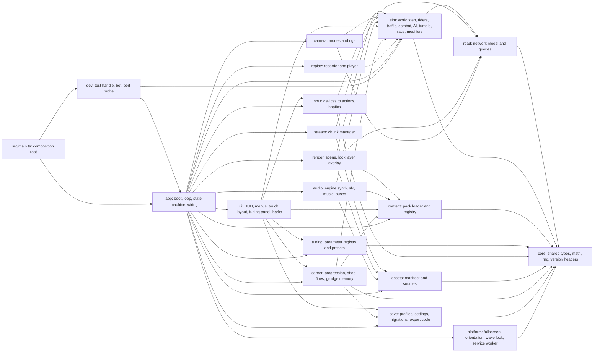

# throttlebrawl runtime architecture

## In plain words

This document describes how the game is put together inside, so that many coding agents can build different parts at the same time without tripping over each other.

- The game is split into separate parts: roads, simulation, controls, graphics, camera, sound, menus, saves, career rules and content. Each part lives in its own folder, has one owner at a time, and talks to the others through a small, fixed set of shared types.
- The **simulation** is the "rules of the world": where every rider, car, pedestrian and cop is, who hit whom, and who won. It runs in fixed ticks, like a board game played 60 moves per second, and gives the same result every time for the same inputs. Graphics and sound only *watch* it. That is what makes replays, robot test players and a future multiplayer mode possible.
- The world is a **network of roads** joined at junctions. Everything on a road is placed by "how far along" and "how far across" the road it is. Only a crashing rider tumbles freely through 3D space, and then lands back on the road model.
- Controls on the phone, keyboard, gamepad and tilt all turn into the same small list of actions, so the game never cares which one you used.
- The visual style is chosen after milestone 1, so the "look" is a swappable layer. The same applies to the photocopied-zine overlay.
- Saves, replays, tuning presets and content packs all carry version numbers, so old files keep working after updates.
- Rare "weird events" (a parade, a hurricane gust, a bounty on you), radio stations by genre and region, and a "cut this" veto you can trigger on any line, billboard or sign are all designed in as data and small seams. Most of them are built later; the seams are fixed now because they are hard to add afterwards.
- Performance budgets for the Galaxy A16 5G are written down as starting numbers, to be corrected once the real phone is measured.

## Tags used in this document

Every non-trivial choice carries one tag:

- `[decided]` traces to a maintainer answer.
- `[default]` is a proposal the maintainer or a later agent may change. Many of these are hard-to-change technical calls (such as a fixed-rate sim, versioned saves and packs, and one GIS coordinate system) that the maintainer delegated to the coordinator, who reports them.
- `[open]` needs the maintainer and is listed in [Open decisions](#open-decisions).

Sibling docs: content file formats live in [content-packs.md](./content-packs.md). This document owns the runtime side: the registry and the loading boundary ([Content registry](#content-registry)).

## Design principles

- `[decided]` TypeScript, Three.js and Vite, installed with npm. The simulation tracks riders in road coordinates. Tracks, rivals, bikes and taunts are data. Nothing blocks multiplayer. Every race quietly records its inputs.
- `[decided]` "focus on velocity not a million redundant checks": design only what is hard to change later, and leave seams for everything else. This document therefore fixes **contracts** (types, coordinate conventions, versioned formats, dependency directions). It does not implement shelved features.
- `[decided]` throttlebrawl is a **codename**, and the real name comes before M5. `[default]` No persisted identifier is derived from the name: save formats, export prefixes and storage keys are name-neutral, and the one place the app id appears is a single constant in `platform/`. A rename is then a one-line change plus a storage-key migration step that reads the old key once.
- `[default]` Things treated as hard to change, and so fixed here: the sim/render split, the tick rate and determinism rules, the road coordinate convention, the world coordinate system, the per-tick input command, the snapshot and event contracts, and version headers on every persisted format. Everything else is a seam.
- `[default]` SI units inside the code: metres, seconds, metres per second, radians. Display units are a setting `[decided]`.

## Module map

`[default]` The source tree is split into modules with disjoint folders. A lane (one agent working on one area) owns one folder at a time and edits only inside it. Other modules are reached only through that module's `index.ts`. Two exceptions: the sim through its contract `api.ts`, and dev/, which only `main.ts` imports, through `index.ts` (loaded lazily, off the first-load JavaScript budget) and `boot.ts` (the small part that loads with the first screen: the test flag and the error capture). `[default]` (perf-gate lane, 2026-10-02: first-load headroom) And road's structure planners, `src/road/structures/*.ts` (the physical world, 2026-10-06): each is a lazy chunk, and the lazy render layer that draws one imports it directly, which through `index.ts` would put it in the first load (`scripts/module-map.mjs`). `[default]`

Arrows point from a module to what it depends on. `render --> sim` means "render imports the sim's public snapshot and event types", never sim internals. Every `--> sim` edge means "imports `src/sim/api.ts`" (types only), never anything deeper. Edges into `content` mean "imports registry read types".

`[default]` **This graph is the enforced allow-list.** A lint rule allows exactly these edges and nothing else, so a wrong import is a lint error rather than a review comment. It is a small local ESLint rule that reads the graph as data from `scripts/module-map.mjs` (chosen over per-folder `no-restricted-imports` patterns, which cannot resolve relative paths, and over `eslint-plugin-boundaries`, one more dependency); a unit test checks that file against the graph above, edge for edge. An agent that needs an edge that is not drawn changes this graph and that file in the same contract PR. `[default]` (2026-10-06) A module's public entries are its `index.ts` (the sim's `api.ts`; dev's `index` and `boot`), and the road's also include the structures' planners, `src/road/structures/*` (`PUBLIC_ENTRIES` in that file): render's lazy layers read a district's layout from them directly, and the road's index never re-exports them, because a static import from the index would pull the planners into the sim chunk and the first load ([physical world](#physical-world)).

### Ownership table

| Folder | Owns | Typical lane |
|---|---|---|
| `src/core/` | shared low-level types (including the touch-layout record type), deterministic math tables, seeded RNG, version-header helpers | coordinator (contract owner) |
| `src/road/` | road network data model, arc-length tables, (edge, s, d) ↔ world queries, junction lookup | road-network lane |
| `src/sim/` | fixed-step world, sub-folders `riders/`, `traffic/`, `peds/`, `cops/`, `combat/`, `ai/`, `tumble/`, `race/`, `modifiers/` | sim lane; sub-folders can be split across lanes |
| `src/sim/api.ts` | public sim contract, types only: `SimInput`, `SimSnapshot`, `SimEvent`, `SimConfig`, `createSim`. Every presentation module may import it | coordinator (contract owner) |
| `src/content/` | pack loading, validation calls, merge, registry | content lane |
| `src/tuning/` | the parameter registry and preset load/save (declarations live beside the systems they tune, gathered by `app/`) | tuning lane |
| `src/input/` | touch, keyboard, gamepad, tilt devices; action mapping; haptics output | controls lane |
| `src/assets/` | asset manifest, baked and remote sources, cache | infra lane |
| `src/stream/` | chunk activation around focus points | infra lane |
| `src/render/` | Three.js scene, road mesh builder, entity views, quality tiers, look styles, post and overlay | render lane |
| `src/camera/` | camera modes, spring rigs, shake, FOV kick | camera lane (may share with render) |
| `src/audio/` | WebAudio graph, engine synthesis, SFX, music layers | audio lane |
| `src/career/` | progression, event objectives across races, tiers and unlocks, shop and cash ledger, fines and failure-mode policy, grudge memory (DOM-free; a M4 module, an empty seam before that) | career lane (M4) |
| `src/platform/` | fullscreen, orientation lock, wake lock, service worker, the Start-tap sequence, the app-id constant | infra lane |
| `src/ui/` | DOM HUD, menus, touch-control visuals and layout editor, barks and interludes, what's-new card (everything except `ui/tuning/` and `ui/narrative/`) | UI lane |
| `src/ui/tuning/` | the tuning panel | tuning lane |
| `src/ui/narrative/` | barks (shown on the HUD ticker), "cut this" and interludes | narrative lane |
| `src/save/` | versioned profile and settings records, migrations, export codes | infra lane |
| `src/replay/` | input recording, playback, desync check | infra lane |
| `src/app/` | boot, main loop, game state machine, wiring of all modules | coordinator / integration lane |
| `src/dev/` | `window.__game` test handle, bot player, perf probe, debug report | QA lane |
| `tools/` | Node scripts: pack validation, bakes (GIS later) | per task |
| `tests/` | headless sim batches, browser end-to-end, perf runs | QA lane plus each owner's unit tests beside their code |

`[default]` One lane may own several disjoint folders (for example the tuning lane owns `src/tuning/` and `src/ui/tuning/`); what matters is that no folder has two writers.

### Dependency rules

- `[default]` `core` imports nothing from the project. `road` imports only `core`. `sim` imports only `core` and `road`. The sim reads content and tuning as **plain data handed in through `SimConfig`**, never by importing `content/` or `tuning/`.
- `[default]` The sim is DOM-free and Three.js-free. It gets its own `tsconfig` with `lib: ["ES2022"]` (no DOM types), and an ESLint `no-restricted-imports` rule bans `three` and every project module except `core/` and `road/` (and, inside `sim/`, `sim/` itself) from `sim/` and `road/`. Breaking the split becomes a compile or lint error, not a review comment. The determinism bans for `Math` and clocks ([Determinism rules](#determinism-rules)) are lint rules in the same config.
- `[default]` Presentation modules (`render`, `camera`, `audio`, `ui`) never write sim state. They read snapshots and events. The only way to change the world is a `SimInput` command.
- `[default]` Only `src/main.ts`, the composition root outside the module graph, imports `app/` and `dev/` (and `dev/` imports `app/` and `sim/` as drawn). Nothing else imports `app/` or `dev/`. `main.ts` injects the capabilities the graph does not draw as callbacks typed in `core/` (`onCopyReport`, `resumeAudio`, `recordTuningChange`, `packIndex`, `rendererStats`, `roadQueries`, `getReplayAndSettings`). Any other module that needs the layout record type finds it in `core/`, never in `ui/`.
- `[default]` (M1 app-1) The graph draws no edge to `core` from `app`, `ui`, `render`, `camera`, `audio`, `replay` or `dev`, so `src/sim/api.ts` re-exports the core types and helpers they need (the callback types, `TuningParamDecl`, the layout record and `placeElement`) and the road types `RoadNetwork` and `RouteProgress`. Each type is still defined once, in `core/` or `road/`; the re-export only carries it along a drawn edge. Likewise `stream/` (which may import `road`) builds the road network handle and the route tables that `app/` puts in `SimConfig` and hands to `render/` and `camera/`.
- `[default]` **Contract files** (`src/core/**`, `src/sim/api.ts`, the content schema types) change only in a small, dedicated "contract PR" that merges before the lanes that depend on it. Lanes that need a contract change say so in their report instead of editing it in their own branch. This is the main anti-collision rule for parallel agents.
- `[default]` **Exception until the walking skeleton exists.** Before the M1 walking skeleton (one crude race, playable on the phone end to end) is on `main`, every file is a contract and a contract-PR queue would be the slowest path to a playable build. Until then, one lane builds the skeleton vertically across all modules and owns the contracts. The contract-PR rule starts once the skeleton is merged.

## Simulation

### Fixed timestep and the loop

- `[default]` The sim steps at a fixed **60 Hz** (`dt = 1/60 s`). The maintainer delegated the tick rate. 60 Hz keeps input latency low and divides evenly into 60 and 120 Hz displays. A 90 Hz screen is handled by interpolation.
- `[default]` The main loop in `app/` uses `requestAnimationFrame` with an accumulator:
  1. Add real elapsed time, clamped to 0.25 s, to the accumulator. The clamp prevents a spiral of death after a stall: the game slows down rather than freezes.
  2. While the accumulator holds at least `dt` and fewer than 4 steps have run this frame, sample input into one `SimInput` per player slot and call `sim.step(inputs)`. Subtract `dt` after each step.
  3. If the cap of 4 steps was hit and the accumulator still holds at least `dt`, drop the backlog: `accumulator = accumulator % dt`. The game then slows down instead of freezing or drifting further behind.
  4. Render with interpolation factor `alpha = min(1, accumulator / dt)` between the previous and current snapshot, so a render never extrapolates past the newest snapshot.
- `[decided]` The game auto-pauses on an app switch, a screen lock or a call (`visibilitychange` to hidden, `pagehide`, a lost fullscreen), and resumes mid-race even after the tab reloads ([Resume after a reload](#resume-after-a-reload)). `[default]` A resume always lands behind the pause menu, never straight back into a race.
- `[decided]` (playtest 4, P4-11) **The race-start countdown** belongs to `app/`, not the sim. Every race holds at the grid for 3, 2, 1 (`src/app/countdown.ts`): a loop step that holds is not a sim step, so the sim stays at tick 0 for every rider, traffic and cop, nothing is recorded, and the replay starts on its first tick as it always did. What the player presses on the grid is sampled and dropped. The count is in loop steps (60 to a beat), so the lockstep seam and a paused loop keep it exact. `[default]` One second a beat, GO shown for 0.8 s of race; the beep is the `countBeat` cue on the effects bus, and GO's sound is the sim's own `raceStart` cue.
- `[default]` A frame-rate cap setting skips render frames only; the sim rate never changes. The options are divisors of the measured display refresh: full rate, half and a third (90, 45 and 30 fps on a 90 Hz panel; 60, 30 and 20 on a 60 Hz one). `[decided]` (cockpit answer, 2026-09-29): **smooth first**. The default is the display's full rate (60 fps or better), the picture gets softer under load through dynamic resolution rather than dropping frames, and a battery saver of about 30 fps (the divisor nearest 30) sits in settings. `[default]` Until dynamic resolution lands ([Quality tiers](#quality-tiers-and-dynamic-resolution)), the picture does not yet soften under load: a fixed pixel-ratio cap of 1.5 only lowers the steady load. Because the maintainer chose smooth first on the premise that resolution scaling protects the frame rate (`architecture-frame-rate-priority`), dynamic resolution is pulled forward from M5 as soon as a phone probe or playtest shows the default missing its frame interval.
- `[default]` The sim runs on the main thread in M1. Because it is DOM-free, it can move into a Web Worker later without a rewrite.

### Determinism rules

`[default]` Same sim code and sim content hash (together the replay key, see [Replay and input recording](#replay-and-input-recording)), same `SimConfig`, same seed and same input stream give the same state, tick for tick. That is what replays, bug reports and bot tests rely on. The rules:

- No `Date.now()`, `performance.now()` or `Math.random()` in `sim/` or `road/`. Time is the integer `tick`.
- Randomness comes from a seeded PRNG in `core/rng`, kept in sim state. There is one named stream per subsystem (traffic, ai, combat, peds, cops, tumble, modifiers), derived from the race seed, so adding a roll in traffic does not shift the AI's rolls. An entity added mid-race (a guest rider from a modifier, for example) draws from a substream derived from `(seed, subsystem, entityId)`, so its arrival shifts nobody else's rolls.
- No `Math.sin`, `Math.cos`, `Math.tan`, `Math.atan2`, `Math.pow`, `Math.exp` or `Math.log` inside the sim. ECMAScript does not pin these bit-exactly across engines and CPU architectures. `core/math` provides table-based or polynomial versions built from `+ - * /`. `Math.sqrt` is allowed; that its results match bit-for-bit across engines is assumed (unverified) and checked by the cross-architecture self-test ([Testing seams](#testing-seams)). These bans, plus `Date.now`, `performance.now` and `Math.random`, are an ESLint `no-restricted-properties` rule over `src/sim/**` and `src/road/**`, so an agent hits them at lint time.
- **Tables the sim reads are covered too.** Any table the sim reads (road profiles, arc-length tables) is computed with `core/math` or baked offline by a tool. Load-time code in `road/` follows the same math rules, so a browser cannot feed engine-specific numbers into the sim through the back door.
- Iteration order is explicit: entities are processed in ascending id order, and no gameplay code iterates over a `Map` or `Set` whose insertion order depends on timing.
- Prefer preallocated pools and no per-tick heap allocation in hot paths. This is for phone GC pauses, not for determinism. It is a nice shape from the start, and it is fixed only in hot paths that the soak report or the `?debug=1` overlay shows over budget (the M5 performance pass); there is no blanket rule or lint, so crude M1 code is not slowed down by it.
- Anything that changes outcomes is sim state or `SimConfig`: tuning values that affect the sim, the slow-motion toggle, assist levels, the event rules and the event modifiers. All of it goes into the replay header.

### Time scale: hit-stop and slow motion

- `[decided]` Burnout-style takedowns with a short in-flow slow motion, on by default and toggleable.
- `[default]` Hit-stop and slow motion live **inside** the sim as a `timeScale` state field (0 during a hit-stop, for example 0.3 during a takedown). The sim still ticks at 60 Hz and inputs are still sampled every tick. Only the physical `dt` used for motion is scaled, and attack wind-up, active and recovery timers scale with it, so the whole world slows together. This keeps replays exact and lets the player keep steering during slow motion. Durations and scales are tuning parameters. The `timeScale` field exists from M1 (constant 1); hit-stop and takedown slow motion switch on in M2.

### Sim contract (`src/sim/api.ts`)

`[default]` These are the shapes the rest of the game codes against. The field lists are the minimum, and the contract owner may add fields.

- `SimConfig`: seed, event definition (resolved from content), resolved rider, bike, weapon and traffic definitions, the road network handle, resolved event modifiers (see [Event modifiers](#event-modifiers)), the career's resolved grudge table (per rival toward each rider; empty before M4 `[default]`, persisted with the career `[decided]`), sim-affecting tuning values, `difficulty`, assist and slow-mo settings, and player slot count. `difficulty` is the resolved scales `{riderAggression, copFrequency, rubberBand}` (1.0 is Normal); the preset id travels for display only. `[decided]` Easy, Normal and Hard set rival aggression, cop frequency and rubber-banding, and assists toggle separately; `[default]` the struct shape. It exists from M1 with every value at 1.0, and M2 adds the preset resolution in `buildSimConfig`. `[default]` (M2 app-3) Assists are per player slot, `slots[i].assists {steer: off | light | strong, autoThrottle}`, which AI riders ignore; `speedMultiplier` is the lower-overall-speed setting in (0, 1]; `slowMo` is the takedown slow-motion toggle. The two newer fields are optional in the type so a hand-built config means "no assists, full speed"; sim code reads them only through the `sim/world` resolvers `slotAssists` and `speedMultiplierOf`, and `buildSimConfig` always writes them, so they are in every replay header. Render-only fields of the event definition (such as `timeOfDay`) are read by `app/` and passed to `render/`; the sim never sees them. `[default]` (run W-T, "the road fights back") `smashables` is the event region's live roadside smashables (`SimSmashableDef`: the item's veto reference, its kind from `SMASHABLE_KINDS` in `core/`, its takedown name, a weight, the road tags it stands on and its height); optional, so a hand-built config has none, and `buildSimConfig` always writes it. `[default]` (playtest 4, the hitbox audit's height contract, `core/heights.ts`) Three optional fields carry the drawn sizes the sim measures contacts against: `SimTrafficTypeDef.heightM` and `SimSmashableDef.heightM` (always written, resolved with their defaults) and `SimRiderDef.hitbox` (the rider's or its bike's contact box, written only where one is given; absent is the default 2.0 x 0.8). Sim code reads the first and the last through the `sim/world` resolvers `vehicleHeightM` and `riderHitbox`, so a hand-built config gets the defaults. See [Heights and hitboxes](./content-packs.md#heights-and-hitboxes).
  - `[default]` (playtest 3; the maintainer, round 1: "the field levels up every tier (tier 3 rivals ride bikes as good as your best)"; round 3, "Gentle climb") The career's field level reaches the sim two ways. `RaceSetup.fieldLevel` (a `FieldLevel`, `src/core/career-race.ts`: the pace, the rivals' and cops' bikes and the cops' top-speed cap, the rivals' health, power, aggression and signature rate, the cops' fines) is applied by `buildSimConfig` to the riders it resolves, and the event definition's optional `level` (`{aggressionScale, signatureGapScale}`) carries the two the AI applies itself: every rival's aggression times the first, on top of the difficulty preset, and each signature move's gap and spread times the second. `RaceSetup.eventPatch` (an `EventPatch`: a season's remix of the node) is applied to the event before anything reads it. The rivals' power scale rides in its own `SimRiderDef.levelPower` (left out at 1), apart from a rival's own `power`, and the combat system turns it into its hits on the player (`combat.levelPowerOnPlayer`, capped by `combat.levelPowerMax`). Left out, a config is byte-identical to before and no hash moves. The style rewards gain `perWheelieSecondCash` and `perDriftSecondCash`: an event file's own, else 2 and 3 times its `perOncomingSecondCash`.
- `SimInput` (one per player slot per tick, **quantized** so recordings are exact): `steer` int8 (−127..127), `throttle` uint8, `brake` uint8, and a flags bitfield: `attack`, `attackSideLeft`, `attackSideRight`, `kick`, `grab` (reserved, since grabbing is the same attack press during an opponent's wind-up), `lookBack` (camera only, ignored by the sim), `skipRunBack`, `pause` (ignored by the sim).
- `SimSnapshot`: tick, timeScale, and per-entity id, kind, mode (see [Movers](#movers-on-the-network)), road position, world position and heading (for render), speed, lean, attack phase, health, held weapon, and race progress. Audio, HUD and combat framing need more than that, so each rider entry also carries applied `throttle` (0..1), `rpm` and `gear` (derived outputs, never fed back into motion), `grounded`, `faction` (rider or law), `targetId` (the current auto-target), `aimId` (a player's rider only: the rider a tap would hit now, from `sim/combat`'s `aimPreview`, the rule the press uses; nothing draws it since the maintainer's 2026-10-05 veto of the target box, so a future faint cue could read it; playtest 4, P4-6) and `lastAttackerId`. From M2 the snapshot also carries `slowmo` (whether a takedown's slow motion runs, and its raw ticks left) and, per rider, `styleTally` (style cash this race) and `grudgeNotedBy` (the riders who noted a grudge against this one this race), and `tumble` (while a rider tumbles, the tumble system's rider and bike body centres and velocities, so render can cartwheel the bike clear of the rider; null otherwise) `[default]`. From playtest 2 it also carries `law` (the heat meter for the player in slot 0, from `sim/cops`: `heat` 0..1, its `tier` 0 to 3, and `lost` once a chase is shaken off), which the HUD's heat badge reads `[default]`. From the pitch deck's #13 ("Air that pays") each rider entry also carries `touchdown` (for a player's rider in the air: the forecast landing point on the ground, its heading, the seconds to it and whether landing now would be `crooked`; null otherwise), which render's chalk mark reads `[default]`. Each rider in the air also carries `floorY` (`[default]`, the maintainer, 2026-10-06; `floorOf` in `src/sim/riders/index.ts`): the world height of what lies straight below it, which render's shadow and the camera's air tip read (render's shadow falls on what a rider rides or is over: `groundYOf` in `src/render/shadows.ts`, his own height riding a roof or a deck, `floorY` in the air and overboard). The top of a support it is above (a truck's roof, a parked pickup) or a ramp truck's deck, else the road's surface; out past its road's edge (over a barrier) another road under it (`roadUnder`, the one the sim hands the rider over onto), else the water or the drop's floor, or the band's edge where ground lies past it; for a rider tumbling overboard (past a rail, through a gap), the water level its bodies fall to. It is absent for everyone else (a hand-built snapshot may leave it out: the road's surface under the rider, as before), and it only reads, so a race hashes as before. From run W-T it also carries `smashables` (the roadside smashables near the players, from `sim/smash`: kind, takedown name, world position and heading, `smashedTick` (-1 while it stands) and the world velocity of what hit it, which render throws the debris along) `[default]`. From run W-T (law with a personality) `law` also carries `citations` and `citationCash` (what a `citations` cop has written the player up for this race, billed at the finish), and `props` also carries sim/cops' own: the END OF JURISDICTION sign and a radar trooper's radar, with ids from `LAW_PROP_ID_BASE` `[default]`. The systems that own them (combat, race, tumble) publish them through `sim/world` helpers, so the snapshot needs no new wiring when they land. Presentation modules cannot read sim internals, so anything they need is added here rather than reached for ad hoc. Snapshots are written into preallocated buffers and double-buffered for interpolation.
- `SimEvent`: typed records `{tick, type, actor, target?, causeId?, data}` such as `hit`, `kick`, `weaponGrab`, `stealWindow` (a held weapon's wind-up has reached its snatch window: the glint and the audio cue), `crash`, `takedown`, `nearMiss`, `bust`, `siren` (the cop's chase cue, on and off), `jump`, `land`, `lapOrCheckpoint`, `finish`, `pedDive`, `cashAward`, `style`, `modifierStart` and `modifierEnd`, plus from M2 `slowmoStart` and `slowmoEnd` (a takedown's slow motion), `railOver`, `splash` and `respawn` (going over a bridge rail; since 2026-10-06 over any barrier, a crashed body or a flying rider, with `data.over`, `past`, `dropM` and `high`), `getUp`, `fistShake` and `grudgeNoted` (a knocked-off rival), plus from W-P `pedReact` (a pedestrian or animal reacting to a rider going by: `data.kind` is `jumpBack`, `fist`, `film` or `chase`), plus from W-Q `shortcutFound` (a player off a shortcut for the first time in a race: `data.gainM`, `data.savedS`, for the 'found it' stamp; a respawn is never a find, so a rider who falls from a staging hop and wakes on the highway is not stamped, and its fall pays no airtime, run A's live check), and from playtest 2 `heat` (the heat tier changed: actor = the player, `data.tier`, `data.from`, `data.heat`, and `data.lost` on a drop to 0 from a chase), and from run W-T `smash` (a roadside smashable broke: `data.prop`, `data.kind`, `data.name` and `data.takedown`; for a rider knocked into it who goes down, actor = whoever's hit sent them and target = that rider, sharing the crash's causeId, so the `scenery` takedown that follows can be named), and from run W-T `law` (a cop's habit showed: actor = the cop, target = the player, `data.kind` one of `LAW_EVENT_KINDS`: `relentless`, `radar`, `citation`, `bill`, `budgetOut`, `jurisdiction`; `src/sim/types.ts` lists each one's data), plus from W-T `throw` (a held weapon left the hand, thrown: actor = the thrower, who holds nothing from then, target = the rider aimed at, `data.weapon` and `data.pickup`, the flying pickup entity; its later `hit` or `attackMiss` shares the throw's causeId) `[default]`. A `takedown` event carries `data.kind` (`traffic`, `scenery` or `health`). A `style` event carries `data.kind` (`nearMiss`, `airtime`, `oncoming`, `takedownCombo` or `weaponSteal`) and a points value (`data.points`, in cash), and `sim/race` emits it; style cash comes from those five sources `[decided]`, scored from M2. `causeId` links chains (a kick causes a crash, which causes a car to brake). Audio, camera, barks, HUD and the debug log consume these.
- `sim.hash()`: a fast FNV-1a hash over the quantized state, used by replay desync checks and determinism tests.

### Controllers: every rider is driven the same way

- `[default]` Every rider, whether player, rival or cop, is driven by a **controller** that produces a `SimInput` each tick. Kinds: `HumanController` (from the input layer), `AIController` (runs inside the sim, deterministic, reads only sim state), `BotController` (test player, runs outside the sim and reads snapshots like a human would), `ReplayController` (feeds recorded inputs), and later a network controller. Controllers that run outside the sim (human, bot, network) have their inputs recorded; `AIController` inputs are not, because they are a deterministic function of sim state. Rival AI therefore drives through the same physics as the player, and a second human later is just another slot.
- `[decided]` Rival AI in v1 covers personality styles, grudge targeting, rival-vs-rival fights, weapon use and steals, and simple gang-ups (rivals may side with or against you). Deeper crews come later.
- `[default]` The mechanism: AI styles are named presets registered in `sim/ai/` (weights, thresholds and a behaviour set); a rider's `personality` numbers override them. The style ids are listed in [content-packs.md](./content-packs.md#rider-rivals-cops-player-presets).
- `[default]` A cop's `AIController` lives in `sim/cops/`, not `sim/ai/`: its `SimController` kind is `cop`, the controllers phase skips it, and the cops phase writes its command, which takes effect on the next tick. That keeps the chase and the bust in one folder, and the one-tick lag is deterministic like everything else. `[default]` (playtest 3, round 3: "rivals and cops stay on the highway") Cops do not share the rivals' per-rider shortcut roll, so the one rule for who takes a branch (`src/sim/ai/branches.ts`: a route's `aiTake`, else a branch holding a `gap` is shut to riders under `riskTaking` 0.8 and to the law, else `ai.shortcutChance`) is read by both: the rivals' roll at the start, and a cop's line, which keeps out of the split zone of a branch the law may not take.

### Event modifiers

`[decided]` Rare, data-driven race modifiers of all four kinds the maintainer wanted, "with room to grow": nature chaos (hurricane gust, gator crossing, cold-night iguana rain), human chaos (parade, funeral procession, spring-break convoy, offshore rocket launch), wasteland weird (cult roadblock, runaway boat on a trailer, a UFO billboard that comes true) and league stunts (a bounty on the player, double-cash zones, a guest "celebrity" rider). Their file schema (`event-modifier` entries) is owned by [content-packs.md](./content-packs.md#event-modifiers-weird-events); this section owns the runtime seam, because modifiers change outcomes and so must be inside the sim and inside replays.

- `[default]` `SimConfig.modifiers` is the list of `event-modifier` entries an event opted into and that the roll selected, resolved from the registry. Each carries a `kind` (`nature`, `human`, `wasteland`, `league`), a trigger (chance and a race-progress window), a duration and a list of `effects`. `effects` are a **closed list of registered behaviour ids** implemented in `sim/modifiers/` (for example a lateral gust, a hazard spawn, a cash-multiplier zone, a bounty, a guest rider), so a new modifier built from existing effects is data only and a new effect is a code change. Data never holds code.
- `[default]` What a modifier may do, through sim state only: add a traffic population or a scripted crossing, spawn an animal or prop, apply a force to riders, change cash rules (double-cash zones, a bounty), or add a rider slot (the guest celebrity). A modifier rolls only on its own `modifiers` RNG stream, so adding one never shifts another subsystem's rolls.
- `[default]` A modifier announces itself with `modifierStart` and `modifierEnd` `SimEvent`s, which `ui` (a warning card or bark), `audio` and `camera` consume like any other event.
- `[default]` Modifiers are part of `SimConfig`, so they are in the replay header and the sim content hash.
- `[default]` Timing: none of this is built in M1 or M2. Modifiers arrive in M4 or on the shelf; M1 ships only the empty `modifiers` list and the `modifiers` RNG stream. Presentation of a modifier (a billboard that "comes true", a funeral-procession model) is ordinary content and rendering.
- `[default]` (W-P, the maintainer, 2026-10-01b: the worlds feel empty; "events and set pieces: roadwork, crash scenes, parades, a farm truck shedding hay, speed traps") The first effect is built ahead of M4: `set-piece`, whose `piece` is a closed list in `sim/modifiers/setpieces.ts` (`roadwork`, `crash-scene`, `parade`, `hay-spill`, `speed-trap`). `buildSimConfig` resolves the event's opted-in entries into `SimConfig.modifiers` (`app/modifiers.ts`); at init the sim rolls each one's chance on the `modifiers` stream (scaled by the `modifiers.setPieceChance` slider), keeps up to the event's `maxPerRace` by `rarityWeight`, and places each on open road in its progress window. A piece wakes when a racer is 350 m short of it (`modifierStart`, the bark cue) and clears once every racer is past (`modifierEnd`). Its vehicles are traffic entities placed through `placeVehicle` and held on the verge (a stopped vehicle in a one-lane direction walls the road for the rival AI and the bot); its props reach render through `SimSnapshot.props`. The other reserved effects stay on the shelf. `[default]` (playtest 3) The `moving-ramp` piece is a vehicle that drives on and becomes a jump: it publishes the `decks` registry the riding model reads (see [Jumps, ramps and airtime](#jumps-ramps-and-airtime)), so this phase, which runs last in the tick, writes the state the riders read at the start of the next. `[default]` (the maintainer, 2026-10-06: "a road race in a physical world with honest edges") Every prop is met by the one rule ([content-packs](./content-packs.md#contact-outcomes-one-rule)): the light ones (a sign, the radar) and the people in this phase, against the riders' boxes (the law's own sign and radar too, `src/sim/modifiers/law-props.ts`: sim/cops puts them up, this phase meets them, and a radar knocked flying is read back by `lawProps` from `sim/cops/law-knock.ts`); the solid parts (a lane vote gantry's post, a float's centrepiece) through a second registry the same way as the decks, `PIECE_SOLIDS_KEY` in `src/sim/riders/features.ts`, which the riders meet as solid road hazards; and what rides a vehicle is drawn inside its box.

## Road network

`[decided]` One connected road network: roads linked at junctions, each road with along and across coordinates. Free roam on roads with traffic, bikers and cops, and races as routes through it. Designed for chunk streaming.

### Data model

`[default]` The model borrows the "roads, lane sections, junctions with connecting roads" idea from road-simulation formats, cut down to what an arcade game needs.

- **Edge (road)**: `id`, a centerline curve, length `L`, and profiles sampled along arc length `s` at a fixed spacing (2 m default): world position, tangent, signed curvature `kappa` (1/m), elevation, bank, left and right drivable width, surface type, and scenery tags. Profiles are precomputed into typed arrays by the bake tool or at load time (with `core/math`, see [Determinism rules](#determinism-rules)), and queried by interpolation. The runtime never evaluates splines per tick.
- **Centerline source**: hand-authored control points (Catmull-Rom) for M1 tracks, or a baked GIS polyline from the side-quest lane that has run since M1 `[decided]` (the real Overseas Highway built from public data in the same road format; in M2 the maintainer rides both roads and picks, the pick becomes the career's road, and the other stays as an alternative route, `[decided]` cockpit answer, 2026-09-29). Both end up as the same sampled tables, which is the format-level seam the GIS research recommended.
- **Lane sections**: an edge is divided along `s` into sections, and each section lists its lanes as `{dCenter, width, direction: +1 | -1, kind: drive | shoulder | shortcut}`. `direction −1` is an oncoming lane: its traffic moves toward decreasing `s`. `[default]` (W-Q, interview 2026-10-02) A section also has 1 to 3 drive lanes per direction, an optional median and a **verge band** per side past its outermost lane (width, surface and the edge kind that stops a rider), given in the road file or derived from its tags and barriers ([content-packs](./content-packs.md#road-file-regionsregionroadsidjson), "Cross-section"); `road/` answers `crossSectionAt`, `vergeAt` and `groundAt`.
- **Junction (node)**: the joins between edge ends. A junction owns short **connector edges** (ordinary edges, usually generated), and a table `(fromEdge, fromEnd, fromLane) → (connectorEdge) → (toEdge, toEnd, toLane)`. Every mover is therefore always on some edge, even inside a junction.
- **Splits and merges** (for example, the ramp shortcut leaving and rejoining the main road) are junctions too. At a split, a rider's lateral position `d` in a marked **split zone** decides which connector it takes. No button press is needed.
- **Features** are ranges along an edge: `{edgeId, s0, s1, d0, d1, type, params}`. Types include `ramp` (a lip in the elevation profile), `gap` (no surface, so fall or jump), `hazard`, `roadsideZone` (pedestrian or animal spawns, landmark set dressing), `copSpawn`, `raceMarker` (later, for world race markers), and `billboard`, plus (playtest 1b quick wins) `boostPad` (a short speed boost) and `rampTruck` (a parked car-carrier whose rear deck is a jump ramp, covering only its own width; see [content-packs](./content-packs.md#road-file-regionsregionroadsidjson)), and (playtest 3) `landmark` (a real structure beside or over the road, drawn by render, ignored by the sim; see [Jumps, ramps and airtime](#jumps-ramps-and-airtime)). They are data, seeded, and easy to add. `[default]` (run W-U, the pitch deck's #12: the ferry deck's parked pickups and coffee cart, the clear-cut's stumps, the festival's chainsaw bears) A `hazard` with `params.solid` is a wall box for a riding rider (`src/sim/riders/features.ts`): head on it stops him, a crash at or above `riders.crashImpactMps` and a wobble below; from the side it holds him beside it and he scrapes along, like a barrier; flying into it below its `params.heightM` is a crash. Events carry its `params.object` and id. It stands off the lanes (the road lint refuses one over a lane), because traffic, the rival AI and the tumble do not see it; render draws it by its `object`.

### Coordinates

- `[default]` A road position is `{edge, s, d, h}`. `s` is metres along the edge centerline from its start (0..L). `d` is the metres across, **positive to the right** when facing increasing `s`. `h` is always metres above the road surface at that `(s, d)` (0 when grounded); see [Jumps, ramps and airtime](#jumps-ramps-and-airtime) for how an airborne mover keeps its absolute height separately. `[default]` Sign conventions are defined once, in `road/`, and [content-packs.md](./content-packs.md#units-and-axes) links here: signed curvature `kappa` is positive when the road turns right (toward positive `d`), and `bank` is positive when the surface tilts down toward positive `d`.
- `[default]` A mover on an edge also has `dir` (+1 or −1), its travel direction relative to `s`, and `yaw`, its small heading offset from the road tangent, positive toward positive `d` (this is what steering changes). Riding the wrong way down a lane is just `dir = −1` on a `direction +1` lane.
- `[default]` **Kinematics on a curved road.** For a mover with speed `v` on an edge at offset `d`, using `core/math` trig and `kappa` sampled at `s`:
  - `ds/dt = v·cos(yaw) / (1 − kappa·d)`, with the denominator clamped to at least 0.1;
  - `dd/dt = v·sin(yaw)`;
  - `d(yaw)/dt = (rider's own turn rate) − kappa · ds/dt`, because yaw is measured from a tangent that itself turns.

  Without the `1 − kappa·d` term, a rider on the outside of a bend would cover more ground than one on the inside at the same speed, and placing, rubber-banding, reach boxes and the tumble hand-off would all be skewed. For `dir = −1` the sim flips the signs of `ds/dt` and of the yaw coupling; the sim lane owns that detail and covers both directions with a unit test. The pack validator enforces `|kappa| · dMax < 0.5` on every lane section, where `dMax` is the widest drivable offset.
- `[default]` When `s` passes 0 or `L`, the mover transfers through the junction table. Overshoot distance carries into the next edge, and `d` maps through the lane mapping. A mover with no valid connection (a dead end) hits a barrier.
- `[default]` `road/` exposes pure queries: `toWorld(edge, s, d, h)`, `frameAt(edge, s)` (position, tangent, normal, up, bank), `surfaceHeight(edge, s, d)`, `lanesAt(edge, s)`, `nextEdges(edge, end)`, `project(worldPoint, hintEdge?)` (world to nearest road position, used by the crash tumble), and `neighbours(edge, s, range)` for cross-edge proximity near junctions.

### Races as routes

- `[decided]` Races are routes through the network, started from menus in M1 and from world markers later. Race length is selectable.
- `[default]` An event definition names a start (edge, s, dir), a finish, an **allowed edge set** (the main route plus legal shortcuts), and optional checkpoints. At load, the race module computes a **distance-to-finish table** for every allowed edge. Race progress, placing and rubber-banding all read that one number, so the ramp shortcut automatically counts as progress. Leaving the allowed set (free-roam detours) shows a wrong-way indicator and does not add progress.
- `[default]` Selectable length is data: the same route with a different finish `s`, or a looped route with a lap count.
- `[decided]` (the maintainer, 2026-10-06: "a corner cut across the roofs or a lot counts if the rider rejoins the course ahead") `[default]` as built: a racer off the course's roads (out past its road's edge in the air, up on a roof past its band, or down past the edge until the respawn: `offCourse` in `src/sim/riders/index.ts`) keeps the progress and distance to finish it had where it left, and they are measured again where it rejoins: ahead it counts, behind it is no gain, and a reset out of bounds wakes it where it left the road (`left` in `src/sim/riders/gap.ts`, kept across a run on the roofs), so the lot gains nothing. A road reached through the air is still no shortcut found (the stamp's rule above).
- `[decided]` **Branches and U-turns** (interview, 2026-10-02: "junction choices in races", "U-turns", marked dirt shortcuts). `[default]` the contract (run W-Q): every split zone on the main path that leads onto allowed roads is a branch, picked by position in the zone, and a route file may name it (`branches`: id, roads, `shortcut`/`detour`/`alternate`, marked or secret, a sign; [content-packs.md](./content-packs.md#route-file-regionsregionroutesidjson)). `RouteProgress` gives `branches`, `branchAt(edge)` and `orientation(edge)`, the direction along an edge toward the finish. A rider's heading sign on the route is its `road.dir` times that orientation: 1 racing, -1 after a U-turn. The snapshot carries each rider's `branch` and `routeDir`. `[default]` How a U-turn is made (run W-R, `src/sim/riders/uturn.ts`; its own gesture since playtest 4, P4-9, `[decided]`: "Its own gesture probably makes sense"): a rider driven from a player slot, at or under `riders.uturnMps` (12 m/s), who makes the gesture, a short tap of the brake with the bars under half lock (under 0.35 s), then a second press within 0.45 s that is held with full lock, pivots toward that side at `riders.uturnRate` (2.4 rad/s), past the normal heading limit (from a standstill, on the spot); once started only the full lock is needed, and the speed stays under the limit. Past square to the road its `dir` flips and its heading offset moves by half a turn, so the world heading is unbroken; lined up the other way the turn ends, and another waits until the bars leave full lock. A kerb met mid-turn holds the bike in and scrapes speed off, never a crash. The gesture is read from the brake and the bars alone (so the touch brake button, the brake key and the pad's trigger all make it, and the replay needs no new input); its state is plain numbers per rider (`uturnTap`, `uturnClock`, `uturnDown`). AI rivals and cops never turn round, and hard braking into a tight corner, held or stuttered, never starts one (the old rule, brake and full lock at 12 m/s or less, flipped a phone rider on Lombard's first bend). Race progress needs nothing new: it is the distance to the finish at the rider's position, so riding back loses it and turning again regains it. Riding back (`routeDir` -1) earns no near-miss or oncoming style cash.

## Movers on the network

`[default]` Each dynamic entity has a **mode**: `Road` (grounded on an edge), `Airborne` (in a jump, still in road coordinates), `Tumble` (free-body crash, world space), `OnFoot` (running back to the bike, road coordinates), and a reserved `Free` mode that is **not built** (see [Crash tumble](#crash-tumble)).

- **Riders** `[default]`: longitudinal speed from throttle, brake, drag and grade. Lateral motion from `yaw` and speed. Lean derived from lateral acceleration for visuals and combat reach. `d` is clamped to drivable width plus shoulder, and going past the shoulder or into a barrier is a wobble or a crash, depending on speed and angle (tuning). Arcade and weighty handling `[decided]` is a tuning target, not a physics model. `[default]` **Bend room** (playtest 4, the maintainer on the Gorge: "the first couple turns are very very prone to crashing"): faster than full lock can hold a bend (about √(4 · steer rate · radius)), the bike runs wide at a steady rate whatever the rider does, so a rider the bend carries onto its outer barrier or rail while holding the bars into it (half lock or more toward the bend's inside, on a bend of 400 m radius or tighter) crashes only from `riders.bendEdgeForgive` (3) times the barrier crash speed, and scrapes and wobbles below it, as drift room does for a slide (`src/sim/riders/index.ts`, `bendCarried`). Steering straight or away from the bend, the old rule; the key absent (or 1), the old rule everywhere.
- **The ground beside the road** `[decided]` (interview, 2026-10-02: "Anywhere with ground", a ridable band beside most roads with water, ferns and kerbs as the real edges). `[default]` the contract (run W-Q, `src/sim/ground.ts`): the switch `ground.offRoad` (off by default, so existing races and recordings run as before) lets a rider's `d` run past the lanes to each verge band's outer edge (`rideLimits`, from road/'s `vergeAt`), where the band's edge kind (`soft`, `brush`, `water`, `hard`, `fence`, `rail`) says what stops it; `groundUnder` gives the surface under the wheels (the road's, `shoulder`, a band's, or none in the air), and `ground.<surface>.grip` and `.speed` scale steering and top speed on it (`SURFACE_FEEL`). The snapshot carries each rider's `ground`. `[default]` As wired (run W-R, `src/sim/riders/verge.ts`): the switch is on by default (a race whose tuning leaves it out, every recording made before, rides with it off, exactly as before). Each edge kind's outcome: `soft`, the ground runs out and the rider is held there with a little drag and no event (the old rules: with the course's honest edges on, the default since 2026-10-06, nothing is drawn at a soft edge, so it holds nothing and past it is out of bounds, [Physical world](#physical-world)); `brush`, held with a heavy drag and a `wobble` (`cause: 'brush'`) on a real hit, never a crash; `water`, the same with `cause: 'water'` (render's splash); `hard` and `rail`, the M1 barrier rule; `fence`, a new contact at `riders.fenceSmashMps` (3 m/s) or more across it smashes an 8 m stretch open (one `wobble`, `cause` and `object` `fence`, `smashed: true`, the side and the stretch's `s0` and `s1`): the rider loses 30 % of its speed, bursts through into a 6 m yard with a soft edge (with the course's honest edges, past the yard's end is out of bounds), and the gap follows it while it rides along behind the line; slower, the fence holds with a scrape and a wobble that never crash. Smashed stretches stay open for every rider (`vergeState`). The ground's `speed` scales a rider's top speed and push and its `grip` the steering, only with the switch on. Over a split's guide span the zone's side keeps the lanes' edge for a rider still on the road, so an early commit slides onto the branch as before (playtest 1b, 1c); a rider already out on the verge stays out. `[default]` (playtest 4, R3's open item) A **staging road** (a `rampTruck` with a `gap` starting within 10 m past its lip, as the Seven Mile's turn-off and way back, and the short connector of at most 100 m that leads onto one; `stagingGuideAt` in `src/sim/riders/features.ts`) guides like a split's span: a rider held against its edge slides along it, with no scrape, no speed lost and no event, so a rider who keeps holding right after the split still reaches the hop at speed. `riderLimits` is the one limit for riding, combat's shove and the riders' bumps, and the tumble's wall reaches the band's edge too, so nothing snaps a rider on the verge back onto the road. `offRoadOf` (a rider on loose ground: dirt, gravel, sand or grass, a band or a dirt road) is what the cops' heat meter reads to cool the heat when no cop is watching. Render draws the band, its edges and their dust, splashes and boards (`src/render/verge.ts`, a lazy chunk with the road). `[default]` **Bridge tapers** (playtest 4, the maintainer on the Historic Columbia River Highway: "when it goes from grass to bridge or whatever the rider clips from open air onto the bridge. You can see it happen if you stay to the far right"): a band used to end square where a bridge's deck began, so a rider out on it rode on past render's land (which stops 5 m short of a rail) and then jumped 2.5 to 6 m sideways onto the deck. Now `vergeAt` narrows every band into each bridge end at 1 in 10 (`BRIDGE_TAPER_SLOPE`, `src/road/bridge-taper.ts`): its width is capped by its width on the bridge plus 0.1 m per metre from the bridge's end, on both sides of the bridge and carried across a road's end into the next road (pass-through joins; a split's or a merge's join is the split guide's). So the band meets the deck's edge where the deck begins, and within 5 m of it the band is under half a bike wide. The band says so (`taper`), and the riding model's barrier rule eases a rider at a taper's edge in along it: no event, a heading toward the edge straightened, and the edge's own drag (the ferns, the sand) as anywhere along the band, so a rider who rode the verge wide does not reach the deck faster than one who ran into the ferns before the taper existed. The drawn band, its ferns and fences follow, because render reads `vergeAt` too. `tests/sim/geometry-bridge-ends.test.ts` sweeps every bridge end on every route network.
- **Roadside smashables** `[default]` (the pitch deck after playtest 2, #4 part 2, "the road fights back": lobster-trap stacks, mailbox rows and parking meters smash, "kick a rival into one for a named takedown in slow motion", and San Francisco's go to startup pop-ups and cafe tables, never Chinatown's shops; "some fences smash" is the maintainer's pick, interview 2026-10-02, built in run W-R above). How (run W-T, `src/sim/smash`): the event region's `smashables` (content-packs.md, "Region") reach `SimConfig.smashables`. On the first tick the sim walks the route's main way and stands a cluster (a row of mailboxes, a few meters, a table or two) every 150 m on average (`smash.density` scales the rate; 0 is none, and a race whose tuning leaves it out has none, so older recordings replay as before), on a random side, on the verge band 0.9 m clear of the outermost lane where the band has room, on open road (no bridge, causeway, barrier, split zone, ramp, pad, truck or cop lot, and 200 m clear of a road set piece), of a kind whose road tags cover the spot, all from its own `smash` substream of the race seed. It steps at the end of the peds phase (after combat, so a hit this tick counts, and before tumble, so a crash this tick tumbles on it; the tick order is unchanged). A riding rider whose box meets a standing one smashes it: if another rider landed a `hit` on him within 1 s he is knocked into it and goes down (a `crash` with `cause: 'smash'`, thrown on toward it; combat credits the `scenery` takedown and its slow motion as for any scenery, and a `smash` event with the crash's causeId names it, which the HUD pops as the takedown's name); otherwise he rides through with a wobble, a heading kick away from it and a little speed lost by kind, never a crash, and a player gains the heat a set-piece prop gives. A tumbling body smashes what it slides into. Smashed ones stay down for the race; the snapshot carries those within 450 m of a player, and render (`src/render/smashables.ts`) draws every standing one in the road events' still batch (one draw call for them and the event props standing still, `src/render/prop-batch.ts`, run W-T's draw-call headroom) and throws each smashed one's boxes along whatever hit it, on the sim's time scale.
- **Combat** `[default]`: an attack is a timed window with wind-up, active and recovery phases. A hit lands if the target is within the reach box in (Δs, Δd) during the active phase. Auto-target picks the nearest valid rider, and the side flags override the side `[decided]`. An attack starts on the tick its `attack` flag is set, and the side and kick flags may still change it during the wind-up (see [Input](#input)); the kick flag also converts an attack at most `combat.kickConvertMs` old in any phase, since a natural swipe-down outlasts the punch's wind-up (M2 combat-3, playtest 1). A **grab** is an attack pressed while the opponent's weapon is in its extended or wind-up phase `[decided]`. `[default]` Playtest 4 (P4-6): a player's press anywhere in a recovery (or during a stagger) is kept with its kick and side flags, the latest press winning, and starts on the first legal tick (run A's live check: the last 10 ticks alone dropped a mashing thumb's presses); a rival's hit locks the player's attacks only for the wobble he feels (the stagger times `combat.onPlayerScale`), so his attacks come back the tick it ends, and rivals keep their whole stagger; a player's kick has no cooldown (`[decided]` "No wait"; rivals keep the data's); an attack with no target re-aims every wind-up tick and, still without one, swings at either side; and a player's attack that touches its target in the riding phase's contact lands on him while he is within 3 m (contact holds bikes 2 m apart nose to tail, past a punch's or kick's reach), except that a clear side swipe never lands on a touched rider on the other side. Kick is a separate attack with its own timing window (the look-lab kick had no timing gate, which is flagged for the feel pass). Damage reduces health only; the bike is indestructible `[decided]`. `[default]` Weapons with verbs (run W-T, the pitch deck's #4) add three registered behaviours: `throw.burst` (Kevin's briefcase leaves the hand at the end of its wind-up, a `throw` event, and flies up the road as its own pickup entity, so the snapshot needs nothing new; it bursts on the first rider it meets, a `hit`, or where it lands, an `attackMiss`, both with `thrown`, `burst` and the burst point in world metres for render's paperwork; one throw and it is gone), `melee.yank` (the chain: the wrap's drag, and the shove pulls the target across the attacker's line to `combat.yankPastM` beyond it, so a rider yanked from his oncoming side ends in the oncoming lane) and `melee.sweep` (the campaign sign and the canoe paddle: one swing lands on a rider on each side, each shoved away, and spends one use). A weapon file's `spawn.regions` keeps a local weapon (the Keys' lawn flamingo, the PNW's canoe paddle, SF's dead rental scooter) off other regions' roads: `buildSimConfig` gives it roadside weight 0 there.
- **Street furniture** `[default]` (playtest 4; the maintainer, 2026-10-05: street furniture is "solid but maybe forgiving to sides, brushes, etc"): the hydrants, lamps, signal posts, street trees, benches, planters, meters, bins, boards and scooters on a city sidewalk (a ridable band) stand where `src/road/furniture.ts` plans them, from the road's tags and features and the race's seed (the render layers' own rules, moved there with the land themes and the scatter hash, `src/road/themes.ts`, so the sim may read them). Render draws the plan; the riding model meets it (`src/sim/riders/furniture.ts`): the bike is a capsule (the rider box with round ends), each piece its drawn footprint, and the first touch along a tick's move is decided by the one rule for heavy things, the closing speed along the contact's normal with #552's threshold, square on only when the piece stands in the bike's own line (`SOLID_GRAZE_M`; `meetSolid` in `src/sim/riders/index.ts`), which the solid road hazards now use too. The rival AI and the cops see the solid pieces and keep their lines clear of them (`furnitureSeen` in `src/sim/ai/sense.ts`). A `light` piece is ridden through with a smashable's wobble. A bike left on the road after a crash is solid by the same rule (pile-ups, `[decided]`, the maintainer, 2026-10-06: "Pile ups are fun lol"; `droppedBikeContact` in `src/sim/riders/index.ts`, reading the bikes `src/sim/tumble` parks), and the rival AI and the cops keep their lines clear of it too (`droppedBikesSeen` in `src/sim/ai/dropped.ts`); `riders.pileUps` switches it (absent in old recordings, which ride through it with a wobble, as before). Everything else render scatters keeps off every ridable band (`ridableBandPast`), so nothing drawn there is a ghost; the outcome table is in [content-packs](./content-packs.md#contact-outcomes-one-rule). Off with `riders.furniture` (absent in old recordings).
- **Nothing drawn stands in a lane** `[default]` (the [physical world](#physical-world) `[decided]` 2026-10-06: everything drawn that a rider can reach is physical at its drawn shape, and nothing is an invisible wall or a ghost). A thing drawn in a lane that a rider rides through is a ghost, so: no piece of street furniture stands on a lane of any road, its own, a branch's, a shortcut's or a neighbour's (`src/road/furniture.ts` drops a piece whose footprint comes within `FURNITURE_LANES_CLEAR_M`, 0.25 m, of one; the sim meets the same plan, so its pieces go too); a billboard or sign slot stands its posts, and its panel where it hangs lower than 2.5 m, 0.25 m off every road's lanes, moving out from its road up to 12 m (`boardOffLanes`, `src/render/boards.ts`); a road event's warning and serial signs stand past the outermost lane at their own spot, and on out until they clear every road's lanes (`signCd`, `src/sim/modifiers/setpieces.ts`; the cops' END OF JURISDICTION sign the same way), or are left out; and the road's tagged land never lies over another road's lanes by more than 5 cm, nor does its end curtain (`landOverRoad` and `curtain` in `src/render/road-mesh.ts`), nor do its shoulders, its verge band and its fascia (`EdgeLocator.clearReach` and `overLowerLanes`, `src/render/overlap.ts`: each stops 0.25 m short of a lower road's lanes, and the fascia only within 3 m of height, past which a road runs under a bridge); two roads that share the ground at different heights are not left to the render, because a road's drive surface cannot yield (the stair alley runs flat under Switchback Street's 11 m of road, so the street's hill starts past it, `tools/road/tracks/sf-hills.ts`). Every road's lanes under a point are found by `src/road/lanes-under.ts`. The per-PR check is `src/render/road-clear.test-util.ts` (with `road-clear-keys`, `-sf` and `-pnw.test.ts`): a column 0.5 to 2 m over every lane of every road of all 19 networks, which no drawn triangle may cut, and the road's own ground (land, shoulders, verge band, decks, paint) held to a height rule instead of a name skip: none may stand more than 0.15 m (a kerb) over any road's asphalt in that column. Its `KNOWN` list is empty (lane M1, 2026-10-06); a hit that cannot be fixed at its cause goes back on it, with the reason, and its fix deletes the line; `tests/sim/event-signs-clear.test.ts` draws every sign a seeded race puts up and holds it to the same column.
- **Traffic** `[decided: cars, trucks, oncoming lane, pedestrians and animals, wasteland oddities]` `[default: model]`: vehicles follow their lane using an Intelligent-Driver-Model-style car-following rule (so cars brake behind a crash for free), with occasional seeded lane changes and seeded route choice at junctions. Junctions have no signals in v1; a conflict zone acts as a virtual obstacle for yielding. Traffic is populated deterministically in a window around the **sim anchors** (see [Chunks](#chunks)) and recycled beyond it. Vehicle types (size, speed, behaviour flags) are content. `[default]` (playtest 4; the maintainer, 2026-10-05: "low speeds should wobble not crash, accounting for biker speed and traffic speed") Whether meeting a vehicle crashes you is **one rule** for every geometry (`src/sim/traffic/contact-rule.ts`): the closing speed along the contact's normal, from both bodies' velocities (along the road for an end-on hit, across it for a side brush or a corner graze, a kick's shove included), at `traffic.solidHitMps` (10 m/s) or more is a crash, anything slower a wobble, whatever the vehicle's size and however shaky the rider already is (until then end-on hits crashed from 6 m/s, while any truck touch and any touch during a wobble crashed at any speed). The ramp trucks and parked pickups sim/riders meets as solid boxes use the same rule and key. Kept apart on purpose: a wheelie into a car's back launches (#525), a light kerb rider is always soft (below), and riding into a ramp truck's body from up on its deck always throws you. `[decided]` Multi-lane highways with lane splitting (interview, 2026-10-02: "multi-lane highways (4-6 lanes, lane splitting)"). `[default]` how (run W-R, `src/sim/traffic`): a direction's traffic scales with its lanes (one car per `baseSpacingM` of lane, so three lanes each way carry three times a two-lane road's cars, under the hard cap), every lane gets cars, and where a lane ends (the corridor's lane map, from the lane sections) its cars merge inward a lane at a time when the next lane has room, braking for the lane's end until they can, and kerb riders move in to the narrower kerb in good time; nothing spawns in, or changes into, a lane that ends within `mergeLookM` (250 m). A road with one lane each way is exactly as before. A near miss whose rider had another vehicle just as close on its other side (threading between two cars, or a car and an oncoming one) carries `data.split`, and sim/race scores it `race.styleSplitScale` (2) times the near-miss cash. Riders get the same courtesy (`src/sim/riders/funnel.ts`): where the road narrows ahead, the edge on that side funnels in over `riders.laneDropTaperM` (90 m) and is fully in 2 m before the change, so a rider in a lane that ends is eased over with no barrier event, no sideways jump and no crash; roads whose width never changes near the rider compute nothing and ride exactly as before (`tools/road/lane-drops-live.test.ts`: on today's roads only the SF freeway, ridden back toward the city, has one). The first highway is San Francisco's Bridge Approach: two lanes each way, then three, to the finish. `[default]` Kerb riders yield (playtest 3: "bike riders cause collisions when they should arguably get out of the way off the sidewalk"; the maintainer's answer for the cyclist you still hit: you wobble and he topples onto the sidewalk, never a crash; run T4.1, `src/sim/traffic/kerb-yield.ts`): each tick, before car-following, a kerb rider checks every rider coming at it (from behind in its direction, or from ahead the other way, closing at `minClosingMps` (4 m/s) or more, within `lookS` (2 s) times `traffic.kerbYield` of contact, and inside `lateralM` (1.2 m) of its box at the kerb line or where it is). While one stands, and for `holdS` (0.8 s) after its box is 3 m past, it dodges at 3 m/s to the best spot: the verge for any kerb type (the verge band must be at least 0.4 m wider than it; a light one, `widthM` 0.7 m or less, rides 0.2 m past the road edge; every kerb type keeps its outer side inside the smashables' 0.9 m line, so the 1.3 m golf cart rides with its outer edge on that line and 0.4 m of it still over the road's edge: playtest 4, "golf carts and similar things should swerve out of the way", which on a Keys road moved the cart 5 cm before), the road's edge (0.05 m off it), or where it is, whichever leaves the most clearance to the nearest rider; it brakes to 0.6 of its cruise speed at 6 m/s² meanwhile. Then it returns to its kerb line at 1.2 m/s, waiting while a rider within 30 m behind it is still in its lateral band. Where the verge has no room (Duval's kerb, the Seven Mile's rail) any kerb rider hugs the edge as before. A first contact with a light kerb rider (`widthM` 0.8 m or less, the soft contact below; the golf cart is not one: the maintainer's answer, "Keep it a crash", so a solid rear-end into a cart still crashes the rider) (`traffic.kerbSoft` 1) is a `wobble` with `data.kerb`, never a crash, even when the rider is unstable from an earlier wobble: the rider keeps 85 % of its speed and is kicked 0.15 rad away; at 2 m/s closing or more the cyclist also topples (`data.toppleS`): speed 0 for 2 s, moved outward by the overlap plus 0.6 m inside the verge (or the road edge where there is none), skipped by contacts until it rides on. `[default]` Render draws the topple from the same event (`render/views.ts`): the cyclist's figure tips 70° away from the rider that clipped it in 0.2 s, lies, and gets up over the last 0.4 s of `toppleS`; a slow brush (a `wobble` with `data.kerb` and no `toppleS`) tips nothing. Both sliders absent (or 0) ride exactly as before, and no RNG draw is added. Rivals and cops are riders too, so they stop crashing into cyclists as well (balance note for the progression lane). `[default]` **Hairpin yield** (playtest 4, the maintainer on the Gorge: "the first couple turns are very very prone to crashing"; the field, carried wide round the Crown Point loop, met an oncoming car that had just been spawned beyond the loop): a vehicle waits 60 m short of a bend of 75 m radius or tighter (drift room's bend mask) while a rider is in it or within `traffic.hairpinYieldM` (250 m) beyond it, riding toward the vehicle, and drives on once they are through; one already past its wait line or in the bend drives on; and no vehicle spawns where it could not stop at its wait line in time (inside 60 m plus its comfortable stopping distance of the bend's mouth) while riders are coming round it. Riders going the vehicle's way never stop it, and nor does a rider standing still (under 2 m/s: a cop waiting on the shoulder, a rider stopped or down), who is not coming round the bend (polish H's live check: a deputy parked inside the reach held two oncoming cars at their wait line for the rest of a Bridge City race, and the riders who came up the road stopped nose to nose with them); car-following still stops a vehicle behind a rider standing in its lane. The key absent (or 0) is the old rule; no RNG draw is added.
- **Pedestrians and animals** `[decided: dive away cartoonishly, no gore, crash on big things]`: spawned from `roadsideZone` features, they cross or loiter in (s, d), and a threat check triggers a dive (a short scripted arc to the side). Big animals and objects use the crash rule. `[default]` Playtest 3 ("bike riders cause collisions when they should arguably get out of the way") adds gap acceptance, on by default (`peds.gapAccept`): a crossing runs in two stages, the near kerb to the refuge on the centre line and the refuge to the far kerb, and before a pedestrian steps onto the road, or leaves the refuge, it waits while a rider would reach the stage inside the stage's time plus a second. One caught on the road by a rider sooner than it expected hurries to the nearer end of its stage, and the dive stays the last resort. The worst-moment gag is a fake-out at the kerb (the pedestrian hops back as the rider passes), never a step onto the road. Cars are not gated. A `roadsideZone` with `params.kinds` spawns only those traffic types, from its own seeded stream ([content packs](./content-packs.md#road-networks-roads-and-routes)). `[default]` (playtest 4, P4-16) A zone with `params.everyM` and `params.maxPeds` is a crowd, a person every `everyM` metres up to `maxPeds` (`PEDS.crowdMinEveryM`, `PEDS.maxCrowd` bound them); Duval's party blocks are ten of them. `[default]` (playtest 4, the maintainer 2026-10-05: "most things on the sidewalks to jump out of the way"; "some things ... should be solid ... consistent and intentional") Every traffic type has a **roadside class** in `behaviour.roadside` (`src/sim/roadside.ts`; the table and the reasons are in [content-packs](./content-packs.md#roadside-classes)): `dodges` (people, small animals, light kerb riders: they get out of the way and a hit is never a crash), `yields` (big animals, carts: they get out of the way, and a hit is decided by its closing speed, the one rule below; playtest 4, "solid but forgiving": a big animal was a crash at any speed) or `solid` (the road's vehicles and parked oddities). The pedestrian module's contact crash, its reaction range for big animals and its lured step-out, and the kerb riders' soft contact, read the class, not `hazard` or the width, so a type's behaviour follows its data. A kerb rider that a rider is coming right up the verge at (its near spots leave under 0.3 m) also tries the far side of a wide verge and then the road clear of the rider (`traffic.kerbDeep`, on; light kinds only; `kerb-yield.ts` `deepSpot` and `inboardSpot`). Measured by `tests/sim/traffic-sidewalk-dodge.test.ts` (seeded rides up each region's busy sidewalks) and `tests/sim/roadside-classes.test.ts` (each shipped type, alone).
- **Cops** `[decided: chase and bust, hittable like riders]`: cops are riders with a `law` faction and a cop behaviour set. `[default]` (run W-T, the pitch deck's #11) A cop's `law.habit` gives him a way of chasing of his own (relentless, radar, citations or a pursuit budget; [content-packs.md](./content-packs.md#rider-rivals-cops-player-presets)), and a law crew's `jurisdiction.sign` reaches `SimEventCops.jurisdiction`, the sign that cools the heat. The spawn policy is a mix of tier-rising, every race and chaos-summoned, with some randomness `[decided]`; `[default]` the mechanism is event data. `[decided]` A cop who knocks you off busts you, and it costs a fine (interview, 2026-10-02: "it should only be a bust if the cop knocks you down (not just proximity and timing)"; revisit after a playtest). Crashing on your own near a cop is no longer a bust. `[default]` Bust detection is a radius plus a dwell time (both data) around the cop credited with the takedown, behind the `cops.bustKnockdownOnly` switch (0 restores the old proximity rule), and it fires a `bust` event. What a bust does to the race (end it, continue it, offer a retry) is **not** decided here: it is event-rule data set by the failure-state policy, which belongs to the game rules and `career/`, not to this document. That policy is `[decided]` (cockpit answer, 2026-09-29): Road Trip is the default (a fine never takes cash below $0), with Classic and Hardcore as later options ([product spec](./product-spec.md#failure-states)).

## Jumps, ramps and airtime

`[decided]` Jumps and ramps in v1, including one ramp shortcut.

- `[default]` Airborne movers stay in road coordinates. At takeoff, the sim switches the mover to `Airborne` when the surface falls away faster than gravity can follow (the ballistic height next tick is above `surfaceHeight`). While airborne, `s` and `d` advance with the takeoff velocity, the mover stores an absolute world height `yAbs` and a vertical velocity `vy` (gravity acts on `vy`), and each tick derives the API value `h = yAbs − surfaceHeight(edge, s, d)`. It lands when `h ≤ 0`. Grounded movers track `vy = v · dElevation/ds`, so takeoff is detected at a ramp lip. Presentation modules only ever see `h` (height above the road), which is what makes airborne bodies render neither sunk nor floating. Landing quality (lateral speed, lean, whether a gap was cleared) decides clean landing, wobble or crash.
- `[decided]` **Forgiving landings** (playtest 2, 2026-10-02: "It's too easy to crash after a jump"; the maintainer picked "Forgiving landings"). `[default]` the numbers: in the air the flight follows `riders.airCarve` (0.85) of the road's bend and the heading settles back along the road at `riders.airAlign` (2 /s), so a jump on a bend or a jab of steering mid-air comes down lined up. A landing wobbles from 30 % of `riders.landingCrashMps` sideways (now 11 m/s, was 4), and past 60 % it slides straight (heading cut to 30 %, the sideways speed and a tenth of the rest lost, `data.slide`); only at the crash line, or a drop of 22 m/s into the ground, does it crash. A landing while still wobbling is judged like any other. Measured on a seeded batch of 360 thumb-flown jumps (ramp onto a straight and onto a bend, a sharp crest; bars straight, a held thumb, or a jab of full lock): 153 went down before, 0 after (`src/sim/riders/landing-batch.test.ts`); on every route of the three regions (40 bot races, `tests/sim/riders-landings.test.ts`) no player landing crashes.
- `[default]` **Crest launch** (the W-O polish run, 2026-10-01). The one-tick ballistic test above only catches a kink such as a ramp lip, so a smooth hilltop never launched anyone: the real-road lane's bot never left the ground, even over the Russian Hill crest. A grounded rider on the road also takes off when following a crest needs more downward pull than gravity gives, by a margin: `along² × −κv × riders.crestLaunch > g × 1.2` (`CREST_MARGIN` 0.2), where `κv` is the road's vertical curvature from its grade 4 m either side (`CREST_SPAN_M`). It leaves along the road's smooth tangent and from the hilltop's smooth height (above the 2 m sample chord), so it is real air, not a one-tick hop, and one crest gives one jump (after a landing it re-arms only once off a launching crest). It leaves authored `ramp` features (and 4 m either side) to the lip rule, so a ramp still launches once. The `jump` event carries `crest: 1`. `riders.crestLaunch` (the tuning panel's "Crest launch") is 1 for plain physics, lower needs more speed, 0 turns it off; it stops at 1, because above it the launch would outrun the flight's own gravity. The hand-made humps' tops curve gently: the sharpest (San Francisco's second cable-car block, which has a crest lip anyway) needs about 53 m/s, against the starter bike's 44.7 m/s top speed (the overall-speed multiplier scales both alike). On the staged real roads it gives the Russian Hill crest its jump.
- `[default]` The known weakness of road coordinates is that an airborne body "bends with the road". The mitigation is an **authoring rule** checked by the pack validator: jump and gap features must sit on stretches whose curvature over the expected flight length is below a threshold. This is cheaper than a world-space flight mode, and it is enough for designed jumps.
- `[default]` A `gap` feature has no surface. A mover whose height `h` drops below the gap's kill depth becomes a crash and respawns on the nearest valid road.
  - Playtest 3's contract (the maintainer, 2026-10-03: "the 7 mile bridge has an old road parallel to it. Jumps could let you get from one to the other"; round 3: "the real 80 m missing span is the big jump (a miss = splash, respawn on the highway)"), read through `gapParams` in `src/road/types.ts`: over a gap's `s0..s1 × d0..d1` there is no surface. A grounded rider entering it falls (the surface fell away) and an airborne one never lands there; a rider more than `params.killDepthM` (1.5 m `[default]`) below the deck plane crashes overboard (`data.cause: 'gap'`), its tumble bodies fall through to the water (`splash` at the network's water level, sea level here), and it respawns at rest `tumble.splashPenaltyS` later. Where it wakes is `params.respawn`: `far` (the default) on the gap's own road at `s1 + params.respawnPastM` (10 m), which never strands a rider; `main` on the route's main road nearest the splash (the Seven Mile's Moser gap, by the maintainer's answer). Traffic never meets a gap: the bake puts gaps only on branch roads, which carry none. The hooks are `gapUnder` and `gapFall` in `src/sim/riders/gap.ts`; the tumble's part is in `src/sim/tumble/`.
  - `[default]` As built (T3.1; the queries in `src/road/gap.ts`): the crash carries `overboard: true`, `feature` (the gap's id) and `depthM`. A rider still above the kill depth but more than 0.4 m (`GAP_CLIP_M`) below the deck on its last tick over the gap hits the far deck's broken end the same way (`face: true`); less than that, it comes down on the far deck and the landing rules judge it. The tumble starts both bodies overboard on the crash's tick, each with a `railOver` carrying `gap: true` (render's burst; no rail), and a body that slides or falls into a gap later goes the same way, since a particle over a gap has no floor, so no body ever rests on one. The `respawn` event adds `gap` (the id) and `at` (`far` or `main`). `far` wakes the rider facing the way it was going along the route, carried onto the next road if the gap ends near one, and past any gap it would wake in; `main` takes the point of `RouteProgress.mainEdges` nearest the rider's splash, facing along the route. The road lint keeps gaps off the main path (traffic runs it) and flags a gap param the reader would replace with its default. No tuning, no state and no random draw: a race with no gap hashes as before.
- **Over the barrier** (the maintainer, 2026-10-06, on the phone: "it would also be cool if when airborne it was possible to go over and across barriers, possibly resulting in a crash like falling in the water or whatever"; then "consistent physics and gameplay is important here so players know what to expect and how to interact with the world"). `[decided]` (2026-10-06) high falls are "(a)": the same physics everywhere, the Golden Gate included, with a high drop shown as a clean cut-away and no gag; and "include landing on big solid things beyond vehicles". `[default]` The rule players learn, one rule with no hidden per-place exceptions: light things you ride through; solid things stop you below their top, and you can land on and ride any whose top is big enough to hold a bike (smaller tops, like a hydrant, bollard or lamp, are obstacles you meet from above by the closing-speed rule); **a barrier holds you only below its top, and what lies beyond decides what happens.** Landing on and riding solid tops is its own lane's work; the barrier half is built here. As built (`src/road/beyond.ts`, `overBarrier` and `overFall` in `src/sim/riders/gap.ts`):
  - What stands at a band's outer edge (`edgeTopAt`): a barrier's own `heightM` (every rail and wall; the road lint refuses a barrier with none); a derived `hard` edge's drawn top, by the land tag that gives it (`EDGE_TOP_BY_TAG`: Chuckanut's parapet 1.26 m, the interstate's guard rail 0.76 m, the car ferry's bulwark 2.6 m); nothing (0) at a `water` edge; and a wall at any height at a **building front** (`BUILDING_FRONT_TAGS`: the towers, shopfronts, mural walls, row and painted houses, Duval's and the waterfront's buildings, the ferry hall, the pier sheds, the cafes, the festival's storefronts). Since the sim meets the structures plan (2026-10-06, [Physical world](#physical-world): a building a wall up to its roofline, its roof a place to land, `[decided]`), a building front whose buildings are in the plan is no wall in the air (0 to this rule): the buildings themselves stop a rider below their roofs and take him onto them above; the fronts whose buildings are not in it yet (the row and painted houses) stay walls at any height. A `hard` edge no tag covers (nothing drawn there: the sliver at a few bridge ends, the Plaza Cut's left side, the fictional Bay bridge's approaches) stays the old wall too. Ground edges (`soft`, `brush`, `fence`) are not barriers: the band's own edge rules hold there, in the air as on the ground.
  - What lies past it (`pastAt`): `water` where a `water-*` tag covers the side or the edge is a water edge; a `drop` past the bluff, a bridge or trestle with no water tagged under it, and any `rail` (rails stand only on bridges and drops, [decided] in the product spec); else `ground`. Another road under the rider is found by `RoadNetwork.surfaceUnder` (the old Seven Mile Bridge beside the new one, a parallel road).
  - `[default]` (2026-10-07, the one live check's mustFix 4: a high fall past Chuckanut's parapet sank 70 m through the grassy shelf the scene draws there at the road's height) With the course's honest edges, what lies under a rider out past the edge is **what the road scene draws there**, read each tick as he flies on (`beyondAt` in `src/road/beyond.ts`, on `src/road/drawn-ground.ts`): ground at its own height where ground is drawn (the road's shoulder out to its drawn verge and its land strip, where that runs a bike's width past the edge, `HOLDS_BIKE_M`, so a deck's 0.55 m lip outside its rail is passed over; the land under a roadside zone; a split zone painted off the road; a lake's bank and shore; past the strip the terrain skirt's slope and flat ground and a shelf gentle enough to hold a bike; another road's ground under him, a bank up to 3 m over the deck included), and only where none is drawn the tags (`pastAt`) and a drop where they say ground. So Chuckanut's shelf is ground (out of bounds onto it: the quick reset, no drop), and the drop is past its lip, where the bluff falls away; a mangrove key's land past its water edge is ground; nothing drawn past a wall on an untagged deck is a drop. The crash's `floorY` and `dropM` are that ground's. Crashed bodies meet the same rule at the barrier line (held there over ground, as at a ground edge). `drawn-ground.ts` is render's own rules for that ground (the strip, the skirt, the shelf, the zones' land, the split paint, the lake bank) read from the network alone, so it builds into the sim chunk; `tests/sim/beyond-drawn.test.ts` holds the sim's floor to the drawn scene along every edge of every route network (462,874 points every 4 m at eight distances out to 12 m; the roads still off, with why, are its `KNOWN` list: Lake Samish's one water level stands under falls where the sea is drawn, which needs the lake's outline in the sim). The old rules (`riders.courseEdges` 0) keep the tags, decided once at the crossing.
  - Each network has a water level (`WATER_LEVEL_M`, `waterLevelOf`), which is also a drop's floor: sea level, 0, everywhere but Lake Samish (82.85 m, its backdrop's water floor; `tests/sim/over-barrier-roads.test.ts` holds the two together). Where nothing is drawn under a drop (Portland's, the Gorge's and San Francisco's city bridges), sea level stands in.
  - An airborne rider whose centre reaches its riding limit at a band's outer edge, higher above the deck there than what stands at that edge, is not held: it flies on. Its centre still over its own deck, coming down lands it at the limit, beside what it cleared. Past the edge: over another road the race allows it is handed over onto that road once its centre is inside that road's riding limits and above its deck (its world position and heading kept, as the split handover does), and the landing rules (`land()`) judge it there; over ground it flies on, and coming down there is out of bounds (the course's honest edges, [Physical world](#physical-world): the same overboard crash with `past: 'ground'`, the penalty and the respawn where it left the road; the old rules, `riders.courseEdges` 0, put it down at the band's edge); over water or a drop it never lands on its road's plane out there, and more than 1.5 m (a gap's kill depth) below the deck at the crossing, or down at the water level, it crashes overboard: `crash` with `cause: 'over'`, `overboard: true`, `past` (`water` or `drop`), `dropM` (the deck at the crossing down to the water level), `high` (`dropM` over `riders.highDropM`, 25 m `[default]`), `floorY`, `depthM` and the crossing (`crossEdge`, `crossS`, `crossD`). sim/tumble takes it overboard (both bodies, `railOver` with `over: true`, `past`, `dropM` and `high`), down to the water level (or the drop's floor), `splash` (with the same four), the splash penalty (`tumble.splashPenaltyS`, 4 s, the same for every fall) and the `respawn` (`reason: 'splash'`, with the same four) on the road at the crossing, inside its edges. `[default]` (the one live check of 2026-10-07) The bodies fall the whole way: the overboard cap (`OVERBOARD_MAX_TICKS`, 10 s, a free fall of 490 m against the highest drop past any route's edge, 223 m at the Gorge's Crown Point) is a safety only, and a body it ends goes into the water, never stopped in mid-air (the old 3 s cap held the Golden Gate's bodies 38 m over the water, in view of the cut-away's held camera). From a high drop a body goes under, 3 m (`HIGH_PLUNGE_M`), so nothing lies still on the water in view of the held camera; after a low splash the bodies float, for the gag. **One respawn rule after any overboard** (over a barrier or into a gap): at the crossing he wakes at the centre of the drive lane of his own direction nearest where he went over, clear of the rails, passing over a lane a vehicle stands in within 25 m along for the next (with none clear, the nearest: the respawn ghost lets traffic through), never a lane centre over a gap; a road with no drive lane his way keeps his own side's band. Over a `gap` the gap's own rule decides where along the road (its respawn: "a miss respawns on the highway"), and the lane rule where across it. The presentation split is render's: a `high` drop is a clean cut-away with no gag, a low splash keeps its gag (both `[decided]`, the product spec's World frame); anything else, a low drop onto dry ground (a city bridge over a street, I-5's bridges at Lake Samish) or out of bounds onto ground, is the plain quick reset: no water, no gag, no splash sound (the maintainer, 2026-10-06, `[decided]`: "a low splash keeps its gag, a high drop is a clean cut-away", anything else plain; `src/render/views.ts`, `src/audio/cues.ts` read `past`).
  - Rivals, cops and the player obey the same rule (the AI gives no air commands, so it never seeks a leap). A rider reaching another road by air is no shortcut found: sim/race's stamp gives up a run that leaves through the air and starts none until the rider is back on the main path; route progress reads the road it lands on. Combat's shove never snaps a rider out past the edge back onto the road. The per-rider state (`over`, `hop`) is written only when a rider goes over, and no random draw is taken, so a race where nobody does hashes as before (`tests/sim/over-barrier.test.ts`, which also records and replays a flight over the rail and onto the old bridge).
- `[default]` **Jumpable walls**, retired into the height rule (2026-10-06): `jumpable: true` on a `wall` is still read (the schema keeps it, and only a wall may carry it) and changes nothing; every barrier is flown over above its top. The static-truck shortcuts below work as before because their branch lies right past their 1.2 m wall (the rider is handed over onto it). Playtest 3's text, kept for the shortcuts' history: a `wall` barrier with `jumpable: true` stopped a grounded rider as any wall does, but an airborne rider higher above the deck than its `heightM` flew over it, so a static ramp truck in a branch's lead-in made a truck-only shortcut. As built (T5.2, the two static-truck shortcuts, `tools/road/tracks/{pnw-c1,sf-downtown}.ts`; checked by `tools/road/truck-shortcuts.test.ts`): a truck-only branch is a branch whose split zone starts at the lanes' outer edge (`d0` = the edge), so nobody on the ground reaches it (a rider's centre stays half a bike, 0.5 m, inside the edge), with a static `rampTruck` in no slot on that side whose lip is 25 m short of the zone, and a jumpable wall from the truck to the end of the road. Four things make the sim treat the ground and the air differently, each found by riding it: the junction must lie on the road it leaves, so the branch's reference line starts half a metre inside the edge and its one lane starts on that line (the sim counts a road's band from its reference line out to its lanes' far edge, so the line is the near edge: the band overlaps the road's outer half metre, which no grounded centre gets half a bike into, and a rider in the air past the edge does); the wall also lines the main road's split connector and the first 125 m after it (155 m past the split, as far as `handover` looks, `HANDOVER_SEARCH_M` 150), because with the off-road switch on (the default) a rider on the ground would otherwise ride out onto the verge there and be handed across; the branch runs parallel to the road for that stretch (`via` points), then eases back into the travel lane; and its `named` entry carries `aiTake: 0`. A rider who clears the truck at 24 to 42 m/s and steers right lands on the branch inside its lane's limits; one who does not steer, or presses right only once down, stays on the road.
- `[default]`, vetoable (the coordinator's call, 2026-10-07, under the maintainer's rules of 2026-10-06: "consistent physics and gameplay is important here so players know what to expect", land on and ride any solid top big enough to hold a bike, a road race in a physical world with honest edges, "what is drawn is what is met"; the polish P live check, mustFix 3) **A car carrier's top deck is empty.** The car on a parked carrier's upper deck was drawn and passed through at the lip speeds (Causeway Sprint seed 1: 28 ticks inside it below its 3.96 m roof at 19 m/s); making it solid by height would have crashed every carrier jump, because from the lip a rider meets it about 1 m below its roof at every lip speed from 8 to 40 m/s (25 ramp-truck features in 16 road files, the Seven Mile hop, the ramp-truck cuts). So no car stands there: not drawn (`tools/blender/props/tow_truck.py` builds no `car_1`; the committed `tow-truck.glb` is that model with the car dropped and repacked by the catalog's own optimiser, not rebuilt in Blender, so the next `asset:build --check` may differ in bytes until a Blender run replaces it) and not in the sim, parked and moving alike (the moving carrier's figure has none, it is "Fully Unloaded"). As built (`src/sim/riders/features.ts`, `supports.ts`, `index.ts`): a parked truck is its ramp, a lip platform (0.45 m), then the **top deck** (`truckDeckAt`, `truckDeckBox`, `truckDeckTop`) at the lip's height up to the cab (`TRUCK_CAB_FROM_FOOT_M`, 16.8 m from the foot at the defaults: the model's flat deck ends there and its exhaust stacks stand just behind it), then the **cab** (`truckBodyAt`, `truckBodyBox`, `truckBodyTop`: the truck's body to `s1`, solid to 1.16 m over the lip, scaled with the ramp, exactly as before). The deck is a support like any other top (key `d:<feature id>`, the cab's stays `t:`): a rider coming down on it lands and rides it, within `TRUCK_DECK_TOLERANCE_M` (5 cm) of its level for the first tick off the lip; one flying in below its top from the side hits the truck (a crash, whatever the speed: the speed that clears a truck is a lip's); and a rider on the deck who rides into the cab is thrown off at any speed, the old "never stuck on the deck" rule (a rider on a top can neither turn round nor back off; the one closing-speed rule would hold him against the cab for good). A moving carrier has no top deck (`cabIntoOf`: its cab starts at its lip platform's end, as its drawn cab does). What changes for riders: at lip speeds of 12.25 m/s and up every launch is the same, row for row (a sweep of 6 to 38 m/s in 0.25 m/s steps on the fixture carrier, main against this change: all 104 rows from 12.25 up are identical, down to the landing's position); below that a rider who used to crash into the car (up to about 9.75 m/s) or to pass through it (to about 12 m/s) comes down on the deck instead, rides it, and is thrown off at the cab (the Seven Mile hop left at 12 m/s now ends against the staging truck's cab rather than in the gap; from 13 m/s up it is the gap as before, `tests/sim/keys-seven-mile-failed-hop.test.ts`). The check is `scripts/carrier-hitboxes.test.ts`, the hitbox audit's height half for carriers: no drawn part of the parked carrier stands above what the sim holds there (to `HEIGHT_TOLERANCE_M`), its deck is drawn level at the lip height with nothing on it, no rider's middle is inside what is drawn flying it at 19.4 to 36 m/s, and the same two checks fail with the old car put back (135 ghost points, 14 ticks inside) and on main's model and sim (9 ticks inside the car at 19.4 m/s). `src/sim/riders/truck-deck.test.ts` is the sim's half. **Not changed, and found:** the cab stays as it was, solid by the clearing speed rather than by height, so a rider who clears the truck (about 10 m/s and up) passes through its drawn roof (3.15 m) at the lowest clearing speeds (20 ticks at 10.8 m/s, 10 at 12 and 14, none from 16), and the moving carrier's cab is drawn 0.84 m above the sim's body top (2.56 m against 1.72 m): the same class, for the maintainer to decide.
- `[default]` **Moving ramp trucks** (playtest 3; the maintainer, 2026-10-03: "The ramp trucks could be in motion"). The `moving-ramp` set piece (`src/sim/modifiers/setpieces.ts`, numbers in `moving.ts`; its fields are in [content-packs](./content-packs.md#event-modifiers-weird-events)) drives a car carrier ahead of the field. Once a racer is 200 m behind it its ramp comes down (`setPieceBeat` `rampDown`) and its box is a **moving deck**: at the end of every tick the piece publishes where the truck now stands in the `decks` registry (`SimMovingDeck`, `systemState(world, MOVING_DECKS_KEY)`: its foot, its direction, its width, its speed and its ramp), one entry for each road edge its box touches, so it is the same deck on both roads where it crosses a join. A race with no ramp down has no registry at all, so it hashes as before. Traffic leaves the contacts of a vehicle with a live entry to the riders.
  - **Riding it.** The riding model reads the registry through `movingDecks` in `src/sim/riders/features.ts` as the same box a parked ramp truck is, at two moments of the tick: `now`, where the truck stood as the tick began, for the rider's old position, and `next`, one tick of its travel on, for the position the rider moves to. The deck under a rider moves too, so a grounded rider's climb (`vy`) is the **relative** speed times the slope: against a deck held still for the tick, a 20 m/s catch would launch at nearly twice the rise. A rider therefore rides up, and leaves the lip of, a moving ramp as at a parked one at the speed relative to the truck: the faster it catches the truck the bigger the air. Clearing the body wants the parked truck's speed over the deck (`clearsBody`, about 4 m/s at the carrier's size), so a rider barely faster than the truck, or one riding into its front, meets the body and crashes; a head-on hit carries the closing speed (`truckClosingMps`), a scrape along its side is the barrier rule as before. Events carry `object: 'rampTruck'` and a `feature` of `moving:<vehicle id>`.
  - **Its size.** The carrier is a tow truck's size, 7.5 m by 2.4 m, with a 5 m ramp rising 1.22 m (the parked truck's 13.7° slope, the steepest the kerb rule lets the quickest bike ride onto) and 2.5 m of body, not the parked truck's 21.1 m: the rival AI sizes every vehicle by the largest traffic type of the race (`vehicleSize` in `src/sim/ai/sense.ts`), so a longer carrier would change how every rival rides round every car of its region. Its deck is exactly its box, so other traffic keeps clear of the ramp as it keeps clear of any truck.
  - **Drawn.** `[default]` (playtest 3, T4.3) The carrier is a procedural figure in `src/render/traffic-figures.ts`, drawn twice: with its bed level and the ramp folded up at the rear (an ordinary big vehicle), and with the whole bed tilted to the road and striped, rising 1.22 m over its last 5 m, the sim's ramp (a render test ray-casts the drawn surface against those numbers). `render/views.ts` swaps the second for the first at the carrier's `setPieceBeat` `rampDown` and keeps it for the race. One draw per figure in view, so a carrier costs 1 draw call and a carrier with its ramp up beside one with it down, 2.
  - **Placement.** Only on a stretch (`straightEnough`, plus the other pieces' rules: no wall, bridge, split zone, ramp, gap, pad, parked truck, cop lot or hazard) of 450 m with no bend sharper than a 120 m radius. A flight follows most of a bend (`riders.airCarve`), so this keeps the landing on the road without leaving the Pacific Northwest's winding roads with none (at a 250 m radius, only 22 of its 54 event and route pairings had a stretch). `[default]` (playtest 4, P2) The spot is picked among every spot of the window that fits, every 10 m (as a piece tied to a road tag is), not by 40 random tries, so a route that has a stretch gets the truck on every seed, and one that has none never does. Only the last 200 m of its stretch (`MOVING.rampTailM`, where its ramp is down and the field catches it) must lie past every shortcut's rejoin, not the whole stretch and its signs: a racer who took the shortcut rejoins behind the truck and still catches it there. San Francisco's own race, Fogline Hill Sprint, had its only straight beside a shortcut and never got a truck (0 of 40 seeds in the wave C check); it gets one on every seed now.
- `[default]` **Landmarks** (playtest 3, round 1: "real landmarks"): a road file's `landmark` feature places a real structure beside or over the road. The sim does not read it yet, though it is in the sim content hash like any feature; render draws it from `params.model` (`landmarkParams` in `src/road/types.ts`) where the structure plan places it, and the plan stands its solid parts there ([Physical world](#physical-world)). Its box is a footprint scenery, props, smashables and scenes keep off; a structure the road passes through or under (a bridge tower, a gantry) says `params.overRoad: true`, and every other footprint lies past the verge (the road lint's job).
- `[decided]` **Flips and tricks** (playtest 2, 2026-10-02: "I love the idea of doing flips"; interview, 2026-10-02: "forgiving landings; flips and tricks"). This replaces the M1 call that tricks were shelved. `[default]` how (`src/sim/riders/air.ts`): in the air a player pitches and leans the bike with the controls they already ride with. Pull back (the brake: button, S or Down, a pulled-back stick, L2) lifts the nose, held long enough a backflip; kick held (swipe down and hold, K) drops it, a front flip; steering leans the bike (held hard, a whip). The gas, or nothing, flies level: the bike settles to the slope of the ground below, so holding the gas lands lined up. A brake or kick already held over the lip counts only once let go; let go mid-turn, the bike carries on to the nearest upright judged 0.3 s ahead (past halfway a flip completes). Landing attitude: nose up is clean to 0.8 rad off the slope (rear wheel first), nose down to 0.35; past those it wobbles; past 1.3 up or 0.9 down it crashes, and a crash mid-trick throws the rider high (`crash.data.botched`, `upMps` 5). Landed tricks: a flip (each full turn, either way), a wheelie landing (nose pulled up 0.2 s or more, down 0.3 rad or more nose-high) and a whip (leaned 0.55 rad or more for 0.3 s, straightened under 0.35 by the ground); `land.data.trick` and `data.flips` carry it and sim/race scores a `trick` style event: the airtime cash × `race.styleTrickScale` (2) × a flip's turns, or × ½ for a wheelie or a whip. AI riders give no air commands. The snapshot carries `pitch` (unwrapped through a flip) and `trick`; `riders.airControl` scales the turn rate (0: off).
- `[decided]` **Air that pays** (the pitch deck's #13, run W-T: "Land straight and the bike spits you forward. Land on a rival and he knows about it."). `[default]` how (`src/sim/riders/index.ts`, `air.ts`; every number a tuning slider, and each part off when its key is left out of a race's tuning, so recordings made before ride as they did):
  - **The surge.** A clean landing after at least `riders.surgeMinAirS` (0.5 s, the airtime style cash's own minimum) of air raises the rider's top speed by `riders.surgeMps` (5 m/s) for `riders.surgeS` (1 s) and pushes it there, on the boost a pad gives (a pad's own bigger boost is kept). Rivals get it too. The `land` event carries `surge` and `surgeS`; `app/` puts one of the region's `landingLines` on the top ticker when the player's own landing pays ('TEN OUT OF TEN, SAYS A PELICAN'; a `line` item, 1.6 s, vetoable by its reference and listed in "recently seen"; `src/app/ticker-feed.ts` picks it with the rule the old overlay used, never the line just shown). It is not drawn in the scene at all: the old screen-space overlay that drew it under the bike is deleted (playtest 3, T11.4), so nothing covers the bike or the road `[default]`.
  - **The landing hit.** A player whose bike comes down (not crashing) within a bike length (2.2 m in (s, d), same edge) of another rider on the road hits the nearest one for `riders.landingHitDamage` (35): a `hit` event with `weapon: 'landing'`. A rider already below `riders.landingHitHurtShare` (0.8) of his health is knocked off (a `crash` with `reason: 'knockedOff'` and the lander as its target, which combat credits as a takedown); a fresher one keeps at least one point, wobbles and is shoved aside.
  - **The chalk mark.** For a player in the air the snapshot's `touchdown` is the flight marched on (gravity, the air drag, `riders.airAlign` easing the heading) over the road's real surface to where it meets the ground, with `crooked` when landing as the bike is now would wobble or worse. Render draws a chalk ring and cross there (`src/render/air-pays.ts`), red when crooked. `[default]` (the maintainer, 2026-10-06: "consistent physics and gameplay is important here so players know what to expect") The forecast meets a barrier by the sim's own rule: `touchdownOf` runs `overStep` (`src/sim/riders/gap.ts`, the pure decision `overBarrier` applies) on the flight it marches, with its own copy of the rider's mark, so a flight that clears a rail and ends in the water or a drop has no mark (there is no landing to aim at), one that comes down on another road under it (the old Seven Mile Bridge) has its mark there, one that comes down out of bounds (ground past the edge, with the course's honest edges) has none, and one below the barrier's top is held at the edge as the rider is. Its marked top is a support's, as above.
  - **The newspaper.** On a flight forecast to last at least `riders.newspaperAirS` (1 s), holding the brake and the kick together for 0.15 s (on a smaller jump they cancel, and the bike flies level as before) sits the rider back as in a lawn chair with the paper up (`trick: 'newspaper'`); the bike flies level. Let go, it takes 0.25 s to fold: folded before the ground after at least 0.3 s of reading, it is a trick worth 1.5 × the trick cash; still out at the ground, the rider lands holding the newspaper, a crash thrown high (`data.attempt: 'newspaper'`), and the chalk mark is red the whole time it is out.
  - No slipstream (the deck's "Cut" list).
- `[decided]` **The wheelie and the hood launch** (playtest 3, 2026-10-03: "I'd love a way to do wheelies and if you wheelie into the hood of a car it should launch you up into a jump doing backflips"; since playtest 4 the control is a held wheelie button, `[decided]` P4-7, in [the product spec](./product-spec.md#controls)). `[default]` how (`src/sim/riders/wheelie.ts`, the spin in `air.ts`; `riders.wheelie` switches it, off when left out of a race's tuning, so recordings made before ride as they did):
  - **Hold to lift, release to drop** (playtest 4, P4-7). `InputFlag.wheelie` is level-held while the button is. A press arms the pop, and it pops on the first tick of that press that a player rides at 6 m/s or more (× the speed multiplier), not wobbling, U-turning or drifting, lifting the front at 2.5 rad/s, at any throttle. One press, one pop: a wheelie that ends with the button still held waits for a new press. AI riders never pop. The front's angle θ above the slope follows an aim a: θ̈ = K·(a − θ) + λ·(θ − 0.6) − D·θ̇ − B·brake, K 8, λ 3, D 4 and B 26 (the rear brake brings the nose down). While held, a climbs at `riders.wheelieRise` (0.25 rad/s) from where the press found the front, never under 0.45 (held still there, θ settles at 0.36, the sweet band's floor); released, a is 0 and the front comes down. Held still, θ settles at 1.6·a − 0.36, so one long hold carries the front through the sweet band (θ 0.35 to 0.85, from about tick 11 to tick 115 after the pop), the high band, and over the top at about tick 173: playtest 3's `[decided]` "too high loops out" is now "held too long loops out". Let go mid-band and the front is down cleanly about 52 ticks later; the hold-and-release rhythm keeps it up as long as the rider likes. The throttle plays no part (it is only the throttle), so a wheelie rides at full gas. `riders.wheelieGain` (1) scales K and λ together. The moves audit (playtest 4) measured why the thumb-height balance this replaced failed: its sweet band was 9.4 px of thumb in mid-stick, so the natural full swipe up looped out 0.6 s after the pop. While up, steering has 0.6 of its reach, and the snapshot's `pitch` is the bike's real pitch (`wheelie` is θ, `moves.wheelieBand` low, sweet or high for the HUD gauge).
  - **Ends.** The front back down: clean when it falls slower than 2.5 rad/s, else a wobble (`cause: 'wheelie'`). Over the top (θ 1.2): a loop-out, a crash thrown up 3 m/s. A wobble or a hit drops it; a take-off or a hood launch ends it cleanly, and so does slowing under 3 m/s. Each end fires `wheelieEnd`, and sim/race pays a clean one of at least `race.styleWheelieMinS` (1 s) its sweet-band seconds whole and the rest at half.
  - **The hood launch.** With the front 0.35 rad or more up, meeting a car end on (not a graze) at a closing speed of 8 m/s or more (from 3 m/s off the back of a car going the rider's way: playtest 4, P4-2, `[decided]` "should also allow backflips", so a wheelie into a car is never a solid crash; the closing speed's floor is `HOOD_TRUNK_MIN_CLOSING_MPS`) launches the rider instead of crashing: a normal-hazard `car` or `oddity` at least 3.5 m long (sedans, pickups, vans, the robotaxi, the stalled cars; never a bicycle, a scooter, a golf cart or anything `big`), or a parked road hazard whose `object` is `pickup`, `sedan` or `car` ("a car is a car"). An oncoming car is a `hood` launch, one going your way a `trunk` launch, and the car brakes to 0.6 of its speed. The rider flies from 1 m up (just over a parked car's top), rising at 0.45 × the closing speed, at least 6 m/s and at most what keeps the apex at 9.5 m (so a flat landing comes down at 13.7 m/s, under the 14 m/s wobble line), at 0.9 of its speed. The bike spins 1 to 3 backflips (one per 2π / 5.5 s of forecast air) at a rate that would finish them in 0.85 of it, with no level pull, until half a turn short of the last; then the usual air rules finish it. `hoodLaunch` (part, closing speed, rise, flips) and a `jump` with `hood` fire (the ticker names the launch, `HOOD ORNAMENT` or `TRUNK SPACE`), and the landing's `land.data.hood` makes sim/race pay its trick × `race.styleHoodScale` (1.5). A crash into a vehicle from a live wheelie that did not launch says why in one word (`data.wheelieReason`: `BIG`, `SMALL`, `LOW`, `BEHIND`, `SIDEWAYS` or `WOBBLY`), which the ticker flashes like a takedown's name.
- `[decided]` **Supports: landing on, and riding, big solid things** (the maintainer, playing on the phone, 2026-10-06: "landing on vehicles shouldn't necessarily be a crash. I flipped up onto a truck and crashed. It would have been much more satisfying to land on it and ride on it with real physics"; "consistent physics and gameplay is important here so players know what to expect and how to interact with the world"; then, asked about high falls and solid things: "(a) is fine", that is, a high fall follows the same physics everywhere, the Golden Gate included, a high drop shown as a clean cut-away with no gag, and "include landing on big solid things beyond vehicles"). The one rule players learn, with no hidden per-place exceptions: light things you ride through; solid things stop you below their top, and you land on and ride any whose top is big enough to hold the bike; a smaller top is an obstacle you meet from above by the closing-speed rule; riding off an edge is a take-off, and what lies beyond decides what happens. (The barrier half of the rule, a barrier holding a rider only below its top, is not part of this change.) `[default]` how (`src/sim/riders/supports.ts`, `src/sim/riders/index.ts`); with `riders.supports` absent or 0 (every recording made before) the old rules hold, a roof a contact by the fall speed and the rest passed over:
  - **What holds a bike.** A top holds the bike when the rider's own box (`riderHitbox`: 2.0 by 0.8 m for nearly every rider) fits on it, long side along long side (`holdsBike`; a round top must hold the box's diagonal). So every traffic vehicle holds one but the light kerb riders (a scooter, a bicycle, a cargo bike: under 0.8 m across), measured as its rigid drawn box at `vehicleHeightM`; so do a ramp truck's cab (its body, parked or the moving carrier's) at `truckBodyTop` and a parked truck's top deck at the lip's height (`truckDeckTop`; empty, `d:`-keyed apart from the cab's `t:`), a solid hazard that is not light (the parked pickup, the coffee cart, the stair tower, the log pile) at `hazardTop`, and a solid street piece whose footprint is its own top (drawn no taller than a rider's head, 1.95 m, the height `src/road/furniture.ts` measures a footprint to) and holds the bike: the waterfront's parked cars. Too small, so obstacles from above: a hydrant, a lamp, a post, a bench (0.6 m across), a planter (1.8 m), a stump, a carved bear, the Dragon Gate's posts. A rider who is a ghost to traffic (`startTrafficGhost`) stands on no vehicle, as he touches none. People and animals (`src/sim/peds`) are not supports: they get out of the way.
  - **Landing.** A rider in the air who was at or above a support's top as the tick began, and is at or under it now, over it (a moving one where its velocity takes it by the tick's end), lands on it through `land()`: the road's own judgement of the vertical speed (a wobble from 14 m/s, a crash from 22), the sideways speed over the top and the bike's attitude (a clean flip landing is clean, a nose-first one crashes), with the airtime and trick pay, the surge and the `land` event (`data.on`: `vehicle`, `truck`, `hazard` or `furniture`; `data.object`; a vehicle as its target). The maintainer's case: a hood launch's flight (apex 9.5 m) comes down on a 3.4 m box truck's roof at about 11 m/s, a crash under the old roof rule's 10 m/s line and a clean landing now. The chalk mark (`touchdownOf`) forecasts a top too, at its height, and the air controls' forecast of the ground counts a top under the bike.
  - **Riding.** On a support the rider is in `Road` mode at `h` = its top, and the riding model runs in the support's frame: the bike's speed is its speed over the top (`vr`, signed: a top that outruns the bike rolls it backward), the throttle, the brake and the coasting drag act on it (the brake and the steering at `SUPPORT_GRIP`, 0.85 of asphalt's), the wind (the model's pull toward top speed) acts on the speed through the air, and the support carries the bike along its own path: a traffic vehicle as a rigid box whose middle moves its speed in metres of s a second at its lane's offset and which turns with the road under its middle, so the bike is carried at the velocity of the point of the top it stands on (`vehiclePath`, the live check of 2026-10-07: on I-5 by Lake Samish a rider braked still on a semi's roof slid 1.24 m across it in 5 s and dropped off its side, carried by the semi's straight-line velocity on a 350 to 840 m bend), and a moving ramp truck at its speed along the road where the bike is. So on a moving truck the brake holds the rider where he is, a little gas rides forward, and letting go the wind rolls him slowly back off its tail. A boost (a landing's surge) pushes his speed over the top as it does on the road, but a held brake holds that push back by the brake's share, so a rider who brakes on landing stays where he came down (the support and barrier run's live check, 2026-10-07: the surge's 12 m/s² beat the brake's 7.65 and ran a braking rider off a 7 m truck's front in 0.43 s). Wheelies and drifts work over a top (not rolling backward); a U-turn and the steering assist do not, and a boost pad below is not touched. Off an edge the ground falls away and the bike takes off by the lip rule at its speed through the world (turned round when that runs back along the road). When the support's velocity changes under the bike (a truck braking, traffic's no-overlap snap, a lane's end) the bike rolls on at its own: it gains what the support lost along its heading, and a change of `JOLT_WOBBLE_MPS` (3 m/s) or more in one tick wobbles it, one of `traffic.solidHitMps` (10 m/s) or more throws the rider off (a crash, `hit: 'jolt'`). Pushed off a top, or with its top gone (a vehicle recycled), a rider falls from where he is (a `jump` with `drop`).
  - **Everything else agrees.** Traffic skips the vehicle a rider stands on (as it skips a moving deck), meets him with any other vehicle at his speed through the world, and pays no near miss up there; one rule decides whether a rider coming down at a roof that holds the bike is on it: the riders' own, his middle over it (`overVehicleTop`). On it, but missed by the riders' step (the vehicle moved under him as traffic stepped), he is held at its height for a tick and the riders land him on it. With his box over its end but his middle past it he is off its edge and falls, never held in the air (the live check of 2026-10-07: traffic held such a rider for up to 2 s while gravity built, then dropped him at 32 m/s from 3.25 m): moving into it, he meets its end below its top by the closing speed, on the side the shorter overlap says; level with it or falling behind, the edge tips the overhanging bike off and he slides clear of it the short way, his speed and his fall as they were. A vehicle a rider has just left (riding off its edge, or lifted off it) is solid to him again at once, by this same rule (the live check of 2026-10-07: a rider who stayed clear of it until they were apart fell 48 ticks through a semi's trailer, and a rider sliding off a semi's back had his bike's nose inside its tail): leaving it, the edge tips him off clear of it the short way (0.43 m off a semi's side, 1.02 m off its back, in the tick he leaves, `src/sim/riders/supports.test.ts`), and coming back at it he meets it below its top by the closing speed; a smaller one (a scooter rider's) is the roof contact by the fall speed, and the rider is pushed off it. The driving reads see riders only up to 1.2 m, so no vehicle brakes for its own passenger. The street furniture and the solid hazards meet a rider below their top only, never the one he stands on, and one too small to hold the bike that he comes down onto is decided by the fall speed (`hit: 'top'`). The tumble starts a crash on a support at the rider's speed through the world. Combat reads height: a punch, a kick, a swing or a snatch reaches only `combat.reachHeightM` (1 m) up or down, so a rider on a truck's roof and one on the road below cannot fight and two on the same roof can, and a rival does not chase a fight he cannot reach; the landing hit reaches the same way, and two riders bump only within a rider's height (`RIDER_BODY_HEIGHT_M`, 1.6 m) of each other. Cops bust a rider only once he is down, as before. sim/race pays a ride on top of a vehicle (traffic, or a ramp truck's top car) of at least `race.styleRoofMinS` (1 s) at `race.styleRoofScale` (0.5) times the oncoming lane's cash a second, when he leaves it (`roofRide`; nothing when it ends in a crash), and a rider up on any top runs no oncoming stretch.
  - **Determinism.** Plain + - * / and core's trig, vehicles in ascending slot order. The support state (system state `supports`: by rider, the support's key, the signed speed over it, its velocity as last read and its kind) is plain data in the hash, created the first time a rider lands on a support, so a race where nobody does hashes as before (`src/sim/riders/supports.test.ts` holds a jump over a car to the same state with the switch on and off), and a ride on a semi replays to the same hash tick by tick.
  - **Buildings: built (2026-10-06).** The maintainer had asked, the same day: "currently I've been high enough to land on buildings but the wall prevented it. what happens once we can go over barriers if we can't land on buildings?" He then accepted a physical world ([the product spec](./product-spec.md#world-frame), `[decided]`: a building is a wall up to its roofline, and its roof is a place to land and ride). A structure's top that holds the bike is a support of kind `structure` through this same query (`supportAt`, `structureSupportAt`), landed on through `land()` and ridden (a pitched roof at its own grade), and its walls are met by the one rule ([Physical world](#physical-world), "The sim meets the plan"). Also not covered: a vehicle's top is its box's height (a box truck's 3.4 m, not its cargo box's own roof), and render's side of a roof rider (its shadow, its pose) was not checked.

## Crash tumble

`[decided]` Crashing sends you running back to your bike, which you can skip. `[default]` Free-body physics is used only for crash tumbles.

- `[default]` **M1 builds a crude tumble** and the M2 feel pass builds the fuller rig. The crude version is one world-space body each for rider and bike, colliding with the road surface and barriers only, with projection hand-back. Traffic contacts and the multi-point rig below arrive in M2.
- `[default]` A crash converts the rider and the bike from road position plus velocity into **world-space tumble bodies**. In the full version each body is a small point-mass rig (a particle cluster with distance constraints: a few points for the bike, a few for the rider). Each particle keeps an explicit velocity (not position-Verlet's implied one, which gains or loses energy whenever `timeScale` changes), integrated with `dt = timeScale / 60` and not at all while `timeScale` is 0; it is stepped at the sim tick. It is written in `sim/tumble/` with the same determinism rules, and it is not an external physics engine. The reason: it stays deterministic under our own math rules, costs nothing to bundle, and a primitive-built rider needs nothing fancier. An external engine (for example Rapier's deterministic build) stays an option if the in-house version proves too crude (unverified whether that build is cross-engine deterministic).
- `[default]` Tumble collisions go against the road surface (via `surfaceHeight` after `project`), barrier walls from edge widths, and **oriented boxes** built each tick from nearby traffic and riders. Contacts become `SimEvent`s that feed back into the road model: a car brakes, a rival wobbles or crashes, and cause chains stay intact. The crash is causal and replayable, not decoration.
- `[default]` **Hand-back**: when every body has stayed under a speed threshold for N ticks, or a timeout passes, the bike is projected to the nearest drivable road position (snapped inside the shoulder if needed) and returns to `Road` mode, parked. The rider is projected and enters `OnFoot`, runs to the bike in (s, d) while dodging traffic, and remounts. `skipRunBack` teleports the rider to the bike and remounts after a short fixed delay. `[default]` (playtest 4; the maintainer, 2026-10-05: "I've respawned behind stuck traffic and crashed repeatedly ... maybe clip through if that happens") Back on the bike, at a remount or a splash respawn, the rider is a **ghost to traffic** (`sim/traffic` `startTrafficGhost`): for `traffic.respawnGhostS` (1.5 s), then on while its box is within 0.25 m of any vehicle's, never past 4 s, it and traffic pass through each other (no crash, wobble, push or near miss; cars still brake for it). Where it respawns is unchanged, and rivals, cops, walls and the road's edge meet it as ever. The snapshot's `ghost` carries it, and render draws the player's own rider gently see-through meanwhile (`render/riders/ghost.ts`).
- `[default]` **Crash input** (tumble-1): a crash is a `crash` `SimEvent` whose `actor` is the rider who goes down, emitted by any system that runs before `tumble` in the tick order (riders, combat, traffic and the rest); its `causeId` is kept, and optional numeric `data.sideMps` (a shove to the rider's right) and `data.upMps` (extra upward pop) shape the throw. A rider already down ignores further crashes. A rider is **down** while its mode is `Tumble` or `OnFoot` (the cop's bust reads this). While tumbling, the mover keeps a valid road position: the rider body's projection, with `h` above the surface. `skipRunBack` works for player slots on foot; pressed during the tumble, it starts at the hand-back.
- `[decided]` **Over the rail.** Crashes are big and funny and recovery is quick. A tumble body that crosses a `rail` barrier fires `railOver`, then `splash` when it reaches the water (the network's water level: sea level, `y = 0`, but Lake Samish's 82.85 m, `src/road/beyond.ts`), then the rider respawns on the bridge after a time penalty. A gator or a fisherman reacts, and there is no swimming mode. `[decided]` (the maintainer, 2026-10-06, "(a)") the same physics everywhere, the Golden Gate included, a high drop shown as a clean cut-away with no gag; since then the line is the one rule of [Over the barrier](#jumps-ramps-and-airtime): any barrier, above its top, with water or a drop past it. `[decided]` The presentation is the same physics shown two ways (`high` on the `railOver`, `splash` and `respawn` events, from `riders.highDropM`, 25 m `[default]`): a LOW splash into the water keeps its gag (the water thrown, the ring, the gator or the fisherman, the splash sound, at the water's own level: the network's, Lake Samish's 82.85 m, not the sea's; a low drop onto dry ground or out of bounds onto ground, `past` `drop` or `ground`, is the plain quick reset with none of it), and a HIGH drop has none of it (no splash effect, no reactor, no splash sound, no line of text) while the camera cuts away ([Camera](#camera)) and the penalty and the respawn are the same. The shadow of a falling body is on the water (`floorY`). Rivals who are knocked off tumble, get up, shake a fist (`getUp`, `fistShake`) and a grudge is noted (`grudgeNoted`); it is never gory or lingering. `[default]` The barrier shape is the optional `barriers` list on a road file ([content-packs.md](./content-packs.md#road-file-regionsregionroadsidjson)).
- `[default]` **The rig, contacts and the get-up, as built (M2 tumble-2).**
  - The rider is a three-point ragdoll (head, hips, feet) and the bike a rigid four-point frame (both axles, both grips). A crash at 12 m/s or faster sets the bike cartwheeling end over end.
  - A cluster goes over the barrier line when its centre crosses it higher above the deck than what stands at that edge (`edgeTopAt`: a rail's or a wall's `heightM`, a drawn parapet's or guard rail's top) and water or a drop lies past it (`pastAt`; 2026-10-06, the Golden Gate's railing included; with the course's honest edges, what the scene draws there, `beyondAt`, 2026-10-07). A lower one, a building front, a ground edge, ground past it, or a water edge with nothing standing (which holds a body as it holds a rider on the ground) bounces it back. It falls to the network's water level, and the events carry `over`, `past`, `dropM` and `high`.
  - Over a `gap` (playtest 3) a particle has no floor, and a cluster whose centre is over one and below the deck plane goes overboard (`railOver` with `gap: true`), then splashes; the gap's `params.respawn` decides where the rider wakes ([Jumps, ramps and airtime](#jumps-ramps-and-airtime)).
  - A first contact between a crash body and a car is a `crash` event: actor the rider already down, target the car, `data.contact` `tumble`, and the crash's causeId. The car loses speed (it brakes). Anything that counts riders going down skips crashes whose `data.contact` is `tumble`.
  - A first contact with a riding rider is a `wobble`, or a new `crash` for that rider at `tumble.contactCrashMps` (12 m/s) or more. Its target is the rider whose body hit them, and it keeps the causeId.
  - Who knocked a rider off: the crash's rider target, else whoever landed a `hit` on them in the last 120 ticks.
  - A rival someone knocked off stands up (`getUp`, with `data.crashTick`), shakes a fist and notes the grudge a third of the way into `tumble.getUpS` (1.5 s), and runs back at its end. Everyone else runs at once.
  - After a `splash`, the rider respawns at rest on the bike where the body went over, `tumble.splashPenaltyS` (4 s) later (`respawn`, with `data.crashTick` and `data.splashTick`).
- `[default]` **Off-road door, open but not chosen**: the `Free` mode enum value, the world-space mover state and `road.project` are exactly what a later off-road mode would reuse (a world-space controller on terrain, handing back to `Road` when the rider rejoins a road). Nothing else is built for it. The maintainer confirmed only the road network, so off-road riding stays on the idea shelf.

## Physical world

`[decided]` (the maintainer, 2026-10-06: "consistent physics and gameplay is important here so players know what to expect and how to interact with the world"; then, to a road race in a physical world with honest edges, "Yeah that sounds good :)") Everything a rider can reach is physical at its drawn shape, buildings and landmarks included; the course has edges with one visible consequence each; beyond the course is out of bounds. The rules are in [the product spec](./product-spec.md#world-frame). This section is how it is built.

- **A structure** `[default]` (`src/road/structures.ts`) is one solid: an oriented box on the ground in world metres (its middle, its axis `u` and `v = (-uz, ux)`, half sizes along each), a base (the world height of its underside: the ground under a building, the underside of a deck or a lintel over the road) and a roof over the base, flat or pitched from eaves on two sides up to a ridge along `u` or `v`. A building with a balcony over the pavement, or a gate with posts and a lintel, is several structures. Its class (`building`, `landmark`, `wall`, `pier`, `shed`, `bridge`) names it for events and docs; the physics is one rule for all. World metres, not the road frame: a building is straight whatever the road does beside it, and one box serves a rider on any road. A front that follows a bend (the Mission's alleys) is a run of boxes.
- **The course** `[default]` (`src/road/course.ts`): `courseAt(road, plan, pos, y)` says what a rider at a road position (his own edge, s and d, perhaps past the band) and world height would come down on: the highest of his own road's lanes or verge band there, another road's lanes or band under the point (projected onto it, each pass of a looping road apart) and a structure's top, at or under `y` plus `COURSE_STEP_M` (5 cm); or `out`. Ties go to his own road, then another road (lowest edge), then a top (lowest id). Walls are the contact rules' business: the query never says "inside a wall", it says what lies under it.
- **One plan, shared** `[default]` (the street furniture's precedent: `src/road/furniture.ts`): `planStructures(road, seed, planners)` runs the layers the network needs, in name order, numbers what they add, and keeps the plan per network and seed. `STRUCTURE_LAYERS` says which tags or feature kinds ask for each layer and how its planner loads. Render draws the plan and the sim meets it: render places no solid the plan does not have, and its scatter keeps off the plan's footprints, as it keeps off the ridable bands. A layer may plan from one pure function of the network and the seed, its **layout** (the buildings with their kinds, widths and seeded sizes, each with its solids), exported beside its planner: render draws the layout, the registry plans the same solids from it, so the drawing and the plan cannot part (the waterfront and the Pacific Northwest's places; render reaches each through a lazy door in `src/road/index.ts`, `loadWaterfrontLayout` and `loadPnwPlacesLayout`). Such a layout may hold more than its solids, the picks that only a look needs (a stucco, a motif, a count of tables): the planner's solids and render's drawing both come from that one layout (`blocksLayout(road, seed)` is kept, so they cannot differ). A planner may read the network (tags, features, bands), the seed (through `scatterHash`) and fixed tables. It may never read what has loaded (downtown's `stacked`, a loaded kit's bounding box), render's drawn land (`landReach`), a render setting (`render.roadsideDensity`) or `Math.random`. A placed model's box comes from `STRUCTURE_MODELS` by `<asset id>#<variant>`: the committed file's own box, held to it by `scripts/hitboxes.test.ts`, which also checks that the Portland rows give the lots `pdxFootprint` measures from the loaded kit today.
- **Determinism** `[default]`: a plan is derived data. Its inputs are already in the replay key (the road data in the sim content hash, the seed in `SimConfig`, the planners' code in the sim code hash: they build into their own lazy chunk, `road-structures`, and `scripts/sim-chunk.mjs` hashes it with the sim chunk), so it adds nothing to `SimConfig` or the replay header. Planners keep the road's rules: `+ - * /` and core math, ids in the order added, no dependence on a `Map`'s or `Set`'s order. When the sim starts to read the plan, a race that never meets a structure must hash as before, so the reads come behind a tuning switch that old recordings lack, as `riders.furniture` did. Any change under `src/road` already gives old recordings a new replay key; that is expected.
- **Lazy loading** `[default]`: `structures.ts` and `course.ts` are small (the types, the box table and the queries) and build into the sim chunk with the rest of `src/road`. Each layer's planner is its own module under `src/road/structures/`, loaded by `load: () => import(...)` from its `STRUCTURE_LAYERS` row, and it builds into one lazy chunk, `road-structures` (a second code-splitting group, `scripts/sim-chunk.mjs`), never in the first load (`scripts/first-load.test.ts` lists `src/road/structures/`). The land rule a planner may read (`src/road/drawn-ground.ts`) was in that chunk too until the sim read it (2026-10-07, what a rider out past an edge meets, [Over the barrier](#jumps-ramps-and-airtime)): it builds into the sim chunk, the first load. The lazy render layer that draws a planner's lots imports it directly (the module map's exception above). The planners' dynamic imports bring Vite's preload helper into the sim chunk, so a Vite upgrade that changes it changes the sim code hash. The app loads every layer's planner (`loadStructurePlanners`, through `src/sim/api.ts`) in the background at boot, with the Keys' real roads, and a race starts only once they are in, as it waits for its roads; a race then plans its world as it starts: the sim reads `raceStructures(road, seed)` (the kept plan, or the plan made at once from the loaded planners, the same one `ensureStructures` makes), which throws for a network whose planners have not loaded, so a race never starts on a world with a piece missing (the same rule as [chunk streaming](#chunks): hold the sim rather than step with missing data). Render reads the same layouts. Node tools and the tests load the planners at their start (`tests/setup/structures.ts`, one of the Vitest setup files). (2026-10-06: the sim, not the app, plans, because the app builds a race's config synchronously and plans are per network and seed; `requireStructures` stays the strict read of a kept plan.)
- **The order of this run** `[default]` (2026-10-06): (1) this contract lands first, as its own PR, with no behaviour change; (2) the planners move into `src/road/` a layer at a time, each moving render's placement unchanged (render then draws the plan, the same lots) with its `STRUCTURE_LAYERS` row, its `STRUCTURE_MODELS` rows and their hitbox checks: first what is already deterministic (the Mission, Chinatown and North Beach, the waterfront, the festival shops and the ferry, the landmarks, San Francisco's downtown with `stacked` fixed), then what needs the fixed box table (Portland, Key West's Old Town fronts), then what needs render's drawn land made pure (the roadside kits' and the scatter's buildings); (3) the sim meets the plan: a structure is solid below its top, a top big enough to hold a bike is a support through `land()` (the support model the run before built for vehicle roofs), and the course's edges reset with the time penalty (that run's overboard and drop path); (4) one live check. What stays scenery: the backdrop (all but the old Bahia Honda bridge, which stands 12 m off the new one), boats, islets, the staged scenes, the clear-cut's dressing, and anything more than about 35 m past the course (ESTIMATE: the farthest a flight carries sideways). The downtowns moved first (2026-10-06, `src/road/structures/downtown.ts`: San Francisco's towers, plaza towers, headquarters, second row and cross-street buildings; downtown Portland's fronts, pink towers, second row, closing fronts, food carts and bike racks), filling the `downtown-sf` and `downtown-pdx` layers; render's downtown layer draws their lots. Two inputs changed so the plan never moves with what has loaded: San Francisco's towers are always the stacked modules' lots (without the modules render stretches the old kit to the same box), and Portland's lots are the kit's fixed boxes on the road scene's land rule, read from the network (`src/road/land.ts` `landReachOf`, held equal to the drawn scene's reach by `src/render/land-reach.test.ts`). `src/render/downtown-main.test.ts` holds the picture to what main drew: four Portland lots in two of the five seeds checked differ, where main's lot edge fell exactly on a keep-clear line and the loaded kit's float error (2 to 4 micrometres) decided it. Then San Francisco's waterfront (`src/road/structures/waterfront.ts`: the pier sheds and their decks, the ferry hall with its tower and the ferry at its slip, the front, plaza, lot and side-street blocks, the towers behind) and the Pacific Northwest's places (`src/road/structures/pnw-places.ts`: the car ferry's bulwarks, posts, passenger deck, funnel and wheelhouses, the Stump Social's shops, the side streets' barricades and tents, the banners) filled the `sf-waterfront` and `pnw-places` layers. Each of their solids is what is drawn: a body, a roof, a deck, a tower tier, and a thing standing on a roof that a rider could meet; trim and what hangs overhead (cornices, awnings, signs, a flag, bunting) is not, and `scripts/hitboxes-waterfront-pnw.test.ts` holds the drawn solids to the plan and bounds what is drawn past them. And San Francisco's Chinatown and North Beach (`src/road/structures/chinatown-northbeach.ts`) and the Mission (`src/road/structures/mission.ts`), as `STRUCTURE_LAYERS` rows `chinatown-northbeach` and `mission`. Each module holds the layer's one layout (`blocksLayout`, `missionLayout`: every placed thing, with the choices the hash made as numbers in 0..1 that render turns into colours, kept per network and seed) and its planner, the solids of that layout at their drawn shape (a front, its second row, a balcony slab, a bay, the patio rail, a side street's lots and end wall, the park's back row; the Mission's walls as a run of boxes that follow the road's curve, and the mascot scaffold's planks). Render draws the same layout (`planBlocks`, `planMission` are the drawing now), so what is drawn is what the plan holds; `scripts/structures-districts.test.ts` holds the two together and `src/render/sf-districts-drawn.test.ts` holds the drawing to what it was before the move. What a district does not plan: anything with no side of 1.5 m (a blade sign, a table, a planter, a bench, a trunk), sheets a rider passes under (an awning, a cornice, a lantern string, a railing's one-sided panel), and the tower 70 m out. The input `dressing` (the road files plus a career's incident-site boards) is not an input any more: a layer reads `e.tags` and `e.features`, so a plan is the same in every race of one content and seed. Key West's Old Town street fronts and the landmarks moved next (2026-10-06, `src/road/structures/oldtown.ts` and `landmarks.ts`, the `oldtown` and `landmarks` layers): render's roadside scatter stands the plan's fronts (`planOldTown`) and its landmark layer draws each node where the plan places it (`landmarkPlaces`, moved from render unchanged). A front is its model's parts at their drawn shapes (`OLDTOWN_PARTS`: the body to a pitched roof, a hip cut into slices, the balcony and its posts over the sidewalk, a porch, an open bar's walls, roof, counter and tables), held to the committed files by `scripts/structure-parts.test.ts`; a landmark's parts are measured from what render draws of it in columns (`src/road/structures/landmark-parts.ts`, generated and held to the files by the same test): a building solid from its ground to its roofs, open work (a gate, a truss, a lift tower) solid in each column from its lowest drawn point to its highest, and what a bridge carries over its deck kept, what lies under the deck (under the course) left out; the Golden Gate's towers, anchorages, main cables and suspender ropes are built from render's figures. Old Town's plan reads the land rule above, not the drawn scene; the scenery, the staged scenes and the density slider no longer move a front, and the rest of the scatter keeps off the fronts' ground. `src/render/structures.golden.json` holds both to what main drew. Step (3)'s first half is built: the sim meets the plan (next bullet).
- **The sim meets the plan** `[default]` (2026-10-06, step 3's first half; `src/sim/riders/structures.ts`; the maintainer, the same day: "I've been high enough to land on buildings but the wall prevented it"). One rule for the player, the rivals and the cops, on the ground and in the air. **Walls:** a structure is solid from its base to its roof: a rider whose body (his feet to `RIDER_BODY_HEIGHT_M`, 1.6 m, over them) reaches into that span meets it by the one rule for heavy fixed things ([content-packs](./content-packs.md#contact-outcomes-one-rule): `meetSolid`, the closing speed along the contact's normal against `traffic.solidHitMps`, square on at speed a crash, a glance a wobble and a slide along it); a top no more than a kerb (`KERB_M`, 0.3 m) over his feet is a step, not a wall; a lintel, a balcony or a deck whose underside is over his head is passed under. The contact meets the structure's world box as a footprint laid out in the rider's own road frame in metres (`localShape`; the frame's s is scaled to metres where he rides, `inMetres`, since off the middle of a bend a metre of s is not a metre), so the street furniture's capsule geometry serves it unchanged; `scripts/hitboxes.test.ts` holds that footprint to the plan's box at every rider's spot beside every structure. A top too small to hold the bike (a post, a rail, a parapet) is met from above by the fall speed (`hit: 'top'`). **Roofs:** a top that holds the bike is a support of the ride-the-roof model (`structureSupportAt` in `src/sim/riders/supports.ts`, kind `structure`): coming down on it is a landing through `land()` (judged against the roof's own slope), it is ridden at its own grade along the bike's heading (0 on a flat roof; a pitched roof is a slope, and its ridge launches as a ramp's lip does), riding across onto a neighbour's top no more than a kerb up or down is no hop (a row of roofs), a crack narrower than the bike (the 5 cm between two Mission fronts) is bridged by its wheels, and riding off an edge is a take-off; a gap the bike's middle and a wheel are both over is open, and it falls. **Edges:** on a structure's top the band's edge does not hold the rider (he may ride out past the band's sideways limit; combat's shove and the riders' bumps leave him there, `outPastEdge`). A building front whose buildings are in the plan (a `hard` edge from a `BUILDING_FRONT_TAGS` tag that a `STRUCTURE_LAYERS` row asks for: `frontTagAt`, `plannedFrontAt`) is no wall in the air: its top is 0 to the over-the-barrier rule, and the buildings themselves stop the rider or take him onto their roofs; a gap in the frontage is open. On the ground, where a building stands at the edge, it meets him there by the one rule (not the barrier's 6 m/s); a gap in the frontage holds nothing (the course's edges, below). Fronts whose buildings are not in the plan (the row and painted houses) stay walls at any height. The chalk mark's forecast (`touchdownOf`) meets a front by the same rule (`edgeTopOf`), and the floor below a rider in the air (`floorOf`) is a structure's top he is over, past the edge too. **Others:** a crashed body comes down on a structure's top and rests there (`bodyTopsOf`, sim/tumble's `stepCluster`), and the rival AI and the cops see the structures that stand in a ridable band at a rider's height (a balcony's posts, a porch, a bike rack: `bandPiecesOf`, added to `furnitureSeen`). **Determinism:** a race reads the plan through `raceStructures` once (kept per config); the per-rider state (`structures`, the structure touched last tick) is created at a first contact; `riders.structures` (on; absent in every recording made before, then the old rules) and `ISOLATED` turns it off. A race that never meets a structure hashes as before except where the rivals see a structure in a band (they steer round it) and where a grounded rider is held at a planned front (the one rule decides there). Not built here: meeting a structure's underside from below (met as its side), a crashed body against a structure's wall, and a rider far out on the inside of a tight bend (the road frame's limit, `sRateFactor`'s clamp). Step 3's second half, the course's edges, is the next item.

- **The course's edges** `[default]` (step 3's last part, 2026-10-06; `src/sim/riders/course.ts`, behind `riders.courseEdges`, on by default; a race whose tuning leaves it out, or with `ground.offRoad` off, rides the old rules; tests/sim/no-invisible-walls.test.ts, tests/sim/course-edges.test.ts, `src/sim/riders/course.test.ts`). Out of bounds is one rule: a rider who comes down where the course query (`courseAt` over the race's plan; a road the race does not allow is not its course) says is out, in the lot behind a block, between buildings below their roofs, on ground past the verge, past a drop or into water, crashes overboard (`cause: 'over'`, `past`), sim/tumble's overboard path gives the penalty (`tumble.splashPenaltyS`) and the respawn on the road where he left it (where he left it over a hole in the road, by the gap's own rule); out of bounds onto ground the bodies are down at once (`splash` with `past: 'ground'`, at the crash's tick). No invisible walls: on the ground a band's edge holds a rider only where something is drawn there (`drawnEdgeAt` in `src/road/beyond.ts`: a barrier, a rail, the water's edge, a parapet, guard rail or bulwark, a building of the plan or of render's scatter, the ferns, a fence, a bare deck's edge over a drop); where nothing is (a `soft` edge, a fence's yard end, a gap in a row of planned buildings, a hard edge nothing names with ground past it, a hole where a gap takes the road away, and wherever render leaves its edge kit out because another road's lanes lie there: `lanesNear` in `src/road/course.ts`, render's own rule, and a ramp's mouth through an interstate's guard rail; a barrier a road file lists holds where it is listed, and the few places render leaves one out over another road's lanes, the two static-truck cuts' walls and some bridge-end rails, are named in tests/sim/no-invisible-walls.test.ts for render or the track to settle) its line holds nothing: across it a rider is handed onto another road the race allows that is level with him, rides on a structure's top within a kerb of his feet, or is out. In the air every edge is cleared above its drawn top (`courseEdgeTopAt`: a barrier's height, the parapet's, the ferns' and the fence's tallest as render builds them, `GROUND_EDGE_TOP_M`, and 0 where nothing stands); only the fronts render's scatter still draws (the row and painted houses, the plan's step 2c) stay walls at any height. Guides stay guides (a split's guide span, a staging road's edge, a bridge's taper, a lane drop's funnel turn a rider along with no event and no speed lost), and a crashed body's line (`wallBand` in sim/tumble) is as before. A race where nobody leaves the course rides exactly as before (the same movers and events every tick: the switch's value is the only difference in its hash); the state a rider leaving it writes (`left`, the over mark) is made only then.

- **The picture agrees** `[default]` (step 4, 2026-10-07: the cameras, the marks and the cue for a rider on a roof and a rider who leaves the course; tests: `src/camera/roofs.test.ts`, `src/camera/solids.test.ts`, `src/render/roof-fit.test.ts`, `src/render/roof-marks.test.ts`, `src/app/ticker-feed.test.ts`, and on the real roads `tests/sim/camera-roofs.test.ts`). Presentation only: nothing here is read by the sim, so no race hashes differently. The race's plan reaches the presentation as data, never through a lazy chunk of its own: render looks it up once a frame (`structuresOf(road, sceneSeed)`, `lookUpStructures` in `src/render/index.ts`: the sim makes it at its first step, from the planners the race waited for), and hands it to the camera through `Renderer.structures()`, which app/ puts in `CameraContext.structures` each frame. A frame with no plan (a menu backdrop, the first frame of a race) is the picture as it was.
  - **Cameras** (`src/camera/solids.ts`, `fronts.ts`; `src/camera` imports only types, so the few lines of footprint arithmetic the plan's queries use are held to `road/structures.ts` by `solids.test.ts`). The sidewalk tag rule (`fronts.ts`) knew no height: it held the eye at the sidewalk's line, so a rider on a roof beside a front, 5 m past the line, had his camera hung 5 m off over the street. With the plan, the fronts the plan holds (`PLANNED_FRONT_TAGS`: the front tags some `STRUCTURE_LAYERS` row asks for, held to the table by `fronts.test.ts`) are kept clear as the solids they are, and the tag no longer decides for them: the eye's arm, from the rider's body (a metre over his feet) to the eye, is cut short at the first solid it meets, padded by the near plane (`EYE_CLEARANCE_M`, 0.3 m), never under 0.6 m, and eased back out at the push's rate (`FRONT_EASE_RATE`); under a ceiling (a balcony's slab over a rider thrown beneath it) the eye comes down first, to the highest of 1, 0.6, 0.3 and 0 of its height over him that leaves the arm clear (`eyeHeightShare`), and an eye still inside a solid because the rider himself was left in it (a body against a balcony: the sim holds a body's line by the band) is moved out by the shortest way (`escapeSolids`); a solid the body is within the pad of (the wall he rubs, the roof he rides) is met unpadded, so he is never in a camera of zero length. So the eye stays beside a rider on a roof, is never inside a tower beside a low roof, nor under a pitched roof's slope behind a rider coming down it, and a gap in a row of buildings is open. The fronts the plan does not hold (the row and painted houses, the gardens: render's scatter, walls at any height) keep the tag rule, and a camera with no plan is the camera as it was. The helmet eye, in the rider's head, is not moved; with the plan it leans out less toward a face than leaves 0.3 m (`pushedClear`), so a rider rubbing a wall does not put the near plane through it. A crash on a roof: a body at rest on a structure's top (`standingOn`: a top within 0.9 m under it, tumbling or on foot) is framed on the roof as a rider riding it is, its aim rising with it (`lift` in `chase.ts`), not aimed at the road far below; a body flung through the air over the roof rests on nothing and is framed as ever.
  - **Marks** (`src/render/roof-fit.ts`, pure arithmetic): `fitRoof` finds the roof under a caster (the highest top no more than a kerb over it, of a structure big enough to hold a bike, 2 m each way) and fits the plane of its top under the mark's oval from four points round it. A rider's blob shadow (`views.ts` `castOn`) and the chalk mark of his touch-down (`air-pays.ts`) lie in that plane, so on a pitched roof neither sinks into the slope; an oval that would hang over an eave is drawn smaller (down to 0.45 of its size, then a small flat mark at the roof's top), so no part of it floats in the air; a crashed body's shadow falls on the roof it is over, not on the road inside the building. Off any roof, or with no plan, the mark is flat on the ground as before. Over a ridge the oval is two planes and fits the one under its middle.
  - **The cue** (`src/app/ticker-feed.ts` `outOfBoundsLineFor`): a fall out of bounds onto ground, or a low drop onto it (the player's `splash` with `past` `ground` or `drop`, not `high`), reads as one plain `system` line on the top ticker, "OUT OF BOUNDS. BACK ON THE ROAD IN 4 SECONDS." (the wait is the event's `penaltyTicks`), said once a fall (the rider's body and the bike each splash) and again at the next. It is the ticker's own slot, so by the [transient-card rule](#transient-cards) it is never over a control, a title or the road ahead; no new card. A splash into water keeps its gator or fisherman, and a high drop is a clean cut-away with no line of text, so neither says anything here ([tone guide](./tone-guide.md#do-and-dont)).

## World coordinates and chunk streaming

### One world coordinate system

- `[default]` The maintainer delegated the choice of a single GIS coordinate system to the coordinator, who reports it. Each **region** (for example Region 1, the Florida Keys and A1A `[decided]`) defines a transverse Mercator projection centred on the region, plus an origin point. World coordinates are metres: `x` east, `y` elevation (up), `z` south, which gives a right-handed, y-up frame that Three.js uses directly (north is `-z`). GIS bake tools convert source coordinates to this system offline, and the runtime only ever sees metres.
- `[default]` Why not a flat local tangent plane: over 100 km the Earth's surface drops about 785 m below a flat plane (100 000² / (2 × 6 371 000) m, computed), which would bend long real roads. A projection keeps the height as true elevation with negligible scale error at region size.
- `[default]` The sim uses float64 numbers. The renderer uses a **floating origin**: positions are sent to the GPU relative to a render origin near the camera, because float32 spacing at 100 km from the origin is about 8 mm (2⁻⁷ m, computed), which is enough to jitter close-up geometry.

### Chunks

`[decided]` Design for chunk streaming, so big GIS regions fit later. `[default]` M1 loads everything, through the same interface.

- `[default]` A region pack holds: the **road graph** (edges, junctions, lane sections and features, which is small and always fully loaded), **edge profile pages** (the dense sampled tables, split into pages by `s` range), and **visual chunks** on a square grid (512 m default) holding road mesh inputs, scenery placements, terrain and asset refs.
- `[default]` **Two different sets of points, on purpose.** **Sim anchors** are the player slots, the race leader and the event's rivals. They are computed inside the sim, and they are the only input to population, despawn and recycling, and to the sim's required radius. **Stream focus points** are the sim anchors plus the camera. They drive only visual chunks, profile-page prefetch and render level of detail. Nothing the camera does may change what the sim spawns, keeps or steps, so a replay viewed with a different camera cannot desync.
- `[default]` `stream/` keeps profile pages and visual chunks loaded within an activation radius of the stream focus points, prefetching along each point's direction of travel. It loads through `assets/` and unloads with hysteresis.
- `[default]` **The sim must never behave differently because of what happens to be loaded.** The sim declares a required radius around its sim anchors. If a needed profile page is not yet resident, the app **holds the sim** (a loading hitch with a spinner) rather than stepping with missing data. Loading order therefore never changes outcomes, and replays stay exact.
- `[default]` Entities far from every sim anchor are despawned or recycled by deterministic population rules, not simulated in detail.
- `[default]` M1 packs everything into one chunk with one page per edge, and `stream/` activates all of it at load.

## Input

`[decided]` Landscape. The left thumb gives scaled throttle (up), steering (sideways) and coasting (lift), plus a brake. One auto-target attack button: drag off it to pick a side, swipe down on it to kick. Buttons are movable and configurable. Haptics can be turned off. Keyboard has equal priority. The input layer is designed for gamepads, which are added around M2. Tilt is optional. Accessibility includes a left-handed mirror.

- `[default]` Three layers:
  1. **Devices** (`input/devices/`): touch (Pointer Events tracked by `pointerId`, `setPointerCapture`, `pointercancel` treated like `pointerup`, `touch-action: none` on the play surface), keyboard, gamepad (Gamepad API polled once per frame) and tilt (DeviceOrientation).
  2. **Action mapping** (`input/map/`): each device writes into one **action state**: axes `throttle 0..1`, `brake 0..1`, `steer −1..1`, and buttons or gestures `attack`, `attackSide`, `kick`, `lookBack`, `pause`, `skipRunBack`. Bindings, dead zones, response curves and sensitivity are data in the settings record.
  3. **Command sampling**: once per sim tick, `app/` converts the action state into a quantized `SimInput`. Taps and swipes that start and end between two ticks are **latched** until the next tick samples them, so a fast tap is never lost.
- `[default]` Touch layout: a floating stick that appears where the left thumb lands, inside the left zone, clamped away from the screen edge to avoid the Android back gesture. The attack button uses press, drag-off-left or drag-off-right for side, and swipe-down for kick (the gesture timing is specified in the next bullet). Positions, sizes, opacity and the left-handed mirror are a layout record whose type lives in `core/`, edited in `ui/` and read by `input/`. The floating stick and a cruise toggle were coordinator defaults. `[decided]` (cockpit answer, 2026-09-29): both the cruise mode and the cruise-control button stay on the shelf until a playtest asks for them, so the `cruise` action is reserved and not built.
- `[default]` **Attack gesture timing.** A recognizer that waits for release or movement to tell punch, side attack and kick apart would add disambiguation delay to the core action, landing a hit at speed `[decided]`. So `attack` is set on `pointerdown` (or the key press), and the wind-up starts that tick with the auto-target side. During the wind-up, a sideways drag beyond `attackDragPx` (default 24 px) within `attackDragMs` (default 80 ms) sets `attackSideLeft` or `attackSideRight`, which the sim honours until the active phase starts, and a downward swipe (a swipe beyond `kickSwipePx` within `kickSwipeMs`, default 200 ms since playtest 1, so a natural swipe counts; within `kickConeDeg`, 60° since playtest 2, of straight down it counts as down, anything flatter as sideways) sets `kick`; leaning more than `kickSideDeg` (35° since playtest 4, P4-6; 20° before, when a slanted swipe picked a side by accident) from straight down it also sets that side, and a swipe within 45° of straight up sets `kick` with both side flags, the straight kick at the rider ahead (playtest 2's directional kick), which converts the attack into a kick while it is in its wind-up or at most `combat.kickConvertMs` old (M2 combat-3). All four thresholds are tuning parameters (`input.*`), and a unit invariant in `input/` checks the side-drag window plus one tick against every weapon's wind-up, and the kick swipe window plus one tick against the wind-up or the conversion window (M1 input-1, playtest 1). The side and kick flags are level-held state per tick, not edge events, so the latching rule above still applies to the initial press.
- `[decided]` **The wheelie button** (playtest 4, P4-7, "Wheelie button": a small button by the right thumb; hold to lift the front and keep it up, release to drop it; the throttle stays the throttle). `[default]` how: `ActionState.wheelie` is level-held while the touch button (`touch-wheelie` in the layout record), the H key or the gamepad's R3 is held, and a press shorter than a tick is latched like the brake's. The touch buttons take a press before the stick zone does. **The settle rule** (`placeTouchButtons` in `core/layout.ts`; `input/` hit-tests and `ui/` draws the same boxes): the attack and brake buttons stand where the record puts them; the wheelie button starts where the record puts it (Classic: left of the attack button, over the brake, 0.14 of the short side) and, if it would come within 6 px of the attack or brake button or reach into the road ahead (`ROAD_AHEAD`, which ui's `LOOK_AHEAD` is), shrinks about its anchored corner down to 32 px, else lifts off its anchored edge clear of the other buttons. On a 20:9 phone it keeps its full size (58 px at 915 by 412); on a 16:9 one the road ahead reaches nearer and it is 33 to 39 px. `core/touch-buttons.test.ts` sweeps the layout tables' screens in both hands, and the browser layout checks measure it as a touch button. Playtest 3's double-tap (`input/devices/wheelie-tap.ts`, `input.wheelieTapMs`, `input.wheelieTapPx`) is gone: the moves audit found it also popped wheelies on quick flicks of the stick. Auto-throttle no longer turns the wheelie off. The key is H, not Shift: five quick presses of Shift (the hold-and-release rhythm) open the Sticky Keys prompt on Windows. `InputSystem.stickBase()` gives ui the floating stick's base (CSS px on the play surface, or null) for the wheelie gauge beside it. The gauge is `#hud-wheelie` (T6.3, `ui/moves-meter.ts`): a thin vertical bar, the sweet band green, over it red, the loop-out darker, the marker at the front's angle (`EntitySnapshot.wheelie`, bar top 1.3 rad), shown only while `moves.wheelieBand` is set. On a touch screen ui stands it by the wheelie button, where the right thumb rests for the whole wheelie (playtest 4, run A's live check: it stood by the left stick, about 470 px across from the button): `placeGauge` takes the button's box and finds the cheapest clear spot beside it, level with it on the inner side where there is room (left of it on a 20:9 phone), else over it; it is within 24 px of the button on every screen the layout table covers except three tight landscape phones (740 by 360, 640 by 360, 568 by 320: the button is boxed in by HIT, the road ahead and the top pieces), where it stands level with it left of BRAKE, 43 to 57 px away. A keyboard or gamepad rider has no button on screen, so for them ui stands it beside the stick ring it already draws (the ring is where the thumb is; `stickBase()` stays for the input side), at the stick zone's resting spot when no thumb is down (and the layout check). Without a button `placeGauge` is the layout's settle rule for it: the inner side of the ring first, level with the thumb's travel, then the other side, then slid or moved out, the cheapest spot clear of every reserved slot and the road ahead, else of every slot, else of the touch buttons and text widgets; `ui/moves-meter.test.ts` sweeps thumb positions over the layout table's screens, both hands, and every one gets the top tier. Haptics (`input/feedback`): a 12 ms tick when the button is pressed, a 30 ms buzz each time the band turns `high` (`InputSystem.onMoves(snapshot.moves)`; app/ wires the call each step), and the crash pattern on a loop-out. The wheelie's sliders on the tuning panel are `riders.wheelieRise` (how long a hold lasts before it loops out) and `riders.wheelieGain`.
- `[default]` Thumb steering is the starting default and tilt is an option; playtests decide, since the tilt default was left undecided. Tilt reads `beta` in landscape, flips its sign by `screen.orientation.angle`, recalibrates at race start and has a sensitivity slider (these axis details come from the touch research and are unverified until tested on the device). Tilt and thumb can be additive (hybrid).
- `[default]` The Start tap (sequenced by `platform/`, not `input/`) performs every user-activation-gated call: fullscreen, landscape orientation lock (catching failure), `DeviceOrientationEvent.requestPermission?.()`, `AudioContext.resume()`, and a first short vibration. The orientation lock is re-applied on every `fullscreenchange`.
- `[default]` **Haptics** (built in M2, following the blueprint roadmap) are an output in `input/feedback`: `navigator.vibrate` patterns keyed by `SimEvent` type, gated by the haptics toggle, and silently absent where unsupported.
- `[decided]` Assist options exist, offered without being obtrusive. `[default]` The levels are off, light or strong. The level is independent of the input method, and it is sim config, so it is recorded in replays.

## Camera

`[decided]` Low chase cam first. Far chase, helmet cam, cinematic replay cams and look-back are all wanted, staged by value and complexity.

- `[default]` `camera/` holds **camera modes** as data plus small rig classes. Each mode reads the interpolated snapshot and the road frame, and outputs a camera pose and FOV. Modes are `lowChase` (M1), `farChase`, `helmet`, `lookBack` (held action), `takedown` (a short framing on takedown events), and `replayCinematic` (trackside and orbit cameras chosen by rules, used only in replays).
- `[default]` The chase rig: a critically damped spring aimed at a look-ahead point along the road, roll at a fraction (20–40 %) of bike lean, an FOV kick with speed, and a combat framing bias toward the attack target. Every constant is a tuning parameter.
- `[default]` **Tight bends** (playtest 4, P4-9, audit F9b: "Lombard's hairpins feel impossible to control smoothly"). The look-ahead is scaled by the tightest bend within it, its radius over `camera.tightBendRadiusM` (30 m) and never under `camera.tightBendMinShare` (0.3), and the bearing spring slows by the same share; a straight, or a bend of 30 m radius or wider, is exactly as before, and a radius of 0 turns it off. On a chain of R 5 m hairpins 21 m apart at 9 m/s the peak swing of the view fell from 100 to 75 degrees a second, and the bike's furthest distance from the middle of the view from 72 to 41 degrees (`src/camera/tight-bends.test.ts`, a fixture road). Not phone-verified.
- `[default]` Shake comes from events (hits, crashes, landings), scaled by the reduce-screen-shake setting `[decided]`.
- `[default]` **Over a crest the camera tips forward** (the pitch deck's #13, run W-T). In the air the chase aim drops by `camera.airTipM` (2.5 m) and the camera rises by `camera.airLiftM` (0.8 m), in full from `camera.airTipFullM` (2 m) over the road below, on the rig's springs, so the landing and its chalk mark come into view.
- `[default]` **High riders** (the maintainer, 2026-10-06: "land on it and ride on it"; "go over and across barriers"; "consistent physics and gameplay is important here so players know what to expect"; high falls "(a)": a clean cut-away with no gag [decided]). The camera reads them from the snapshot alone (`src/camera` imports only types; `src/app/camera-target.ts` builds its target). Riding a support (mode `Road`, up off the road under him: a roof, a ramp truck's deck) the aim rides up with him, so the view is the one he has on the road, and the air tip does not fire (it is for a flight). In the air the tip is measured over what is below him: `floorY`, when that is above the road (the roof he is over), else the road, so a floor under the road (the sea past a rail) leaves it as it was. The helmet eye rides a head above whatever he rides. A HIGH fall (a `railOver` with `data.high` from the followed rider) is a cut-away: the camera holds still where it was, looking at the rail point he went over at, while he falls away below it, and cuts (a snap to the chase framing, no blend) to him where he wakes on the `respawn`; it also lets go once he rides again, and after 20 s (`FALL_HOLD_MAX_S`) whatever happens. A low splash, another rider's fall and a fall with no word of its height follow him as ever. Nothing hangs in the held view (the one live check of 2026-10-07): the sim lets the bodies fall the whole way and, from a high drop, takes them under the water, and `tests/sim/high-riders.test.ts` holds it on the sim's own snapshots at the Golden Gate, Chuckanut and the Gorge, from the `railOver` to the `respawn` (no crash body still and in the phone's view; the old 3 s cap is its control).
- `[default]` **Roofs and the plan** (2026-10-07): the camera reads the race's structures plan as data (`CameraContext.structures`; `src/camera/solids.ts`), so the eye stays beside a rider on a roof instead of being held at the sidewalk's line by a front's tag, is cut short or lowered before it is inside a building or under a ceiling, and frames a crash on a roof on the roof. The rule, the numbers and the tests are under [Physical world](#physical-world), "The picture agrees".
- `[default]` **The moves lean the camera** (playtest 3, "braking into a hairpin... a first class experience"; T2.5). In a drift (`EntitySnapshot.drift`, the slip β, full at 0.6 rad) the camera slides to the outside of the corner by `camera.driftSideM` (1 m) to show the bike's flank, the aim swings into the corner by `camera.driftAimM` (1.5 m) so the bike stays within about 3 degrees of the middle of the frame, and the roll grows by `camera.driftRoll` (0.2) per radian of slip, on top of the lean roll. The spec's "aim to the outside" was geometry-checked and dropped: with the camera outside too, the bike sat 9 degrees off the middle, so the aim goes the other way. On a wheelie (`EntitySnapshot.wheelie`, full at 0.7 rad, the sweet band's middle) the camera pulls back by `camera.wheelieBackM` (1 m), the aim rises by `camera.wheelieAimM` (0.9 m) and the field of view widens by `camera.wheelieFovDeg` (4 degrees), all on the rig's springs and in full from 0.7 rad up, so a loop-out does not run the camera away. Reduce-screen-shake halves every one of them, and each slider at 0 turns its effect off. The helmet view takes the roll and the field of view only.
- `[default]` **The camera keeps out of the building fronts** (the solid-world check, punch item 2: "the camera ends up inside buildings after a Duval sidewalk crash": inside an upper-floor balcony railing after a planter-palm crash, through a building face after a frangipani crash; `camera/fronts.ts`). A crash throws the rider, and the camera behind it, to the back of the sidewalk, and the walk back to the bike swings the camera round the rider, out past the sidewalk's outer edge, where the buildings stand. A side of the road with a verge band (a sidewalk) and a street tag (`FRONT_TAGS`: Old Town, downtown's towers and plazas, Portland's blocks, the mural alleys, Chinatown and North Beach, row houses, the cross streets; the tags of the street themes in `road/themes.ts`, held together by `fronts.test.ts`) holds the camera at most `camera.frontMarginM` (0.5 m) inside the sidewalk's outer edge, and on Old Town's Duval Street, where the balconies and the open bars hang over the sidewalk, further in by `camera.frontReachM` (3.2 m: the deepest drawn front, an open bar's 3.1 m) less the 0.3 m the facade stands past the edge. The camera swings to the open side along the road's across direction, and its aim, its height and the helmet eye (which rides in the rider's head) stay as they were. The push is on in the frame it is needed, so no frame is inside a front, and eases off at 4 per second, so leaving a front does not snap the camera back. `camera.keepClearOfFronts` at 0 turns it off. Measured by `tests/sim/camera-fronts.test.ts`: a scripted rider rides each street's sidewalk until it crashes, and from each crash to half a second after it is back on the road the camera's eye is checked against the drawn fronts (the street front's balconied shopfronts and open bars, the row houses and apartments the scatter stands, the downtown towers), each as a box from its base up, padded by 0.3 m for the near plane; the camera as it was sat inside one in 2,107 of 5,691 frames on Duval (4 rides, 35 crashes), 10 of 2,103 on Russian Hill (3 rides, 14 crashes) and 5 of 3,155 downtown (3 rides, 19 crashes), the last two while the rider walked back to the bike, and as shipped in none; each street's check also finds a front when the old camera is pushed 5 m toward it, and the open bars' reach is checked against the drawn models. Not phone-verified; the mural alleys', Chinatown's, Portland's and the waterfront's fronts follow the same rule but their drawn fronts are not in the test.
- `[decided]` **The finish shot** (the maintainer, 2026-10-06, kept as built when asked which defaults to veto: "Keep all of these (Recommended)", Coit Tower framed at the Lombard finish; playtest 4, run C: "Coit Tower is never seen whole"). A landmark whose feature says `params.frameHeightM` is framed whole when the player finishes within 90 m of it: the camera eases over 24 ticks from the pose it had at the line, backing off along the road it rode in on (up to 90 m, rising 0.3 m for each metre) and tipping up to the landmark, keeping the chase view's own field of view (never past 75 degrees, which bent the houses at the frame's edge when the first shot widened to 86), for the 2 s before the results (`camera/finish-shot.ts`, `app/index.ts` holds the pose and the tick). The race HUD and the touch buttons are hidden while the shot runs and come back with the next race (`ui/finish-shot-hud.ts`, `GameUi.setFinishShot`). Render only; a bust has none. The framing numbers stay `[default]`.
- `[default]` The camera never affects the sim. Auto-target uses sim geometry, not what is on screen, which keeps replays and bots identical to human play.

## Rendering

`[decided]` Three.js. The look is picked after M1. The zine/photocopy overlay is one source of visual identity. The Galaxy A16 5G is the benchmark.

### Version facts (fetched 2026-09-29)

- The npm registry for `three` reports `"dist-tags": {"latest": "0.186.1"}`, with `0.186.1` published `2026-09-24T14:42:21Z`. The GitHub releases API reports the latest release as `r186`, published `2026-09-24T14:35:44Z`. `@types/three` latest is `0.186.0`.
- The `three@0.186.1` package `exports` include `"."`, `"./webgpu"`, `"./tsl"` and `"./addons"`.
- `[default]` Pin `three` to an exact version (0.186.1 at scaffold time) and upgrade deliberately. Use `WebGLRenderer` (WebGL2) as the baseline. `WebGPURenderer` (the `three/webgpu` entry) stays behind the renderer seam, not adopted, until measured on the A16. Its behaviour on this phone is unverified.

### Structure

- `[default]` `render/` owns the scene graph. It builds road meshes from road profiles per visual chunk (ribbons along arc length, with LOD by distance), places scenery with `InstancedMesh` (**as built, run W-S** `[default]`: the still scenery merges into one mesh per 160 m square of the world, built near the camera, and past `render.sceneryLodM` (200 m) each prop draws as a few blocks in its own colours; only the bobbing boats and the fog banks stay instanced), and keeps **entity views**: one pooled view object per sim entity id, updated from the interpolated snapshot. Riders are built from primitives with procedural animation (lean, attack phase and wobble come straight from snapshot fields). A skinned rider can replace a view without touching the sim. Entity views take body proportions as a parameter from rider data, so the tentative M3 look-test of exaggerated against realistic rider proportions is a data change, not a rewrite `[default]`. **As built (run W-R; interview, 2026-10-02: "Real models now")** `[default]`: the skinned rider did replace the view, in `render/riders/` (a lazy chunk). Each rider entity draws as one `SkinnedMesh`, one draw call: its rider model (`tools/blender/riders`, from the dataset repo) and its bike model (`models/bikes/`) baked together, every vertex rigidly skinned to the bone its part hangs from. The entity view still places the rider (its riding pose, its tumble bodies and its parked bike are the rig's inputs), and the rig poses the bones from snapshot fields and events: hips on the bike's seat anchor, two-bone IK putting the hands on the bars and the feet on the pegs, wheels spinning and the fork steering, a wheelie on launch and a stoppie on hard braking, the landing squat, punches, swings and kicks toward the target, the whip and flips in the air, each rival's `signature`, the tumble and the run back, coats and ties streaming in the wind, a shed prop under half health and smoke under a third. Far riders drop their detail parts (a draw range, not a second mesh). A rider whose models have not loaded keeps its box view. `app/` names the race's riders and their models at race start (`setRiderLooks`, from each rider file's `look`).
- `[default]` (run W-U; the pitch deck's #7: "a mangrove boardwalk with airboats alongside") **Airboats** (`render/airboats.ts`, a lazy chunk loaded only for a road with the tag): a road side tagged `airboats` gets three code-made tour airboats on the water past its edge, in one instanced mesh (one draw call, culled out of view). With nobody near they cruise up and down the run; while the player rides that road they pace him, each a set lead ahead or behind with a slow surge, at up to 58 m/s. Presentation only. A road tagged `boardwalk` is drawn as planks (dark seams across its lanes in the road's own material, no draw call added); a fork onto a road tagged `secret` is never painted.
- `[default]` **The moves on screen** (playtest 3, T2.4; `render/riders/` and `render/skids.ts`, all presentation, so non-seeded randomness is fine). The rig draws the sim's own numbers, not guesses from the acceleration: a wheelie lifts the front by `EntitySnapshot.wheelie` about the rear tyre's contact point (`pitch` already includes it, but entity views only apply pitch in the air, so the rig does the rotation) and the rider sits back as far as his arms allow (`Seating.stretchLean`, the lean at which the shoulders are 97 % of an arm's length from the grips), head brought level; a hood launch hands the angle to the flight's pitch at once. A drift draws the bike at its heading minus `EntitySnapshot.drift` (the slip, positive with the nose to the right) about the middle of the wheelbase, and once the slip passes 0.2 rad with the lean at 0.6 or more the inside knee swings out and down (the leg's bend direction and the foot's target move, the hips slide 0.1 m inside); the feet stay on the pegs and the hands on the bars. A backflip sits back with the head thrown back and a front flip hunches forward, chin down. A tyre sliding past 0.15 rad of slip (the rear one), or a stoppie (the front one: the rig's nose-down estimate below -0.1 rad above 15 m/s) lays rubber: `render/skids.ts` is one ring-buffer ribbon of 512 quads (0.18 m wide, about 150 m of rubber, the oldest overwritten) and one `InstancedMesh` of 48 smoke puffs, **at most 2 draw calls**, each hidden while empty. The smoke is soft: a flat camera-facing cloud (a code-made texture with no edge, a patched basic shader that lays each corner out in view space and fades it by its own alpha, at most 0.42 opaque, in over the first 12 % of its life and out to nothing), never a solid; a turned cube was outlined by the ink looks into grey slabs (G7). It lives in the riders' lazy chunk (`RiderRigs` owns it and wipes it at each race's `setLooks`), so it is not in the first load; a rider still drawn as a box (its models not loaded) leaves no marks.
- `[default]` (playtest 3, T12.2) **Traffic models** (`render/vehicles.ts`, a lazy chunk views.ts fetches with a race's traffic types): the Blender vehicles (the shared kit, the Keys' own and each region's own) draw in place of the code-made car and truck boxes. A pack names which model draws which of its traffic types in a render-only `assets/traffic-models.json` ([content-packs](./content-packs.md#asset-references), "Asset references"). Each model is baked once into a vertex-coloured geometry facing -z like the boxes, centred on its box, and drawn as one instanced mesh shared by the types that use it, scaled per instance to the type's own length and width and tinted with one of the type's paints (the tint multiplies every colour, so only the white paint takes it). A type with no row, or whose model has not loaded or failed to, keeps its box. The sim never reads a model: a type's size, not its model's, is what a hit tests. The draw cost is a rule: with every type of a region's traffic pool in view, the models draw at most 2 calls over the boxes (`vehicles.test.ts`), which keeps the composed peak at 106 of 120.
- `[default]` (playtest 3, T11.2) **Landmarks and the railing look** (`render/landmarks.ts`, a lazy chunk fetched only for a road with a `landmark` feature; `render/verge.ts`): every landmark of a network is one vertex-coloured mesh, one draw call, its pieces' levels of detail (near, a lighter form, nothing past 820 m) refilled into the index buffer as the camera moves, so a level is a draw range and never a second mesh. The Golden Gate is composed in code from the kit's tower, bay and anchorage nodes with code-made cable tubes (`golden-gate#gg_bridge`; `[default]` since the one live check of 2026-10-07 its bays are drawn cut at the railing, `deckEdgeCut`: the kit's 4.7 m walkway slab past the deck's own `deck_w_m` was a red plate at the deck's height that nothing meets, the course ending at the railing with the decided drop past it, so by the physical world's rule it is not drawn; the truss under the cables stays, under the deck); Fred the Tree on the old Seven Mile Bridge (`keys-landmarks#fred_the_tree`, playtest 4) is the other code-made one, from `render/fred.ts`; Pigeon Key (`seven-mile-kit#pigeon_key`, playtest 4, P4-19) is a third, from `render/pigeon-key.ts` and the kit's cottages and dock (its `island` param keeps the scenery's boats off its box); the Keys' mile posts are plain kit nodes whose `number` param fills their board's sign (`render/text-surfaces.ts`); the docked cruise ship behind Mallory pier (`keys-landmarks#cruise_ship`, playtest 4, P4-19, Duval's finish road) is another plain node, stood at the waterline by `baseY` 0 with its far hull past `farM`; a missing kit or node draws nothing. `[default]` (playtest 4, P1) Four more things in it: the Golden Gate's suspender ropes (code-made, in the same mesh); a feature's optional `params.cloudM` hangs a code-made rain cloud and rain over it (the Portland square's); a node's vertices of a glowing material role (`neon`, `GLOW_ROLES`) go to a second unlit additive mesh as a core and a halo shell, so a view with the roof sign in range costs two draw calls, not one (the plan's cap is 3); and a road scene's text surfaces include the Golden Gate toll gantry's board (white on highway green). The verge layer draws a barrier's `look: "railing"` as see-through panels near the camera (the road leaves its solid band out). Both read the road's own records (`featuresOf`, the edge's barriers), so what is drawn is what the lints checked; neither reaches the sim. The details are in [content-packs](./content-packs.md#road-file-regionsregionroadsidjson), "Gaps and landmarks". `[default]` (playtest 4, P4-19, run C5) The railing is one row of a table of barrier looks (`render/barrier-looks.ts`: `railing`, `concrete`, `guardrail`; a look by the barrier, by its road's tag, or at a hard verge edge), drawn by `render/verge.ts` as one instanced mesh per look in use, so a new place's barrier is a row and a word in a pack, not a drawing path of its own ([Barrier looks](./content-packs.md)).
- `[default]` (playtest 3, T12.1) **The region atlas and Old Town** (`render/atlas.ts`, in the lazy model-reader chunk; `render/roadside.ts`): a model whose meshes name an `atlas_tile` bakes those surfaces' UVs and puts every other vertex on the atlas's white tile, and its region's sheet loads with it (`models.ts` `ATLAS_SHEETS`), decoded in the game into a mipmapped texture with `flipY` off (glTF's top-left UV origin). A merged mesh holding such a model draws with the sheet as its one material's `map`, so the atlas adds no draw call and every look hatches and grades it like flat colour; a far stand-in takes each picture's tile mean. A missing sheet draws the plain material with each picture as its mean. Key West's Old Town (roads tagged `key-oldtown`, the `oldtown` land theme: a 4 m kerb sidewalk, no scatter palms, shacks or poles) is lined with Codex CX2's Duval kit by a roadside rule that stands buildings end to end as a street front, their facades on the sidewalk's edge and their balconies over it (playtest 4, P4-19), with Codex CX5's open bars among them and its banyans, poincianas and frangipanis in the yards and on the sidewalk, in the Keys' roadside stretches; past 80 m (`ROADSIDE_FRONT_M`) the fronts draw as their stand-ins. `[default]` (playtest 4, P4-16) The street fronts' blank shop boards are text surfaces: `RoadsideLayer.surfaces()` hands them to the text layer, which paints invented business names from the region's signs (three names to a board, one picked per building), neon at dusk and night. A party zone (`params.dressing: party`) also gets string lights at dusk and after (`render/party-lights.ts`, a lazy chunk: one mesh, an index of the bulbs near the camera, posts and bulbs along the sidewalk, and strings across the street between a pair of posts at least 4.8 m over the lanes, hung with `render/string-lights.ts`, the helper Chinatown's lantern strings use too).
- `[default]` (playtest 3, T12.3) **Bridge bays** (`render/bridge-bays.ts`, with the kit `models/scenery/seven-mile-kit`, Codex batch CX2): a network with an `old-bridge` road (the Seven Mile) gets its decks dressed, as spots in a merged scenery layer of their own. A `bridge` stretch tagged `old-bridge` gets the old bridge's bays (an 18 m concrete arch after two 24 m steel girders, in turn); a bridge road with no drive lane (the ramp trucks' repair decks) gets 10 m platforms; any other bridge of that network is the new span, 41 m segmental bays (the tall one where the deck is above 5.5 m, so every pier stands in the water). Bays stand end to end from the start of each stretch, each turned to its chord and sheared up its grade (a vertical shear, so joints abut within 5 cm and piers stay upright). None stands over a `gap`, the kicker that feeds it, or a gap end; each gap's two ends take the kit's gap end, its far end exactly at the broken end road-mesh draws (T11.1). Only the gap end's stub under the deck is drawn: the kit's barricade and "bridge out" board stand across the lanes at the lip, where riders cross and the sim has nothing. The bays merge in 320 m squares, drawn within 300 m of the camera (the scatter's blocks are 160 m, and a bridge crosses one every 160 m), so a view of the route adds two to four meshes; no bay is built a kilometre out. A network without the kit loaded draws no bay, and nothing here reaches the sim. `[default]` (playtest 4, P1; the wave C check: the repair platform "reads as a floating orange slab") The platform's variant also carries code-made outrigger piles (`withStagingLegs`, `STAGING_LEGS`): two bents of raked, rust-brown pipe piles under each 10 m bay, leaving the deck's underside at 3.7 m from the centre and meeting the 4 m-high deck's waterline at about 4.9 m, outside the rails, so a camera over the deck sees them against the sea; the kit's own piles stand inside the deck's width and are hidden by it. `[default]` (playtest 4, run A's check, item 10: "from the chase camera on the deck, the piles don't show, and the deck reads as a flat orange slab") They did not show: a camera 2.6 m over the deck cannot see under its edge, so the raked piles were hidden by the deck itself (`staging-deck.test.ts` measures 0 px squared of them from the chase camera). The platform now also has outrigger posts (`STAGING_LEGS.posts`): a pale timber post 0.84 m across at 6 m from the centre, from 6 m under the deck to 1.3 m over it with a dark cap, at each station on each side, and a stub of cap beam back to the deck's edge, so they stand in the sea beside the rails against the water (20 posts and 3,000 px squared in view from every position along the bay, in the same test). And the repair deck is laid like a deck: a bridge with no drive lane carries a dark seam across it every 1.6 m (`STAGING_PLANK_M`) and a 0.3 m kerb in the shoulder's colour along each edge (`STAGING_KERB`), in the road's own strips, so no draw call is added and the new span and the old bridge have neither. The Seven Mile's busiest still view goes from 60,032 to 66,872 triangles at 58 draw calls (`scene-cost.test.ts`; limits 110,000 and 80).
- `[default]` (polish J2, 2026-10-06; the maintainer: "a road race in a physical world with honest edges": a thing drawn in a lane the rider rides through is a ghost) **A road's edge kit keeps off its siblings** (`render/overlap.ts` `EdgeLocator.onLanes`): where two roads overlap at a split or a join, every piece of a road's edge kit stops where another road's lanes begin and starts again past them. That is the verge's fence panels, brush clumps and hedge (`VergeLayer`), every barrier-look panel (guardrail, railing, concrete), the bridge's rail band and its posts (`road-mesh.ts`, probed each metre), and the Seven Mile's bays. A bay is one model, so it cannot stop part way: one whose above-deck parts (the new span's wall slabs, the repair platform's rails, rail posts and outrigger posts) would stand over another road's lanes is placed bare (`BARE_BAYS`: a variant baked after the kit's roots without them, from the kit's own triangles; its pier and underside stay). The sim is per edge and never reads a sibling's barrier: a rider past its edge's lanes over a sibling's drawn lanes is handed to that sibling (`crossToBranch`), so what is no longer drawn there held no rider that could reach it, except on a route that does not allow the sibling (its rider is held at its own edge's barrier line, now undrawn over the sibling's lanes; a sim-side question). `road-clear-*.test.ts` holds the drawn triangles, and `edge-kit-overlap.test.ts` the plan behind them. Nothing here reaches the sim, and no draw call is added.
- `[default]` (playtest 4, P4-19, S4) **The Keys' sea in colour bands** (`render/sea-bands.ts`, built by `road-mesh.ts` for a tropical network that has water beside a road; any other network keeps the one plane): the sea is one vertex-coloured mesh named `road-water`, one draw call, about 2,300 triangles however long the route is: fine squares (28 m) about the camera, snapped to the grid and re-laid when the camera crosses one (a tint is worked out once per lattice point and kept, so a re-lay costs a row and a column), inside a ring of large squares out to where the old plane ended. Its colours are tints that multiply the look's water colour (a material's `paletteBase` param, so a region palette still recolours it): the shallows untouched, seeded patches of seagrass and sand on the flats (60 m patches with a smooth, short edge, bold enough that 88 % of the chase camera's views over the Seven Mile's flats and 63 to 64 % over Bahia Honda's show both after the light, the haze, the grade and the vignette, read as the live check read its frames, `tests/sim/keys-flats-show.test.ts`; golden hour is as bold as noon; the open sea carries none), a deep blue under any deck raised more than 5 m over the sea (the channels, read from the bake) and a little deeper far from land (the road's own land, a `water-shallow` side, a landmark's island). No texture, nothing per route. A `salt-pond` span of a side (Smathers Beach's inland ponds, playtest 4 run B's fix check) is painted brackish (pale olive, with a mud edge) out to 90 m from the road's edge, from the same tint function: no new mesh, no new draw call.
- `[default]` (playtest 3, T12.4) **San Francisco's downtown towers are stacked, not stretched** (`render/downtown.ts`, models.ts `sfTowerModules`, Codex CX3's `models/scenery/sf-tower-modules` in `region-sf`, loaded with the downtown's models and the San Francisco atlas): a tower is a 7 m base, as many 14 m four-storey mids as its height asks for (the old kit's height times the same seeded scale, to the nearest whole mid, so within 7 m of it) and an 8 m crown, five styles (glass, stone, screen, crown, midrise; both screen towers use the screen style), every module at scale 1 in y, so a facade tile always spans exactly one mid and a window keeps its shape. The lots are the modules' footprints (24 to 34 m wide), so the front row is a little sparser (`towerFootprint`). A stretch's merged mesh draws with the atlas as its map, every other part on the white tile: still one draw per stretch. With the modules or the sheet missing, the layer falls back to the stretched kit or to the tiles' mean colours; the headquarters, the lamps and the rest of the kit are unchanged. Busiest view on the downtown route (`scene-cost.test.ts`, the real road, the real models, a camera every 25 m): 50 draw calls and 58,898 triangles, against 50 and 62,270 for the stretched kit and the still scene's share (80 and 110,000) of the frame's 120 and 150,000.
- `[default]` (playtest 3, T12.6) **Downtown Portland's blocks, the roof sign and the food carts** (`render/downtown.ts` `planPortland`, `render/text-surfaces.ts`, models.ts `pdxDowntown`, Codex CX4's `models/scenery/pdx-downtown` in `region-pnw`, with the Pacific Northwest atlas): the `pdx-blocks` tag is a land theme of its own (`blocks`: the `town` tag beside it no longer scatters palms and bait shacks, and no pole stands there), and the downtown layer lines each such side with a front row of cast-iron fronts, brick lofts, office blocks and pink towers (a 7 m base, whole 14 m mids and a crown at scale 1, as San Francisco's are), a cross street every 61 m, bike racks, and, where a pedestrian zone says `dressing: food-carts`, a lot with a row of carts. A building is placed from its model's own bounding box on the land the road scene drew (`landReach`, behind a 3.4 m sidewalk, its back corners at most 5 m past the land), keeps clear of every zone, sign, pad, lot and landmark the road names (moving back behind one that only crosses its front, giving the lot up where it cannot stand on ground), of every road (the inside of a bend, a junction's other road, and `[default]` since playtest 4's phone play of 2026-10-06, every branch and shortcut connector of the network: `roadCuts` files a cut across every road's lanes each metre, and a footprint may cross none; the sidewalk, the lot floor and a cross street's asphalt stop short of another road's lanes too, and a bike rack or a cart keeps off them) and of every other building, and its base sinks 0.3 m, no more, so a facade's picture is not stretched. Stretches draw as San Francisco's do, one mesh each with the atlas as its map. **Text surfaces:** a model's blank board (`text_surface` extras) is baked as its blank panel and listed for the words of the region sign named for its node (`pdx_roof_sign_words` shows `pdx-roof-sign-words`, "STILL RAINING"; the carts' `pdx_food_cart_{a,b,c}_name` their own), painted in one canvas on one quad mesh for the whole road scene (one draw call, within 420 m, neon for the roof sign and chalk for the rest). The sign is a `site`, `surface` and `new` region sign with a veto reference, so it joins the veto's "recently seen" list and long-press picker and a cut leaves the blank panel (`renderer.visibleContent`, `pickContentAt` and `hideContent` carry both boards and surfaces). The roof sign and the square are ordinary `landmark` features of West Burnside and Broadway South. `[default]` (playtest 4, P1) A landmark that says `params.sightM` also keeps that many metres of its own side clear of buildings before its start (the roof sign's 60 m, so its board shows whole from the bridge down the street). Busiest views on Bridge City (`scene-cost.test.ts`, the real roads, the real models, the landmarks and the words in the frame, a camera every 25 m, branches included): the busiest view anywhere, a junction connector (`osm-pnw-portland-morrison-in` at s 35, 12 of its draws downtown stretches), draws 70 calls and 64,467 triangles, and the main path alone 62 and 59,363 (before this change, with the landmarks and the words not yet in the test's frame, the busiest view anywhere drew 62 calls and 59,978 triangles). The still scene's share is 80 draw calls and 110,000 triangles, and the frame's caps 120 and 150,000. (After playtest 4, P1's glow mesh, rain cloud and sight line: the same junction connector view draws 72 calls and 66,625 triangles, and the main path alone 62 and 59,923.)
- `[default]` **WebGL context loss.** On Android Chrome the GPU context can be lost after backgrounding or under memory pressure (frequency on the A16 unverified). `render/` handles `webglcontextlost` (calling `preventDefault`, with `app/` pausing the game) and `webglcontextrestored` by rebuilding every GPU resource from the registry and the current snapshot. The sim and audio are untouched. An end-to-end test can trigger it with the `WEBGL_lose_context` extension.
- `[default]` Purely visual effects (dust, sparks, debris particles) live in `render/` and may use non-seeded randomness, because they never feed back into the sim.
- `[default]` DOM UI (HUD, menus, touch controls) is layered over the canvas and is not drawn in WebGL. Text stays crisp at any render resolution, and `ui/` does not depend on the renderer.

### Quality tiers and dynamic resolution

- `[default]` **Timing.** M1 rendered straight to the canvas with a device-pixel-ratio cap of 1.5 and one quality setting. The maintainer chose smooth first (`architecture-frame-rate-priority`) on the premise that resolution scaling protects the frame rate. Quality tiers and dynamic resolution landed in playtest 4's run C (task C9), ahead of the rest of the M5 "speed on the A16" pass, which tunes them from the soak report and the phone.
- `[default]` **Where it lives.** `src/render/quality.ts` holds the tiers (data), the governor and the readable floor; app/ hands the governor each drawn frame's interval (the frame-time seam, so tests drive it frame by frame, never by the clock) and passes its answer to `GameRenderer.setQuality`. Render only: nothing reaches the sim.
- `[default]` Three tiers, `low`, `medium` and `high`, plus `auto` (the default). A tier sets the resolution range and how much still scenery it draws. `high` is the game as it drew before tiers (full reach and detail, resolution 0.75 to 1). Playtest 4 run C found that trimming reach alone cut only about 3% of the triangles at the busiest view (Hyde Street: 152,430 on `low` against 156,948 on `high`), so each lower tier also cuts geometry that is cheap to lose (`QUALITY_TIERS` in `render/quality.ts` states each cut in metres):
  - the scatter's reach and where its far stand-ins start (shares of the `render.sceneryDrawM` and `render.sceneryLodM` sliders): `medium` 90% and 50%, `low` 80% and 15%;
  - the share of the scatter's trees and the verge's fern clumps drawn (`treeShare`; ranked by where each stands, so a lower tier's are a subset of a higher one's, and still one draw per block): 70% and 40%. Buildings, landmarks, outcrops and batteries are never thinned;
  - where the roadside's levels of detail start and where the road's lane lines and posts stop (`propDetail`): 70% and 40% of their distances;
  - where the city blocks' far stand-ins start (`cityDetail`): a downtown (drawn in full to its 500 m on `high`) from 60% and 30% of it, Chinatown and North Beach from 60% and 30% of its 240 m.
  - Untouched on every tier: the land, the road surfaces, the backdrop (the skyline and far landmarks carry a place's identity), signs and boards, and everything that moves. `scene-cost`'s sweep at each region's busiest route holds `low`'s peak view at least 25% lighter than `high`'s (`render/quality-cost.test.ts`; 2026-10-06: Russian Hill 27.5%, the Gorge 25.8%, the Keys' M1 long haul 26.4%). Routes where the land and the backdrop are most of the frame gain less (Twin Peaks about 11%, Bridge City about 17%).
  - Shadows (blob ovals of 14 triangles in one instanced draw, at most 64 of them: 896 triangles), fog, post-pass and particle budgets are not tiered; the soak report decides whether they need to be.
- `[default]` **Tiers never hide threats.** On every tier, traffic, rider, cop and hazard views render out to at least `minThreatDrawM` (default 200 m), because fog or draw distance must never hide oncoming traffic inside reaction range ([product-spec.md](./product-spec.md)). Tiers trim only the still scenery (signs and billboards keep the slider's full reach: their words are content) and resolution; they never change the fog, the camera's far plane or the entity views. A unit test checks every tier's scenery still reaches past `minThreatDrawM`.
- `[default]` **Dynamic resolution.** The scene draws at the capped device pixel ratio (1.5) times a scale, never under the readable floor of 0.75 device pixels per CSS pixel (about 310 rows on the A16's 412 px landscape height; the HUD is DOM and never scaled). The scale sets the WebGL drawing buffer and the browser upscales it to the canvas, so the classic look pays no extra pass; the ink looks' film pass follows the buffer's size. The governor judges 0.5 s windows of frame time against the budget, the display's own interval (the fastest window measured, never slower than 60 Hz's) times the frame-rate cap's divisor, so a 90 Hz panel aims for 90 fps and the battery saver for its own rate. A window more than 1.2 budgets over steps the scale down 0.1; four windows in a row within 1.05 budgets step it up 0.05 (down quickly, up slowly). A rise that misses within two windows goes back to the scale that held, and that scale waits twice as long before the next try, up to 30 s, so a device settles instead of hunting. A race's first 2 s (and after a pause) are not judged, and one frame counts as at most three budgets, so a lone hitch (a chunk loading) is not load.
- `[default]` **`auto`** starts on the tier this device settled on last time (`<prefix>:quality` in local storage: a measurement, not a setting), or `high`. Four windows over budget at a tier's lowest resolution drop it a tier; ten seconds with room at its highest raise it one, a wait that doubles (up to 2 minutes) after each drop. **Graphics** in the Display settings pins `high`, `medium` or `low`; the resolution still moves inside the pinned tier.
- `[default]` Under the browser specs' test flag the governor is off unless a spec asks (`window.__dynamicResolution = true`), so the specs and the perf check draw `high` at full resolution whatever the runner's speed.

### Look layer (swappable)

- `[default]` A **LookStyle** interface: `id`; `material(kind, params)` (a factory for road, rider, vehicle, prop, water and sky materials); `setupScene(scene, env)` (fog, lights, background), where `env` is `{timeOfDay, weather?}`; and `post` (an ordered list of screen passes). `[decided]` Each event sets a time of day, and weather comes later (the schema reserves the field so adding it is not a format bump). `[default]` The event definition carries `timeOfDay`, chosen from its region's allowed options (see [content-packs.md](./content-packs.md)), and `app/` passes it to `render/` (the sim never reads it). Palettes are keyed per time of day, tentatively, pending the look test. The four look-lab sketches (PS1 authentic, chunky low-poly, comic/cel, hazy painterly) become the first four implementations. Views request materials by kind and never construct Three.js materials directly, so changing the look changes one module.
- `[default]` **Surfaces left out of the ink** (G7). The film pass inks every sharp brightness step, which smeared a sign's lettering and rimmed the hit sparks in black. The unlit, opaque material kinds in `NO_INK_KINDS` (`render/looks/ink.ts`: `board`, `spark`) carry a small shader patch, applied only while an ink look is on, that writes alpha 0 into the scene target after the colour; `looks/post.ts` skips the brightness ink on a pixel with alpha 0 (something drawn there) and on the four pixels it compares it with, and still inks depth breaks, so a board keeps its silhouette outline. The target's alpha is used for nothing else, and the canvas has none. A hit's sparks are also small chips that shrink with their distance inside 6 m of the lens and never fly toward it (`render/effects.ts`).
- `[default]` Post-processing on the A16 is budgeted as **one combined full-screen pass** (upscale, colour grade, dither or outline effect, plus the overlay) at output resolution. Look-specific work happens in the scene materials wherever possible. Multi-pass bloom or blur chains are high-tier only.

### Zine and photocopy overlay seam

- `[default]` The overlay is the **last stage** of that combined pass: a screen-space layer (halftone, toner grain, paper texture, registration offset, torn-edge vignette) driven by an `OverlayStyle` record. It can be off, subtle or full. It is independent of the LookStyle, so any look can wear it. The DOM UI uses the matching 90s grunge-zine style `[decided]` through CSS, not WebGL.
- Order of layers: scene (LookStyle materials) → look post → overlay → DOM UI.

## Audio

`[decided]` Engine sound synthesized in code first. The priorities are engine, hits with freeze frames, crashes, music, voices, shouting, traffic and environment. Four volume sliders (master, music, effects, voices) plus mute and a haptics toggle. An original score now, with radio stations and dynamic music later. Text bubbles in M1, pre-generated voice lines later.

- `[default]` (playtest 3 wave C, the first-load headroom) The engine (`audio/system.ts`: the graph, engines, cues and their patches, the radio player, the music, the soundscape and the spoken barks) is a lazy chunk. `audio/index.ts`'s `createAudio` returns a stand-in at once and fetches it as the menu comes up: the `AudioContext` is made before the tap, suspended (`prepare()`, called by `app/` once the start screen has painted; creating it was about 400 of the tap's 408 ms of click handling on the dev machine, polish K), and the Start tap only resumes it inside the tap and hands it to the engine (a device that refused or a page that never painted leaves the creation to the tap, as before); settings made before the engine is in reach it in order; frames and events before then play nothing. The tuning declarations (`audio/tuning.ts`) and the station tables (`audio/stations.ts`) load at boot.
- `[default]` One `AudioContext`, made before the Start tap and resumed on it. The graph: sources → **music**, **effects** and **voices** buses → **master** → destination. Each bus is a gain node bound to its slider, and master adds a light limiter so crashes do not clip on phone speakers. `[default]` (M2 audio-2) An offline render of a pile-up showed the limiter alone let instant-attack impacts peak at about 1.57, so an output ceiling follows it: a wave shaper that is linear up to 0.8 and bends smoothly towards 1.0, so a pile-up saturates instead of clipping. The slow-motion treatment sits on the bus inputs (a low-pass before the effects bus, a duck gain before the music bus), so the bus gains keep following the sliders.
- `[default]` **Engine synthesis**: each bike's content entry carries an engine profile (cylinder count and firing pattern, rpm range, harmonic weights, noise amount, intake and exhaust filter settings). The synth is a small oscillator and noise graph, or an AudioWorklet if needed, driven every frame by snapshot rpm, throttle and load. It favours rich upper harmonics, because phone speakers drop the low fundamentals. Other riders' engines use the same synth at lower voice cost, with distance attenuation and Doppler pitch from relative speed.
- `[decided]` (playtest 2, 2026-10-02: "Engine monotonous and maybe too loud", then "Richer and quieter") **The engine is quieter and richer**: a lower default level, gear shifts, a rev on throttle, a pop on decel, a voice per bike, and rivals' engines heard passing. `[default]` How: the player's engine sat about 4.5 dB over a station's music at the default volumes (it sat about 15 dB over), and since playtest 4 (P4-18, "Effects are too loud by default compared to the other audio") the default Effects level is 70%, not 90%, which takes the whole effects bus 4.4 dB lower and puts the engine about level with the music (by the gain arithmetic; `tests/e2e/audio-mix.spec.ts` holds it within a few dB of it); above first gear the heard rpm runs from a shift floor to redline, with a clutch dip on each shift and a blip on a downshift; a throttle snap flares the revs; shutting the throttle at high revs pops the exhaust (`src/audio/engine-feel.ts`, sliders `audio.enginePops` and `audio.shiftFloorRpm`). Each bike class has a voice (the base pack's `defaults.engineSoundByClass` in `pack.json`, data since run W-S: chopper V-twin thump, scooter buzz, sport inline-four scream, dirt-bike rasp, and so on), picked by the rider's drawn `look.bikeClass` until the career gives riders real bikes, whose own `engineSound` then applies. Other riders' engines are panned left or right as they pass.
- `[default]` **SFX** are event-driven: `SimEvent` → an SFX cue id (content) → a synthesized patch or a sample from the asset manifest. Hit-stop events line up with the sim's `timeScale`, so the freeze-frame and the sound land on the same tick.
- `[default]` **Music layers**: a track is a set of stems with an `intensity` parameter (0..1) that the app sets from race state. The score ships first. Dynamic music later maps more sim state onto intensity. None of this changes the bus layout.
- `[decided]` **Radio stations** are by genre, plus regional stations (surf and rockabilly first for the Keys). DJ lines come later, with the AI barks. The M1 and M2 scores stay a single original score. Other soundtrack genres that appeal are tentative (grunge, stoner/desert and swamp blues). `[default]` A station is a registry record `{id, genre, regions[], tracks[], djBarkSet?}` (schema in [content-packs.md](./content-packs.md#radio-stations-reserved); an empty `regions` list means a genre station for the whole circuit); the app offers the stations whose `regions` include the current region. DJ lines reuse the bark line and voice-bus path below. Nothing about stations is built before the shelf or a later milestone. `[decided]` (cockpit answer, 2026-09-29): station tracks come from both routes, tracks written as code (like the engine synth) and AI-generated tracks, and the maintainer cuts the ones they don't like with the same "cut this" veto as rival lines. `[default]` Each track is therefore a vetoable item with its own content reference ([In-game veto](#in-game-veto-cut-this)), and a code-made track is a `procedural` manifest entry while an AI track is a `remote` one.
- `[decided]` (playtest 2, 2026-10-02: "There should be different stations and music in different regions"; "The music is impressive lol") **Every region sounds like itself**, with code-made music only (interview round 6: "More code-made music only", so no DJ subtitles or voices and no AI songs for now). `[default]` How: a race starts on its region's first station (the Radio setting defaults to Station; a record saved under the old score default moves to Station on load, and a score picked since sticks), and a region with two or more stations of its own keeps its dial to itself. The Keys play surf and rockabilly; the Pacific Northwest plays grunge (Drizzle 89.3) and indie folk (Salal 102.7); San Francisco plays psychedelic rock (Fog Bank 1550) and synth (Burn Rate 104.5). Each genre is its own composer and its own instruments (`src/audio/radio-compose-regional.ts`, `src/audio/radio-rigs.ts`), all at about the same loudness. `[decided]`, not built yet: more stations, plus a hidden pirate station per region (interview round 6); how a pirate station is found waits on the career map's secrets.
- `[decided]` (run W-Q, interview 2026-10-02 round 6 and playtest 2: "unique regional flavor everywhere") **Regional soundscapes** `[default]` for how: each region has sounds of its own under the engine, decided by the road under the rider (`src/audio/soundscape.ts`, voices in `soundscape-voices.ts`; the app hands the race's road to `audio.setRoad`, and the scenery tags over the rider's `s` say where they are). The Keys: an expansion-joint thump at every 12.2 m on a `bridge` stretch, a second one a wheelbase (1.45 m) behind, so the rate is your speed over 12.2 and the gap closes as you go faster; gulls over `water-*`, `marina`, `beach`, `bridge` and `causeway`; halyard clinks in a `marina`. The Pacific Northwest: rain on the helmet, steady and harder with speed, a log truck's engine brake from a real log truck within 110 m (once per truck per 30 s), and now and then one from up the road where the tag is `forest`. San Francisco: a two-tone foghorn from across the bay (more often and louder in `fog`), and cable-car bells ONLY on a `cable-line` stretch (the rider on one, or a cable car standing on one; a cable car anywhere else is silent). `[default]` (playtest 4, P4-16: Duval as a party street) The Keys also play bar music from a `roadsideZone` whose `params.music` names a style (`cover-band`, `steel-drum`, `karaoke`): `musicAt` gives the style and a level (full inside the zone, fading over `BAR_FADE_M`, 60 m, outside its ends), and the director chains one phrase of `BAR_PHRASE_S` (1.5 s) after another, each handed over `BAR_LOOKAHEAD_S` early and scheduled on the audio clock so the beat holds; the voices play it through a low-pass, as a bar's open front sounds from the street. The `audio.soundscape` slider scales it (0 = off). Presentation only: nothing reaches the sim, and the timers run on the audio clock with a seeded generator. `[default]` (playtest 4 run B, B11: "sound per place, not per region") The soundscape also has places of its own, read from the road's data and never from the region alone, and five steady BEDS beside the events (`crowd`, `gust`, `falls`, `city`, `awnings`, each a 0..1 level a frame, built by the voices only when first heard and stopped again after 8 s quiet, each at a full level under the rain's `RAIN_LEVEL`): Duval (`key-oldtown`) a crowd along the street that swells with the bar music's level, and roosters; Bridge City (`pdx-blocks`, `pdx-deck`) a city hum with rain on awnings on the blocks, a streetcar's gong from a streetcar within 70 m, and the bridge-lift bell and horn from a river deck; the Golden Gate (a `bridge` over `water-open`, which is not any overpass) and the headlands wind that gusts by exposure and speed, softer deck joints and close horns; the Gorge's waterfalls, a roar by distance to a `roadsideZone` whose `params.sound` is `falls`. A zone's `params.music` is now any region's (a busker plays at Portland's square), not the Keys only.
- `[decided]` (run W-Q, interview 2026-10-02 round 6: "More code-made music only") **More stations, and a hidden pirate per region** `[default]` for how: each region has three stations on the dial (the Keys add Salt Air, calypso; the Pacific Northwest Stump Radio, stoner rock; San Francisco Gold Rush Groove, funk) and one hidden pirate (Contraband Cay, dub; Static Cedar, ambient; Zero Day, chiptune), all code-made by the six bands in `radio-compose-more.ts` and `radio-rigs-more.ts`. A pirate is a station file with a `pirate` spot (docs/content-packs.md): near it on the route the radio is the pirate, behind a burst of tuning static (the `tune` cue), and past it the radio is whatever the rider had.
- `[decided]` (playtest 4, P4-17: "The more complex SF music is impressive probably my favorite I like Keys music too but PNW seems very simple and slow"; the maintainer picked all four directions for the Pacific Northwest, driving garage and grunge, indie and folk with drive, rainy-night synth for Portland, and the same vibe more complex, and added "feel free to make more for all regions") **A richer Pacific Northwest, and a new station in every region**, code-made as before. `[default]` for how: the Pacific Northwest's grunge, folk and stoner bands keep their instruments, keys and progressions but play whole sixteen-bar songs with sections (a riff, a verse, a build, a chorus whose hook returns, a solo or a break) at faster tempos with sixteenth-note motion (`radio-compose-pnw.ts`); four new bands (`radio-compose-extra.ts`, `radio-rigs-extra.ts`) give the Pacific Northwest Wet Basement 1450 AM (driving garage rock) and Intermittent 95.5 (Portland's rainy-night synth), the Keys Brackish 1090 AM (swamp blues, a 12/8 shuffle) and San Francisco Down Round 88.5 (a swinging jazz combo); Pivot FM's medleys pivot to them too. `src/audio/radio-p4.test.ts` holds the Pacific Northwest's dial to San Francisco's (read from the station files) and every band to the phone's budget: no band starts more sources a second than the Keys' surf band at its busiest. Every band plays within 3.5 dB of the others (`tests/e2e/audio-radio.spec.ts`).
  - `[default]` (playtest 4, run C, task C8: the same "feel free to make more for all regions", San Francisco his favourite, then the Keys) **One more station per region with music**, three more bands in `radio-compose-trio.ts` and `radio-rigs-trio.ts`, each its own sixteen-bar song: Ninety Miles 90.0 FM (Cuban son: a 3-2 clave, a conga tumbao, an anticipating bass, a piano montuno, a trumpet theme, brass call and response and a percussion break) for the Keys, Sunbreak 92.5 (motorik dream pop: an arpeggio and a pad, the motorik drive, a crest, a drumless haze) for the Pacific Northwest, and Hella Latency 96.1 (Bay Area instrumental hip hop: boom-bap drums, a gliding 808, a chopped Rhodes, a whistling hook) for San Francisco. Pivot FM's medleys pivot to them too. They ride in the radio's lazy chunk; only the three station files and the genre names are first-load JavaScript (+752 B gzip on 2026-10-05). `src/audio/radio-trio.test.ts` holds the rule that every station on every region's dial plays through the real band on a band of its own, with no rig set louder than the loudest one shipping (so the quieter default mix holds); loudness is measured in `tests/e2e/audio-radio.spec.ts`.
- `[default]` (run W-U, the pitch deck's #5 and run W-T's follow-ups) **The road's own sounds**: each run W-T event has a cue (`src/audio/cues.ts`, patches in `cue-patches.ts`). A roadside smashable breaks by what it is made of (`SMASH_MATERIALS`: lobster traps are wire and wood, a mailbox metal and letters, a parking meter metal and its coins, a pop-up desk plastic and flyers, a cafe table metal and crockery, a firewood stand wood and the honour box's coins), heard from where it stood. Each set-piece beat has its moment: the trailer's coupler clanks and the hull scrapes off (`unhitch`), the log truck's chains let go and the logs rumble (`shed`), the gantry flips with a ka-chunk (`vote`), and the cable car's grip lets go with the brake shoes squealing (`runaway`), after which it rings its bell every 0.55 s while it rolls back (until it stops, out to 220 m). A hop over a shed log thumps; a thrown weapon whirls; Kevin's bursting briefcase lands with its paperwork; landing on a rider is a body slam with no metal; a landing that surges whooshes. A rival's engine sputters once he is past half health, a misfire about every 2.6 s there and every 0.8 s near the knockdown (jittered on a seeded presentation stream). Your finish is a boxing bell struck three times, as at the end of a round; a rival's finish is one strike.
- `[default]` **Voices**: M1 barks are text lines on the HUD ticker in `ui/`. Voice lines are pack audio keyed by the same bark line ids and routed to the voices bus (run W-O, the maintainer 2026-10-01: "Voices go in"). The ticker announces each bark when it is displayed, not when it is queued (`throttlebrawl:bark` on `window`, sent by `ui/narrative/voice-link.ts`); `audio/` plays its clip, dips the music and, a little, the effects under it, and answers with the voice's length so the subtitle stays up as long. One voice at a time; a bark that arrives mid-line waits for it (at most 2.5 s, then it is dropped), and a takedown name that flashes pauses the subtitle, not the voice, for under a second. The Voices slider is the voices bus and the Voices switch silences it. `[decided]` Subtitles for voices are an accessibility option; `[default]` they are on by default.
- `[default]` (run W-U, the pitch deck's #5) **Pivot FM, a rider's own station**: a station file with a `rider` (docs/content-packs.md) takes the radio over while that rider rides near you (`src/audio/rider-station.ts`, a pure state machine the mixer steps each frame: off, on, dead). Its `pivot-medley` tracks change band every eight bars (`radio-compose-pivot.ts`, in the radio's lazy chunk); the radio player plays a medley's parts once each, bringing each part's rig in and cutting the last one off on the same step. Knocked down, the station goes to dead air (tuned, silent), then audio sends `RADIO_BARK_EVENT` (`throttlebrawl:radio-bark`, `detail.contentRef` and `detail.speakerName`) on the window; `ui/narrative` shows that bark line like any other, named by the station, so it is spoken by the usual `throttlebrawl:bark` path and lands in "recently seen" for "cut this". Code-made music only; the line is the rival's, not a DJ's.
- `[default]` (playtest 3, T2.5) **The moves are heard** (`src/audio/cues.ts`, patches and the squeal voice in `cue-patches.ts`; the maintainer: braking into a hairpin should be "a first class experience"). `driftStart` bites (a tyre squeal onset; the second link of a chain and on add a rising tick each, the chain riding in the cue's variant), and while the bike slides a continuous voice (`createSquealVoice`, band-passed noise from 1.8 to 3.0 kHz over a thin whine, on the effects bus, with its level following the snapshot's `drift` and the `audio.squealGain` slider) squeals, silent in the air, down or on foot. A `driftEnd` that is clean and boosts rushes (a rising whoosh, the blow-off valve, a turbo chirp), longer and louder with the boost's size. A clean wheelie coming down thumps (`wheelieEnd`, at least 0.4 s up; a loop-out, a slammed front and a blip stay silent, since the crash and the wobble already sound). The wheelie's pop has no event, so `createMovesCues` finds the front going up in the snapshot's `moves` (`wheelieS` leaving 0; a first look never pops). A `hoodLaunch` crunches and springs, with a second, higher spring for two flips or more. Only the player's own wheelie and drift sound; a hood launch sounds for anyone near enough to hear it.
- `[default]` A voice-count cap (32 default) with priority-based stealing.

## Transient cards

- `[default]` (polish batch D's check, mustFix 1: the third escape of one bug class in a week, after the update card over the career result's title, #613, and the what's-new card over the route chips) **A transient card never covers what is under it.** A transient card is anything the UI raises for a moment: the update offer, the did-not-load card with Retry, a notice, the what's-new card, the slow-frames offer, and any toast or notice added later. The rule, written once in `src/ui/transient-cards.ts` (`TRANSIENT_CARDS` lists every card and the screens it can appear on):
  - It sits in the flow of the screen that raised it (first in that screen's column, above its title: `placeCards` in `src/ui/index.ts`), or in a slot the layout keeps free (the race's toast slot, `src/ui/hud-layout.ts`). It never lies over a title, a button, a chip or the road ahead, and it takes the touches on itself, so a tap on its words never lands on something hidden behind it.
  - It belongs to the screen that raised it and goes when that screen changes. A card raised where none can sit (before the start tap, on the settings, changelog or credits page) is said on the menu the player comes back to. A notice on the start screen stays there until the start tap and is carried to the menu it opens, where its time starts (polish batch E's check, punch item 4: a tap inside the boot notice's 4 s lost it). In a race a notice is a `system` line on the top ticker.
  - It never stays up beside a busy "Loading ..." line for the same thing: the busy line takes the did-not-load card down, and a load that fails again raises it again.
  - It is in view when it comes up (polish batch E's check, mustFix 1: a failed career ride raised the did-not-load card 420 to 590 px above the top of a career scrolled down to the event, and the player saw no word). A card raised, back after a busy line, or on the screen it belongs to is scrolled into view (`reveal` in `src/ui/index.ts`), the least scroll that shows all of it. The what's-new card is the exception: on a short screen it sits under the menu, a scroll away, so the menu's controls come first (wave B's check F1), and it is never scrolled into view.
  - It never widens its screen: it wraps to its column (at 568x320 and the largest Text size a card's one-line width made the menu's column wider than the screen, so its lower row was cut at both edges).
- `[default]` The did-not-load card's words follow the failure (`src/app/load-retry.ts`): "Check the connection" only when the network failed; when the host answered with a 429 or a 5xx it says the game server had a problem and to try again shortly. A Retry-After keeps Retry off until the wait has passed, counting it down on the button ("Retry in 9 s"). The wait is the loader's (polish batch E's check, punch item 2: a pick or a Race tap during "Retry in 30 s" asked for all 34 of a region's map files at once): `retryingFetch` asks the host for no build file until the wait has passed, sitting out a wait up to its 8 s cap and answering a longer one at once with a 429 of its own and the wait that is left, so every load path shows the same countdown. A 404 or 410 is this build's files gone, most often because a newer build replaced them (punch item 3: "Try again shortly" with Retry promised what Retry could not do): the card says so and its button is Reload, for the newest build.
- `[default]` The menu never shows a picked region without its route row or a word saying why (polish batch E's check, punch item 1): while the picked region's roads are not in, the route row's place says "Loading San Francisco…" or why they did not load and what to tap (`routesNote` in `src/app/load-retry.ts`, `setRoutesNote` in ui), stepping aside while the did-not-load card says it on the menu, and while a busy "Loading ..." line says the same (polish batch I's check, note-915: the dimmed word drew through the busy line, doubled; `routeNoteQuiet` in `src/ui/transient-cards.ts`). Inside the host's wait the word counts it down with the card (punch 4: "Tap Race to try again in 27 s", the card's own seconds, from one `retryWaitUntil`: `WAIT_SLOT` and `withWait` in `transient-cards.ts`); after a 404 it has the Reload button beside it (`routesNoteView`, `#route-note-action`).
- `[default]` The menu's build-id footer, a label out of the flow, gives way (hidden, still laid out) while the menu scrolls or while anything of the menu lies under its words (`keepFooterClear` in `src/ui/index.ts`; polish batch E's check, punch item 5: scrolled, it was drawn over Start career and Race). The corner stamp carries the build id then, and where it too gives way the build id is the last line of the menu's column (`#menu-build-line`, in the flow, so it covers no control; shown while the menu scrolls or the footer gives way, decided with the line taken out so showing it never changes the answer; polish batch I's check, punch 3: at the largest Text size the menu scrolled and neither the footer nor the stamp showed, so the build id was nowhere on the menu). On the menu the footer and the stamp also keep off the whole box of each card and title, not only its words (polish T's check: at 568x320 the stamp sat over What's new's blank corner); the career keeps its words-only rule.
- `[default]` The check: `tests/e2e/ui-transient-cards.spec.ts` raises every card of `TRANSIENT_CARDS` on every screen it can appear on (through the `__uiCards` seam below, and a real failed load for the did-not-load card's words and wait), at 915x412, 854x480, 640x360 and 568x320 and at every Text size, and fails when a card's box overlaps any control, title, card or word of the screen (or, for a slot card, a HUD piece or the road ahead), when a flow card is positioned out of the flow, or when something lies over it. `cardFindings` in `transient-cards.ts` is the judge, with a unit test and a negative control (the old top-centre layer at 568x320 must be named over the title and the region buttons). It also raises each card again with its screen scrolled to the end and to the top, and `inViewFindings` must find it in view (a negative control scrolls it away; a real failed career ride on a scrolled career is checked too); and every screen, and the menu as the player comes back to it, must fit at every size, Text size and scroll (`screenFitFindings` in `src/ui/screen-fit.ts`: no control, title or line of words off the screen's sides, and the footer over nothing; a negative control for each), and `buildIdFindings` (same file) finds the build id painted whole on the menu at every size and Text size, covering no control, with a negative control that hides all three places. A new card goes in `TRANSIENT_CARDS`, or the check does not know it exists.

## Barks and narrative

`[decided]` Barks are tagged lines chosen by context, never repeating soon, and able to reference grudge history. An AI tie-in (offline-generated lines first, live optional later) comes after the fun. Text lines on the HUD ticker in M1.

- `[decided]` (playtest 3, the maintainer: "The black and white text pop-ups block the actual game"; interview round 1: "Top ticker strip") **One top ticker.** Every in-race text pop-up is an item in one strip at the top edge of the HUD (`src/ui/ticker.ts` the model, `src/ui/ticker-view.ts` the DOM, `#hud-ticker`): a rival's or cop's bark, a style chip, a takedown name, the live style meter. It shows one item at a time, small and dark (never black on white), fades in over 100 ms and out over 160 ms, takes no touch, and uses no WebGL and no draw call. `[default]` The classes, in priority order: `teach`, `name`, `ask`, `bark`, `system`, `line`, `style`, `meter`. A higher class takes the strip from a lower one; a taken `teach`, `ask`, `bark` or `system` item is frozen with its remaining time and comes back, and a taken `line`, cash-less `style` or `meter` item is dropped as stale. A class waits in the queue for a limit (a bark 2.5 s, a cash-less style chip 1.5 s, a name 0.6 s) and is then dropped; at most 6 wait. `[default]` A paid style chip (cash above 0, such as `BACKFLIP +$240`) is never dropped (wave-B live check: a landing line and the flip's chip arrive together, and the chip used to expire behind the line): it waits for its turn however long, is frozen with its remaining time when a higher class takes the strip, comes back after it, and does not count against the 6. `[default]` A paid chip also ranks above a bark, a system line and a landing line (playtest 4, the wave-C live check: a double backflip's chip showed 9.7 to 11.5 s after its landing, behind earlier chips and barks): it takes the strip as it arrives, within about a second, and only a hint, an ask or a takedown name go first. A bark or a landing line it took the strip from is frozen and comes back after it (a landing line waiting behind a chip is not stale), and a bark that waits goes by its usual limit. A paid chip does not take the strip from another style chip, with one exception: a paid flip's chip (`kind` `trick:...`, such as `DOUBLE BACKFLIP +$240`) is first among the paid chips (playtest 4, run A's live check: the flip's chip showed 1.1 to 1.6 s after its landing, behind its own landing's `AIRTIME` chip, the smaller payout). It takes the strip from a paid chip of another kind, which is frozen and shows right after with the time it has left, and where both wait it goes first; a cash-less chip showing is not cut short. `[default]` The `FOUND IT` stamp (`kind` `found`, no cash: the sim's `shortcutFound`) is kept like a paid chip (playtest 4, the run-A fix batch's live check: on a clean ride of the Seven Mile's old road it came 1.1 s after the west hop's landing, behind that landing's `AIRTIME` chip and landing line, and a cash-less chip waits 1.5 s at most, so the player never saw it): a shortcut found is always shown. It ranks just above a bark, takes the strip from a bark or a landing line (each comes back after it), waits behind a chip showing (never cut short) and is never dropped for waiting, for being preempted or for the queue limit. A missed hop still shows nothing, since the sim emits no `shortcutFound` for a respawn. The slow-frames offer is one thing on screen: ui's toast with its buttons; the strip carries no note of it. A long-press on a landing line offers "cut this" as a sign, by its words, not as a bark with no speaker. A repeat of a style kind merges (`NEAR MISS ×3 +$75`, its time restarting), and a newer waiting bark replaces an older one. A takedown name flashes for `hud.tickerNameS` (0.9 s). The model has an injected clock and no timers, so the unit test (`ticker.test.ts`) counts milliseconds; the view advances the clock a frame at a time (frozen while paused). A line too long for the strip steps down from 15 px to 13 px to 12 px, then wraps to two lines (one layout read per new item, none per frame). `GameUi.ticker.push(item)` is how `app/` adds the rest (producer asks, landing lines, notes), as items of their class. The look sets its colours (`data-look`). Playtest 3's moves reach the strip too (T6.3, `src/ui/moves-meter.ts`): a paid wheelie or a banked drift is a style chip (`WHEELIE`, `DRIFT`: `STYLE_WORDS` in `race-feed.ts` holds a word for every kind in the sim's `STYLE_KINDS`, which a test enforces), and the drift chain is the `meter` item while its cash is unbanked (`DRIFT ×2 +$140`, the multiplier the sim pays: ×1, ×1.5, ×2, ×2.5, ×3 at most). It follows the snapshot's `moves`: a banking `drift` pop lands on the line, and a chain that vanishes with no pop on a live race shows as a `DRIFT LOST` chip when the rider is down (a crash empties a chain, and only a crash does: playtest 4, the maintainer, 2026-10-05, "it's too easy to lose a drift. I think crashing should lose it but maybe not just wobbling or bumping"; a wobble, a bump or a stagger ends the slide and keeps the chain open for the next drift inside its 4 s window) (`chainLossShown`). A chain still open when the rider crosses the finish line is paid there as a normal `DRIFT` chip (`driftFinish`, called from `closeStyle` in `sim/race/style.ts`, once), so `DRIFT LOST` is a crash's alone. The meter line is one run: a drift under the rider, else a live oncoming or air run, else the open chain.

- `[default]` `ui/narrative` is the selector. It matches `SimEvent` type, actor and rival tags against the bark sets in the registry, using the selection algorithm owned by [content-packs.md](./content-packs.md#selection-algorithm) (tags, specificity, recent-use ring and novelty). It never reads sim internals: everything it needs arrives as snapshot fields and events.
- `[default]` Memory has two homes. The per-session recent-use ring lives in `ui/narrative`. Heard-counts and grudge history live in the career state, owned by `career/`; `ui/narrative` reads them from `career/`. Heard-counts persist through `save/`. `[decided]` (cockpit answer, 2026-09-29): grudge history is saved with the career profile and restored on load, so rivals keep their grudges across short play sessions and memory lines actually come up. This brings a small piece of "light persistence, later" forward; cop heat carried between sessions stays later `[decided]`. The saved grudge table is part of the `SimConfig` a race starts from, so it is in the replay header too ([Sim contract](#sim-contract-srcsimapits)). Until `career/` exists (M4), memory facts read from the current run.
- `[default]` Later voice audio is keyed by the same line ids ([Audio](#audio)), so a line's id is its permanent name.
- `[default]` Interlude stills are mixed by context (zine panels for rivals, a fake TV broadcast for the league, comic panels), tentatively. They are `ui/narrative` content with no runtime contract beyond the entries.

## In-game veto ("cut this")

`[decided]` The player can long-press a bark subtitle, billboard or sign and choose "cut this". The flag goes into the debug report, and agents then remove the item and record it in the taste log. The file-side flow (setting the item's status to `vetoed`) is in [content-packs.md](./content-packs.md#in-game-veto-cut-this). The runtime side is the part that is hard to retrofit:

- `[default]` **Stable ids.** Every vetoable item (a bark line, a sign, a billboard) is a registry item with a content reference `<packId>:<type>/<entryId>#<itemId>`. Road `billboard` features and sign props refer to their item by that reference, so a veto can always name exactly what to remove.
- `[default]` **Picking in the 3D world.** Billboards and signs are drawn in WebGL, and `ui/` does not depend on `render/`. So `render/` tags every billboard and sign view with its content reference and exposes `pickContentAt(screenX, screenY): ContentRef | null` to `app/`, which hands the result to `ui/`. It also exposes `visibleContent(): {ref, kind, label}[]`, the boards in view with their words on one line (`kind` is `sign`, `billboard` or `cone`); `app/` polls it every 30 frames in a race and notes each new ref as seen, which feeds "recently seen" (playtest 3, T11.3).
- `[default]` **Radio tracks** (from M4) are vetoable items too, because the maintainer cuts tracks the same way as rival lines `[decided]` (cockpit answer, 2026-09-29). The pause menu's station panel shows the playing track, and a long-press on it offers "cut this" like any other item.
- `[default]` **The gesture.** A long-press (500 ms or more) works on a bark on the ticker, on the pause screen and in replays. The ticker never takes a touch itself; the press is watched from the document (`watchBubblePresses`), and while a finger rests on the item it stays up, with a 1 s grace after the lift. It is **not** recognised inside the stick or attack zones during a race, so it cannot collide with steering or attacking. The gesture belongs to `ui/`, not to the `input/` action map.
- `[default]` **The flag.** A veto appends `{contentRef, raceId, tick}` to a `vetoes` list in the settings record, and the copy debug report lists it. The player never sees the vetoed item again on that device (a presentation-only filter; the sim is untouched).

## Asset manifest

`[decided]` The goal is "I don't want to be limited in the future": every asset loads through one manifest. `[default]` The mechanism is to bake assets into the build first and switch to streaming later. That mechanism was the coordinator's answer to the goal.

- `[default]` Code refers to assets only by **asset id**. The manifest maps each id to `{id, kind, source, path, bytes, hash, packId}`, where `source` is `baked`, `remote`, `procedural` or `dataset` and `hash` is a SHA-256. Each content pack contributes its own generated index (`pack.index.json`, see [content-packs.md](./content-packs.md#pack-layout-and-manifest)), and `assets/` merges the loaded packs' indexes into the one runtime manifest. This document's shape wins where [engineering.md](./engineering.md) describes it differently. `kind` is one of mesh, texture, audio, music-stem, image, font, data-page or **procedural**. `procedural` means a generator id plus parameters, which covers code-made assets like primitive riders and synthesized sounds. Code-made assets come first `[decided]`.
- `[default]` `assets/` provides one loader interface over pluggable **sources**:
  - `baked`: files emitted into the Vite build output (the default for everything in M1). Every pack's Blender GLBs (`packs/<pack>/assets/**/*.glb`) are baked, each listed under its own `packId` while its pack is carried, so a region's own models in its region pack load by id like the base pack's (playtest 3, CX3; `src/content/base-pack.ts` `assetIndex`);
  - `remote`: fetched from a configured base URL (for example the project's Hugging Face dataset repo for big or generated assets `[decided]`), checked against `hash`, and cached in Cache Storage or IndexedDB for offline play.
  - `dataset` (run W-Q; interview 2026-10-02: "Real models now", and round 7 on offline play): a big file, real rider and bike models first, kept in the public Hugging Face dataset repo and pinned by `assets.lock.json` (one exact commit, each file's size and SHA-256). The build fetches and checks the pinned files (`scripts/dataset-assets.mjs`) and bakes them in under `assets/ds/<region>/`, so at runtime a `dataset` asset loads from the game's own origin exactly like a `baked` one, and offline play is unchanged. A file's dataset path is `<packId>/<path under the pack's assets/>`, so its asset id is the one a pack entry's `modelAsset` names. `region` (a region id, or none for files every region uses) lets a region's models load only when a race there starts, and lets the size budget count models per region. `src/assets` exposes them as `datasetIndex(region?)`.
  Switching an asset or a whole pack from `baked` to `remote` is a manifest edit, not a code change. Whether remote dataset URLs can be fetched cross-origin from the game's Space: a `curl` probe on 2026-09-29 with an `Origin` header against a public Hugging Face dataset file got `Access-Control-Allow-Origin` echoing that origin from the resolve URL and `*` from the CDN hop it redirected to. That is a header probe, not a browser fetch, so it is confirmed in a real browser when the first remote asset ships.
- `[default]` All URLs resolve against a configured base, and the build uses a relative base path, so the same build works on the production Space, the staging Space and local preview.
- `[decided]` Offline play is preferred (the maintainer's words were "Offline definitely preferable"). `[default]` A service worker in `platform/` precaches the built app shell and the baked packs after the first load, so the baked M1 build works offline once visited. Per request: hashed assets and baked packs are cache-first; `index.html`, `changelog.json` and the manifest are network-first with a 3 s timeout, then the cache; caches are keyed by build id, so the what's-new card and stale-build handling still work; the worker calls `skipWaiting` and `clients.claim`; the same policy runs on the staging Space. The cache is scoped to the build's base path (see [engineering.md](./engineering.md)). Milestone `[default]`: M5 polish, unless it proves cheap earlier. Built in playtest 4 run B (B14): `platform/sw.ts` with its policy in `platform/offline-worker.ts`, built as `sw.js` by `scripts/service-worker.mjs`; it caches every file of the build, the dataset files baked in under `assets/ds/` included, and carries a hashed file over from the last build's cache. The install is all or nothing and holds only its own build's files, and a tab left on a build the host no longer serves (a lazy chunk or any build file answering 404, or an install a deploy failed) reloads once to the current build, never mid-race or on a result (playtest 4 run A, mustFix 2; its fix batch's live check, new mustFix 2 and punch item 1: `src/platform/stale-build.ts`). How it is built and tested: [engineering.md](./engineering.md#deploy-game-space-and-staging-space), Offline.
- `[default]` The loader reports progress and failures per asset. A missing optional asset falls back to a procedural placeholder instead of breaking the race.

## Content registry

`[decided]` Weapons, rivals, bikes, barks, events, regions and HUD elements are data plus content packs. New content needs no code change where feasible. Full player mods are "maybe later".

- `[default]` File formats, schemas and pack versioning are owned by [content-packs.md](./content-packs.md). This section owns only the runtime side.
- `[default]` **Loading boundary**: `content/` is the only module that reads pack files. At boot it loads the pack list (the baked base pack in M1), fetches each pack's manifest, runs schema validation and version checks as defined in [content-packs.md](./content-packs.md), merges packs in load order, resolves cross-references, and **freezes** the result into a `ContentRegistry`. `[default]` (lane F1) In a production build the schema check ran at build time, so the page copies the build's output instead of running Zod ([Validation](./content-packs.md#validation)); the plain data the registry and the hashes read (`RESERVED_TYPES`, `SIM_EXCLUDED_FIELDS`, `VETOABLE_ITEMS`) lives in `src/content/schema/tables.ts` and the closed lists in `vocab.ts`, apart from the Zod schemas in `entries.ts`.
- `[default]` **Registry**: typed, read-only tables per kind (bikes, riders and rivals, weapons, traffic types, pedestrian types, bark lines, events, event modifiers, regions and road networks, radio stations, HUD elements and HUD layout presets, tuning presets, looks, engine profiles, SFX cues). Ids are namespaced `packId:localId`. Entries and items whose status is `vetoed` are skipped by the loader ([In-game veto](#in-game-veto-cut-this)). A later pack may replace an entry only through an explicit override declaration; silent collisions fail validation.
- `[default]` **Behaviour ids**: data never holds code. An entry names a registered behaviour (for example weapon `behaviour: "melee.swing"` or `"taser.stun"`, or an AI style's behaviour set) plus parameters. New content that reuses existing behaviours needs no code. A genuinely new behaviour is a code change in the owning sim sub-folder plus a registration.
- `[default]` The registry computes two hashes. The **sim content hash** covers only each entry's sim-facing fields, resolved into `SimConfig` (a bike's `handling` and `combat`; a rider's `stats`, `personality`, `grudge` and `law`; a weapon's timing, reach and damage; traffic types, events, event modifiers, the road network and sim-affecting tuning), listed per type in `src/content/schema/`. `look`, `engineSound`, `paint`, `blurb`, `tags` and `meta` are excluded, so a paint or proportion tweak never changes the replay key. The **full content hash** covers everything. Presentation content (bark lines, HUD, looks, SFX cues, stations) is only in the full hash, so adding one bark never invalidates a stored replay. Both go into the debug report, and the sim content hash goes into every replay header.
- `[default]` **Easter eggs** (secret roads and shortcuts, a secret rider or bike, 90s-internet references, real-place gags; all wanted `[decided]`, timing on the shelf or M4/M5 `[default]`) need no runtime seam. They are ordinary content ([content-packs.md](./content-packs.md#easter-eggs)).
- `[default]` The registry does not change during a race. Packs are loaded or unloaded only in menus.
- `[default]` Region packs carry their road network and chunks ([World coordinates and chunk streaming](#world-coordinates-and-chunk-streaming)), so a new region is a pack, not a code change. The chapter structure (a traveling circuit touring US regions) is `[decided]`.

## Tuning

`[decided]` A hidden in-game tuning panel from M1, with sliders (hit-stop, knockback, steering, shake and so on) usable mid-race, and saved presets that agents then lock in.

- `[default]` **Parameter declarations** are data: `{id, group, default, min, max, step, unit, affectsSim}`. Each module exports the declarations for the systems it owns, typed by `core/`; `app/` gathers them (the sim's are aggregated behind `src/sim/api.ts`) and hands the combined list to `tuning/`, which holds the registry and the presets. Modules read values through a typed accessor. Adding a parameter means adding a declaration next to the system plus the read. The panel builds itself from the declarations, so no UI code changes are needed. `[default]` (the determinism run, 2026-10-03) An optional `system: true` marks the switch or scale of an optional world system (traffic, animals, road events, the event's cops, the patrol, the heat meter, the ground beside the road, the roadside and crash weapons). Neither the sim nor the panel reads it. The seeded tests' isolation profile (`ISOLATED` in `tests/sim/batch.ts`) must name every marked declaration, and a guard test fails when one is missing, so a lane that adds a world system marks its switch in the same PR.
- `[default]` `affectsSim: true` values are copied into `SimConfig` when a race starts. A mid-race change is applied **as a recorded input-stream event** at a tick, so replays of tuning sessions still reproduce. Presentation-only values (camera, shake, audio mix) apply immediately and are not recorded.
- `[default]` **Presets** are JSON: built-in presets live in the base content pack, and user presets live in device storage. "Export preset" copies JSON that an agent commits into the base pack, which is how a preset gets locked in.
- `[default]` The panel opens with a three-finger tap on the pause screen on touch and a backquote key on keyboard (the same rule as [product-spec.md](./product-spec.md)). Mid-race two thumbs are already down, so a three-finger detector in play would misfire; instead the panel stays open as a translucent overlay when the race resumes, so it is usable mid-race `[decided]`.
- `[default]` The panel is compiled into every build (including the public Space), so tuning works on the phone against any deployed build.

## Save format

`[decided]` Saved locally on the device, with a copyable export code for backup. Cloud save maybe later. No accounts now.

- `[default]` Two separate records, each with its own version: **profile** (career progress, cash, bikes owned, paint, rider choice, the career's grudges, which are saved from M4 `[decided]` (cockpit answer, 2026-09-29), and later light persistence such as cop heat) and **settings** (controls layout, bindings, volumes, quality, accessibility, units, haptics, `lastSeenBuild` for the what's-new card `[decided]`, the HUD layout with each element's visibility and position plus the chosen preset `[decided]`, and the local `vetoes` list from the [in-game veto](#in-game-veto-cut-this)). Settings are per device. The export code carries the profile and, optionally, the settings.
- `[default]` Envelope: `{format: "profile", version: N, build, savedAt, data}` (and `"settings"` for the other record). The `format` string, the storage keys and the export prefix are name-neutral because throttlebrawl is a codename; the app id is one constant in `platform/`, and a rename is a one-time storage-key migration. Storage is `localStorage`, with every read and write wrapped in try/catch. The game runs with in-memory defaults if storage is unavailable, and says so once. After the first successful save, the app asks the browser for persistent storage (`navigator.storage.persist()`), because local storage on Android is best-effort and the export code is the backup.
- `[default]` **Timing.** M1 ships a `version` field on the settings and tuning-preset records, and nothing else from this section. The migration runner, golden fixtures and export code land in M4, the first milestone with a profile worth saving. The envelope and version discipline stay in M1 because they are what is hard to retrofit.
- `[default]` **Migrations** are an ordered list of pure functions `vN → vN+1`. Loading applies them in order, keeps a one-slot backup of the pre-migration record, and never writes a record whose version is newer than the build understands (it refuses and keeps the old data). Every version ships a **golden fixture** in `tests/fixtures/save/`, and CI migrates every fixture to the current version.
- `[default]` (M2 save-2) **Additive fields need no bump.** A new settings field with a default keeps the record's `version`: a missing field takes its default on read, and an older build ignores it. A bump is only for a rename or a change of meaning. Fields a build does not know, written by a later additive build, are carried through its load and save untouched, so a rollback deploy loses nothing.
- `[default]` **The profile record, as built** (run W-Q contracts, `src/save/profile.ts`): `profile` version 1 holds `cash` (whole, never below 0), `bikes` (`owned`, `current`, `paint` per owned bike), `regions` (per region id: `tier`, map nodes `won`, `unlockedRoads`, `claimedRoads`, `foundShortcuts` as `<route>#<branch>`, `secrets`, `finaleBeaten`), `grudges` (rival content id to rider content id to points, the shape `SimConfig.grudges` takes), `history` (each race: event, node, region, place, outcome, cash, takedowns, build, time; the newest 200) and `failureMode` (`road-trip` by default). `createProfileStore` keeps it under `<app id>:profile`, beside the settings, with the backup slot `<app id>:profile:backup`; `migrateProfile` runs `MIGRATIONS` (none yet), and `tests/fixtures/save/profile-v1.json` is version 1's golden fixture. A device with only settings (every save before W-Q) starts a fresh profile, and its settings are untouched.
  Run W-R adds two additive fields (no version bump, so the v1 fixture still migrates): `paintsOwned` (paint ids bought in the garage) and `oncePerCareer` (the onboarding prompts shown, `prompt:<id>`, and the teasers played, `teaser:<region>`). Run W-T adds a third the same way: `receipts` (the pitch deck's #14, "a world that keeps receipts"), the newest 24 things the world remembers: a rival put into traffic or a bust, with the region, event, road and metres along it, the rival and the traffic type it went into, and the career's count of that kind (`INCIDENT SITE #3`). Only recorded facts. `[default]` Playtest 3 adds four the same way, so the v1 fixture still migrates and loads as Season 1 (round 2: "Longer + seasons"; round 3: "Season 2 on the finished save, plus a 'New career' button that keeps the old save as a backup code"): `season` (1 to 99, 1 when absent), `seasonSeed` (the season's remix seed, a uint32 drawn when it starts; 0 in Season 1, which is never remixed), each `history` result's `season` (written only from Season 2, so a Season 1 result is unchanged), and `careerBackups` (the newest 3 careers kept when the player starts a new one: each the export code of that profile without its own backups, so they never nest, the time it was kept and its season). `[default]`
- `[default]` **Export code**: canonical JSON → optional `deflate-raw` via `CompressionStream` → base64url, prefixed `EC1.` (export code, format 1), with a flag for compressed or plain and a CRC32 checksum. Import validates the checksum, then migrates. Browser support for `CompressionStream` on the target phone is unverified, so the plain form must always decode. As built (run W-R, `src/save/export-code.ts`): `EC1.<p|z>.<base64url>.<crc32 hex>`, the CRC over the canonical JSON's bytes (keys sorted); the code carries `{profile, settings?}`, each record with its own header; a compressed code is written only when it is shorter; whitespace in a pasted code is ignored; a profile newer than the build is refused.
- `[default]` Saves are tied to the site's origin, so the production Space, the staging Space and local dev keep separate saves. The export code is the portability mechanism across origins and future host changes.

## Replay and input recording

`[decided]` Input recording is built in quietly: bug replays now, ghost races later.

- `[default]` Every race records `{header, inputs}`. The header holds a replay format version, the **replay key**, `SimConfig` (seed, event, event modifiers, the grudge table, sim-affecting tuning, assists, slow-mo toggle), the slot controllers, and a **state hash every 60 ticks**. The replay key is automatic: `replayKey = simCodeHash + simContentHash`, where `simCodeHash` is the content hash of the one Vite chunk that holds `src/sim`, `src/road` and `src/core` (through `manualChunks`), so a deploy that touched only UI, audio or render code keeps the key (M1 may use the build commit as the code part until the chunk split lands in M2). `[default]` (M2 app-3) Vite 8 bundles with Rolldown, whose `output.codeSplitting` groups replace `manualChunks`: one group named `sim` takes those three folders, and a build plugin (`scripts/sim-chunk.mjs`) writes the first 12 hex digits of the SHA-256 of that chunk's code into the app as `__SIM_CODE_HASH__`. `[default]` (the physical world, 2026-10-06) The road's lazy structure planners (`src/road/structures/*`) are the one part of those folders outside it: a second group, `road-structures`, takes them, off the first load, and the hash is of the sim chunk's code followed by that chunk's (`simCodeHashOfChunks`), so a planner change still changes the key. Dev servers and tests have no bundle, so there the build id stands in. A hand-bumped "sim version" would silently rot with many agents merging on green, so there is none.
- `[default]` (playtest 4, P4-12) A race from the main menu runs with the player's remembered options (the settings record's `raceOptions`, `src/app/race-options.ts`): the bike, a rival count, the law off and a traffic scale reach `buildSimConfig` as `RaceSetup` fields (`playerBike`, `rivals`, `cops`, `trafficScale`, and `timeOfDay`, which picks the road events by its light), so each one is in the `SimConfig` the header carries, and each is left out at its default, so a race with no picks builds a byte-identical config. The header also carries the picks themselves as `raceOptions` (plain values; absent for a career race), which is where the render-only weather and a picked light are recorded. No sim contract field changed.
- `[default]` Inputs are the per-tick quantized `SimInput` per slot whose controller runs outside the sim (human, bot, later network), run-length encoded, plus timed tuning-change events. AI inputs are not stored, because AI is deterministic inside the sim. Raw size is at most about 6 bytes per tick, which is about 105 KiB for a 5-minute race before compression (computed), and much less after run-length encoding.
- `[default]` Playback feeds a `ReplayController` and compares state hashes. The first mismatch reports a **desync** with its tick, which is itself a determinism bug report.
- `[default]` Replays play only on a build with the same replay key. That is fine for bug replays. **Committed replay files are not a gate**: determinism is checked by record-then-replay inside the same build ([Testing seams](#testing-seams)), because a stored fixture would go red on ordinary tuning or content PRs and need re-recording each time. Ghosts later need a compatibility policy, decided when ghosts are built.
- `[default]` M1 keeps the last race's recording in memory only. From M2 the in-progress recording is also written synchronously to `localStorage` every 5 s and when the app hides (this serves resume and the debug file). The **copy debug report** button (a coordinator default) copies a plain-text summary of at most 2 KB: build id, replay key, the two content hashes, the list of vetoed content references, renderer string, quality tier, frame-time percentiles, and recent events. The full report plus the replay is a separate **save debug file** button beside it: a `.txt` file offered through the phone's share sheet, with a download fallback, because analog steering defeats most run-length encoding, so a pasted code could run to tens of KB (unverified estimate) and would swamp a chat message. Nothing is sent anywhere automatically, since stats are parked `[decided]`.
- `[default]` Replays render with any camera mode, including the cinematic cameras, because cameras never affect the sim.

### Resume after a reload

- `[decided]` The game auto-pauses on an app switch, a screen lock or a call, and resumes mid-race even after the tab reloads. The maintainer called this an architecture item ("race-state snapshots").
- `[default]` The recording is the saved state. On resume, `app/` builds a fresh headless sim from the `SimConfig` in the recording's header (never from the current settings), re-runs it with the recorded inputs to the saved tick, and drops the player into the pause menu. AI inputs are a deterministic function of sim state, so only human and bot inputs are stored. No per-field serializer is built: `sim.serialize()` and `restoreSim()` stay reserved, and are built only if the printed fast-forward time for a long race passes 3 s on the phone. `[default]` (M2 app-3) The function is `resumeFromRecording(recording, roadsForHeader(registry, stream))` in `src/app/resume.ts`: it rebuilds the road and route from the header's `event.routeId`, runs a `ReplayController` over the recording (tuning changes included) and reports the hashes it compared and any desync.
- `[default]` A recording whose replay key differs from the running build's (a deploy that touched the sim landed in between) cannot resume exactly; it is discarded with a one-line notice and kept for the debug file. The milestone task is [M2 replay-2](./milestones/M2.md#replay-2--the-saved-recording-and-resume-after-a-reload).

## Performance budgets

`[decided]` The benchmark is the Galaxy A16 5G at a steady frame rate. By the maintainer's report the four look-lab styles rendered and ran fine on it, but no frame-rate number was recorded. Spec-listing claims of a Mali-G57 MC2 GPU and a 90 Hz screen are unverified, and regional chip variants may exist.

`[default]` Starting budgets, to be replaced by measurements from the first phone probe:

| Budget | Target on the A16 | Notes |
|---|---|---|
| Frame rate | the display's full rate (90 fps on a 90 Hz panel), never below 60 fps at the default setting (the "60 frames per second or better" the maintainer picked); about 30 fps only in the battery saver | Dynamic resolution absorbs spikes. Smooth first is `[decided]` (cockpit answer, 2026-09-29): full display rate by default, a softer picture under load, and a ~30 fps battery saver in settings |
| Frame time | ≤ the display's refresh interval at p95 (11.1 ms at 90 Hz, 16.7 ms at 60 Hz) `[default]`; 16.7 ms (1000/60) is the hard floor `[decided]` | Measured over a full race plus a 15-minute thermal soak |
| Sim step | ≤ 1.5 ms per tick | Worst case 4 catch-up ticks in a frame |
| Render CPU (scene update and submit) | ≤ 5 ms | |
| Draw calls | ≤ 120 per frame | Instancing for scenery and traffic, merged static geometry per chunk |
| Triangles | ≤ 150 k visible per frame | Primitive riders are about 1 k each |
| Full-screen passes | 1 combined pass | [Look layer](#look-layer-swappable) |
| Texture memory | ≤ 64 MB | Small atlases, nearest filtering fits the looks |
| JS heap | ≤ 150 MB | No per-tick or per-frame allocation in hot paths |
| First-play download | ≤ 15 MB compressed (the v1 target) | Baked assets. Bigger regions go `remote` later. M1 starts far smaller: [engineering.md](./engineering.md) sets the M1 gate at 3 MB for the whole first load |
| Audio voices | ≤ 32 | Priority stealing |
| Input to photon | ≤ 100 ms | Measured later by filming at high frame rate |

- `[default]` Every performance claim names the device, the renderer string and the scene. CI numbers (headless Chromium, usually a software renderer) are regression signals only, never phone evidence.

## Testing seams

`[decided]` The done bar is tests, lint and types, a bot playthrough in a real browser, a performance check, and a plain changelog, with "focus on velocity not a million redundant checks".

- `[default]` **Headless sim**: `createSim(config)` plus `step(inputs)` runs in Node under Vitest with no DOM and no Three.js. Seeded batch runs (for example 50 short races with bot controllers in every slot) assert invariants: no NaN, every rider has a valid mode and road position, the race ends, and the bot finishes. Unit tests sit beside their module.
- `[default]` **Determinism, same engine**: record a seeded bot race (bot inputs are recorded, since the bot runs outside the sim), replay it in the same build, and require identical state hashes. This is a **same-engine** check. Node and desktop Chromium are both V8 on the same CPU architecture, so it cannot catch the failure the math rules exist for.
- `[default]` **Determinism, cross-architecture self-test**: at build time Node runs one fixed seeded headless race and bakes its final state hash into the build. Opening the game with `?selftest=1` on the phone runs the same race in the browser and shows MATCH or MISMATCH. There is no fixture to maintain. It runs once in M1 and again after any `core/math` change.
- `[default]` **Scripted bot player**: `BotController` in `src/dev/bot/` reads snapshots and emits `SimInput`s (follow the route, attack when a target is in the window, take the ramp shortcut once it exists). In the browser end-to-end test, Playwright opens the real build with a test flag, the bot drives the player slot through the **action layer**, and the test asserts that a race finishes with a placing. A separate short touch test dispatches pointer events on the canvas to prove the touch → action path, so the bot does not hide input bugs.
- `[default]` **Test handle**: `window.__game` exists only when the test flag is set. It exposes read-only state (the current snapshot, recent events, app state), `setBot(on)`, `seed`, and perf counters. `setBot(true)` while the bot is on keeps the bot it has, and every race starts a fresh bot at its tick 0, so the bot's choices depend on the race's snapshots and seed, never on when a call landed. It gives no write access to sim state.
- `[default]` **Browser test hooks** (polish-1 follow-up): each exists only when the page sets `window.__GAME_TEST__ = true` before it loads (Playwright's `addInitScript`), and none writes sim state.
  - `window.__game`: the test handle above.
  - `window.__app`: app/'s read-only `AppHandle`. `presentation()` reports the camera's view and shake, the frame divisor, the radio's region and stations, the look render draws, audio's bus targets and whether it speaks barks, and the real riders' rigs (built, drawn, triangles, models loaded or failed).
  - `window.__uiStyleFeed(pops)`: ui's style pop-up feed. `__uiStyleFeed([{ kind: 'nearMiss', points: 25 }])` raises the player's style pop-ups through the same tally the sim's `style` events go through, so the pop-up and meter layout can be checked without waiting for a near miss. Used by `ui-ticker.spec.ts`, `ui-style-meter.spec.ts` and the style pop-ups probe in `ui-settings.spec.ts`.
  - `window.__uiTicker(items, hold = true)`: ui's ticker seam. It drops what the strip shows, shows these items (`{ cls, text, tag?, cash?, kind?, contentRef?, dwellMs? }`) and holds the first up so the live race cannot displace it while a spec measures it; `__uiTicker([])` clears the strip. And `window.__uiTickerQuiet = true`, set before load, mutes everything but the live style meter and a paid run's landing (`ui-style-meter.spec.ts`). Used by `ui-ticker.spec.ts`, `ui-style-popups.spec.ts` and `ui-polish-wo.spec.ts`.
  - `window.__uiLongPressManual = true`, set before load: the ticker's "cut this" long-press then counts a manual clock instead of wall time, and `window.__uiLongPress.advance(ms)` moves it (`pending()` is how many presses are timing). A spec holds a press for 500 ms by advancing 500, so a slow runner's frame rate cannot make it flake (`narrative-veto.spec.ts`). Without the flag the press is wall time, as in production.
  - `window.__slowFrameMs`: a number of ms. Every rendered frame busy-waits at least that long, so the look fallback's watch (`src/app/look-fallback.ts`) sees real slow frames through the real loop (`ui-look-fallback.spec.ts`). It is capped at 500 ms, and 0 or unset means off.
  - `window.__reloadOffer = true`: shows the newer-build update card on every result screen as if a deploy had landed mid-race (`testReloadOffer` in `src/app/index.ts`; its Reload now does nothing), so `ui-transient-cards.spec.ts` can measure where the card sits without a service worker or a simulated deploy. Needs the test flag; never on in production.
  - `window.__uiCards.raise(id)`: raises one of the transient cards (`TRANSIENT_CARDS` in `src/ui/transient-cards.ts`: `reload-offer`, `load-retry`, `ui-notice`, `whats-new`, `look-offer`) on the screen showing, as the game would, with stand-in words and a button that does nothing, held up until its screen changes; true when it is shown. `ui-transient-cards.spec.ts` measures every card on every screen it can appear on with it, with no failed load, deploy or slow frames needed.
  - `window.__countdown = true`: turns the race-start countdown on. Under the test flag it is off unless a spec asks, so the specs that ride a race from its first tick still do; in production it is always on (`ui-menu-first.spec.ts`).
  - `window.__dynamicResolution = true`: turns quality tiers and dynamic resolution on (`render-quality.spec.ts`). Under the test flag they are off unless a spec asks, so a slow runner's draw calls, triangles and screenshots stay those of the `high` tier at full resolution. In production they are always on.
  - `window.__lookFallbackWatch = true`: turns the look fallback's watch on. Under the test flag it is off unless a spec asks, because a software-rendered CI runner draws the ink look slowly enough to bring the offer up in any long race. In production it is always on.
  - `window.__uiRadioSource`: a stand-in `RadioSource` the spec plants before load. The pause menu's radio panel then drives it instead of app/'s real radio (`ui-radio-panel.spec.ts`).
  - Lockstep and fast-forward (2026-10-03, the determinism run's R4): `__game.lockstep(n)` makes the loop (`src/app/loop.ts`) run exactly n sim steps in every drawn frame, whatever the wall time, and `lockstep(null)` returns to real time. `__game.fastForward(until, { perFrame, then })` runs lockstep at `perFrame` ticks a frame (default 240) until `until(snapshot)` holds after a step, then hands back to `then` (default 4) inside that frame. Whole-race browser specs use it, so a race no longer runs at the speed a software-rendered runner draws, and no spec waits a wall-clock deadline on a whole race. The test handle's "no write access to sim state" still holds: this is loop control. The sim steps the same way at any n, and only the frames drawn between ticks change. `AppHandle.setLockstep` is a no-op without the test flag.
- `[default]` **Perf probe**: `dev/perf` gathers frame-time percentiles, sim step time, `renderer.info` draw calls and triangles, dynamic-resolution scale, and heap where the browser exposes it. It feeds a toggleable in-game overlay, the debug report, and a CI run of a fixed perf route with throttled CPU against budget thresholds.
- `[default]` **Content and save checks**: CI validates every pack with the validator from [content-packs.md](./content-packs.md), including the jump-curvature rule and the `|kappa| · dMax` rule, and (from M4, when save fixtures exist) migrates every save fixture. Committed replays are deliberately not a gate ([Replay and input recording](#replay-and-input-recording)).
- `[default]` The CI gate calls one `npm run check` script that includes all of the above, so the gate cannot silently skip a tier.

## What M1 builds and what stays a seam

`[decided]` M1 is everything equally crude, cops included: a curvy road with hills, the bike, 4 box rivals, traffic cars, touch and keyboard controls, auto-target attacks, crash and run-back, a finish line with placing, engine and hit sounds, the chase cam, cops, and the tuning panel. Every milestone must be playable on the phone.

`[default]` The table below is **engineering build-out the approved list needs, not maintainer-approved scope**. Only the list in the paragraph above is approved. The blueprint page also lists a ramp shortcut, one junction, pedestrians and the debug report as coordinator additions to M1 (tagged `my default` there); they are `[default]` here too, and [the roadmap](./roadmap.md) keeps them in M1. Everything in the "Later" column moves out of M1 to keep it crude and playable, following "focus on velocity not a million redundant checks" and the blueprint roadmap (M2 feel pass, M3 look, M4 career and cast, M5 launch polish).

| Area | Built in M1 | Seam only (interface exists, not built) | Later |
|---|---|---|---|
| Sim | 60 Hz fixed step, determinism rules, controllers, events, hash, the constant `timeScale` field, the empty `modifiers` list and its RNG stream | Web Worker move, network controller | hit-stop and takedown slow motion (M2); event modifiers (M4 or the shelf) |
| Road | lane sections, an oncoming lane, `kappa`, features and distance-to-finish; the junction transfer, connectors and the ramp shortcut, built in M1 ([road-1](./milestones/M1.md#road-1--a-curvy-road-with-hills-both-ways) junction transfer, [road-2](./milestones/M1.md#road-2--one-junction-and-the-ramp-shortcut) connectors and ramp) | world race markers, cross-traffic signals | |
| Movers | riders, combat, simple AI, IDM traffic, cop chase and a crude bust (radius plus dwell, fine amount from data), a **crude tumble** (one body each for rider and bike, ground and barrier only) with projection hand-back | `Free` off-road mode, deep crews, light persistence | the fuller tumble rig with traffic contacts (M2); bust consequences from the failure-state policy (M4) |
| Streaming | the interface, with a one-chunk region | paging, prefetch, remote region packs | |
| Input | touch, keyboard, action map, latching | tilt, layout editor polish, cruise | haptics and gamepad (M2) |
| Camera | low chase with springs, shake | far chase, helmet, look-back, takedown, cinematic | |
| Render | WebGL2 renderer straight to the canvas with a pixel-ratio cap of 1.5, primitive views, one LookStyle | the other looks, the zine overlay, `WebGPURenderer` | dynamic resolution and quality tiers (M5 speed pass, or earlier if the phone probe misses the budget); looks (M3) |
| Audio | 4 buses, synthesized engine, synthesized hit and crash SFX, one original score | stems and intensity, radio stations, voice lines | audio mix (M2) |
| Assets | manifest with `baked` and `procedural` sources | `remote` source and cache | service worker (M5 `[default]`) |
| Content | base pack, registry, both content hashes | extra packs, overrides, mods | |
| Save, replay | a `version` field on the settings and tuning-preset records, in-memory input recording, the copy debug report and save debug file buttons `[default]`, the version headers, the determinism rules, the controller seam | ghosts, cloud save | export code, migration runner and golden fixtures (M4) |
| Testing | headless batch, same-engine determinism check, the `?selftest=1` cross-architecture check, bot e2e, perf probe | on-device automated runs | |
| Platform | fullscreen, orientation lock, the Start-tap sequence | wake lock, service worker | |
| Career | nothing (an empty seam) | | progression, shop, fines, grudge memory (M4) |

## Open decisions

None are open. Everything above that is not `[decided]` is a `[default]` that agents may revise with a reason.

- **Answered: frame-rate priority on the phone** `[decided]` (cockpit answer, 2026-09-29). Smooth first: the display's full rate by default, a softer picture (lower internal resolution) when the phone struggles, and a battery saver at about 30 fps in settings. See [Fixed timestep and the loop](#fixed-timestep-and-the-loop).
- The same round also settled three items this doc carries: career grudges are saved with the profile ([Barks and narrative](#barks-and-narrative)), radio tracks are code-made and AI-made and vetoable ([Audio](#audio)), and the failure-state default is Road Trip ([Movers on the network](#movers-on-the-network)).

## Sources

- Maintainer decisions and intent (the project's interview record), and the blueprint playback page.
- Research notes on touch controls, OSM and GIS tracks, Road Rash mechanics and hosting, plus the blueprint verification ledger. Claims taken from them are marked unverified where they were unverified there.
- Version facts fetched on 2026-09-29 from `registry.npmjs.org/three`, `registry.npmjs.org/three/0.186.1`, `registry.npmjs.org/@types/three/latest` and `api.github.com/repos/mrdoob/three.js/releases/latest`.
- A `curl` header probe on 2026-09-29 of a public Hugging Face dataset resolve URL, sent with an `Origin` header, for the cross-origin claim in [Asset manifest](#asset-manifest).
