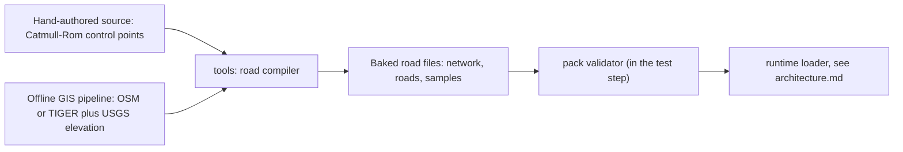

# Content packs and data formats

## In plain words

Tag: summary only; the tags on the choices are in the sections below.

Everything that makes the game *this* game lives in plain data files, not in code: the bikes, the riders and their grudges, the weapons, the events, the regions, the roads, the trash-talk lines, the HUD layouts and the feel presets from the tuning panel.

Those files are grouped into **content packs**. A pack is a folder with a small label file (`pack.json`) that says what it is, which version it is, and which other packs it needs. The whole base game is simply **pack zero**, called `base`. Later regions (chapters of the tour) can ship as their own packs.

The files are JSON, a plain text format that both people and coding agents can read and edit. Each kind of file has a **schema**, a machine-checkable description of what a valid file looks like. A checker runs as part of the normal tests, so a typo like a missing comma or a weapon with no damage gets caught before it reaches the phone.

Formats carry version numbers, and the game refuses to load a pack written in a format it does not understand. While every pack lives in this repo, a format change simply edits those packs in the same change; automatic upgrading of outside packs is built only when outside packs are supported. Letting players load their own packs (mods) is shelved, but nothing here blocks it.

Rare "weird events" (a hurricane gust, a funeral procession, a cult roadblock, a bounty on the player) and radio stations are content too. Their formats are reserved here so they arrive as data, but they are not built for the first milestones.

This doc owns **file formats only**. How the game finds, loads, caches and streams these files at runtime is in [the architecture doc](./architecture.md).

## Tags and scope

Tag: `[default]` for the scope split between this doc and the architecture doc.

Every non-trivial choice carries one tag:

- `[decided]`: traces to a maintainer answer.
- `[default]`: a proposal from this doc; the maintainer or a later agent may change it.
- `[open]`: needs the maintainer; also listed in [Open questions](#open-questions).

Out of scope here: runtime loading, caching, streaming and chunk scheduling (see [the architecture doc](./architecture.md)); the save-file format; the GIS pipeline's internals (only its *output* interface is defined here, in [Road networks](#road-networks-roads-and-routes)); game balance numbers. Numbers in the examples are placeholders for shape, not tuned values.

If this doc and `./architecture.md` disagree on anything runtime-related (the coordinate axes, the asset loader, load order), the architecture doc wins and this doc gets corrected.

## Maintainer decisions this doc builds on

Tag: `[decided]` for each line below; everything else in this doc builds on these.

- Tracks, rivals, bikes and taunts live in editable data files, not in code ("Yes, data files").
- Extensibility: data files plus content packs now; full player mods "maybe later", and the pack format should make that cheap.
- Weapons, rivals and assets must be extensible and easy to change.
- Barks (rider trash talk) must be contextual and non-repetitive: tagged lines plus memory, such as references to grudge history. AI tie-in later. AI barks are generated offline first, live generation optional later.
- In M1, voices are text bubbles.
- One connected road network: roads join at junctions, each road has along/across coordinates, and races are routes through it. It is designed for chunk streaming of big GIS regions.
- Curated real roads, proven incrementally. On licences the maintainer said they are "all basically fine".
- Region 1 is the Florida Keys / A1A. Track 1 is a coastal highway.
- Event types: classic race, takedown hunt, cop escape, grudge match. The race rules follow an "objectives mix". Time of day is set per event, and weather comes later.
- Cops: a mix of tier-rising, every-race and chaos-summoned, with some randomness. Local cops in every region.
- Weapons: club/pipe, chain, wasteland junk, cop baton/taser. A steal is a snatch timed on the wind-up.
- Bikes: 3 bikes to buy with cash, each a clear step up. Slower bikes are wanted as a direction: "Maybe slower bikes too", then "kinda all of these but also to enjoy the scenery" (a slow starter for readable fights, scooters/mopeds/dirt bikes, a lower overall option, a scenic option). How many slow bikes ship in v1, and whether they count among the 3, is not decided (`[default]` below).
- Riders: a few presets, extensible. About 8 named rivals, with roughly 4 regulars plus 4 locals per region; the split is tentative, but "definitely local cops".
- Weird events: rare, data-driven race modifiers, all four kinds wanted (nature chaos, human chaos, wasteland weird, league stunts), with room to grow. Timing is M4 or the shelf `[default]`.
- Radio stations by genre, plus regional stations; surf and rockabilly first for the Keys. DJ lines come later with the AI barks. The M1 and M2 scores stay a single original score. Other soundtrack genres that appeal (tentative, "idk"): grunge, stoner/desert, swamp blues.
- In-game veto: long-press a bark subtitle, billboard or sign and choose "cut this". The flag goes into the debug report, and agents then remove the item and record it in the taste log.
- First run is menu first (`[decided]`, playtest 4: the start tap lands on the menu, and "Start career" opens the career map). Beating the boss plays a next-region teaser and free play continues afterwards.
- Easter eggs, all wanted: secret roads and shortcuts, a secret rider or bike, 90s-internet references, real-place gags. Shelf or M4/M5 `[default]`.
- From the maintainer's cockpit answers (2026-09-29): grudges are saved with the career; radio tracks come from both code-made and AI-generated songs, and the maintainer cuts tracks with "cut this" like rival lines; the failure-state default is Road Trip, with Classic and Hardcore later; and when the real Overseas Highway is ready, the maintainer rides both roads and picks, and the other stays as an alternative route.
- Configurable HUD: each element can be toggled and moved, with presets (Full, Classic, Minimal). Movable, configurable touch buttons.
- An in-game tuning panel with presets from M1.
- The goal: bundle assets into the build at the start, stream and cache them later, "I don't want to be limited in the future." One manifest abstraction as the mechanism is the coordinator's answer to that goal, accepted on the blueprint page (`[default]`).
- Big or generated assets live in a Hugging Face dataset repo; mind the HF 10 MB, LFS and Xet limits. What exactly those limits do is (unverified) here.
- The coordinator decides the hard-to-change technical calls, including versioned saves and packs and one GIS coordinate system (the maintainer delegated these; the choices themselves are `[default]`).
- Agents invent content freely within the tone guide; the maintainer vetoes; keep a taste log.
- The repo is public from day one under the MIT licence, with no "Road Rash" in names or branding. The game is inspired by Road Rash (EA, 1991–2000).

## File format choice

Tag: `[default]` for the choice; the reasons follow.

**Content files are strict JSON, validated against schemas written once in TypeScript with Zod, from which JSON Schema files are generated for editors.**

Why JSON data, not TypeScript data modules:

- **Packs must load without compiling code.** A future "load pack" button reads a folder or zip at runtime. JSON parses safely. A TypeScript or JavaScript data file would need a compiler in the browser, and loading someone else's script means running someone else's code. Data-only packs keep the mod door open and safe.
- **Agents edit JSON reliably.** Every coding agent reads and writes JSON well. Editors get autocomplete and inline errors from generated JSON Schema files mapped by folder (see below), so files carry no per-file `$schema` line.
- **Validation errors point at the exact field**, for example `packs/base/weapons/lead-pipe.json /steal/windowEndS: must be at most windupS`.
- **Offline tools emit it trivially.** The Python GIS pipeline and the AI bark generator can both write JSON with no JavaScript toolchain.

Why Zod as the one source of truth:

- One definition gives three things: the TypeScript types the game code uses, the runtime validator the loader and linter use, and the JSON Schema files editors use.
- Cross-field rules, such as "the steal window must sit inside the wind-up", are written as refinements in the same place. JSON Schema cannot express all of them, so the generated `.schema.json` files are advisory editor help; the Zod validator is the real gate.
- **Editor help is generated on demand, not committed.** `npm run schemas` writes the JSON Schema files into the git-ignored `.cache/schemas/`, and one `json.schemas` block in the workspace's `.vscode/settings.json` maps each folder glob to its schema (for example `packs/*/weapons/*.json` to `weapon.schema.json`). That editor setting is `[default]`, and how every editor treats a workspace-relative schema path is (unverified) here. Committing generated files would only add a freshness check that fails whenever a schema is edited, which is a redundant gate; the `type` field already makes each file self-describing for the validator.
- Version facts, fetched 2026-09-29: `npm view zod version` returned `4.6.5`. The Zod docs page on JSON Schema says: "Zod supports native JSON Schema conversion" through `z.toJSONSchema()`, with "Draft 2020-12 (default)". The same page says "Introduced in `zod@3.20.0`", which is earlier than expected for a Zod 4 feature. The quote came through a summarizing fetch, so treat the introduction version as (unverified); pin the real version at scaffold time. The page also says some types "cannot be reasonably represented", such as `z.transform()` and `z.date()`. Schemas for content must avoid those types, so dates are ISO strings.
- The alternative is TypeBox, whose schemas are JSON Schema objects natively, validated with Ajv (`npm view ajv version` returned `8.20.0`). It is a fine swap if Zod's JSON Schema output ever proves lossy. Either way the data files do not change.

Rules for the files themselves `[default]`:

- Strict JSON: no comments, no trailing commas. Put human notes in the optional `meta.notes` field.
- UTF-8, LF line endings, 2-space indent, and a trailing newline. A formatter (Prettier) normalises them so diffs stay small.
- **One entry per file** (one bike, one weapon, one rider), and the filename equals the entry's `id`. Parallel agent lanes then touch disjoint files and rarely conflict. The exceptions are bark sets (many short lines per file), road sample tables, and the small lists inside a region file (signs and billboards, each with its own id).
- Big numeric tables (road samples) may use a binary sidecar later; see [Road networks](#road-networks-roads-and-routes).

## Pack layout and manifest

Tag: `[default]` for the layout and for base being pack zero; `[decided]` that content packs exist ("data files + content packs now").

### Folder layout

```text
packs/
  base/                         # pack zero: the whole base game
    pack.json                   # manifest (hand-written)
    bikes/            <id>.json
    riders/           <id>.json # rivals, cops, player presets
    crews/            <id>.json
    weapons/          <id>.json # includes punch and kick
    events/           <id>.json
    traffic/          <id>.json # traffic, pedestrian and animal kinds
    looks/            <id>.json # visual style presets (M3)
    modifiers/        <id>.json # weird-event modifiers (reserved, M4 or shelf)
    stations/         <id>.json # radio stations (reserved, later)
    careers/          <id>.json
    regions/
      florida-keys/
        region.json
        networks/     <id>.json # road network: junctions + road list
        roads/        <id>.json # one road: lanes, tags, features, samples
        routes/       <id>.json # a path through the network for events
    barks/            <set-id>.json
    hud/              <id>.json
    tuning/           <id>.json
    assets/                     # models, textures, audio, stills, data (backdrop/)
      models/ textures/ audio/ stills/
    LICENSES/                   # per-folder licence texts, e.g. ODbL for OSM roads
src/content/schema/             # the Zod source of truth
tools/packs/                    # validator CLI, indexer, schema emitter (npm scripts)
.cache/schemas/                 # generated JSON Schema for editors (git-ignored)
```

The file `pack.index.json` is **generated** by the indexer at dev and build time and is not committed. It lists every file in the pack with its type and, for assets, the manifest fields `{id, kind, source, path, bytes, hash, packId}` that [the architecture doc](./architecture.md#asset-manifest) defines (`hash` is a SHA-256). The runtime's asset manifest is the union of the loaded packs' indexes. A static web host cannot list folders, so the runtime reads this index instead of guessing paths, and agents never hand-maintain it. Where this doc and [the engineering doc](./engineering.md#big-and-generated-assets) describe the manifest differently, the architecture doc wins.

Where the index lives `[default]` (M1 content-1): `npm run packs:check` writes each pack's index to `.cache/packs/<packId>/pack.index.json`, a folder git ignores, so it can never be committed by accident. M1 bundles the base pack through Vite's `import.meta.glob`, so the runtime does not read the file yet; the build copies it next to a pack when the first streamed pack or remote asset needs it.

### The manifest: `pack.json`

```json
{
  "type": "pack",
  "id": "base",
  "name": "Throttlebrawl base game",
  "version": "0.1.0",
  "formatVersion": 1,
  "gameVersion": ">=0.1.0",
  "dependencies": {},
  "description": "Pack zero. Everything in the base game, including Region 1: the Florida Keys.",
  "authors": ["the maintainer", "agents (see meta.provenance per entry)"],
  "license": "MIT",
  "licenseRules": [
    {
      "paths": [
        "regions/*/networks/osm-*.json",
        "regions/*/roads/osm-*.json",
        "regions/*/roads/osm-*.bin",
        "regions/*/routes/osm-*.json"
      ],
      "spdx": "ODbL-1.0",
      "attribution": "Road data © OpenStreetMap contributors, available under the Open Database License.",
      "licenseFile": "LICENSES/ODbL-1.0.txt"
    }
  ],
  "assetSources": {
    "default": "baked",
    "rules": []
  },
  "defaults": { "tuning": "registry", "hud": "classic" },
  "idAliases": {},
  "meta": {
    "notes": "The base game is itself a pack so every content path is exercised from day one."
  }
}
```

| Field | Meaning |
|---|---|
| `id` | Kebab-case, globally unique. `base` is reserved for pack zero. Other packs use a descriptive id such as `region-pnw`. |
| `version` | Semantic version of the pack's *content*. Bump it whenever the content changes. |
| `formatVersion` | Integer version of the *file formats* (schemas) the pack is written in. See [Versioning and migration](#versioning-and-migration). |
| `gameVersion` | A semver range of game builds the pack claims to work with. It is advisory; `formatVersion` is what the loader enforces. |
| `dependencies` | Map of pack id to semver range, for example `{ "base": "^0.3.0" }`. Only listed packs may be referenced. |
| `license`, `licenseRules` | The default SPDX licence for the pack, plus per-path overrides with the attribution text the credits screen must show. |
| `assetSources` | Where assets come from: `baked` into the build, or fetched from a `remote` store. See [Asset references](#asset-references). |
| `defaults` | The shipped default tuning preset and HUD layout, as ids, plus an optional `look` (a [look](#look) id, added in M3; until it is set the render lane's recommended default look applies), and an optional `engineSoundByClass` (below). Only the `base` pack's `defaults` are read; other packs' are ignored. The reserved tuning id `registry` means "the parameter registry's own defaults" (it has no file and cannot be a filename). |
| `defaults.engineSoundByClass` | The engine voice of each bike class (playtest 2, 2026-10-02: "a voice per bike"), as data rather than code `[default]` (run W-S): a map from a [bike](#bike) `class` to an `engineSound` block of the same shape a bike file has, for example `{ "chopper": { "preset": "v-twin" }, "moped": { "preset": "two-stroke-buzz", "idleHz": 46, "redlineHz": 230 } }`. A rider drawn on a class (`look.bikeClass`, see [Rider](#rider-rivals-cops-player-presets)) sounds like that class: its voice replaces the sim bike's own `engineSound`, until the career gives riders real bikes. A class with no entry keeps the bike's own. Keys must be classes from the closed list; a preset name audio does not know falls back to its default patch. Presentation-only, like every `engineSound`. |
| `idAliases` | Old id to new id, so renaming content never breaks saves or replays. |

## Conventions shared by every entry

Tag: `[default]` throughout this section.

### The envelope

Every entry file has the same outer shape:

```json
{
  "type": "weapon",
  "id": "lead-pipe",
  "name": "Lead Pipe",
  "tags": ["blunt", "roadside"],
  "meta": {
    "status": "live",
    "notes": "Starter pickup. Should feel slower than the chain but hit harder.",
    "provenance": { "origin": "agent", "author": "agent", "createdAt": "2026-10-01" }
  }
}
```

- `type` repeats what the folder implies, so the linter can check a file by its content alone, and moving a file cannot silently change what it is.
- `tags` are free-form lowercase strings. Selection rules (barks, traffic mixes, weapon spawns) match on them.
- `meta.status` is one of:
  - `live`: the default. It follows the decided rule that agents invent content freely.
  - `vetoed`: the maintainer said no. The entry stays in the file as the **taste log**, so a later agent or AI batch does not recreate it, and the loader skips it.
  - `draft`: loaded only in dev and staging builds.
- `meta.provenance` records who or what made the entry:
  - `origin` is one of `human`, `agent`, `ai-batch`, `gis-pipeline`.
  - `author` is a role, never a personal name or handle: `maintainer`, `agent`, or a tool name.
  - For `ai-batch`, also record `batchId`, `model`, `promptRef` (a repo path to the prompt file), `generatedAt`, and optionally `reviewedAt`.
  - For `gis-pipeline`, see [Provenance and licence of road data](#provenance-and-licence-of-road-data).
- **`meta` is optional.** Its default is `{ "status": "live", "provenance": { "origin": "agent" } }`. `meta.provenance` is required only when `origin` is `ai-batch` or `gis-pipeline`, because only those two need their trail preserved. The examples below show `meta` on most entries to illustrate the shape; an M1 file may leave it out.

#### In-game veto ("cut this")

`[decided]` that the player-facing flow exists: long-press a bark subtitle, billboard or sign and choose "cut this". The flag goes into the debug report, and agents then remove the item and record it in the taste log. `[default]` for the reference format and the mechanics below.

- Every item that can be vetoed has an id that is stable and unique inside its entry: a bark line, a sign, a billboard. That is why signs and billboards are objects with ids, not bare strings.
- **Content reference format:** `<packId>:<type>/<entryId>#<itemId>`, for example `base:bark-set/kevin-core#kevin-pass-email` or `base:region/florida-keys#ices-before-road`. The debug report's "cut this" list uses exactly this format. The save file uses the same reference to remember which bark lines were heard.
- **The agent's fix** is to set the item's `status` to `vetoed` (bark lines, signs and billboards accept the same `live`, `vetoed` and `draft` values as `meta.status`) and to write the reason in its optional `note`. The vetoed item stays in its file as the taste log the AI-batch generator reads, the loader skips it, and the agent adds a human-readable entry to [the tone guide's taste log](./tone-guide.md#taste-log).
- Whole entries (a rival, a modifier, a station) are vetoed with `meta.status` as above.
- **Radio tracks** are vetoable items inside their station entry, because the maintainer cuts tracks the same way as rival lines `[decided]` (cockpit answer, 2026-09-29). Their reference is `<packId>:station/<stationId>#<trackId>` (see [Radio stations](#radio-stations-reserved)).
- Lint: veto-able item ids are unique within their entry, and nothing live references a vetoed item.

### IDs and references

- An `id` is lowercase kebab-case (`kevin-from-accounting`), unique within its type inside a pack, and equal to the filename.
- **A bare id refers to the same pack.** A reference into another pack is qualified as `<packId>:<id>`, for example `base:lead-pipe`, and that pack must be listed in `dependencies`. Bare ids never fall through to dependencies. Silent fall-through lets two packs shadow each other, which is the classic mod-conflict bug.
- Reference fields say what they point to in their name, for example `bike`, `startingWeapon`, `crew`, `region` and `route`. The linter knows each field's target type and checks that the target exists.
- Renaming an id: add `"old-id": "new-id"` to `idAliases` in `pack.json`. Never reuse a retired id for something different.

### Units and axes

- **Stored numbers are SI, and the unit is in the field name**: `topSpeedMps` (metres per second), `bustRadiusM` (metres), `windupS` (seconds), `massKg` (kilograms), `latDeg` (degrees). Milliseconds are allowed for feel-tuned durations (`hitStopMs`, `…DurationMs`), because those are tuned by eye in ms. The display unit (mph or km/h) is a player setting `[decided]` and never appears in data.
- **Timing fields become ticks.** The sim runs at a fixed 60 Hz ([architecture](./architecture.md#fixed-timestep-and-the-loop)). Every `…S` or `…Ms` timing field is converted once at load to whole ticks, `ticks = max(1, round(seconds * 60))`, and all checks on timing (such as the steal window) use the tick values.
- Unitless 0–1 values end in nothing and are documented as `0..1` in the schema, for example `aggression`.
- Money is an integer number of in-game dollars: `priceCash`, `fineCash`.
- Road space follows [the architecture doc's coordinates](./architecture.md#coordinates): `s` is distance along a road in metres, from its `from` junction to its `to` junction. `d` is the lateral offset in metres, **positive to the right** when facing increasing `s`. Curvature `kappa` is in 1/metres and **positive when the road turns right** (toward positive `d`). `grade` is rise over run (0.05 means 5 %). `bankRad` is positive when the surface tilts down toward positive `d`. The `kappa` and `bankRad` signs are `[default]` extensions of the architecture doc's `d` rule. Sign conventions are defined in one place in code (the `road/` module), and both docs link to that rule rather than restating it differently.
- World space for road geometry is the architecture doc's per-region transverse Mercator frame ([one world coordinate system](./architecture.md#one-world-coordinate-system)): metres, `x` east, `y` up (true elevation), `z` south, so north is `-z`. The frame is anchored at a WGS84 origin given in the region's network file. A flat local tangent plane is not used because over a region as long as the Keys the Earth's curvature would put far roads hundreds of metres off the plane (the architecture doc computes about 785 m at 100 km). This is the "one GIS coordinate system" call, which the maintainer delegated `[decided]` and which is a `[default]` choice.

### Optional fields keep M1 files short

Almost every field beyond the core few is optional, with a default documented in the schema. An M1 bike file can be eight lines. The richer fields in the examples below are what the format *allows*, not what M1 must fill in. See [What M1 needs](#what-m1-needs).

### Which fields count as sim-facing

The registry computes a **sim content hash** over only each entry's sim-facing fields, and a **full content hash** over everything ([architecture](./architecture.md#content-registry)). Sim-facing fields are the ones that enter `SimConfig`: a bike's `handling` and `combat`; a rider's `stats`, `personality`, `grudge` and `law`; a weapon's timing, reach, damage, knockback, steal and uses; a traffic type's size, speed, hazard and behaviour; events, modifiers, roads and sim-affecting tuning. `look`, `engineSound`, `paint`, `blurb`, `tags` and `meta` are presentation-only and excluded, so a paint or proportion edit never changes the replay key. `src/content/schema/` lists the sim-facing fields per type.

How the list is kept `[default]` (M1 content-1): `SIM_EXCLUDED_FIELDS` in `src/content/schema/entries.ts` names, per type, the top-level fields left out of the sim hash; every other field counts as sim-facing. So a rider's `bike`, `role`, `crew` and `startingWeapon` count too, because they decide what enters `SimConfig`, and a field a later lane adds renews the replay key until it is listed, rather than risking replays that silently diverge. Bark sets, HUD layouts and stations are presentation-only. All of a tuning preset's `values` count, since the file does not say which keys affect the sim.

## Asset references

Tag: `[decided]` for the goal (bundle at the start, stream and cache later, "I don't want to be limited in the future"); `[default]` (the coordinator's mechanism, accepted on the blueprint page) that one manifest abstraction is how it is met, and for its shape.

- An **asset id** is the pack-relative path under `assets/` without its extension, for example `models/bikes/putt-scooter` or `audio/barks/kevin/per-my-last-email`. From another pack it is qualified: `base:models/bikes/putt-scooter`.
- Entries hold asset ids in fields ending in `Asset` (`modelAsset`, `portraitAsset`, `audioAsset`). No entry ever holds a URL or a file extension. That keeps "bundled now, streamed later" a config switch.
- The generated `pack.index.json` resolves each asset id to a real file, kind, size and hash, as the manifest entry `{id, kind, source, path, bytes, hash, packId}` ([architecture](./architecture.md#asset-manifest)). The runtime asset loader turns that into a URL. `kind` and the source names come from the architecture doc: sources are `baked`, `remote` and `procedural`.
- `assetSources` in `pack.json` chooses where the bytes live:

```json
{
  "assetSources": {
    "default": "baked",
    "rules": [
      {
        "match": "audio/barks/**",
        "source": "remote",
        "store": "hf-dataset",
        "baseUrl": "https://huggingface.co/datasets/<hf-user>/throttlebrawl-assets/resolve/{revision}/base/"
      }
    ]
  }
}
```

  `<hf-user>` is a placeholder for the maintainer's Hugging Face account, filled in at setup. `{revision}` is not written in the pack: it is filled from the single dataset pin that [the engineering doc](./engineering.md#big-and-generated-assets) keeps, an exact commit and not a branch, so a pack version always means the same bytes and there is only one pin to bump.
- Allowed asset formats `[default]`: `glb` (models), `png` and `webp` (images), `ogg` and `opus` (audio), `json` and `bin` (data). Nothing executable.
- A region's texture atlas `[default]` (playtest 3) is a PNG-8 file with asset id `textures/atlas/<region>` and kind `texture`, beside its layout `textures/atlas/<region>-layout` ([engineering](./engineering.md#big-and-generated-assets)). It holds no invented words: those stay pack text.
- A pack's traffic models `[default]` (playtest 3, T12.2) are one render-only data file, `assets/traffic-models.json`, never a field of a traffic type's JSON (the sim reads the type, so a model could never reach its replay key or hash). It is `{ "formatVersion": 1, "types": { "<pack>:<type id>": { "models": ["models/traffic/<name>"], "paint": [...] } } }`: the Blender vehicle models (kind `vehicle`, asset ids: a region's own model sits in its region pack, and the manifest finds an id in any pack) that draw the type in place of the code-made car or truck box, and the paints its instances wear, which must equal the type file's own `look.paintOptions` (a test holds them equal). The renderer draws the model at the type's own `lengthM` and `widthM` (so a model should be within a factor of two of them, and a test holds it to that), with the height following the width; a type with two models takes one per entity; a type with no row, or whose model fails to load, keeps its box. Each model in view is one draw call, so a row that makes a region's traffic draw more than 2 calls over its boxes fails `src/render/vehicles.test.ts`. (playtest 4, run B) A built vehicle model that no row draws fails the same file unless it is waived there with the reason no type can take it yet: every other model is wired, and a type reuses a model of its own size (the Pacific Northwest's mossy wagon draws the sedan) when a new one would cost a draw call.
- Procedural and code-made assets `[decided]` ("code-made assets first") are referenced by a preset name plus parameters rather than an asset id, for example `"procedural": { "preset": "scooter", "params": { "wheelbaseM": 1.25 } }`. An entry may have both, and a loaded model overrides the procedural one.

## Entry schemas

Tag: per subsection below.

Each schema below shows one realistic example, then notes on the fields. The examples are valid JSON that an agent can copy. Values are placeholders for shape, not balance.

### Bike

Tag: `[decided]` for 3 bikes to buy, each a clear step up, slower bikes as a wanted direction, synthesized engine sound and paint-only customization; `[default]` for how many slow bikes ship in v1, whether they count among the 3, and the field set.

```json
{
  "type": "bike",
  "id": "sunshine-putt-50",
  "name": "Sunshine Putt 50",
  "class": "scooter",
  "tags": ["slow", "scenic", "starter-option"],
  "handling": {
    "topSpeedMps": 20.1,
    "accelMps2": 2.6,
    "brakeMps2": 6.0,
    "steerRateMps": 3.2,
    "grip": 0.55,
    "massKg": 95,
    "airControl": 0.2,
    "wobble": 0.35
  },
  "combat": {
    "hitPowerScale": 0.8,
    "knockbackResistance": 0.4
  },
  "engineSound": {
    "preset": "two-stroke-buzz",
    "cylinders": 1,
    "idleHz": 38,
    "redlineHz": 190,
    "roughness": 0.7
  },
  "look": {
    "procedural": { "preset": "scooter", "params": { "wheelbaseM": 1.25, "deckHeightM": 0.38 } },
    "paintSlots": ["body", "seat"],
    "defaultPaint": { "body": "#f2c14e", "seat": "#3b2b20" },
    "paintOptions": ["#f2c14e", "#7fd1c7", "#f28f8f", "#e8e2c8"]
  },
  "meta": {
    "status": "live",
    "notes": "Kevin's ride, and a slow option for players who want readable fights and the scenery.",
    "provenance": { "origin": "agent", "author": "agent", "createdAt": "2026-10-01" }
  }
}
```

| Field | Notes |
|---|---|
| `class` | `scooter`, `moped`, `dirt`, `rat`, `sport`, `super`, `tourer` (playtest 3, round 3: "Six bikes": the Grand Tourer 1100) or `chopper`, plus the secret joke-ride classes `lawnmower`, `mobility-scooter` and `golf-cart` `[decided]` (the maintainer wants a riding lawnmower, a mobility scooter and a golf cart as secret rides), reserved for M4. It drives defaults, bark targeting (`target.bikeClass`) and traffic-camouflage jokes. Adding a class is a schema change. |
| `handling.*` | The sim's inputs in SI. `steerRateMps` is the maximum lateral speed across the road. `grip`, `airControl` and `wobble` are 0..1. The sim owns what they mean; this doc only fixes their names and units. |
| `combat.*` | Heavier rigs hit harder (the 3DO manual: "The heavier a rider is, the harder he hits"). The final hit power combines the rider's `massKg` and the bike's `hitPowerScale`. |
| `engineSound` | Parameters for the code-synthesized engine `[decided]`. `preset` names a synth patch in code; the numbers shape it. A rider drawn on another class sounds like that class instead (the base pack's [`defaults.engineSoundByClass`](#the-manifest-packjson)). |
| `look` | Paint-only customization `[decided]`: `paintSlots` and `paintOptions`. The model is procedural first, with an optional `modelAsset`. |
| `hitbox` | Optional `{ "lengthM", "widthM" }`: the rider's contact box on this bike, m. Absent is the default 2.0 x 0.8; only a bike whose drawing cannot be scaled to it says one (the lawnmower, the mobility scooter). See [Heights and hitboxes](#heights-and-hitboxes). |

Which bikes are *for sale*, and at what price, lives in the career file, not the bike file. The same bike can then be a rival's ride in one pack and a shop item in another.

### Rider (rivals, cops, player presets)

Tag: `[decided]` for personality styles, grudges, local rivals and cops, rivals who may side with or against you, and preset riders; `[default]` for the parameter set.

```json
{
  "type": "rider",
  "id": "tammy-two-stroke",
  "name": "Tammy Two-Stroke",
  "role": "rival",
  "roster": "local",
  "region": "florida-keys",
  "crew": "swamp-kin",
  "tags": ["smoker", "veteran", "dirt"],
  "blurb": "A chain-smoking auntie on a dirt bike.",
  "bike": "brush-hog-250",
  "paint": { "body": "#c0392b", "seat": "#1a1a1a" },
  "stats": {
    "massKg": 72,
    "healthMax": 100,
    "skill": 0.7,
    "toughness": 1.1,
    "power": 1.0
  },
  "startingWeapon": "tire-iron",
  "personality": {
    "style": "scrapper",
    "aggression": 0.55,
    "dirtiness": 0.6,
    "courage": 0.7,
    "riskTaking": 0.8,
    "targetPreference": ["grudge", "player", "leader", "nearest"],
    "preferredSide": "either",
    "chatter": 0.7
  },
  "grudge": {
    "startTowardPlayer": 0,
    "gainPerHitTaken": 1,
    "gainPerTakedownSuffered": 3,
    "gainPerWeaponStolen": 2,
    "decayPerRace": 1,
    "huntThreshold": 4,
    "max": 10,
    "reliefWhenHelped": 2,
    "shareWithCrew": 0.5
  },
  "look": {
    "procedural": { "preset": "rider-stocky", "params": { "helmet": "open-face", "jacket": "denim-vest", "proportion": "exaggerated" } },
    "palette": ["#c0392b", "#f5e6c8", "#2b2b2b"],
    "portraitAsset": "stills/riders/tammy-two-stroke"
  },
  "meta": {
    "status": "live",
    "notes": "Florida local. Sample line: \"Honey, I've passed hearses faster than you.\"",
    "provenance": { "origin": "agent", "author": "agent", "createdAt": "2026-09-29" }
  }
}
```

| Field | Notes |
|---|---|
| `role` | `rival`, `cop`, `player-preset` or `extra` (a background biker). One schema serves all four, so a cop can be hit like any rider `[decided]` and a player preset is just a rider with `role: "player-preset"`. |
| `roster` | `regular` (tours with the circuit) or `local` (belongs to a region). About 4 regulars plus 4 locals per region "sounds right" to the maintainer `[decided]`; which rider goes where is a proposal `[default]`. Either way it is data, not a rule in code. |
| `region` | Required for `local`, absent for `regular`. |
| `stats.toughness`, `stats.power` | Fight stats (playtest 2, 2026-10-02: "Visible personalities", moderate differences shown through how rivals ride and fight) `[default]`. Multipliers from 0.5 to 2, 1 when absent. `toughness` divides the damage and the stagger the rider takes from a hit; `power` multiplies the damage of every hit the rider lands. `healthMax` stays the rider's endurance. Aggression is `personality.aggression`. |
| `personality.style` | A named preset registered in `sim/ai/` (weights, thresholds and a behaviour set; [architecture](./architecture.md#controllers-every-rider-is-driven-the-same-way)). The ids are `heavy-hitter`, `weaver`, `showboat`, `grudge-keeper`, `scrapper`, `crowd-pleaser`, `crew-boss`, `cop` and `racer`; personality styles exist `[decided]`, but the list is `[default]`: the first four are the styles named in [the product spec](./product-spec.md#rivals), and the rest, including `racer` (a pure racer who avoids fights), are additions. The other personality fields override the preset's values, so a new rival can be one line (`"style": "heavy-hitter"`) or fully bespoke. All numeric fields are 0..1. M1 registers two presets, `heavy-hitter` (a brawler who hunts a target and rides alongside it) and `racer` (holds its line and swings only at whoever drifts into reach); any other id falls back to `racer` until its own preset lands `[default]` (M1 ai-1). |
| `personality.weave` | Lane habit, 0..1: how far the rider drifts across its lane (0 holds a line; about 0.8 swerves like a weaver). Added by M1 ai-1 `[default]`, alongside `aggression` (how often it swings and how far it hunts), `dirtiness` (how often a swing is a kick), `courage` (how hurt it can be and still pick a fight), `riskTaking` (how readily it dodges traffic through the oncoming lane) and `chatter` (for barks). |
| `personality.signature` | The rival's one signature move (interview, 2026-10-02: "Visible personalities", moderate stats shown through how rivals ride and fight; the move list and timings are `[default]`). Each move is both a tell you can read and an opening you can punish, and the snapshot's `signature` field shows it to render. The ids: `selfie` (rides no-hands filming himself for about 3 s and cannot swing: Chad), `wave` (waves at traffic and drifts into the oncoming lane: the Mayor), `bell` (a bell swings before every hit he throws: Gus), `counter` (brakes precisely to drop beside whoever hit him, then counterattacks: Kevin), `lag` (twitches, freezes on the throttle, then lurches back: Dial-Up), `ram` (swings wide, then rams: Mother Rust), `slow-burn` (will not fight until hit enough, then never stops: Deacon), `sweet-talk` (rides beside you being nice, then shoves: Tammy), `cut-in` (cuts into the gap in front of you and brake-checks: Juniper Moss), `timber` (head down, charges whoever is ahead in his line: Old Growth) and `pivot` (signals, swaps sides with a burst, then his battery sags: Pivot). Absent: no signature. `sim/ai/signature.ts` runs them; the `ai.signatures` tuning switch (on by default) turns them all off, and so does `ai.styleQuirks`. Timed moves wait out the first 10 s of a race and then come every 8 to 22 s or so, depending on the move; the counter and the bell answer a hit or a swing. |
| `targetPreference` | An ordered list the AI uses to choose whom to fight: `grudge`, `player`, `leader`, `nearest`, `crew-enemy`. |
| `grudge.*` | Grudge points per event and the threshold at which the rider starts hunting. `shareWithCrew` spreads a grudge to crewmates (0..1). Grudges are saved with the career `[decided]` (cockpit answer, 2026-09-29): the rules live here, and from M4 the career profile carries each rival's running totals across play sessions ([the architecture doc's save format](./architecture.md#save-format)). `decayPerRace` is what keeps an old grudge from lasting forever. Cop heat carried between sessions stays later `[decided]`. Grudge values steer the AI's target choice, so they are sim inputs: the resolved grudge table at race start must be part of `SimConfig` and so of the replay header ([architecture](./architecture.md#sim-contract-srcsimapits), whose field list is a minimum the contract owner may extend). |
| `crew` | Optional reference to a crew entry. |
| `hitbox` | Optional `{ "lengthM", "widthM" }`: this rider's contact box when the bike it is drawn on (`look.bikeModel`) is not the size of the default box; it wins over the sim bike's own `hitbox`. See [Heights and hitboxes](#heights-and-hitboxes). |
| `look.procedural.params.proportion` | `exaggerated` or `realistic`. The maintainer was unsure ("idk"), so this is a look-test item for M3 and a `[default]`, not a decision. It is an ordinary procedural parameter, so settling it changes data, not the format. The interview (2026-10-02: "Real proportions, loud costumes") settled it for the real rider models, which are built with real proportions. |
| `look.bikeModel`, `look.bikeClass`, `look.palette`, `look.description` | Real riders on real bikes (run W-R; interview, 2026-10-02: "Real models now") `[default]`. Each rider draws as its own model, `models/riders/<rider id>` (scripted in `tools/blender/riders/`, its costume built from this `description`; the file comes from the dataset repo), on a bike model from the base pack's `models/bikes/` (PR #300). `bikeModel` names that bike (for example `bagger`, `touring-flagship`, `cop-moto`, `parking-trike`); without it `bikeClass` picks the class's bike (render's `BIKE_CLASS_MODELS`), and without either a cop rides `cop-moto` and anyone else the model of their sim bike (the Rustbucket 400). `palette` (hex colours) repaints the bike: the first colour its main paint, the third its second paint, the fourth its accent; without one the bike keeps its own colours. A rider whose models have not loaded draws as the code-made boxes. All presentation-only: none of it reaches the sim or the replay key. |

A **cop** adds a `law` block:

```json
{
  "role": "cop",
  "law": {
    "agency": "keys-county-deputies",
    "bustRadiusM": 14,
    "bustDwellS": 1.0,
    "fineCash": 400,
    "pursuitSpeedScale": 1.05,
    "radioVoice": "tired-deputy"
  }
}
```

`bustRadiusM` and `bustDwellS` (how close, and for how long, the cop must stay next to the rider to bust them) are the only source of those two numbers `[default]`; the tuning panel scales them with `cops.bustRadiusScale` and `cops.bustDwellScale` (default 1.0), never overrides. `radioVoice` is reserved and optional; cop radio chatter comes later `[decided]`. The agency is a small entry under `crews/` with `"kind": "law"`, so each region can have its own local law `[decided]` (sheriffs, troopers and so on) with no code change.

`law.habit` (optional; the pitch deck's #11, "Law with a personality", run W-T) `[default]` gives the cop a way of chasing that is his own: `{ "kind": "relentless" | "radar" | "citations" | "budget", ...numbers }`. Every other field is a non-negative number the sim reads by name, and an absent one takes sim/cops' default:

| `kind` | What it does | Its numbers |
|---|---|---|
| `relentless` | The longer he chases (all race), the closer he holds, the sooner he moves in, the more often he swings, and the harder he rides to catch up. | `rampS` (seconds of chasing to reach the top), `maxScale` (his catch-up speed at the top, × his own) |
| `radar` | On patrol, he waits at the route's first long bridge with a radar; a player passing it over the limit is clocked (heat, his siren, the chase), and one under it rides by. | `limitMps`, `rangeM` (how far up the road the radar reads), `minBridgeM` (the shortest bridge he picks) |
| `citations` | He never rams: alongside, he rides out of bumping range. Every `everyS` alongside he writes a citation of `cashEach`; the total is billed at the player's finish. | `everyS`, `cashEach`, `hangBackS`, `alongsideS` (his own spells of hanging back and riding alongside) |
| `budget` | His chasing comes out of a pursuit budget; once it is spent he pulls over for good. | `budgetS` |

A law crew may add `jurisdiction: { "sign": "END OF JURISDICTION. <kicker>" }` (run W-T) `[default]`: in a race whose heat meter runs, the first fielded cop's agency puts that sign up beside the road part-way along the route, and a player who crosses it has his heat cooled and the cops on him pull over. The words are a headline then a kicker, as the road events' warning signs.

### Crew

Tag: `[decided]` that rivals may side with or against you in gang-ups; the maintainer said "maybe a mix of all these" (dynamic and fixed crews), read as simple gang-ups in v1 and deeper crews later. `[default]` that crews are their own entry type, and for the shape.

```json
{
  "type": "crew",
  "id": "swamp-kin",
  "name": "The Swamp Kin",
  "kind": "gang",
  "region": "florida-keys",
  "stanceTowardPlayer": "neutral",
  "gangUp": { "enabled": true, "maxJoiners": 2, "joinRadiusM": 25, "chance": 0.35 },
  "rivalCrews": [],
  "meta": { "status": "live", "provenance": { "origin": "agent", "author": "agent", "createdAt": "2026-10-01" } }
}
```

- Membership is declared once, on the rider (`crew`), never also listed on the crew. Two lists would drift apart.
- `kind` is `gang`, `sponsor-team` or `law`.
- `stanceTowardPlayer` is `hostile`, `neutral` or `friendly`. A friendly crew can side *with* you in a gang-up `[decided]`.
- Deeper crew systems (reputation, factions) are on the idea shelf. New fields can be added as optional without a format bump.

### Weapon

Tag: `[decided]` for the weapon list and the snatch-on-wind-up steal; `[default]` for the field set, including treating punch and kick as weapons.

```json
{
  "type": "weapon",
  "id": "tire-iron",
  "name": "Tire Iron",
  "category": "blunt",
  "behaviour": "melee.swing",
  "tags": ["roadside", "starter"],
  "unarmed": false,
  "reach": { "sM": 1.6, "dM": 1.4 },
  "windupS": 0.34,
  "activeS": 0.1,
  "recoveryS": 0.42,
  "cooldownS": 0,
  "damage": 18,
  "knockback": { "lateralMps": 4.5, "staggerS": 0.35, "takedownBonus": 0.15 },
  "hitStopMs": 70,
  "steal": { "allowed": true, "windowStartS": 0.12, "windowEndS": 0.34 },
  "uses": { "durabilityHits": 12, "charges": null, "dropOnWreck": true },
  "spawn": { "roadsideWeight": 3, "regions": [] },
  "effects": [],
  "sounds": { "swing": "whoosh-heavy", "hit": "clank-meaty" },
  "look": { "procedural": { "preset": "bar", "params": { "lengthM": 0.55 } }, "holdPose": "one-hand-overhead" },
  "meta": { "status": "live", "provenance": { "origin": "agent", "author": "agent", "createdAt": "2026-10-01" } }
}
```

| Field | Notes |
|---|---|
| `category` | `unarmed`, `blunt`, `chain`, `junk`, `shock` or `improvised`. |
| `behaviour` | Required. A registered behaviour id from a closed list in code: `melee.swing`, `melee.wrap` (drags), `taser.stun`, and from run W-T `throw.burst` (thrown; `reach` is then the throw's range ahead and width), `melee.yank` (pulls the target across your line) and `melee.sweep` (hits both sides) ([architecture](./architecture.md#content-registry)). `effects` and the timing fields are its parameters. A genuinely new behaviour is a code change plus a registration; a new weapon that reuses one is data only. |
| `unarmed` | `true` for `punch` and `kick`, which are weapon entries too. Then all combat feel is data, and the tuning panel tunes them the same way. Unarmed attacks cannot be dropped or stolen. |
| `reach` | The reach box `{ sM, dM }`: a hit lands when the target's distance along the road is within `sM` metres and its lateral offset is within `dM` metres of the attacker, on the attacked side ([architecture](./architecture.md#movers-on-the-network)). |
| `windupS`, `activeS`, `recoveryS` | The attack's timing in three phases. The wind-up is the telegraph a player reads. Converted once to whole ticks at load (see [Units and axes](#units-and-axes)). |
| `cooldownS` | Optional, default 0. A pause after recovery before the same weapon may start again (the kick uses it; a request made during a cooldown falls back to a punch, per [M1 combat-1](./milestones/M1.md#combat-1--punch-and-kick-with-real-timing-windows)). Converted to ticks like the other timing fields. |
| `hitStopMs` | The base freeze-frame length. Tuning keys under `combat.*` are **scales** on per-weapon values (for example `combat.hitStopScale`, default 1.0), never overrides. |
| `steal` | The snatch window, in seconds from the start of the wind-up. The linter checks the tick values: `0 <= startTick < endTick <= windupTicks`, so a window that rounds to nothing fails too. That encodes the 3DO rule "To Grab Weapon: C (when opponent is holding it out)" `[decided]`. |
| `knockback` | `lateralMps` is the push across the road; `takedownBonus` (0..1) raises the chance a hit sends the target into traffic. |
| `uses` | `durabilityHits` for breakables, `charges` for a taser-style item; `null` means unlimited. |
| `effects` | A list of structured effects such as `{ "kind": "stun", "durationS": 0.8 }`. It is a closed list in code, so packs cannot invent behaviour the sim does not have. |
| `spawn` | Weight for roadside pickups; an empty `regions` list means every region. A list of region ids (resolved in the weapon's own pack, checked by the linter) lays the weapon only on those regions' roads: in any other race it is carried with roadside weight 0 (run W-T: the Keys' lawn flamingo, the PNW's canoe paddle in `region-pnw`, SF's dead rental scooter in `region-sf`) `[default]`. |

The cop taser would carry `"category": "shock"`, `"tags": ["cop-issue"]`, `"uses": { "durabilityHits": null, "charges": 6, "dropOnWreck": true }` and `"effects": [{ "kind": "stun", "durationS": 0.9 }]`. The research notes that the Saturn manual calls taking a weapon off a cop the easiest way to get one. That is a good reason for the baton and taser to have `steal.allowed: true`.

### Event

Tag: `[decided]` for the four event types, the objectives mix, time of day per event, selectable race length, the cop mix, cash from placing, takedowns, near-misses, airtime, oncoming-lane riding, takedown combos and weapon steals (no bets), and stills-and-text interludes; `[default]` for the shape.

An event has a common part and a `rules` block whose shape depends on `kind`:

```json
{
  "type": "event",
  "id": "keys-t1-sunburn-sprint",
  "name": "Sunburn Sprint",
  "kind": "classic-race",
  "region": "florida-keys",
  "timeOfDay": "golden-hour",
  "lengths": [
    { "id": "short", "route": "overseas-sprint-short", "laps": 1 },
    { "id": "standard", "route": "overseas-sprint", "laps": 1 },
    { "id": "long", "route": "overseas-loop", "laps": 2 }
  ],
  "field": {
    "riders": ["kevin-from-accounting", "tammy-two-stroke"],
    "fillFromPool": { "roster": ["regular", "local"], "count": 6 },
    "rubberband": 0.25,
    "paceMps": 32
  },
  "traffic": { "densityScale": 1.0, "mixOverride": null },
  "cops": { "mode": "every-race", "baseCount": 1, "tierScale": 0.5, "chaosSummon": true, "randomness": 0.3 },
  "rules": {},
  "modifiers": { "pool": "region-default", "maxPerRace": 1, "chanceScale": 1.0 },
  "objectives": [
    { "id": "podium", "kind": "finish-place", "params": { "maxPlace": 3 }, "required": true },
    { "id": "two-takedowns", "kind": "takedowns", "params": { "count": 2 }, "required": false, "rewardCash": 300 }
  ],
  "rewards": {
    "byPlaceCash": [1500, 900, 600, 300, 150],
    "perTakedownCash": 200,
    "perNearMissCash": 25,
    "perAirtimeCash": 40,
    "perOncomingSecondCash": 10,
    "takedownComboScale": 0.5,
    "perStealCash": 60
  },
  "interludes": { "before": "stills/interludes/sunburn-intro", "after": null, "style": "zine-panel" },
  "meta": { "status": "live", "provenance": { "origin": "agent", "author": "agent", "createdAt": "2026-10-01" } }
}
```

`rules` by `kind`:

| `kind` | `rules` fields |
|---|---|
| `classic-race` | none. Point to point versus laps comes from the route's `closed` flag and each length's `laps`, never from a second field. |
| `takedown-hunt` | `targetCount`, `timeLimitS`, `targets` (`any`, or a list of rider ids), `endOnCount` (boolean). |
| `cop-escape` | `escapeBy`: `distance` or `survive`, then `escapeDistanceM` or `surviveS`, plus `startHeat` (0..1) and `copsFromStart`. |
| `grudge-match` | `rival` (rider id), `winBy`: `finish-ahead` or `knockdowns`, then `knockdownsToWin`, plus `grudgeStakes` (grudge points won or lost), and an optional `rule`: the rival's own rule (run W-T, the pitch deck's #14, `[default]`), one of `audit` (each hit the rival lands on you adds a knockdown to the count, capped), `bad-connection` (the rival's connection drops: a modem screech, a second frozen, then he reconnects about 15 m up the road), `collab` (the most style cash at your finish wins, not the place) or `timber` (only traffic and scenery takedowns count). |

- `field.paceMps` is optional: the event's rival race pace in metres per second. Its default is the event tier's rival pace. Rival pace comes from the event, not from the bike, so a slow scooter still keeps up with the pack `[default]` ([the product spec](./product-spec.md#rivals)); the AI reads it, and `buildSimConfig` raises a rival's bike `topSpeedMps` and `accelMps2` to at least this pace. It is a sim input, so it is in `SimConfig` and the sim content hash.
- The `rewards` style fields are optional and default to 0: `perNearMissCash`, `perAirtimeCash`, `perOncomingSecondCash`, `takedownComboScale` (a multiplier on `perTakedownCash` for each further takedown in a combo) and `perStealCash`. They implement the decided style-cash sources (near-miss traffic, airtime, oncoming-lane riding, takedown combos and weapon steals, plus "maybe other stuff"), which the sim reports as `style` events ([architecture](./architecture.md#sim-contract-srcsimapits)). Scored in M2, banked in M4 `[default]`. Playtest 3's moves add `perWheelieSecondCash` (a clean wheelie, per second: the sweet band's seconds whole, the rest at half) and `perDriftSecondCash` (a drift, per second of full slip at full speed, banked when the chain ends) ("I'd love a way to do wheelies"; "Braking into a hairpin at speeds makes a nice drift like mechanism"); left out, they are 2 and 3 times the event's `perOncomingSecondCash` `[default]`, so every event pays them at its own tier's scale.
- `objectives[].kind` is one of `finish-place` (`params.maxPlace`), `takedowns` (`params.count`), `escape`, `beat-rival`, `style-cash` (`params.cash`; playtest 3: an optional `params.kinds`, a list of style kinds such as `["drift"]`, counts only those kinds, and a drift event is a classic race with a required drift-only `style-cash` objective, read `DRIFT $x/$y`; a drift event's target is capped at 60 % of what the scripted drift bot banks on its route at the event's own drift rate, on the weakest bike a player could own by then, rounded down to $50, and `tests/sim/drift-events.test.ts` fails any drift event over its cap: the Pacific Northwest's Crown Point Loops asks $300, where the progression spec's purse-based $1,750 was more than the bot banks in a whole race) and `ride-branch` (`params.branch`, a route branch id) (run W-Q; a closed list, extended by a contract PR).
- `rules` is checked by `kind` (run W-Q): a `takedown-hunt` needs `targetCount`; a `cop-escape` needs `escapeBy` and then `escapeDistanceM` or `surviveS`; a `grudge-match` needs `rival` (a rider) and `winBy`, and `knockdownsToWin` when it wins by knockdowns. Only a `grudge-match` may carry a `rule` (the closed list lives in `src/core/grudge-rules.ts`).
- `tier` (1 = a career's first) and `finale` (the region's boss event) are optional career fields (run W-Q). A career map places events in tiers ([Career](#career)); the lint warns when an event's `tier` disagrees with its node's.
- `objectives` implement the decided "objectives mix". `required: true` objectives gate advancing; optional ones pay bonuses. "Top 3 to advance" is only a `[default]` example here, never a hard-coded rule, because the maintainer did not pick it.
- `timeOfDay` is one of the region's `timeOfDayOptions`. `weather` is optional, `dry` or `rain` `[default]` (playtest 4, the identity sheets' cause 10: the Pacific Northwest drizzled at every hour): the weather this event is drawn in when it differs from what its light does by itself (a time-of-day option's palette `rain`). Render only, so it is out of the sim hash. It belongs to the event's own `timeOfDay`: a menu race drawn at another hour takes that hour's weather, and a menu race's own Dry or Rain pick beats it (`raceSky` in `src/app/regions.ts`). The Pacific Northwest's `pnw-t2-chuckanut` is dry (the bay in a marine layer, the sheets' H7), and its Gorge events and `pnw-t4-rainout` rain at dawn.
- `lengths` gives the selectable race length `[decided]`: each option names a route and a lap count. Lap counts above 1 require a `closed` route (a lint rule), so a long option is either a longer point-to-point route or a closed loop with laps. The example's `long` option uses the loop `overseas-loop`.
- `interludes.style` is one of `zine-panel` (rivals), `tv-broadcast` (the league) or `comic-panel`. The maintainer said the mix by context sounds right but was unsure ("idk"), so the styles are tentative `[default]`; adding or dropping one is additive.
- `modifiers` is optional and reserved: which weird-event modifiers may roll in this event. See [Event modifiers](#event-modifiers-weird-events). M1 events omit it.
- `cops.mode` is `none`, `every-race`, `tier-rising` or `chaos-summoned`. `chaosSummon` lets mayhem summon cops even in other modes, and `randomness` jitters counts and timing. That covers the decided mix. `patrolMax` (playtest 2, 2026-10-02) adds a patrol `[default]`: on top of the mix's starters, the race sends 1 to `patrolMax` more cops up the road, each waiting on the shoulder where the field arrives early in the race; the field holds the starters, `patrolMax` and one more in the lot (for a speed trap or chaos). Every v1 event has `"baseCount": 1, "patrolMax": 2` (the maintainer's "every race has one or two cops on patrol"). `heat` (`true` or absent) runs playtest 2's heat meter: chaos raises the player's heat, its tiers bring one more cop, a pursuit pair and a roadblock, and riding clean cools it (sim/cops); every v1 event has it on `[default]`.
- What happens on a bust or a wreck (fines, retries, consequences) depends on the career's failure mode, which lives in `career/` and the profile's `failureMode`, not in pack files. The default is Road Trip `[decided]` (cockpit answer, 2026-09-29), with Classic and Hardcore as later options ([product spec](./product-spec.md#failure-states)). Events carry only the amounts (a `fineCash` on the cop, optional `wreckCostCash` on the event), never the policy.

### Event modifiers (weird events)

Tag: `[decided]` for rare, data-driven race modifiers in all four kinds wanted (nature chaos, human chaos, wasteland weird, league stunts), with room to grow; `[default]` for the shape below; `[default]` that they arrive in M4 or stay on the shelf. **Reserved, not built for M1.** The type name, the folder and the event's `modifiers` field are reserved now so nothing else takes them and the first modifier does not have to invent a shape or be hard-coded.

A modifier is a small entry under `packs/base/modifiers/`:

```json
{
  "type": "event-modifier",
  "id": "hurricane-gust",
  "name": "Hurricane Gust",
  "kind": "nature",
  "tags": ["wind", "keys"],
  "rarityWeight": 3,
  "eligibility": { "regions": ["florida-keys"], "eventKinds": ["classic-race", "cop-escape"], "timeOfDay": [] },
  "trigger": { "atProgress": [0.3, 0.8], "chance": 0.12 },
  "durationS": 20,
  "effects": [
    { "kind": "lateral-gust", "peakMps2": 3.0, "rampS": 2, "side": "random" },
    { "kind": "spawn-hazard", "hazard": "palm-debris", "count": 4 }
  ],
  "announce": { "barkTrigger": "modifier-start", "sign": null },
  "meta": { "status": "live", "notes": "Placeholder numbers; shape only." }
}
```

| Field | Notes |
|---|---|
| `kind` | `nature`, `human`, `wasteland` or `league`. A closed list in the schema that can grow (adding a kind is a minor schema change). |
| `rarityWeight`, `trigger.chance` | How often the modifier is picked from the pool, and the chance per race that it fires at all. Rare by design. |
| `eligibility` | Region ids, event kinds and times of day it may appear in. An empty list means "any". |
| `trigger.atProgress` | Optional race-progress window (0..1) in which it may start. |
| `durationS` | How long it lasts; converted to ticks at load like every timing field. |
| `effects` | A **closed list in code**, the same pattern as weapon `effects`, so packs cannot invent behaviour the sim lacks. The reserved list: `lateral-gust`, `spawn-hazard`, `spawn-convoy`, `traffic-override`, `cash-multiplier-zone`, `bounty-on-player`, `guest-rider`, `show-billboard`, and `set-piece` (built, W-P: see below). A new effect kind is a code change; a new modifier built from existing kinds is data only. |
| `announce` | An optional bark trigger (`modifier-start`, added to the reserved trigger list) and an optional sign id, so the world can react in words. |

**The maintainer's wanted examples**, all placeholders within the [tone guide](./tone-guide.md#hard-lines) (the funeral procession and rocket launch in particular must follow its hard lines):

| `kind` | Wanted examples |
|---|---|
| `nature` | hurricane gust, gator crossing, cold-night iguana rain |
| `human` | parade, funeral procession, spring-break convoy, offshore rocket launch |
| `wasteland` | cult roadblock, runaway boat on a trailer, a UFO billboard that comes true (a `show-billboard` effect followed by a `spawn-hazard`) |
| `league` | a bounty on the player (`bounty-on-player`), double-cash zones (`cash-multiplier-zone`), a guest "celebrity" rider (`guest-rider`) |

Rules:

- An event opts in with `modifiers: { "pool": [ids] | "region-default", "maxPerRace": n, "chanceScale": x }`. `region-default` means every live modifier whose `eligibility` matches; regions do not keep a second list.
- Modifiers change the sim (traffic, hazards, cash), so the roll must be deterministic: it uses its own seeded `modifiers` stream, and the resolved modifiers are part of `SimConfig` and the replay header ([architecture](./architecture.md#event-modifiers)). The `modifierStart` and `modifierEnd` sim events are what the `modifier-start` bark trigger listens to.
- `[default]` (W-P, the maintainer, 2026-10-01b: "events and set pieces") The road set pieces come first, ahead of M4: each region's race opts in with `"modifiers": { "pool": "region-default", "maxPerRace": 2, "chanceScale": 1 }`, and each region pack carries its own `modifiers/` entries with a `set-piece` effect. Its fields: `piece` (`roadwork`, `crash-scene`, `parade`, `hay-spill` or `speed-trap`), `signText` (the warning sign's words, in the same headline-then-kicker form as a billboard, `[decided]` interview, 2026-10-02: a 2-4 word headline that names what is ahead, so the sign comes true a moment later, then a short kicker), `theme` (`keys`, `pnw` or `sf`: the float dressing and the people's look), `person` (`flagger`, `cop-waving`, `marcher-keys`, `marcher-pnw`, `marcher-sf`), and per piece `vehicle` and `vehicle2` (traffic-type ids, bare ids meaning the modifier's own pack), `floats` (a list of traffic-type ids), `marchers` (a count), `inflatable` (a boolean) and `limitMps` (the speed trap's limit). The vehicles they name are ordinary `traffic-type` entries that no region lists in its mix, so traffic never rolls them; parked ones are `oddity` with `cruiseMps` 0. Other effect kinds still wait for M4 or the shelf.
- `[default]` (run W-T, the pitch deck's #9, "weird events that move") Five more pieces, the same `set-piece` effect, still at most `maxPerRace` a race (and playtest 3's `moving-ramp`, below):
  - `boat-slide`: a pickup (`vehicle`) crawls along towing a boat trailer (`vehicle2`, an `oddity`); as racers close in the trailer lets go and the boat slews across the centre line and stops there (the Keys).
  - `log-spill`: a log truck (`vehicle`) sheds `logs` (default 6) that roll to rest across both lanes; riding over one is a hop. `minDownGrade` (a grade, such as 0.02) makes the first half of its placement tries insist on a downhill (the Pacific Northwest).
  - `cable-runaway`: a cable car (`vehicle`) climbing ahead loses its grip as racers close in and rolls back down at them. `needsTag` (here `cable-line`) puts it only on roads carrying that scenery tag; on a route without one it is dropped before the per-race pick, so it never takes the race's slot (San Francisco).
  - `lane-vote`: a gantry over the road shows `leftText` and `rightText`; the side a player rides under (in a race with no player, the first racer through) picks the event `left` or `right` (modifier ids, bare ids matching any pack), which then turns up about 400 m on. Both must be in the race's pool; their room is reserved at the start. A candidate may itself have a chance of 0, so it only ever comes by vote.
  - `animal-crossing`: a crossing guard (`person`, default `crossing-guard`) and `count` (default 4) animals of type `animal` (a qualified traffic-type id, an `animal` or `pedestrian`) crossing the road through the pedestrian system.
  - `moving-ramp` (playtest 3; the maintainer, 2026-10-03: "The ramp trucks could be in motion"): a car carrier (`vehicle`, an ordinary `traffic-type` that no region mixes in) drives ahead in the outermost lane at its `cruiseMps`, on 450 m of road with no wall or bridge beside it and no bend sharper than a 120 m radius (`MOVING.rampReachM`, `rampMaxKappa`); the roads of a route with no such stretch never get one. `[default]` (playtest 4, P2) A route with such a stretch gets the truck on every seed: the spot is chosen among every spot that fits, and only the last 200 m of the stretch (`rampTailM`) must lie past every shortcut's rejoin ([architecture](./architecture.md#jumps-ramps-and-airtime)). Until a racer is 200 m behind it, it is an ordinary `big` vehicle that crashes a rider who meets it. Then its ramp comes down (`setPieceBeat`, beat `rampDown`, the carrier as actor) and its whole box is a jump, for as long as the piece lasts: a rider who catches it from behind rides up its ramp and leaves its lip at the speed relative to it, so the faster the bigger the air, and one barely faster than the truck meets its body and crashes ([architecture](./architecture.md#jumps-ramps-and-airtime)). `rampLengthM` (default 5) and `lipHeightM` (default 1.22, the parked truck's 13.7° slope, the steepest the riders' kerb rule lets the quickest bike ride onto) shape the ramp; the rest of the box, `lengthM` less the ramp, is the body. **The carrier's `lengthM` must not be more than the largest vehicle of any race it appears in** (7.5 m, a tow truck's, in the Keys): the rival AI sizes every vehicle by the largest traffic type of the race, so a longer one would change how every rival rides there (`tests/sim/events-moving-ramp.test.ts` checks it). The packs ship `keys-moving-ramp`, `pnw-moving-ramp` and `sf-moving-ramp` (chance 0.5, rarity weight 1.5, between 25 % and 80 % of the race), each with its own `event-car-carrier` and four serial signs. `[default]` They ship `live`: the traffic render draws the carrier's lowered ramp (playtest 3, T4.3; [architecture](./architecture.md#jumps-ramps-and-airtime)), so a truck that launches you has a visible ramp. (They shipped as `draft` for the one PR between the sim and the render.) San Francisco's pair went live a wave later (playtest 3, wave C), once the two seeded San Francisco tests it moved asserted their rules rather than one seed's numbers: every lip the bot rides over launches it, whichever branches its seed takes (`tests/sim/region-sf.test.ts`), and every career race ends within a time limit set by its route's length and the bike the career gives at its tier (`tests/sim/career-headless.ts`).
  - Any piece may carry `serial`: up to four short all-caps lines on small signs ahead of it, one joke with the punchline nearest the event ("YOUR BOAT / IS NOT / IN THE WATER / CHECK LANE TWO"). With an empty `signText` the serial signs replace the warning sign.
  - Each piece's moment (the unhitch, the runaway, the first log, the vote, the ramp coming down) fires a `setPieceBeat` sim event for sound, barks and the camera.

### Career

Tag: `[decided]` for about 10 events in 3 tiers with a boss grudge race and 3 bikes (both grown by playtest 3: longer, with seasons, a boss per tier and six bikes; see its contract below), learn-by-riding in event 1, and an ending that plays a next-region teaser and then lets free play continue; `[decided]` (interview, 2026-10-02, round 4: "Network map, tiered"; round 6: "The map") that each region's road network is its career map: events sit on its roads across all routes and all four event types, winning opens nearby roads and the next tier, then the boss, and the career's personality is the map (claiming roads, finding secrets and shortcuts, a set-piece finale per region); `[default]` that this is its own small file per region (`careers/<id>.json`), its shape below (run W-Q); `[decided]` (playtest 4, 2026-10-04: "Menu first") that the first run is menu first: the start tap lands on the main menu, with "Start career" the obvious first tap (it was race-first until then).

```json
{
  "type": "career",
  "id": "keys-circuit",
  "name": "The Keys Circuit",
  "region": "florida-keys",
  "startingCash": 500,
  "startingBike": "rustbucket-400",
  "tutorialEvent": "keys-t1-shakedown",
  "firstRun": "race-first",
  "tiers": [
    { "id": "t1", "name": "Tourist Season", "advance": { "requiredWins": 2 } },
    { "id": "t2", "name": "Hurricane Season", "advance": { "requiredWins": 2 } },
    { "id": "t3", "name": "Off Season", "advance": { "requiredWins": 2 } }
  ],
  "nodes": [
    { "id": "shakedown", "event": "keys-t1-shakedown", "tier": "t1", "at": { "road": "m1-marina-run", "s": 40 }, "opens": ["m1-pelican-bridge"], "claims": ["m1-marina-run"] },
    { "id": "sunburn-sprint", "event": "keys-t1-sunburn-sprint", "length": "standard", "tier": "t1", "at": { "road": "m1-pelican-bridge", "s": 120 } },
    { "id": "drawbridge", "event": "keys-boss-mother-rust-grudge", "tier": "t3", "at": { "road": "m1-long-bridge", "s": 10 }, "requires": ["sunburn-sprint"] }
  ],
  "boss": "drawbridge",
  "secrets": [
    { "id": "boat-ramp", "kind": "shortcut", "at": { "road": "m1-boat-ramp-cut", "s": 5 }, "ref": "m1-standard-run#m1-boat-ramp-cut" },
    { "id": "pirate-radio", "kind": "station", "at": { "road": "m1-conch-row", "s": 300 } }
  ],
  "ending": { "teaser": "stills/interludes/next-region-teaser", "freePlayAfter": true },
  "shop": [
    { "bike": "rustbucket-400", "priceCash": 0, "unlockTier": "t1" },
    { "bike": "gulfstream-750", "priceCash": 6000, "unlockTier": "t2" },
    { "bike": "hurricane-1100", "priceCash": 18000, "unlockTier": "t3" }
  ],
  "unlocks": [
    { "grant": "riding-lawnmower", "when": { "kind": "boss-beaten", "ref": "drawbridge" } }
  ],
  "meta": { "status": "draft", "provenance": { "origin": "agent", "author": "agent", "createdAt": "2026-10-02" } }
}
```

- **The map.** Each `node` is an event placed on the region's network: `at` is a road of one of the region's networks and an `s` along it, `length` picks one of the event's lengths (its first when absent), and `tier` is one of `tiers`. A win `opens` roads on the map (the next races and free play draw from them) and `claims` roads (the map shows them as the player's). `requires` lists nodes to win first, besides the tier gate; a tier opens after `advance.requiredWins` wins in the tier before it.
- **The finale.** `boss` is a node in the last tier, and its event carries `"finale": true` (the region's set piece); no other node's event may.
- **Secrets** are what the map hides: a `shortcut` (a route branch, `ref` `<route>#<branch>`, see [Route file](#route-file-regionsregionroutesidjson)), a hidden `road`, a pirate `station` (interview, round 6), or a `stash`, each at a map point. The profile records the ones found ([architecture](./architecture.md#save-format)). `[default]` (run W-U) A `road` secret is drawn on the map (the career map and the pause screen's) as a '?' at its point until it is found, and the roads its loose `roads` list names are left off the map until then; found, they are drawn and the mark is a found secret's. The Keys' first is Unlisted Key (`m1-unlisted-key`, $500 the first time).
- `firstRun` is the first run's shape as the file writes it (`race-first` or `intro-first`). Since playtest 4 nothing reads it: a new device opens on the menu and the career's first race starts from the map like any other, with the tutorial event suggested and its prompts teaching the controls. The field stays as a seam for a later intro `[default]`.
- `ending.teaser` plays after the boss is beaten, and `freePlayAfter: true` keeps the game playable afterwards `[decided]`.
- `unlocks` is optional (M4, not a format bump): a list of `{ grant, when }`, where `grant` is a bike or rider id and `when` has a closed `kind` (`boss-beaten` or `event-won`) plus a `ref` to the boss node or an event id. Anything tagged `secret` is absent from the shop and menus until its `when` is met. In the example the secret riding lawnmower joke ride unlocks after the boss, in free play `[default]`.
- **Lint** (`careers`, `tools/career/pack-rules.ts`, a packs:check hook): every node and secret sits on a road of the region's networks, within its length; opened and claimed roads are the region's; each node's event is the region's and has the length it names; tier and node ids are unique, every node's tier exists, a requirement is never in a later tier, a tier has nodes and asks no more wins than it has; the boss is a node in the last tier whose event is the region's only finale. The refs rule checks the region, the bikes and the events. A career file is outside the sim content hash: it picks races, and each race's sim comes from its event.
- **Playtest 3's contract** (the maintainer, 2026-10-03: "The progression doesn't feel right. I won a few easy races and then bought the fastest bike. No struggle, no increasing difficulty"; round 1, "All three"; round 2, "Longer + seasons"; round 3, "Six bikes", "In order", "Both"). Every field is optional, so nothing moves the format version `[default]`:
  - `tiers[].boss`: the tier's boss `[decided]` ("the boss of each tier must be beaten first"), a node of that tier whose event is a `grudge-match` `[default]`. Its tier's `advance.requiredWins` then counts the tier's other nodes and opens the boss, and beating the boss opens the next tier. The last tier's boss is the region's `boss`.
  - `tiers[].field`: the tier's field level, each part the career's default when left out (the [product spec's Rivals](./product-spec.md#rivals)): `paceShare` (the event pace as a share of the best step-up bike open at that tier, at most 1), `aggression`, `signatureGap`, `health` and `power` (multipliers above 0, at most 3), and `rivalBike`: `best` (the best open bike, "tier 3 rivals ride bikes as good as your best") or `step-down` (the rank below). The career turns it into a race's `FieldLevel` (`src/core/career-race.ts`).
  - `paints` (the loose list above) is now in the schema: `{id, name?, hex, priceCash, unlockTier, unlockSeason?}`, where `unlockSeason` (1 when absent) keeps a paint for a later season.
  - Lint, besides the above: a tier's boss is a node of that tier whose event is a grudge match, the last tier's boss is the region's, and a tier that names a boss asks no more wins than its other nodes. A priced bike sits in at most one career's shop (each step-up bike is sold in one region; the garage is global, so it rides everywhere), a free one (the starting bike) is never counted; while a career that sells it still has no tier bosses, a second shop only warns, so each region moves over in its own PR, and once every one names them it is an error.
  - The save's side (the season, its seed and the career backups) is in [the architecture doc](./architecture.md#save-format).
  - As built `[default]` (`src/career/{map,level,garage}.ts`): the step-up bikes are the starting bike plus every shop bike faster than it (the novelty rides are slower, so no tag is needed), and a tier's global number counts the tiers of every earlier chapter, so the best open bike at a tier is the fastest one a shop sells by then (from Season 2, the fastest of all). The profile's `tier` is a high-water mark: a tier once open stays open. A region opens when the previous chapter's region boss has fallen, or once a career race was played there this season; until then its shop rows and paints are locked with the line "Opens when Mother Rust falls." A tier's shop rows behind a boss say "Opens when you beat Kevin from Accounting in Tourist Season (The Keys)." A boss is named by its grudge's rival, else its event.
  - Seasons as built `[default]` (`src/career/season.ts`): from Season 2 the career remixes each node from the season's seed, so content needs nothing new, but three things in a file matter. An event length with id `long` is raced half the time at a region's tiers 3 and 4. A regular event's field is redrawn from the region's rivals (`role: rival` with no `region` or this one), so every live rival of a region should be fit for any of its races; a region boss's rival never rides a regular field. A tier boss's match may go to another rival, keeping `route` and `winBy`; its `rules.rule` stays only when that rival's own matches carry the same rule.
- **As built, the Keys (playtest 3, T10.1)** `[default]` for every number and name; done, not phone-verified. `keys-circuit` is sixteen nodes: four tiers (Tourist Season, Hurricane Season, Off Season, The Drawbridge), each three regular events and the tier's boss (Kevin, Chad, Dial-Up and Mother Rust, whose node is the region boss), two wins opening the boss. Six events are new (`keys-t1-rental-return`, `keys-t2-spring-break`, `keys-t3-speed-monitored`, `keys-t4-hurricane-party`, `keys-t4-auntie` and `keys-t4-mile-marker-zero`), on routes the region already had; T10.4 then swapped two of them onto real routes and gave the region its own times of day (the next bullet). Each tier names its field level (`paceShare` 0.74, 0.78, 0.82 and 0.85 of the best open bike, aggression 0.9 to 1.2 and the signature gap 1.1 to 0.85 (retuned by T7.5 to the maintainer's gentle climb; the design's 0.85 to 1.25 and 1.3 to 0.7 overshot it), health 0.9 to 1.2, `rivalBike` `step-down` for tiers one and two and `best` for three and four), and each event's `field.paceMps` is that share of the best open bike's top speed (plus 0.02 for a tier boss and 0.04 for the region boss), so the file's number and the career's agree. Purses follow the global tier g: a race to the line pays W(g) = 900 × 1.22^(g−1) at first place, a hunt, an escape or a plain grudge pays W(g) as its required bonus, a tier boss 1.5 W and the region boss 2.5 W, each to the nearest $50 (a tie to the even multiple); an optional bonus is 0.15 W. The shop sells the Rustbucket (free), the Moped ($1,500), the Sport 600 ($11,250, tier two) and the Streetfighter 750 ($21,000, tier four; both repriced by T7.5, see the product spec's Cash); the Superbike 1000 is San Francisco's. `tests/sim/career-ladder.test.ts` checks these rules on every career that names its tier bosses.
- **As built, the Keys' real world (playtest 3, T10.4; critic W1)** `[default]` for every number and name; done, not phone-verified. The two real Keys routes baked in wave B reach the career. **Last Light on Duval** (`keys-t1-last-light-duval`, node `last-light`) replaces Rental Return in tier one: a classic race on `osm-duval-run` at dusk, the same field, cops and purse, top 3 required and $300 of style optional (Duval has no branch to ride). **Speed Monitored by Aircraft** (`keys-t3-speed-monitored`) rides `osm-seven-mile-run` at noon as a cop escape of 3,500 m by distance: the law stays on the highway (rivals and cops are never handed onto the old road, `sim/ai/branches.ts`), so a rider who takes the old bridge, over its repair platforms' hops and the Moser gap, is not chased there and wins at the line, and one who falls short of a hop wakes on the highway, with the law. The escape asks more than the highway's distance to the turn-off (800 m) and its first hop, so the old road is a real way out (`tests/sim/keys-real-world.test.ts`). The nodes keep the map honest: each stands on a road of its own route, the Seven Mile win claims the highway and opens the old road. The region now lists `noon`, `golden-hour` and `dusk` (`night` waits for a live look at how dark the ink looks read); Hurricane Party is retimed to dusk. **The Old Town** (`key-oldtown`, the tag on Whitehead and Duval): a traffic area of golf carts 3, resort scooters 3, convertibles 2, rental sedans 2, pedicabs 1 and the island tour tram 0.6; five new traffic types, `pedicab`, `island-tram`, `rooster`, `cruise-day-tripper` and `street-performer`, each tagged `key-oldtown` and in no region-wide list, so they stand only on its streets (the people and the roosters through the roadside zones' `kinds`: the buoy queue and the Duval sidewalk, two rooster zones, Mallory Square's performers). The tram is 7.5 m, the Keys' longest vehicle and no longer, because the rival AI sizes every vehicle by the race's largest traffic type (a 14 m tram would have changed how every Keys rival rides). Its four signs and two billboards stand in `billboard` slots on the baked Duval and Whitehead roads (a board tagged for the Old Town that no slot names would be dead words, which `tests/sim/keys-real-world.test.ts` checks), and its two smashables, institutions' and never the shops' (the shore excursion desk, cruise day parking), are on the tag; the businesses stay invented. **Mallory Square's pier** moved from its real spot, about 190 m from Duval's end where no race saw it, to 21 m off the finish on the Gulf side, with a 24 m forecourt kept clear in front of it (its footprint, so a later row of facades cannot stand between the road and the pier) and its deck running out to the water's edge, square to the road (`yawDeg` -90 on a left-hand pier: the kit's seaward edge is its -Z). It was moved by hand in the baked road and in the bake config's landmark (not re-baked, which would fetch the map again); `tools/gis/routes-keys-pt3.test.ts` now asks that it stand within sight of the finish.

- **As built, Duval as a street (playtest 4, P4-19: "The real roads do not have the characteristics of the roads in question in terms of scenery and feel")** `[default]` for every number and name; done, not phone-verified. Duval and Whitehead Streets were a palm road: `palms` outranked `town` and `key-oldtown` in the theme order (`render/scenery.ts`) and the verge order (`road/cross-section.ts`), so they had a sand verge, a palm on every candidate spot, bait shacks and a pole line, and the shop fronts stood 9 m back behind them. Now the Old Town is a street: the `oldtown` theme ranks first, then the `commercial` theme (the `town`, `strip-mall`, `marina`, `trailer-park` and `landmark` tags) ahead of `palms`, in both orders (checked on every baked road: only the Old Town, Key West's town streets, Knights Key's `town` stretch and 5 m of `m1-marina-bends` change). The Old Town's derived verge is a 4 m kerb sidewalk to a hard edge (a building is drawn there), so the hand-written 1.5 m verges on Duval and Whitehead are gone (the road files and the bake config leave it to the tags), and Key West's `town` streets (Truman, White, Bertha, Atlantic, Higgs, Stock Island and the Boulevard joins) have a 4 m kerb instead of 4 m of sand. Nothing of the scatter stands on an `oldtown` side. The roadside kit's street front (`RoadsideScatter`, a `Frontage`) now measures `across[0]` as the facade's distance past the verge band's outer edge, whatever the band is made of: a facade at 0.3 m past the sidewalk, and its balcony (up to 2.1 m) hanging out over the pavement. A crowd stands on the pavement under the balcony, so a roadside zone only has to clear a building's body (facade to back); a board's posts, a pad or a landmark clear the balcony too. The pedestrian zones on Duval and Whitehead were trimmed from 10.6 or 11 m out to 8.5 m, so a crowd stands on the sidewalk (5.6 to 8.5 m) and the facades (9.8 m) are free; the three landmarks that stood on the new sidewalk moved out past its 9.5 m edge (the Southernmost buoy to d 10.7, the Mile 0 marker to 10.0, Mallory's pier to -22, by hand in the road files, the bake config and the network report, as T10.4 did), and `tools/gis/routes-keys-pt3.test.ts` allows the Mile 0 marker 8 m, not 7, from the real spot. Codex CX5's identity kit (`models/scenery/keys-identity`, kind `keysIdentity`, loaded with any network that has `key-oldtown`) adds what the palms were standing in for: an open-fronted bar (two designs, `duval_open_bar_a` and `_b`, one every 70 to 150 m of each side, among the shops) with its blank name board painted from three invented names each (`duval-open-bar-a-name` and `-2`, `-3`, and the same for `b`, neon at dusk, the same way as the shop names), frangipanis on the sidewalk, and royal poincianas and banyans in the yards behind the row (crowns over the roofs). The planters and scooter racks stand on the sidewalk. The Old Town's people (bar hoppers, the birthday party, door greeters, cruise day-trippers, buskers, roosters) stay on its tag: `tests/sim/keys-real-world.test.ts` asks that a zone naming one lies inside a stretch of its own road that carries `key-oldtown`, on its side. Duval's busiest view is now 68,302 triangles and 49 draw calls (was 103,726 and 53, per #495), against the still scene's 110,000 and 80, from `scene-cost.test.ts` at seed 1: the scatter's palms were most of what it drew.
- **As built, Duval as a party street (playtest 4, P4-16: "Duval St should be a party street")** `[default]` for every number and name; done, not phone-verified. Ten party zones (`party-1-l` to `party-5-r`, `dressing: party`) in five blocks of 120 to 180 m on Duval Street, one each side of the street, between the older zones, billboards and landmarks and never on top of one of the same side: 44 % of Duval's length is party, and the music fades between blocks. Each is a crowd (a person every 9 m, up to 9, so 90 people stand in them at the start of a race): three new Old Town kinds, tagged `key-oldtown` and in no region-wide list, `bar-hopper` (a neon lei and a cup held high; it crosses wherever the next bar is), `birthday-party` (somebody's fortieth, everyone in the same sash) and `door-greeter` (paces a doorway with a menu and calls every rider "boss"; it never crosses), mixed with the cruise-ship day-trippers and the cooler tourists; the first two draw as the new `reveller` figure. The Old Town's pedicabs go from weight 1 to 3 in its traffic area. Three styles of bar music, made in code like the rest of the mix: a cover band (E, A, B, A under a kick, snare, hats and a walking bass), a steel pan (a pentatonic tune over a boom and a conga) and a karaoke machine (an organ, a shaker and a singer a quarter-tone flat); each is a 1.5 s phrase chained on the audio clock, with four variations, through a low-pass as heard from the street (`soundscape-voices.ts`). At dusk and after, string lights hang over every party stretch (one draw call, 924 bulbs on Duval, about 1,000 triangles in view) and the Duval kit's nine blank shop boards are painted with 27 invented names as neon (`duval-balcony-a-shop-name-0` and its `-2` and `-3`, `duval-corner-bar-name` and its alternates), tagged `site`, `surface` and `new` like Portland's food carts. Six boards stand on Duval for the party, all invented and in the Old Town's tag: four billboards (`crawl-cartographers`, `pedal-mercy`, `balcony-seats`, `key-change-karaoke`) and two signs (the city's `sidewalk-capacity` and `noise-ordinance`). The joke is the tourist economy and the city's notices, never the people who live there (the tone guide's Real places). The zones and the boards were added by hand to `osm-duval-street` and to its bake config (the bake was not re-run, as in T10.4); `tools/packs/invented-brands.test.ts` now also refuses the real Key West bars and events a party-street lane could reach for. `[decided]` (the maintainer, 2026-10-06, kept as built when asked which defaults to veto: he did not pick Duval's party lights to veto; playtest 4, P4-19) The posts now stand on the sidewalk, 1 m past the drawn verge and 6 m high, and where both sides of the street are party a string also crosses it between a pair of posts every 26 m, its lowest point at least 4.8 m over the road (`party-lights.ts`, 27 strings and about 220 bulbs over the lanes on Duval); the strings hang with the same helper as Chinatown's lantern strings (`render/string-lights.ts`). `[decided]` (the maintainer, 2026-10-06, kept as built when asked which defaults to veto: he did not pick Duval's party lights to veto; run A's check, item 7: "the party lights read as unlit coloured diamonds floating with no string", and "at riding speed each frame shows 0 to 2 people") The strings are strung and lit, and the street has a crowd you can see at speed. Each string is drawn: a 0.16 m dark cord (`CORD_W_M`) post to post along its sag, with 0.44 m bulbs (`BULB_SIZE_M`, bright-cored diamonds, 8 triangles) on it, so a cord is 1 px and a bulb 3 px at 40 m. Each bulb has a soft glow (`GLOW_R_M`, 0.9 m): two crossed fans, bright at the bulb and black at the rim, drawn additive and unfogged as a second mesh (`party-lights-glow`, one more draw call, so the strings are two). The crowd is on the balconies (`render/balcony-crowd.ts`, drawn from `party-lights.ts` with `setFronts`, which the renderer calls once the street fronts are placed): three revellers (`CROWD.perBoard`) lean on the rail over every balcony shop board of a party block, a torso in a party shirt, a hat and a cup held high, a storey up (3 to 4.2 m) and 3 m from the verge, so they are scenery, never a hitbox, and nothing for the sim. They are there by day as well as at dusk, one mesh and one draw call, drawn within 130 m. On Duval about 600 stand on the party blocks and a chase camera sees 20 or more in nine frames in ten down a block (a median of 63 to 74, over 140 poses on each of two seeds), where the sim's pedestrians gave 0 to 2. Cost on Duval: the busiest still view goes from 49 to 50 draw calls and from 67,144 to 74,578 triangles (limits 80 and 110,000), from `scene-cost.test.ts`.
- **Duval's city and its pavement, as built** `[default]` (playtest 4, run B's check, punch item 4: "Duval looks thin of people. Mid-street the sea shows behind both fronts. The sidewalks look empty in the frames"; done, not phone-verified). Old Town's land is a city floor: `WIDE_LAND_M.oldtown` is 72 m past the sidewalk (the two streets stand 143 m apart, so each strip ends where the other's begins; where a landmark stands beyond the usual 24 m strip, as the cruise ship's berth does at the Gulf end, the wide strip is not laid, `landmarkBeyond` in `render/road-mesh.ts`), and a second row of the Duval kit's conch houses (`oldtown-back`, last in the Keys kit, so no other rule's placements move) stands 22 m past the sidewalk where the front row has a gap of more than half a house (`RoadsideRule.behind`), so a gap between two shopfronts shows a house and the ground, not the sea: of each side's length, 23 to 26 % was a gap of 4 m or more, and 5 to 6 % is now. The pavements of the party blocks have people standing on them (`sidewalkWalkers` in `render/balcony-crowd.ts`, drawn by the balconies' mesh, so no draw call is added): a group of two every 7 m, 0.55 to 1.15 m in from the pavement's back edge, under the balconies, six boxes (60 triangles) each, drawn within 100 m; scenery, never a hitbox, so a rider who rides the sidewalk against the wall passes through one. From the chase camera 46 are in view at the median and 8 to 10 at the lowest tenth of positions down a party block (`duval-city.test.ts`). Cost, from `scene-cost.test.ts`: the busiest view goes from 74,578 to 84,458 triangles (limit 110,000) at 50 draw calls (limit 80, unchanged); the crowd's own worst view is about 13,700 triangles in `duval-party.test.ts` (bound 15,000, was 12,000).

The names are placeholders within the tone guide. Whether the slow starter or the first shop bike is the default ride is a feel question for playtests, not a format question.

**As built (run W-R, career lane)** `[default]` for every number and name; done, not phone-verified.

- **The files.** `packs/base/careers/keys-circuit.json` (The Overseas Circuit), `packs/region-pnw/careers/pnw-circuit.json` (The Fir County Circuit) and `packs/region-sf/careers/sf-circuit.json` (The Bay Circuit). Each has ten events in its pack's `events/` (`<region>-t<tier>-<name>` and `<region>-boss-<rival>`): three tiers of three, two wins opening the next, and a finale tier holding the boss. Every route of the region carries at least one event, and each region has all four event types: classic races (the region's first race is "finish to win" with a podium bonus; the rest are top 3), takedown hunts that end at their count, cop escapes (survive 45 to 50 s, or ride 2.5 to 3 km, from the moment a cop is on you), and grudge matches to the line or by knockdowns. Rival pace rises by tier (Keys and Pacific Northwest 34, 39, 44 and 46 m/s for the boss; San Francisco 2 lower, its hills being slower).
- **Fields the schema keeps loose, read by `src/career/`:** a career's `paints` (`{id, name, hex, priceCash, unlockTier}`: each region's own colours), `ending.lines` (the teaser's at most 3 captions) and `ending.next` (the region it points to, qualified); a secret's `name`, `cash` (a stash pays it once; any secret with cash pays it when found), `roads` (run W-U: the roads the map hides until a `road` secret is found) and `atFraction` (a pirate station is found where the audio lane plays it: at that fraction of any route of the region); a `beat-rival` objective's `params.orKnockdowns` (a boss beaten either way: to the line, or knocked down that many times).
- **The rules** live in `src/career/race-log.ts`, read from the sim's public events and snapshots (the career never writes sim state, so a race replays the same with or without one): `finish-place`, `takedowns` (any rider, or the `rules.targets` named; `timeLimitS` fails it; `endOnCount` ends the event), `escape` (lost: a bust; won: survived or ridden far enough since the chase began, or lost the cops after 10 s of chase with 8 s clear, or reached the line), `beat-rival` (to the line, or by knockdowns of that rival by you), `style-cash`, `ride-branch`. A grudge match decided early (a knockdown win, the rival home first) ends there.
- **The map's gate** (`src/career/map.ts`): a node is open when its tier is open and every node it `requires` is won; a win claims its road and its `claims`, and unlocks its `opens`; won nodes stay open to replay, and after the boss every node is open (free play).
- **The show** `[default]` (run W-S, career-show lane; interview, 2026-10-02, round 6: "A quiet frame"; round 4: the between-race mix). A career file's loose `show` block holds its words, and `src/career/show.ts` holds the rules: `paper` (`name`, `style`: `rag`, `newsletter` or `blog`, `tagline`), `heads` (headline templates by moment: `boss`, `bust`, `secret`, `down`, `air`, `miss`, `win`, `lose`; `{rival}`, `{n}`, `{secret}`, `{event}`, `{place}` fill them, upper case when written upper case), `asks` (the producer's: `kind` `takedowns`, `style-cash` or `finish-place`, `n`, `cash`, `text`), `gigs` (`name`, `need`: a style kind, `takedowns` or `finish`, `n`, `cash`, `text`) and `texts` (by rider id: `won`, `lost`, `grudge`, with `{event}` and `{g}`, the grudge). `rules` (run W-T, `[default]`) holds the words of each grudge rule's card, by rule id: a `name` and a one-line `line`; the poster on a grudge match's card states its rule (`RULES: THE AUDIT` and the line), and a rule a file leaves out uses the defaults in `src/career/show.ts`. How each rule scores is in `src/career/race-log.ts` (the Audit adds one knockdown per hit the rival lands on you, two at most; the Collab compares your style cash with the rival's when you cross, a tie is not a win; Timber counts only traffic and scenery takedowns), and Dial-Up's Bad Connection is in the sim (`src/sim/ai/signature.ts`: the modem screech warns 0.75 s ahead, he freezes for a second, then reconnects 15 m up his road when the spot is clear, every 6 to 10 s; while he is dropped, render draws him as a see-through, flickering ghost tinted like a dead screen, and he glitches back in on the reconnect: `src/render/riders/ghost.ts`, run W-U, `[default]`). The producer never asks for style in a Collab. `receipts` (run W-T, the pitch deck's #14: "a world that keeps receipts", `[default]`) holds the words of the boards the world rewrites: `takedown` and `bust` lists of `{id, text, status}`, filled only from recorded facts (`{rival}`, `{vehicle}`, `{road}`, `{n}`; a template naming a fact the receipt lacks is never used). After a career race the profile keeps each rival the player put into a vehicle and each bust, with the road and the spot (`Profile.receipts`, the newest 24); in the region's next career races the nearest board slot within 600 m of each of the 3 newest receipts on that race's roads shows it: a billboard for a takedown (`SNOWBIRD RV 1, KEVIN FROM ACCOUNTING 0.`), a sign for a bust (`INCIDENT SITE #3.`, numbered by the career's busts). A bust also leaves an incident site at its own spot, on any road of the race, slot or no slot (run W-U, `[default]`): traffic cones round a small orange placard with the sign's headline (`INCIDENT SITE #3.`), just off the road's edge, slid along the road off any bridge or water. Each is vetoable like a sign (one cut removes a bust's sign and its site); its reference is `<pack>:career/<career id>#<template id>`. The stream is a quiet frame: a poster on each event card (up to four faces from the field, a beef line each by grudge: 6 or more speaks the grudge line, 1 to 5 a taunt, none the rider's blurb) and at most one producer ask a race, seeded by the race seed, asked a quarter of the way along the route and judged from then on, never on a career's first race. An ask never repeats a goal the event already sets: no style ask when the event pays its own style bonus, no takedown ask in a hunt, and a place ask only in a race to the line when it asks for a better place than every place the event names (2026-10-03, the skeptic's run W-S finding: a grudge's own "$300 of style" came back as the ask). A race to the line cleared below first reads CLEARED on the results and in the paper's deck, with the `lose` headline (the finishing place); only first place, or a grudge, hunt or escape won, reads won. After a career race the region's paper prints a headline from the biggest moment (a boss down, a bust, a secret, a takedown, two or more jumps, three or more near misses, then the result), and the rival you hurt most and one who beat you home text you. One side gig per region at a time, picked by how many races the career has run, judged silently from the next career race's tally there. The ask and the gig ride into settle as bonus objectives, so the ledger pays them. In a career race the pause screen shows the region's map panel holding your road, with you on it (not in free play, where it crowded the phone's pause screen).
- **In the game** (the career screens, dressed by the career-show lane above): a device whose career has not started lands on the menu after the start tap (menu first, `[decided]`), where the career button reads "Start career" and is drawn as the first tap, and once the career has started it is the plain "Career"; the menu's Career button opens the map screen (region tabs; the region's map, one panel per road network, drawn from its road data: claimed roads glow, open roads are drawn, locked ones dashed, events are pins, found secrets are marked; the tiers with their event cards; an event's card with what wins it and Ride); the garage (bikes, paint, the backup code); the career results (every dollar, what the map gained, who holds a grudge now), and the next region's teaser after a boss. In a career race the event's objective sits under the position badge and the learn-by-riding prompts at the bottom. The career's bike rides free play too; its grudges ride career races only. The career's code and screens are lazy chunks, so the first-load JavaScript budget holds.
- **The career screens, as built** `[default]` (playtest 3, T7.4; `src/ui/career-screen.ts`, `career-show.ts`): the season badge by the career's name and the line under it naming the high-water tier ("Tier 2 of 4"); each tier's header counts its wins, then says its boss is open or beaten, and a closed tier says which boss to beat; a tier boss is a level square on the map and a region boss a diamond (a legend names them), and both are tagged TIER BOSS or REGION BOSS on their cards; a region still shut (the regions open in order) shows a LOCKED banner with the boss that opens it, a tab marked locked, every event locked and no Ride; the garage numbers the step-up bikes ("Step 3 of 6"), calls the slower ones novelty rides, and under each bike not yet owned gives its price in races (the gap over what one race pays at the highest open tier, from `typicalRacePay` in `src/app/career-flow.ts`, an estimate by the purse table), and under the bike you ride what a crash costs; the results ledger writes every negative line (repairs, the fine) as `-$N`; the Start Season card and the New career panel are laid out to wrap on a 320 px phone (`tests/e2e/career-layout.spec.ts`).

### Traffic type

Tag: `[decided]` for cars, trucks, an oncoming lane, pedestrians and animals that dive away cartoonishly with no gore, and wasteland oddities; `[default]` for the field set, which the architecture doc leaves to content ("vehicle types ... are content", [movers](./architecture.md#movers-on-the-network)).

One entry describes one kind of road user: a car, a truck, a pedestrian, an animal or an oddity. Files live in `packs/base/traffic/`.

```json
{
  "type": "traffic-type",
  "id": "box-truck",
  "name": "Box Truck",
  "category": "truck",
  "tags": ["commercial"],
  "lengthM": 7.5,
  "widthM": 2.4,
  "cruiseMps": 22.0,
  "hazard": "big",
  "behaviour": { "carFollowing": true, "laneChanges": false, "dives": false },
  "look": {
    "procedural": { "preset": "box-truck", "params": { "cargoHeightM": 2.8 } },
    "paintOptions": ["#e8e2c8", "#7fd1c7", "#d9d9d9"]
  },
  "meta": { "status": "live", "provenance": { "origin": "agent", "author": "agent", "createdAt": "2026-10-01" } }
}
```

| Field | Notes |
|---|---|
| `category` | `car`, `truck`, `rv`, `oddity`, `pedestrian` or `animal`. It picks the movement model: `car`, `truck`, `rv` and `oddity` follow a lane with car-following; `pedestrian` and `animal` spawn from `roadsideZone` features and dive away when a rider gets close. |
| `lengthM`, `widthM` | The oriented box the sim uses for contacts and for spawn spacing. |
| `heightM` | Optional: how tall the type is drawn, m (above 0, at most 12). The sim will measure contacts against it (a rider flying over a 1.9 m pickup clears it; one under 3.4 m of box truck does not). Absent, the category's default; every shipped type says its own. See [Heights and hitboxes](#heights-and-hitboxes). |
| `cruiseMps` | The speed it cruises at when nothing is ahead. Oncoming vehicles use the same value toward decreasing `s`. |
| `hazard` | `normal` (a first contact wobbles you) or `big` (hitting one crashes you). |
| `behaviour` | Flags: `carFollowing` (default true for vehicles), `laneChanges` (rare seeded lane changes), `dives` (true for pedestrians and animals). Optional; the category supplies defaults. `[default]` W-P (2026-10-01, "fill the world") adds, all optional: `kerb` (a bicycle, e-bike, scooter or golf cart rides at the kerb, on the shoulder where there is one, and other vehicles pass it in their lane), `weaveM` (a seeded side-to-side weave as it rides, metres either way, at most 1.5: e-scooters), `convoy` (spawns as a convoy of up to this many, 1 to 4, nose to tail: an RV convoy), `strolls` (a pedestrian or animal walks or jogs along the verge instead of crossing) and `chases` (an animal runs after a passing rider a short way along the verge: dogs). `roadside` (playtest 4: the roadside class, `dodges`, `yields` or `solid`; see [Roadside classes](#roadside-classes); every shipped type says one). `buildSimConfig` copies `laneChanges` and the W-P flags into `SimTrafficTypeDef.behaviour`. |
| `look` | The same shape as a bike's `look`: a procedural preset with parameters first, and an optional `modelAsset`. |

- `traffic.mix[].kind`, `traffic.pedestrians[].kind` and `traffic.animals[].kind` in a [region file](#region) are references to `traffic-type` ids. The linter checks that each exists and that the category fits the list it is in (a `pedestrian` type in `pedestrians`, and so on). A mix entry's own `hazard` is an optional override of the type's; `weight` and `tags` live on the mix entry.
- Oddities are ordinary entries with `category: "oddity"` (or any category plus the `oddity` tag), so wasteland oddities need no code.
- The type's sim-facing fields (`lengthM`, `widthM`, `heightM`, `cruiseMps`, `hazard`, `behaviour`, `category`) are in the sim content hash; `look` and `name` are not.

#### Roadside classes

`[decided]` (the maintainer, 2026-10-05: "I want most things on the sidewalks to jump out of the way", then "it's possible that some things on the sidewalks etc should be solid and cause a crash; I just want to be sure we're being consistent and intentional"). `[default]` for the table below. Every traffic type, and so everything that moves on a sidewalk or a verge, has one **roadside class**, written in its `behaviour.roadside`. The class says two things, what the thing does when a fast rider comes at it and what touching it costs the rider; the sim reads the class and nothing else for both (`src/sim/roadside.ts`; a type with no `roadside` gets the class the rules gave before the field, so old content and recordings are unchanged). `tests/sim/roadside-classes.test.ts` checks that every shipped type has one that fits what it is and that each class behaves as its row says.

| Class | Who | What it does | What a hit costs the rider | Why |
| --- | --- | --- | --- | --- |
| `dodges` | People (pedestrians, joggers, hikers, performers, diners, commuters), small animals (chickens, roosters, iguanas, pelicans, raccoons, dogs), and light kerb riders (bicycles, e-bikes, scooters, the motorised cooler, 0.8 m wide or less) | A person or animal dives (3.5 m aside in 0.5 s, cartoonishly, no gore) from a rider closing on it, hops back from a close pass or fakes a step at the kerb; a kerb rider takes the verge, the far side of a wide verge, or steps into the road when a rider is coming up its own line on the verge | Never a crash. A pedestrian a rider is on top of is knocked into its dive (`pedDive` with `bumped`); a light kerb rider topples and the rider wobbles | They are living things or light enough to be thrown aside: the tone guide has no gore and no injured bystanders, and a bystander the rider could not avoid must not cost the rider the race |
| `yields` | Big animals (the gator, the crossing gator, the gator on a lawn chair, the elk, the sea lion) and heavy kerb riders (the golf cart, the pedicab, the marshal's cart) | Also gets out of the way: a big animal dives like anyone else (`peds.bigReactScale` can make it late), a cart takes the verge inside the smashables' line | The one rule for heavy things ([Contact outcomes](#contact-outcomes-one-rule)): a square hit at 10 m/s closing or more is a crash, a crawl or a graze a wobble; a cart's solid rear-end is a crash and its side or graze a wobble (the maintainer: "Keep it a crash") | Big enough that a rider cannot plausibly bounce off; it still gets the chance to escape, so the crash is the rider's to avoid |
| `solid` | The road's cars, trucks, RVs, buses, trams and parked or stalled oddities (the stalled car, the parked boat, the tow truck, the runaway boat) | Does not get out of a rider's way; traffic brakes for what is ahead of it and parked things stand | The one rule for heavy things ([Contact outcomes](#contact-outcomes-one-rule)): the closing speed along the contact's normal, a crash from `traffic.solidHitMps` (10 m/s), a slower hit, a graze or a side brush a wobble | Vehicles and heavy things; a rider who hits one meets what a rider meets on a road |

Static scenery is not a traffic type and has no class field; its outcomes are in the next section's table, so the whole sidewalk is in one place. A class describes what a thing does and costs, never how big its box is, so changing a box (`lengthM`, `widthM`) does not change a type's class.

#### Contact outcomes: one rule

`[decided]` (the maintainer, 2026-10-05: street furniture is "solid but maybe forgiving to sides, brushes, etc"; "I'd like all hitboxes on everything to make sense"; "consistent and intentional"). `[default]` for the table. What touching a thing costs a rider follows **one written rule**, whatever the thing is:

1. **Light or knockable things** (they break, tip or are pushed aside) are ridden through: a wobble, a heading kick away from the thing and a little speed lost, never a crash.
2. **Heavy fixed things** are **solid by closing speed**: the bike's speed along the contact's normal. End on (the bike's front met it squarely) it is the speed along the road; a **graze** (an end-on contact overlapping sideways by less than 0.3 m, `GRAZE_M`) or a side contact takes the speed across the road. At `traffic.solidHitMps` (10 m/s) or more it is a crash; under it a wobble, and the bike slides along the thing (a square hit stops it; a graze or a brush only loses its speed across). The same rule, threshold and graze as for meeting a vehicle (#552, `src/sim/traffic/contact-rule.ts`).
3. **Things that move get out of the way** (`dodges`); a hit is never a crash.
4. **Heavy movers that cannot always get out of the way** (`yields`) try to, and when hit they are solid by closing speed (rule 2).
5. **Soft things** (the understory: ferns, salal, sea grape, a clear-cut's seedlings) are ridden through with nothing.

The edge of a verge band is its own rule (a `hard` edge is a wall, a `fence` smashes, `brush`, `soft` and `water` hold the rider; `src/sim/riders/verge.ts`). The contact geometry: the bike is the rider box (2.0 by 0.8 m) with round ends, a capsule (`src/sim/riders/furniture.ts`); a piece of street furniture or a solid hazard is its drawn footprint below a rider's head, a circle or a box (`src/road/furniture.ts` `FURNITURE`, held to the models within 0.15 m by `scripts/hitboxes.test.ts`); the contact is the first moment the two touch along the tick's move.

Where the street furniture stands is planned once, in `src/road/furniture.ts`, from the road's tags, its features and the race's seed: render draws that plan (the San Francisco kit's kerb pieces, Old Town's, the downtown and waterfront layers' and the mural district's lamps and bins) and the sim meets it, so what is drawn is what is hit. Everything else render scatters keeps off every ridable band, paved or loose (`ridableBandPast`, `src/render/scenery.ts`); `src/render/ridable-band.test.ts` checks every network for a ghost. `riders.furniture` switches the street furniture on (default on; a race whose tuning leaves it out rides through it, as before).

| Rule | Thing | What a rider meeting it gets | Changed in playtest 4's "solid but forgiving" (`[default]`, the maintainer may veto) |
| --- | --- | --- | --- |
| 2, solid | Street furniture: a hydrant, a street lamp, a downtown lamp, a traffic signal post, a street tree's trunk, a frangipani, a palm's trunk, a bench, a planter, a palm in its planter, the plaza's orb, a parked car in the waterfront's lot | Closing speed: a crash at 10 m/s or more square on, a graze or a side brush a wobble that slides the rider past | New: they were drawn with nothing in the sim behind them (ridden through) |
| 2, solid | Solid road hazards: a stump, a chainsaw bear, a log pile, a stair tower, a coffee cart, a parked pickup, the Dragon Gate's posts | Closing speed, as above | Was the barrier's 6 m/s for all but the pickup, a head-on hit counting the whole speed, and any touch while still wobbling a crash; now 10 m/s along the normal, with the graze |
| 2, solid | Traffic: cars, trucks, RVs, trams, a cart's rear end, parked and stalled oddities | Closing speed (#552) | No |
| 1, light | Smashables: lobster-trap stacks, mailboxes, parking meters, a pop-up desk, cafe tables, a firewood stand | Smashed and ridden through with a wobble; a crash only when a rival's hit sent the rider into it (a named takedown) | No |
| 1, light | Street furniture: a parking meter, the bins, an A-frame board, a rental scooter, a rack of scooters | Ridden through with a wobble (the smashable parking meter's scrub and kick), never a crash; it stays standing (no knocked-over look yet) | New: they were ghosts |
| 1, light | Set-piece props: a cone, a flare (scrub only), a sawhorse barricade, a hay bale | A wobble, and the prop is knocked flying | No |
| 1, light | The festival's barricades (Espresso Row's side streets: boards on legs, like the sawhorse) | Ridden through with a wobble, never a crash; it stays standing | Was a solid hazard, a crash head on; now the same as the set pieces' sawhorse. `[decided]` (the maintainer, 2026-10-06, kept as built when asked which defaults to veto: he did not pick the light festival barricades to veto) |
| 1, light | A parked bike (its rider running back to it) | Ridden through once with a wobble, never a crash, so a bike left on a lane after a crash never brings down the rider behind it | New: it had no sim shape |
| 3, dodges | People, small animals, light kerb riders | They get out of the way; a hit is never a crash | No |
| 4, yields | Gators, the elk, the sea lion; the golf cart, the pedicab, the marshal's cart | They get out of the way; hit, closing speed (rule 2) | Big animals were a crash at any speed; the sea lion (2 m, some 300 kg) was `dodges` and passed through untouched. `[decided]` (the maintainer, 2026-10-06, kept as built when asked which defaults to veto: "Keep all of these (Recommended)", sea lions that move out of the rider's way) |
| 5, soft | Ferns, salal, sea grape, seedlings | Nothing | No |
| (set piece) | A log rolling off a log truck | A crash below its top, a hop over it: its own rule, a set piece you jump | No |

The pairs the hitbox audit flagged now follow the rule: the set-piece sawhorse and the festival's barricade are both light (rule 1); a 1.5 m stack of lobster traps is light (breakable) and a 0.8 m stump is solid by closing speed (heavy and fixed), so a brush with the stump is now a wobble too; the sea lion is a heavy mover like the elk and the gators (rule 4), and all of them are decided by closing speed. Not yet planned, so still ridden through with nothing: Portland's bike racks (82 on its network; `ridable-band.test.ts` names them and bounds them). Traffic, the rival AI and the crash tumble do not see the street furniture, as they do not see the solid hazards.

`dodges` and `yields` are what "jump out of the way" means; the measure is `tests/sim/traffic-sidewalk-dodge.test.ts`: a rider rides each region's busy routes fast up the sidewalk and verge, aiming at the nearest thing, and the share of the things in its way that move aside (by at least 0.6 m, or jump, or are named in a `pedDive` or `pedReact`) must be at least 85 % overall and 75 % in each region. A rider who brakes is never punished: braking rides see no crash or wobble from any thing. `[default]` The kerb riders' new dodge (`traffic.kerbDeep`, on): when the near spots leave less than 0.3 m to a rider coming up their own lane, a light kerb rider goes to the far side of a verge at least 1.4 m wider than it, then, failing that, into the road clear of the rider (never across a rider already on the road side of it).

### Heights and hitboxes

Tag: `[default]` for the field names and the defaults; the rule behind them, that a hit happens where it looks like it should, is `[decided]` (the maintainer, 2026-10-05: "I'd like all hitboxes on everything to make sense"). The hitbox audit (`scripts/hitboxes.test.ts`) fixed the footprints, each end and side within 0.15 m of the drawing. It found the heights did not follow: the traffic rule measures every vehicle at one height (`TRAFFIC.maxContactH`, 1.2 m), so a rider in the air above it passes through a 3.3 m truck, and the crash tumble's boxes are 1.5 m or 3.2 m by hazard class, so a 2.3 m pickup towing a boat is a 1.5 m box. This section is the contract that fixes it (the fields, their defaults and the test that holds them to the drawings), and the sim measures every contact by it: see **How the sim meets them** below.

| Where | Field | What it is | If the file gives none |
|---|---|---|---|
| a [traffic type](#traffic-type) | `heightM` | How tall it is drawn, m (above 0, at most 12) | Its category's default, `TRAFFIC_HEIGHT_DEFAULT_M` in `src/core/heights.ts`: car 1.8, truck 3.1, rv 3.2, oddity 3.1, pedestrian 1.7, animal 0.6 |
| a [bike](#bike) | `hitbox` | `{ "lengthM", "widthM" }`: the rider's contact box on this bike, m | The default box, 2.0 x 0.8 (`DEFAULT_HITBOX`; the box the sim's traffic, peds, smash, set-piece and tumble contacts already use) |
| a [rider](#rider-rivals-cops-player-presets) | `hitbox` | The same, for a rider whose drawn bike (`look.bikeModel`) is not its sim bike's | Its sim bike's `hitbox`, else the default box |
| a [region](#region)'s `smashables` item | `heightM` | The item's own height, m | Its kind's, `SMASHABLE_HEIGHT_M` |
| a solid road hazard (a `hazard` feature) | `params.heightM` | Already read by the sim (`hazardTop`); now linted: above 0 and at most 12 | Its `params.object`'s, `HAZARD_OBJECT_HEIGHT_M`, else 1.5 m |
| a set-piece prop (a cone, flare, sawhorse barricade, hay bale or shed log) | none: a closed list in code | `SET_PIECE_PROP_HEIGHT_M` | |

- **The height is the drawn thing's, not a rule of thumb.** Each is the top of what the render draws for it, the way `scripts/hitboxes.test.ts` measures it: the baked model scaled the way `views.ts` scales it (a model's height follows its width), a figure's parts at their own scale, the car or truck box, a ped or animal figure. A part of a **smashable** that reaches over a rider's head (above 1.95 m: an umbrella, a banner and its pole) is not the thing, so the café table is 0.9 m and not its umbrella's 2.25 m. A wire (thinner than 5 cm two ways) is left out everywhere. Props that are drawn bigger than life so they read at 100 mph (the cone is 1.35 m) keep the drawn size: the hit follows the drawing.
- **Heights are checked, not trusted.** `scripts/hitboxes.test.ts` holds every collidable thing's height within 0.15 m of its drawing: all 82 shipped traffic types, the 6 smashable kinds, the 5 set-piece props and every solid hazard that has a model (`HITBOX_TABLE=1 npx vitest run --project unit scripts/hitboxes.test.ts` prints the table). The per-category defaults are pinned to the median of the drawn heights of the shipped types in that category (to the decimetre), so a default cannot drift from the drawings. A new type should still say its own height: a category's default is a median, and an elk (2.4 m with its head up) is nothing like a raccoon (0.4 m).
- **Hitboxes are checked the same way, per rider.** Most riders ride the default box because their bike is scaled to fit it at bake time (`bikeFitScale`, `src/render/riders/bake.ts`). Three drawn bikes cannot be scaled to it without moving the pegs from under the riders' feet, so they say their own box: the lawnmower (`1.65 x 1.15`) and the mobility scooter (`1.5 x 0.8`) in their bike files (the player on that bike), and Officer Meter's parking trike (`1.7 x 1.1`) in his rider file, because his sim bike is the Rustbucket 400 and the trike is only what is drawn. The test works out who rides each bike model (the player on the model of the bike it owns, every other rider on the model `riderLookOf` picks for its `look`) and holds that rider's box within 0.15 m of the model's footprint.
- **No height exceptions left; one named hazard.** The carved bear (`pnw-espresso-row`) was 2.3 m in its road file and is drawn 2.03 m, and the log pile (`pnw-logging-spur`) was 2.4 m and is drawn 2.05 m. The sim lane set them to 2.05 m and 2.1 m in their track source (`tools/road/tracks/pnw-c1.ts`) and took them off the test's list; render stacks the pile's logs from its height, and 2.1 m draws the same pile 2.4 m did (any height from 2.08 to 2.53 m on its 3.8 m wide box does). The Dragon Gate's two `gate-post` hazards have no model of their own: they stand in the landmark's pillars (7.6 m in the kit's source, `tools/blender/props/sf_landmarks.py`), and the test names them rather than measuring them.
- **How the sim meets them** `[default]` (lane H2, 2026-10-06; the rule is the maintainer's `[decided]` "hitboxes on everything make sense", the details are defaults). A rider, on the road or in the air, meets a thing only below its height, and with its own box (`riderHitbox`: the lawnmower, the mobility scooter and the parking trike are their own sizes; everyone else 2.0 x 0.8):
  - **Traffic** (`src/sim/traffic`, `contacts()`): each vehicle is as tall as its type (`vehicleHeightM`); the flat 1.2 m is gone. A rider in the air below the top meets it by the one closing-speed rule of playtest 4 (`traffic.solidHitMps`, `src/sim/traffic/contact-rule.ts`), along the contact's normal: **onto the roof** (it was above the top a tick before, `hit: 'top'`) the closing speed is how fast it was falling, so a glancing touch-down wobbles, and the rider rides the roof, held at its top, until it drops off an end or a side, while a square drop crashes and the tumble starts on the roof; **into a side or an end**, as on the road. Both carry `data.air`. A wheelie's hood or trunk launch still starts 1 m up, under the roof, so the rider flies clear of the car it left until it is back on the road or apart from it. The near miss stays a riding rider's.
  - **Pedestrians and animals** (`src/sim/peds`): a rider clears one above its type's height (the shipped alligator is 0.35 m, a tourist 1.75 m), not above a flat 1.5 m.
  - **Smashables** (`src/sim/smash`) and **set-piece props** (`src/sim/modifiers`, `riderMeetsProp`): above the item's height (it was 0.8 m for every kind), and a set-piece prop now meets a rider in the air too (it met only riders on the road).
  - **Solid hazards** (`hazardTop`): a hazard with no `heightM` is its object's drawn height, else 1.5 m.
  - **The tumble** (`src/sim/tumble/contacts.ts`): a vehicle's box is its type's height, and a rider on its bike is its own box (1.6 m tall).
  - **What it moved**, measured on the dev machine, bot riding, branch against its base: the shared batch's base race, seeds 1 to 30, has the same event stream in 15 of 30 races, another finish order in 9 and the player's place changed in 7 (no rider met traffic in the air there); one free-play race at every career node of the three regions (48 races) has the same event stream in 15, another finish order in 20 and the player's place changed in 6, with 10 contacts in the air in 7 races (all in San Francisco: 5 frontal crashes, 1 onto a roof, 3 grazes and 1 side wobble), and smashables smashed 41 times against 34.
- **Not covered:** the parked ramp trucks' height (a `rampTruck` feature has a lip height, not a body height; its own body rule is unchanged), and a rider's own height on its bike (the rider models live in the dataset, not in this repo; the tumble's rider box is 1.6 m).
- **Migration** `[default]`: nothing to bump. Every new field is optional with a default, so `formatVersion` does not move and a pack that gives none still validates. All shipped files were edited in this change: every traffic type in the three packs now gives its `heightM` (the drawn height, to 0.05 m), the three boxes above are written, and no other file changed. The new fields are sim-facing (they are not in the `SIM_EXCLUDED_FIELDS` lists), so the sim content hash changes with them, as with any content edit (that contract change moved no race; the sim's adoption above did). `buildSimConfig` writes them into `SimConfig`: `SimTrafficTypeDef.heightM`, `SimSmashableDef.heightM` (both always written, resolved with the default) and `SimRiderDef.hitbox` (written only for a rider whose file or bike gives one, so the sim reads the default 2.0 x 0.8 for everyone else). Hand-built configs may leave all three out. The defaults live in `src/core/heights.ts` (`trafficHeightM`, `hitboxOf`, `hazardHeightM`), re-exported by `src/sim/api.ts`.

### Look

Tag: `[decided]` that the look is chosen by a look test after M1, that the zine overlay is a source of visual identity, and that palettes are compared and set per time of day (tentative, "idk"); `[default]` for the entry shape. Introduced in M3 ([M3 content-3](./milestones/M3.md#content-3--look-data)); it is optional, so it is not a format bump.

```json
{
  "type": "look",
  "id": "chunky-lowpoly-zine",
  "name": "Chunky low-poly with zine overlay",
  "style": "chunky-lowpoly",
  "overlay": "subtle",
  "palette": "keys-signature-a",
  "proportions": "exaggerated",
  "meta": { "status": "draft", "notes": "Illustrative combination for the M3 look switcher." }
}
```

| Field | Notes |
|---|---|
| `style` | A registered `LookStyle` id: `ps1-authentic`, `chunky-lowpoly`, `comic-cel` or `hazy-painterly` ([architecture](./architecture.md#look-layer-swappable)). |
| `overlay` | `off`, `subtle` or `full`: the zine and photocopy overlay level. |
| `palette` | A palette id, keyed by time of day when the palette entry carries per-time variants. A region's `timeOfDayOptions[].palette` can still override colours. |
| `proportions` | `exaggerated` or `realistic` (the rider proportions look test, tentative). |

`pack.json` `defaults.look` names the shipped default look. Looks are presentation-only, so they are in the full content hash and not the sim content hash.

### Region

Tag: `[decided]` for regions as chapters with local rivals, gangs, law, humor and time of day per event, and a traffic mix that includes wasteland oddities; `[default]` for the shape.

See [Region 1 stub: the Florida Keys](#region-1-stub-the-florida-keys) for a full example. Its fields:

| Field | Notes |
|---|---|
| `networks` | The road networks in this region. v1 has one. |
| `timeOfDayOptions` | Allowed values for an event's `timeOfDay`, each with a lighting preset name: `dawn`, `noon`, `golden-hour`, `dusk`, `night`. An option may carry its own optional `palette` that overrides the region's, because the maintainer wants palettes compared and set per time of day (tentative, "idk" `[default]`). |
| `traffic.mix` | Weighted vehicle kinds. Each `kind` is the id of a [traffic type](#traffic-type); the `hazard` class (`normal` or `big`, where hitting a big one crashes you) comes from the type and can be overridden here. Oddities are ordinary entries tagged `oddity`. |
| `traffic.areas` | Optional per-area traffic `[default]` (run W-R; interview, 2026-10-02: "KEYS FIRST = DISTINCT KEYS"): a list of `{ "tag", "mix" }`. Where a road tag named `tag` (a district tag such as `key-fishing`, or any other road tag) covers the spot a vehicle spawns at, that entry's `mix` (the same weighted kinds as `traffic.mix`) replaces the region's mix; a vehicle keeps its kind as it drives on. Where several areas cover the spot, the road's tag listed first wins. Pedestrians and animals keep the region's lists. |
| `traffic.pedestrians`, `traffic.animals` | Weighted kinds (ids of `traffic-type` entries with category `pedestrian` or `animal`) that dive away cartoonishly `[decided]`; `big: true` means hitting one crashes you and overrides the type. |
| `signs`, `billboards` | Objects with an `id`, `text`, optional `tags`, an optional image asset (billboards), and an optional `status` (`live`, `vetoed`, `draft`) so the in-game veto can cut one ([In-game veto](#in-game-veto-cut-this)). Roads place them with `billboard` features, which name an `item` or a `pool` to fill the slot. `[decided]` (playtest 2, 2026-10-02, "pass too fast to read") A board's `text` is a headline plus a kicker: the first sentence is the headline (3-4 words for a billboard, 2-5 for a sign, drawn big enough to read at 100 mph) and the rest is the kicker (drawn small). Write the headline in capitals and keep the joke in the kicker. `[default]` (run W-U) A board tagged `site` belongs to one spot (a junction's KEEP LEFT or KEEP RIGHT, a secret island's name, the airboat tours' billboard by their channel): only the slot that names it shows it, and it never fills a `pool` slot elsewhere. |
| `signStyle` | Optional `[default]` (playtest 4, P4-19, regional sign faces): the face every `sign` in the region wears, one of `mile-marker`, `historic`, `guide`, `blade` or `town` (`default`, or no field, is the green every sign always had). Billboards and the incident-site cones keep their looks. A road's `billboard` slot overrides it with `params.style` (the same names). A name render does not know counts as absent, and `src/app/regions.test.ts` fails on one. |
| `smashables` | Optional roadside props that break `[default]` (run W-T, the pitch deck's "the road fights back"): objects with an `id`, a `kind` from the closed list in `src/core/smashables.ts` (`lobster-traps`, `mailbox`, `parking-meter`, `pop-up-desk`, `cafe-table`, `firewood-stand`), a `text` that is the takedown's name (a short headline in capitals, at most 32 characters: `CATCH OF THE DAY`), an optional `weight` (1 when absent), an optional `heightM` (its kind's drawn height when absent; see [Heights and hitboxes](#heights-and-hitboxes)) and optional road `tags` it stands on (any one; absent means any open road of the region), plus the same optional `status` as signs, so the in-game veto can cut one. The sim places them on the verge beside the road from the race's seed; riding through one smashes it, and a rider knocked into one goes down for a named takedown. They are sim-facing (they enter `SimConfig`). Where a place is satirised, a smashable belongs to an institution or a startup, never to a neighbourhood's own shops (San Francisco's go to startup pop-ups and cafe tables, never Chinatown's shops; all names are invented). |
| `landingLines` | Optional one-liners for a clean landing after real air `[default]` (the pitch deck's #13, "Air that pays": 'TEN OUT OF TEN, SAYS A PELICAN'), shaped like `signs` (an `id`, `text`, optional `status` so "cut this" can cut one). `app/` puts one on the top ticker when the player's landing gives the surge. Local, deadpan, in capitals, 40 characters or fewer so it reads in a glance. Presentation-only. |
| `palette` | Colour hints for the renderer and UI, so each region has a visual identity. |
| `weather` | Reserved, optional, later `[decided]`. |

**Nothing in a region lists its people or its law.** The registry derives them, so there is one source of truth: local rivals are the riders with `roster: "local"` and `region` equal to this region; local cops are the riders with `role: "cop"` whose `law.agency` is a crew of `kind: "law"` in this region; stations come from each station's `regions` list; modifiers come from each modifier's `eligibility`.

### Radio stations (reserved)

Tag: `[decided]` for radio stations by genre plus regional stations, surf and rockabilly first for the Keys, DJ lines later with the AI barks, and a single original score for M1 and M2; `[default]` for the shape and for the genre list. The maintainer said grunge, surf/rockabilly, stoner/desert and swamp blues all appeal, tentatively ("idk"), so genres beyond surf and rockabilly are placeholders. **Reserved, not built for M1 or M2.**

```json
{
  "type": "station",
  "id": "keys-surf",
  "name": "Surf Radio 24",
  "genre": "surf",
  "regions": ["florida-keys"],
  "tracks": [
    { "id": "reef-break", "title": "Reef Break", "audioAsset": "audio/music/keys-surf/reef-break", "origin": "ai-batch", "status": "live" },
    { "id": "causeway-twang", "title": "Causeway Twang", "procedural": { "preset": "surf-trio", "params": { "bpm": 168 } }, "origin": "agent", "status": "live" }
  ],
  "djBarkSet": null,
  "meta": { "status": "draft", "notes": "Placeholder. Tracks must be original: code-made, or AI-generated under a licence that allows a public game." }
}
```

- `regions` is a list of region ids; an empty list means the whole circuit (a "genre station"), and a non-empty list makes it a regional station.
- `tracks` `[default]` for the shape: each track is an object with an `id` (unique within the station), a display `title`, and either an `audioAsset` (see [Asset references](#asset-references)) or a `procedural` preset for a track written as code. `[decided]` (cockpit answer, 2026-09-29) that tracks come from both routes, code-made and AI-generated, and that the maintainer cuts tracks with "cut this" like rival lines. So `origin` (`agent` for code-made, `ai-batch` for AI-generated, with the batch provenance on the station's `meta` as for bark batches) marks every AI track as AI-generated, and `status` (`live`, `vetoed`, `draft`) plus an optional `note` is how a single track is cut and kept as the taste log. Because the format is still reserved, this shape replaces the earlier plain list of asset ids without a format bump.
- `djBarkSet` is an optional bark-set id for a DJ's lines, filled in later when AI barks arrive.
- `genre` names the band a station plays on, and each track's `procedural.preset` is that band's composer `[default]` (playtest 2, 2026-10-02, "different stations and music in different regions"): `surf` / `surf-trio` and `rockabilly` / `rockabilly-trio` (the Keys), `grunge` / `grunge-band` and `folk` / `folk-band` (the Pacific Northwest), `synth` / `synth-band` and `psych` / `psych-band` (San Francisco); and from run W-Q (interview 2026-10-02 round 6, "More code-made music only") a third band per region and a hidden pirate band per region: `island` / `island-band` and `dub` / `dub-band` (the Keys), `stoner` / `stoner-band` and `ambient` / `ambient-band` (the Pacific Northwest), `funk` / `funk-band` and `chip` / `chip-band` (San Francisco); and from playtest 4 (P4-17: "PNW seems very simple and slow"; the maintainer picked all four directions for the region and "feel free to make more for all regions") `garage` / `garage-band` and `darkwave` / `darkwave-band` (the Pacific Northwest), `swamp` / `swamp-band` (the Keys) and `jazz` / `jazz-band` (San Francisco), in `src/audio/radio-compose-extra.ts`; and from playtest 4's run C (task C8, the same "make more for all regions") `son` / `son-band` (the Keys), `dream` / `dream-band` (the Pacific Northwest) and `beats` / `beat-band` (San Francisco), in `src/audio/radio-compose-trio.ts`. Since playtest 4 the Pacific Northwest's `grunge-band`, `folk-band` and `stoner-band` are whole sixteen-bar songs with sections (`src/audio/radio-compose-pnw.ts`), and `src/audio/radio-p4.test.ts` holds every Pacific Northwest dial station to San Francisco's bar (as busy as its calmest station, no slower a tempo floor than its slowest, sixteen bars or more and as many sections as its most varied song) `[default]`. The regional presets take `bpm`, `key` and `progression` params (the progression ids are in `src/audio/radio-compose-regional.ts`, `radio-compose-more.ts` and `radio-compose-extra.ts`: the swamp band's are blues forms, `twelve`, `quick`, `minor` and `stomp`, and the jazz band's are changes, `rhythm`, `autumn`, `blues` and `modal`). A region needs two or more stations of its own to keep its dial to itself; with fewer, the base pack's stations follow its own on the dial.
- `pirate` `[decided]` (run W-Q, interview 2026-10-02 round 6: "a hidden pirate station per region") `[default]` for the shape: an optional `{ "atFraction": 0.55, "radiusM": 320 }` makes a station a hidden pirate. It is never on the dial; the rider hears it only within `radiusM` metres of `atFraction` of the way along the route (a fraction, so it works on every route length of its region), where it takes the radio over (the score too, never a radio that is off) behind a burst of tuning static, and gives it back past the spot. Its `regions` name the region it hides in. `src/audio/pirate.ts` owns the maths. The three pirates are Contraband Cay (the Keys, dub, 55%), Static Cedar (the Pacific Northwest, ambient, 42%) and Zero Day (San Francisco, chiptune, 60%).
- `rider` and `deadAirLine` `[default]` (run W-U, the pitch deck's #5: "When Pivot rides, Pivot FM appears and changes genre every eight bars; knock him down and it goes to dead air, then 'We're excited to announce our next chapter.'"): a station with a `rider` (a rider id, bare ids meaning the station's own pack) is that rider's own station. It is never on the dial; while he rides within 70 m of you it takes the radio over behind the pirate's burst of static (never a radio that is off; a pirate in range wins), and it gives the radio back once he is 130 m off and it has played 8 s. Knock him down (or let him crash) while it plays and it goes to dead air; after 2.5 s it says `deadAirLine` (`<set>#<line>`, a bark line in the same pack, shown and voiced like any bark and cut the same way; its trigger can be `interlude`, which no race event fires), and once he rides again near you the station comes back with its next track. `src/audio/rider-station.ts` owns the timings. Its tracks may use the `pivot-medley` preset: every eight bars the medley pivots to another of the radio's twelve bands (never the same one twice in a row), each part the first eight bars of a real song of that band at its own tempo; `parts` (2 to 12, default 6) sets how many. Pivot FM (`region-sf:sf-pivot-fm`) is the first.
- The M1 and M2 score is not a station: it is one original score made of ordinary audio assets that the audio system plays ([architecture](./architecture.md#audio)). Stations arrive with the radio feature.

### Easter eggs

Tag: `[decided]` that all four kinds are wanted (secret roads and shortcuts, a secret rider or bike, 90s-internet references, real-place gags); `[default]` for the shelf or M4/M5 timing. **No new format is needed.** A secret road is an ordinary road (or a `shortcut` lane) that a route lists in `allowedRoads` and the scenery does not advertise; a secret rider or bike is an ordinary entry that the career does not put on any list, tagged `secret`; references and gags are ordinary bark, sign and billboard lines tagged `easter-egg`, subject to the same veto and the [tone guide](./tone-guide.md). Unlock conditions use the career's optional [`unlocks` list](#career), which is not a format bump.

### Road networks, roads and routes

Tag: `[decided]` for one connected network with along/across coordinates, junctions, streaming, and jumps and ramps in v1; `[default]` for this exact interface.

This is the interface a later **offline GIS pipeline** emits, and hand-authored M1 tracks use the same interface. The runtime never talks to OpenStreetMap or any other source; it only reads baked files. That follows the research: "an offline compiler … bakes a compact game-specific format. The runtime never talks to OSM."



The **baked** format below is the contract, and it follows [the architecture doc's data model](./architecture.md#data-model) field for field: edges with sampled profiles, lane sections with `dCenter`, junctions that own connector edges and a lane-level table, and features as ranges. This doc owns the *file shape*; the architecture doc owns what the sim does with it. How a human writes a road is an authoring convenience compiled into the baked format `[default]`: hand-authored M1 roads are Catmull-Rom control points, as the architecture doc says, and an optional "200 m, gentle left, small hill" segment list may be compiled the same way. The runtime has one road format.

#### Network file: `regions/<region>/networks/<id>.json`

```json
{
  "type": "road-network",
  "id": "keys-m1",
  "name": "Keys M1 coastal loop (hand-authored)",
  "region": "florida-keys",
  "crs": { "kind": "tmerc", "originLatDeg": 24.70, "originLonDeg": -81.10, "originElevM": 0 },
  "chunking": { "kind": "none" },
  "roads": ["overseas-main", "bridge-hump", "ramp-cut", "c-west-main-bridge", "c-west-main-ramp"],
  "junctions": [
    {
      "id": "j-marina",
      "x": 0, "y": 1.5, "z": 0,
      "ends": [{ "road": "overseas-main", "end": "from" }],
      "connectors": [],
      "control": "none"
    },
    {
      "id": "j-channel-west",
      "x": 3800, "y": 2.0, "z": -140,
      "ends": [
        { "road": "overseas-main", "end": "to" },
        { "road": "bridge-hump", "end": "from" },
        { "road": "ramp-cut", "end": "from" }
      ],
      "connectors": [
        {
          "id": "cx-main-bridge",
          "road": "c-west-main-bridge",
          "from": { "road": "overseas-main", "end": "to", "lane": "R1" },
          "to": { "road": "bridge-hump", "end": "from", "lane": "R1" }
        },
        {
          "id": "cx-main-ramp",
          "road": "c-west-main-ramp",
          "from": { "road": "overseas-main", "end": "to", "lane": "R1" },
          "to": { "road": "ramp-cut", "end": "from", "lane": "S1" },
          "splitZone": { "s0": 3760, "s1": 3800, "d0": 2.4, "d1": 4.9 }
        }
      ],
      "control": "none"
    }
  ],
  "provenance": { "origin": "human", "author": "agent", "createdAt": "2026-10-01", "sources": [] },
  "meta": { "status": "live", "notes": "Shortened for the doc: the merge junction j-channel-east and the opposite-direction connectors are omitted; a real network lists all of them." }
}
```

- `crs`: the transverse Mercator frame for every `x`, `y`, `z` in this network (see [Units and axes](#units-and-axes)): metres, `x` east, `y` up, `z` south. A hand-authored network still gets an origin near the place it imitates, so a later GIS bake of the same area lines up.
- `junctions[].ends` lists which road ends meet here; every road has exactly one `from` junction and one `to` junction. A dead end is a junction with one end. `connectors` is the architecture doc's lane-level table: each one maps `(road, end, lane)` to `(road, end, lane)` **through a connector road**, an ordinary short road (usually generated by the compiler and listed in `roads`) so a mover is always on some road, even inside a junction. Whatever is not listed is not a legal turn. A compiler may offer the shortcut "generate connectors for every end pair", but that is an authoring convenience and never a runtime rule.
- **Pass-through joins** `[default]` (M1 app-1): a junction with exactly two road ends and no `connectors` joins them directly, with no connector road. Lanes carry over by `id`, and a mover's overshoot carries into the next road. It is the one exception to "whatever is not listed is not a legal turn", and it is how the M1 track's three roads join end to end.
- `splitZone` (optional, on a connector): a marked stretch of the source road where the rider's lateral position `d` between `d0` and `d1` selects this connector, with no button press, as the architecture doc describes for the ramp shortcut.
- **Connector rows, as built** `[default]` (M1 road-2):
  - A row's `from` road end meets the connector road's `from` end, and its `to` road end meets the connector's `to` end. A row whose lanes have `direction` −1 carries oncoming traffic back from `to` to `from`, so one connector road serves both directions, and the compiler writes one row per drive lane (`R1` and the oncoming `L1`).
  - A connector road runs `from` and `to` the one junction whose rows name it, and it is not listed in that junction's `ends`; its ends are joined by the rows. The ordinary road ends are still listed there.
  - A split zone must reach the end of the source road that the connector leaves from. The runtime decides at that end: a mover whose `d` is inside the zone takes the zone's connector, and every other mover takes the default way on (the connector without a zone, preferring one with no `shortcut` lane).
  - `d` maps across a join by the geometry: the lateral offset of the connector's end point in the road end's frame. So a connector may start off the centreline (the shortcut's starts 3.4 m right of it), and the world position holds across the join. The lane ids in a row name the lanes for traffic and tools.
  - A connector road that leads onto or off a road with a `shortcut` lane carries no `drive` lane, so traffic, which takes only drive-lane connectors, can never reach the shortcut.
- `control`: `none`, `stop` or `signal`, reserved for traffic behaviour.
- `chunking`: `none` for v1. For big GIS regions, `{ "kind": "grid", "cellM": 512 }` tells the baker to split samples into per-cell chunk files (next section). How chunks stream is in [the architecture doc](./architecture.md#chunks).

#### Road file: `regions/<region>/roads/<id>.json`

```json
{
  "type": "road",
  "id": "bridge-hump",
  "name": "Pelican Channel Bridge",
  "realName": null,
  "network": "keys-m1",
  "from": "j-channel-west",
  "to": "j-channel-east",
  "lengthM": 1200,
  "sampleSpacingM": 2,
  "speedLimitMps": 24.6,
  "surface": "asphalt",
  "laneSections": [
    {
      "s0": 0,
      "lanes": [
        { "id": "L1", "dCenterM": -1.7, "widthM": 3.4, "direction": -1, "kind": "drive" },
        { "id": "R1", "dCenterM": 1.7, "widthM": 3.4, "direction": 1, "kind": "drive" },
        { "id": "R0", "dCenterM": 4.15, "widthM": 1.5, "direction": 1, "kind": "shoulder" }
      ]
    }
  ],
  "tags": [
    { "s0": 0, "s1": 1200, "side": "both", "tag": "bridge" },
    { "s0": 0, "s1": 1200, "side": "both", "tag": "water-open" }
  ],
  "features": [
    { "kind": "ramp", "id": "hump-kicker", "s0": 606, "s1": 614, "d0": 0, "d1": 3.4 },
    { "kind": "hazard", "id": "pelican-roost", "s0": 900, "s1": 915, "d0": 3.4, "d1": 4.9, "hazard": "animals", "params": { "animal": "pelican" } },
    { "kind": "billboard", "id": "bb-channel-1", "s0": 380, "s1": 420, "d0": 6, "d1": 9, "item": "timeshare" }
  ],
  "samples": {
    "encoding": "json-columns",
    "columns": ["x", "y", "z", "kappa", "grade", "bankRad"],
    "data": {
      "x": [3800, 3802, 3804],
      "y": [2.0, 2.12, 2.24],
      "z": [-140, -140.008, -140.032],
      "kappa": [-0.004, -0.004, -0.004],
      "grade": [0.06, 0.06, 0.06],
      "bankRad": [0, 0, 0]
    }
  },
  "provenance": { "origin": "human", "author": "agent", "createdAt": "2026-10-01", "sources": [] },
  "meta": { "status": "live", "notes": "Samples truncated to three for the doc; a 1200 m road at 2 m spacing has 601. In these samples y is elevation and z is southward, so a negative z change means the road bends north, a left turn, hence negative kappa." }
}
```

What a road carries:

- **Centreline samples** at a uniform arc-length spacing. The compiler picks `n = round(lengthM / nominalSpacingM)` intervals (nominal `[default]` 2 m, matching the architecture doc; the linter allows a stored spacing of 1–10 m) and stores `sampleSpacingM = lengthM / n` exactly. That gives `n + 1` samples, sample `i` sits at `s = i * sampleSpacingM`, and the last sample sits exactly at `lengthM`, even when the real road length is not a multiple of 2 m. Lint: `count == n + 1` and `abs(sampleSpacingM * n - lengthM) < 1e-6`. Columns:
  - `x`, `y`, `z`: position in the network's frame (`x` east, `y` up, `z` south).
  - `kappa`: signed curvature, positive when the road turns right (see [Units and axes](#units-and-axes)).
  - `grade`: rise over run.
  - `bankRad`: road tilt.
  - An optional `headingRad` may be added.
- **Why position and curvature are both stored:** the sim consumes curvature and grade per step (the classic pseudo-3D "curve and hill"), while rendering, chunking and junctions need positions. The compiler emits both from one smoothed spline, and the linter checks that they agree within a tolerance. The research warns that "curvature must be computed on a smoothed spline, not the raw polyline", so that job belongs to the compiler, never to the runtime.
- **Encodings** `[default]`:
  - `json-columns` for hand-authored and small roads. It is column-wise (one array per quantity, not one object per sample), which is compact and loads straight into typed arrays.
  - `f32-columns` for big baked roads, as `{ "encoding": "f32-columns", "columns": [...], "count": 13831, "dataAsset": "roads/overseas-main" }` pointing to a little-endian Float32 `.bin` asset in the same column order.
  - When chunked, `{ "encoding": "chunked", "chunks": [{ "s0": 0, "s1": 1000, "dataAsset": "roads/overseas-main-c0" }] }`.
  - For scale, the research measured 27.66 km of real highway at 5 m spacing as 5,532 points and about 86 KiB for four float32 columns. At the 2 m default the same road is 13,831 points: about 216 KiB for four float32 columns, or about 324 KiB for the six columns above (computed).
- **Lanes** in `laneSections`, each starting at `s0` and running until the next section starts. That handles a road that widens or gains a shoulder. Each lane is `{ id, dCenterM, widthM, direction, kind }` exactly as the architecture doc's `{dCenter, width, direction, kind}`: `dCenterM` is the lane centre's `d`, `direction` is `1` (with increasing `s`) or `-1` (oncoming, moving toward decreasing `s`, which is the decided oncoming lane `[decided]`), and `kind` is `drive`, `shoulder` or `shortcut`. There is no separate reference line: `dCenterM` already says where `d = 0` sits.
- **Cross-section** `[decided]` (interview, 2026-10-02: off-road "anywhere with ground", rails only on bridges and drops, 4-6 lane highways) with the shape `[default]` (run W-Q contracts):
  - **Lanes per direction**: a two-way section carries 1 to 3 `drive` lanes each way (2 to 6 in all). The lint (`road-cross-section`) refuses a fourth. The GIS bake's `lanesPerDirection` and `medianM` configs write them. `[default]` (run W-R) A hand-made track road may give its own `lanes`, or `laneSections` that change along it (a lane added each way at a time), in `tools/road/tracks/`; lanes carry over a junction by id, so keep the innermost lanes where the neighbouring road has its own. Traffic merges out of a lane that ends. `[default]` (playtest 3, T9.3) A one-way street is one `drive` lane in direction 1 and nothing else, centred, with no shoulders: the width rule `|kappa| * dMax < 0.5` is met by the lane's own edge (2 m for a 4 m lane), where a two-way table's is 4.75 m, so a 5 m hairpin is legal on it and not on the table. The GIS bake's `crossSection.oneWay` writes it (Lombard Street's crooked block); the roads either side stay two-way, and the join narrows like any lane drop (`sim/riders/funnel.ts`). Render draws a road's shoulders at its widest section along its whole length, so start a widening on its own road a little way from the neighbours' scenery (San Francisco's Bridge On-ramp does this).
  - **Median** (optional): `"median": { "widthM": 2, "kind": "paint" | "kerb" | "grass" | "barrier" }` on a section. It is descriptive: the lanes' `dCenterM` already leave the gap, and the lint checks the gap is at least the median's width and that both directions have drive lanes.
  - **Verges** (optional): `"verges": { "left": { "widthM": 6, "surface": "dirt", "edge": "brush" }, "right": ... }` on a section: a band of ground past the outermost lane (its shoulder included). `surface` is `shoulder`, `dirt`, `gravel`, `sand`, `grass` or `kerb`. `edge` says what stops a rider at the band's outer edge: `soft` (the ground runs on), `brush` (ferns or bushes), `water` (a splash), `hard` (a building, cliff or wall), `fence` (smashable) or `rail` (only on bridges and drops: the lint wants a `rail` barrier on that side). A width of 0 means the road's own edge is the edge.
  - **Derived defaults.** A side a section leaves out is derived at each `s` from the road's tags and barriers (`deriveVerge` in `src/road/cross-section.ts`), mirroring what render draws there: a `rail` barrier is a rail edge and a `wall` a hard one; the sea (`water-*`) and a `causeway` are water edges; land tags give ground (Key West's Old Town `key-oldtown` 4 m kerb ending at the shopfronts, the town and its kin `town`, `strip-mall`, `marina` and `trailer-park` ahead of the palms, palms 4 m sand, beach 6 m sand, forest 6 m dirt ending in brush, row houses 2.5 m kerb ending at the buildings, marina 6 m gravel ending in a fence, and so on; `[default]` playtest 4, P4-19: a Key West street tagged both `town` and `palms` has a kerb, not a strip of sand); an untagged road is palm land; a dry bridge, or a side whose tags say nothing about the ground, keeps a hard edge. So every existing road has ground beside it without a file change; `tools/road/verges-live.test.ts` checks the defaults against render's land on every live road. `[default]` (run W-R, off-road) The scenery keeps its solid pieces (trees, palms, poles, mangroves, shacks, houses, the sawmill, and the roadside kits' props but their understory) clear of a band of loose ground (`ridableBandPast` in `src/render/scenery.ts`), so nothing a rider would ride through stands where it can ride; a city kerb and pavement keep their street furniture at the kerb. For that, the palm land narrowed from 8 to 4 m (playtest 1's parallax keeps most palms within 8 m of the road), the beach from 10 to 6 m and the sawmill yard from 10 to 6 m. The town, strip-mall, warehouse and pier pavements end `soft`, not `hard`: no building is drawn at their edge, so a wall there would be an invisible one; the row and painted houses' fronts are, so theirs stay `hard`.
  - **Surface**: a road's optional `surface` (`asphalt` when absent; also `concrete`, `brick`, `cobbles`, `gravel`, `dirt`, `sand`, `grass`) is what its lanes are made of. A marked dirt shortcut is a shortcut road with `"surface": "dirt"`. `[default]` (playtest 3, render) A `brick` road draws as red brick with a mortar joint across its lanes every metre, in every look (a road also tagged `boardwalk` keeps its planks: its `brick` is the grip, not the look). A road tagged `gardens` whose verge band ends in `brush` draws a low clipped hedge along that edge, panel by panel round a hairpin, instead of fern clumps. Rain is not drawn under a roof the scene stands over the road (today the car ferry's passenger deck, `render/roofs.ts`). `[default]` (playtest 4, P2) How much of it is left out follows where the camera stands (none in the open, all of it 4 m in from the roof's ends and sides), not a fade timed by frames, so a frame of any length under the deck draws no streak.
  - `road/` answers `crossSectionAt(edge, s)`, `vergeAt(edge, s, side)` (the band with its `dInner` and `dOuter` across the road) and `groundAt(edge, s, d)` (the surface under a point, or null past a verge). The closed lists live in `src/core/surfaces.ts`. Not a format bump: every field is optional.
- **Scenery tags** over `s` ranges, per side. The v1 vocabulary is a closed list in the schema, so the renderer can rely on it, and adding a tag is a minor schema change: `water-open`, `water-shallow`, `mangrove`, `beach`, `bridge`, `causeway`, `palms`, `marina`, `strip-mall`, `trailer-park`, `swamp`, `town`, `landmark`.
  - How the renderer reads them `[default]` (playtest 1c, 2026-09-30: scenery stands "on land or verge only; never on bridges, the road or water"): on each side, a `water-*` tag means sea, where boats float offshore; `bridge` or `causeway` alone means no land; any other tag is land, drawn as a strip beside the road (24 m, then a shelf into the sea), with scenery by theme: palms (`palms`, sparser on `beach`), mangrove clumps (`mangrove`, `swamp`), bait shacks and palms (`marina`, `strip-mall`, `trailer-park`, `town`, `landmark`), and power poles along one side of any land. Palms and mangroves grow only on networks with a tropical tag (`palms`, `beach`, `mangrove`, `swamp`), so the Pacific Northwest and San Francisco packs' own tags (`forest`, `row-houses` and the rest) get land and poles but no palms. A road with no tags at all counts as palm land. The scatter derives from the race's seed (playtest 1c item 2), so each race's scenery differs and a fixed seed repeats it. Presentation only: nothing here reaches the sim.
  - **Islets** `[default]` (run W-Q; interview, 2026-10-02, distinct keys; playtest 2: "Maybe islands in the Keys"). On a tropical network's open water (a `water-*` side), little islands float among the boats, 32 to 82 m past the verge, a candidate every 200 m per side (85 % placed), so from every point of every Keys bridge an islet is in sight (the scenery's draw distance, 360 m): a sandbar with palms, a bait shack and a skiff; a sailboat aground; a mangrove clump with a dock and a pelican; a stilt house in the flats (`models/scenery/keys-islets`). Each needs open water 16 m all round (no other road's land near) and water on its own road's side along its length; a boat where one would stand is dropped. One islet kind per 256 m batching square, so they cost a draw per square in sight (7 at most from any Keys bridge point, measured).
  - The region build-out `[default]` (W-O, the maintainer, 2026-10-01: "better visuals and experience"). On a network with no tropical tag the land does not shelf straight into the sea: past its strip a **terrain skirt** slopes down to flat ground just over sea level (about 1 m out per 2.2 m down, then up to 70 m of flat ground, then the shelf). It shortens, or falls back to the shelf alone, where it would bury another road, cover another road's `water-*` side or fold on a tight turn, so a road on a hill never floats in the void. More themes: `forest` grows clustered conifers (four Blender variants), also on the skirt's far ground; `sawmill` stands the sawmill set piece back from the road, with a few conifers; `row-houses`, `painted-houses` and `gardens` line the road with terraces of painted Victorian row houses that face it and step down the hills; `warehouses` and `piers` are land with poles only, for now. On a terrain network a `wall` barrier is drawn as a concrete retaining wall, delineator posts (highways only) stand wherever there is ground beside the road, pylons stand only where a side has none, a deck stands on what its own tags say (`[default]` playtest 4, P4-19; until then any network with `forest` stood every `bridge` stretch on timber trestle bents, so the Gorge's concrete arches, I-5's concrete bridges and Upper Market's bridge stood on timber): a `bridge` stretch also tagged `trestle` on timber trestle bents (pnw-c1's Timber Trestle and its ferry slip's spans), one also tagged `arch-bridge` on concrete deck arches (below), and any other on concrete pylons, and a `cable-line` road gets two cable-slot rails down each travel lane. A region's models load only when a race on its network starts.
  - Roadside density `[default]` (run W-P, the maintainer, 2026-10-01b: "the worlds just feel very empty"; "unique regional flavor everywhere"). Each region has a **roadside kit**: one Blender GLB of small props (`models/scenery/<region>-roadside`) and rules in `src/render/roadside.ts` for where they stand, by theme. The Pacific Northwest's (`forest`, `sawmill`, and its `town` and `marina` land): sword fern and salal in a dense band within 2 m of the verge and under the trees, mossy stumps and rocks, split-rail and log fence runs, mailboxes and stacked firewood, a big-footed warning sign gone dark with rain, drive-through espresso huts, and bigleaf maples and red alders among the conifers. San Francisco's (`row-houses`, `painted-houses`, `gardens`, and `warehouses` and `piers` for the kerbside props): parking meters on the house plots, street trees in sidewalk cut-outs, decorative street lamps, hydrants, rental scooters dropped on the pavement, the blue, green and black bins out on collection day, A-frame boards selling AI, AGI and GPUs, cars parked nose to the kerb in the gaps a terrace leaves (one a driverless taxi with a traffic cone on its bonnet), and now and then a corner store; `cable-line` lanes also get cover plates between their slot rails. The Keys' (`palms`, `beach`, `mangrove` and the town tags): sea grape crowding the verge and gone to tree among the palms, pastel conch cottages up on piers behind white picket fences, mailboxes with a fish on top, lobster traps stacked with their buoys, skiffs on their trailers, a pelican on a piling, BAIT ICE boards and a key lime pie stand; the Keys' kit loads with the base pack's models, as the menu's attract scene is the Keys road. A forest road with row houses on it (Twin Peaks) keeps the city's kit. Props are seeded like the rest of the scenery, stand only on drawn land (never on a road, a bridge or the water, or under another road's higher land), keep clear of features and the scenery already standing, and fade by size: the understory to 50 m, middling props to 120 m, trees, huts and fences to 200 m. They are merged per 110 m stretch of road, so a view costs a few draw calls however many props it shows, and the kit and its code load with the region's models, never in the first load.
  - **San Francisco's downtown** `[default]` (run W-R; interview, 2026-10-02: "SF first = downtown towers"; playtest 2: "I expected some city feeling not just all row houses"). Four tags: `towers` (a 3.4 m sidewalk past the verge, then the towers), `plaza` (open paving to 17.4 m, towers behind), `cross-street` and `cable-crossing` (a block's cross street over the tag's span, both sides). The road scene draws their land; `src/render/downtown.ts` draws the rest from the `models/scenery/sf-downtown` kit: the front row of towers shoulder to shoulder with their fronts on the cross-section's hard edge, a taller second row, two screen towers (AGI SOON, SERIES Z), the deadpan headquarters behind the last plaza at the finish, lamps, planters and the city kit's scooters, hydrants and AI boards on the sidewalks, benches and an orb on the plazas, and a city floor out to 300 m. Each cross street runs 200 m off both sides with buildings lining it, zebra crossings and stop lines on the avenue and a signal on each far corner with its arm over the lanes. A `cable-crossing` street climbs the hill on the avenue's left at 16 %, its slot rails run across the avenue, and **a cable car runs on it; nowhere else does one** (playtest 2: cable cars drove "including in forests"; the region's traffic mix no longer carries the cable car). The cross traffic and the cable cars are presentation only: each waits at its stop line while anything on the avenue is nearer than its clearance (60 m plus what a racer at 53 m/s covers while it crosses: about 220 m for a car, 380 m for a cable car), so none is ever on the avenue near a rider. Derived verges (road/cross-section.ts): `towers` 4 m of kerb to a hard edge, `plaza` 18 m of kerb to a soft one, a cross street's mouth 20 m of shoulder to a soft one, and the Plaza Cut's own roads (`plaza-cut`, on their right only, a tag render reads no theme from) 2 m of kerb to a soft one. Static parts merge per 160 m stretch of road, drawn to 500 m.
  - **San Francisco's Chinatown and North Beach** `[default]` (run W-U; the pitch deck's #8: "Chinatown and North Beach (lantern strings, awnings, cafe tables)"; interview, 2026-10-02: all four SF districts). Four tags: `lanterns` (a Chinatown frontage: 4 m of pavement to the shopfronts on the hard edge), `cafes` (a North Beach frontage: 3.2 m of pavement to a low patio rail on the hard edge, the cafe patios and their fronts 2.8 m behind it), `side-street` (a block's cross street over the tag's span, both sides: 14 m of shoulder to a soft edge at its mouth) and `hill-park` (9 m of grass to a soft edge). `src/render/chinatown-northbeach.ts` draws them from a code-made kit (no model file): narrow three- to five-storey fronts shoulder to shoulder with awnings, balconies and blank blade signs in Chinatown, lantern strings across Chinatown's street (lowest lantern about 5 m up), striped awnings, bay windows, cornices and patio tables behind the rail in North Beach, side streets lined with buildings and closed at their far end, zebras on the road, a second row of plain buildings behind the first, trees, benches and a back row of buildings round the hill's park, and an unnamed fluted tower on its mound past the finish. Static parts merge per 240 m stretch, full detail within 240 m and a far stand-in (the boxes only) out to 500 m. **Nothing smashes in Chinatown** (the pitch deck cut the chase-film grocery crates; no region smashable may list `lanterns` or `side-street`), and in this district only North Beach's pavement cafe tables smash (the region's `cafe-table` smashables list `cafes`). Signs there are invented and aim at institutions, robotaxis, shuttles and the startups in the cafes, never at the neighbourhoods or their people.
  - **As built, San Francisco's identity** `[default]` for every number, name and line; done, not phone-verified (playtest 4, P4-19: "The real roads do not have the characteristics of the roads in question"; the identity sheets' Chinatown, Lombard and Russian Hill rows, with Codex batch CX5's models). **The Dragon Gate** is an `overRoad` `landmark` (`sf-landmarks#sf_dragon_gate`, `yawDeg` 180 so its plaque faces a rider coming up the street) across Lantern Row at s 52, ten metres past the start grid's front row, so a rider passes under it in the first second: its footprint is 4.4 m along the road and 24 m across (the outer posts, the side roofs and the guardians), centred on the lanes, and the 12.4 m clear opening and 7.4 m lintel clear the 11 m street (`tools/road/tracks/sf-chinatown-northbeach.ts`, `GATE`). Its two inner posts stand on the pavement 0.7 m past the shoulder, so they are two `hazard` features with `solid` and the `object` `gate-post` (sim/riders/features.ts): a rider on the pavement meets a post that is drawn, and traffic and the rival AI never see them, as for any solid hazard. The plaque is a text surface whose words are the region sign `sf-dragon-gate-plaque` ("WELCOME. STEEP AHEAD.", tagged `site`, `surface` and `new`, vetoable; gold on dark green, `text-surfaces.ts`). **The twin-spired church** is a `landmark` (`sf-landmarks#sf_twin_spire`, `farM` 260 for its `_lod1`) across the park from the elbow's apex (`sf-nb-the-elbow`, s 63 to 93, d -36.5 to -18.5, 4 m past the park's grass), its facade turned to the road (`yawDeg` -90): a rider coming up Espresso Row has it 23 to 25 degrees off its axis from 400 m out, straight ahead until the road turns right in front of it. `landmarks.ts` reads one new free-form render param, `frontM` (metres, default 0): the model's origin stands that far ahead of the footprint's middle along its +Z (scaled), because this church's origin is its facade with the nave 18 m behind it, so the footprint is the church's own 30 by 18 m and not a box twice its depth. The code-made districts keep off both footprints (`chinatown-northbeach.ts`): the frontage closes up to a landmark 0.3 m short on each side with a building at least 5 m wide, no lantern string hangs through the gate, and no park tree, bench or back-row building stands in the church (`src/render/chinatown-northbeach.test.ts`, `src/render/landmarks-sf-identity.test.ts`, which also holds the church's every vertex inside its footprint, 3.9 m past the verge and on the park's drawn land). **Lombard's crowd**: a new pedestrian type, `lombard-photographer` ("Phone Photographer": strolls its zone, never crosses, dives like anyone), is in no region-wide list and stands only in the zones that name it (`kinds`, the crowd params `everyM` and `maxPeds`): eight zones on the crooked block, one at each hairpin, on the hairpin's outer side from 3.9 to 5.4 m out (behind the 1.5 m planter band and its hedge; the inner side of a 5 m radius turn has no room to stand in), and two crowds beside the hill's existing zones, the queue at the top of the climb (`lombard-top-queue`) and the crowd at the bottom crossing (`lombard-bottom-crowd`), on the far side from them. The zones are in `tools/gis/networks/osm-sf-lombard.json` and the baked roads by hand (the OSM extract is not in the repo). **Russian Hill's cable cars**: a traffic area keyed by the new road tag `cable-route` (on `osm-sf-hyde` and `osm-sf-california` only, over the same stretches as their `cable-line` tag; the GIS lint knows it) gives those two streets the region's mix and a cable car at weight 2 of 19.5; the cable car stays out of the region-wide mix, so the invented `sf-cable-line-grade` of the old standard run carries none (a 9 m/s big vehicle between its two walls held the bot behind it for 92 s once). The car draws as the Blender prop (`models/props/cable-car`, `oddityFigureFor`), is 8.5 m, and never raises the race's largest vehicle (the startup shuttle is 11 m). `tests/sim/sf-identity.test.ts` holds each rule. **Not built**: the sheets' stopped cable car at Hyde and the queue of parked cars at the top of Lombard (a car standing across the climb would be an invisible wall, and Hyde's cross street is not drawn there); the cable car's seam is the `cable-route` area, which any road can carry.
  - **As built, the Gorge and Chuckanut's identity** `[default]` for every number, name and line; done, not phone-verified (playtest 4, P4-19, run B task B9: "The real roads do not have the characteristics of the roads in question in terms of scenery and feel etc"; the identity sheets' CR3, CR1 and H4, with Codex batch CX5's models). **Vista House** is a `landmark` feature of Crown Point Loops (`gorge-landmarks#vista_house`, `scale` 1, `farM` 200: its 600-triangle form within 200 m, its 154-triangle `_lod1` out to the landmark layer's 820 m), the first thing a rider passes. Its place was checked, not remembered: OpenStreetMap's building (way 145892556, centre 45.5395671, -122.2443784, `ele` 223, fetched 2026-10-05) projects onto the baked road at s 275, 24.4 m to its right, where the road is 223.9 m high (the real highway passes it 28.3 m off). The road wraps the building's site in a 28 m bend, and the land strip cannot fold over the inside of a bend (`LAND_FOLD`), so the model's footprint at the real point has a corner 24.7 m past the drawn land; it stands 24.1 m from the real point along the road, at s 250 and d 30 (a 22 m box past the verge on the right, wholly on drawn land), and the real point is the test's control. The visitors' pedestrian zone, which stood on the cliff side, is now `vista-house-visitors` on the building's side, s 232 to 284. **The guard walls**: the Historic Columbia River Highway's dry-masonry walls (CX5's `gorge_guard_wall`, a 6 m section 0.9 m high with three arched openings, `models/scenery/pnw-identity`, the model kind `pnwIdentity`) stand end to end along the sides where the ground falls away, at the verge's outer edge where a rider is stopped (the kit's `gorge-wall` rule, `src/render/roadside.ts`: every 6 m, on the road's own slots, following its grade and turned along it, claiming its ground before the other rules). Where is data: the tag `guard-wall` on one side over a run of s, 15 runs, 2,148 m of the Gorge's 7,629 m (28 %), all on the left (north, the Columbia's side); never on a deck. **The madrones**: Chuckanut Drive's red-barked madrones (`pnw_madrone_a`, 9 m, and `_b`, 6 m) stand along the bay side (the kit's `madrone` rule: a candidate every 22 m, 70 % placed, 1.5 to 7.5 m past the verge, 86 to 93 a race on seeds 1, 7, 42 and 99) with their crowns leaning out over the water, their backs to the road (the rule option `away`, with `face`: the model leans toward +Z). Where is data: `bay-bluff`, 8 runs, 3,760 m of 7,624 m (49 %), all on the right (the bay). **The side runs** are config, not hand-written: `sideRuns` on a road of a stretch bake config (`tools/gis/configs/osm-pnw-gorge.json`, `osm-pnw-chuckanut.json`) writes `{tag, side, s0, s1}` rows into the baked road's tags, minus its decks, and the lint's tag list names the two tags. The runs were found, not guessed: `tools/gis/src/tbgis/drops.py` samples the USGS 3DEP ground 14 m and 30 m to each side every 10 m and calls a side a drop where the ground 14 m out is 5 m or more below the road and 30 m out 12 m or more, keeping runs of 30 m or more and joining runs 40 m apart (`python -m tbgis.drops <config> <road ids>`; it reads 3DEP once and caches it). Run on all six roads it put every Gorge drop on the left and every Chuckanut drop on the right, the river's and the bay's sides, with no run on the other side of any of the six roads. Both bakes were re-run from a fresh OSM extract and the new files differ from main only in the tags, the Crown Point features, `provenance` and the form of two numbers (`2` as `2.0`). The models load only for a network whose road carries either tag (`modelKindsFor`): the Gorge and Chuckanut, no other. **Multnomah Falls and the lodge** `[default]`: not placed. OpenStreetMap puts the falls at 45.5759525, -122.1151867 and the lodge at 45.5773652, -122.1174658, 5.6 km from the Gorge route's last point, nearly seven times the landmark layer's 820 m reach, past Bridal Veil and Wahkeena; a route extension to them is at least 5.6 km of new road, 73 % of today's 7.6 km, and a far landmark "at the route's end" would put the falls 5.6 km from where they are, the place error the maintainer's note is about, so neither is done in this change. The nodes stay in the kit (`multnomah_falls_lod0/1`, `multnomah_lodge`); the extension is its own task, its first step the bake config's `pathTo` east of Shepperd's Dell. Not done here: Chuckanut's `bluff` land theme and rock cuts (H1, H2) and the Gorge's falls and wind (CR4), which are other rows of the sheets. `src/render/gorge-identity.test.ts` holds the rules, each with a control; `tools/gis/tests/test_side_runs.py` the bake side.
  - **San Francisco's mural alleys** `[default]` (run W-U; the pitch deck after playtest 2, #8: "the Mission's mural alleys, where a mural of the streaming outfit's mascot is being painted over mid-race"; interview, 2026-10-02: all four SF districts). Three tags, all the `mission` theme (no scatter, no poles): `shopfronts` (a 4 m sidewalk, then two- and three-storey shopfronts with shop windows, awnings, upper windows and a cornice; one in five has a mural over its upper floors; street lamps at the kerb and bins by the doors), `murals` (an alley's walls 1.5 m past the shoulder, each building its own height and colour, about seven in ten painted end to end in one of eight seeded motifs: sunburst, waves, flowers, birds, diamonds, hills, planets, chevrons; the rest plain stucco with a roll-up door) and `mascot-mural` (the corner wall where the streaming outfit painted its mascot, 14.5 m tall, its scaffold between the hard edge and the wall). A `mascot-mural` span that runs to a road's end and on from the next road's start on the same side is one wall: put it on the outside of a corner and the mascot's face, centred where the wall crosses the approaching street's centre line, looks straight back up the street. A crew of four on the scaffold paints it out while the race runs, primer first and then a new mural (a sunrise over the hills), column by column from the far end; how far they have got follows the leader's share of the race (render/mission.ts `PRIMER` and `FRESH`: none before 23 %, primed by 78 %, repainted by 97 %). Murals are 0.5 m flat colour cells on the wall, so every look recolours them and nothing needs a texture; a right-hand wall's mural is painted mirrored so its words read. Derived verges (road/cross-section.ts): `shopfronts` 4 m of kerb, `murals` and `mascot-mural` 1.5 m of kerb, all to a hard edge (a drawn wall). Static parts merge per 300 m square of ground, drawn to 450 m; each mascot wall adds its paint and its crew while in range. The satire is on the outfit, never on the neighbourhood: the murals themselves are played straight.
  - **San Francisco's waterfront** `[default]` (run W-U; the pitch deck's #8, "Later": "the waterfront (palms, piers, sea lions, an invented clock-tower ferry building)"). The `sf-waterfront` network (`tools/road/tracks/sf-waterfront.ts`, route "Waterfront", 3.4 km, two lanes each way) runs north from the bridge's foot along the bay, past the ferry hall, a sweep west and a tight right-hand bend to the sea lions. Bay-side tags (right): `promenade` (12 m of kerb paving to the seawall, a `water` edge: a splash), `pier-shed` and `ferry-hall` (the same 12 m to a `hard` edge: the building's front), and `sea-lions` (render only: the floats on that stretch of water). City-side tags (left): `wharf` (a 4 m sidewalk to the blocks' fronts, `hard`), `wharf-street` (a short street inland, 20 m of shoulder to a soft edge at its mouth), `ferry-plaza` (18 m of kerb, soft) and `wharf-lot` (18 m of shoulder, soft). The render themes are `promenade` and `wharf`; nothing of the scatter stands on either. The promenade's land is a **seawall**: its strip reaches only to the band's edge (11.4 m past the drawn verge, `SEAWALL_LAND_M` in `src/render/scenery.ts`), drops sheer into the bay with no terrain skirt, and the verge layer draws no shallows there. `src/render/waterfront.ts` (a lazy chunk; the boxes are its own, so it adds no download) draws the rest: the seawall's face, palms (the Keys' palm models), lamps and benches along the seawall's edge, the pier sheds with their numbers on the facades (even before the ferry hall, odd after it, as the city numbers them), the clock-tower ferry hall with a ferry at its slip (its four clocks each tell a different time; nobody mentions it), moored boats and the sea lions' floats in the water between the piers, low waterfront blocks shoulder to shoulder on the city side (brick lofts, an arcade, a crab house, a startup in stealth mode, an old hotel, a garage) with taller towers behind, the side streets lined with buildings, the plaza's palms, the lot's parked cars, and a city floor. Every still item merges per 160 m square with a far stand-in (`scenery-merge.ts`), the flat surfaces per 160 m stretch, drawn to 480 m. Its smashables are only startup pop-ups and cafe tables (the region file's `wf-` entries, on its tags); its signs, billboards and staged scenes (`on: ["promenade"]`) are its own.
  - **District tags** `[default]` (run W-Q; interview, 2026-10-02: "KEYS FIRST = DISTINCT KEYS"). A tag starting `key-` says which key a stretch belongs to and nothing about the ground, so it sits beside the land tags: `key-fishing` (the fishing village: shrimp boats up on blocks, fish houses on pilings, buoy lines, extra trap stacks), `key-resort` (the resort strip: pastel hotels set back behind the poles, pool decks, a tiki bar, rental scooters), `key-junkyard` (the junkyard key: boats racked three high, stacked buses, a junk-art robot) and `key-party` (the party key the morning after: bunting runs, coolers, the closed bar, a deflated flamingo). Run W-U adds `key-secret` (Unlisted Key, the secret island off the sandbar: a tiki bar nobody has found, coolers and a flamingo, none of the conch town's cottages, pickets, mailboxes or pie). A kit rule may name the districts it stands in (`district`) or stays out of (`notDistrict`): conch cottages and pickets stand only off every key (Conch Row), mailboxes stay out of the resort, junkyard and party keys. On keys-m1 the Marina Run, the Marina Bends and the boat-ramp cut are the fishing village, the Sandbar Causeway the resort, Tarpon Flats the junkyard and the Last Resort Causeway the party key; each key has its own signs and billboards, tagged with its district in the region file, standing on that key. Each key also has its own traffic `[default]` (run W-R), in the region's `traffic.areas` keyed on the same district tags: shrimp trucks and pickups towing boats by the fishing village; rental scooter riders, convertibles and golf carts on the resort strip; Salvage Key wreckers and the Salvage Key shuttle bus on the junkyard key; party vans and coolers on wheels on the party key. The six new vehicles are in no region mix, so they appear only on their own key.
    - `key-deer` `[default]` (playtest 4, P4-19, run B task B5; the identity sheets' B2, "Big Pine Key: Key deer, tiny white-tailed deer, with lowered speed limits and warning signs"): Big Pine's Key deer, the one district tag that is an animal's. It is on `osm-big-pine-bend` (both sides, the whole 415 m, beside its `mangrove` land; the Bahia Honda run's last road) and on no other road. The Keys kit's last rule, `key-deer` (`src/render/roadside.ts`), draws CX5's two deer (`models/scenery/keys-identity`, the nodes `key_deer_buck` 1.3 m tall with antlers and `key_deer_doe` 0.7 m, loaded as the model kind `keysIdentity` for a network whose road has the tag, and baked as only those two nodes: the kit's mile post, trees and bars are not wired yet) on the verges, a candidate every 38 m of each side and 65 % of them placed, mostly does, 1.4 to 4.9 m past the verge (and never on the loose ground a rider can leave the road onto), each facing its own way, 5 to 11 a race on seeds 1, 7, 42 and 99, none on the first 40 m (`fromS`, a rule's own start: the sign comes first). Its numbers, size and herds were changed by run B's live check: see "The Keys' readability pass" below. It is the last rule so that no other rule's seeded placements moved. The sign is the board slot `sign-key-deer` at s 14 to 24 on that road's right edge (the bake config `tools/gis/configs/osm-keys-bahia-honda.json` and the baked road, both written by hand and not re-baked, since the OSM extract was not at hand), showing the invented region sign `key-deer-crossing`: `KEY DEER CROSSING. Hip high. The fine is not.` (a `site` sign, so no pooled slot shows it). The deer are render-only, in the road's own roadside stretches: no stretch, mesh or draw call is added. `src/render/keys-deer.test.ts` holds the rules, each with a control: the kit loads only for the network with the tag, the deer stand on Big Pine Bend only, on both sides, past the sign and off the road; none stand with the tag taken off, with the model not loaded, or on any other Keys network.
    - `salt-pond` `[default]` (playtest 4, run B's fix check, punch item 5; lane G2): a span of ONE side, over its `water-shallow` (which keeps land and props off it, and which the sim reads as the water's edge). It says nothing about the ground. The Keys' sea mesh (`render/sea-bands.ts`) paints the span's inland water brackish, a pale olive and not the sea's turquoise, out to 90 m from the road's edge, with a mud edge by the road, at each end and on its far side, so the sea on one side of a road and a pond on the other read as two waters. Smathers Beach has three, on its right (inland) side (s 700 to 1250, 1700 to 2350 and 3000 to 3600); the bake config says them in `sideRuns`. The maintainer can veto the look: it is a taste call, a colour (`SEA_BANDS.pond` and `.mud`) and nothing else.
- **Features** are ranges in road space, and the vocabulary is exactly the architecture doc's list: `ramp`, `gap`, `hazard`, `roadsideZone` (pedestrian and animal spawns, landmark set dressing), `copSpawn`, `raceMarker` (event start points and, later, world race markers) and `billboard`, plus `boostPad`, `rampTruck` and playtest 3's `landmark` (all below). A `billboard` feature is a slot (used for signs too): its `item` names one specific billboard or sign id in the region file, or a `pool` (`billboards` or `signs`) lets the game fill the slot from that list. Either way the shown item has a stable content reference, so the in-game veto can name it ([architecture](./architecture.md#in-game-veto-cut-this)). Jumps and ramps are in v1 `[decided]`, including one ramp shortcut. A `ramp` is **baked into the elevation samples by the compiler** (a lip in the profile, from which the sim detects takeoff, as the architecture doc says); the feature record only marks its range, for AI, audio and the lint below. There are no launch-angle or landing fields, so there is one ramp model, not two. The shortcut itself is a separate short road with a `shortcut` lane, entered through a connector with a `splitZone` and rejoining through another junction.
- **A `roadsideZone`'s params** `[default]` (real-world C0.4, playtest 3): `spawns` is `pedestrians`, `animals` or absent (both), and picks from the region's weighted lists. `kinds` is optional: a list of `traffic-type` ids (bare, like `street-performer`, or with the pack, like `region-pnw:pod-diner`; people or animals; anything else in it is ignored). The zone then spawns only those kinds, equally likely, whatever the region's weights say, so a kind the region lists nowhere (weight 0) can still be a zone's own people: Mallory Square's performers, Lombard's selfie tourists, the food-cart pod's diners. It rolls from its own seeded stream, so no other zone's spawns move. A zone whose `kinds` name no pedestrian or animal that exists spawns as if it had none. An animal in `kinds` is left out on a railed stretch (a bridge walkway), as everywhere. `dressing` is optional (playtest 3, T12.6): `food-carts` makes the zone a food-cart pod, a lot with no building where `render/downtown.ts` stands Portland's carts behind the zone's people, serving side to the road; any other value, and any other road, ignores it. `[default]` (playtest 4, P4-16, Duval as a party street) A zone may be a crowd: `everyM` (metres of kerb per person, 3 to 25, default 25) and `maxPeds` (most people, at most 16, default 4) make it spawn `floor(length / everyM)` people up to `maxPeds` (a number that is not a number is ignored, so a typo leaves an ordinary zone), still from the zone's own seeded stream. `dressing: party` makes it a party stretch: at dusk and after (`dusk`, `night`) `render/party-lights.ts` hangs a line of posts and a string of coloured bulbs along its side, 8.2 m past the verge in front of the shopfronts and 3 m up or more, never where a bike rides. `music` names the bar music the Keys' soundscape plays over the zone, one of `cover-band`, `steel-drum` or `karaoke`: full inside the zone and fading to nothing over 60 m outside its ends (`audio/soundscape.ts` `musicAt`). `[default]` (playtest 4 run B, B11) `music` also takes `busker` (a fingerpicked guitar, played in the open rather than through a doorway), and it plays in any region's soundscape, not the Keys only: Portland's `courthouse-square` zone carries it. `sound` names a place sound for the zone, today only `falls` (a waterfall by the road): the roar is full inside the zone and fades to nothing over 140 m outside its ends (`audio/soundscape.ts` `fallsAt`). The Gorge's `latourell-creek-falls` and `shepperds-dell-falls` stand on the land just past each road's creek bridge (26 and 22 m past its end, so their hikers never stand over the creek), with the roar still loud on the bridge, and carry two rain-shell hikers each, since a zone always spawns at least one person.
- **San Francisco's strays, as built** `[decided]` (the maintainer, 2026-10-06, kept as built when asked which defaults to veto: "Keep all of these (Recommended)", the animals only on the waterfront and in the neighbourhoods; playtest 4, run B's check, punch item 7: sea lions and doodles "appear at every SF zone: Twin Peaks, Lombard and the Mission"): the region's `animals` list is now the doodle alone, so the sea lion is a zones-only kind. The waterfront's zones (`sf-wf-*` and the pier row, nine) name `kinds: [sea-lion, e-scooter-commuter, dog-walker-sf]`, so the joke stands on the water's edge; four zones where a stray works against the place (the Twin Peaks summit lookout, the Hawk Hill overlook, and the top and bottom of Lombard Street) name the two kinds of people alone, and every other zone keeps the region's mix, with doodles as its stray (`tests/sim/sf-animals.test.ts`: over nine routes and eight seeds, 131 of 171 sea lions stood off the waterfront and 21 animals in the four zones; now 0 and 0, with 69 sea lions on the waterfront and 204 doodles in the neighbourhoods). The generators and bake configs carry the same words as the baked roads (`tools/road/tracks/sf-waterfront.ts`, `sf-hills.ts`, `tools/gis/networks/osm-sf-lombard.json`, `osm-sf-golden-gate.json`, `tools/gis/configs/osm-sf-twin-peaks.json`).
- **Boost pads and the ramp truck** `[decided]` (playtest 1b quick wins, 2026-09-30), with the field shapes `[default]`:
  - A `boostPad` is a box in road space. A grounded rider who rides into it gets a short speed boost and one `boost` event. `params.boostMps` is the speed added (default 8) and `params.holdS` how long the boost lasts (default 1.5 s). The snapshot shows the seconds left as a rider's `boostS`.
  - A `rampTruck` is a parked car-carrier tow truck whose rear deck is a jump ramp. `s0` is the foot of the ramp, `s1` the truck's front bumper (21.1 m on at the defaults, the drawn model's length, so the sim's solid body ends where the cab does `[default]`: playtest 4's hitbox audit, `scripts/hitboxes.test.ts`), and `d0`..`d1` its width. The deck rises from the road at `s0` to `params.lipHeightM` (default 2.8 m) over `params.rampLengthM` (default 11.5 m, a 13.7° slope). Past a short lip platform (0.45 m at the defaults) the truck is its body, the car parked on its top deck and the cab, solid to `s1` with its top at the model's car roof (1.16 m above the lip at the defaults; both scale with the ramp as render scales the model) `[default]` (the integration skeptic's F2: the old level deck to `s1` let a slow rider roll along inside that car). Nobody rides or lands on the body: a rider who leaves the lip fast enough to clear the truck (about 10 m/s at the defaults) flies over it; a slower one hits it, and a rider who crawls up the ramp bumps the parked car; both are thrown off (a crash, then the tumble's usual hand-back, which never leaves a rider stood in the truck). It faces riders travelling toward increasing `s`; riding into its side or front higher than a kerb is a barrier contact. The truck is a second ramp model beside the baked `ramp`, on purpose: a baked lip spans the whole road, so traffic would drive into it, while the truck covers only its own width, which is placed off the traffic lanes. It is not baked into the elevation samples, and the sim adds the deck to the surface only for riders. The jump lint below applies to it as to a `ramp`.
  - Both are drawn by render from the road's `features`, like `billboard` slots. Placeholder geometry until the props are ready.
  - **Placed by the race seed** `[default]` (playtest 1c item 2, [decided] 2026-09-30: "ramp truck in the same place"). A pad or truck with `params.slot` (a string) is one candidate for that slot, network-wide. Each race's seed picks exactly one candidate per slot, and the others are not there that race. A pad or truck without a slot is always there. The pick is `chooseSetPieces(edges, seed)` in `road/` (its own hash stream, so no other seeded roll moves), and `setPieceActive(feature, chosen)` says whether a feature is there; the sim, render and tools all use it, so a seed always means one placement and replays stay identical. Not a format bump: `params` was already free-form. Every candidate must pass the lints on its own, since any of them may be picked.
  - **The live slots, as built** `[default]` (the integration skeptic's mustFix 1: until now no live track had a slot, so the truck and pads never moved). On keys-m1, pnw-c1 and sf-hills every pad and truck is one of 2 or 3 candidates: the Keys truck on the Pelican Channel Bridge at s 620 or s 1090 (the causeway has no straight long enough for its flight) and three pad slots of two spots each; the Pacific Northwest truck at three spots along the trestle's straight, the landing pad at two spots and the sawmill sprint pad at three; the San Francisco truck at two spots on Painted Row's straight and two pad slots of two spots each. Three rules hold for every slot, checked by `tests/sim/road-setpieces-live.test.ts`: a slot's candidates are all one kind and on the same race lengths (so a seed never drops a piece from a length); no pad candidate lies within 400 m of route before any truck spot (a boosted approach over-throws the truck, see the pelican bridge note in the track source); and a truck spot is straight from its foot to 100 m past the truck. The test also rides every candidate solo on a seed that picks it (each truck spot jumps at the lip and lands clean; each pad boosts once) and on one that does not (open road).
- **Gaps and landmarks** `[default]` (playtest 3; the maintainer, 2026-10-03: "the 7 mile bridge has an old road parallel to it. Jumps could let you get from one to the other"; round 3: "the real 80 m missing span is the big jump (a miss = splash, respawn on the highway)"; round 1: "real landmarks"). Not a format bump: `params` is free-form, and the readers in `src/road/types.ts` give every bad or missing value its default.
  - A `gap` has no road surface over its box: a rider who rides into it falls, nothing lands there, and one more than `params.killDepthM` (1.5 m) below the deck crashes overboard into the water and respawns. `params.respawn` says where: `far` (the default), at rest on the gap's own road `params.respawnPastM` (10 m) past its end, or `main`, on the route's main road nearest the splash (the Seven Mile's Moser gap). The bake puts gaps only on branch roads, which carry no traffic, and the jump lint holds for them ([architecture](./architecture.md#jumps-ramps-and-airtime)). Render draws it as a broken bridge end you can see coming, not a hole in the deck (`src/render/road-mesh.ts`, T11.1): no surface, marking, fascia, rail, post or pylon over the box (a gap counts when its box spans the drive lanes' width), the deck ending exactly at each side whatever the 2 m sampling, in a raw-concrete face as deep as the fascia beside it with a jagged bottom and two tufts of rebar sticking 0.6 m out into the gap, and three orange lip stripes like a ramp's. A `ramp` that ends within 8 m of a gap's start is its kicker: its cheeks close the wedge under the lifted road down to the level it rises from, and the broken end under its lip reaches there too. `gapEnds` and `kickers` in the road scene's stats count them.
  - A `landmark` places a real structure: `{ "kind": "landmark", "id": "gg-south-tower", "s0", "s1", "d0", "d1", "params": { "model": "<asset id>#<node>", "yawDeg": 0, "scale": 1, "farM": 400, "overRoad": false } }`. `model` is a node of a landmark kit; `yawDeg` (-180 to 180) turns it from the road's heading at `s0`, `scale` is above 0 and at most 4, and past `farM` its far detail draws. The box is the footprint scenery, props, smashables and scenes keep off; it lies past the verge unless `overRoad` is true (a structure the road passes through or under: a bridge tower, a gantry). The sim ignores it; render draws it, and a feature naming no model draws nothing.
    - How render draws it `[default]` (playtest 3, T11.2; `src/render/landmarks.ts`): the model's origin stands at the footprint's centre (or `params.frontM` metres ahead of it along the model's +Z, playtest 4: a church's origin is its facade), its +Z along the road and turned by `yawDeg` (positive turns it counterclockwise seen from above), at the road's surface there, or at `params.baseY` (world metres, sea level 0) when it says so: a tower that rises from the water says `"baseY": 0`. A kit is a GLB of named root nodes (`models/landmarks/<kit>`: `golden-gate`, `keys-landmarks`, `sf-landmarks`, `pdx-landmarks`, `gorge-landmarks`; `model` may also say just `<kit>#<node>`; since playtest 4 two kits live under `models/scenery/`, `seven-mile-kit` and `keys-identity`, and are named the same way); a node's numeric extras travel with it. Levels of detail: the node `<name>_lod0` (or `<name>`) is the near form, and `<name>_lod1` or `far_<name>` the lighter one drawn past the feature's `farM`; a node with no lighter form is drawn at its one level. Nothing draws past 820 m, just beyond the camera's far plane; the far bridge is the backdrop's silhouette. All of a network's landmarks are one mesh and one draw call (the plan's cap is 3, aiming for 1), their levels refilled as a draw range as the camera moves. A node that says `bay_m` (a truss bay, a bridge's lift span) is modelled running from its origin along +Z, so it stands with its middle at the footprint's centre: its length fills the footprint from `s0` to `s1`, end to end with the bay beside it `[default]` (playtest 4, B7). A `landmark` that says `params.crossStreet: true` is a gate over a side street's mouth (Old Town's Chinatown gate): `render/downtown.ts` opens a cross street, `PDX_STREET_M` wide, centred on it along its side of a `pdx-blocks` road, and no front or second-row building takes a lot across that street. A feature whose kit or node is missing draws nothing, never a placeholder box.
    - The two San Francisco bakes that place landmarks `[default]` (playtest 3, T9.3; `tools/gis/networks/osm-sf-golden-gate.json` and `osm-sf-lombard.json`): the Golden Gate is **one** `golden-gate#gg_bridge` feature on its bridge road (`osm-sf-gg-bridge`, 2.74 km, s about 1,420 at the middle), `overRoad`, 1,960 m long and 40 m wide: from anchorage to anchorage, so the composite's 343 m side spans put its towers at the real towers (the box is 6 m shorter than the real 1,966 m so that it lies on the one road). It sets no `baseY` (the towers rise from sea level 0) and no `farM`. The deck under it is the real path's one carriageway drawn as a six-lane road (three lanes each way, a 0.6 m barrier median, 4 m lanes) at the real height: a flat deck from Vista Point (74 m) to the toll plaza (56 m) with a 3.6 m hump over the main span, so about 67 m over the middle, and a 1.3 m `wall` with `look: "railing"` on both sides (no `rail`, so nothing goes over it). CX3's kit draws it (towers, bays, anchorages and cables), and the route shows exactly one bridge: the backdrop's far `golden-gate-bridge` piece lists the networks that draw it (`networks`) and leaves this one out (its `keepOutM` would also drop all of its slabs here, since the road runs along it), and `src/render/landmarks-sf.test.ts` fails if a network with a near `gg_bridge` is on that list or one without is off it. `[default]` (playtest 4, P4-19, G1) The route's own backdrop file brings the far form back as `golden-gate-far`, laid on the near kit's line (anchorage to anchorage, its towers within a metre of the kit's, its deck sloping from 71.2 m at the Marin end to 58.6 m at the toll plaza with the 3.5 m hump) and drawn only past the near fog's end with a `nearFadeM` (Backdrop, below): from Hawk Hill and Conzelman Road, where the near kit is wholly in the fog, the far one shows; inside the fog only the near kit does, so the route still shows one bridge. The same test fails if any far Golden Gate vertex on that route lacks the fade. The toll plaza road (`osm-sf-gg-toll-plaza`) carries one more `overRoad` landmark, `sf-landmarks#toll_gantry`, a 3 by 33 m box centred on its lanes at s about 120, past the plaza's sign: the kit's posts stand outside the 27.6 m road and its beam clears 5.5 m. It is turned `yawDeg` 180 (playtest 4, P1: the kit's board faces the model's +Z, which was away from a rider coming down the road, so a rider saw the board's dark back), and its board's words are the region sign `toll-gantry-sign` ("TOLL BY PLATE. SMILE.", a `site`, `surface` and `new` sign, vetoable), white on highway green. The Lombard planting kit (`models/scenery/lombard-kit`) is not placed as landmarks: a rigid bed cannot follow the crooked block's grade of about 18 % (its two ends would hang or sink by about 1.3 m). Coit Tower is one `sf-landmarks#coit_tower` feature at its real height (64 m, scale 1) and its real place `[decided]` (the maintainer, 2026-10-06, kept as built when asked which defaults to veto: "Keep all of these (Recommended)", Coit Tower framed at the Lombard finish; playtest 4, P4-19, run C task C1; run B's B1 found the old place about 200 m from the real tower, which stands about 20 m from the end of Telegraph Hill Boulevard): a 22 m box on `osm-sf-lombard-telegraph-hill` (s 381 to 403 of 406, d -30 to -8: past the verge on the road's left), 23 m from the boulevard's baked end, read against the baked road in its own metres, not the raw lat/lon (the bake compresses the straights, and the tower is 5.4 m from where its coordinate lands). Playtest 4's P1 had moved it to the foot of the hill, 28 m wide at `scale` 1.25, where the flats' last straight ran at it, so that it read from Lombard ("Coit Tower never reads as a tower from Lombard"); that is given up for the real place, and what it costs is measured, not guessed (`src/render/landmarks-sf.test.ts`): from the climb the tower stands high over the frame (its top is out of the picture from the boulevard's foot to its end, 390 m out and in), the houses (taken at their worst, shoulder to shoulder) hide it from most of the climb, and from the flats it is 10 to 40 degrees off the road's line behind the terraces (0 of it seen at the worst case); only the last 40 m, where it stands over the road, show it whole. This is a taste call for the maintainer, and the levers are named: a bigger `scale` (it was 1.25) draws it taller but never into the frame; a far copy for Lombard's flats is the backdrop's `coit-tower` piece (B1), kept off this network because the near kit draws it. The `at` in `tools/gis/networks/osm-sf-lombard.json` and the road and report files were edited by hand (the OSM extract is not in the repo), as the Bridge City dressing was. The Golden Gate's land tags are `headlands` alone (playtest 3, T10.6: it first stood in as `forest`, which drew the Pacific Northwest's pines, log fences and ferns along Conzelman Road); the crooked block of Lombard Street is `brick-street` (not drawn yet) with `gardens`.
    - San Francisco's city kit `[default]` (playtest 4, P4-19, run C task C1; identity sheets R3, R4 and M3; the maintainer: "The real roads do not have the characteristics of the roads in question in terms of scenery and feel etc"; done, not phone-verified; CX6's models, now placed):
      - **Apartments and corner buildings (R3).** `models/scenery/sf-apartments` loads with the row houses (`modelKindsFor`: any of `row-houses`, `painted-houses`, `gardens`) and its six roots are the scenery kind `apartment`'s variants (`APARTMENT` in `src/render/scenery.ts`): `sf_flats_a` and `sf_flats_b` (one plot each, 6.4 m), `sf_apartment_a` and `sf_apartment_b` (two plots, 13.6 m), and the handed corners `sf_corner_l` and `sf_corner_r` (two plots, open on their -X and +X side). They are no scatter of their own: `upgradeTerrace` works on the row houses the scatter just placed on a side, so every check a house passed (land under it, nothing of another road or feature near it) holds for them, and a two-plot building needs a house in both plots and is checked again over its whole width. For each house, in this order: at the end of a run of houses (the plot beyond it along the road has none: a cross street, a gap, the road's end), two plots become a corner building 2 times in 10, turned so its open side, with its windows and its side door, faces that gap (the model's +X is +s on a left-hand building and -s on a right-hand one, read from its turn); otherwise two plots become a block 7 in 100; otherwise the house becomes a flat 8 in 100 (`APARTMENT_RATE`). Over six seeds of Russian Hill that left 73 % of the plots row houses. Each corner building's shop sign is a text surface: the region signs `sf-corner-l-sign` and `sf-corner-r-sign`, each with two more names (`-2` and `-3`, one picked per building), invented shops, vetoable (`apartmentSurfaces` in `text-surfaces.ts`, the words painted over the blank board; `src/render/index.ts` hands it the spots).
      - **The flatiron (R4).** `sf-landmarks#sf_flatiron` is the feature `columbus-flatiron` on `osm-sf-kearny` (s 410 to 440, d 11 to 29: a 30 by 18 m box on the right, 55 m from where Kearny ends and Columbus begins), `yawDeg` 0 so its prow (+Z) points up the road at the junction, `farM` 250 (its `_lod1` past that). Its straight wall faces Kearny. It is in `osm-sf-russian-hill`'s config (`landmarks` of the line `hills`, the real Columbus Tower's coordinate), 0.8 m from where the baked road puts it; the baked Kearny runs out 55 m north of the real tower, so the prow stands 35 m short of the turn.
      - **The mission chapel (M3).** `sf-landmarks#sf_mission_church` is the feature `mission-chapel` on `sf-mi-last-coat-alley` (s 615 to 651, d -20 to -8, `yawDeg` 180, `frontM` 18, `sightM` 80): on the left of the Mission route's last road, its facade at s 615 looking back down the alley at a rider coming along it, just past the finish line (s 613), its nave running on to the road's end. The mural walls (`mission.ts` `wallLines`) stop 1 m short of any landmark's footprint on their side, so the chapel takes a wall's place.
      - **Run C's J2 fixes** `[default]` (playtest 4, P4-19; the run C live check's punch items 1 to 3 and 12; every one a taste default the maintainer may veto; done, not phone-verified, no browser run):
        - **Coit Tower is seen whole at the finish (the finish shot).** The tower stands at its real place, 25 m from the Lombard line and 64 m tall, so no chase camera that follows the road can fit it (its top is 57 degrees up, the frame ends near 36). A landmark can ask to be framed with `params.frameHeightM` (its height in metres; `coit-tower` says 64, a test holds it equal to the model's own height). When the player crosses the finish within `SHOT_REACH_M` (90 m) of one, the camera holds where it is and turns up to the landmark over `SHOT_EASE_TICKS` (24 ticks, 0.4 s), widening its field only as far as the landmark needs (at the Lombard line 72 to about 86 degrees on a phone held sideways, never past 100), and stays there for the 2 s before the results (`src/camera/finish-shot.ts`; the app holds the pose at the finish tick and eases from it, `src/app/index.ts`). It is the camera's alone: nothing in the sim, a replay or a hash reads it, and a bust has no shot. `src/camera/finish-shot.test.ts` projects the tower through the real chase camera at the real finish: without the shot its top lands at 3.05 where the frame ends at 1, with it the whole tower stands inside the frame (0.77 of the way to its edge at most) from the end of the ease to the results, on a phone and on 16:9. The lever to veto it: delete `frameHeightM` from the feature in `tools/gis/networks/osm-sf-lombard.json` and the baked road.
        - **The mission chapel reads before the line (`sightM`).** The left mural wall stood in front of it until the last 40 m. A landmark that says `params.sightM` also opens its side of an alley that far before its footprint (the downtown's rule for the roof sign, now `mission.ts` `wallLines` too): the chapel says 80, so its facade is seen down the alley from 120 m, 100 % of it from 60 and 120 m and a third from 245 m (`src/render/mission.test.ts`, which measures the real walls, with a control that shuts the opening). The facade is still 2 m past the finish line (s 615 against 613); the opening is a bare stretch of the Mission's left side, where Dolores Park would be.
        - **The headland batteries read as concrete gun emplacements.** `BATTERY_SIZE` 1.5 draws CX6's battery 45 m long with a 5.6 m front wall, and every footprint number that follows it (`DEPTH_M`, `HALF_ALONG_M`, `FRONT_M`, the clear radius, the merged block's reach) is scaled with it; and each pit has its gun, a code-made barrel and breech laid over the front parapet and lifted 12 degrees, 7.4 m long in the model's metres and ending inside its front, in dark steel with a lighter muzzle ring (`src/render/battery-guns.ts`, `withBatteryGuns` in `models.ts`; 96 triangles a battery on top of the file's 220, no model file and no Blender). Not built: a placement on a rise above the road (the headlands' strip is flat at the road's height, so there is no rise to stand it on) and a seaward-facing turn (the battery still faces the road, as the houses do).
        - **The Twin Peaks summit has a lot, a bus and tourists (sheet T2).** `sf-landmarks#summit_lot` is a code-made landmark (`src/render/summit-lot.ts`, composed in `landmarks.ts` like Fred the Tree: about 750 triangles, one level out to 820 m, the landmark layer's one call, the kit only has to be loaded): a 68 by 16 m paved lot with a kerb, parking lines, a cream and teal tour bus (12.4 m, no words), a stone wall and steel rail along its far edge with two coin binoculars, and two lamps. It is the feature `summit-lot` on `osm-sf-twin-peaks-climb` (s 1866 to 1954, d 12.5 to 28.5, `yawDeg` 180: on the right, past the verge's end at 10.5 m, over the finish at s 1931, on the climb's straightest 80 m, 1.4 m off a straight line), sheared to the road's grade (3.5 %, a rigid slab would float 1.5 m) and drawn from 820 m. The `summit-lookout` zone moved from s 1700 to 1780 (default pedestrians) onto the lot's rail (s 1880 to 1940, d 24 to 27.5) and names `lombard-photographer` (the phone photographers, in no region-wide list), `everyM` 12 and `maxPeds` 5: five tourists at the rail at the start of a seeded race (`tests/sim/sf-identity.test.ts`, with a control race that has none). `src/render/summit-lot.test.ts` holds the lot's place, its one draw call and triangle budget, that it stands inside its box and past the verge, that the pavement follows the grade (0.19 m off the road's level, against 1.53 m for a flat control), and the bus, the rail and the binoculars.
        - **The radio mast.** The region's `radio-mast` piece (Sutro Tower's real place and height, drawn at 1.3 times) was built for this route but stood 36 degrees up on a road 440 to 550 m from it, so its top and half of it were out of the frame. The route draws its own `radio-mast-near` at 0.7 times (`networks/osm-sf-twin-peaks.json` of the backdrop) and the region's piece names the other eight networks (`networks`), so each network draws one mast and never two (`summit-lot.test.ts`). On a phone at 35 m/s the whole mast is in the picture ahead of the rider about s 1700 and in the last 20 m of the road (`tests/sim/twin-peaks-mast.test.ts`, with the 1.3 times piece as the control, which loses its top every time); at s 1650 and 1750 the camera, tipped down the grade, still cuts its top, and at the finish the mast is behind the rider (it stands 500 m to the west).
        - Budgets (`scene-cost.test.ts`, seed 1, the worst view of each route, against main at 418c7569): Twin Peaks 60 draw calls and 79,460 triangles of the still scene's 80 and 110,000 (the landmark layer's one call, 756 triangles); the Golden Gate 51 draw calls and 44,719 triangles (51 and 44,537 with the batteries at size 1: the size adds 182 triangles and no draw call). First-load JavaScript (`scripts/perf.mjs --size-only`, built here) is 472.9 KB gzip of 500 against the 472.2 KB the run C check measured on main at 418c7569: +0.7 KB, 27.1 KB of headroom against the pull request floor of 10.
      - **Landmarks keep the scatter off.** Main's `keepsClear` (`road-mesh.ts`, B5) already keeps every scenery kind, apartments included, out of a landmark's footprint with 3 m of room; `sf-city-kit.test.ts` holds it for Coit Tower and the flatiron, each with a control that plans the same road without the landmark.
      - Tests: `src/render/sf-city-kit.test.ts` (each kind only on its own network and road; nothing of it on a road; each over drawn land, with a control that sees the sea; no building in a footprint, with a control without the landmark; the tower within 30 m of the boulevard's end; the apartments' rules over six seeds: only on roads of terraces, all six variants, none overlapping, turned to the road, a corner's open side to an empty plot, rows still most of the terrace, the corner signs facing the street and filled from live pack signs), `src/render/mission.test.ts` (no wall in the chapel, with the control), `tools/gis/routes-sf-pt3.test.ts` (Coit Tower's place) and `src/render/landmarks-sf.test.ts` (its sight lines).
    - The Golden Gate is composed in code, because its cables follow the deck the road bakes: the virtual node `golden-gate#gg_bridge` (with `"overRoad": true`, `"baseY": 0`) takes `s0` as the suspended deck's south end and `s1` as its north end, with the towers `sideSpanM` (343) in from each. It stands the kit's `gg_tower_lod0`/`_lod1` at the two tower points, a `gg_bay_lod0`/`_lod1` every `bay_m` (15.24 m) along the deck edge (its origin is the deck top at the bay's start, centred, running along +Z), an anchorage at each end (`[default]`, playtest 4, run A's check: "two big blank slabs (grey and beige) crowd both rails where the main cables end. They read as buildings, not anchorages"; the kit's `gg_anchorage` is two 38 m concrete housings 8 m high on a 42 m apron, so it is no longer drawn: the node still says whether there is an anchorage and where the cable enters, and `render/gg-anchorage.ts` draws a housing under each cable in code: a concrete plinth, then three steps in the bridge's paint that climb to the cable, 20 m long at most, with their tops under the cable and a darker saddle collar where it goes in, nothing over the deck above 6.6 m (it was 8 m), none of it nearer the centre line than 14.6 m, and about a quarter of the old volume over the deck; `landmarks-sf.test.ts` measures both ends on the real bridge; its origin is where the cable enters: on the centreline at deck-top height, the housings behind it, the span ahead), and the two main cables as code-made 6-sided tubes along a parabola from tower saddle to tower saddle and down to each anchorage entry, meeting the extras `top_m` and `cable_saddle_x_m` (tower) and `cable_entry_m` (anchorage). Its paint follows the region palette's `bridgePaint` (the kit's `bridge_paint` role and the cables; International Orange without one). `[default]` (playtest 4, P1) A rope hangs from each main cable to the deck's edge at every bay, straight down from the cable's parabola at that point, a 3-sided tube in the same mesh (no draw call): thin out to 200 m, thicker to 500 m, none past it, none within 12 m of a tower's legs and none shorter than 1.5 m (`SUSPENSION.rope*`). About 250 ropes for the whole bridge, 6 triangles each, and the worst view along the deck gains about 400 triangles.
    - Fred the Tree is the other code-made landmark `[default]` (playtest 4, P4-15; the maintainer: "Old seven mile bridge should have Fred the Tree"; the real tree, a casuarina that grew from a crack in the old deck at 24.6896 N, 81.2048 W, is described at [Fred the Tree](https://en.wikipedia.org/wiki/Fred_the_Tree)): the virtual node `keys-landmarks#fred_the_tree`, made in `src/render/fred.ts` and composed by `src/render/landmarks.ts` (about 220 triangles, one level out to 820 m, no model file; the kit only has to be loaded, and a network that names it loads it). It is a little pine with a younger one beside it on a concrete ledge, a few string lights in the crown (the volunteers' annual decorations), 5.2 m tall, built for a left-hand landmark at `yawDeg` 0 (a right-hand one says `yawDeg: 180`). The Seven Mile bake (`tools/gis/networks/osm-keys-seven-mile.json`, line `old`) places it as `fred-the-tree` on `osm-sm-old-west`, a 4 by 1 m box centred 6.4 m left of the old road's line at the real tree's station (s about 3,561), on the side the new highway is, so a rider on the highway sees it. The box starts 0.4 m past the rail, outside every lane (the `landmark-clear` lint holds), and nothing of the tree is lower than 2 m over the deck inside the rail, so it is something to see, never something to hit. `src/render/landmarks-fred.test.ts` and `tools/gis/routes-keys-pt3.test.ts` check the rule, not the numbers: the real station, the highway side, clear of every lane, and clear overhead.
    - The Martello forts `[default]` (playtest 4, P4-19, run B task B5; the identity sheets' fix 9, K4: "East Martello's brick fort near the airport, and West Martello's brick walls at Higgs Beach"): two Key West landmarks from CX5's `keys-landmarks` kit, `east_martello` (a moated square fort with a raised keep, 48 m across and 12 m high in the model, with a lighter `_lod1`) and `west_martello` (a ruin of broken brick walls, 30 m across and 4 m high), placed by `tools/gis/networks/osm-keys-key-west.json` (line `us1`, `landmarks`) as `east-martello` on `osm-kw-smathers-beach` (South Roosevelt Boulevard by the airport, s 2,575 to 2,597) and `west-martello` on `osm-kw-higgs-beach` (Higgs Beach, s 44 to 66), each on the sea (left) side, its front (the model's +Z) to the road (`yawDeg` -90). Drawn at 0.47 and 0.7 of the model's size, `params.scale`, so that the box (22.6 and 21.1 m a side) stands wholly on the 24 m of land the road scene draws past the verge (a full-size East Martello would hang 24 m over the sea); the box's near edge is 1.2 and 0.5 m past the verge (the `landmark-clear` lint holds), East's `farM` is 160 m, and a rider passes them in range, a draw call for the whole network's landmarks (the layer, one mesh), 304 triangles at the East fort. `[default]` Scenery now keeps off a landmark's box (the doc above already said so; the scene's own scatter did not, and a bait shack stood in West Martello on seed 1): a landmark that is not `overRoad` is a keep-clear feature of the scenery scatter, as a billboard slot is, which moves no scenery away from any other spot. **The positions are not verified**: the real forts' coordinates come from memory (East Martello about 24.5517 N, 81.7561 W; West Martello about 24.5467 N, 81.7872 W), no map source could be opened, so the stations were taken by projecting those onto the baked roads (East at its real station, 32 m off the road; West 5 m before its projected one, and 95 m off it, so the box stands at the verge instead), and the baked roads and the config were written by hand, not re-baked, as Mallory Square's pier was (the OSM extract was not at hand): a re-bake projects each `at` (the box's centre, from the baked road's own metres) onto the real polyline and may put a fort elsewhere along its road. `src/render/landmarks-martello.test.ts` holds the rules, each with a control: on the sea side and near the remembered stations, past the verge, on drawn land and the model in its box, no scenery spot or roadside prop in either box over six seeds, one draw call.
    - The Seven Mile's identity `[default]` (playtest 4, P4-19; the identity study's fix 10, S1 and S3; the maintainer: "The real roads do not have the characteristics of the roads in question in terms of scenery and feel etc"; done, not phone-verified). **Pigeon Key** is the virtual node `seven-mile-kit#pigeon_key`, composed in `src/render/landmarks.ts` from `src/render/pigeon-key.ts` (a code-made island: a sand and grass plate sunk at the rim, six palms, about 830 triangles) and the Seven Mile kit's `pigeon_key_cottage_a`, `pigeon_key_cottage_b` and `pigeon_key_dock`. Its feature `pigeon-key` on `osm-sm-old-east` is a 110 by 54 m box centred on the article's point (24.703991 N, 81.155308 W, Wikipedia, "Pigeon Key"), 48.5 m off the old road on the new highway's side: an island of its own beside the road (the real bridge crosses over it, but a plate there would meet the old bridge's piers), wholly past the verge, never on the water or a road. It carries `"island": true`: the sea inside its box and 10 m round it is not open water, so the scenery floats no boat, skiff or islet there (`src/render/scenery.ts` `islandBoxes`, `onIsland`; the other landmarks claim no water). The kit's file is the bays' file too, so `bakeModel` bakes its landmark roots beside the bay variants (`SceneryModel.landmarkNodes`) and the manifest's one decode serves both. **Mile posts** (`keys-identity#keys_mile_marker`, Codex CX5, a 1.6 m green post with a blank board): one `landmark` feature per whole mile number on the highway line, `mile-46` to `mile-40` on the Seven Mile, 1,609.344 m apart, with the number in `params.number` (a whole number, 0 or more; the lint checks it) and `yawDeg` 180 so the board faces the rider. They stand on the right 5.85 m from the centre line on a bridge (just outside the rail) and 10 m on land, wholly past the verge. The bake writes them from the line's `mileposts` (tools/gis README); the Seven Mile's east end of the bridge is mile 46.804 (Wikipedia, "Overseas Highway": the bridge is "40.011-46.804"). Their words are the Keys sign `keys-mile-marker-face` ("MILE {n}"), see "Text surfaces". Bahia Honda, Spanish Harbor, Big Pine, Key West and `keys-m1` have none yet.
    - The Keys' readability pass `[default]` (playtest 4, P4-19, run B's live check, punch items 1 to 3; lane H2; done, not phone-verified). **Mile posts**: the board already looked back up the road at the rider on every road that has posts (the Seven Mile's seven; `src/render/mile-posts.test.ts` asks it of every Keys network, against the routes' own order), so the dark stub in the frame was the paint: a board with no style of its own took the default dark chalk (#2a2f2d) and was 0.4 by 0.7 m, 5.5 px tall from the chase camera at 36 m. Now `keys_mile_marker_face` is white on the model's own green (`text-surfaces.ts`, #ffffff over #2d7d56, contrast 5.0), and each post says `scale` 2 (the bake config's `mileposts.scale`, which `tools/gis/src/tbgis/network.py` writes to the baked posts and 1 writes nothing; the baked roads were edited to match by hand), so the board is 0.8 by 1.4 m and 11 px tall (13 px for mile 40) from a rider 28 m before it, riding at 38 m/s on the phone's 915 by 412 screen. The footprint is unchanged, still past the rail. **Key deer**: a doe was 7 px tall from 20 m ahead of it, so the deer are drawn 1.5 to 1.7 times their size (a doe 1.1 m, a buck with antlers 2 m; the sign says "hip high"; the model file is unchanged), and every deer is in the frame and at least 9 px tall from 20 m ahead (11 to 24 px on seeds 1, 7, 42 and 99). They stand 0.6 to 1.4 m past the ridable verge (they stood 0.9 to 2.2 m past it) and never on it. A new rule, `key-deer-herd`, runs 4 to 6 deer along the verge 3.4 m apart, a candidate every 150 m of each side and before the grazers, so every race has a herd on Big Pine's 415 m (1 to 5 herds a race over seeds 1 to 40; 9 to 28 deer a race with the grazers). Both rules are the kit's last, so no other rule's props moved (`keys-deer.test.ts` holds that with the tag taken off as its control). Not done: a contrast fix (the tan deer stand on tan ground; that is a model or palette change, not a placement). **Smathers Beach** (sheet K2): the `key-resort` district is on the inland (right) side only, so the sea side (left, `beach`) has no hotel, pool, tiki bar or scooter rack (the kit's `district` rules read the side); the inland side keeps the district, and gets three salt-pond runs of `water-shallow` (s 700 to 1250, 1700 to 2350 and 3000 to 3600: 1,800 m, 39 % of the road, clear of the road's board slots), where its land is water and nothing stands. The sim reads a `water-*` side as the water's edge, the lane's wall, as on a bridge. The traffic area follows the tag on either side, so the resort traffic is unchanged. The bake config (`tools/gis/networks/osm-keys-key-west.json`: the district moved to the line's `sideTags`, the ponds are `sideRuns`) and the baked road were edited by hand (the OSM extract is not at hand). Not done: the sheet's fence and runway-light poles near the airport (no model for either) and the airport itself. `src/render/smathers-beach.test.ts` holds the Smathers rules, each with a control; `tests/sim/keys-readability.test.ts` holds the pixel rules, with the real chase camera (it is in `tests/` because render may not import the camera), each with a control. Superseded in part by the next bullet (run B's fix check): the posts' scale and number, the deer's place and coat, and the ponds' colour.
    - The Keys' readability fixes, run B's fix check (punch items 4, 5, 6 and 8; lane G2; done, not phone-verified). **Mile posts**: the number did not read ("MILE 4x" was one small line, about 4 device px tall at 16 m on a DPR-2 phone). The board is now a number board (`stack` in `text-surfaces.ts`): the small word "MILE" along its top and the number under it, one big digit to a row, and the posts say `scale` 3 (a 1.2 by 2.1 m board; the bake config and the baked roads say it), so a digit is 17 device px tall at 16 m (floor 14). A tall board's cell on the shared canvas is now as narrow as the board (a 512 px cell), so seven posts stand a canvas of about 3,650 px, not 12,600. **Key deer**: they stood among the sea grape and half hid behind it, and the tan of the buck's belly and legs (over a quarter of it) was the sand's own brightness. Now both deer rules run first (`first`) and keep a lane clear (`sight`, 14 m back to the road) that the sea grape and trees then grow round and not in; a herd steps toward the road a section at a time (`lean`), so one deer does not hide the next; and the coat is deepened at the bake (`render/key-deer.ts`) so at least 90 % of it is 3:1 against the sand (the file's own coat: 12 to 15 %). From the chase camera at 24, 16 and 10 m, every deer shows all five of its sample points past any bush or tree (the old placement: half hidden in 24 to 36 views a seed), and three of five past the herd's own deer. **Smathers' ponds**: `salt-pond` (above). **Duval's second row**: the rider's eye is 3 m up, so a ray slants through a gap in the front row and comes out past the second row where the front was closed (there was no house behind a closed front). The row is whole now (`behindOpenM: 0`, a gap of -0.6 to 0 m, no empty lot): across 230 views of both streets the rays that reach the sea went from 22 to 28 views a seed to none (`tests/sim/duval-sight.test.ts`). Duval's busiest view is 87,922 triangles (was 73,972) and 57 draw calls (unchanged), against 150,000 and 120.
    - The Keys' ship, ospreys and sea `[default]` (playtest 4, P4-19; the identity study's D6, S5 and S4; Codex CX6's models; done, not phone-verified). **The cruise ship** (`keys-landmarks#cruise_ship`, 290 m by 36 m, 60 m high, its root at the waterline and its hull 8 m under it, unbranded, no words) is the landmark `cruise-ship` on Duval's finish road (`osm-duval-street`, and the road's `features` in `tools/gis/networks/osm-keys-duval.json`): a box from s 1417 to 1779.5 (the road's end is 1780.8) and d -82 to -37, on the Gulf side the pier is on, with 3 m of water between the pier's tip (d -34) and its hull, lying along the shore with the pier pointing at its side and the finish at its bow. It says `"baseY": 0` (the street is 1 m over the sea, so without it the ship would float a metre up), `"scale": 1.25` and `"farM": 450` (the 64-triangle far hull past 450 m, nothing past 820 m). Run C's live check (lane J3): it read as a small white block over Duval's end and the fronts hid it from abreast, because the chase camera sits 4 m up and the street fronts (6 to 9 m) hide a ship's lower 35 m, so what shows over the roofs is only its top tier. So the ship is drawn 1.25 times (362.5 m by 45 m, the funnel's cap 81 m over the sea: the biggest class that calls at Key West, drawn a little tall so it clears the roofs), its stern 72 m nearer the rider, and `render/cruise-ship-top.ts` adds what a cruise ship shows over a roofline, code-made in the model's frame and drawn with it at its scale (432 triangles, one piece beside the hull): a navy funnel with a yellow band and a dark cap, a mast and radar, a row of orange lifeboats along each deck edge and three coiling water slides in red, yellow and blue (no words, no brand). Seen down the street, the ship fills 3 to 9 times the share of the screen it did, 400 to 500 m before the end (1.0 to 1.3 % against 0.3 % at 500 m, 4.3 to 7.2 % against 0.7 to 0.8 % at 400 m) (`tests/sim/keys-places-sight.test.ts`, ray by ray against the fronts' boxes, with the old ship as the control); its whole box is over open water, past the land the road scene draws (`src/render/cruise-ship.test.ts`, measured with `RoadScene.landReach` and every road's edge). It is placed by hand in baked metres, not from a lat/lon: the real ship berths a few hundred metres from the street's end, out of sight of the race, so (as with the pier) it stands where the finish can see it. **The osprey post** (`keys-identity#keys_osprey_post`, 9 m, variant 8 of the kit's roadside model) is the `osprey-post` rule of the Keys' roadside kit (`render/roadside.ts` `KEYS_KIT`): on the shore and mangrove sides (`palms`, `beach`, `mangrove`), a candidate every 200 m at 90 %, 1.2 to 2.4 m past the ridable verge, drawn 1.5 to 1.8 times (a 14 to 16 m pole and a platform 2.2 to 2.7 m wide), never in Old Town. Run C's live check (lane J3): "no osprey post showed in 8 frames", with a candidate every 420 m at half the chances, 3 to 9 m past the verge and a platform 8 to 11 px wide from 40 m. Now a nest is sighted (in the frame, 13 px or wider from 40 m, 15 to 100 m ahead) from 15 to 35 % of the shore and mangrove road on the three networks, over six seeds (the test's line is 12 %), against 0 to 7 % before (`tests/sim/keys-places-sight.test.ts`, with the old rule as the control). The kit's file loads for any network with a `water-open` tag, and its one decode serves the roadside and the mile post (`LANDMARK_ROOTS`). **The sea in bands** is `src/render/sea-bands.ts` (see [architecture](./architecture.md)): for a tropical network with water beside a road, the shallows (the water colour untouched) with seeded seagrass and sand patches (60 m patches on a 28 m grid, a sand tint of 1.3, 1.2, 0.95 and a seagrass tint of 0.5, 0.72, 0.62: run C saw the flats as one turquoise: with the old 160 m patches 0 to 6 % of the views over the flats showed both a band darker than 0.88 of the water's own luminance and one paler than 1.08, and now 74 to 75 % do), a deep blue (`#16639f` over the classic water) under any deck more than 5 m over the sea, full at 11 m, reaching 120 m along the road and 420 m across it (the Seven Mile's hump is 17 m: a channel about 500 m across), and up to 0.4 of the way to deep far from land (from 800 m to 3,600 m). `src/render/sea-bands.test.ts` holds the rules; the numbers are `SEA_BANDS`.

  - Scenery tags the real places bring, free strings that render draws: `conch-houses` (Key West's two-storey frame houses), `key-oldtown` (a district tag for traffic areas and kit rules, and since playtest 4, P4-19, a land theme of its own, `oldtown`, that outranks the `town` and `palms` tags beside it: a 4 m kerb sidewalk to a hard edge, none of the scatter's palms, bait shacks or power poles, and the roadside kit's street front on the sidewalk's edge, see "As built, Duval as a street" below), `old-bridge` (a weathered deck with no markings and a rust-brown rail; a network with such a road is the Seven Mile's, and render dresses its decks with the Seven Mile kit's bays, [architecture](./architecture.md#rendering)), `pdx-blocks` (Portland's brick and cast-iron blocks: a land theme of its own since playtest 3, T12.6, with none of the palms, bait shacks or poles the `town` tag beside it would scatter; `render/downtown.ts` lines it with the Portland kit, see Bridge City below), `rail-line` (streetcar rails in each travel lane), `brick-street` (a red brick road surface) and `headlands` (open coastal grass hills, `[default]` playtest 3, T10.6: a land theme of its own that scatters no tree, house or pole, with a derived 5 m soft grass verge and no `brush` ferns or fence; a side tagged both `headlands` and `forest` is headlands; since playtest 4, P4-19, the Twin Peaks climb is `headlands` too, where the first bake's stand-in `forest` grew pines and ferns on an open grass hill). Playtest 4 (P4-19, C2; the identity sheets' G2 and T1) stands things on it `[default]`, three new scenery kinds that draw the roots of Codex CX6's `models/scenery/sf-headlands` (loaded for a network with a `headlands` road, as `presidio` loads `sf-identity`): **coyote brush** (`brush`, a clump every 22 m per side at 55 %, 3.5 to 17.5 m past the verge and clear of the ridable band) all along every headlands road; **a gun battery** (`battery`, CX6's 30 m low concrete block with two open gun pits, drawn at `BATTERY_SIZE` 1.5 with a gun in each pit since run C J2, see "Run C's J2 fixes" below; a candidate every 140 m at 50 %) only on a side that faces the water the network crosses, and **an outcrop of red chert** (`outcrop`, four tilted beds, a candidate every 24 m per side at 80 %) only within 450 m of the end of a headlands road that ends there (`SUMMIT_REACH_M`: the top of Twin Peaks' climb). No tag carries either rule, so a rebake cannot lose them: the water's middle is the mean of the network's own `water-*` stretches (`waterCentre`, the Golden Gate's bridge), a side faces it when its outward normal is within about 66 degrees of the line to it (`facesWater`, so a hairpin's batteries turn with the road), and a road ends where nothing follows it. A battery faces the road, its front (5.7 m ahead of its middle) past the ridable band and its back (6.2 m) and both ends on drawn land, sunk to the lowest of its ends where the road climbs; none stands on a network that crosses no water (the Twin Peaks climb), on the bridge or on the toll plaza. The sheets' cypress windbreak rows are not built. Playtest 4 (P4-19, the identity pass; the maintainer: "The real roads do not have the characteristics of the roads in question in terms of scenery and feel etc") adds `[default]`: `presidio` (the Golden Gate's toll plaza: the Presidio's groves of Monterey cypress and blue gum eucalyptus, Codex CX5's `models/scenery/sf-identity`, a tree a candidate spot every 13 m per side at 85 %, 5.5 to 18.5 m past the verge and clear of the ridable band, no conifer, fern or pole, a derived 5 m soft grass verge; it wins over `headlands`), `trestle` (a deck on timber bents, above) and `arch-bridge` (a deck on concrete deck arches from CX5's Gorge kit, `models/landmarks/gorge-landmarks`: a deck under 70 m long takes the one 46 m span `gorge_arch_span_46`, a longer one 24 m `gorge_arch_bay` bays end to end, centred on the deck so less than a bay is left bare, split between its ends; none over a gap or a kicker; where the deck stands higher than an arch's pier, each footing stands on a 2.4 m concrete column down to the ground; `src/render/bridge-bays.ts` `planArches`). The bake puts it on a road's decks with `deckTags` (`tools/gis/configs/osm-pnw-gorge.json`: Crown Point's 105 m deck takes four bays, Latourell's 76 m three, Shepperd's Dell's 48 m the one span). `guard-wall` and `bay-bluff` `[default]` (playtest 4, P4-19, B9: one-sided district tags written over a run of s by the bake config's `sideRuns`, never over a deck: the Gorge's masonry guard wall on its cliff side and Chuckanut's madrones over its bay side; they say nothing about the ground, see "As built, the Gorge and Chuckanut's identity"). `gg-deck` `[default]` (playtest 4, the identity sheets' cause 8) is the Golden Gate bridge deck's own tag, written over its bridge run by the bake config's `deckTags` (a deck holds only `bridge` and `water-open` besides it, so a traffic area needs a tag of its own), like Bridge City's `pdx-deck`. San Francisco's `traffic.areas` are `gg-deck`, `headlands` (the Golden Gate's Marin roads, and since P4-19 the Twin Peaks climb), `presidio` (the toll plaza, since P4-19 retagged from `headlands`; the same mix as `headlands`) and `cable-route` (Russian Hill's cable car streets, see "As built, San Francisco's identity" above): the city's cars, the shuttle, the box truck and the robotaxi with no e-scooter rider and no delivery e-bike, which ride the kerb (`tests/sim/sf-real-world.test.ts` holds that no area on the route lists a kerb rider and that no stretch of it takes the whole city mix).
  - Playtest 4 (P4-19, C4; the identity sheets' H1, H2 and I3, and their shared seam "a bluff/lake land theme with a drop and no skirt") adds three `[default]` land tags, written as side runs (the bake config's `sideRuns`, B9's, which a network bake writes too since C4, `tools/gis/README.md`), each outranking the `forest` beside it: `bluff` (Chuckanut's bay side, only inside its `bay-bluff` runs and only where a USGS 3DEP probe beside the baked road finds the deeper drop of a cliff, the ground falling 15 m within 30 m and 30 m within 60 m: a 10 m shelf past the verge that drops sheer to the sea, with no terrain skirt; its verge 4 m of dirt to a `hard` edge where the low parapet stands, B9's madrones behind it, and Codex CX6's 20 m bluff sections at the drop's edge, `render/roadside.ts`), `rock-cut` (its uphill side where the slope rises 6 m within 15 m and 15 m within 30 m: the forest's verge, CX6's bedded sandstone cuts at that verge's edge in runs of 24 to 36 m with boulders fallen between them, and the firs 9.5 m back, behind the cut, `render/scenery.ts` `THEME_NEAR_M`) and `lake` (Lake Samish beside East Shore Drive: a 20 m strip that drops to the lake's water, its verge 4 m of soft grass, CX6's cabin now and then, and a dock whose root stands at the shore at the water's level, `waterline`). The Gorge's river side (CR5) can take `bluff` the same way; it is not tagged yet.
  - Playtest 4 (run B's check, punch item 6: "Chuckanut's bay side does not read as a bay"): the bay's water floor (`bellingham-bay` in the PNW backdrop's `region.json`) follows the mainland shore as the map draws it (OpenStreetMap's `natural=coastline`, simplified to 80 m, 63 points), where its east edge was a straight line 0.3 to 4 km off the shore south of Larrabee, so past the drop the far view was the region's green ground. Of the sea within 3 km of the bay side, the floor now covers 321 of 321 sample points (106 before) and none of the land or the road (`backdrop/chuckanut-bay.test.ts`, with the map's own coastline, `chuckanut-coast.json`, as the oracle). Not changed: the near haze. From the chase camera over the parapet the sea first comes into view 206 to 382 m out (median 303 m, computed from the baked road, the shelf's lip and a camera 2.6 m up) and the haze is full at 480 m, so the water shows as a band 98 to 274 m deep (median 177 m), a third fogged at its near edge at the median and all fogged at its far edge; a nearer lip (a narrower shelf) or a longer haze on the bluff would widen it, and both are the maintainer's look to decide.
  - Playtest 4 (run C's check, punch items 6 and 7: "Lake Samish reads as a pale flat plain in the haze, and no dock showed in 7 frames"; "Chuckanut's bay-side drop reads as stepped green terraces, the parapet as a dark low rail, and a rock cut ends in a flat vertical edge") `[default]`; done, not phone-verified. **The lake.** The water is the backdrop's `lake-samish` floor, and a floor above the sea has no near sea over it, so inside the fog's end it was wholly the haze's colour (the far floors are, because the near world covers them there); it now keeps its own colour and takes the haze by distance (`NEAR_WATER_FLOOR`, floor flag 2, `backdrop/builder.ts` `floorHazeAt`, which mirrors the vertex shader: 0.04 at 60 m, 0.23 at 150 m and 0.68 at 300 m against a fog end at 480 m). The lake's land was a 20 m plateau at the road's height with a sheer drop at its edge, and the water lies 3.7 to 9.6 m below East Shore Drive, so a camera 3.2 m (the low chase) or 4.8 m (the far chase) up saw it only from 40 to 70 m past the verge: no water and no dock on it showed. Once the lake's water is known (`RoadSceneOptions.waterAt`; the renderer builds the road again when it arrives, `render/index.ts` `requestWater`) a `lake` side's land is the verge's 4.2 m at the road's height (`LAKE_BANK_M`: the sim's soft grass is ridable there), a wall, and a flat shore 0.3 m over the water (`LAKE_SHORE_OVER_M`), 20 m past the verge as before; where the bank begins or ends its wall grows from nothing at 0.5 m per metre, so no step opens beside the plateau. The cabins and docks stand on that shore (`landTop`, `flatShore`, not on the ramp), the lake's conifers too, and a dock no longer needs a bank under 6 m (`BANK_MAX_M` now holds only where there is no shore: the plateau). Of 168 lines of sight from the two chase cameras to the water 28 and 38 m past the verge, 167 are clear (9 over the plateau); all 16 docks of a seed are seen from the far chase view within 70 m, where none was; docks stand no more than 170 m apart on both lake spans on three seeds (350 m, with none, before). **The cliff.** CX6's `pnw-shore` file is Blender work, so its variants are finished in code when it bakes (`render/shore-fixes.ts`, as the battery's guns are): the bluff leans a quarter as far (its ledges were 1.3 m, with moss on them), has no moss, runs on down to the sea (110 m under its lip, where it hung 40 m with a floating shelf 11 to 30 m over the water at its toe) and is darker at its foot; the parapet is 1.26 m tall (0.9) in a paler stone with a whiter coping; and the first and last section of each run of rock cut is a variant (8 to 11, appended to the file's eight) that falls to a tenth of its height at the run's end (`rock-cut`'s `taper`, 131 runs on three seeds, no end over 1 m high; 4.2 to 8 m before). Not changed: the lighting (a face that looks away from the sun is dark by the look's own light), the pedestrian zone's patch of land at the road's height on East Shore Drive's s 1400 to 1480 (the sim stands people on it), and the file itself (an asset brief can redraw the three shapes properly).
  - **San Francisco's real-world events** `[default]` (playtest 3, T10.6; `packs/region-sf/careers/sf-circuit.json`): the fourth tier's Series C hunt is **International Orange** (`sf-t4-golden-gate`, a classic race on `osm-sf-golden-gate-run` at dawn, global tier 12's purse, the Series C style rewards, no fall or rail joke); **The Crooked Mile** (`sf-t4-crooked-mile`) races Lombard Street (`osm-sf-lombard-run`) as a classic race with a small field, because the T2.6 probe found a drift holds on its hairpins only at lowered `riders.driftMinMps` and `riders.driftExitMps` floors that an event cannot set; **Figure Eight** (`sf-t3-figure-eight`) is the third tier's drift race on the Twin Peaks route, with a drift target capped at 60 % of the drift bot's cash (`tests/sim/drift-events.test.ts`). A tier holds three regular events, so the plan's second drift race, `sf-t4-crookedest` ("Crookedest Street, Allegedly"), is not built: its slot is Lombard's. The one-lane one-way crooked block takes no oncoming car: a road vehicle is held at the end of the last lane that goes its way (`laneRunBoundary`, `src/sim/traffic/corridor.ts`; `tests/sim/traffic-one-way.test.ts`).
- **Barriers** `[default]` are an optional `barriers` list on a road file: `[{ "s0": 0, "s1": 1200, "side": "left" | "right" | "both", "kind": "rail" | "wall", "heightM": 1.0 }]`. Adding it is not a format bump. Playtest 3 adds two optional fields: `jumpable: true` on a `wall` (only a wall; the schema refuses it on a rail) lets an airborne rider higher above the deck than `heightM` fly over it while a grounded one meets the wall (the static ramp trucks' shortcuts: "the static one could be used to get to shortcuts"), and `look: "railing"` draws any barrier as a bridge railing; a `wall` that looks like a railing still stops tumble bodies (the Golden Gate's). The railing is see-through: the road leaves such a barrier's solid band out, and the verge layer draws a kerb, posts and three rails in 2 m panels (a panel is 1.3 m tall; `heightM` scales it) along it, at the road's outer lane edge, out to 120 m from the camera, in the palette's `bridgePaint`. A `rail` lets a tumble body that is above `heightM` cross it (the funny splash over a bridge rail `[decided]`, see [Crash tumble](./architecture.md#crash-tumble)); a `wall` does not. Water is the region's sea level, world `y = 0` in the network's frame; there is no per-road water height. `road/` answers `barrierAt(edge, s, side)`. Lint: barrier ranges lie inside `0..lengthM`. `[decided]` (interview, 2026-10-02: "rails only on bridges and drops; posts only on highways") Render draws a `rail` span only where a `bridge` tag covers it or the road stands clear of the ground (a drop); a rail span over level ground is not drawn. Delineator posts line only a highway, a road with four or more drive lanes in some stretch; the two-lane roads have none.
- **Barrier looks** `[default]` (playtest 4, P4-19, run C5; the identity sheets' seam for CR1, H2 and I1): a barrier's `look` is one of `railing`, `concrete` (a concrete barrier in the New Jersey profile, 0.81 m) and `guardrail` (a W-beam on posts, 0.76 m). Each is a row of `BARRIER_LOOK_STYLES` in `src/render/barrier-looks.ts`: its panel's boxes, its length (2 m), height, stand-off (the panel's inner face on the lanes' outer edge, where the sim stops a rider and a tumbling body) and draw distance (the railing's 120 m, the others' 110 m). A new look is one word in `BARRIER_LOOKS` (`src/core/surfaces.ts`, and `BarrierLook` in the GIS config) and one row there: the stone-arch walls of the Columbia River Highway and Chuckanut's parapet are meant to be that. A look is render only; the barrier's `kind` still says what it stops (a `wall` with a look stops a tumble body, a `rail` lets one over). **By tag:** a barrier with no `look` takes its road's tag's, from `BARRIER_LOOK_BY_TAG` in the same file: on a road tagged `interstate` a `rail` is a guard rail and a `wall` a concrete barrier. **At the verge:** a ground band that ends in a `hard` edge, on a side whose tag names an `edge` look (the interstate's), draws that look along the band's outer edge, so the wall the sim holds a rider at is a wall on the screen; the panels stand back 6 m from a branch's ramp (`LOOK_RAMP_CLEAR_M`). The road leaves the solid band of any barrier with a look out. `src/render/barrier-looks.test.ts` checks every rule on every look and tag in the table: a row for each look, a panel standing on the ground as tall as it says with its inner face on the edge, the look order (own, tag, none), and one mesh for each look in use.
- `realName`: the real road name when the road follows one, such as the Overseas Highway. `null` for invented roads.
- **Junction continuity** is checked by the linter: a road's first sample must lie within 0.5 m of its `from` junction, and its last sample within 0.5 m of its `to` junction. At a junction with connectors `[default]` (M1 road-2), the ends it lists must lie within 60 m of its point, because the connector roads span the junction; instead, each connector's end must meet the road end its row joins: within 0.5 m along the road and vertically, inside that road's width, and pointing the same way within 3°.
- **Jump lint** (from the architecture doc): `ramp` and `gap` features must sit on stretches whose curvature over the expected flight length is below a threshold, because an airborne body "bends with the road" in road coordinates. As built `[default]` (M1 road-2): `|kappa|` must stay at or below 0.002 (a 500 m radius) from the feature's start to its expected landing. For a ramp, the expected landing is where a bike leaving the ramp's highest sample at 44.7 m/s (the starter bike's top speed, 100 mph since playtest 1; M1's was 38 m/s), on the slope just before it, meets the surface again; for a gap, 20 m past its end. The grade rule skips ramp ranges, since a lip is a deliberate kink.
- **Ramps, as built** `[default]` (M1 road-2): the compiler bakes a ramp as a kicker that rises `heightM` over `lengthM` with a steepening slope (`y = h·u²`), then a back that drops to the base over `backM`, with the lip moved onto a sample so the sampled surface keeps its full height. The M1 boat ramp rises 1.5 m over 15 m, a 20 % lip.
- **Solid hazards** `[default]` (run W-U, the pitch deck's #12): a `hazard` feature with `"params": { "solid": true, "object": "pickup", "heightM": 1.9 }` is a box a riding rider cannot pass through (the ferry deck's parked pickups, the clear-cut's stumps, the festival's chainsaw bears). Meeting it below `heightM` (default: its `object`'s drawn height, `HAZARD_OBJECT_HEIGHT_M`, else 1.5; see [Heights and hitboxes](#heights-and-hitboxes)), on the ground or in the air, is decided by the closing speed ([Contact outcomes](#contact-outcomes-one-rule), playtest 4): head on at speed a crash, at a crawl a wobble that stops him; a graze or a side contact a wobble that slides him along it. A light `object` (`barricade`, `LIGHT_HAZARD_OBJECTS` in `src/sim/riders/features.ts`) is ridden through with a wobble instead. Crash and wobble events carry `object` and the feature id. `object` also tells render what to draw there. Lint (`features`): a hazard's `params.heightM`, where it gives one, is above 0 and at most 12 m (a typo bound); a solid hazard may not overlap any lane, because traffic, the rival AI and the tumble do not see it; stand it on the verge band. A `hazard` without `solid` stays data the sim does not read. Not a format bump: `params` was already free-form.
- **Decks** `[default]` (run W-U, the ferry): a hand-made track road may list `decks: [{ s0, upM, lengthM, downM, heightM }]` in `tools/road/tracks/`: the compiler raises the road `heightM` over `upM` from `s0` on a smooth S (zero slope and curvature at both ends), keeps it level for `lengthM` and lowers it over `downM`. There is no lip, so only the crest rule launches off it: a fast bike floats off the top of the far ramp.
- **The Pacific Northwest's place tags** `[default]` (run W-U): `ferry` (a car ferry's deck: 4.5 m of deck steel past the shoulder to the hull's side, a hard edge; render draws the ferry and the water round it), `festival` (a closed main street on festival day: 4 m of sidewalk to the shopfronts and the barricaded side streets, a hard edge) and `clearcut` (a fresh clear-cut: 16 m of open dirt among the stumps, a soft edge; it beats `forest` on the same side). As built on pnw-c1 (`tools/road/tracks/pnw-c1.ts`; the pitch deck's #12): the race starts 400 m further back, on the ferry dock; railed transfer spans lead up a 1.6 m deck onto the car ferry moored across the slip (the bridge is out), whose deck's outer lanes hold 18 parked pickups, a coffee cart and four stair towers; the Logging Spur runs through a clear-cut with its stumps and a log deck either side of its jump, and the Switchback Grade beside it carries the `logging` traffic area (mostly log trucks, both ways); Espresso Row is closed for the Stump Social between its barricades, with a chainsaw-carved bear on every corner of its four side streets, a crowd on both sidewalks (roadside zones) and only the marshals' golf carts for traffic (the `festival` area). `src/render/pnw-places.ts` draws the ferry, the clear-cut's slash and the festival's shops, bunting and banners, and every solid hazard at its box; render's scatter puts nothing else on `festival` or `clearcut` land, and a `ferry` side has no land (the sea). Smashables and road events keep off a `ferry` stretch and clear of solid hazards.

#### Route file: `regions/<region>/routes/<id>.json`

```json
{
  "type": "route",
  "id": "overseas-sprint",
  "network": "keys-m1",
  "start": { "road": "overseas-main", "s": 40, "dir": 1 },
  "finish": { "road": "bridge-hump", "s": 1180 },
  "mainPath": ["overseas-main", "bridge-hump"],
  "allowedRoads": ["overseas-main", "bridge-hump", "ramp-cut", "c-west-main-bridge", "c-west-main-ramp"],
  "checkpoints": [{ "road": "overseas-main", "s": 2000 }],
  "closed": false,
  "startGrid": { "rows": 4, "perRow": 2, "rowGapM": 8 },
  "meta": { "status": "live" }
}
```

This matches [the architecture doc's races-as-routes model](./architecture.md#races-as-routes): a start, a finish, an **allowed road set** (the main path plus legal shortcuts and the connector roads between them) and optional checkpoints. Race progress is measured by the runtime as distance to finish over every allowed road, so the ramp shortcut counts as progress and leaving the set does not.

- `mainPath` lists road ids in order; consecutive roads must connect through a junction connector, and every `mainPath` road must also be in `allowedRoads`. The linter checks both. As built `[default]` (M1 road-2): `mainPath` lists the ordinary roads, not the connector roads between them; consecutive roads join by a pass-through join or by a row without a split zone, and that row's connector road must be in `allowedRoads` too.
- **Distance to finish, as built** `[default]` (M1 road-2): the main path's roads and the connector roads between them measure the distance along the main path. Every other allowed road (a shortcut and its connectors) measures the true distance forward along itself to where it rejoins, plus the rejoined road's distance there. So distance to finish falls steadily along either path and never rises: a rider who takes the shortcut gains its saving the moment it enters the shortcut's connector (its race position can jump then), and a rider who stays on the main path sees no jump. Progress is the route length minus the distance to finish.
- A route with `closed: true` loops; **lint: `laps > 1` in an event length requires a `closed` route.** Selectable length is a shorter or longer route, or a closed loop with a lap count, as the architecture doc says.
- A route is the only thing an event needs from the network, which keeps races as "routes through one network" `[decided]`.
- **Branches** (run W-Q; `[decided]` that races get junction choices and marked dirt shortcuts, interview, 2026-10-02: "junction choices in races", and round 5's "marked dirt shortcuts (sandbars, fire roads, clear-cuts)"; `[default]` for the shape). Every split zone on the main path that leads onto allowed roads is a **branch**, picked by the rider's position in the zone (no button), and its roads are the allowed, off-main-path roads reachable from it, connectors included. A route may name its branches, optionally:

  ```json
  "branches": [
    { "id": "sandbar", "roads": ["c-sandbar-in", "sandbar", "c-sandbar-out"], "kind": "shortcut", "marked": true, "sign": "SANDBAR: NOT ADVISED." }
  ]
  ```

  - `id` is stable within the route; the career records found shortcuts and secrets by it. `kind` is `shortcut` (shorter to the finish), `detour` (longer, for something on it) or `alternate` (about the same length); left out, it is derived from what the branch saves (more than 15 m either way, `ROUTE_BRANCH_ALTERNATE_M`). `marked: false` makes it a secret, found by riding it; `sign` is the deadpan sign at the split.
  - A **marked dirt shortcut** is a branch whose roads have `"surface": "dirt"` (or `sand`, `gravel`, `grass`): the branch's surface is its longest road's.
  - A branch the route does not name is still a branch, derived with the id of its first non-connector road, `marked`, and the derived kind. `[default]` (run W-R) A hand-made track names a branch with `named` on its source (`tools/road/tracks/`), and the compiler writes it into every route that allows it; keep the id it would derive, so nothing keyed on it changes. The Keys boat-ramp cut, the PNW logging spur and the SF stair alley are named and signed on all 7 hand-made routes, each with a matching sign standing on the right before its split ("BOAT RAMP: KEEP RIGHT. Trailers only. Nobody checks."; "LOGGING SPUR: KEEP RIGHT. Shorter by a hill. Longer by a log truck."; "STAIR ALLEY: KEEP RIGHT. No vehicles. Especially yours."); the 4 stretch-bake routes have none, and the real-road networks name theirs (below; `tools/road/branches-live.test.ts`). The career map refers to them as `route#id`, which is why the ids stay the derived ones. Run W-R also added marked dirt shortcuts (interview, 2026-10-02: "marked dirt shortcuts (sandbars, fire roads, clear-cuts)"), named the same way, each with a deadpan sign that is also a billboard at the split. The Keys' `m1-sandbar-flats` is a sand track across the shallows north of Tarpon Flats, off the left at the end of the Mangrove Cut (since run W-U, of its last piece, the Mangrove Reach) and back at the foot of Conch Row (about 50 m shorter, over a hummock; the standard and long routes, so the Keys' Long race and the career's longer Keys events). San Francisco's `sf-park-cut` is a dirt path across a park on the inside of the corner, off the end of Painted Row and out at the foot of the bridge on-ramp (about 30 m shorter, and flat where the Fogline Climb rises 22 m; the standard route). Their split and merge connectors are cut from the road they skip, so every other road and feature keeps its place, and a route checkpoint on the skipped road moved off it. **A route that passes a split must take its branch** (`tools/road/branches-live.test.ts`): the sim's junctions pick a split by position, and a crashed rider's body lands on the nearest road, whatever the route allows, so a branch whose merge lies past a shorter route's finish strands a rider there. That rule left no safe place for the Pacific Northwest's fire road yet: from the trestle the standard race passes its split, and round Fogline Ridge the ridge crosses any line a fire road could take. It waits on routes that honour their allowed roads at junctions and in the tumble.
  - **The Mangrove Boardwalk and a branch off a branch** `[default]` (run W-U; the pitch deck's #7, the Keys' rest: "a mangrove boardwalk with airboats alongside, and a secret island"; interview, 2026-10-02, round 2: "mangrove back roads (airboats, gators, shacks)", "a secret island"). The Keys' Mangrove Cut is now five pieces (the Mangrove Cut's first 200 m, the boardwalk's split connector, the Mangrove Bend, its merge connector, the Mangrove Reach; the curve is unchanged), and `m1-mangrove-boardwalk` (named, `alternate`, signed "BOARDWALK: KEEP LEFT. Planks rated for one tourist.") runs across the chord of the bend's bow through the swamp: about 547 m against the bend's 650, but on planks (ridden as `brick`, 5 % slower, since the surface list has no wood), mangroves on its left and the open channel on its right, where the airboats run (a road side tagged `airboats`, drawn by `src/render/airboats.ts`). A road tagged `boardwalk` is drawn as planks. A branch source may now leave and rejoin a road of an **earlier branch** (its `roads` then hold middle pieces marked `connector`, junctions with a through row per lane), and may pass through **`via` points** (`{x, z, headingDeg, turnM}`: a turn, a straight and a turn between each pair, so it can bow out past a chord). Such a branch is part of its parent: the routes allow it with the parent and list its roads under the parent's name; it is never named itself. The first is **Unlisted Key**, the secret island: an unpainted fork off the left of the marked Sandbar Flats (its connectors are tagged `secret`, which render reads: no zone paint, no chevrons), past a "NOTHING OUT THERE. Keep right." sign, looping about 110 m out across the shallows to a palm island with a tiki bar (district tag `key-secret`) and back onto the sandbar, about 70 m longer. The career finds it by riding it (a `road` secret, below).
  - **A branch rejoins in a travel lane** `[default]` (run W-U's live check, mustFix 1: the boardwalk rejoined the Mangrove Reach at d -3, the middle of the oncoming lane, and riders came off it head-on into traffic; the sandbar's exit onto Conch Row had the same shape). A branch that leaves on the left still rejoins on the right: its `join` names a lane running the route's way, and the middle of the branch's own lanes lands inside it (the hand-made tracks use d 3, lane `R1`, so a 5 m branch lane lands from the centre line to the road's edge). The road compiler refuses any other rejoin. Where a branch road lies on a traffic road's asphalt (its end bent across the road to the travel lane, a split's or a merge's overlapping connectors), a rider still on the branch touches that road's traffic exactly as a rider on the road does `[default]` (run W-U fixes' re-check: before, branch riders had no contact with traffic, and bikes drove through cars, oncoming ones included, on the boardwalk's and the sandbar's re-bent ends). `tools/road/branch-contact.test.ts` checks it on every off-corridor road of every route on every live network: a rider anywhere on a traffic road's asphalt makes contact with a car placed on it, and a rider off it gets no traffic position. `tools/road/branch-rejoins.test.ts` checks the baked landing of every branch rejoin on every live network, map-data ones included: the middle of the branch's lanes lands in a travel lane, and no rider's centre lands more than half a bike into an oncoming lane (the map-data rejoins land their 6 m connectors at d 2, so a rider hugging the far-left edge lands 0.5 m past the centre line, at that limit).
  - `aiTake` `[default]` (playtest 3, round 3: "rivals and cops stay on the highway"): the share of rivals that take a named branch, 0 to 1. It holds for every rival, the bold included (0 shuts the branch to all of them), and the law does not follow onto a branch with `aiTake` 0. Left out, the AI's own rule decides: `ai.shortcutChance`, except that a branch holding a `gap` is shut to every rival whose `riskTaking` is under 0.8 (the bold ones still roll `ai.shortcutChance`) and to the law, so a route that must keep everyone on the highway names `aiTake: 0` (the Old Seven Mile Bridge's branch does). `RouteBranch.aiTake` carries it (null when the file names none). The rule is in `src/sim/ai/branches.ts`; a cop that may not follow keeps his line out of the branch's split zone and rides the main path on to meet the rider where the branch rejoins.
  - **Static-truck shortcuts** `[default]` (playtest 3, T5.2; the maintainer, round 1: "the static one could be used to get to shortcuts"): two hand-made branches reached only from the air. Each has a split zone whose `d0` is the lanes' outer edge, a static ramp truck (in no slot, so the seed never moves it) 25 m before that zone, and a `jumpable` wall from the truck on, and carries `aiTake: 0`, a concrete road with one shortcut lane and a boost pad on it. A rider rides up the truck, steers right in the air and lands on the branch; one who misses the truck stays on the road. A thumb that holds the stick right, left or not at all from the lip until the bike is down never crashes (a test flies each at six lip speeds on both cuts): the cut's right side has a soft edge, so a flight held right is stopped at the cut's side, where a hard edge crashed it in the air. The Pacific Northwest's **Mill Yard Cut** (`pnw-mill-yard-cut`, on the last of the Sawmill Flats, so on the long route only; `"MILL YARD CUT-THROUGH. Authorised vehicles only. Airborne is authorised."`) and San Francisco's **Plaza Cut** (`sf-dt-plaza-cut`, where the plaza opens on Campus Way, on the one route; `"PLAZA ENTRANCE: DELIVERIES ONLY. Founders arrive by ramp."`) are each `alternate` (the shortcut saves no distance, since both stand on straight road: its prize is a road with no traffic and a pad), signed on the road before the truck (new `signs` items `mill-cut` and `dt-plaza-cut`, vetoable like any). To make one, see the architecture doc's [jumpable walls](./architecture.md#jumps-ramps-and-airtime) paragraph.
  - Lint (`route`): every branch road exists, is in `allowedRoads`, is not on the main path, and is in one branch only; ids are unique.
  - At runtime `RouteProgress.branches`, `branchAt(edge)` and `orientation(edge)` (the direction along an edge toward the finish: a rider's `road.dir` times it is 1 racing and -1 after a U-turn) carry them to the sim, which puts each rider's `branch` and `routeDir` in its snapshot.
- **Real-road networks, as built** `[default]` (run W-S; interview, 2026-10-02: "map-based networks (career races drawn from each region's network)", "junction choices in races", "multi-lane highways"). `tools/gis` bakes a network from the real map (`tbgis network`, [tools/gis/README.md](../tools/gis/README.md#networks-real-roads-joined-at-real-junctions)): several real roads joined at their real junctions, each pinned back onto the map where it meets another (the smoothed line drifts off the real one, about 6 m per city block and tens of metres over kilometres, so a loop would not close), with the same junction format as the hand-made tracks: a junction piece of the main road (its main-through connector, one row per drive lane both roads have), a turn-off connector with the split zone, and a rejoin connector, each carrying one `shortcut` lane so traffic stays on the main road, which carries it. The branch's own roads keep their real lanes and carry no traffic. Three so far: two with a four-lane highway and one junction choice each: **Key West** (`osm-keys-key-west`, base pack): the Overseas Highway over Stock Island and Cow Key Channel, then South Roosevelt Boulevard along Smathers Beach to Bertha and Atlantic, where four lanes narrow to two in the race direction (the riders' lane-drop funnel's first live use), to Higgs Beach; the choice is North Roosevelt Boulevard, right at the Triangle and back down Truman Avenue and White Street, a shortcut of about 170 m. Its busiest view (Stock Island, looking west at the Triangle, where US 1 runs straight on into North Roosevelt) costs 77 of the still scene's 80 draw calls. **I-5 by Lake Samish** (`osm-pnw-samish`, region-pnw): Interstate 5 southbound over the Chuckanut Mountains, four lanes and a grass median; the choice is Lake Samish's north and east shore roads, off at exit 246 and back on at the Nulle Road on-ramp, an alternate about 250 m longer. Their junctions sit a little off the real gores (the bake's `shiftM`), so the connectors stand in for the ramps' first stretch beside the main road. Each network's route is in the region's route picker and carries a career event (Key West: Chad Speedwell's grudge match; I-5: Deputy Lindqvist's cop escape). The third (run W-U, `[default]`) is San Francisco's **Russian Hill** (`osm-sf-russian-hill`, region-sf), the stretch bake re-baked as a network on exactly its old path and with the same ids for the network, the route (`osm-sf-hills-run`) and every road the career names, so its three career events (the Collab, Your Meter Expired, Russian Hill) now race a network. Its choice is the one the real grid offers inside the route's corners without a tone risk: **Jones Street**, right off Union one block before the crest, down the hill's 29% north face (a launch at the top) and back along Chestnut onto Leavenworth, an alternate about 28 m shorter that skips the Union crest and Leavenworth's dive (and the boost pad a seed may put there). Its connectors bend about as tightly as the route's own street corners (16.6 and 15.8 m radius, the turns started 10 m early). Union and Leavenworth are cut at the junctions into `osm-sf-union` and `osm-sf-union-crest`, and `osm-sf-leavenworth` and `osm-sf-leavenworth-north` (the finish road); the Russian Hill career node claims all of them and the choice's roads. Where the other real routes could get one, `tbgis loops` lists the real loops inside each span ([tools/gis](../tools/gis/README.md#where-the-real-map-offers-a-choice-tbgis-loops)): none on Chuckanut Drive; on the Gorge one, a 1.3 km detour through Latourell's few streets for 0.7 km of the highway; on Twin Peaks, detours off Upper Market (Corbett Avenue, and Grand View Avenue with Clipper Street, about 260 m longer each) and a 430 m alternate under the 18th Street interchange; on Bahia Honda, unknown (its extract holds only US 1). None of those is built: a longer way with nothing on it is a trap, not a choice. Every network keeps its own frame origin.
- **Bridge City, as built** `[default]` (playtest 3, T9.4; the maintainer, round 1: "Duval St, downtown Portland, Golden Gate"). `osm-pnw-portland` (region-pnw, `tools/gis/networks/osm-pnw-portland.json`, [the README](../tools/gis/README.md#bridge-city-downtown-portland-t94)) bakes downtown Portland as a network, with the route `osm-bridge-city-run` ("Bridge City", 4.61 km, two lanes each way): East Burnside over the Burnside Bridge, West Burnside, south down Broadway past Pioneer Courthouse Square, east on Madison and over the Hawthorne Bridge to SE Hawthorne. The choice, "Pick your bridge", is the first one that leaves to the **left**: Alder Street off Broadway, over the Morrison Bridge and down Grand Avenue back onto Hawthorne, an alternate 142 m (6.4%) shorter, rejoining in the main road's right-hand lane, inside the plan's 15% of the leg it replaces. Its roads carry the `pdx-blocks` and `town` scenery tags, and `rail-line` on Grand Avenue, the one road a streetcar runs along in the map; render draws `pdx-blocks` since playtest 3, T12.6 (below), and `rail-line` not yet. The two Hawthorne lift towers are `landmark` features (`pdx-landmarks#pdx_lift_tower`, `overRoad`) at the ends of the real 75 m lift span; the kit is Codex batch CX4's `models/landmarks/pdx-landmarks` in region-pnw, whose towers stand outside the 19 m deck and clear it to 30 m (`src/render/landmarks-pnw.test.ts` places them on this network). Its career event is Bridge City, the Fir County Circuit's first-tier third race at dusk (the region's `noon` and `dusk` lights rain, and since playtest 4 the dawn fog is dry), with the choice as its optional bonus (T10.5). The race's people and traffic are downtown's own, not the forest's: eight sidewalk `roadsideZone`s (the courthouse square, the cart pod and six crowds) each name their `kinds` (Commuter Under an Umbrella, Hiker in a Rain Shell, and the cart pod's Food Cart Regulars), four `site` signs stand on its roads (`bridge-lift`, `cart-pod`, `share-the-lane`, `twelve-bridges`), and the traffic areas `pdx-blocks` and `pdx-deck` (the bake's `deckTags`: a bridge deck carries only the `bridge` tag besides its own, so the deck needs a tag of its own to get downtown's mix) replace the region's mix with city cars, cyclists, the new Cargo Bike and the 20 m Streetcar, with no log trucks or campers. The streetcar is in the areas, not on the `rail-line` stretch the plan wanted, because Grand Avenue, the one baked rail road, is on the Morrison Bridge choice, which carries no traffic. These features are in `tools/gis/networks/osm-pnw-portland.json` as well as the baked roads, and `tools/gis/routes-pnw-dressing.test.ts` holds the two to each other. **As drawn** `[default]` (playtest 3, T12.6; Codex batch CX4's kits): `render/downtown.ts` (`planPortland`) lines every `pdx-blocks` side with `models/scenery/pdx-downtown` and the Pacific Northwest atlas: a front row of cast-iron fronts, brick lofts and office blocks, now and then a pink tower stacked from its modules (a 7 m base, 14 m mids at scale 1 and a crown, as San Francisco's are), a cross street every 61 m (a block), and bike racks on the sidewalk. Every building stands on land the road scene drew, past a 3.4 m sidewalk, clear of every zone, sign, pad, lot and landmark the road names (behind one that only crosses its front), clear of every road (the inside of a bend, a junction's other road) and of every other building, and gives its lot up where there is no ground; `src/render/portland-blocks.test.ts` holds each of those, and Broadway's fronts are built along about 50 to 80 % of each side. **Two deep** `[default]` (playtest 4, P4-20: "Bridge City ... be as content-rich as the others"; the blocks stood one deep where San Francisco's downtown stands three): the `blocks` theme's land strip is 60 m past the verge (`WIDE_LAND_M` in `scenery.ts`; road-mesh.ts tries it first and falls back to 40 m, the usual 24, 14 and 6 where another road is in the way, so every other theme keeps its 24 m), and `planPortland` stands a second row on it, after every road's street fronts are placed (so a second row never takes a front's lot): offices, brick lofts and pink towers (60 to 150 m, stacked from the modules like the fronts') whose fronts are at least `PDX_BACK_ROW_M` (31.2 m: a sidewalk, the deepest front and an alley) past the verge, behind about 70 % of the metres the fronts cover, taller than the fronts on average. Cross streets run on between the two rows to the land's edge, where a small cast-iron front (`pdx-end`) closes each one, its face down the street. A second-row building keeps every rule the fronts keep (land under its whole footprint, off every road, clear of every zone, sign, pad, lot and landmark, no overlap) and one more: it stands on no other road's land at a different height (`offOtherLand`). The tests `src/render/portland-blocks.test.ts` hold each, with the control that the same roads without the `pdx-blocks` tag keep the usual strip. Measured as buildings per 100 m of avenue on land (the same count on San Francisco's downtown: its towers, back towers, plaza towers, cross-street buildings and headquarters): Portland went from 6.6 to 12.4 against San Francisco's 14.3. What still separates them: San Francisco's cross streets run 120 m with their own buildings and traffic and its sidewalks carry lamps, planters and scooters, where Bridge City's second row ends at the strip and the kit has no lamp. The pod on Broadway (`cart-pod`, `dressing: food-carts`) is a lot with a row of carts, three models in turn, behind its diners. The neon salmon roof sign (`roof-sign` on West Burnside: `pdx-landmarks#pdx_roof_sign`, scale 0.8, `yawDeg` 180 so its board faces a rider coming off the Burnside Bridge, on the right as the real sign stands) and the square (`square-plaza` on Broadway South: `pdx-landmarks#pdx_plaza`, scale 0.45 so it stands on the land the road draws, over the courthouse-square zone) are ordinary `landmark` features, written by hand into `tools/gis/networks/osm-pnw-portland.json` and the baked roads as T10.5's dressing was (the OSM extract is not in the repo). `[default]` (playtest 4, P1; the wave C check: the roof sign showed "S" or "STI..." and the square read as a low brick strip.) Two optional render params, free-form like `scale`: the roof sign says `sightM` 60, so the plan keeps that many metres of its own side before it free of fronts (`planPortland`: a front row stood between the Burnside Bridge and the board, and `src/render/portland-blocks.test.ts` now casts rays from the bridge to the whole board against every building the plan stands); and the square says `cloudM` 22, so the landmark layer hangs a rain cloud of five flat grey blobs that high over its middle with a curtain of thin rain streaks falling from it (`RAIN_CLOUD` in `render/landmarks.ts`: the square's own model is a hand's breadth of paving and the land the road draws caps its scale near 0.45, so the cloud over the roofline is what reads from the road; it adds no draw call). The roof sign's neon (the salmon and the frame round its board, the material role `neon`) draws as light: `GLOW_ROLES` takes those vertices out of the lit mesh into a second, unlit, additive one, a bright core and a halo shell 0.45 m out, one more draw call only while the sign is in range. Their words are text surfaces (Region packs at runtime, below): the roof sign's `STILL RAINING` and the three carts' names are region signs marked `new`, vetoable like any sign. The Hawthorne lift towers keep the node names T9.4 gave them, which the kit builds (`pdx_lift_tower`); the Burnside operator towers (`pdx_bascule_pier`) and the St. Johns towers are not placed in this change (the bake config holds no position for either; the St. Johns Bridge is not on the route). **The horizon** `[default]` (playtest 4, P4-20: "Bridge City should look like downtown Portland even in the distance"): the Portland network's backdrop (`assets/backdrop/pacific-northwest/region.json`, every piece `networks: ["osm-pnw-portland"]`; no other Pacific Northwest road draws them, and the gorge's own walls stand between it and the city) is five skylines (the West End with four authored towers: a tall pink slab with two setbacks, a twin-sloped crown, a pyramid top, a plain slab and a needle; Old Town and the Pearl; the Lloyd district with two glass spires; South Waterfront; and the hospital hill, 125 m up), two blocks pieces for the low city on both banks, seven bridges (the Steel Bridge as a `lift`, the red Broadway Bridge and the double-deck Marquam as `truss`, the Tilikum Crossing as `stayed`, the Ross Island Bridge as a `girder`, Fremont as an `arch`, St. Johns as a `suspension`; the route's own Burnside, Morrison and Hawthorne are the road itself, and several carry traffic lights), the West Hills ridge behind downtown with its broadcast mast, Mount Tabor, Rocky Butte and Mount Scott, a tug on the river, the Willamette and the Columbia as water floors and an urban land floor. Hood, St. Helens and Adams are the region's own. Every standing piece keeps 160 to 200 m off every road (the geometry sweep's 150 m), so the downtown inside the route's loop is the near blocks' (above) and the skylines stand round it. The towers are invented silhouettes in the manner of the city's best known ones, no building copied and no brand or text. `src/render/backdrop/portland.test.ts` looks from the road: from the Burnside Bridge, Broadway and the Hawthorne Bridge the city stands over 24 to 35 % of the forward 70 degrees at 1.5 degrees or more (none without these pieces), the Steel Bridge's towers rise over its deck from the Burnside Bridge, the West Hills fill the western horizon from Broadway, and the Willamette lies under the Burnside Bridge and nowhere along Broadway or East Burnside. Its one site sign, `morrison-keep-left`, stands on Broadway on the left before the split zone. The bridges are baked as `span` decks between their banks (the river is 14 to 21 m below, on the elevation data's bare earth), with the three bridge roads sampled every 4 m.
- **Bridge City's bridges and its Chinatown gate** `[default]` (playtest 4, B7; the maintainer: "Bridge City should look like downtown Portland ... and be as content-rich as the others"; CX4's and CX5's `pdx-landmarks` kit). The bridges carry their own structures, placed from OpenStreetMap's tags for each (checked against the baked roads, not from memory): on the **Burnside Bridge** two `pdx_bascule_pier`s (the operator houses) at the ends of the 70 m movable span, and two `pdx_truss_bay`s (40 m, the kit's `bay_m`) on each side from the piers outward, over OSM's two 95 m through-truss approaches; on the **Hawthorne Bridge** the `pdx_lift_span` (64 m) between the two lift towers, whose inner faces are 65 m apart, two truss bays west of the west tower and seven east of the east tower, end to end over OSM's 72 m and 273 m of truss. They are `landmark` entries in the bake config's `landmarks` list (a lat/lon, a footprint, `overRoad`) and `landmark` features on the baked bridge roads, the baked ones written by hand from the same points as the lift towers' were (the OSM extract is not in the repo); the bake report holds a row for each. A bay's origin is its start, so the layer places it by its middle (above); `src/render/landmarks-pnw.test.ts` holds that none stands in the lanes' clearance (a floor beam sits under the deck) and that the road under each bay stays within 0.6 m of its axis, and `tools/gis/routes-pnw-pt3.test.ts` that every structure lies in its bridge run, none overlaps another and the bays touch end to end. **The gate**: `chinatown-gate` is a road feature on West Burnside (`pdx-landmarks#pdx_chinatown_gate`, `yawDeg` 90, `crossStreet`), on the right at the real gate's station (OSM node 2544562055, 25 m north of the road's line), turned so its width runs along the road and its plaque, a text surface painted with the sign `pdx-chinatown-gate-plaque` ("CHINATOWN. UMBRELLAS WELCOME.", a taste call, vetoable), faces the rider. The plan opens a cross street under it (above) and keeps every building off its lot. Not built: a paved city floor out to 300 m (San Francisco's downtown has one). Behind the second row the road scene's terrain skirt drops about 10 m, out of sight behind buildings 30 to 60 m tall, and a flat floor at the lots' level would cross other roads at other heights and the river; it needs the skirt's foot from `road-mesh.ts`.
- **I-5 as an interstate, as built** `[default]` (playtest 4, P4-19, run C5; the identity sheets' I1 and I2; the maintainer: "The real roads do not have the characteristics of the roads in question in terms of scenery and feel"); done, not phone-verified, every number and word a draft. `osm-pnw-samish`, where the bake config (`tools/gis/networks/osm-pnw-samish.json`) and the committed roads say the same and `tools/gis/routes-pnw-i5.test.ts` holds them to each other (no OSM extract is in the repo, so the roads were edited by hand, as Bridge City's were):
  - **The tag.** `interstate` is on I-5's three roads and the two 40 m junction pieces between them, both sides, the whole length, and over each bridge deck (`deckTags`); the ramps and the lake shore drives do not carry it. It is a district tag like the Keys' and says nothing about the ground.
  - **The shoulder.** 3 m of `shoulder` past the lanes' own 1.5 m one, so 4.5 m of paving, ending in a `hard` edge with a guard rail drawn on it (`VERGE_BY_TAG`, first in the list). The forest's 6 m of dirt and ferns is gone there, so a rider who runs out of shoulder meets a wall, not ferns. The cop lot stays inside it; the billboards (d -27 to -19), the guide signs (d 15.5 to 20.5) and the summit pullout (d 16 to 22) stand outside it.
  - **The bridges.** The bake's `bridgeBarrier` is a 0.81 m `wall` with `look: "concrete"` (it was a 1 m `rail`): concrete parapets that stop a tumble body (a rail let one over, to the sea 150 m below).
  - **The kit.** The Pacific Northwest's mailbox, firewood, espresso (both), sign, split-rail and log-fence rules have `notDistrict: ['interstate']`; the ferns, salal, trees, stumps and rocks stand on beside the road.
  - **The guide signs.** Five `guide`-style `billboard` slots, each with its own region sign (an `item`, no pool: a pool put "BIGFOOT CROSSING" on a green guide sign): `lake-samish-keep-right`, `i5-exit-246`, `i5-seattle-canada`, `i5-exit-242` and `i5-weigh-station` (the last four are new, status `live`, vetoable). A `guide` sign is a bigger board than a town sign (`GUIDE_SIGN_SIZE` in `src/render/boards.ts`: a 2.4 m panel on 2.6 m legs, 4.6 to 6.4 m wide).
  - **The traffic.** `region-pnw:semi` (16 by 2.6 m, 25 m/s, `big`, the shared semi model, no words on it) runs only in a new traffic area, `interstate`, beside cars, pickups, wagons and the odd camper; the byway's cyclists, hay trucks and espresso stands in tow are not in it. It is as long as the log truck (16 m), the longest vehicle the region already had, because the rival AI sizes every vehicle by the largest type of the race (`vehicleSize`, `src/sim/ai/sense.ts`), and `src/app/interstate-traffic.test.ts` holds that.
  - **Not built.** `[decided]` (the maintainer, 2026-10-06, kept as built when asked which defaults to veto: "Keep all of these (Recommended)", the I-5 median barrier left unbuilt) A median barrier: the median is a gap the sim lets a rider ride across (the road's own surface stands in for it), so a concrete barrier drawn there would be an invisible one, and a physical one is a sim change (riders' limits by side, the oncoming lanes' hazard) for the maintainer to call; the seam is ready for it (`median.kind` `barrier` is already in the road format). Also not built: rumble strips (paint in `road-mesh.ts`), overhead gantries, the weigh station itself (sheet I4) and Lake Samish (sheet I3).

#### Provenance and licence of road data

Tag: `[decided]` that the maintainer finds the licences of these data sources "all basically fine"; `[default]` for the fields and for the compliance approach below.

Every network and road carries `provenance.sources`. The GIS pipeline fills them in:

```json
{
  "provenance": {
    "origin": "gis-pipeline",
    "author": "tools/gis",
    "createdAt": "2026-11-02",
    "tool": { "name": "tools/gis/bake_road.py", "version": "0.1.0", "configRef": "tools/gis/configs/keys-overseas.json" },
    "sources": [
      {
        "name": "OpenStreetMap",
        "spdx": "ODbL-1.0",
        "attribution": "© OpenStreetMap contributors",
        "url": "https://www.openstreetmap.org/copyright",
        "query": "way[\"ref\"=\"US 1\"][\"highway\"](24.54,-81.82,25.20,-80.35); out geom tags;",
        "retrievedAt": "2026-11-02T03:10:00Z",
        "sha256": "<hash of the raw extract>"
      },
      {
        "name": "USGS 3DEP elevation",
        "spdx": "LicenseRef-US-Public-Domain",
        "attribution": "Map services and data available from U.S. Geological Survey, National Geospatial Program.",
        "url": "https://www.usgs.gov/3d-elevation-program",
        "query": "1/3 arc-second tiles covering the road buffer",
        "retrievedAt": "2026-11-02T03:12:00Z",
        "sha256": "<hash>"
      }
    ],
    "modified": true,
    "modifications": "spline-smoothed, resampled at 2 m, elevation low-pass filtered and exaggerated x2, straights compressed"
  }
}
```

- Three source families are expected: **OSM** (ODbL 1.0), **US Census TIGER/Line** (public domain; the research quotes "Copyright protection is not available for any work of the United States Government"), and **USGS The National Map / 3DEP** (public domain; the requested credit is "Map services and data available from U.S. Geological Survey, National Geospatial Program."). Hand-authored roads have `sources: []`.
- **OSM-derived road files use an `osm-` filename prefix**, which the manifest's `licenseRules` match to put them under ODbL with attribution. A baked stretch's network and route files carry the same prefix and the same rule, since they hold OSM-derived data too `[default]` (gis-1). This follows the research's low-cost compliance move: keep baked tracks under ODbL with an attribution file, publish the preprocessing script, and keep the game code on its own licence. The research is explicit that this is its reading and not legal advice; how ODbL applies to a game asset is (unverified).
- TIGER/Line® is a Census Bureau trademark. Credit the data, but never use the name in branding.
- **The credits screen is generated from the data.** The loader collects every distinct `attribution` from the loaded packs' `licenseRules` and sources. For games, the OSMF attribution guideline allows "a splash screen … the credits page, in the menu", with a link "in an easily locatable part … (e.g. in the menu under "Data licences")". Nobody hand-maintains the credits. As built (playtest 4 run C), a `licenseRules` entry is credited only while a baked file of its pack matches its `paths` (`scripts/credits.mjs`, `ruleIsUsed`), so the page names the data the game uses and not a rule written ahead of it: the base pack's `tiger-*` rule stays in `pack.json` and appears on the page with the first `tiger-` road; today the baked roads are OpenStreetMap with USGS 3DEP elevation. The build also reads `THIRD_PARTY_ASSETS.md`, so every logged asset and its AI label reach the page, and each row must keep its five columns (the build fails on a row it cannot read).

### Bark sets and line selection

Tag: `[decided]` for contextual, non-repetitive tagged lines with memory (grudge history), text bubbles in M1, offline AI batches first, and the maintainer's veto plus taste log; `[default]` for the fields and the algorithm.

**Staging `[default]`.** This section is the full design, not the M1 build. M1 barks need only: trigger match, a per-line cooldown, a no-repeat ring and a weighted pick. `when` conditions, specificity scoring, career-long novelty and memory facts arrive in M2 or later. Text-only lines for `race-start`, `overtake` and `hit-landed` are enough for M1.

A bark file holds many short lines, usually one file per speaker or per AI batch:

```json
{
  "type": "bark-set",
  "id": "kevin-core",
  "defaults": { "speaker": "kevin-from-accounting", "cooldownS": 90, "weight": 1 },
  "lines": [
    {
      "id": "kevin-pass-email",
      "trigger": "overtake",
      "target": "any",
      "text": "Per my last email: move.",
      "audioAsset": null
    },
    {
      "id": "kevin-grudge-invoice",
      "trigger": "grudge-spotted",
      "target": "player",
      "when": [
        { "fact": "grudge.speakerTowardTarget", "op": "gte", "value": 4 },
        { "fact": "history.takedowns.targetOnSpeaker", "op": "gte", "value": 1 }
      ],
      "weight": 3,
      "text": "I'm billing you for the last bridge. Itemized.",
      "audioAsset": "audio/barks/kevin/billing-you"
    },
    {
      "id": "kevin-scooter-shame",
      "trigger": "overtaken",
      "target": "player",
      "when": [{ "fact": "target.bikeClass", "op": "in", "value": ["scooter", "moped"] }],
      "chance": 0.6,
      "text": "Passed by a scooter. HR will hear about this."
    },
    {
      "id": "kevin-first-meet",
      "trigger": "race-start",
      "target": "player",
      "oncePerCareer": true,
      "priority": 2,
      "text": "New hire? Nobody told me about a new hire."
    }
  ],
  "meta": {
    "status": "live",
    "provenance": { "origin": "agent", "author": "agent", "createdAt": "2026-10-01" }
  }
}
```

#### Line fields

| Field | Notes |
|---|---|
| `id` | Unique within the set. The save file and the in-game veto use the content reference `<pack>:bark-set/<set>#<line>` (see [In-game veto](#in-game-veto-cut-this)) to remember what was heard or cut. |
| `status` | Optional: `live` (default), `vetoed` or `draft`, with an optional `note` for the reason. This is how a single line is vetoed and kept as the taste log. |
| `speaker` | A rider id, or a selector: `role:cop`, `crew:swamp-kin`, `tag:smoker`, or `any`. `defaults.speaker` fills it in for the whole set. |
| `trigger` | A closed list in code, checked by the linter. v1 list: `race-start`, `race-end-win`, `race-end-lose`, `overtake`, `overtaken`, `alongside-idle`, `hit-landed`, `hit-taken`, `weapon-stolen-by-speaker`, `weapon-stolen-from-speaker`, `knocked-down-target`, `knocked-down-by-target`, `takedown-into-traffic`, `near-miss`, `crash-self`, `busted`, `cop-siren`, `grudge-spotted`, `gang-up-join`, `interlude`, and the reserved `modifier-start` (see [Event modifiers](#event-modifiers-weird-events)). Run W-T adds the cop habits, each spoken by the cop whose habit it is: `cop-relentless` (he steps it up), `cop-radar` (he clocks you), `cop-citation` (he writes one), `cop-bill` (your citations, at the finish), `cop-budget-out` (his pursuit budget is spent) and `cop-jurisdiction` (he stops at the END OF JURISDICTION sign). |
| `target` | Who the line is said *to* or *about*: `player`, `any`, a rider id, or a selector as above. |
| `when` | Conditions, all of which must hold. Each is `{ fact, op, value }`; `op` is one of `eq`, `neq`, `gt`, `gte`, `lt`, `lte`, `in`, `has`. **No free-form expressions**: a closed fact list is safe for mods and easy to validate. |
| `chance` | 0..1, rolled after selection so frequent triggers do not chatter. The default is 1. |
| `cooldownS` | The minimum time before *this line* may repeat in a session. |
| `weight` | The base selection weight. The default is 1. |
| `priority` | 0–3; a higher-priority bark may interrupt a lower one in the same bubble. |
| `oncePerCareer` | Say it once, ever. The save file remembers it. |
| `text` | The subtitle and bubble text. The linter warns above 80 characters, because bubbles must be readable at speed on a phone. Subtitles for voices are a decided accessibility item, so every line has text even when it has audio. |
| `audioAsset` | The voiced version's asset id. `[default]` (the maintainer, 2026-10-01: "Voices go in") It follows the line's content reference: `<pack>:bark-set/<set>#<line>` is spoken by `assets/audio/barks/<set>/<line>.ogg` in the same pack, asset id `audio/barks/<set>/<line>`, and the game plays clips by that rule, so the field records the clip and a unit test keeps field and file in step. Absent or null: the line is a silent subtitle. |
| `audioStatus` | `[default]` The voice's own vetoable status, separate from the line's: `live`, `vetoed` (the maintainer cut the voice but kept the words; the clip file is removed, the field and an optional `audioNote` stay as the taste log, and the generator never voices the line again) or `draft` (accepted but not acted on yet: the game finds clips by file, so a draft clip still plays). A line cut with "cut this" (its `status`) loses its voice too. |
| `replyTo` | Reserved: a line id this line answers, for two-rider exchanges later. |

The **fact vocabulary** for `when` is a registry in code; the linter rejects unknown facts. The v1 list:

- **Memory (from the save):**
  - `grudge.speakerTowardTarget`, `grudge.targetTowardSpeaker` (0–10)
  - `history.takedowns.targetOnSpeaker`, `history.takedowns.speakerOnTarget` (career counts)
  - `history.lastRace.targetBeatSpeaker` (boolean)
  - `history.racesTogether`
  - `flags.<name>` (story flags)
- **Race state:**
  - `race.progress` (0..1)
  - `race.position.speaker`, `race.position.target`
  - `speaker.healthFrac`, `target.healthFrac`
  - `speaker.weapon`, `target.weapon`, `target.bikeClass`
  - `heat.level` (0..1)
  - `modifier.kind`, `modifier.id` (reserved; the active weird-event modifier, if any)
- **Setting:**
  - `event.kind`, `region.id`, `timeOfDay`

Grudge points are saved with the career from M4 `[decided]` (cockpit answer, 2026-09-29), and the history counts behind memory lines (takedowns, the last race) are saved with them `[default]`, so memory facts hold across play sessions. Until M4, memory facts read from the current run.

**As built** `[default]` (M2 content-2): the trigger list and the fact vocabulary live in `src/content/schema/vocab.ts`, exported from `content/`. Each fact has a kind: a number (grudges 0–10, history counts, `race.progress`, the `healthFrac`s and `heat.level` 0–1, positions from 1), a boolean (`history.lastRace.targetBeatSpeaker`, and `flags.<name>`, one story flag per name) or a string. `target.bikeClass`, `event.kind`, `timeOfDay` and `modifier.kind` take only the values of their closed lists. `gt`, `gte`, `lt` and `lte` compare numbers; `in` takes a list and every other op one value of the fact's kind. `has` is kept for list-valued facts, and none of the v1 facts is a list, so the linter rejects it until one lands.

#### Selection algorithm

`[default]`. It runs each time a trigger fires for a candidate speaker:

1. **Gate on rate.** Drop the request if the speaker spoke less than `barks.minGapPerSpeakerS` ago (default 6 s), or if a bubble is still on screen, or if any bark ended less than `barks.minGapGlobalS` ago (default 0.5 s), unless the new trigger's priority is higher than the bark on screen. A bubble stays up for `max(2 s, characters ÷ 15 per second)` ([tone guide](./tone-guide.md#writing-rules-default)), so a 42-character line is up for about 2.8 s and at most one bubble is ever shown.
2. **Filter.** Keep lines where:
   - the trigger matches, and the speaker and target selectors match;
   - every `when` condition holds;
   - the set's `meta.status` and the line's `status` are `live` (or `draft` in dev builds);
   - the line is not on its own `cooldownS`, not in the speaker's recent-history ring (default size 12), and not a spent `oncePerCareer` line.
3. **Score** each survivor: `weight × specificity × novelty`.
   - `specificity = 1 + 0.5 × (matched when-conditions) + 1.0 × (matched memory conditions)`, and it is ×1.5 more when the speaker is an exact rider id rather than a selector. Specific, memory-aware lines win when they apply. That is what makes barks feel contextual rather than random.
   - `novelty = 0.5 ^ (times heard this career)`, floored at 0.05. Over a career, lines the player has heard many times fade without ever disappearing.
4. **Pick** one line by weighted random, using a **presentation** random stream (seeded from the race seed, separate from every sim stream). Barks never change the simulation. Replays may show different bubbles than the original race, because selection also reads career state (heard-counts, `oncePerCareer`, memory facts) that changes after the race; that is acceptable.
5. **Roll `chance`.** On a miss, stay silent. Silence is a valid outcome and better than a repeat.
6. **Fall back.** If nothing survived step 2, retry once with `speaker: any` lines for the trigger. If that also finds nothing, stay silent.
7. **Record.** Push the line onto the ring, start its cooldown, and bump its heard-count (and `oncePerCareer` flag) in the career state.

All numbers in steps 1–3 are tuning parameters under `barks.*`, so the tuning panel and tuning presets can adjust them.

#### AI-generated batches

`[decided]` offline generation first, AI tie-in later; `[default]` for the mechanics.

- Each AI batch is its own bark-set file, with `meta.provenance` set to `origin: "ai-batch"` plus `batchId`, `model`, `promptRef` and `generatedAt`. Every line inherits the set's provenance unless it overrides it.
- A batch can be switched off in one edit, by setting the set's `meta.status` to `vetoed`. Single lines are vetoed by setting their own `status` to `vetoed`, which is also what the in-game "cut this" flow ends in.
- Vetoed lines stay in their file as the **taste log**, and the generator reads them as negative examples for the next batch.
- The linter flags near-duplicate text across all sets (normalised text equality, plus a simple similarity threshold), so a batch cannot flood the pool with rephrasings. This check arrives with the first AI batch, not in M1.
- Voiced audio generated offline sits next to the text as `audioAsset`, with its `audioStatus`. It is streamed from the dataset repo through `assetSources` when the files get large. `[default]` (run W-O) The first batch is baked: 247 Opus clips at 24 kbps, about 1.9 MB in all, each fetched only the first time its line is said. `tools/voices` makes them (one consistent voice per rival, from a synthetic reference), and a set's `meta.voice` records the batch, the models, the reference voice and the cast file (`tools/voices/cast.json`). `[default]` (run W-S; the maintainer on the voice picks, interview, 2026-10-02: "I didn't pick voices i thought you were going to. Or it can wait.") A listening pass is recorded on the set as `meta.voice.review`: when, how, how many clips were kept, and which lines were redone or cut. Each redone or cut line says why in its own `audioNote`, so the maintainer can veto any pick later with "cut this" or in chat. The first pass checked all 273 clips with two local Whisper models plus pitch, pace, level and a speaker-similarity check, kept 264, redid 9 free with Kokoro-82M on the dev machine's GPU in the rival's reference voice, and cut none.

### HUD layout presets

Tag: `[decided]` for toggling and moving each element, presets (Full, Classic, Minimal), movable and configurable buttons, and a left-handed mirror; `[default]` for the shape.

```json
{
  "type": "hud-layout",
  "id": "classic",
  "name": "Classic",
  "appliesTo": ["touch", "desktop"],
  "elements": [
    { "element": "speedometer", "visible": true, "anchor": "bottom-left", "offset": [0.03, 0.04], "scale": 1.0, "opacity": 1.0 },
    { "element": "position", "visible": true, "anchor": "top-left", "offset": [0.03, 0.03], "scale": 1.0, "opacity": 1.0 },
    { "element": "health-self", "visible": true, "anchor": "bottom-left", "offset": [0.03, 0.12], "scale": 1.0, "opacity": 1.0 },
    { "element": "health-target", "visible": true, "anchor": "bottom-right", "offset": [0.03, 0.12], "scale": 1.0, "opacity": 1.0 },
    { "element": "minimap", "visible": false, "anchor": "top-right", "offset": [0.03, 0.03], "scale": 0.8, "opacity": 0.85 },
    { "element": "bark-bubble", "visible": true, "anchor": "top-center", "offset": [0, 0.06], "scale": 1.0, "opacity": 1.0 },
    { "element": "touch-attack", "visible": true, "anchor": "bottom-right", "offset": [0.08, 0.10], "scale": 1.2, "opacity": 0.7, "touchOnly": true },
    { "element": "touch-brake", "visible": true, "anchor": "bottom-right", "offset": [0.26, 0.06], "scale": 0.9, "opacity": 0.7, "touchOnly": true },
    { "element": "touch-stick-zone", "visible": true, "anchor": "bottom-left", "offset": [0.0, 0.0], "size": [0.4, 0.7], "opacity": 0.0, "touchOnly": true }
  ],
  "mirror": false,
  "meta": { "status": "live", "provenance": { "origin": "agent", "author": "agent", "createdAt": "2026-10-01" } }
}
```

- `element` is a closed list in code, one per HUD widget or touch control. A new widget is a code change *and* a schema change; a new layout is data only.
- `anchor` is one of nine screen points. `offset` and `size` are fractions of the **short side** of the safe area, so one preset fits a phone in landscape and a desktop window alike.
- `mirror: true` flips left and right for the left-handed option.
- The player's own tweaks are **not** stored in packs. The settings store (see [the architecture doc](./architecture.md)) keeps a per-device diff on top of the chosen preset. "Reset to preset" is then trivial, and an updated preset still reaches players who changed one button.

### Tuning presets

Tag: `[decided]` for the in-game tuning panel with presets from M1 that agents lock in; `[default]` for the shape.

```json
{
  "type": "tuning-preset",
  "id": "example-punchy",
  "name": "Punchy (example)",
  "base": "registry",
  "values": {
    "combat.hitStopScale": 1.2,
    "combat.knockbackScale": 1.25,
    "camera.shakeScale": 0.6,
    "camera.chaseDistanceM": 5.2,
    "steer.responseCurve": 1.4,
    "slowmo.takedownDurationMs": 800,
    "barks.minGapPerSpeakerS": 7
  },
  "meta": {
    "status": "live",
    "notes": "Illustrative example only: the shape of a preset exported from the tuning panel after a playtest.",
    "provenance": { "origin": "agent", "author": "agent", "createdAt": "2026-09-29" }
  }
}
```

The example is hypothetical (an exported preset would normally carry `origin: "human"`); no playtest preset exists yet, and its values are placeholders.

- The **parameter registry** (every tunable key, its type, range, default and unit) is defined once in code, next to the systems that use it. The schema emitter generates `tuning-params.schema.json` from that registry, so an unknown key or an out-of-range value fails the check.
- Keys under `combat.*` that touch per-weapon values are **scales** on those values (`combat.hitStopScale`, `combat.knockbackScale`), never overrides, so a weapon's own numbers stay the base.
- `base` names another preset to inherit from. The reserved id `registry` means the registry's own defaults; it has no file and cannot be used as a filename.
- **The workflow:** the panel has "Copy preset as JSON". The maintainer pastes it into chat, and an agent commits it as a file. Locking in a preset means changing which preset id is the shipped default in `pack.json` (`"defaults": { "tuning": "<preset-id>", "hud": "classic" }`).

## Region 1 stub: the Florida Keys

Tag: `[decided]` for the Florida Keys / A1A as region 1, a coastal highway as track 1, the rivals, local cops, wasteland oddities and animals diving away; `[default]` for every specific name, number and joke below, all of which are placeholders within the tone guide that the maintainer can veto.

File: `packs/base/regions/florida-keys/region.json`

```json
{
  "type": "region",
  "id": "florida-keys",
  "name": "The Keys",
  "chapter": 1,
  "blurb": "One road, too many bridges, and a deputy who has seen everything twice.",
  "networks": ["keys-m1"],
  "timeOfDayOptions": [
    { "id": "dawn", "lighting": "keys-dawn" },
    { "id": "noon", "lighting": "keys-noon-glare" },
    { "id": "golden-hour", "lighting": "keys-golden", "palette": { "sky": "#f6b26b", "water": "#e08a5b" } },
    { "id": "dusk", "lighting": "keys-dusk" },
    { "id": "night", "lighting": "keys-neon-night", "palette": { "sky": "#1b1f3b", "water": "#0f3b4a", "accent": "#ff5fa2" } }
  ],
  "palette": { "water": "#19b5b0", "road": "#44474d", "accent": "#f2c14e", "sky": "#8fd3f0" },
  "traffic": {
    "mix": [
      { "kind": "sedan-rental", "weight": 30, "hazard": "normal" },
      { "kind": "pickup", "weight": 20, "hazard": "normal" },
      { "kind": "rv", "weight": 12, "hazard": "big" },
      { "kind": "box-truck", "weight": 8, "hazard": "big" },
      { "kind": "boat-trailer-rig", "weight": 8, "hazard": "big" },
      { "kind": "tourist-scooter", "weight": 6, "hazard": "normal" },
      { "kind": "golf-cart-convoy", "weight": 3, "hazard": "normal", "tags": ["oddity"] },
      { "kind": "tiki-bar-bus", "weight": 2, "hazard": "big", "tags": ["oddity"] },
      { "kind": "airboat-on-wheels", "weight": 1, "hazard": "big", "tags": ["oddity"] },
      { "kind": "mobility-scooter-fast-lane", "weight": 1, "hazard": "normal", "tags": ["oddity"] }
    ],
    "pedestrians": [
      { "kind": "tourist-with-cooler", "weight": 5 },
      { "kind": "fisherman", "weight": 3 }
    ],
    "animals": [
      { "kind": "chicken", "weight": 6, "big": false },
      { "kind": "iguana", "weight": 5, "big": false },
      { "kind": "pelican", "weight": 3, "big": false },
      { "kind": "alligator", "weight": 1, "big": true }
    ]
  },
  "signs": [
    { "id": "ices-before-road", "text": "BRIDGE ICES BEFORE ROAD. It is 91 degrees." },
    { "id": "next-regret", "text": "NEXT GAS 40 MI. Next regret 2 mi." },
    { "id": "iguana-right-of-way", "text": "IGUANAS HAVE RIGHT OF WAY. Legally unclear." }
  ],
  "billboards": [
    { "id": "timeshare", "text": "PARADISE FOR SALE. Some pieces still above water." },
    { "id": "stream-outfit", "text": "WATCH US WRECK LIVE. New episodes every crash." }
  ],
  "weather": null,
  "meta": {
    "status": "live",
    "notes": "Stub for M1. The M1 network is hand-authored and only inspired by the Overseas Highway; a GIS side-quest lane running since M1 builds the real road in the same format [decided]. In M2 the maintainer rides both and picks; the pick becomes the career's road and the other stays as an alternative route [decided]. The roster split is tentative.",
    "provenance": { "origin": "agent", "author": "agent", "createdAt": "2026-09-29" }
  }
}
```

Notes on the stub:

- **The real roads.** The Keys are strung along US 1, the Overseas Highway, and the maintainer's pick also names A1A. As (unverified) background for the later GIS bake: US 1 runs through the Keys to Key West, crosses long bridges such as the Seven Mile Bridge, and SR A1A has a short stretch in Key West. Whoever writes the GIS config confirms this against the source data.
- **Hills in a flat place.** M1 asks for "a curvy road with hills" `[decided]`, and the Keys are nearly flat. The stub gets its hills from bridge humps and causeway rises, with grade exaggerated for fun. The research's pipeline already expects elevation to be exaggerated (×1.5–3).
- **Local cops.** `keys-county-deputies` is a parody agency on real agency structure (county deputies, state troopers, maybe marine patrol), alongside fully parody forces `[default]`; the maintainer answered "maybe a mix of all". Real place and road names are facts and fine to use as flavour (Keys realism is evocative, not literal `[decided]`), but a real sheriff's office name, badge or logo would impersonate a real organisation in a public game, so none is used. See [Open questions](#open-questions).
- **Local roster.** About 4 regulars plus 4 locals `[decided]` (the split itself is tentative). Which rider is which follows the blueprint's proposed split `[default]`: Tammy Two-Stroke, The Mayor and Mother Rust as locals, and Sgt. Pruitt as the local cop. These are not listed in the region file: each is a rider file with `roster: "local"` and `region: "florida-keys"`, and the registry derives the list. The regulars (Deacon Vane, Dial-Up, Chad Speedwell, Kevin from Accounting) are rider files with `roster: "regular"` and no region.
- **Animals** dive away cartoonishly, with no gore `[decided]`. The alligator is `big: true`, so hitting one crashes you. Species with legal protection, such as Key deer, are left out of the stub `[default]`, so the game is not about hitting endangered animals.
- **Humor** follows the decided register: deadpan signs, satirical billboards, and the streaming outfit that follows the tour. Every line here is a placeholder agents may replace, and the maintainer vetoes.

## Validation

Tag: `[decided]` that checks run on every change and stay fast ("focus on velocity"); `[default]` for the checks.

**One command, one gate step.** `npm run packs:check` runs the validator the loader also uses. It is the single "Packs" row in [the engineering gate](./engineering.md#the-gate-definition-of-done) and runs in the pre-commit hook only when pack files are staged. It must stay fast (seconds), and it adds no other step or ceremony. It does two things:

1. **Schema check.** Every file under `packs/` is parsed as strict JSON and validated with the Zod schema for its `type`, including the cross-field refinements.
2. **Lint.** Checks that a single file cannot see:
   - **References:** every reference resolves to a live entry of the right type; cross-pack references name declared dependencies; nothing points at a `vetoed` entry or item.
   - **IDs:** filename equals `id`; ids are unique per type per pack; `idAliases` point at existing ids and never chain; veto-able item ids (bark lines, signs, billboards, station tracks) are unique within their entry.
   - **Public safety (cheap, so in M1):** display-name fields (`name`, `displayName`, sign and billboard text) must not contain "Road Rash", in line with the decided branding rule. Provenance `author` fields must be roles, not personal names or handles.

   The rest of the lint arrives with the feature that needs it, not before `[default]`:
   - **Assets** (with the first assets): every `*Asset` id exists in the pack index and its format is on the allowlist. File size reuses [the engineering doc's `sizecheck`](./engineering.md#npm-scripts) (1 MB for files in git); files routed to the `remote` store are not in git, so the Hugging Face size and LFS/Xet thresholds are a concern of the upload step, not of this lint.
   - **Roads** (with the first road): samples satisfy the spacing rule above (`count == n + 1`, last sample at `lengthM`); curvature agrees with positions within tolerance; road ends meet their junctions within 0.5 m; lane widths are positive; features and tags lie inside `0..lengthM`; `mainPath` roads connect through junction connectors and sit inside `allowedRoads`; `laps > 1` requires a `closed` route; `ramp` and `gap` features pass the curvature rule. Playtest 3 `[default]` (T3.1): no `mainPath` road holds a `gap` (traffic runs the main path); a gap's `killDepthM` and `respawnPastM` are positive and its `respawn` is `far` or `main`; only a `wall` is `jumpable`; a `landmark` names its `model`, keeps `yawDeg` in -180..180, `scale` in (0, 4] and `farM` above 0, and its footprint lies wholly past the verge on its side unless it is `overRoad` (rule `landmark-clear`). Playtest 4 `[default]` (P4-4 and P4-8; the riding audit's F8b; rule `shortcut`): a shortcut's connector, with the first 80 m of the road a turn-off leads onto, holds a 30 m/s arrival for the starter bike (a radius of 42.5 m or more; the connector and its rejoin only for a rejoin); a split zone a rider steers into starts at least 1.5 m inside the rider's reach (half a bike in from the lanes' outer edge; a zone wholly past the edge, reached by a ramp truck over a wall, and a `secret` fork are exempt); and where a connector's lanes lie over a main road's surface, centre and both lane edges stand within 0.15 m of that surface's height. `src/road/shortcut-lint.test.ts` holds the rule, and `src/render/junction-sweep.test.ts` reads the drawn scene at every junction of every network for holes, steps and flicker.
   - **Weapons:** the steal window sits inside the wind-up, checked on tick values.
   - **Tuning:** keys exist in the parameter registry, and values are in range.
   - **Barks** (with the first AI batch): triggers and facts are in the registries; `text` exists and is 80 characters or fewer (warning); no near-duplicate text across sets; a coverage report shows, per rival, which key triggers (`race-start`, `overtake`, `overtaken`, `hit-landed`, `hit-taken`, `knocked-down-by-target`) have no lines. As built `[default]` (M2 content-2, ahead of the AI batch): the `barks` rule fails an unknown trigger, an unknown fact, and an op or value that does not fit the fact; it warns on a number outside the fact's range and on text over 80 characters. Vetoed lines are skipped. The near-duplicate check and the coverage report still wait for the first AI batch.
   - **Licences** (with the first OSM-derived road): every file is covered by `license` or a `licenseRules` entry; any road with an OSM source matches an ODbL rule with attribution. As built `[default]` (M2 content-2): the `licenses` rule reads each entry's `provenance.sources` (or `meta.provenance.sources`). A source whose `spdx` is neither the pack's `license` nor public domain (`LicenseRef-US-Public-Domain`, `CC0-1.0`) needs a `licenseRules` entry with the same `spdx`, a non-empty attribution and a path pattern that matches the file (`*` stays inside one folder, `**` crosses folders). `packs:check` also fails a rule whose `licenseFile` is not in the pack. The base pack carries a public-domain rule for `tiger-*` files with the Census and USGS courtesy credit, so a TIGER bake needs no manifest change.

Other lanes' rules plug in without editing the validator `[default]` (M1 content-1): a module that exports `packRules` (a list of `PackRule`, typed in `src/content/lint.ts`) and is listed in `HOOK_MODULES` in `tools/packs/run.ts` runs with the built-in rules. The road lane's `tools/road/pack-rules.ts` is listed already and switches on when the file lands. Two reference checks only warn `[default]`. A bark set's `speaker` or `target` naming a rider that is missing, vetoed or draft: such lines simply never play, which cannot break a race, and bark sets may land before their riders' files. And a live entry naming a `draft` one: release builds leave drafts out, so the reference is empty there, which is how a lane keeps unfinished content out of the public game (the M1 traffic types ship as drafts until they are drawn). A reference to a `vetoed` entry or item still fails, and so does a pack default (`defaults.tuning`, `defaults.hud`) that names a draft.

Errors fail the check. Warnings print but pass, so velocity is not blocked by, for example, a slightly long bark. Every message carries a file path and a JSON pointer, such as `packs/base/riders/kevin-from-accounting.json /personality/aggression: expected 0..1, got 1.4`, so an agent can fix it without searching.

The loader runs the **same Zod validators** at runtime in dev builds, and on any pack not shipped with the build (the future mod path). Release builds trust the packs the CI already checked, so for M1 the validators can stay dev-only and be added to the release bundle when outside packs arrive.

## Versioning and migration

Tag: `[default]` that saves and packs are versioned: a coordinator call on something hard to change later, which the maintainer delegated for hard-to-change technical choices `[decided]`; `[default]` for the scheme.

- **Two version numbers.** `version` (semver) says the pack's *content* changed. `formatVersion` (an integer) says the *file formats* changed. The game build declares the `formatVersion` range it reads.
- **When to bump `formatVersion`:** when renaming or removing a field, changing a field's meaning or unit, or making an optional field required. Adding a new optional field with a default does **not** bump it. Most growth, such as weather, crews or new tags, is additive and free.
- **The seam, and nothing more, for now.** Every `pack.json` carries `formatVersion`, and the loader refuses a pack whose `formatVersion` it does not support, with a plain message ("this pack needs a newer game version"), never half-loaded.
- **Until outside packs exist, a format change edits the repo's own packs in the same change.** Before v1 every pack lives in this repo, mods are shelved, and replays are already tied to an exact content hash, so a migration framework would protect nothing. (Save-file migrations are different and are owned by [the architecture doc](./architecture.md#save-format).)
- **Pack migrations** (pure `N → N+1` functions on raw parsed JSON, each with a before-and-after fixture) are built the day the first out-of-repo pack is supported, and not before.
- **Renames** go through `idAliases`, so saves, replays and other packs that name an old id keep working.
- **Saves and replays** record which content they were made with: each loaded pack's `id`, `version`, and a content hash from the generated index. A replay played back against different content still plays, with a warning that it may diverge, because the deterministic sim is only reproducible on identical data. The save format itself belongs to [the architecture doc](./architecture.md); this doc only requires that the record exists.
- **Generated JSON Schema** is built from the current Zod source on demand (see [File format choice](#file-format-choice)), so there are no versioned schema folders to maintain.

## The base game as pack zero

Tag: `[decided]` for data files plus content packs now; `[default]` that base is literally a pack.

- Every piece of content, including punch and kick, the M1 test road and the default tuning, lives in `packs/base`. Game code holds only engines, closed vocabularies (enums such as `element`, `trigger`, fact names and effect kinds) and registries (tuning parameters, style presets, synth patches, procedural presets).
- **Load order:** `base` first, then other packs in dependency order, with ties broken by id. A pack may **add** entries freely. Changing an entry from another pack is a *patch* (next section), shelved for v1.
- **Chapters as packs.** Region 2 and later ship as `region-<name>` packs that depend on `base`. The traveling-circuit lore of "chapters = content drops" `[decided]` maps directly onto packs. Regions are no longer "after v1": the maintainer moved them forward ("I do think we should start adding other regions races etc to avoid over optimizing, keep things fun, ensure everything works"), the Pacific Northwest and San Francisco first ("Pnw and sf first then others"), crude first and reusing everything `[decided]` (playtest 1c, 2026-09-30). They are separate packs, `region-pnw` and `region-sf` `[default]`; the next section is how the game loads them.
- **Build:** the base pack is bundled into the Vite build at the start `[decided]`, via the generated index `[default]`. Streaming it, or any other pack, from the HF dataset repo later is a change to `assetSources` and the loader, not to the content files.

## Region packs at runtime

Tag: `[decided]` that new regions ship now as content packs (playtest 1c, 2026-09-30, above); `[default]` for everything below. The loader is `src/content/packs.ts`; app/ turns a region pick into a race (`src/app/regions.ts`).

**What the build carries.** Every folder under `packs/` is a pack the build carries.

- `base` is bundled into the JavaScript, except its road data. First its **real-road data** (run W-P, `[default]`): the `osm-*` network, road and route files tools/gis bakes from map data (the Keys' Bahia Honda run, about 60 KB of first-load gzip). Those ship beside the build like a region pack's road data, and app/ fetches them in the background at boot, so the route picker offers Bahia Honda a moment after the menu shows. The hand-made Keys road data (its network, roads and routes) ships beside the build as JSON files too (run W-S, `[default]`: about 103 KB of the 500 KB first-load gzip, and the budget had been crossed four times in a day). The default race and the menu's backdrop need it at once, so the page fetches it before the app starts (`loadBootContent`, main.ts) and tries once more if that fails; `loadBasePack()` says so plainly if it is read before that. Node-side callers get the same files from disk: the test setup (`tests/setup/base-roads.ts`) and the build's self-test race (`scripts/selftest-race.ts`) call `provideBaseRoadsFromDisk()`. The bundled base's files and their order are unchanged, so the sim content hash and every replay key hold (the full hash in the browser now counts those files' `meta.notes`, as it always did in Node: the build strips notes only from bundled JSON). Every race's content hash covers base whole, so no race starts until base's real-road data is in (a race started before would record under a replay key that moves when it arrives); Race shows the busy line and retries in the rare case it is not. `loadBasePack()` is this bundled base (entries plus the hand-made road data); Node-side checks of the pack as authored read `src/content/base-pack-whole.ts`.
- Another pack's entry files (its manifest, `region.json`, events, riders, crews, bark sets, traffic types) are bundled into the JavaScript too, so the menu can list its region at once. They are small: about 5 KB gzip per region pack today.
- Its **baked road data** (the `regions/<region>/networks/`, `roads/` and `routes/` files) is not. It ships beside the build as plain JSON files, and the game fetches it the first time a race in that region starts. Road data is most of a region pack's bytes (about 60 KB gzip for the Pacific Northwest, 41 KB for San Francisco, before their real roads landed; with them, 27 files each, about 246 KB and 189 KB counting each file gzipped on its own, 2026-10-01), and the JavaScript budget is 500 KB gzip ([engineering](./engineering.md)), so the budget does not grow with every road. A failed fetch can be retried; the race does not start without its road.

**Combining packs.** Each pack is parsed and validated on its own (`parsePack`), then the packs combine into one registry keyed by qualified id: `base` first, then dependency order, ties by id. A pack whose dependency is not carried, or a pack carried twice, is refused. The semver ranges in `dependencies` are advisory at runtime; the version check belongs to `packs:check`.

**References resolve from the pack that holds them**, exactly as the linter resolves them ([IDs and references](#ids-and-references)): a bare id names an entry of the same pack, a qualified id names that pack. That covers an event's `region`, `field.riders` and length `route`s; a rider's `bike` and `law.agency`; a route's `network`; a network's `roads`; and a region's traffic `kind`s. Every content id the race's `SimConfig` carries is qualified by the pack that defines it (`region-pnw:old-growth`, `base:rustbucket-400`, `region-sf:cable-car`).

**A race's packs** are its event's pack and that pack's dependencies. Only their content reaches the race: the traffic types and weapons in `SimConfig`, the cop pool, and the sim content hash in the replay key. So carrying more region packs never changes a Keys race, its replay or its replay key. One exception (playtest 3, T7.5): a bike the race setup names (the player's garage bike, the career field's rivals' and cops' bikes) comes from whichever pack holds it, since the garage is global; before, a Pacific Northwest bike in a Keys or San Francisco race fell back to the rider's own bike. The sim content hash still covers the race's packs only.

**The menu's region picker** offers one option per region that has at least one loaded event whose `region` names it.

| Picker field | From |
|---|---|
| id | The region's qualified id, `base:florida-keys` |
| name | The region's `name` |
| blurb | The region's `blurb` |
| order | The region's `chapter`, then id |
| event | The first such event by qualified id (one per region today); its `standard` length, else its first |

**Real roads as routes** `[decided]` (the maintainer, 2026-10-01: "Yes, add as routes"), with the rule below `[default]`. A region's real-road routes are the routes in the race's packs whose network was baked from map data (`provenance.origin` is `gis-pipeline`, the `tools/gis` bake) and whose network's `region` is the event's region; the event's own length routes are never among them. app/ lists them with `realRoutes`. A race may run one of them instead of its length's route (`RaceSetup.route`); any other route id falls back to the length's route. The event, its field, cops, traffic, signs and rewards stay the same, so only the road changes. The region's hand-made road stays the default. A region pack's routes are road data, so its real routes are known once its road data is fetched.

**The menu's route picker** `[default]` sits under the region chips ("Which road"). It offers the picked region's event road first, by the event's name (Fogline Run, the default, raced at the Race length setting), then each real road by its route's `name`, in route id order (`routeChoices`). Picking a real road shows its real road or streets and its length in place of the region's blurb (for example "Real streets: Hyde, California, Kearny, Columbus, Union, Leavenworth. 5.3 km."). The chips are full-size touch targets in one row that scrolls sideways when the names do not fit, so the Race button stays on a phone held sideways. A row that scrolls says so (playtest 4, run B, punch item 10): a "more roads" arrow (44 px, `ui/routes.ts` `scrollCue`) stands at each end the row can still go and is dimmed at an end with nothing past it, and a tap pages the row to the next chip's edge (`pageScrollLeft`), so every road is whole in view on some page at every text size; a chip wider than the row wraps to two lines, and a chip picked half out of the row is brought in. The what's-new card beside the menu takes its own room (the menu gives way, not the card), so it never stands over the chips; `tests/e2e/ui-route-chips.spec.ts` checks six phone sizes, 20:9 and 16:9, at Normal, Large and Largest, with the card up and away, each with a negative control. A region's real roads appear once its road data is in (picking the region fetches it), the pick resets to the region's own road when the region changes, and the menu backdrop shows the picked road's grid. The real roads today: Bahia Honda Run in the Keys (the gis-1 stretch), Chuckanut Drive and the Columbia River Highway in the Pacific Northwest, Russian Hill, Twin Peaks, the Golden Gate (Hawk Hill, Conzelman Road and the bridge, 6.0 km) and Lombard Street (Polk to Coit Tower through the crooked block, 1.8 km) in San Francisco ([tools/gis](../tools/gis/README.md#the-region-bakes)).

**The field and the law.** Rivals are the event's `field.riders`. Cops for `every-race` come from the race's packs: riders with `role: "cop"`, a `law` block, and a `region` that resolves to the event's region (a cop without a `region` rides everywhere), sorted by qualified id.

**Traffic.** The region's `traffic.mix`, `pedestrians` and `animals` weigh the traffic types. Every other type in the race's packs gets weight 0, so it never spawns. Each `traffic.areas` entry's mix reaches the sim as the types' `areaWeights` by area tag (a type an area does not list gets 0 there).

**Signs and billboards.** app/ builds the renderer's board catalog from the event region's `signs` and `billboards`, leaving out vetoed items (by `status`, or cut on this device). Each item's reference is `<packId>:region/<regionId>#<itemId>` ([In-game veto](#in-game-veto-cut-this)). A road's `billboard` slot names an item of its own region (`item`), or the `signs` or `billboards` pool. `[default]` (playtest 4, P4-19) A sign's face comes from the slot's `params.style`, else the region's `signStyle`, else the default green. As built, the Keys are `mile-marker` (bright green, white post), the Northwest `town` (mossy routed cedar), San Francisco `blade` (a blue-green street blade on black iron), the Columbia River Highway's sign slots `historic` (brown, cream rule) and I-5's `guide` (deep green, white border, steel posts), the last two by `params.style` on the slot in the road file and its bake config. The faces are colours only, from memory of the places and not checked against a source; the panel and its copy fit as before, and done, not phone-verified.

**Text surfaces.** `[default]` (playtest 3, T12.6; the maintainer's rule that any invented text can be cut in the game): a model never carries an invented word. Its blank board is a text surface (a node with the extras `text_surface`, `width_m` and `height_m`; [tools/blender/README.md](../tools/blender/README.md)), and the game paints the words of the region sign whose `id` is the node's name in kebab case: `pdx_roof_sign_words` shows `pdx-roof-sign-words`, a food cart's `pdx_food_cart_a_name` shows `pdx-food-cart-a-name`. The sign is an ordinary entry of the region's `signs`, tagged `site` (so no pooled slot on another road picks it), `surface` (its words are for a model's board, not a board: the headline-and-kicker rule that `boards.test.ts` holds boards to does not apply, and it has no kicker) and `new` (invented in playtest 3 and not yet judged: `status` has no such value, so the tag is the mark, and its `note` begins `NEW` and says where it stands). Its reference is `<packId>:region/<regionId>#<id>` like any sign's: it is listed in "recently seen" while in view, a long-press on the painted board picks it, and a cut (its `status` set to `vetoed`, or cut on this device) leaves the board as the model's own blank panel, never a hole. A road scene paints all its surfaces in one canvas with one draw call (`src/render/text-surfaces.ts`), within 420 m of the camera, neon on a dark board for the roof sign, white on highway green for the Golden Gate toll gantry's (`toll-gantry-sign`, playtest 4, P1) and chalk for the rest; without a DOM canvas the board stays blank. A surface with no sign in the region draws blank. `[default]` (playtest 4, P4-19) A surface may carry a per-instance number (`PlacedSurface.number`, from its landmark feature's `params.number`): the sign's `{n}` is replaced by it, each distinct number is its own row of the canvas, and the one sign is still the unit of the veto, so a cut blanks every numbered board (the Keys' mile posts, `keys-mile-marker-face`, "MILE {n}"). A surface with no number, or a sign with no `{n}`, paints as written. `[default]` (playtest 4, P4-16) A board may have several names: the signs `<id>`, `<id>-2`, `<id>-3` (up to `-5`) all fill the surface `<id>`, and each building shows the one its place picks (`PlacedSurface.pick`, taken modulo the names the catalog has), so a street of one kind of shopfront is not one name repeated; a cut name leaves only its buildings blank, and a cut of all of them leaves the board blank. The roadside layer places surfaces too (`RoadsideLayer.surfaces()`, the street fronts of a `Frontage` rule): Key West's Old Town paints its Duval kit's nine boards (`duval_balcony_a_shop_name_0` to `duval_corner_bar_name`) with invented businesses, three names each, neon in a colour of its own at dusk and night (`lit`, from the race's time of day) and plain signwriting by day.

**Palette.** The race's palette is the region's `palette`, overridden key by key by the `palette` of the event's `timeOfDay` option. app/ hands it to the renderer with the time of day (`env.palette`). The keys that name a render material kind are colours for that material: `sky`, `water`, `road`, `shoulder`, `land`, `rail`, `deck`, `markingCenter` and the rest of the list in `src/render/look.ts`. `fog` colours the haze, and a region that names one gets a closer haze (the `render.regionFogFarM` slider, 480 m; it always starts past the 200 m threat distance). Some keys repaint the region's Blender models by role `[default]` (W-O, 2026-10-01): `foliage`, `foliageDark` and `trunk` the conifers, `rowHousePink`, `rowHouseMint`, `rowHouseYellow` and `rowHouseBlue` the row houses' four paints, and `cableCar` the cable car's body (playtest 3 adds `bridgePaint`: a landmark bridge kit's `bridge_paint` role, its cables and a railing look's posts and rails). Some set the scene: `fogBank` lays fog banks offshore in that colour (drawn unlit, so they melt into the haze); `rain` turns on a render-only drizzle in that colour (the `render.rainAmount` slider; a palette is not a sim input, and the rain on the helmet follows it). `[default]` (playtest 4) Rain is a property of the light, not of the region: the Pacific Northwest's base palette has no `rain`, its `noon` and `dusk` options carry one, and its `dawn` fog is dry, so the region has dry races as well as wet ones; an event's own `weather` (above) or a menu race's pick overrides the light's. Bridge City's neon dusk keeps its rain. `skylight` and `sunlight` tint the light from above and the sun (a dimmer colour is a dimmer light: the Pacific Northwest's overcast). Other keys (`accent`) are hints. The renderer ignores keys it does not know. `[default]` Palettes are written against the classic look: a colour that differs from the classic colour of its kind (from the classic sky at that time of day, for `sky`) replaces that colour in every look, and the ink looks still ink, hatch and grade it. A colour equal to the classic one means "the look's own", which keeps the Keys as they were in every look.

**Backdrop.** `[default]` (W-P "fill the world", the maintainer, 2026-10-01b: "distance and skyline: hills, mountains, city skylines, water, bridges on the horizon") A region's horizon is data in its pack, under `assets/backdrop/<region-id>/`: asset data files, not entries, so the registry, the replay key and both content hashes never see them. The renderer (`src/render/backdrop/`) fetches a region's files the first time a road of that region is shown, never in the first load, and draws all of it as one mesh past the fog.

- `region.json`: `formatVersion` (1), `region`, `hazeM` (the distance at which the far haze hides 63 %), `hazeMax` (the most it ever hides, so the farthest ridges still show), `floorColour` (the far ground or sea all round) and `pieces`.
- `networks/<network-id>.json`: one per road network (a unit test fails when a network has none): `formatVersion`, `network`, the network's map origin (`originLatDeg`, `originLonDeg`, equal to its `crs`, also tested) and optional `pieces` of its own.
- A piece has an `id` and a `kind`: `ridge` (a crest line with heights, snow, clear-cut patchwork and waterfalls), `peak` (a volcano, a dome, twin hills or a monolith), `bridge` (suspension, girder, and, for the real roads' bridges (playtest 3), `truss`, `lift`, `arch` and (playtest 4) `stayed`, with towers, piers, a hump and missing spans, and `traffic`: lights crawling across each way; the new styles are below), `skyline` (invented towers, a spire, a deadpan glowing orb, and, from playtest 4, authored `towers` each with a `crown` of `flat`, `stepped`, `pyramid`, `slant` or `spire`, a `gridDeg` for the city's street heading and a ground `baseM`), `blocks` (low city), `vessels` (container ships, sailboats, a shuttling ferry, a river tug, shrimp boats trawling), `clouds` (`cumulus`, a wide heap of fair-weather cloud with each row of puffs narrower than the one below; `bank`; `fog`, a rolling fog bank; `pour`, fog pouring over a crest. `[default]` (playtest 4, P2) There is no thunderhead: a tower with an anvil read as a mushroom cloud on the Keys' horizon, and a render test checks that no cloud drawn has a stalk under a cap), `train` (a freight train on a straight track), `aircraft` (a seaplane coming in to land), `islands`, `lighthouse`, `mast` and `floor` (far land or water; a water `floor` whose `y` is above 0 is a lake `[default]`, playtest 4, P4-19, C4: Lake Samish at its 3DEP level, 82.85 m, drawn at its own level, where a roadside `waterline` prop stands, and pinned by id in `tests/sim/geometry-backdrop.test.ts`: under no lane, never squeezed). Points are `[lat, lon]` in degrees, put in the network's own transverse Mercator frame exactly as the GIS bake does, or `[x, z]` metres with `"frame": "local"` (for a hand-made network). `networks`, `maxDistM`, `keepOutM` (nothing stands closer to a road), `exaggerate` (sizes "as they read from the road", not survey numbers) and `haze` are common options. The field list is `src/render/backdrop/data.ts`.
  - `[default]` Bridge styles for the real roads (playtest 3, T11.1; all flat-coloured plates in the one backdrop mesh, so no draw call is added; the pieces that use them are the real-world content tasks'). `truss`: camelback spans of `spanM` (60 m) between piers, the top chord humped `trussM` (9 m) over the deck, with posts and diagonals, or with `"deckOnTop": true` the same truss hanging under the deck (the old Bahia Honda's re-decked spans); a span with any of a `gaps` hole under it is left out, so the hole's own ends are broken deck. `lift`: its `towersAt` towers (two or more) joined at the top by a beam, a counterweight hung on the shore side of the outer two, hoist ropes, and piers under the approach spans (the Hawthorne and Steel bridges). `arch`: a tied arch over the span between `archAt` (two shares of the length, 0.25 and 0.75 by default), `archM` high, hung from its rib on vertical hangers (Fremont). `stayed` (playtest 4, P4-20; the Tilikum Crossing): its `towersAt` towers with straight stays fanned down to the deck on both sides, in a plane beside each edge of the deck, the farthest stays from the highest anchors and each side out to half way to the next tower (or the end), and piers under the approach spans; a stay is left out where its landing is in a `gaps` hole. A `gaps` hole in any style is exactly as long as its shares say, to a metre, with a broken-end face at each side; it used to round to a whole number of slabs. `[default]` (playtest 4, P4-19, B5) Any bridge may also say its deck's own `widthM` and slab `thickM` (metres, above 0; the default is the far bridges' 32 m and at least 4 m), for a near piece below. A bad `style`, `gaps`, `archAt`, `spanM`, `trussM`, `archM`, `widthM`, `thickM` or `deckOnTop` fails the backdrop's data check.
- `[default]` (playtest 4, P4-19, G1: the Golden Gate from the headlands) The far form of a near model: a piece with `nearFadeM` (m) is never drawn nearer, in view depth, than the near fog's end (or the camera's far plane, if that is nearer), where the near world's own model of the same thing is wholly in the fog, and it comes out of the haze over `nearFadeM` metres past it. The cut is per fragment in the backdrop's one material (no draw call is added; `nearFadeAt` in `src/render/backdrop/builder.ts` mirrors it). Such a piece may stand over a road (`keepOutM` 0): the geometry sweep (`tests/sim/geometry-backdrop.test.ts`) lets a faded vertex through, since it is never drawn inside the fog, and catches the same vertices without the fade. A suspension or girder bridge may also slope end to end: `deckEndM` is the deck's height at `to` (default `deckM`), its towers, cables, piers and traffic following it.
- `[default]` (playtest 4, P4-19, run B) The real roads' own far pieces, beside the region-wide ones and Bridge City's (above): `golden-gate-far` on the Golden Gate route (Gaps and landmarks); `coit-tower` (an 11 m column 64 m tall, drawn 1.25 times, on the hill top at 85 m) over `telegraph-hill` (a dome) on every San Francisco network but Lombard's, whose route ends at the near kit's Coit Tower (the far one's spot is 23 m from where the baked Telegraph Hill Boulevard ends; Chinatown's lantern row passes 60 m from it, so its keep-out leaves it out there); and `old-bahia-honda-bridge`: the 1912 rail bridge south of the new one, a `truss` with the road deck on top (`deckOnTop`) and two spans out (`gaps`). On the Seven Mile route it is the region's far piece (`region.json`, `networks: ["osm-keys-seven-mile"]`), on OpenStreetMap's way of the old bridge, a sliver on the horizon 6 km off (`keepOutM` 210 m). On the Bahia Honda run it is a near piece (see below).
- `[default]` (playtest 4, P4-19, run B task B5) A **near piece**: a backdrop piece that stands beside a road on purpose, in the road's own metres, never on it. The old Bahia Honda bridge on the Bahia Honda run is the one: `networks/osm-keys-bahia-honda.json`, `frame: "local"`, a straight truss `from` the east end `to` the west end, 1,439 m, parallel to the new bridge on its south (left) side, its centre line 24 m from the new bridge's, between the baked road's stations 260 and 1,700 where that road is straight to 0.7 m (the first version, B1, put it on the horizon at OpenStreetMap's line, 216 m from the road; but the bake compresses the land stretches and smooths the headings, so the baked bridge is not where the map has it, and the two lines differ by about 7 degrees: a line in the road's own metres is what stands beside it). It is 25 spans of 57.6 m with the deck on top at 14 m, `widthM` 7 and `thickM` 1.2 (the bridge pieces' deck is 32 m wide and at least 4 m thick as it reads from the far horizon; a near piece says its own, and the truss, piers and cables follow the width), a camelback `trussM` 9 m under it, and two spans out, the fourth from the east end and the last, the westernmost (`gaps` [0.12, 0.16] and [0.96, 1]: whole spans, each 57.6 m, as B1's two gaps were: one near the east end, one at the west). `keepOutM` 12 m is its own, under the far pieces' 150 m. 2,000 triangles in the backdrop's one mesh (Bahia Honda's backdrop: 7,770 of the cap's 20,000), no draw call. The geometry sweep (`tests/sim/geometry-backdrop.test.ts`) holds a near piece's vertices to 12 m from every road point instead of 150 m (a road is 11 m across with its shoulders, so 12 m is clear of the lanes, shoulders and rails), pins the list of near pieces (this one only: a new one is a change to that file, in the open), and its negative control lays the bridge 20 m nearer with a 1 m keep-out and finds it 0.5 m from a road. `src/render/backdrop/bahia-honda.test.ts` holds the rest, each rule with a control: one old bridge on the network (not the far one too), within 100 m of the road (the nearest vertex 20.5 m, the farthest 28.2 m) and never within 12 m of a lane, on the south side, two spans out of exactly one span each (and none without `gaps`), in view of a phone held upright from every chase camera along it (1,161 to 1,665 vertices inside a 15 degree half angle and 60 to 480 m, and none when it is left out or laid 400 m to the side), and dropped by the 800 m default if it has no `keepOutM` of its own. Which side of the new bridge the old one stands on (south) comes from B1's note (read from Wikipedia), and the spans' positions, the 14 m deck and the 24 m gap between the two are not from a source: they read as the sheets describe the place ("standing right beside the new 1972 concrete bridge").
- `[default]` (W-T, pitch 6 "the horizon comes alive": "a middle distance that moves") What moves does it on the GPU, with no draw call and nothing per frame: ships, sailboats and fog banks swing to and fro; a train, a seaplane, a bridge's traffic and a pour glide one way end to end, thin into the haze near each end of the run and come round again, so nothing pops. A glide's track must keep `keepOutM` from every road along its whole run, or the piece is left out.
- Fixed landmarks take their shape from their `id`; what varies between races (clear-cuts, waterfalls, islands, boats, clouds) comes from the race's seed. Everything is flat colour that every look's haze and grade applies to: no textures, no crack, rust or grime, no text, and no real brands (the skyline is invented).

**Roadside scenes.** `[default]` (W-T, pitch 6 "the horizon comes alive": "small staged scenes beside the road, each with ONE dry sign"; "signs stay headline-short") A region's staged scenes are one data file in its pack, `assets/scenes/<region-id>.json`: an asset data file like the backdrop's, so the registry, the replay key and both content hashes never see it, and the renderer (`src/render/scenes/`) fetches it with the region's first race, never in the first load.

- The file: `formatVersion` (1), `region`, `everyM` (one scene per this many metres of road at most), `maxPerRace` (default 5) and `scenes`.
- A scene: `id`, `status` (`live`, `draft` or `vetoed`, as signs; only `live` scenes are placed, and a vetoed one stays in the file with its `note` as the taste log), `on` (the side themes it stands on: `water` alone, or land themes such as `forest`, `urban`, `beach`), `acrossM` (how far past the verge its middle stands), `radiusM` (its footprint), `sign` and `parts`.
- `parts` are boxes in the scene's own frame (x along the road, y up from the ground or the waterline, +z toward the road): `box` [w, h, d], `at` [x, y, z], optional `rotX`, `rotY`, `rotZ` and `colour`. `far: true` keeps a part in the far level of detail (the scene's outline).
- `sign`: `text` (all caps, at most 6 words and 32 characters; the first sentence is the headline, the rest a small kicker), `at`, `size`, `bg`, `fg`, and its posts (`post` colour, `posts` 0, 1 or 2). It faces +z.
- Placement is seeded by the race: each scene at most once a race, on its own theme, past the ridable ground band, on the land the road scene drew all across its footprint (a water scene on open water past it), clear of other roads, the road's features and the scenery standing there; the roadside props then keep off its ground. Each scene draws as one mesh with one shared material (the race's signs share one texture), one draw call while it is within the scenery draw distance, and only its `far` parts and its sign past the far detail distance.
- A sign's veto reference is `<packId>:scenes/<regionId>#<sceneId>`; the renderer hides a scene whose reference it is told to hide.

**Rival lines.** Bark sets, like riders, come from the race's packs, so a local rival speaks their own pack's lines. The narrative (ui/) still reads base's bark sets only; reading the combined registry is a ui follow-up.

**Replays and resume.** A recording's header names the qualified event and route (`event.routeId`, a chosen real-road route included) beside the seed, so a replay or a resume rebuilds the road from that region's road data (app/ fetches it first when needed).

**What a region pack needs to be playable**, beyond the [M1 minimum](#what-m1-needs):

- `pack.json` with `dependencies: { "base": ... }`;
- a `region.json` with `name`, `blurb`, `chapter`, `networks`, `timeOfDayOptions` and `traffic`;
- a baked network, its roads and at least one route;
- one live `event` whose `region` is the region, with its lengths, `field` and `cops`.

Local rivals, a local cop with a law crew, bark sets and region traffic types are optional. Without them the race reuses base's riders and traffic by qualified id.

## Later: loading packs from outside (mods)

Tag: `[decided]` that this is shelved ("maybe later") and that the format must not block it; `[default]` for what is reserved.

What the format already guarantees, so mods stay cheap later:

- **Data only.** No code, no expressions, no URLs in entries. The asset formats are allowlisted. A pack can only use behaviour the game already has.
- **Namespaced ids** and declared dependencies, so two packs cannot silently collide.
- **Self-describing files**: `type` in every file, plus the generated index. A zipped pack folder is a complete, checkable unit.
- **Licence and attribution metadata** travel with the pack, so the credits screen stays correct with third-party packs.
- **The validators can run in the browser**, since they are Zod schemas: when outside packs are supported, they ship in the release bundle (for M1 they are dev-only).

Reserved but not built:

- **Patches.** A file with `"type": "patch"`, `"target": "base:lead-pipe"` and a `"merge"` object applies a JSON Merge Patch (RFC 7386) to another pack's entry. It is reserved in the schema now so the `patch` type name cannot be taken by something else.
- **A "Load pack" menu** that reads a zip through a file picker, validates it, and stores it on the device. Size caps and a pack-disable toggle come with it. The runtime side belongs to [the architecture doc](./architecture.md) when it is built.
- **Localisation.** Text fields are plain strings in v1. A later locale pack could patch `text` and `name` fields without a format change.

## What M1 needs

Tag: `[decided]` for the M1 contents (crude everything, including cops and the tuning panel); `[default]` for the minimum field sets.

Every M1 feature is playable from these minimal files. Everything else in this doc is optional and can arrive in later milestones without a format bump.

| Type | M1 minimum |
|---|---|
| `pack` | The `base` manifest with `id`, `version`, `formatVersion`, `license` and `defaults` (`"tuning": "registry"` until the first exported preset is locked in). |
| `bike` | 1–3 bikes with `class`, `handling.topSpeedMps`, `accelMps2`, `brakeMps2`, `steerRateMps`, `massKg`, and `engineSound.preset`. |
| `rider` | 1 player preset, 4 box rivals (`role`, `bike`, `personality.style`), and 1 cop with a `law` block. |
| `weapon` | `punch` and `kick` (unarmed, with `reach`, and `cooldownS` on the kick), plus 1 pickup with a steal window. |
| `event` | 1 `classic-race` with 1 length, a `field` (with `paceMps` when the rivals need a set pace), `cops.mode`, 1 required objective, and `rewards.byPlaceCash`. |
| `region` | The Florida Keys stub: `networks`, one `timeOfDayOptions` entry, `traffic.mix` with cars (the approved M1 list says "traffic cars"); trucks, pedestrians and animals are optional additions. |
| `road-network`, `road`, `route` | 1 hand-authored network (Catmull-Rom control points compiled to baked samples) with a curvy, hilly main road; the approved M1 list asks for "a curvy road with hills". Junctions and ramps are optional in the format; M1 includes one junction and the ramp shortcut ([M1 road-2](./milestones/M1.md#road-2--one-junction-and-the-ramp-shortcut)). |
| `traffic-type` | Cars plus one truck, each with `category`, `lengthM`, `widthM`, `cruiseMps` and `hazard` (see [Traffic type](#traffic-type)). |
| `bark-set` | A few text-only lines per rival for `race-start`, `overtake` and `hit-landed` (text bubbles in M1 `[decided]`), with M1's minimal selection (see the staging note). |
| `hud-layout` | 1 preset. The other presets can follow. |
| `tuning-preset` | None required. `defaults.tuning` is `registry` until the first exported preset is locked in. |
| `event-modifier`, `station` | None. Weird events and radio stations are reserved formats (M4 or the shelf, and later); M1 and M2 ship a single original score, which is one or more ordinary audio assets and not a station. |
| `meta` | Optional everywhere; defaults apply. |

## Open questions

Tag: `[open]` for anything listed as open below; this doc currently has none.

None are currently open for the maintainer.

- **Answered (amendment): local cops' names.** Cops use parody names on real agency structure, plus fully parody forces `[default]`, from the maintainer's "maybe a mix of all". No real agency names, badges or logos. Real road and place names stay as flavour.
- **Answered (cockpit, 2026-09-29): formats touched by the maintainer's answers** `[decided]`. Grudges are saved with the career ([rider `grudge.*`](#rider-rivals-cops-player-presets), [line facts](#line-fields)); radio tracks come from both code-made and AI routes and are vetoable per track ([Radio stations](#radio-stations-reserved)); the failure-state default is Road Trip, which is career policy, not pack data ([Event](#event)).

Everything else in this doc is a technical `[default]` that later lanes may change, following the rules above.
