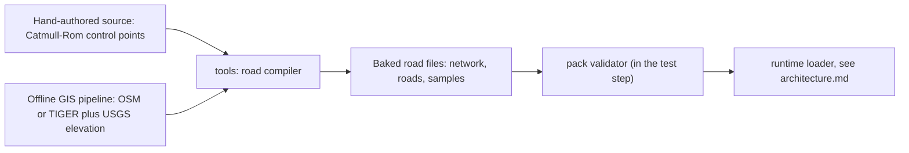

# Content packs and data formats

## In plain words

Tag: summary only; the tags on the choices are in the sections below.

Everything that makes the game *this* game lives in plain data files, not in code: the bikes, the riders and their grudges, the weapons, the events, the regions, the roads, the trash-talk lines, the HUD layouts and the feel presets from the tuning panel.

Those files are grouped into **content packs**. A pack is a folder with a small label file (`pack.json`) that says what it is, which version it is, and which other packs it needs. The whole base game is simply **pack zero**, called `base`. Later regions (chapters of the tour) can ship as their own packs.

The files are JSON, a plain text format that both people and coding agents can read and edit. Each kind of file has a **schema**, a machine-checkable description of what a valid file looks like. A checker runs as part of the normal tests, so a typo like a missing comma or a weapon with no damage gets caught before it reaches the phone.

Formats carry version numbers, and the game refuses to load a pack written in a format it does not understand. While every pack lives in this repo, a format change simply edits those packs in the same change; automatic upgrading of outside packs is built only when outside packs are supported. Letting players load their own packs (mods) is shelved, but nothing here blocks it.

Rare "weird events" (a hurricane gust, a funeral procession, a cult roadblock, a bounty on the player) and radio stations are content too. Their formats are reserved here so they arrive as data, but they are not built for the first milestones.

This doc owns **file formats only**. How the game finds, loads, caches and streams these files at runtime is in [the architecture doc](./architecture.md).

## Tags and scope

Tag: `[default]` for the scope split between this doc and the architecture doc.

Every non-trivial choice carries one tag:

- `[decided]`: traces to a maintainer answer.
- `[default]`: a proposal from this doc; the maintainer or a later agent may change it.
- `[open]`: needs the maintainer; also listed in [Open questions](#open-questions).

Out of scope here: runtime loading, caching, streaming and chunk scheduling (see [the architecture doc](./architecture.md)); the save-file format; the GIS pipeline's internals (only its *output* interface is defined here, in [Road networks](#road-networks-roads-and-routes)); game balance numbers. Numbers in the examples are placeholders for shape, not tuned values.

If this doc and `./architecture.md` disagree on anything runtime-related (the coordinate axes, the asset loader, load order), the architecture doc wins and this doc gets corrected.

## Maintainer decisions this doc builds on

Tag: `[decided]` for each line below; everything else in this doc builds on these.

- Tracks, rivals, bikes and taunts live in editable data files, not in code ("Yes, data files").
- Extensibility: data files plus content packs now; full player mods "maybe later", and the pack format should make that cheap.
- Weapons, rivals and assets must be extensible and easy to change.
- Barks (rider trash talk) must be contextual and non-repetitive: tagged lines plus memory, such as references to grudge history. AI tie-in later. AI barks are generated offline first, live generation optional later.
- In M1, voices are text bubbles.
- One connected road network: roads join at junctions, each road has along/across coordinates, and races are routes through it. It is designed for chunk streaming of big GIS regions.
- Curated real roads, proven incrementally. On licences the maintainer said they are "all basically fine".
- Region 1 is the Florida Keys / A1A. Track 1 is a coastal highway.
- Event types: classic race, takedown hunt, cop escape, grudge match. The race rules follow an "objectives mix". Time of day is set per event, and weather comes later.
- Cops: a mix of tier-rising, every-race and chaos-summoned, with some randomness. Local cops in every region.
- Weapons: club/pipe, chain, wasteland junk, cop baton/taser. A steal is a snatch timed on the wind-up.
- Bikes: 3 bikes to buy with cash, each a clear step up. Slower bikes are wanted as a direction: "Maybe slower bikes too", then "kinda all of these but also to enjoy the scenery" (a slow starter for readable fights, scooters/mopeds/dirt bikes, a lower overall option, a scenic option). How many slow bikes ship in v1, and whether they count among the 3, is not decided (`[default]` below).
- Riders: a few presets, extensible. About 8 named rivals, with roughly 4 regulars plus 4 locals per region; the split is tentative, but "definitely local cops".
- Weird events: rare, data-driven race modifiers, all four kinds wanted (nature chaos, human chaos, wasteland weird, league stunts), with room to grow. Timing is M4 or the shelf `[default]`.
- Radio stations by genre, plus regional stations; surf and rockabilly first for the Keys. DJ lines come later with the AI barks. The M1 and M2 scores stay a single original score. Other soundtrack genres that appeal (tentative, "idk"): grunge, stoner/desert, swamp blues.
- In-game veto: long-press a bark subtitle, billboard or sign and choose "cut this". The flag goes into the debug report, and agents then remove the item and record it in the taste log.
- First run is race-first (a `[default]`; the intro gets iterated on). Beating the boss plays a next-region teaser and free play continues afterwards.
- Easter eggs, all wanted: secret roads and shortcuts, a secret rider or bike, 90s-internet references, real-place gags. Shelf or M4/M5 `[default]`.
- From the maintainer's cockpit answers (2026-09-29): grudges are saved with the career; radio tracks come from both code-made and AI-generated songs, and the maintainer cuts tracks with "cut this" like rival lines; the failure-state default is Road Trip, with Classic and Hardcore later; and when the real Overseas Highway is ready, the maintainer rides both roads and picks, and the other stays as an alternative route.
- Configurable HUD: each element can be toggled and moved, with presets (Full, Classic, Minimal). Movable, configurable touch buttons.
- An in-game tuning panel with presets from M1.
- The goal: bundle assets into the build at the start, stream and cache them later, "I don't want to be limited in the future." One manifest abstraction as the mechanism is the coordinator's answer to that goal, accepted on the blueprint page (`[default]`).
- Big or generated assets live in a Hugging Face dataset repo; mind the HF 10 MB, LFS and Xet limits. What exactly those limits do is (unverified) here.
- The coordinator decides the hard-to-change technical calls, including versioned saves and packs and one GIS coordinate system (the maintainer delegated these; the choices themselves are `[default]`).
- Agents invent content freely within the tone guide; the maintainer vetoes; keep a taste log.
- The repo is public from day one under the MIT licence, with no "Road Rash" in names or branding. The game is inspired by Road Rash (EA, 1991–2000).

## File format choice

Tag: `[default]` for the choice; the reasons follow.

**Content files are strict JSON, validated against schemas written once in TypeScript with Zod, from which JSON Schema files are generated for editors.**

Why JSON data, not TypeScript data modules:

- **Packs must load without compiling code.** A future "load pack" button reads a folder or zip at runtime. JSON parses safely. A TypeScript or JavaScript data file would need a compiler in the browser, and loading someone else's script means running someone else's code. Data-only packs keep the mod door open and safe.
- **Agents edit JSON reliably.** Every coding agent reads and writes JSON well. Editors get autocomplete and inline errors from generated JSON Schema files mapped by folder (see below), so files carry no per-file `$schema` line.
- **Validation errors point at the exact field**, for example `packs/base/weapons/lead-pipe.json /steal/windowEndS: must be at most windupS`.
- **Offline tools emit it trivially.** The Python GIS pipeline and the AI bark generator can both write JSON with no JavaScript toolchain.

Why Zod as the one source of truth:

- One definition gives three things: the TypeScript types the game code uses, the runtime validator the loader and linter use, and the JSON Schema files editors use.
- Cross-field rules, such as "the steal window must sit inside the wind-up", are written as refinements in the same place. JSON Schema cannot express all of them, so the generated `.schema.json` files are advisory editor help; the Zod validator is the real gate.
- **Editor help is generated on demand, not committed.** `npm run schemas` writes the JSON Schema files into the git-ignored `.cache/schemas/`, and one `json.schemas` block in the workspace's `.vscode/settings.json` maps each folder glob to its schema (for example `packs/*/weapons/*.json` to `weapon.schema.json`). That editor setting is `[default]`, and how every editor treats a workspace-relative schema path is (unverified) here. Committing generated files would only add a freshness check that fails whenever a schema is edited, which is a redundant gate; the `type` field already makes each file self-describing for the validator.
- Version facts, fetched 2026-09-29: `npm view zod version` returned `4.6.5`. The Zod docs page on JSON Schema says: "Zod supports native JSON Schema conversion" through `z.toJSONSchema()`, with "Draft 2020-12 (default)". The same page says "Introduced in `zod@3.20.0`", which is earlier than expected for a Zod 4 feature. The quote came through a summarizing fetch, so treat the introduction version as (unverified); pin the real version at scaffold time. The page also says some types "cannot be reasonably represented", such as `z.transform()` and `z.date()`. Schemas for content must avoid those types, so dates are ISO strings.
- The alternative is TypeBox, whose schemas are JSON Schema objects natively, validated with Ajv (`npm view ajv version` returned `8.20.0`). It is a fine swap if Zod's JSON Schema output ever proves lossy. Either way the data files do not change.

Rules for the files themselves `[default]`:

- Strict JSON: no comments, no trailing commas. Put human notes in the optional `meta.notes` field.
- UTF-8, LF line endings, 2-space indent, and a trailing newline. A formatter (Prettier) normalises them so diffs stay small.
- **One entry per file** (one bike, one weapon, one rider), and the filename equals the entry's `id`. Parallel agent lanes then touch disjoint files and rarely conflict. The exceptions are bark sets (many short lines per file), road sample tables, and the small lists inside a region file (signs and billboards, each with its own id).
- Big numeric tables (road samples) may use a binary sidecar later; see [Road networks](#road-networks-roads-and-routes).

## Pack layout and manifest

Tag: `[default]` for the layout and for base being pack zero; `[decided]` that content packs exist ("data files + content packs now").

### Folder layout

```text
packs/
  base/                         # pack zero: the whole base game
    pack.json                   # manifest (hand-written)
    bikes/            <id>.json
    riders/           <id>.json # rivals, cops, player presets
    crews/            <id>.json
    weapons/          <id>.json # includes punch and kick
    events/           <id>.json
    traffic/          <id>.json # traffic, pedestrian and animal kinds
    looks/            <id>.json # visual style presets (M3)
    modifiers/        <id>.json # weird-event modifiers (reserved, M4 or shelf)
    stations/         <id>.json # radio stations (reserved, later)
    careers/          <id>.json
    regions/
      florida-keys/
        region.json
        networks/     <id>.json # road network: junctions + road list
        roads/        <id>.json # one road: lanes, tags, features, samples
        routes/       <id>.json # a path through the network for events
    barks/            <set-id>.json
    hud/              <id>.json
    tuning/           <id>.json
    assets/                     # models, textures, audio, stills
      models/ textures/ audio/ stills/
    LICENSES/                   # per-folder licence texts, e.g. ODbL for OSM roads
src/content/schema/             # the Zod source of truth
tools/packs/                    # validator CLI, indexer, schema emitter (npm scripts)
.cache/schemas/                 # generated JSON Schema for editors (git-ignored)
```

The file `pack.index.json` is **generated** by the indexer at dev and build time and is not committed. It lists every file in the pack with its type and, for assets, the manifest fields `{id, kind, source, path, bytes, hash, packId}` that [the architecture doc](./architecture.md#asset-manifest) defines (`hash` is a SHA-256). The runtime's asset manifest is the union of the loaded packs' indexes. A static web host cannot list folders, so the runtime reads this index instead of guessing paths, and agents never hand-maintain it. Where this doc and [the engineering doc](./engineering.md#big-and-generated-assets) describe the manifest differently, the architecture doc wins.

Where the index lives `[default]` (M1 content-1): `npm run packs:check` writes each pack's index to `.cache/packs/<packId>/pack.index.json`, a folder git ignores, so it can never be committed by accident. M1 bundles the base pack through Vite's `import.meta.glob`, so the runtime does not read the file yet; the build copies it next to a pack when the first streamed pack or remote asset needs it.

### The manifest: `pack.json`

```json
{
  "type": "pack",
  "id": "base",
  "name": "Throttlebrawl base game",
  "version": "0.1.0",
  "formatVersion": 1,
  "gameVersion": ">=0.1.0",
  "dependencies": {},
  "description": "Pack zero. Everything in the base game, including Region 1: the Florida Keys.",
  "authors": ["the maintainer", "agents (see meta.provenance per entry)"],
  "license": "MIT",
  "licenseRules": [
    {
      "paths": [
        "regions/*/networks/osm-*.json",
        "regions/*/roads/osm-*.json",
        "regions/*/roads/osm-*.bin",
        "regions/*/routes/osm-*.json"
      ],
      "spdx": "ODbL-1.0",
      "attribution": "Road data © OpenStreetMap contributors, available under the Open Database License.",
      "licenseFile": "LICENSES/ODbL-1.0.txt"
    }
  ],
  "assetSources": {
    "default": "baked",
    "rules": []
  },
  "defaults": { "tuning": "registry", "hud": "classic" },
  "idAliases": {},
  "meta": {
    "notes": "The base game is itself a pack so every content path is exercised from day one."
  }
}
```

| Field | Meaning |
|---|---|
| `id` | Kebab-case, globally unique. `base` is reserved for pack zero. Other packs use a descriptive id such as `region-pnw`. |
| `version` | Semantic version of the pack's *content*. Bump it whenever the content changes. |
| `formatVersion` | Integer version of the *file formats* (schemas) the pack is written in. See [Versioning and migration](#versioning-and-migration). |
| `gameVersion` | A semver range of game builds the pack claims to work with. It is advisory; `formatVersion` is what the loader enforces. |
| `dependencies` | Map of pack id to semver range, for example `{ "base": "^0.3.0" }`. Only listed packs may be referenced. |
| `license`, `licenseRules` | The default SPDX licence for the pack, plus per-path overrides with the attribution text the credits screen must show. |
| `assetSources` | Where assets come from: `baked` into the build, or fetched from a `remote` store. See [Asset references](#asset-references). |
| `defaults` | The shipped default tuning preset and HUD layout, as ids, plus an optional `look` (a [look](#look) id, added in M3; until it is set the render lane's recommended default look applies). Only the `base` pack's `defaults` are read; other packs' are ignored. The reserved tuning id `registry` means "the parameter registry's own defaults" (it has no file and cannot be a filename). |
| `idAliases` | Old id to new id, so renaming content never breaks saves or replays. |

## Conventions shared by every entry

Tag: `[default]` throughout this section.

### The envelope

Every entry file has the same outer shape:

```json
{
  "type": "weapon",
  "id": "lead-pipe",
  "name": "Lead Pipe",
  "tags": ["blunt", "roadside"],
  "meta": {
    "status": "live",
    "notes": "Starter pickup. Should feel slower than the chain but hit harder.",
    "provenance": { "origin": "agent", "author": "agent", "createdAt": "2026-10-01" }
  }
}
```

- `type` repeats what the folder implies, so the linter can check a file by its content alone, and moving a file cannot silently change what it is.
- `tags` are free-form lowercase strings. Selection rules (barks, traffic mixes, weapon spawns) match on them.
- `meta.status` is one of:
  - `live`: the default. It follows the decided rule that agents invent content freely.
  - `vetoed`: the maintainer said no. The entry stays in the file as the **taste log**, so a later agent or AI batch does not recreate it, and the loader skips it.
  - `draft`: loaded only in dev and staging builds.
- `meta.provenance` records who or what made the entry:
  - `origin` is one of `human`, `agent`, `ai-batch`, `gis-pipeline`.
  - `author` is a role, never a personal name or handle: `maintainer`, `agent`, or a tool name.
  - For `ai-batch`, also record `batchId`, `model`, `promptRef` (a repo path to the prompt file), `generatedAt`, and optionally `reviewedAt`.
  - For `gis-pipeline`, see [Provenance and licence of road data](#provenance-and-licence-of-road-data).
- **`meta` is optional.** Its default is `{ "status": "live", "provenance": { "origin": "agent" } }`. `meta.provenance` is required only when `origin` is `ai-batch` or `gis-pipeline`, because only those two need their trail preserved. The examples below show `meta` on most entries to illustrate the shape; an M1 file may leave it out.

#### In-game veto ("cut this")

`[decided]` that the player-facing flow exists: long-press a bark subtitle, billboard or sign and choose "cut this". The flag goes into the debug report, and agents then remove the item and record it in the taste log. `[default]` for the reference format and the mechanics below.

- Every item that can be vetoed has an id that is stable and unique inside its entry: a bark line, a sign, a billboard. That is why signs and billboards are objects with ids, not bare strings.
- **Content reference format:** `<packId>:<type>/<entryId>#<itemId>`, for example `base:bark-set/kevin-core#kevin-pass-email` or `base:region/florida-keys#ices-before-road`. The debug report's "cut this" list uses exactly this format. The save file uses the same reference to remember which bark lines were heard.
- **The agent's fix** is to set the item's `status` to `vetoed` (bark lines, signs and billboards accept the same `live`, `vetoed` and `draft` values as `meta.status`) and to write the reason in its optional `note`. The vetoed item stays in its file as the taste log the AI-batch generator reads, the loader skips it, and the agent adds a human-readable entry to [the tone guide's taste log](./tone-guide.md#taste-log).
- Whole entries (a rival, a modifier, a station) are vetoed with `meta.status` as above.
- **Radio tracks** are vetoable items inside their station entry, because the maintainer cuts tracks the same way as rival lines `[decided]` (cockpit answer, 2026-09-29). Their reference is `<packId>:station/<stationId>#<trackId>` (see [Radio stations](#radio-stations-reserved)).
- Lint: veto-able item ids are unique within their entry, and nothing live references a vetoed item.

### IDs and references

- An `id` is lowercase kebab-case (`kevin-from-accounting`), unique within its type inside a pack, and equal to the filename.
- **A bare id refers to the same pack.** A reference into another pack is qualified as `<packId>:<id>`, for example `base:lead-pipe`, and that pack must be listed in `dependencies`. Bare ids never fall through to dependencies. Silent fall-through lets two packs shadow each other, which is the classic mod-conflict bug.
- Reference fields say what they point to in their name, for example `bike`, `startingWeapon`, `crew`, `region` and `route`. The linter knows each field's target type and checks that the target exists.
- Renaming an id: add `"old-id": "new-id"` to `idAliases` in `pack.json`. Never reuse a retired id for something different.

### Units and axes

- **Stored numbers are SI, and the unit is in the field name**: `topSpeedMps` (metres per second), `bustRadiusM` (metres), `windupS` (seconds), `massKg` (kilograms), `latDeg` (degrees). Milliseconds are allowed for feel-tuned durations (`hitStopMs`, `…DurationMs`), because those are tuned by eye in ms. The display unit (mph or km/h) is a player setting `[decided]` and never appears in data.
- **Timing fields become ticks.** The sim runs at a fixed 60 Hz ([architecture](./architecture.md#fixed-timestep-and-the-loop)). Every `…S` or `…Ms` timing field is converted once at load to whole ticks, `ticks = max(1, round(seconds * 60))`, and all checks on timing (such as the steal window) use the tick values.
- Unitless 0–1 values end in nothing and are documented as `0..1` in the schema, for example `aggression`.
- Money is an integer number of in-game dollars: `priceCash`, `fineCash`.
- Road space follows [the architecture doc's coordinates](./architecture.md#coordinates): `s` is distance along a road in metres, from its `from` junction to its `to` junction. `d` is the lateral offset in metres, **positive to the right** when facing increasing `s`. Curvature `kappa` is in 1/metres and **positive when the road turns right** (toward positive `d`). `grade` is rise over run (0.05 means 5 %). `bankRad` is positive when the surface tilts down toward positive `d`. The `kappa` and `bankRad` signs are `[default]` extensions of the architecture doc's `d` rule. Sign conventions are defined in one place in code (the `road/` module), and both docs link to that rule rather than restating it differently.
- World space for road geometry is the architecture doc's per-region transverse Mercator frame ([one world coordinate system](./architecture.md#one-world-coordinate-system)): metres, `x` east, `y` up (true elevation), `z` south, so north is `-z`. The frame is anchored at a WGS84 origin given in the region's network file. A flat local tangent plane is not used because over a region as long as the Keys the Earth's curvature would put far roads hundreds of metres off the plane (the architecture doc computes about 785 m at 100 km). This is the "one GIS coordinate system" call, which the maintainer delegated `[decided]` and which is a `[default]` choice.

### Optional fields keep M1 files short

Almost every field beyond the core few is optional, with a default documented in the schema. An M1 bike file can be eight lines. The richer fields in the examples below are what the format *allows*, not what M1 must fill in. See [What M1 needs](#what-m1-needs).

### Which fields count as sim-facing

The registry computes a **sim content hash** over only each entry's sim-facing fields, and a **full content hash** over everything ([architecture](./architecture.md#content-registry)). Sim-facing fields are the ones that enter `SimConfig`: a bike's `handling` and `combat`; a rider's `stats`, `personality`, `grudge` and `law`; a weapon's timing, reach, damage, knockback, steal and uses; a traffic type's size, speed, hazard and behaviour; events, modifiers, roads and sim-affecting tuning. `look`, `engineSound`, `paint`, `blurb`, `tags` and `meta` are presentation-only and excluded, so a paint or proportion edit never changes the replay key. `src/content/schema/` lists the sim-facing fields per type.

How the list is kept `[default]` (M1 content-1): `SIM_EXCLUDED_FIELDS` in `src/content/schema/entries.ts` names, per type, the top-level fields left out of the sim hash; every other field counts as sim-facing. So a rider's `bike`, `role`, `crew` and `startingWeapon` count too, because they decide what enters `SimConfig`, and a field a later lane adds renews the replay key until it is listed, rather than risking replays that silently diverge. Bark sets, HUD layouts and stations are presentation-only. All of a tuning preset's `values` count, since the file does not say which keys affect the sim.

## Asset references

Tag: `[decided]` for the goal (bundle at the start, stream and cache later, "I don't want to be limited in the future"); `[default]` (the coordinator's mechanism, accepted on the blueprint page) that one manifest abstraction is how it is met, and for its shape.

- An **asset id** is the pack-relative path under `assets/` without its extension, for example `models/bikes/putt-scooter` or `audio/barks/kevin/per-my-last-email`. From another pack it is qualified: `base:models/bikes/putt-scooter`.
- Entries hold asset ids in fields ending in `Asset` (`modelAsset`, `portraitAsset`, `audioAsset`). No entry ever holds a URL or a file extension. That keeps "bundled now, streamed later" a config switch.
- The generated `pack.index.json` resolves each asset id to a real file, kind, size and hash, as the manifest entry `{id, kind, source, path, bytes, hash, packId}` ([architecture](./architecture.md#asset-manifest)). The runtime asset loader turns that into a URL. `kind` and the source names come from the architecture doc: sources are `baked`, `remote` and `procedural`.
- `assetSources` in `pack.json` chooses where the bytes live:

```json
{
  "assetSources": {
    "default": "baked",
    "rules": [
      {
        "match": "audio/barks/**",
        "source": "remote",
        "store": "hf-dataset",
        "baseUrl": "https://huggingface.co/datasets/<hf-user>/throttlebrawl-assets/resolve/{revision}/base/"
      }
    ]
  }
}
```

  `<hf-user>` is a placeholder for the maintainer's Hugging Face account, filled in at setup. `{revision}` is not written in the pack: it is filled from the single dataset pin that [the engineering doc](./engineering.md#big-and-generated-assets) keeps, an exact commit and not a branch, so a pack version always means the same bytes and there is only one pin to bump.
- Allowed asset formats `[default]`: `glb` (models), `png` and `webp` (images), `ogg` and `opus` (audio), `json` and `bin` (data). Nothing executable.
- Procedural and code-made assets `[decided]` ("code-made assets first") are referenced by a preset name plus parameters rather than an asset id, for example `"procedural": { "preset": "scooter", "params": { "wheelbaseM": 1.25 } }`. An entry may have both, and a loaded model overrides the procedural one.

## Entry schemas

Tag: per subsection below.

Each schema below shows one realistic example, then notes on the fields. The examples are valid JSON that an agent can copy. Values are placeholders for shape, not balance.

### Bike

Tag: `[decided]` for 3 bikes to buy, each a clear step up, slower bikes as a wanted direction, synthesized engine sound and paint-only customization; `[default]` for how many slow bikes ship in v1, whether they count among the 3, and the field set.

```json
{
  "type": "bike",
  "id": "sunshine-putt-50",
  "name": "Sunshine Putt 50",
  "class": "scooter",
  "tags": ["slow", "scenic", "starter-option"],
  "handling": {
    "topSpeedMps": 20.1,
    "accelMps2": 2.6,
    "brakeMps2": 6.0,
    "steerRateMps": 3.2,
    "grip": 0.55,
    "massKg": 95,
    "airControl": 0.2,
    "wobble": 0.35
  },
  "combat": {
    "hitPowerScale": 0.8,
    "knockbackResistance": 0.4
  },
  "engineSound": {
    "preset": "two-stroke-buzz",
    "cylinders": 1,
    "idleHz": 38,
    "redlineHz": 190,
    "roughness": 0.7
  },
  "look": {
    "procedural": { "preset": "scooter", "params": { "wheelbaseM": 1.25, "deckHeightM": 0.38 } },
    "paintSlots": ["body", "seat"],
    "defaultPaint": { "body": "#f2c14e", "seat": "#3b2b20" },
    "paintOptions": ["#f2c14e", "#7fd1c7", "#f28f8f", "#e8e2c8"]
  },
  "meta": {
    "status": "live",
    "notes": "Kevin's ride, and a slow option for players who want readable fights and the scenery.",
    "provenance": { "origin": "agent", "author": "agent", "createdAt": "2026-10-01" }
  }
}
```

| Field | Notes |
|---|---|
| `class` | `scooter`, `moped`, `dirt`, `rat`, `sport`, `super` or `chopper`, plus the secret joke-ride classes `lawnmower`, `mobility-scooter` and `golf-cart` `[decided]` (the maintainer wants a riding lawnmower, a mobility scooter and a golf cart as secret rides), reserved for M4. It drives defaults, bark targeting (`target.bikeClass`) and traffic-camouflage jokes. Adding a class is a schema change. |
| `handling.*` | The sim's inputs in SI. `steerRateMps` is the maximum lateral speed across the road. `grip`, `airControl` and `wobble` are 0..1. The sim owns what they mean; this doc only fixes their names and units. |
| `combat.*` | Heavier rigs hit harder (the 3DO manual: "The heavier a rider is, the harder he hits"). The final hit power combines the rider's `massKg` and the bike's `hitPowerScale`. |
| `engineSound` | Parameters for the code-synthesized engine `[decided]`. `preset` names a synth patch in code; the numbers shape it. |
| `look` | Paint-only customization `[decided]`: `paintSlots` and `paintOptions`. The model is procedural first, with an optional `modelAsset`. |

Which bikes are *for sale*, and at what price, lives in the career file, not the bike file. The same bike can then be a rival's ride in one pack and a shop item in another.

### Rider (rivals, cops, player presets)

Tag: `[decided]` for personality styles, grudges, local rivals and cops, rivals who may side with or against you, and preset riders; `[default]` for the parameter set.

```json
{
  "type": "rider",
  "id": "tammy-two-stroke",
  "name": "Tammy Two-Stroke",
  "role": "rival",
  "roster": "local",
  "region": "florida-keys",
  "crew": "swamp-kin",
  "tags": ["smoker", "veteran", "dirt"],
  "blurb": "A chain-smoking auntie on a dirt bike.",
  "bike": "brush-hog-250",
  "paint": { "body": "#c0392b", "seat": "#1a1a1a" },
  "stats": {
    "massKg": 72,
    "healthMax": 100,
    "skill": 0.7
  },
  "startingWeapon": "tire-iron",
  "personality": {
    "style": "scrapper",
    "aggression": 0.55,
    "dirtiness": 0.6,
    "courage": 0.7,
    "riskTaking": 0.8,
    "targetPreference": ["grudge", "player", "leader", "nearest"],
    "preferredSide": "either",
    "chatter": 0.7
  },
  "grudge": {
    "startTowardPlayer": 0,
    "gainPerHitTaken": 1,
    "gainPerTakedownSuffered": 3,
    "gainPerWeaponStolen": 2,
    "decayPerRace": 1,
    "huntThreshold": 4,
    "max": 10,
    "reliefWhenHelped": 2,
    "shareWithCrew": 0.5
  },
  "look": {
    "procedural": { "preset": "rider-stocky", "params": { "helmet": "open-face", "jacket": "denim-vest", "proportion": "exaggerated" } },
    "palette": ["#c0392b", "#f5e6c8", "#2b2b2b"],
    "portraitAsset": "stills/riders/tammy-two-stroke"
  },
  "meta": {
    "status": "live",
    "notes": "Florida local. Sample line: \"Honey, I've passed hearses faster than you.\"",
    "provenance": { "origin": "agent", "author": "agent", "createdAt": "2026-09-29" }
  }
}
```

| Field | Notes |
|---|---|
| `role` | `rival`, `cop`, `player-preset` or `extra` (a background biker). One schema serves all four, so a cop can be hit like any rider `[decided]` and a player preset is just a rider with `role: "player-preset"`. |
| `roster` | `regular` (tours with the circuit) or `local` (belongs to a region). About 4 regulars plus 4 locals per region "sounds right" to the maintainer `[decided]`; which rider goes where is a proposal `[default]`. Either way it is data, not a rule in code. |
| `region` | Required for `local`, absent for `regular`. |
| `personality.style` | A named preset registered in `sim/ai/` (weights, thresholds and a behaviour set; [architecture](./architecture.md#controllers-every-rider-is-driven-the-same-way)). The ids are `heavy-hitter`, `weaver`, `showboat`, `grudge-keeper`, `scrapper`, `crowd-pleaser`, `crew-boss`, `cop` and `racer`; personality styles exist `[decided]`, but the list is `[default]`: the first four are the styles named in [the product spec](./product-spec.md#rivals), and the rest, including `racer` (a pure racer who avoids fights), are additions. The other personality fields override the preset's values, so a new rival can be one line (`"style": "heavy-hitter"`) or fully bespoke. All numeric fields are 0..1. M1 registers two presets, `heavy-hitter` (a brawler who hunts a target and rides alongside it) and `racer` (holds its line and swings only at whoever drifts into reach); any other id falls back to `racer` until its own preset lands `[default]` (M1 ai-1). |
| `personality.weave` | Lane habit, 0..1: how far the rider drifts across its lane (0 holds a line; about 0.8 swerves like a weaver). Added by M1 ai-1 `[default]`, alongside `aggression` (how often it swings and how far it hunts), `dirtiness` (how often a swing is a kick), `courage` (how hurt it can be and still pick a fight), `riskTaking` (how readily it dodges traffic through the oncoming lane) and `chatter` (for barks). |
| `targetPreference` | An ordered list the AI uses to choose whom to fight: `grudge`, `player`, `leader`, `nearest`, `crew-enemy`. |
| `grudge.*` | Grudge points per event and the threshold at which the rider starts hunting. `shareWithCrew` spreads a grudge to crewmates (0..1). Grudges are saved with the career `[decided]` (cockpit answer, 2026-09-29): the rules live here, and from M4 the career profile carries each rival's running totals across play sessions ([the architecture doc's save format](./architecture.md#save-format)). `decayPerRace` is what keeps an old grudge from lasting forever. Cop heat carried between sessions stays later `[decided]`. Grudge values steer the AI's target choice, so they are sim inputs: the resolved grudge table at race start must be part of `SimConfig` and so of the replay header ([architecture](./architecture.md#sim-contract-srcsimapits), whose field list is a minimum the contract owner may extend). |
| `crew` | Optional reference to a crew entry. |
| `look.procedural.params.proportion` | `exaggerated` or `realistic`. The maintainer was unsure ("idk"), so this is a look-test item for M3 and a `[default]`, not a decision. It is an ordinary procedural parameter, so settling it changes data, not the format. |

A **cop** adds a `law` block:

```json
{
  "role": "cop",
  "law": {
    "agency": "keys-county-deputies",
    "bustRadiusM": 14,
    "bustDwellS": 1.0,
    "fineCash": 400,
    "pursuitSpeedScale": 1.05,
    "radioVoice": "tired-deputy"
  }
}
```

`bustRadiusM` and `bustDwellS` (how close, and for how long, the cop must stay next to the rider to bust them) are the only source of those two numbers `[default]`; the tuning panel scales them with `cops.bustRadiusScale` and `cops.bustDwellScale` (default 1.0), never overrides. `radioVoice` is reserved and optional; cop radio chatter comes later `[decided]`. The agency is a small entry under `crews/` with `"kind": "law"`, so each region can have its own local law `[decided]` (sheriffs, troopers and so on) with no code change.

### Crew

Tag: `[decided]` that rivals may side with or against you in gang-ups; the maintainer said "maybe a mix of all these" (dynamic and fixed crews), read as simple gang-ups in v1 and deeper crews later. `[default]` that crews are their own entry type, and for the shape.

```json
{
  "type": "crew",
  "id": "swamp-kin",
  "name": "The Swamp Kin",
  "kind": "gang",
  "region": "florida-keys",
  "stanceTowardPlayer": "neutral",
  "gangUp": { "enabled": true, "maxJoiners": 2, "joinRadiusM": 25, "chance": 0.35 },
  "rivalCrews": [],
  "meta": { "status": "live", "provenance": { "origin": "agent", "author": "agent", "createdAt": "2026-10-01" } }
}
```

- Membership is declared once, on the rider (`crew`), never also listed on the crew. Two lists would drift apart.
- `kind` is `gang`, `sponsor-team` or `law`.
- `stanceTowardPlayer` is `hostile`, `neutral` or `friendly`. A friendly crew can side *with* you in a gang-up `[decided]`.
- Deeper crew systems (reputation, factions) are on the idea shelf. New fields can be added as optional without a format bump.

### Weapon

Tag: `[decided]` for the weapon list and the snatch-on-wind-up steal; `[default]` for the field set, including treating punch and kick as weapons.

```json
{
  "type": "weapon",
  "id": "tire-iron",
  "name": "Tire Iron",
  "category": "blunt",
  "behaviour": "melee.swing",
  "tags": ["roadside", "starter"],
  "unarmed": false,
  "reach": { "sM": 1.6, "dM": 1.4 },
  "windupS": 0.34,
  "activeS": 0.1,
  "recoveryS": 0.42,
  "cooldownS": 0,
  "damage": 18,
  "knockback": { "lateralMps": 4.5, "staggerS": 0.35, "takedownBonus": 0.15 },
  "hitStopMs": 70,
  "steal": { "allowed": true, "windowStartS": 0.12, "windowEndS": 0.34 },
  "uses": { "durabilityHits": 12, "charges": null, "dropOnWreck": true },
  "spawn": { "roadsideWeight": 3, "regions": [] },
  "effects": [],
  "sounds": { "swing": "whoosh-heavy", "hit": "clank-meaty" },
  "look": { "procedural": { "preset": "bar", "params": { "lengthM": 0.55 } }, "holdPose": "one-hand-overhead" },
  "meta": { "status": "live", "provenance": { "origin": "agent", "author": "agent", "createdAt": "2026-10-01" } }
}
```

| Field | Notes |
|---|---|
| `category` | `unarmed`, `blunt`, `chain`, `junk`, `shock` or `improvised`. |
| `behaviour` | Required. A registered behaviour id from a closed list in code, such as `melee.swing` or `taser.stun` ([architecture](./architecture.md#content-registry)). `effects` and the timing fields are its parameters. A genuinely new behaviour is a code change plus a registration; a new weapon that reuses one is data only. |
| `unarmed` | `true` for `punch` and `kick`, which are weapon entries too. Then all combat feel is data, and the tuning panel tunes them the same way. Unarmed attacks cannot be dropped or stolen. |
| `reach` | The reach box `{ sM, dM }`: a hit lands when the target's distance along the road is within `sM` metres and its lateral offset is within `dM` metres of the attacker, on the attacked side ([architecture](./architecture.md#movers-on-the-network)). |
| `windupS`, `activeS`, `recoveryS` | The attack's timing in three phases. The wind-up is the telegraph a player reads. Converted once to whole ticks at load (see [Units and axes](#units-and-axes)). |
| `cooldownS` | Optional, default 0. A pause after recovery before the same weapon may start again (the kick uses it; a request made during a cooldown falls back to a punch, per [M1 combat-1](./milestones/M1.md#combat-1--punch-and-kick-with-real-timing-windows)). Converted to ticks like the other timing fields. |
| `hitStopMs` | The base freeze-frame length. Tuning keys under `combat.*` are **scales** on per-weapon values (for example `combat.hitStopScale`, default 1.0), never overrides. |
| `steal` | The snatch window, in seconds from the start of the wind-up. The linter checks the tick values: `0 <= startTick < endTick <= windupTicks`, so a window that rounds to nothing fails too. That encodes the 3DO rule "To Grab Weapon: C (when opponent is holding it out)" `[decided]`. |
| `knockback` | `lateralMps` is the push across the road; `takedownBonus` (0..1) raises the chance a hit sends the target into traffic. |
| `uses` | `durabilityHits` for breakables, `charges` for a taser-style item; `null` means unlimited. |
| `effects` | A list of structured effects such as `{ "kind": "stun", "durationS": 0.8 }`. It is a closed list in code, so packs cannot invent behaviour the sim does not have. |
| `spawn` | Weight for roadside pickups; an empty `regions` list means every region. |

The cop taser would carry `"category": "shock"`, `"tags": ["cop-issue"]`, `"uses": { "durabilityHits": null, "charges": 6, "dropOnWreck": true }` and `"effects": [{ "kind": "stun", "durationS": 0.9 }]`. The research notes that the Saturn manual calls taking a weapon off a cop the easiest way to get one. That is a good reason for the baton and taser to have `steal.allowed: true`.

### Event

Tag: `[decided]` for the four event types, the objectives mix, time of day per event, selectable race length, the cop mix, cash from placing, takedowns, near-misses, airtime, oncoming-lane riding, takedown combos and weapon steals (no bets), and stills-and-text interludes; `[default]` for the shape.

An event has a common part and a `rules` block whose shape depends on `kind`:

```json
{
  "type": "event",
  "id": "keys-t1-sunburn-sprint",
  "name": "Sunburn Sprint",
  "kind": "classic-race",
  "region": "florida-keys",
  "timeOfDay": "golden-hour",
  "lengths": [
    { "id": "short", "route": "overseas-sprint-short", "laps": 1 },
    { "id": "standard", "route": "overseas-sprint", "laps": 1 },
    { "id": "long", "route": "overseas-loop", "laps": 2 }
  ],
  "field": {
    "riders": ["kevin-from-accounting", "tammy-two-stroke"],
    "fillFromPool": { "roster": ["regular", "local"], "count": 6 },
    "rubberband": 0.25,
    "paceMps": 32
  },
  "traffic": { "densityScale": 1.0, "mixOverride": null },
  "cops": { "mode": "every-race", "baseCount": 1, "tierScale": 0.5, "chaosSummon": true, "randomness": 0.3 },
  "rules": {},
  "modifiers": { "pool": "region-default", "maxPerRace": 1, "chanceScale": 1.0 },
  "objectives": [
    { "id": "podium", "kind": "finish-place", "params": { "maxPlace": 3 }, "required": true },
    { "id": "two-takedowns", "kind": "takedowns", "params": { "count": 2 }, "required": false, "rewardCash": 300 }
  ],
  "rewards": {
    "byPlaceCash": [1500, 900, 600, 300, 150],
    "perTakedownCash": 200,
    "perNearMissCash": 25,
    "perAirtimeCash": 40,
    "perOncomingSecondCash": 10,
    "takedownComboScale": 0.5,
    "perStealCash": 60
  },
  "interludes": { "before": "stills/interludes/sunburn-intro", "after": null, "style": "zine-panel" },
  "meta": { "status": "live", "provenance": { "origin": "agent", "author": "agent", "createdAt": "2026-10-01" } }
}
```

`rules` by `kind`:

| `kind` | `rules` fields |
|---|---|
| `classic-race` | none. Point to point versus laps comes from the route's `closed` flag and each length's `laps`, never from a second field. |
| `takedown-hunt` | `targetCount`, `timeLimitS`, `targets` (`any`, or a list of rider ids), `endOnCount` (boolean). |
| `cop-escape` | `escapeBy`: `distance` or `survive`, then `escapeDistanceM` or `surviveS`, plus `startHeat` (0..1) and `copsFromStart`. |
| `grudge-match` | `rival` (rider id), `winBy`: `finish-ahead` or `knockdowns`, then `knockdownsToWin`, plus `grudgeStakes` (grudge points won or lost). |

- `field.paceMps` is optional: the event's rival race pace in metres per second. Its default is the event tier's rival pace. Rival pace comes from the event, not from the bike, so a slow scooter still keeps up with the pack `[default]` ([the product spec](./product-spec.md#rivals)); the AI reads it, and `buildSimConfig` raises a rival's bike `topSpeedMps` and `accelMps2` to at least this pace. It is a sim input, so it is in `SimConfig` and the sim content hash.
- The `rewards` style fields are optional and default to 0: `perNearMissCash`, `perAirtimeCash`, `perOncomingSecondCash`, `takedownComboScale` (a multiplier on `perTakedownCash` for each further takedown in a combo) and `perStealCash`. They implement the decided style-cash sources (near-miss traffic, airtime, oncoming-lane riding, takedown combos and weapon steals, plus "maybe other stuff"), which the sim reports as `style` events ([architecture](./architecture.md#sim-contract-srcsimapits)). Scored in M2, banked in M4 `[default]`.
- `objectives` implement the decided "objectives mix". `required: true` objectives gate advancing; optional ones pay bonuses. "Top 3 to advance" is only a `[default]` example here, never a hard-coded rule, because the maintainer did not pick it.
- `timeOfDay` is one of the region's `timeOfDayOptions`. A `weather` field is reserved for later; the schema accepts it as optional so adding weather is not a format bump.
- `lengths` gives the selectable race length `[decided]`: each option names a route and a lap count. Lap counts above 1 require a `closed` route (a lint rule), so a long option is either a longer point-to-point route or a closed loop with laps. The example's `long` option uses the loop `overseas-loop`.
- `interludes.style` is one of `zine-panel` (rivals), `tv-broadcast` (the league) or `comic-panel`. The maintainer said the mix by context sounds right but was unsure ("idk"), so the styles are tentative `[default]`; adding or dropping one is additive.
- `modifiers` is optional and reserved: which weird-event modifiers may roll in this event. See [Event modifiers](#event-modifiers-weird-events). M1 events omit it.
- `cops.mode` is `none`, `every-race`, `tier-rising` or `chaos-summoned`. `chaosSummon` lets mayhem summon cops even in other modes, and `randomness` jitters counts and timing. That covers the decided mix.
- What happens on a bust or a wreck (fines, retries, consequences) depends on the career's failure mode, which lives in `career/` and the profile's `failureMode`, not in pack files. The default is Road Trip `[decided]` (cockpit answer, 2026-09-29), with Classic and Hardcore as later options ([product spec](./product-spec.md#failure-states)). Events carry only the amounts (a `fineCash` on the cop, optional `wreckCostCash` on the event), never the policy.

### Event modifiers (weird events)

Tag: `[decided]` for rare, data-driven race modifiers in all four kinds wanted (nature chaos, human chaos, wasteland weird, league stunts), with room to grow; `[default]` for the shape below; `[default]` that they arrive in M4 or stay on the shelf. **Reserved, not built for M1.** The type name, the folder and the event's `modifiers` field are reserved now so nothing else takes them and the first modifier does not have to invent a shape or be hard-coded.

A modifier is a small entry under `packs/base/modifiers/`:

```json
{
  "type": "event-modifier",
  "id": "hurricane-gust",
  "name": "Hurricane Gust",
  "kind": "nature",
  "tags": ["wind", "keys"],
  "rarityWeight": 3,
  "eligibility": { "regions": ["florida-keys"], "eventKinds": ["classic-race", "cop-escape"], "timeOfDay": [] },
  "trigger": { "atProgress": [0.3, 0.8], "chance": 0.12 },
  "durationS": 20,
  "effects": [
    { "kind": "lateral-gust", "peakMps2": 3.0, "rampS": 2, "side": "random" },
    { "kind": "spawn-hazard", "hazard": "palm-debris", "count": 4 }
  ],
  "announce": { "barkTrigger": "modifier-start", "sign": null },
  "meta": { "status": "live", "notes": "Placeholder numbers; shape only." }
}
```

| Field | Notes |
|---|---|
| `kind` | `nature`, `human`, `wasteland` or `league`. A closed list in the schema that can grow (adding a kind is a minor schema change). |
| `rarityWeight`, `trigger.chance` | How often the modifier is picked from the pool, and the chance per race that it fires at all. Rare by design. |
| `eligibility` | Region ids, event kinds and times of day it may appear in. An empty list means "any". |
| `trigger.atProgress` | Optional race-progress window (0..1) in which it may start. |
| `durationS` | How long it lasts; converted to ticks at load like every timing field. |
| `effects` | A **closed list in code**, the same pattern as weapon `effects`, so packs cannot invent behaviour the sim lacks. The reserved list: `lateral-gust`, `spawn-hazard`, `spawn-convoy`, `traffic-override`, `cash-multiplier-zone`, `bounty-on-player`, `guest-rider`, `show-billboard`. A new effect kind is a code change; a new modifier built from existing kinds is data only. |
| `announce` | An optional bark trigger (`modifier-start`, added to the reserved trigger list) and an optional sign id, so the world can react in words. |

**The maintainer's wanted examples**, all placeholders within the [tone guide](./tone-guide.md#hard-lines) (the funeral procession and rocket launch in particular must follow its hard lines):

| `kind` | Wanted examples |
|---|---|
| `nature` | hurricane gust, gator crossing, cold-night iguana rain |
| `human` | parade, funeral procession, spring-break convoy, offshore rocket launch |
| `wasteland` | cult roadblock, runaway boat on a trailer, a UFO billboard that comes true (a `show-billboard` effect followed by a `spawn-hazard`) |
| `league` | a bounty on the player (`bounty-on-player`), double-cash zones (`cash-multiplier-zone`), a guest "celebrity" rider (`guest-rider`) |

Rules:

- An event opts in with `modifiers: { "pool": [ids] | "region-default", "maxPerRace": n, "chanceScale": x }`. `region-default` means every live modifier whose `eligibility` matches; regions do not keep a second list.
- Modifiers change the sim (traffic, hazards, cash), so the roll must be deterministic: it uses its own seeded `modifiers` stream, and the resolved modifiers are part of `SimConfig` and the replay header ([architecture](./architecture.md#event-modifiers)). The `modifierStart` and `modifierEnd` sim events are what the `modifier-start` bark trigger listens to.
- No modifier content before M4 (`[default]`). Until then events simply omit `modifiers`, and the sim carries only an empty list.

### Career

Tag: `[decided]` for about 10 events in 3 tiers with a boss grudge race, 3 bikes, learn-by-riding in event 1, and an ending that plays a next-region teaser and then lets free play continue; `[default]` that this is its own small file, and that the first run is race-first (the maintainer answered "all of the above… maybe race first", and the intro gets iterated on).

```json
{
  "type": "career",
  "id": "keys-circuit",
  "name": "The Keys Circuit",
  "region": "florida-keys",
  "startingCash": 500,
  "startingBike": "rustbucket-400",
  "tutorialEvent": "keys-t1-shakedown",
  "tiers": [
    { "id": "t1", "name": "Tourist Season", "events": ["keys-t1-shakedown", "keys-t1-sunburn-sprint", "keys-t1-chicken-run"], "advance": { "requiredEvents": 2 } },
    { "id": "t2", "name": "Hurricane Season", "events": ["keys-t2-bridge-brawl", "keys-t2-deputy-dash", "keys-t2-mangrove-hunt"], "advance": { "requiredEvents": 2 } },
    { "id": "t3", "name": "Off Season", "events": ["keys-t3-overseas-run", "keys-t3-tammy-grudge", "keys-t3-night-market"], "advance": { "requiredEvents": 2 } }
  ],
  "boss": "keys-boss-mother-rust-grudge",
  "firstRun": "race-first",
  "ending": { "teaser": "stills/interludes/next-region-teaser", "freePlayAfter": true },
  "shop": [
    { "bike": "rustbucket-400", "priceCash": 0, "unlockTier": "t1" },
    { "bike": "gulfstream-750", "priceCash": 6000, "unlockTier": "t2" },
    { "bike": "hurricane-1100", "priceCash": 18000, "unlockTier": "t3" }
  ],
  "unlocks": [
    { "grant": "riding-lawnmower", "when": { "kind": "boss-beaten", "ref": "keys-boss-mother-rust-grudge" } }
  ],
  "meta": { "status": "live", "provenance": { "origin": "agent", "author": "agent", "createdAt": "2026-10-01" } }
}
```

- `firstRun: "race-first"` puts the player straight into `tutorialEvent` on first launch, with the intro kept short and iterated on `[default]`.
- `ending.teaser` plays after the boss is beaten, and `freePlayAfter: true` keeps the game playable afterwards `[decided]`.

- `unlocks` is optional (M4, not a format bump): a list of `{ grant, when }`, where `grant` is a bike or rider id and `when` has a closed `kind` (`boss-beaten` or `event-won`) plus a `ref` to the boss or event id. Anything tagged `secret` is absent from the shop and menus until its `when` is met. In the example the secret riding lawnmower joke ride unlocks after the boss, in free play `[default]`.

The names are placeholders within the tone guide. Whether the slow starter or the first shop bike is the default ride is a feel question for playtests, not a format question.

### Traffic type

Tag: `[decided]` for cars, trucks, an oncoming lane, pedestrians and animals that dive away cartoonishly with no gore, and wasteland oddities; `[default]` for the field set, which the architecture doc leaves to content ("vehicle types ... are content", [movers](./architecture.md#movers-on-the-network)).

One entry describes one kind of road user: a car, a truck, a pedestrian, an animal or an oddity. Files live in `packs/base/traffic/`.

```json
{
  "type": "traffic-type",
  "id": "box-truck",
  "name": "Box Truck",
  "category": "truck",
  "tags": ["commercial"],
  "lengthM": 7.5,
  "widthM": 2.4,
  "cruiseMps": 22.0,
  "hazard": "big",
  "behaviour": { "carFollowing": true, "laneChanges": false, "dives": false },
  "look": {
    "procedural": { "preset": "box-truck", "params": { "cargoHeightM": 2.8 } },
    "paintOptions": ["#e8e2c8", "#7fd1c7", "#d9d9d9"]
  },
  "meta": { "status": "live", "provenance": { "origin": "agent", "author": "agent", "createdAt": "2026-10-01" } }
}
```

| Field | Notes |
|---|---|
| `category` | `car`, `truck`, `rv`, `oddity`, `pedestrian` or `animal`. It picks the movement model: `car`, `truck`, `rv` and `oddity` follow a lane with car-following; `pedestrian` and `animal` spawn from `roadsideZone` features and dive away when a rider gets close. |
| `lengthM`, `widthM` | The oriented box the sim uses for contacts and for spawn spacing. |
| `cruiseMps` | The speed it cruises at when nothing is ahead. Oncoming vehicles use the same value toward decreasing `s`. |
| `hazard` | `normal` (a first contact wobbles you) or `big` (hitting one crashes you). |
| `behaviour` | Flags: `carFollowing` (default true for vehicles), `laneChanges` (rare seeded lane changes), `dives` (true for pedestrians and animals). Optional; the category supplies defaults. |
| `look` | The same shape as a bike's `look`: a procedural preset with parameters first, and an optional `modelAsset`. |

- `traffic.mix[].kind`, `traffic.pedestrians[].kind` and `traffic.animals[].kind` in a [region file](#region) are references to `traffic-type` ids. The linter checks that each exists and that the category fits the list it is in (a `pedestrian` type in `pedestrians`, and so on). A mix entry's own `hazard` is an optional override of the type's; `weight` and `tags` live on the mix entry.
- Oddities are ordinary entries with `category: "oddity"` (or any category plus the `oddity` tag), so wasteland oddities need no code.
- The type's sim-facing fields (`lengthM`, `widthM`, `cruiseMps`, `hazard`, `behaviour`, `category`) are in the sim content hash; `look` and `name` are not.

### Look

Tag: `[decided]` that the look is chosen by a look test after M1, that the zine overlay is a source of visual identity, and that palettes are compared and set per time of day (tentative, "idk"); `[default]` for the entry shape. Introduced in M3 ([M3 content-3](./milestones/M3.md#content-3--look-data)); it is optional, so it is not a format bump.

```json
{
  "type": "look",
  "id": "chunky-lowpoly-zine",
  "name": "Chunky low-poly with zine overlay",
  "style": "chunky-lowpoly",
  "overlay": "subtle",
  "palette": "keys-signature-a",
  "proportions": "exaggerated",
  "meta": { "status": "draft", "notes": "Illustrative combination for the M3 look switcher." }
}
```

| Field | Notes |
|---|---|
| `style` | A registered `LookStyle` id: `ps1-authentic`, `chunky-lowpoly`, `comic-cel` or `hazy-painterly` ([architecture](./architecture.md#look-layer-swappable)). |
| `overlay` | `off`, `subtle` or `full`: the zine and photocopy overlay level. |
| `palette` | A palette id, keyed by time of day when the palette entry carries per-time variants. A region's `timeOfDayOptions[].palette` can still override colours. |
| `proportions` | `exaggerated` or `realistic` (the rider proportions look test, tentative). |

`pack.json` `defaults.look` names the shipped default look. Looks are presentation-only, so they are in the full content hash and not the sim content hash.

### Region

Tag: `[decided]` for regions as chapters with local rivals, gangs, law, humor and time of day per event, and a traffic mix that includes wasteland oddities; `[default]` for the shape.

See [Region 1 stub: the Florida Keys](#region-1-stub-the-florida-keys) for a full example. Its fields:

| Field | Notes |
|---|---|
| `networks` | The road networks in this region. v1 has one. |
| `timeOfDayOptions` | Allowed values for an event's `timeOfDay`, each with a lighting preset name: `dawn`, `noon`, `golden-hour`, `dusk`, `night`. An option may carry its own optional `palette` that overrides the region's, because the maintainer wants palettes compared and set per time of day (tentative, "idk" `[default]`). |
| `traffic.mix` | Weighted vehicle kinds. Each `kind` is the id of a [traffic type](#traffic-type); the `hazard` class (`normal` or `big`, where hitting a big one crashes you) comes from the type and can be overridden here. Oddities are ordinary entries tagged `oddity`. |
| `traffic.pedestrians`, `traffic.animals` | Weighted kinds (ids of `traffic-type` entries with category `pedestrian` or `animal`) that dive away cartoonishly `[decided]`; `big: true` means hitting one crashes you and overrides the type. |
| `signs`, `billboards` | Objects with an `id`, `text`, optional `tags`, an optional image asset (billboards), and an optional `status` (`live`, `vetoed`, `draft`) so the in-game veto can cut one ([In-game veto](#in-game-veto-cut-this)). Roads place them with `billboard` features, which name an `item` or a `pool` to fill the slot. |
| `palette` | Colour hints for the renderer and UI, so each region has a visual identity. |
| `weather` | Reserved, optional, later `[decided]`. |

**Nothing in a region lists its people or its law.** The registry derives them, so there is one source of truth: local rivals are the riders with `roster: "local"` and `region` equal to this region; local cops are the riders with `role: "cop"` whose `law.agency` is a crew of `kind: "law"` in this region; stations come from each station's `regions` list; modifiers come from each modifier's `eligibility`.

### Radio stations (reserved)

Tag: `[decided]` for radio stations by genre plus regional stations, surf and rockabilly first for the Keys, DJ lines later with the AI barks, and a single original score for M1 and M2; `[default]` for the shape and for the genre list. The maintainer said grunge, surf/rockabilly, stoner/desert and swamp blues all appeal, tentatively ("idk"), so genres beyond surf and rockabilly are placeholders. **Reserved, not built for M1 or M2.**

```json
{
  "type": "station",
  "id": "keys-surf",
  "name": "Surf Radio 24",
  "genre": "surf",
  "regions": ["florida-keys"],
  "tracks": [
    { "id": "reef-break", "title": "Reef Break", "audioAsset": "audio/music/keys-surf/reef-break", "origin": "ai-batch", "status": "live" },
    { "id": "causeway-twang", "title": "Causeway Twang", "procedural": { "preset": "surf-trio", "params": { "bpm": 168 } }, "origin": "agent", "status": "live" }
  ],
  "djBarkSet": null,
  "meta": { "status": "draft", "notes": "Placeholder. Tracks must be original: code-made, or AI-generated under a licence that allows a public game." }
}
```

- `regions` is a list of region ids; an empty list means the whole circuit (a "genre station"), and a non-empty list makes it a regional station.
- `tracks` `[default]` for the shape: each track is an object with an `id` (unique within the station), a display `title`, and either an `audioAsset` (see [Asset references](#asset-references)) or a `procedural` preset for a track written as code. `[decided]` (cockpit answer, 2026-09-29) that tracks come from both routes, code-made and AI-generated, and that the maintainer cuts tracks with "cut this" like rival lines. So `origin` (`agent` for code-made, `ai-batch` for AI-generated, with the batch provenance on the station's `meta` as for bark batches) marks every AI track as AI-generated, and `status` (`live`, `vetoed`, `draft`) plus an optional `note` is how a single track is cut and kept as the taste log. Because the format is still reserved, this shape replaces the earlier plain list of asset ids without a format bump.
- `djBarkSet` is an optional bark-set id for a DJ's lines, filled in later when AI barks arrive.
- The M1 and M2 score is not a station: it is one original score made of ordinary audio assets that the audio system plays ([architecture](./architecture.md#audio)). Stations arrive with the radio feature.

### Easter eggs

Tag: `[decided]` that all four kinds are wanted (secret roads and shortcuts, a secret rider or bike, 90s-internet references, real-place gags); `[default]` for the shelf or M4/M5 timing. **No new format is needed.** A secret road is an ordinary road (or a `shortcut` lane) that a route lists in `allowedRoads` and the scenery does not advertise; a secret rider or bike is an ordinary entry that the career does not put on any list, tagged `secret`; references and gags are ordinary bark, sign and billboard lines tagged `easter-egg`, subject to the same veto and the [tone guide](./tone-guide.md). Unlock conditions use the career's optional [`unlocks` list](#career), which is not a format bump.

### Road networks, roads and routes

Tag: `[decided]` for one connected network with along/across coordinates, junctions, streaming, and jumps and ramps in v1; `[default]` for this exact interface.

This is the interface a later **offline GIS pipeline** emits, and hand-authored M1 tracks use the same interface. The runtime never talks to OpenStreetMap or any other source; it only reads baked files. That follows the research: "an offline compiler … bakes a compact game-specific format. The runtime never talks to OSM."



The **baked** format below is the contract, and it follows [the architecture doc's data model](./architecture.md#data-model) field for field: edges with sampled profiles, lane sections with `dCenter`, junctions that own connector edges and a lane-level table, and features as ranges. This doc owns the *file shape*; the architecture doc owns what the sim does with it. How a human writes a road is an authoring convenience compiled into the baked format `[default]`: hand-authored M1 roads are Catmull-Rom control points, as the architecture doc says, and an optional "200 m, gentle left, small hill" segment list may be compiled the same way. The runtime has one road format.

#### Network file: `regions/<region>/networks/<id>.json`

```json
{
  "type": "road-network",
  "id": "keys-m1",
  "name": "Keys M1 coastal loop (hand-authored)",
  "region": "florida-keys",
  "crs": { "kind": "tmerc", "originLatDeg": 24.70, "originLonDeg": -81.10, "originElevM": 0 },
  "chunking": { "kind": "none" },
  "roads": ["overseas-main", "bridge-hump", "ramp-cut", "c-west-main-bridge", "c-west-main-ramp"],
  "junctions": [
    {
      "id": "j-marina",
      "x": 0, "y": 1.5, "z": 0,
      "ends": [{ "road": "overseas-main", "end": "from" }],
      "connectors": [],
      "control": "none"
    },
    {
      "id": "j-channel-west",
      "x": 3800, "y": 2.0, "z": -140,
      "ends": [
        { "road": "overseas-main", "end": "to" },
        { "road": "bridge-hump", "end": "from" },
        { "road": "ramp-cut", "end": "from" }
      ],
      "connectors": [
        {
          "id": "cx-main-bridge",
          "road": "c-west-main-bridge",
          "from": { "road": "overseas-main", "end": "to", "lane": "R1" },
          "to": { "road": "bridge-hump", "end": "from", "lane": "R1" }
        },
        {
          "id": "cx-main-ramp",
          "road": "c-west-main-ramp",
          "from": { "road": "overseas-main", "end": "to", "lane": "R1" },
          "to": { "road": "ramp-cut", "end": "from", "lane": "S1" },
          "splitZone": { "s0": 3760, "s1": 3800, "d0": 2.4, "d1": 4.9 }
        }
      ],
      "control": "none"
    }
  ],
  "provenance": { "origin": "human", "author": "agent", "createdAt": "2026-10-01", "sources": [] },
  "meta": { "status": "live", "notes": "Shortened for the doc: the merge junction j-channel-east and the opposite-direction connectors are omitted; a real network lists all of them." }
}
```

- `crs`: the transverse Mercator frame for every `x`, `y`, `z` in this network (see [Units and axes](#units-and-axes)): metres, `x` east, `y` up, `z` south. A hand-authored network still gets an origin near the place it imitates, so a later GIS bake of the same area lines up.
- `junctions[].ends` lists which road ends meet here; every road has exactly one `from` junction and one `to` junction. A dead end is a junction with one end. `connectors` is the architecture doc's lane-level table: each one maps `(road, end, lane)` to `(road, end, lane)` **through a connector road**, an ordinary short road (usually generated by the compiler and listed in `roads`) so a mover is always on some road, even inside a junction. Whatever is not listed is not a legal turn. A compiler may offer the shortcut "generate connectors for every end pair", but that is an authoring convenience and never a runtime rule.
- **Pass-through joins** `[default]` (M1 app-1): a junction with exactly two road ends and no `connectors` joins them directly, with no connector road. Lanes carry over by `id`, and a mover's overshoot carries into the next road. It is the one exception to "whatever is not listed is not a legal turn", and it is how the M1 track's three roads join end to end.
- `splitZone` (optional, on a connector): a marked stretch of the source road where the rider's lateral position `d` between `d0` and `d1` selects this connector, with no button press, as the architecture doc describes for the ramp shortcut.
- **Connector rows, as built** `[default]` (M1 road-2):
  - A row's `from` road end meets the connector road's `from` end, and its `to` road end meets the connector's `to` end. A row whose lanes have `direction` −1 carries oncoming traffic back from `to` to `from`, so one connector road serves both directions, and the compiler writes one row per drive lane (`R1` and the oncoming `L1`).
  - A connector road runs `from` and `to` the one junction whose rows name it, and it is not listed in that junction's `ends`; its ends are joined by the rows. The ordinary road ends are still listed there.
  - A split zone must reach the end of the source road that the connector leaves from. The runtime decides at that end: a mover whose `d` is inside the zone takes the zone's connector, and every other mover takes the default way on (the connector without a zone, preferring one with no `shortcut` lane).
  - `d` maps across a join by the geometry: the lateral offset of the connector's end point in the road end's frame. So a connector may start off the centreline (the shortcut's starts 3.4 m right of it), and the world position holds across the join. The lane ids in a row name the lanes for traffic and tools.
  - A connector road that leads onto or off a road with a `shortcut` lane carries no `drive` lane, so traffic, which takes only drive-lane connectors, can never reach the shortcut.
- `control`: `none`, `stop` or `signal`, reserved for traffic behaviour.
- `chunking`: `none` for v1. For big GIS regions, `{ "kind": "grid", "cellM": 512 }` tells the baker to split samples into per-cell chunk files (next section). How chunks stream is in [the architecture doc](./architecture.md#chunks).

#### Road file: `regions/<region>/roads/<id>.json`

```json
{
  "type": "road",
  "id": "bridge-hump",
  "name": "Pelican Channel Bridge",
  "realName": null,
  "network": "keys-m1",
  "from": "j-channel-west",
  "to": "j-channel-east",
  "lengthM": 1200,
  "sampleSpacingM": 2,
  "speedLimitMps": 24.6,
  "surface": "asphalt",
  "laneSections": [
    {
      "s0": 0,
      "lanes": [
        { "id": "L1", "dCenterM": -1.7, "widthM": 3.4, "direction": -1, "kind": "drive" },
        { "id": "R1", "dCenterM": 1.7, "widthM": 3.4, "direction": 1, "kind": "drive" },
        { "id": "R0", "dCenterM": 4.15, "widthM": 1.5, "direction": 1, "kind": "shoulder" }
      ]
    }
  ],
  "tags": [
    { "s0": 0, "s1": 1200, "side": "both", "tag": "bridge" },
    { "s0": 0, "s1": 1200, "side": "both", "tag": "water-open" }
  ],
  "features": [
    { "kind": "ramp", "id": "hump-kicker", "s0": 606, "s1": 614, "d0": 0, "d1": 3.4 },
    { "kind": "hazard", "id": "pelican-roost", "s0": 900, "s1": 915, "d0": 3.4, "d1": 4.9, "hazard": "animals", "params": { "animal": "pelican" } },
    { "kind": "billboard", "id": "bb-channel-1", "s0": 380, "s1": 420, "d0": 6, "d1": 9, "item": "timeshare" }
  ],
  "samples": {
    "encoding": "json-columns",
    "columns": ["x", "y", "z", "kappa", "grade", "bankRad"],
    "data": {
      "x": [3800, 3802, 3804],
      "y": [2.0, 2.12, 2.24],
      "z": [-140, -140.008, -140.032],
      "kappa": [-0.004, -0.004, -0.004],
      "grade": [0.06, 0.06, 0.06],
      "bankRad": [0, 0, 0]
    }
  },
  "provenance": { "origin": "human", "author": "agent", "createdAt": "2026-10-01", "sources": [] },
  "meta": { "status": "live", "notes": "Samples truncated to three for the doc; a 1200 m road at 2 m spacing has 601. In these samples y is elevation and z is southward, so a negative z change means the road bends north, a left turn, hence negative kappa." }
}
```

What a road carries:

- **Centreline samples** at a uniform arc-length spacing. The compiler picks `n = round(lengthM / nominalSpacingM)` intervals (nominal `[default]` 2 m, matching the architecture doc; the linter allows a stored spacing of 1–10 m) and stores `sampleSpacingM = lengthM / n` exactly. That gives `n + 1` samples, sample `i` sits at `s = i * sampleSpacingM`, and the last sample sits exactly at `lengthM`, even when the real road length is not a multiple of 2 m. Lint: `count == n + 1` and `abs(sampleSpacingM * n - lengthM) < 1e-6`. Columns:
  - `x`, `y`, `z`: position in the network's frame (`x` east, `y` up, `z` south).
  - `kappa`: signed curvature, positive when the road turns right (see [Units and axes](#units-and-axes)).
  - `grade`: rise over run.
  - `bankRad`: road tilt.
  - An optional `headingRad` may be added.
- **Why position and curvature are both stored:** the sim consumes curvature and grade per step (the classic pseudo-3D "curve and hill"), while rendering, chunking and junctions need positions. The compiler emits both from one smoothed spline, and the linter checks that they agree within a tolerance. The research warns that "curvature must be computed on a smoothed spline, not the raw polyline", so that job belongs to the compiler, never to the runtime.
- **Encodings** `[default]`:
  - `json-columns` for hand-authored and small roads. It is column-wise (one array per quantity, not one object per sample), which is compact and loads straight into typed arrays.
  - `f32-columns` for big baked roads, as `{ "encoding": "f32-columns", "columns": [...], "count": 13831, "dataAsset": "roads/overseas-main" }` pointing to a little-endian Float32 `.bin` asset in the same column order.
  - When chunked, `{ "encoding": "chunked", "chunks": [{ "s0": 0, "s1": 1000, "dataAsset": "roads/overseas-main-c0" }] }`.
  - For scale, the research measured 27.66 km of real highway at 5 m spacing as 5,532 points and about 86 KiB for four float32 columns. At the 2 m default the same road is 13,831 points: about 216 KiB for four float32 columns, or about 324 KiB for the six columns above (computed).
- **Lanes** in `laneSections`, each starting at `s0` and running until the next section starts. That handles a road that widens or gains a shoulder. Each lane is `{ id, dCenterM, widthM, direction, kind }` exactly as the architecture doc's `{dCenter, width, direction, kind}`: `dCenterM` is the lane centre's `d`, `direction` is `1` (with increasing `s`) or `-1` (oncoming, moving toward decreasing `s`, which is the decided oncoming lane `[decided]`), and `kind` is `drive`, `shoulder` or `shortcut`. There is no separate reference line: `dCenterM` already says where `d = 0` sits.
- **Scenery tags** over `s` ranges, per side. The v1 vocabulary is a closed list in the schema, so the renderer can rely on it, and adding a tag is a minor schema change: `water-open`, `water-shallow`, `mangrove`, `beach`, `bridge`, `causeway`, `palms`, `marina`, `strip-mall`, `trailer-park`, `swamp`, `town`, `landmark`.
- **Features** are ranges in road space, and the vocabulary is exactly the architecture doc's list: `ramp`, `gap`, `hazard`, `roadsideZone` (pedestrian and animal spawns, landmark set dressing), `copSpawn`, `raceMarker` (event start points and, later, world race markers) and `billboard`. A `billboard` feature is a slot (used for signs too): its `item` names one specific billboard or sign id in the region file, or a `pool` (`billboards` or `signs`) lets the game fill the slot from that list. Either way the shown item has a stable content reference, so the in-game veto can name it ([architecture](./architecture.md#in-game-veto-cut-this)). Jumps and ramps are in v1 `[decided]`, including one ramp shortcut. A `ramp` is **baked into the elevation samples by the compiler** (a lip in the profile, from which the sim detects takeoff, as the architecture doc says); the feature record only marks its range, for AI, audio and the lint below. There are no launch-angle or landing fields, so there is one ramp model, not two. The shortcut itself is a separate short road with a `shortcut` lane, entered through a connector with a `splitZone` and rejoining through another junction.
- **Boost pads and the ramp truck** `[decided]` (playtest 1b quick wins, 2026-09-30), with the field shapes `[default]`:
  - A `boostPad` is a box in road space. A grounded rider who rides into it gets a short speed boost and one `boost` event. `params.boostMps` is the speed added (default 8) and `params.holdS` how long the boost lasts (default 1.5 s). The snapshot shows the seconds left as a rider's `boostS`.
  - A `rampTruck` is a parked car-carrier tow truck whose rear deck is a jump ramp. `s0` is the foot of the ramp, `s1` the truck's front bumper, and `d0`..`d1` its width. The deck rises from the road at `s0` to `params.lipHeightM` (default 2.8 m) over `params.rampLengthM` (default 11.5 m, a 13.7° slope), then stays at the lip height to `s1`. It faces riders travelling toward increasing `s`; riding into its side or front higher than a kerb crashes. The truck is a second ramp model beside the baked `ramp`, on purpose: a baked lip spans the whole road, so traffic would drive into it, while the truck covers only its own width, which is placed off the traffic lanes. It is not baked into the elevation samples, and the sim adds the deck to the surface only for riders. The jump lint below applies to it as to a `ramp`.
  - Both are drawn by render from the road's `features`, like `billboard` slots. Placeholder geometry until the props are ready.
- **Barriers** `[default]` are an optional `barriers` list on a road file: `[{ "s0": 0, "s1": 1200, "side": "left" | "right" | "both", "kind": "rail" | "wall", "heightM": 1.0 }]`. Adding it is not a format bump. A `rail` lets a tumble body that is above `heightM` cross it (the funny splash over a bridge rail `[decided]`, see [Crash tumble](./architecture.md#crash-tumble)); a `wall` does not. Water is the region's sea level, world `y = 0` in the network's frame; there is no per-road water height. `road/` answers `barrierAt(edge, s, side)`. Lint: barrier ranges lie inside `0..lengthM`.
- `realName`: the real road name when the road follows one, such as the Overseas Highway. `null` for invented roads.
- **Junction continuity** is checked by the linter: a road's first sample must lie within 0.5 m of its `from` junction, and its last sample within 0.5 m of its `to` junction. At a junction with connectors `[default]` (M1 road-2), the ends it lists must lie within 60 m of its point, because the connector roads span the junction; instead, each connector's end must meet the road end its row joins: within 0.5 m along the road and vertically, inside that road's width, and pointing the same way within 3°.
- **Jump lint** (from the architecture doc): `ramp` and `gap` features must sit on stretches whose curvature over the expected flight length is below a threshold, because an airborne body "bends with the road" in road coordinates. As built `[default]` (M1 road-2): `|kappa|` must stay at or below 0.002 (a 500 m radius) from the feature's start to its expected landing. For a ramp, the expected landing is where a bike leaving the ramp's highest sample at 44.7 m/s (the starter bike's top speed, 100 mph since playtest 1; M1's was 38 m/s), on the slope just before it, meets the surface again; for a gap, 20 m past its end. The grade rule skips ramp ranges, since a lip is a deliberate kink.
- **Ramps, as built** `[default]` (M1 road-2): the compiler bakes a ramp as a kicker that rises `heightM` over `lengthM` with a steepening slope (`y = h·u²`), then a back that drops to the base over `backM`, with the lip moved onto a sample so the sampled surface keeps its full height. The M1 boat ramp rises 1.5 m over 15 m, a 20 % lip.

#### Route file: `regions/<region>/routes/<id>.json`

```json
{
  "type": "route",
  "id": "overseas-sprint",
  "network": "keys-m1",
  "start": { "road": "overseas-main", "s": 40, "dir": 1 },
  "finish": { "road": "bridge-hump", "s": 1180 },
  "mainPath": ["overseas-main", "bridge-hump"],
  "allowedRoads": ["overseas-main", "bridge-hump", "ramp-cut", "c-west-main-bridge", "c-west-main-ramp"],
  "checkpoints": [{ "road": "overseas-main", "s": 2000 }],
  "closed": false,
  "startGrid": { "rows": 4, "perRow": 2, "rowGapM": 8 },
  "meta": { "status": "live" }
}
```

This matches [the architecture doc's races-as-routes model](./architecture.md#races-as-routes): a start, a finish, an **allowed road set** (the main path plus legal shortcuts and the connector roads between them) and optional checkpoints. Race progress is measured by the runtime as distance to finish over every allowed road, so the ramp shortcut counts as progress and leaving the set does not.

- `mainPath` lists road ids in order; consecutive roads must connect through a junction connector, and every `mainPath` road must also be in `allowedRoads`. The linter checks both. As built `[default]` (M1 road-2): `mainPath` lists the ordinary roads, not the connector roads between them; consecutive roads join by a pass-through join or by a row without a split zone, and that row's connector road must be in `allowedRoads` too.
- **Distance to finish, as built** `[default]` (M1 road-2): the main path's roads and the connector roads between them measure the distance along the main path. Every other allowed road (a shortcut and its connectors) measures the true distance forward along itself to where it rejoins, plus the rejoined road's distance there. So distance to finish falls steadily along either path and never rises: a rider who takes the shortcut gains its saving the moment it enters the shortcut's connector (its race position can jump then), and a rider who stays on the main path sees no jump. Progress is the route length minus the distance to finish.
- A route with `closed: true` loops; **lint: `laps > 1` in an event length requires a `closed` route.** Selectable length is a shorter or longer route, or a closed loop with a lap count, as the architecture doc says.
- A route is the only thing an event needs from the network, which keeps races as "routes through one network" `[decided]`.

#### Provenance and licence of road data

Tag: `[decided]` that the maintainer finds the licences of these data sources "all basically fine"; `[default]` for the fields and for the compliance approach below.

Every network and road carries `provenance.sources`. The GIS pipeline fills them in:

```json
{
  "provenance": {
    "origin": "gis-pipeline",
    "author": "tools/gis",
    "createdAt": "2026-11-02",
    "tool": { "name": "tools/gis/bake_road.py", "version": "0.1.0", "configRef": "tools/gis/configs/keys-overseas.json" },
    "sources": [
      {
        "name": "OpenStreetMap",
        "spdx": "ODbL-1.0",
        "attribution": "© OpenStreetMap contributors",
        "url": "https://www.openstreetmap.org/copyright",
        "query": "way[\"ref\"=\"US 1\"][\"highway\"](24.54,-81.82,25.20,-80.35); out geom tags;",
        "retrievedAt": "2026-11-02T03:10:00Z",
        "sha256": "<hash of the raw extract>"
      },
      {
        "name": "USGS 3DEP elevation",
        "spdx": "LicenseRef-US-Public-Domain",
        "attribution": "Map services and data available from U.S. Geological Survey, National Geospatial Program.",
        "url": "https://www.usgs.gov/3d-elevation-program",
        "query": "1/3 arc-second tiles covering the road buffer",
        "retrievedAt": "2026-11-02T03:12:00Z",
        "sha256": "<hash>"
      }
    ],
    "modified": true,
    "modifications": "spline-smoothed, resampled at 2 m, elevation low-pass filtered and exaggerated x2, straights compressed"
  }
}
```

- Three source families are expected: **OSM** (ODbL 1.0), **US Census TIGER/Line** (public domain; the research quotes "Copyright protection is not available for any work of the United States Government"), and **USGS The National Map / 3DEP** (public domain; the requested credit is "Map services and data available from U.S. Geological Survey, National Geospatial Program."). Hand-authored roads have `sources: []`.
- **OSM-derived road files use an `osm-` filename prefix**, which the manifest's `licenseRules` match to put them under ODbL with attribution. A baked stretch's network and route files carry the same prefix and the same rule, since they hold OSM-derived data too `[default]` (gis-1). This follows the research's low-cost compliance move: keep baked tracks under ODbL with an attribution file, publish the preprocessing script, and keep the game code on its own licence. The research is explicit that this is its reading and not legal advice; how ODbL applies to a game asset is (unverified).
- TIGER/Line® is a Census Bureau trademark. Credit the data, but never use the name in branding.
- **The credits screen is generated from the data.** The loader collects every distinct `attribution` from the loaded packs' `licenseRules` and sources. For games, the OSMF attribution guideline allows "a splash screen … the credits page, in the menu", with a link "in an easily locatable part … (e.g. in the menu under "Data licences")". Nobody hand-maintains the credits.

### Bark sets and line selection

Tag: `[decided]` for contextual, non-repetitive tagged lines with memory (grudge history), text bubbles in M1, offline AI batches first, and the maintainer's veto plus taste log; `[default]` for the fields and the algorithm.

**Staging `[default]`.** This section is the full design, not the M1 build. M1 barks need only: trigger match, a per-line cooldown, a no-repeat ring and a weighted pick. `when` conditions, specificity scoring, career-long novelty and memory facts arrive in M2 or later. Text-only lines for `race-start`, `overtake` and `hit-landed` are enough for M1.

A bark file holds many short lines, usually one file per speaker or per AI batch:

```json
{
  "type": "bark-set",
  "id": "kevin-core",
  "defaults": { "speaker": "kevin-from-accounting", "cooldownS": 90, "weight": 1 },
  "lines": [
    {
      "id": "kevin-pass-email",
      "trigger": "overtake",
      "target": "any",
      "text": "Per my last email: move.",
      "audioAsset": null
    },
    {
      "id": "kevin-grudge-invoice",
      "trigger": "grudge-spotted",
      "target": "player",
      "when": [
        { "fact": "grudge.speakerTowardTarget", "op": "gte", "value": 4 },
        { "fact": "history.takedowns.targetOnSpeaker", "op": "gte", "value": 1 }
      ],
      "weight": 3,
      "text": "I'm billing you for the last bridge. Itemized.",
      "audioAsset": "audio/barks/kevin/billing-you"
    },
    {
      "id": "kevin-scooter-shame",
      "trigger": "overtaken",
      "target": "player",
      "when": [{ "fact": "target.bikeClass", "op": "in", "value": ["scooter", "moped"] }],
      "chance": 0.6,
      "text": "Passed by a scooter. HR will hear about this."
    },
    {
      "id": "kevin-first-meet",
      "trigger": "race-start",
      "target": "player",
      "oncePerCareer": true,
      "priority": 2,
      "text": "New hire? Nobody told me about a new hire."
    }
  ],
  "meta": {
    "status": "live",
    "provenance": { "origin": "agent", "author": "agent", "createdAt": "2026-10-01" }
  }
}
```

#### Line fields

| Field | Notes |
|---|---|
| `id` | Unique within the set. The save file and the in-game veto use the content reference `<pack>:bark-set/<set>#<line>` (see [In-game veto](#in-game-veto-cut-this)) to remember what was heard or cut. |
| `status` | Optional: `live` (default), `vetoed` or `draft`, with an optional `note` for the reason. This is how a single line is vetoed and kept as the taste log. |
| `speaker` | A rider id, or a selector: `role:cop`, `crew:swamp-kin`, `tag:smoker`, or `any`. `defaults.speaker` fills it in for the whole set. |
| `trigger` | A closed list in code, checked by the linter. v1 list: `race-start`, `race-end-win`, `race-end-lose`, `overtake`, `overtaken`, `alongside-idle`, `hit-landed`, `hit-taken`, `weapon-stolen-by-speaker`, `weapon-stolen-from-speaker`, `knocked-down-target`, `knocked-down-by-target`, `takedown-into-traffic`, `near-miss`, `crash-self`, `busted`, `cop-siren`, `grudge-spotted`, `gang-up-join`, `interlude`, and the reserved `modifier-start` (see [Event modifiers](#event-modifiers-weird-events)). |
| `target` | Who the line is said *to* or *about*: `player`, `any`, a rider id, or a selector as above. |
| `when` | Conditions, all of which must hold. Each is `{ fact, op, value }`; `op` is one of `eq`, `neq`, `gt`, `gte`, `lt`, `lte`, `in`, `has`. **No free-form expressions**: a closed fact list is safe for mods and easy to validate. |
| `chance` | 0..1, rolled after selection so frequent triggers do not chatter. The default is 1. |
| `cooldownS` | The minimum time before *this line* may repeat in a session. |
| `weight` | The base selection weight. The default is 1. |
| `priority` | 0–3; a higher-priority bark may interrupt a lower one in the same bubble. |
| `oncePerCareer` | Say it once, ever. The save file remembers it. |
| `text` | The subtitle and bubble text. The linter warns above 80 characters, because bubbles must be readable at speed on a phone. Subtitles for voices are a decided accessibility item, so every line has text even when it has audio. |
| `audioAsset` | An optional voiced version. Absent in M1. |
| `replyTo` | Reserved: a line id this line answers, for two-rider exchanges later. |

The **fact vocabulary** for `when` is a registry in code; the linter rejects unknown facts. The v1 list:

- **Memory (from the save):**
  - `grudge.speakerTowardTarget`, `grudge.targetTowardSpeaker` (0–10)
  - `history.takedowns.targetOnSpeaker`, `history.takedowns.speakerOnTarget` (career counts)
  - `history.lastRace.targetBeatSpeaker` (boolean)
  - `history.racesTogether`
  - `flags.<name>` (story flags)
- **Race state:**
  - `race.progress` (0..1)
  - `race.position.speaker`, `race.position.target`
  - `speaker.healthFrac`, `target.healthFrac`
  - `speaker.weapon`, `target.weapon`, `target.bikeClass`
  - `heat.level` (0..1)
  - `modifier.kind`, `modifier.id` (reserved; the active weird-event modifier, if any)
- **Setting:**
  - `event.kind`, `region.id`, `timeOfDay`

Grudge points are saved with the career from M4 `[decided]` (cockpit answer, 2026-09-29), and the history counts behind memory lines (takedowns, the last race) are saved with them `[default]`, so memory facts hold across play sessions. Until M4, memory facts read from the current run.

**As built** `[default]` (M2 content-2): the trigger list and the fact vocabulary live in `src/content/schema/vocab.ts`, exported from `content/`. Each fact has a kind: a number (grudges 0–10, history counts, `race.progress`, the `healthFrac`s and `heat.level` 0–1, positions from 1), a boolean (`history.lastRace.targetBeatSpeaker`, and `flags.<name>`, one story flag per name) or a string. `target.bikeClass`, `event.kind`, `timeOfDay` and `modifier.kind` take only the values of their closed lists. `gt`, `gte`, `lt` and `lte` compare numbers; `in` takes a list and every other op one value of the fact's kind. `has` is kept for list-valued facts, and none of the v1 facts is a list, so the linter rejects it until one lands.

#### Selection algorithm

`[default]`. It runs each time a trigger fires for a candidate speaker:

1. **Gate on rate.** Drop the request if the speaker spoke less than `barks.minGapPerSpeakerS` ago (default 6 s), or if a bubble is still on screen, or if any bark ended less than `barks.minGapGlobalS` ago (default 0.5 s), unless the new trigger's priority is higher than the bark on screen. A bubble stays up for `max(2 s, characters ÷ 15 per second)` ([tone guide](./tone-guide.md#writing-rules-default)), so a 42-character line is up for about 2.8 s and at most one bubble is ever shown.
2. **Filter.** Keep lines where:
   - the trigger matches, and the speaker and target selectors match;
   - every `when` condition holds;
   - the set's `meta.status` and the line's `status` are `live` (or `draft` in dev builds);
   - the line is not on its own `cooldownS`, not in the speaker's recent-history ring (default size 12), and not a spent `oncePerCareer` line.
3. **Score** each survivor: `weight × specificity × novelty`.
   - `specificity = 1 + 0.5 × (matched when-conditions) + 1.0 × (matched memory conditions)`, and it is ×1.5 more when the speaker is an exact rider id rather than a selector. Specific, memory-aware lines win when they apply. That is what makes barks feel contextual rather than random.
   - `novelty = 0.5 ^ (times heard this career)`, floored at 0.05. Over a career, lines the player has heard many times fade without ever disappearing.
4. **Pick** one line by weighted random, using a **presentation** random stream (seeded from the race seed, separate from every sim stream). Barks never change the simulation. Replays may show different bubbles than the original race, because selection also reads career state (heard-counts, `oncePerCareer`, memory facts) that changes after the race; that is acceptable.
5. **Roll `chance`.** On a miss, stay silent. Silence is a valid outcome and better than a repeat.
6. **Fall back.** If nothing survived step 2, retry once with `speaker: any` lines for the trigger. If that also finds nothing, stay silent.
7. **Record.** Push the line onto the ring, start its cooldown, and bump its heard-count (and `oncePerCareer` flag) in the career state.

All numbers in steps 1–3 are tuning parameters under `barks.*`, so the tuning panel and tuning presets can adjust them.

#### AI-generated batches

`[decided]` offline generation first, AI tie-in later; `[default]` for the mechanics.

- Each AI batch is its own bark-set file, with `meta.provenance` set to `origin: "ai-batch"` plus `batchId`, `model`, `promptRef` and `generatedAt`. Every line inherits the set's provenance unless it overrides it.
- A batch can be switched off in one edit, by setting the set's `meta.status` to `vetoed`. Single lines are vetoed by setting their own `status` to `vetoed`, which is also what the in-game "cut this" flow ends in.
- Vetoed lines stay in their file as the **taste log**, and the generator reads them as negative examples for the next batch.
- The linter flags near-duplicate text across all sets (normalised text equality, plus a simple similarity threshold), so a batch cannot flood the pool with rephrasings. This check arrives with the first AI batch, not in M1.
- Voiced audio generated offline sits next to the text as `audioAsset`. It is streamed from the dataset repo through `assetSources` when the files get large.

### HUD layout presets

Tag: `[decided]` for toggling and moving each element, presets (Full, Classic, Minimal), movable and configurable buttons, and a left-handed mirror; `[default]` for the shape.

```json
{
  "type": "hud-layout",
  "id": "classic",
  "name": "Classic",
  "appliesTo": ["touch", "desktop"],
  "elements": [
    { "element": "speedometer", "visible": true, "anchor": "bottom-left", "offset": [0.03, 0.04], "scale": 1.0, "opacity": 1.0 },
    { "element": "position", "visible": true, "anchor": "top-left", "offset": [0.03, 0.03], "scale": 1.0, "opacity": 1.0 },
    { "element": "health-self", "visible": true, "anchor": "bottom-left", "offset": [0.03, 0.12], "scale": 1.0, "opacity": 1.0 },
    { "element": "health-target", "visible": true, "anchor": "bottom-right", "offset": [0.03, 0.12], "scale": 1.0, "opacity": 1.0 },
    { "element": "minimap", "visible": false, "anchor": "top-right", "offset": [0.03, 0.03], "scale": 0.8, "opacity": 0.85 },
    { "element": "bark-bubble", "visible": true, "anchor": "top-center", "offset": [0, 0.06], "scale": 1.0, "opacity": 1.0 },
    { "element": "touch-attack", "visible": true, "anchor": "bottom-right", "offset": [0.08, 0.10], "scale": 1.2, "opacity": 0.7, "touchOnly": true },
    { "element": "touch-brake", "visible": true, "anchor": "bottom-right", "offset": [0.26, 0.06], "scale": 0.9, "opacity": 0.7, "touchOnly": true },
    { "element": "touch-stick-zone", "visible": true, "anchor": "bottom-left", "offset": [0.0, 0.0], "size": [0.4, 0.7], "opacity": 0.0, "touchOnly": true }
  ],
  "mirror": false,
  "meta": { "status": "live", "provenance": { "origin": "agent", "author": "agent", "createdAt": "2026-10-01" } }
}
```

- `element` is a closed list in code, one per HUD widget or touch control. A new widget is a code change *and* a schema change; a new layout is data only.
- `anchor` is one of nine screen points. `offset` and `size` are fractions of the **short side** of the safe area, so one preset fits a phone in landscape and a desktop window alike.
- `mirror: true` flips left and right for the left-handed option.
- The player's own tweaks are **not** stored in packs. The settings store (see [the architecture doc](./architecture.md)) keeps a per-device diff on top of the chosen preset. "Reset to preset" is then trivial, and an updated preset still reaches players who changed one button.

### Tuning presets

Tag: `[decided]` for the in-game tuning panel with presets from M1 that agents lock in; `[default]` for the shape.

```json
{
  "type": "tuning-preset",
  "id": "example-punchy",
  "name": "Punchy (example)",
  "base": "registry",
  "values": {
    "combat.hitStopScale": 1.2,
    "combat.knockbackScale": 1.25,
    "camera.shakeScale": 0.6,
    "camera.chaseDistanceM": 5.2,
    "steer.responseCurve": 1.4,
    "slowmo.takedownDurationMs": 800,
    "barks.minGapPerSpeakerS": 7
  },
  "meta": {
    "status": "live",
    "notes": "Illustrative example only: the shape of a preset exported from the tuning panel after a playtest.",
    "provenance": { "origin": "agent", "author": "agent", "createdAt": "2026-09-29" }
  }
}
```

The example is hypothetical (an exported preset would normally carry `origin: "human"`); no playtest preset exists yet, and its values are placeholders.

- The **parameter registry** (every tunable key, its type, range, default and unit) is defined once in code, next to the systems that use it. The schema emitter generates `tuning-params.schema.json` from that registry, so an unknown key or an out-of-range value fails the check.
- Keys under `combat.*` that touch per-weapon values are **scales** on those values (`combat.hitStopScale`, `combat.knockbackScale`), never overrides, so a weapon's own numbers stay the base.
- `base` names another preset to inherit from. The reserved id `registry` means the registry's own defaults; it has no file and cannot be used as a filename.
- **The workflow:** the panel has "Copy preset as JSON". The maintainer pastes it into chat, and an agent commits it as a file. Locking in a preset means changing which preset id is the shipped default in `pack.json` (`"defaults": { "tuning": "<preset-id>", "hud": "classic" }`).

## Region 1 stub: the Florida Keys

Tag: `[decided]` for the Florida Keys / A1A as region 1, a coastal highway as track 1, the rivals, local cops, wasteland oddities and animals diving away; `[default]` for every specific name, number and joke below, all of which are placeholders within the tone guide that the maintainer can veto.

File: `packs/base/regions/florida-keys/region.json`

```json
{
  "type": "region",
  "id": "florida-keys",
  "name": "The Keys",
  "chapter": 1,
  "blurb": "One road, too many bridges, and a deputy who has seen everything twice.",
  "networks": ["keys-m1"],
  "timeOfDayOptions": [
    { "id": "dawn", "lighting": "keys-dawn" },
    { "id": "noon", "lighting": "keys-noon-glare" },
    { "id": "golden-hour", "lighting": "keys-golden", "palette": { "sky": "#f6b26b", "water": "#e08a5b" } },
    { "id": "dusk", "lighting": "keys-dusk" },
    { "id": "night", "lighting": "keys-neon-night", "palette": { "sky": "#1b1f3b", "water": "#0f3b4a", "accent": "#ff5fa2" } }
  ],
  "palette": { "water": "#19b5b0", "road": "#44474d", "accent": "#f2c14e", "sky": "#8fd3f0" },
  "traffic": {
    "mix": [
      { "kind": "sedan-rental", "weight": 30, "hazard": "normal" },
      { "kind": "pickup", "weight": 20, "hazard": "normal" },
      { "kind": "rv", "weight": 12, "hazard": "big" },
      { "kind": "box-truck", "weight": 8, "hazard": "big" },
      { "kind": "boat-trailer-rig", "weight": 8, "hazard": "big" },
      { "kind": "tourist-scooter", "weight": 6, "hazard": "normal" },
      { "kind": "golf-cart-convoy", "weight": 3, "hazard": "normal", "tags": ["oddity"] },
      { "kind": "tiki-bar-bus", "weight": 2, "hazard": "big", "tags": ["oddity"] },
      { "kind": "airboat-on-wheels", "weight": 1, "hazard": "big", "tags": ["oddity"] },
      { "kind": "mobility-scooter-fast-lane", "weight": 1, "hazard": "normal", "tags": ["oddity"] }
    ],
    "pedestrians": [
      { "kind": "tourist-with-cooler", "weight": 5 },
      { "kind": "fisherman", "weight": 3 }
    ],
    "animals": [
      { "kind": "chicken", "weight": 6, "big": false },
      { "kind": "iguana", "weight": 5, "big": false },
      { "kind": "pelican", "weight": 3, "big": false },
      { "kind": "alligator", "weight": 1, "big": true }
    ]
  },
  "signs": [
    { "id": "ices-before-road", "text": "BRIDGE ICES BEFORE ROAD. IT IS 91 DEGREES." },
    { "id": "next-regret", "text": "NEXT GAS 40 MI. NEXT REGRET 2 MI." },
    { "id": "iguana-right-of-way", "text": "IGUANAS HAVE RIGHT OF WAY. LEGALLY UNCLEAR." }
  ],
  "billboards": [
    { "id": "timeshare", "text": "OWN A PIECE OF PARADISE. SOME PIECES STILL ABOVE WATER." },
    { "id": "stream-outfit", "text": "WRECKED LIVE. NEW EPISODES EVERY CRASH." }
  ],
  "weather": null,
  "meta": {
    "status": "live",
    "notes": "Stub for M1. The M1 network is hand-authored and only inspired by the Overseas Highway; a GIS side-quest lane running since M1 builds the real road in the same format [decided]. In M2 the maintainer rides both and picks; the pick becomes the career's road and the other stays as an alternative route [decided]. The roster split is tentative.",
    "provenance": { "origin": "agent", "author": "agent", "createdAt": "2026-09-29" }
  }
}
```

Notes on the stub:

- **The real roads.** The Keys are strung along US 1, the Overseas Highway, and the maintainer's pick also names A1A. As (unverified) background for the later GIS bake: US 1 runs through the Keys to Key West, crosses long bridges such as the Seven Mile Bridge, and SR A1A has a short stretch in Key West. Whoever writes the GIS config confirms this against the source data.
- **Hills in a flat place.** M1 asks for "a curvy road with hills" `[decided]`, and the Keys are nearly flat. The stub gets its hills from bridge humps and causeway rises, with grade exaggerated for fun. The research's pipeline already expects elevation to be exaggerated (×1.5–3).
- **Local cops.** `keys-county-deputies` is a parody agency on real agency structure (county deputies, state troopers, maybe marine patrol), alongside fully parody forces `[default]`; the maintainer answered "maybe a mix of all". Real place and road names are facts and fine to use as flavour (Keys realism is evocative, not literal `[decided]`), but a real sheriff's office name, badge or logo would impersonate a real organisation in a public game, so none is used. See [Open questions](#open-questions).
- **Local roster.** About 4 regulars plus 4 locals `[decided]` (the split itself is tentative). Which rider is which follows the blueprint's proposed split `[default]`: Tammy Two-Stroke, The Mayor and Mother Rust as locals, and Sgt. Pruitt as the local cop. These are not listed in the region file: each is a rider file with `roster: "local"` and `region: "florida-keys"`, and the registry derives the list. The regulars (Deacon Vane, Dial-Up, Chad Speedwell, Kevin from Accounting) are rider files with `roster: "regular"` and no region.
- **Animals** dive away cartoonishly, with no gore `[decided]`. The alligator is `big: true`, so hitting one crashes you. Species with legal protection, such as Key deer, are left out of the stub `[default]`, so the game is not about hitting endangered animals.
- **Humor** follows the decided register: deadpan signs, satirical billboards, and the streaming outfit that follows the tour. Every line here is a placeholder agents may replace, and the maintainer vetoes.

## Validation

Tag: `[decided]` that checks run on every change and stay fast ("focus on velocity"); `[default]` for the checks.

**One command, one gate step.** `npm run packs:check` runs the validator the loader also uses. It is the single "Packs" row in [the engineering gate](./engineering.md#the-gate-definition-of-done) and runs in the pre-commit hook only when pack files are staged. It must stay fast (seconds), and it adds no other step or ceremony. It does two things:

1. **Schema check.** Every file under `packs/` is parsed as strict JSON and validated with the Zod schema for its `type`, including the cross-field refinements.
2. **Lint.** Checks that a single file cannot see:
   - **References:** every reference resolves to a live entry of the right type; cross-pack references name declared dependencies; nothing points at a `vetoed` entry or item.
   - **IDs:** filename equals `id`; ids are unique per type per pack; `idAliases` point at existing ids and never chain; veto-able item ids (bark lines, signs, billboards, station tracks) are unique within their entry.
   - **Public safety (cheap, so in M1):** display-name fields (`name`, `displayName`, sign and billboard text) must not contain "Road Rash", in line with the decided branding rule. Provenance `author` fields must be roles, not personal names or handles.

   The rest of the lint arrives with the feature that needs it, not before `[default]`:
   - **Assets** (with the first assets): every `*Asset` id exists in the pack index and its format is on the allowlist. File size reuses [the engineering doc's `sizecheck`](./engineering.md#npm-scripts) (1 MB for files in git); files routed to the `remote` store are not in git, so the Hugging Face size and LFS/Xet thresholds are a concern of the upload step, not of this lint.
   - **Roads** (with the first road): samples satisfy the spacing rule above (`count == n + 1`, last sample at `lengthM`); curvature agrees with positions within tolerance; road ends meet their junctions within 0.5 m; lane widths are positive; features and tags lie inside `0..lengthM`; `mainPath` roads connect through junction connectors and sit inside `allowedRoads`; `laps > 1` requires a `closed` route; `ramp` and `gap` features pass the curvature rule.
   - **Weapons:** the steal window sits inside the wind-up, checked on tick values.
   - **Tuning:** keys exist in the parameter registry, and values are in range.
   - **Barks** (with the first AI batch): triggers and facts are in the registries; `text` exists and is 80 characters or fewer (warning); no near-duplicate text across sets; a coverage report shows, per rival, which key triggers (`race-start`, `overtake`, `overtaken`, `hit-landed`, `hit-taken`, `knocked-down-by-target`) have no lines. As built `[default]` (M2 content-2, ahead of the AI batch): the `barks` rule fails an unknown trigger, an unknown fact, and an op or value that does not fit the fact; it warns on a number outside the fact's range and on text over 80 characters. Vetoed lines are skipped. The near-duplicate check and the coverage report still wait for the first AI batch.
   - **Licences** (with the first OSM-derived road): every file is covered by `license` or a `licenseRules` entry; any road with an OSM source matches an ODbL rule with attribution. As built `[default]` (M2 content-2): the `licenses` rule reads each entry's `provenance.sources` (or `meta.provenance.sources`). A source whose `spdx` is neither the pack's `license` nor public domain (`LicenseRef-US-Public-Domain`, `CC0-1.0`) needs a `licenseRules` entry with the same `spdx`, a non-empty attribution and a path pattern that matches the file (`*` stays inside one folder, `**` crosses folders). `packs:check` also fails a rule whose `licenseFile` is not in the pack. The base pack carries a public-domain rule for `tiger-*` files with the Census and USGS courtesy credit, so a TIGER bake needs no manifest change.

Other lanes' rules plug in without editing the validator `[default]` (M1 content-1): a module that exports `packRules` (a list of `PackRule`, typed in `src/content/lint.ts`) and is listed in `HOOK_MODULES` in `tools/packs/run.ts` runs with the built-in rules. The road lane's `tools/road/pack-rules.ts` is listed already and switches on when the file lands. Two reference checks only warn `[default]`. A bark set's `speaker` or `target` naming a rider that is missing, vetoed or draft: such lines simply never play, which cannot break a race, and bark sets may land before their riders' files. And a live entry naming a `draft` one: release builds leave drafts out, so the reference is empty there, which is how a lane keeps unfinished content out of the public game (the M1 traffic types ship as drafts until they are drawn). A reference to a `vetoed` entry or item still fails, and so does a pack default (`defaults.tuning`, `defaults.hud`) that names a draft.

Errors fail the check. Warnings print but pass, so velocity is not blocked by, for example, a slightly long bark. Every message carries a file path and a JSON pointer, such as `packs/base/riders/kevin-from-accounting.json /personality/aggression: expected 0..1, got 1.4`, so an agent can fix it without searching.

The loader runs the **same Zod validators** at runtime in dev builds, and on any pack not shipped with the build (the future mod path). Release builds trust the packs the CI already checked, so for M1 the validators can stay dev-only and be added to the release bundle when outside packs arrive.

## Versioning and migration

Tag: `[default]` that saves and packs are versioned: a coordinator call on something hard to change later, which the maintainer delegated for hard-to-change technical choices `[decided]`; `[default]` for the scheme.

- **Two version numbers.** `version` (semver) says the pack's *content* changed. `formatVersion` (an integer) says the *file formats* changed. The game build declares the `formatVersion` range it reads.
- **When to bump `formatVersion`:** when renaming or removing a field, changing a field's meaning or unit, or making an optional field required. Adding a new optional field with a default does **not** bump it. Most growth, such as weather, crews or new tags, is additive and free.
- **The seam, and nothing more, for now.** Every `pack.json` carries `formatVersion`, and the loader refuses a pack whose `formatVersion` it does not support, with a plain message ("this pack needs a newer game version"), never half-loaded.
- **Until outside packs exist, a format change edits the repo's own packs in the same change.** Before v1 every pack lives in this repo, mods are shelved, and replays are already tied to an exact content hash, so a migration framework would protect nothing. (Save-file migrations are different and are owned by [the architecture doc](./architecture.md#save-format).)
- **Pack migrations** (pure `N → N+1` functions on raw parsed JSON, each with a before-and-after fixture) are built the day the first out-of-repo pack is supported, and not before.
- **Renames** go through `idAliases`, so saves, replays and other packs that name an old id keep working.
- **Saves and replays** record which content they were made with: each loaded pack's `id`, `version`, and a content hash from the generated index. A replay played back against different content still plays, with a warning that it may diverge, because the deterministic sim is only reproducible on identical data. The save format itself belongs to [the architecture doc](./architecture.md); this doc only requires that the record exists.
- **Generated JSON Schema** is built from the current Zod source on demand (see [File format choice](#file-format-choice)), so there are no versioned schema folders to maintain.

## The base game as pack zero

Tag: `[decided]` for data files plus content packs now; `[default]` that base is literally a pack.

- Every piece of content, including punch and kick, the M1 test road and the default tuning, lives in `packs/base`. Game code holds only engines, closed vocabularies (enums such as `element`, `trigger`, fact names and effect kinds) and registries (tuning parameters, style presets, synth patches, procedural presets).
- **Load order:** `base` first, then other packs in dependency order, with ties broken by id. A pack may **add** entries freely. Changing an entry from another pack is a *patch* (next section), shelved for v1.
- **Chapters as packs.** Region 2 and later ship as `region-<name>` packs that depend on `base`. The traveling-circuit lore of "chapters = content drops" `[decided]` maps directly onto packs. Regions are no longer "after v1": the maintainer moved them forward ("I do think we should start adding other regions races etc to avoid over optimizing, keep things fun, ensure everything works"), the Pacific Northwest and San Francisco first ("Pnw and sf first then others"), crude first and reusing everything `[decided]` (playtest 1c, 2026-09-30). They are separate packs, `region-pnw` and `region-sf` `[default]`; the next section is how the game loads them.
- **Build:** the base pack is bundled into the Vite build at the start `[decided]`, via the generated index `[default]`. Streaming it, or any other pack, from the HF dataset repo later is a change to `assetSources` and the loader, not to the content files.

## Region packs at runtime

Tag: `[decided]` that new regions ship now as content packs (playtest 1c, 2026-09-30, above); `[default]` for everything below. The loader is `src/content/packs.ts`; app/ turns a region pick into a race (`src/app/regions.ts`).

**What the build carries.** Every folder under `packs/` is a pack the build carries.

- `base` is bundled whole into the JavaScript, as before.
- Another pack's entry files (its manifest, `region.json`, events, riders, crews, bark sets, traffic types) are bundled into the JavaScript too, so the menu can list its region at once. They are small: about 5 KB gzip per region pack today.
- Its **baked road data** (the `regions/<region>/networks/`, `roads/` and `routes/` files) is not. It ships beside the build as plain JSON files, and the game fetches it the first time a race in that region starts. Road data is most of a region pack's bytes (about 60 KB gzip for the Pacific Northwest, 41 KB for San Francisco), and the JavaScript budget is 500 KB gzip ([engineering](./engineering.md)), so the budget does not grow with every road. A failed fetch can be retried; the race does not start without its road.

**Combining packs.** Each pack is parsed and validated on its own (`parsePack`), then the packs combine into one registry keyed by qualified id: `base` first, then dependency order, ties by id. A pack whose dependency is not carried, or a pack carried twice, is refused. The semver ranges in `dependencies` are advisory at runtime; the version check belongs to `packs:check`.

**References resolve from the pack that holds them**, exactly as the linter resolves them ([IDs and references](#ids-and-references)): a bare id names an entry of the same pack, a qualified id names that pack. That covers an event's `region`, `field.riders` and length `route`s; a rider's `bike` and `law.agency`; a route's `network`; a network's `roads`; and a region's traffic `kind`s. Every content id the race's `SimConfig` carries is qualified by the pack that defines it (`region-pnw:old-growth`, `base:rustbucket-400`, `region-sf:cable-car`).

**A race's packs** are its event's pack and that pack's dependencies. Only their content reaches the race: the traffic types and weapons in `SimConfig`, the cop pool, and the sim content hash in the replay key. So carrying more region packs never changes a Keys race, its replay or its replay key.

**The menu's region picker** offers one option per region that has at least one loaded event whose `region` names it.

| Picker field | From |
|---|---|
| id | The region's qualified id, `base:florida-keys` |
| name | The region's `name` |
| blurb | The region's `blurb` |
| order | The region's `chapter`, then id |
| event | The first such event by qualified id (one per region today); its `standard` length, else its first |

**The field and the law.** Rivals are the event's `field.riders`. Cops for `every-race` come from the race's packs: riders with `role: "cop"`, a `law` block, and a `region` that resolves to the event's region (a cop without a `region` rides everywhere), sorted by qualified id.

**Traffic.** The region's `traffic.mix`, `pedestrians` and `animals` weigh the traffic types. Every other type in the race's packs gets weight 0, so it never spawns.

**Signs and billboards.** app/ builds the renderer's board catalog from the event region's `signs` and `billboards`, leaving out vetoed items (by `status`, or cut on this device). Each item's reference is `<packId>:region/<regionId>#<itemId>` ([In-game veto](#in-game-veto-cut-this)). A road's `billboard` slot names an item of its own region (`item`), or the `signs` or `billboards` pool.

**Palette.** The race's palette is the region's `palette`, overridden key by key by the `palette` of the event's `timeOfDay` option. app/ hands it to the renderer with the time of day (`env.palette`). The keys that name a render material kind are colours for that material: `sky`, `water`, `road`, `shoulder`, `land`, `rail`, `deck`, `markingCenter` and the rest of the list in `src/render/look.ts`. Other keys (`fog`, `accent`, `foliage`, `trunk`, `rowHousePink`) are hints for scenery that does not exist yet. The renderer ignores keys it does not know. Until the render lane reads `env.palette`, every region draws in the look's own palette.

**Rival lines.** Bark sets, like riders, come from the race's packs, so a local rival speaks their own pack's lines. The narrative (ui/) still reads base's bark sets only; reading the combined registry is a ui follow-up.

**Replays and resume.** A recording's header names the qualified event and route, so a replay or a resume rebuilds the road from that region's road data (app/ fetches it first when needed).

**What a region pack needs to be playable**, beyond the [M1 minimum](#what-m1-needs):

- `pack.json` with `dependencies: { "base": ... }`;
- a `region.json` with `name`, `blurb`, `chapter`, `networks`, `timeOfDayOptions` and `traffic`;
- a baked network, its roads and at least one route;
- one live `event` whose `region` is the region, with its lengths, `field` and `cops`.

Local rivals, a local cop with a law crew, bark sets and region traffic types are optional. Without them the race reuses base's riders and traffic by qualified id.

## Later: loading packs from outside (mods)

Tag: `[decided]` that this is shelved ("maybe later") and that the format must not block it; `[default]` for what is reserved.

What the format already guarantees, so mods stay cheap later:

- **Data only.** No code, no expressions, no URLs in entries. The asset formats are allowlisted. A pack can only use behaviour the game already has.
- **Namespaced ids** and declared dependencies, so two packs cannot silently collide.
- **Self-describing files**: `type` in every file, plus the generated index. A zipped pack folder is a complete, checkable unit.
- **Licence and attribution metadata** travel with the pack, so the credits screen stays correct with third-party packs.
- **The validators can run in the browser**, since they are Zod schemas: when outside packs are supported, they ship in the release bundle (for M1 they are dev-only).

Reserved but not built:

- **Patches.** A file with `"type": "patch"`, `"target": "base:lead-pipe"` and a `"merge"` object applies a JSON Merge Patch (RFC 7386) to another pack's entry. It is reserved in the schema now so the `patch` type name cannot be taken by something else.
- **A "Load pack" menu** that reads a zip through a file picker, validates it, and stores it on the device. Size caps and a pack-disable toggle come with it. The runtime side belongs to [the architecture doc](./architecture.md) when it is built.
- **Localisation.** Text fields are plain strings in v1. A later locale pack could patch `text` and `name` fields without a format change.

## What M1 needs

Tag: `[decided]` for the M1 contents (crude everything, including cops and the tuning panel); `[default]` for the minimum field sets.

Every M1 feature is playable from these minimal files. Everything else in this doc is optional and can arrive in later milestones without a format bump.

| Type | M1 minimum |
|---|---|
| `pack` | The `base` manifest with `id`, `version`, `formatVersion`, `license` and `defaults` (`"tuning": "registry"` until the first exported preset is locked in). |
| `bike` | 1–3 bikes with `class`, `handling.topSpeedMps`, `accelMps2`, `brakeMps2`, `steerRateMps`, `massKg`, and `engineSound.preset`. |
| `rider` | 1 player preset, 4 box rivals (`role`, `bike`, `personality.style`), and 1 cop with a `law` block. |
| `weapon` | `punch` and `kick` (unarmed, with `reach`, and `cooldownS` on the kick), plus 1 pickup with a steal window. |
| `event` | 1 `classic-race` with 1 length, a `field` (with `paceMps` when the rivals need a set pace), `cops.mode`, 1 required objective, and `rewards.byPlaceCash`. |
| `region` | The Florida Keys stub: `networks`, one `timeOfDayOptions` entry, `traffic.mix` with cars (the approved M1 list says "traffic cars"); trucks, pedestrians and animals are optional additions. |
| `road-network`, `road`, `route` | 1 hand-authored network (Catmull-Rom control points compiled to baked samples) with a curvy, hilly main road; the approved M1 list asks for "a curvy road with hills". Junctions and ramps are optional in the format; M1 includes one junction and the ramp shortcut ([M1 road-2](./milestones/M1.md#road-2--one-junction-and-the-ramp-shortcut)). |
| `traffic-type` | Cars plus one truck, each with `category`, `lengthM`, `widthM`, `cruiseMps` and `hazard` (see [Traffic type](#traffic-type)). |
| `bark-set` | A few text-only lines per rival for `race-start`, `overtake` and `hit-landed` (text bubbles in M1 `[decided]`), with M1's minimal selection (see the staging note). |
| `hud-layout` | 1 preset. The other presets can follow. |
| `tuning-preset` | None required. `defaults.tuning` is `registry` until the first exported preset is locked in. |
| `event-modifier`, `station` | None. Weird events and radio stations are reserved formats (M4 or the shelf, and later); M1 and M2 ship a single original score, which is one or more ordinary audio assets and not a station. |
| `meta` | Optional everywhere; defaults apply. |

## Open questions

Tag: `[open]` for anything listed as open below; this doc currently has none.

None are currently open for the maintainer.

- **Answered (amendment): local cops' names.** Cops use parody names on real agency structure, plus fully parody forces `[default]`, from the maintainer's "maybe a mix of all". No real agency names, badges or logos. Real road and place names stay as flavour.
- **Answered (cockpit, 2026-09-29): formats touched by the maintainer's answers** `[decided]`. Grudges are saved with the career ([rider `grudge.*`](#rider-rivals-cops-player-presets), [line facts](#line-fields)); radio tracks come from both code-made and AI routes and are vetoable per track ([Radio stations](#radio-stations-reserved)); the failure-state default is Road Trip, which is career policy, not pack data ([Event](#event)).

Everything else in this doc is a technical `[default]` that later lanes may change, following the rules above.
