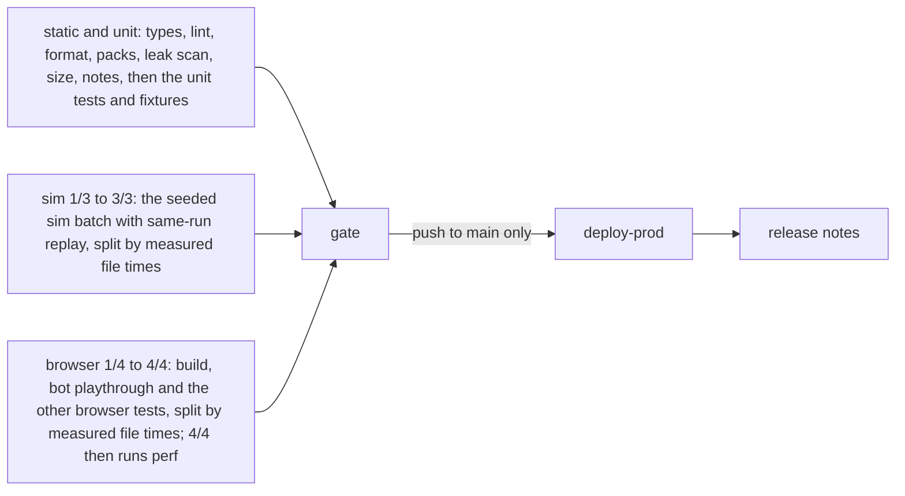

# Engineering: how throttlebrawl is built, checked and shipped

**In plain words.** This page describes the workshop, not the game. The code lives in a public GitHub repository. Several AI coding agents work on it at the same time, each on its own branch and in its own part of the code. When an agent finishes a piece of work, a robot runs the checks: the code compiles, the tests pass, a bot plays a full race in a real browser, the game stays fast on a phone-like profile, and there is a short note saying what changed. If everything is green, the work merges itself. Every green merge updates the playable game on a Hugging Face web page (the maintainer's answer), and a second "staging" page shows a work-in-progress branch when someone asks for one. Each update also copies the project's source files to that page, so the Hugging Face copy doubles as a browsable mirror of the GitHub repository. The maintainer plays on a phone, says what feels good or bad, and is only asked about taste, money over the cap, and anything public or irreversible.

Tags used on this page:

- `[decided]`: traces to a maintainer answer.
- `[default]`: a proposal. The maintainer may change it; an agent may change it only in a PR that updates the doc and says why in its `changes/` note. Until changed, agents follow it.
- `[open]`: waiting on the maintainer. Each one is listed in [Open questions](#open-questions).
- `(unverified)`: an external fact this page could not confirm.

External facts marked "verified 2026-09-29" were fetched from the vendor's own docs on that date and are quoted.

## Contents

- [Principles](#principles)
- [Repo layout](#repo-layout)
- [Toolchain](#toolchain)
- [npm scripts](#npm-scripts)
- [The gate: definition of done](#the-gate-definition-of-done)
- [Pre-commit hooks and leak scan](#pre-commit-hooks-and-leak-scan)
- [CI on GitHub Actions](#ci-on-github-actions)
- [Branch protection and auto-merge](#branch-protection-and-auto-merge)
- [Deploy: game Space and staging Space](#deploy-game-space-and-staging-space)
- [Big and generated assets](#big-and-generated-assets)
- [Phone testing](#phone-testing)
- [What-changed notes, in-game changelog and releases](#what-changed-notes-in-game-changelog-and-releases)
- [Parallel agent lanes](#parallel-agent-lanes)
- [Dev-time AI spend](#dev-time-ai-spend)
- [What always needs the maintainer](#what-always-needs-the-maintainer)
- [Open questions](#open-questions)
- [Verified external facts](#verified-external-facts)

## Principles

- **Velocity over ceremony.** `[decided]` The maintainer asked to "focus on velocity not just a million redundant checks". The gate below is the whole list; agents do not add parallel checks, review rituals or approval steps.
- **Decide only what is hard to change later.** `[decided]` Everything else gets a seam: an interface, a versioned file format or a config switch.
- **Main is always playable.** `[decided]` Every session ends with main green and the game Space showing a build you can play on the phone.
- **The maintainer is never a gate.** `[decided]` Work merges on green checks without a human review. See [What always needs the maintainer](#what-always-needs-the-maintainer) for the only exceptions.
- **Verify what the player sees.** `[default]` Checks assert rendered, observable results: the canvas is not blank, the race reaches the finish, the note text reaches the changelog. Internal flags alone do not count.
- **One toolchain.** `[decided]` npm, because the maintainer's other JavaScript repos use npm and pnpm needs "compelling reasons".
- **Python only offline.** `[default]` Python tools are allowed only under `tools/` and never in the game build.

## Repo layout

`[default]` The module folders under `src/` mirror the module map in [architecture.md](./architecture.md). **If they disagree, architecture.md wins**, and this section gets fixed in the same PR.

```text
/
├─ AGENTS.md              binding rules for every coding agent
├─ CLAUDE.md              one line: @AGENTS.md (Claude Code reads it; Codex and Copilot read AGENTS.md)
├─ README.md              what the game is, how to play, how to run it
├─ LICENSE                MIT; the holder line reads "the throttlebrawl contributors" (see below)
├─ THIRD_PARTY_ASSETS.md  every non-original asset: source, licence, where it is used
├─ docs/                  public design docs (this file, architecture, spec, milestones)
├─ changes/               what-changed notes, one small file per PR
├─ packs/                 content packs (pack zero is packs/base): rivals, bikes, weapons, barks, events, event modifiers, radio stations, regions, HUD presets
├─ src/                   the module map, copied from architecture.md (editor JSON Schema is generated on demand into git-ignored .cache/schemas/, see content-packs.md)
│  ├─ core/               shared types, deterministic math, seeded RNG, event types
│  ├─ road/               road network model and queries (DOM-free, like sim)
│  ├─ sim/                fixed-step simulation and its public contract (api.ts); DOM-free
│  ├─ content/            pack loading, validation, registry
│  ├─ tuning/             the parameter registry and presets (declarations live beside their systems)
│  ├─ input/              devices to actions, haptics
│  ├─ assets/             asset manifest loader (baked now, remote later)
│  ├─ stream/             chunk manager
│  ├─ render/             three.js scene, look layer, overlay
│  ├─ camera/             camera modes and rigs
│  ├─ audio/              synthesized engine, sfx, music, buses
│  ├─ ui/                 HUD, menus, touch layout, tuning panel (ui/tuning/), barks and interludes (ui/narrative/), changelog card
│  ├─ career/             progression, shop, fines, grudge memory (M4)
│  ├─ platform/           fullscreen, orientation, wake lock, service worker
│  ├─ save/               versioned local save and export code
│  ├─ replay/             input recorder and player
│  ├─ app/                boot, main loop, state machine, wiring
│  └─ dev/                test handle, bot player, perf probe, debug report
│  (plus src/main.ts, the composition root outside the module graph)
├─ public/                small static files (icons, web manifest)
├─ tests/
│  ├─ sim/                shared seeded-race batch and per-lane hooks
│  ├─ e2e/                Playwright bot race, device-path tests and screenshots
│  ├─ perf/               Playwright perf profile, budget.json and baseline.json
│  ├─ fixtures/           golden fixtures: save/ from M4, migrations/ from the first outside pack (neither exists at scaffold)
│  └─ replays/            bug-repro input recordings; not part of the gate
├─ tools/                 offline pipelines, never shipped: packs/, road/, gis/, blender/, audio/, ai/
├─ scripts/               Node helper scripts used by npm scripts and CI
├─ space/                 Hugging Face Space README templates (prod and staging)
└─ .github/workflows/     ci.yml, staging.yml, rerun-main.yml, dependabot-auto-merge.yml
```

- Unit tests sit next to the code as `*.test.ts`. `[default]`
- **The licence holder is not a person.** `[default]` `LICENSE` reads "Copyright (c) 2026 the throttlebrawl contributors". `package.json` has no `author` and no `contributors` field, and no tracked file names the maintainer personally. Changing the holder line is the maintainer's call. (Git history cannot be scrubbed later, and this is the first file every visitor opens.)
- `scratch/`, `*.local.md`, `local/`, `.cache/`, agent logs, `dist/`, `test-results/`, `playwright-report/` and `.env*` are git-ignored. `[decided]` for scratch ("scratch ignored") and for agent logs ("agent logs and scratch files are ignored by git"), `[default]` for the rest.
- `assets.lock.json` (repo root) pins the Hugging Face dataset repo at one commit; the dataset scripts are `scripts/assets.mjs` and `scripts/dataset-assets.mjs` (run W-Q, see [Big and generated assets](#big-and-generated-assets)).
- `tools/gis/` gets its own Python project file the day it is created. Blender scripts in `tools/blender/` run inside Blender's own interpreter, are linted with `ruff` only, and each exported GLB is validated. They are called through npm scripts that read a `BLENDER_EXE` environment variable. `[default]`, following the scaffold tweaks the maintainer approved.
- **`<lane-id>`** in branch names is the module folder name from architecture.md's ownership table (for example `lane/road/junctions`), or `infra` for shared files. `[default]`

## Toolchain

`[decided]` TypeScript, Three.js and Vite, installed with npm. The rest is `[default]`.

| Tool | Version line | Why |
|---|---|---|
| Node.js | 22 LTS. `.nvmrc` pins the Node CI runs (22.23.3); `engines` holds the floor the installed packages need (`>=22.13`) | ESLint 10 needs `^22.13.0` and Vitest 5 needs `^22.12.0` (npm registry, 2026-09-29), so a bare "22" could resolve to a Node that is too old. `.nvmrc` moved to the newest 22.x (22.23.3, released 2026-09-23) on 2026-09-30 so CI can install lint-staged 17, which needs `>=22.22.1`. `engines` stays at 22.13 until lint-staged 17 actually lands: `.npmrc` sets `engine-strict=true`, which also checks the root package, so raising the floor early makes `npm ci` refuse to run on any machine still on an older 22.x (checked on the dev machine, Node 22.20.0: "notsup Not compatible with your version of node/npm"). Whoever merges lint-staged 17 raises `engines` to `>=22.22.1` in the same PR, and every local machine needs Node 22.22.1 or newer first. `[default]` |
| TypeScript | `~6.0` | typescript-eslint 8.71.0 declares `typescript: '>=4.8.4 <6.1.0'` (npm registry, 2026-09-29), while the newest TypeScript is 7.0.2. Revisit when typescript-eslint widens its range. |
| Vite | 8.x | build and dev server |
| Three.js | r186 (`three` 0.186.x) with `@types/three` | renderer |
| ESLint | 10.x flat config with typescript-eslint typed rules | lint |
| Prettier | 3.x | format; no style debates |
| Vitest | 5.x | unit tests, sim tests, headless race batches |
| Playwright (`@playwright/test`) | 1.63.x, Chromium | bot playthrough, screenshots, perf profile |
| simple-git-hooks + lint-staged | current | git hooks without a second toolchain |
| secretlint | 13.x | secret patterns in the leak scan |
| knip | current | dead-code report; advisory, not in the gate |

Versions are from the npm registry on 2026-09-29. Exact versions are pinned in `package-lock.json`, and `.npmrc` sets `save-exact=true`.

**TypeScript settings.** `[default]` `strict`, `noUncheckedIndexedAccess`, `exactOptionalPropertyTypes`, `noImplicitReturns` and `verbatimModuleSyntax`. `src/sim/` **and** `src/road/` have their own `tsconfig` with `lib: ["ES2022"]` and no DOM types, and an ESLint `no-restricted-imports` rule bans `three`, `render/`, `audio/`, `ui/`, `input/` and browser globals from both (the ban list is architecture.md's [dependency rules](./architecture.md#dependency-rules)). "The sim does not depend on the renderer" becomes a compile error instead of a code-review comment.

**npm hardening.** `[default]` CI installs with `npm ci`. `.npmrc` sets `ignore-scripts=true`, so dependencies cannot run install scripts. Playwright browsers and git hooks are installed by explicit commands (`npx playwright install chromium`, `npm run hooks:install`). CI runs `npm audit signatures`. A dependency that truly needs its install script is allowlisted in `.npmrc` comments with the reason.

**Vite settings.** `[default]`
- `base: './'`, so the same build works at a Space root or under any sub-path.
- `server.host: '127.0.0.1'`, `preview.host: '127.0.0.1'` and `strictPort: true` on 5173 (dev) and 4173 (preview); `npm run phone` forwards exactly these ports. The host is set explicitly because Vite may bind only the IPv6 loopback on some systems, and `adb reverse` against an IPv6-only listener is untested (unverified). Never bind all interfaces (`host: true`).
- The browser tiers do not use 4173 locally. `playwright.config.ts` asks `scripts/preview-port.mjs` for a port: `PREVIEW_PORT` if set (and only then may it reuse a server already running there), 4173 on CI, and otherwise a free port from the OS, passed to `vite preview --port`. A fixed port with server reuse let parallel lane worktrees run their tests against another lane's build (camera-2, input and platform-2 reports, 2026-09-30). `npm run preview` and `npm run phone` still use 4173. `[default]`
- The build injects `BUILD_ID` (short commit), `BUILD_CHANNEL` (`prod`, `staging` or `dev`) and `BUILD_BRANCH`. The main menu footer and the debug report show them.

**Test handle.** `[default]` `window.__game` exists only when Playwright sets an init flag before the page loads. It exposes read-only sim state, the bot switch and a seed control, as in architecture.md's [testing seams](./architecture.md#testing-seams). The same init flag can also pin render settings (quality tier, dynamic resolution, device pixel ratio) for the perf run; those are not sim state. Production players never get it.

## npm scripts

`[default]` Names are stable, because CI, hooks and agents call them.

| Script | What it does |
|---|---|
| `dev` | Vite dev server |
| `build` | typecheck, then `build:dist` |
| `build:dist` | `vite build`, then `changelog:build` into `dist/`; `npm run check`'s build step, since its static tier already type-checks |
| `preview` | serve `dist/` locally |
| `typecheck` | `tsc` for the app and for the DOM-free sim config |
| `lint` / `lint:fix` | ESLint over `src/`, `tests/`, `scripts/`, `tools/` and config files |
| `format` / `format:check` | Prettier |
| `test` | Vitest: unit tests, sim tests, and, once they exist (save fixtures from M4; pack-migration fixtures from the first outside pack) `[default]`, the save-format and pack-migration fixture tests (`tests/fixtures/save/`, `tests/fixtures/migrations/`) |
| `test:sim` | headless batch of seeded bot races (default 50, as in architecture.md) asserting that races finish, nothing is NaN, and each recorded race replays **in the same run** to identical state hashes |
| `test:changed` | the unit and sim tests that import a file changed since `origin/main` (committed or not), through Vitest's `--changed`; the lane's fast local loop (see [Local loop](#local-loop-for-lanes)), not a gate step |
| `packs:check` / `packs:migrate` | validate every file under `packs/` (schema, references, licence rules, jump-curvature rule), or (`packs:migrate`) a helper for format-bump PRs that rewrites the repo's own packs to the current format, with no fixtures until outside packs exist; owned by [content-packs.md](./content-packs.md#validation) |
| `e2e` | Playwright: one bot race at the phone-landscape viewport, plus two short device-path tests (keyboard, and pointer events on the touch overlay), with screenshots |
| `e2e:one` | build, then the browser specs named after `--` (for example `npm run e2e:one -- tests/e2e/ui-pause.spec.ts`); the fast local loop, not a gate step |
| `perf` | Playwright perf run on the throttled phone-like profile, compared with `tests/perf/budget.json` and `tests/perf/baseline.json` |
| `leakscan` / `leakscan:all` | staged files, or the whole tree (see [leak scan](#pre-commit-hooks-and-leak-scan)) |
| `sizecheck` | fails on any committed file over 1 MB that is not allowlisted |
| `notes:check` | fails if the branch adds no file under `changes/` |
| `changelog:build` | turns `changes/` into `dist/changelog.json` |
| `assets:fetch` / `assets:verify` / `assets:add` / `assets:upload` | the dataset files `assets.lock.json` pins (run W-Q): download them into `.cache/assets/` and check each sha256 (an already-cached good file is not downloaded again); check the lock against the repo and every cached file; pin a new or changed file (`-- <file> --as <packId>/<path> [--region <id>]`); upload the pinned files the revision lacks with the signed-in `hf` CLI and pin the commit it made |
| `check` | runs the whole gate in CI order and prints what each step examined |
| `phone` | helper for `adb reverse` (see [Phone testing](#phone-testing)) |
| `hooks:install` | installs the git hooks |
| `knip` | dead-code report, advisory |

## The gate: definition of done

`[decided]` The maintainer's done bar is "tests/lint/types + bot playthrough + perf + plain changelog". They added "focus on velocity not a million redundant checks", so agents add no further checks. The leak scan is also `[decided]` (a quick scan on every commit, "audit before public"). The remaining rows are cheap `[default]` additions that the gate needs to work. The table is the complete list.

| Step | Script | Passes when | Source |
|---|---|---|---|
| Types | `typecheck` | zero errors, app and sim/road configs | `[decided]` |
| Lint and format | `lint`, `format:check` | zero errors | lint `[decided]`, format `[default]` |
| Packs | `packs:check` | zero errors (warnings print) | `[default]`, required by [content-packs.md](./content-packs.md#validation) |
| Leak scan | `leakscan:all` | zero findings, and a nonzero count of files examined | `[decided]` |
| Size | `sizecheck` | no unexpected file over 1 MB | `[default]` |
| Unit and sim | `test`, `test:sim` | all green; seeded bot races replay to identical state hashes in the same run; save and pack-migration fixtures migrate, once they exist (save fixtures from M4; pack-migration fixtures from the first outside pack) | `[decided]` for the tests and replays; `[default]` for the fixtures |
| Build | `build:dist` (`build` without its typecheck, which the Types row runs) | `dist/` builds; the bundle stays within budget | `[default]` |
| Bot playthrough | `e2e` | see below | `[decided]` |
| Perf | `perf` | see below | `[decided]` |
| Notes | `notes:check` | on a pull request, at least one new `changes/` file; skipped on push to main | plain changelog `[decided]`, the per-PR file `[default]` |

`[default]` The details:

- **One command.** `npm run check` runs every step locally in the same order as CI. CI calls the same npm scripts, never its own copies. Each step prints what it examined (files linted, tests run, races simulated, screenshots taken, frames sampled), because a check that looked at nothing reads exactly like a pass.
- **Prove the gate can fail.** When the scaffold lands, break one spec on purpose, watch CI go red, then revert it. That happens once, not every PR.
- **Bot playthrough.** As in architecture.md's [testing seams](./architecture.md#testing-seams), the bot is a `BotController` that reads the sim snapshot and writes into the input layer's action state. It computes its action once per sim tick from that tick's snapshot, so a seeded run is deterministic and independent of frame rate. Playwright loads the production build from `vite preview`, starts the shortest race (race length is a setting), and lets the bot ride, once, at the phone-landscape viewport. The run passes when the assertions below hold.
  - **Assertions switch on with the feature that makes them possible.** From the scaffold: the page boots, a WebGL2 context was created, no console errors, and the screenshot canvas is not blank. From the PR that lands the race loop: the race reaches the finish before a timeout and a placing is recorded. From the PR that lands combat: at least one attack connects, on a seeded race where the bot is known to connect. Turning an assertion on, or adding a test for new behaviour, is normal agent work.
  - "Not blank" means pixel variance above a threshold, so a black or empty canvas fails. Screenshots at the start, mid-race and finish are uploaded as CI artifacts for eyeballing and kept 7 days.
  - **Two short device-path tests prove the real devices,** since the bot writes action state directly: one presses keys, one dispatches pointer events on the touch-control overlay elements, and each asserts the resulting `SimInput`.
- **CI rendering.** CI renders WebGL in software, and Chromium has announced that WebGL context creation will fail instead of falling back to SwiftShader (blink-dev "Intent to Remove: SwiftShader Fallback", seen only through a summarizer, so treat it as unverified; whether Playwright's bundled headless Chromium is affected is also unverified). Playwright therefore launches Chromium with `--use-angle=swiftshader --enable-unsafe-swiftshader`, which is harmless if not needed. The first assertion of every browser test is that a WebGL2 context exists, and the renderer string is printed. CI e2e and perf pin device pixel ratio 1 and quality tier `low`. The gate job targets under 10 minutes wall-clock `[default]`; if it grows past that, cut work before adding runners.
- **Perf check.** Wall-clock timing on shared CI runners is noisy. So perf has two tiers, and both force tier `low` with `auto` and dynamic resolution disabled (fixed scale 1.0) through the test flag, because architecture.md's `auto` tier and dynamic resolution would otherwise make draw calls depend on runner speed:
  - **Hard gate, deterministic.** Draw calls and triangles from `renderer.info` at fixed camera checkpoints of a seeded race, and initial download size (M1 starting budget: JavaScript at most 500 KB gzip, whole first load at most 3 MB). The 3 MB is the M1 CI limit; architecture.md's 15 MB first-play figure is the ceiling for the A16 as content grows, and the stricter number binds CI. `[default]` Run W-O raised the CI limit to 5 MB for the spoken barks: 247 baked Opus clips, about 1.9 MB, each fetched only the first time its line is said, so the count of every dist file grew while the real first load did not. `[default]` The same run raised it to 6 MB for the real-road routes (the maintainer, 2026-10-01: "Yes, add as routes"): their road data, about 0.9 MB of JSON in the Pacific Northwest and San Francisco packs, ships beside the build and is fetched only when a race in that region starts. `[default]` Run W-P measured what fills it and did not raise it: the build writes its JSON assets (the road data fetched on demand) on one line (`scripts/json-assets.mjs`), about a fifth smaller, which took the whole build from 5.31 MB to 5.04 MB (2026-10-01: Opus voice clips 1.88 MB, JavaScript 1.49 MB, road JSON 1.15 MB, models 0.52 MB). `[default]` Run W-Q raised it to 15 MB, the architecture's first-play ceiling, for real rider and bike models (interview, 2026-10-02: "Real models now"): they come from the dataset repo and load per region, only when a race there starts, so `regionModelsKB` (3 MB) caps each region's own models and the size step prints the shared models and one race's worst; the build measured 5494 KB before any of them (models 509.5 KB, all shared). The limits live in `tests/perf/budget.json`, and changing them is a normal PR with the reason in its note.
    - The JavaScript limit counts the first load: the page's entry script, its modulepreloads and everything they import statically (`scripts/first-load.mjs`). Code the first screen does not need loads as a lazy `import()` chunk; `npm run perf` lists each lazy chunk's gzip size, and every dist file, lazy chunks included, still counts toward the 3 MB. `scripts/first-load.test.ts` builds the game and fails if a module meant to be lazy (the film pass, the model reader, the tuning panel, the self-test) is pulled back into the first load. `[default]`
    - **Headroom and each PR's own change.** `npm run perf` prints the first-load JavaScript's headroom under its budget. On CI (or locally with `--base origin/main`) it also builds the merge base with `origin/main` in a throwaway worktree under `.cache/` (about 4 s) and prints the pull request's own change against main, so a lane sees the squeeze in its own PR instead of as main's red when the last of several innocent merges crosses the line. A growth of 5 KB or more prints a warning; only the budget fails. The line also goes to the job's step summary. `--size-only` skips the browser probes. `[default]` (brittle-test inventory R10, 2026-10-02: the budget was crossed three times that day, each time by the last of several merges.)
  - **Soft tier, throttled: a trend plus a 3x guard.** `[decided]` (the maintainer, 2026-10-02: "Trend plus 3x guard".) Chromium with 4x CPU throttling (the DevTools protocol's `Emulation.setCPUThrottlingRate`) and a phone-like landscape viewport (about 900×400 CSS pixels, touch, mobile). It records p50 and p95 frame time and sim step time p95 (from `dev/perf`) over 20 seconds of bot racing, for the classic look and each ink look. These numbers are a **trend, not a gate**: every run prints them with their ratio to the stored baseline in `tests/perf/baseline.json` (a `perf trend` line in the log, the probe's JSON in `test-results/`, and a table in the job's step summary). The gate fails only above **3x the baseline**, a catastrophe guard that runner noise cannot reach. Frame times come in whole display frames, so a frame guard gets half a frame of slack: exactly three times the baseline's frames passes, one frame more fails. The limit logic lives in `scripts/perf-limits.mjs`, and `scripts/perf-limits.test.ts` shows the guard fires. Why: CI renders in software at about 7 to 19 fps, and on 2026-10-02 the classic frame p95 drifted from about 83 to 150 ms in a day; the same game code printed 100.1 ms and then 150 ms, so the old 2x limit held main red on noise. Draw calls, triangles and the download size stay hard limits. The baseline is measured on CI runners and updated by a PR whose note gives the reason; the current one is from 2026-10-02 (8 CI runs on that day's main code).
  - **Truth.** The benchmark phone (Galaxy A16 5G) is the real test `[decided]`. The in-game debug overlay (`?debug=1`) shows fps, frame time and the renderer string. Any performance claim names the device, the renderer and the scene.
- **Recordings.** `tests/replays/` holds bug-repro input recordings, not gate fixtures. architecture.md says a replay plays only on a build with the same replay key (the hash of the sim code plus the sim content hash), so a committed recording would go stale on every content or tuning PR. A recording whose replay key no longer matches is skipped with a printed notice.
- **Main red after a merge.** Checks are not required to run against the very latest main (see [Branch protection](#branch-protection-and-auto-merge)), so two green PRs can rarely combine into a red main. CI runs again on every push to main. If main goes red, prod deploy does not run, so the public game stays on the last green build, and the next agent session's first job is a fix-forward or revert PR. A red first attempt is re-run once by itself while its commit is still main's head ([CI](#ci-on-github-actions), `rerun-main.yml`), so a flaky test alone does not hold main red. A revert is a new commit, never a history rewrite.

### Local loop for lanes

`[default]` (maintainer, 2026-10-01: "I like thorough testing, but it seems like we're doing a lot of waiting on this pc instead of making more rapid, visible progress"). Measured on 2026-10-01 across 141 past lane runs (about 157 lane-hours), lanes spent 61% of their time waiting on tests: 32% on local suites, 22% watching CI and 7% in the pre-push hook, because the same suites ran locally, in the hook, then in CI. The gate above is unchanged, and CI runs all of it on every PR. Locally, a lane runs what its change touches, then pushes:

- `npm run test:changed`: the unit and sim tests that import a file changed since `origin/main`, committed or not. Vitest follows the import graph, so a change under `src/sim/` pulls in most of the sim batch, and a change to docs alone runs nothing.
- `npx vitest run <file>...` for the test being written.
- `npm run e2e:one -- tests/e2e/<spec>.spec.ts` for the browser specs of a render, input, UI or perf-relevant change; a whole browser tier when the change is broad.
- On a dev machine shared by parallel lanes, cap Vitest's workers (`VITEST_MAX_WORKERS=2`) so the lanes do not starve each other.
- The pre-push hook still runs and is never skipped: the typecheck, plus the unit tests related to what changed since `origin/main`. Vitest's `--changed` alone selects nothing for a config-only change, so the hook runs the whole unit tier when `package.json`, the lock file, the Vitest config or a tsconfig differs from `origin/main`. CI runs every test on the PR anyway.
- `npm run check` with no `--tier` is for the rare change that needs the whole gate before CI, such as a skeptic's review.

## Pre-commit hooks and leak scan

`[decided]` A quick leak scan runs on every commit; machine-specific certificate settings stay in user-level config; `scratch/` is ignored; private context stays out of the repo.

`[default]` The hook tool is **simple-git-hooks + lint-staged**, not the Python pre-commit framework. It keeps one toolchain (npm), works the same for Claude Code, Codex and Copilot, and runs on every OS without extra installs. Install with `npm run hooks:install` after `npm ci`.

| Hook | Runs | Budget |
|---|---|---|
| `pre-commit` | lint-staged (ESLint fix and Prettier on staged files), `leakscan` on staged files, `sizecheck` on staged files, `packs:check` when pack files are staged | a few seconds |
| `commit-msg` | leak scan of the commit message | instant |
| `pre-push` | `typecheck`, and the unit tests related to changes since `origin/main` (`vitest --changed`); the whole unit tier when `package.json`, the lock file, the Vitest config or a tsconfig changed | under a minute |

The browser tiers (e2e, perf) run in CI and in `npm run check`, not in hooks. Hooks are never skipped (`--no-verify` is banned in [AGENTS.md](../AGENTS.md)); if a hook is wrong, fix the hook.

**The leak scan** (`scripts/leak-scan.mjs`) is deliberately light:

- **Generic rules, committed in the repo:**
  - secretlint's recommended rules (API tokens, private keys, cloud credentials);
  - absolute user-home paths such as `C:\Users\<name>\`, `/Users/<name>/` and `/home/<name>/`;
  - email addresses, except a short committed allowlist that starts with `*@users.noreply.github.com`, `noreply@github.com` and `noreply@anthropic.com` (the address in Claude Code's commit trailer; without it the `commit-msg` hook would block every such commit and push agents toward the banned `--no-verify`);
  - private-network addresses and hostnames that look like machine names;
  - `.env` files and key files by name.
  - **Placeholders never match:** text in angle brackets such as `<name>` or `<owner>` is not a path or address. A unit test uses this doc's own examples as must-not-match cases and a real-looking path as a must-match case, so `leakscan:all` does not fail on the docs themselves.
- **Maintainer-specific denylist, never in the repo.** Employer names, personal details and anything else specific to the maintainer live in the maintainer's user-level git config, for example `git config --global --add throttlebrawl.leakscan.deny '<regex>'`. The script reads them with `git config --get-all throttlebrawl.leakscan.deny`. The repo never lists what is being hidden, which would itself be a leak. CI has no such config, so CI enforces only the generic rules; the local hook is the only place the private denylist applies.
- **Certificates and proxies.** Machine-specific network or certificate settings (for example `NODE_EXTRA_CA_CERTS` or proxy variables) live in user-level environment or config, never in the repo's `.npmrc`, scripts or workflows.
- **It reports what it examined.** The scan prints the number of files and bytes it checked, and fails if it checked zero files while files were staged. A scanner that looked at nothing and "passed" is the failure this rule exists for.
- **Before the first push** `[decided]` ("audit before public"). The first push is the docs-only commit, and it is made before `leakscan:all` exists (infra-1 builds it). `[default]` So the lead agent first sets the no-reply identity in user-level git config, then runs a one-off scan over the staged files and the commit with the same generic rules (secret patterns, user-home paths, non-no-reply emails, private addresses) plus the maintainer's private denylist. It checks `git log --format='%ae %ce'`, prints the number of files and bytes examined, and pushes only if it found nothing. infra-1's `leakscan:all` then re-audits the whole tree and `git log -p` from the docs commit onward, in infra-1's first PR, and checks that every commit carries the no-reply identity (see [Commit identity](#commit-identity)).

### Commit identity

`[decided]` (cockpit answer, 2026-09-29): public commits, the maintainer's and the agents', use the maintainer's GitHub no-reply address, which has the form `<id>+<login>@users.noreply.github.com`. The real number and login are set in user-level git config on the dev machine and are never written into the repo or the docs. The maintainer also chose GitHub's "block pushes that expose my email" switch and will turn it on later.

`[default]` Until that switch is on, the leak scan is the guard, and it has to be able to fire on the author field, not only on file contents:

- The `commit-msg` hook also checks the author and committer email of the commit being made (`git var GIT_AUTHOR_IDENT`, `git var GIT_COMMITTER_IDENT`) against the same email allowlist, so a real address fails locally before it is ever pushed.
- CI's `static` job checks the author and committer email of every commit in the PR's own range (`git log --format='%ae %ce' origin/main..${{ github.event.pull_request.head.sha }}`, not `HEAD`, which on a `pull_request` run is GitHub's synthetic merge commit) against the allowlist.
- Squash merges are made by GitHub, which picks their author email from the account's own email settings *(unverified)*. Because the repo is squash-only, every commit on `main` is one of these, and neither the local hook nor the PR-range check ever sees it. So `[default]` the maintainer's "Keep my email addresses private" setting must be on **before the first auto-merge** (only the block-pushes switch itself can wait). It sits on the same GitHub email settings page as the block switch *(unverified)*. infra-1 asks for it in its one "what's missing" message and does not arm auto-merge until the maintainer confirms.
- On `push` to `main`, `ci.yml`'s `static` job also checks `git log -1 --format='%ae %ce'` against the allowlist and fails loudly, so a squash commit carrying a real address is caught at the first merge and the maintainer can fix the setting. (After the fact, since history cannot be rewritten; the setting above is the real prevention.)

## CI on GitHub Actions

`[decided]` The repo is public from day one, and changes reach main by auto-merge on green checks. Actions minutes are free for this case: "GitHub Actions usage is **free** for **self-hosted runners** and for **public repositories** that use standard GitHub-hosted runners" (GitHub docs, verified 2026-09-29).

`[default]` The workflows: `ci.yml` and `staging.yml` below, `rerun-main.yml` (a red main re-run once, below), and `dependabot-auto-merge.yml` ([Dependabot](#dependabot)).

**`ci.yml`**, triggered on `pull_request` to main and on `push` to main:



- `static and unit` (one job, `npm run check -- --tier static,unit`), `sim` and `browser` run in parallel. `gate` has `needs:` on all of them, runs with `if: always()`, and fails unless every one succeeded. **`gate` is the only required status check.** A single aggregate check means adding or renaming a job never strands PRs, and GitHub's own tip applies: "make sure that job names are unique across all workflows" (verified 2026-09-29). static and unit share a job because together they take about 3 minutes, inside the browser slices' time, and one job sets up one runner instead of two. `[default]`
- **Slices.** `sim` (3 slices) and `browser` (4 slices) are matrices. Each slice runs `npm run check -- --tier <tier> --shard <i>/<n>`: the test runner lists the tier's files (`vitest list`, `playwright test --list`), and `scripts/shard-plan.mjs` splits them by their measured CI seconds in `tests/timings.json`. Every file lands in exactly one slice, so nothing is skipped and the slices' test counts add up to the unsharded run's; each slice also fails if its runner ran a different number of files (Vitest) or tests (Playwright) than the plan gave it. `npm run check -- --tier browser --shard 1/4 --plan` prints every slice's files without running anything. `fail-fast` is off, so a red slice never cancels another's result. Locally, `npm run check` with no `--tier` still runs each tier whole. `[default]`
  - **Why measured times.** The runners' own `--shard` splits by file count, not time. On 2026-10-01 the two sim slices took about 290 s and 120 s, and browser slice 2 (its e2e, then perf) was the gate's critical path in 27 of the last 30 PR runs, at a median gate of 7.7 minutes. The plan simulates each runner (Vitest's 3 workers on CI's 4 vCPUs, starting the longest file first through `tests/sequencer.ts`; Playwright's 2 workers, by file path), and gives a file with no measured time the median time, so a new test file lands somewhere sensible. Stale times can only make the slices uneven, never drop a file. The times are what each file took on CI in this layout, so they include the slowdown of sharing a runner: three CPU-bound sim files at once ran about twice as slow as one alone. Refresh the table with `node scripts/timings.mjs <run-id>...` (green main runs; a red job's other files count too) when slices drift apart by more than about a minute.
  - **The shared seeded batch** (`simBatch()`, `presetBatch()`, see `tests/sim/batch.ts`) is computed once per runner and every file that reads it waits for it, so those files share one sim slice. In it, `dev-presets.test.ts` computes the Easy and Hard batches while another file computes the Normal one.
  - **Browser slices** each build and test their own build (`build:dist`: the static tier already ran the typecheck that `build` would repeat in every slice); screenshots upload per slice (`screenshots-1` to `screenshots-4`). The e2e step was the critical path at about 390 s of an 8-minute job before it was first split.
- The last browser slice then runs perf on the same build, after its own e2e files (`--tier browser,perf`: one build, then e2e, then the size budget and the throttled probes one at a time), as the one-job layout did; the slice plan gives that slice fewer e2e seconds to make room. On a push to main, that build is the `dist` artifact `deploy-prod` ships. perf does not get a runner of its own: tried in #166, the ink look's frame p95 on a fresh runner printed 116.6 to 149.9 ms in 8 of 9 runs, against 50 to 100.1 ms after e2e in 22 of 23, and it failed main (reverted in #176). The build step belongs to both the `browser` and `perf` tiers; a run of both, or a plain `npm run check`, builds once. `[default]`
- **No `paths:` filter on `ci.yml`.** A required check behind a path filter never reports on a docs-only PR, which leaves that PR unmergeable forever. Docs-only PRs just run the fast path.
- Checkout uses `fetch-depth: 0` in both workflows, so `notes:check` and `changelog:build` can read history.
- `notes:check` runs only on `pull_request` events, diffing `origin/main...HEAD`. On `push` to main it is skipped, because there is no branch to diff and the squash commit already carries the note. A Dependabot-only PR is exempt ([Dependabot](#dependabot)).
- **Every green main run deploys the build its own gate tested.** `[default]` Main push runs share the workflow's concurrency group (`ci-push-refs/heads/main`, never cancelled in progress), so they run one at a time, in push order. GitHub keeps only the newest waiting run: a merge that lands while another is waiting goes live bundled into the next build, and its own run shows as cancelled before it starts. `deploy-prod` and the release job also run under `concurrency: { group: prod-deploy, cancel-in-progress: false }`, so nothing cancels an upload part-way. Before uploading, `scripts/prod-deploy-check.mjs` reads the prod Space's newest `deploy <sha>` commit through the Hub API and skips only if prod already serves a newer main commit, which is what a re-run of an old run would otherwise overwrite. When what prod serves is unknown (the API fails, or the id does not resolve), it deploys.
  - **Why not "deploy only main's head"?** That was the first rule, and it starved prod: while merges landed faster than one main CI run (a median 10.5 minutes over the last 19 green ones), every run found main had moved and skipped its upload. On 2026-09-30 and 10-01, 39 of 59 green main runs skipped, and prod stayed on one build for up to 145 minutes across 6 green runs. Deploying main's head from an older run is not an option either: that build never passed the gate.
  - **The trade-off.** While merges keep landing, prod is up to one CI run behind main, rather than stuck; it catches up within one run of the last merge. There are more uploads: one per green run (59 instead of 20 over those 12.4 hours, about 5 an hour), each about 10 s and 3 or 4 commits on the Space, and one release per deploy that has player notes. A red last run leaves prod on the previous green build, which is now minutes old rather than hours.
- **A red main is re-run once** (`rerun-main.yml`). `[default]` When a push run of ci on main fails on its first attempt and its commit is still main's head, a small `workflow_run` job re-runs that run's failed jobs once (`gh run rerun --failed`). GitHub re-runs their dependents with them, so a green second attempt runs `gate`, `deploy-prod` and `release` as a first attempt would.
  - It never re-runs a second attempt or a PR's run. It skips a commit main has moved past: the newer commit's own run decides main's colour, and a re-run of an older commit would queue in ci's concurrency group, where it could replace the newer commit's waiting run.
  - Its token has only `actions: write` and `contents: read`, and it checks out no code.
  - Each decision goes into the run's summary and a notice, so `gh run list --workflow rerun-main.yml` is the flake ledger. A rescue still means a flaky test to fix.
  - Measured: on 2026-10-02, 13 first attempts on main went red, and the rule would have fired on 5 of them (the other 8 had a newer main commit by the time they finished). One red run that day was re-run by hand (run 37052696293): its failed `browser (1/4)` and its timed-out `sim (3/3)` ran again, and attempt 2 deployed using the `dist` artifact that attempt 1's `browser (4/4)` had kept, so a failed-jobs re-run of main does reach prod. On 10-03, main stayed red for 42 minutes on b86069b, a one-step frame-time jitter on a tree whose PR run had passed.
  - *(unverified until the first red main after it merges)* That the workflow's own `GITHUB_TOKEN` with `actions: write` may re-run a run. If it may not, the job fails visibly and nothing else changes.
- Caches: npm cache, Playwright browsers (keyed by the browser builds Playwright pins, not the whole lock file), and Chromium's system packages. `playwright install --with-deps` installs about 14 Ubuntu packages (fonts, mesa) from the Ubuntu mirror, which sometimes crawls: 32 MB took 7.5 minutes at 72 kB/s on 2026-10-01, and 299 s in another run, against 13 to 45 s normally. The browser jobs keep those `.deb` files between runs and put them in apt's own archive folder first, so apt installs the same packages and downloads only what changed; slice 1 saves the set again only when it differs. `[default]`
- `permissions:` are set per job to the minimum. Only the deploy and release jobs get `id-token: write` or `contents: write`.
- Actions from `actions/*` are pinned to major versions; any third-party action is pinned to a full commit SHA.
- Fork PRs get no secrets and no OIDC token, which is GitHub's default for `pull_request` from forks. Deploy jobs never run for them.

**`staging.yml`**, triggered **on request only** (`workflow_dispatch` with an optional branch input): `gh workflow run staging.yml -f branch=<branch>`, or the Actions tab's "Run workflow" button. `[decided]` (the maintainer, 2026-10-03: "Yes, do it now" to the plan that makes per-PR staging on demand.)

- It runs `leakscan:all` and `sizecheck` (seconds; both are existing gate steps, so this adds no new check), then `build` plus the boot spec alone (`tests/e2e/boot.spec.ts`: the page loads, a WebGL2 context exists, no console errors or failed requests, the canvas is not blank, and the build stamp names the commit), then deploys to the staging Space as the same source mirror plus `dist/` that prod gets ([Deploy](#deploy-game-space-and-staging-space)). The full browser tier runs in the gate. `[default]`
- Two concurrency groups `[default]`:
  - the workflow's group is per branch (`staging-branch-<branch>`, cancel in progress), so a newer request for the same branch replaces its older run;
  - the job's group is the Space (`staging-upload`, never cancelled in progress), so two branches never upload at once. GitHub keeps one waiting job per group, so if a third branch asks while one deploys and one waits, the newest request replaces the waiting one, and the Space ends on the newest request.
- **Why on request, not on every push** (measured on 2026-10-02, UTC): 223 push runs deployed nothing (222 cancelled, 1 failed; the last deploy was 2026-10-01 20:21Z) and used about 719 runner-minutes, about 5% of the day's CI demand, mostly in the busiest hours. The old single `staging-space` group cancelled in progress across every branch, so another branch's newer push cancelled the older run in 209 of 211 checked cancels, with runs a median 2.0 minutes apart. Its smoke test ran the whole e2e tier on one runner (2,564 s of measured test time), which could not finish inside the job's 15 minutes even uncancelled. Prod already deploys every green main run, so merged work reaches the game page without staging.
- **Branches made before this change** still carry the old push-triggered `staging.yml`, and GitHub runs a push workflow from the pushed commit, so their pushes still start the old workflow until they merge main. Its group (`staging-space`) is neither of the new ones, so it cannot cancel a requested run, and it still runs the whole e2e tier, so it almost never reaches its upload (0 of 223 did on 2026-10-02). It fades as those branches merge.
- The maintainer, or an agent on request, picks the branch to play. Staging does not wait for the full gate. It is for playing work in progress, and the build stamp shows which branch and commit it is.
- Dependabot cannot start a `workflow_dispatch` run, so its runs (which get no repository secrets) never reach staging. A person can still stage a Dependabot branch on request; that run is the person's and has the secrets, which is one way to try a deploy-CLI bump before merging it. See [Dependabot](#dependabot).

### Dependabot

The maintainer asked for "dependabot for everything it supports" (2026-09-30), under the standing rule "I don't want new bills, accounts, or services". Dependabot is built into GitHub, so it adds none of those. Dependabot alerts and security updates are switched on in the repo settings. `[default]` The mechanics:

- **`.github/dependabot.yml`** has one entry per ecosystem in the repo: `npm` (root), `github-actions` (`/`, which covers `.github/workflows`), `uv` for `tools/gis` (GitHub lists `uv` as a supported `package-ecosystem`, so the `pip` fallback is not needed there), and `pip` for `.github/deploy`. That last one is the `hf` CLI the deploy steps install: `huggingface_hub` is pinned in `.github/deploy/requirements.txt`, and `ci.yml` and `staging.yml` install from that file into a throwaway venv, instead of an inline `pipx install` pin that Dependabot could not see. Each is checked weekly on Monday. Minor and patch bumps come as one grouped PR per ecosystem, and each major bump gets its own PR. One exception: `dependabot/fetch-metadata` is excluded from the grouped actions PR (`exclude-patterns`), so it always comes alone (see Auto-merge). Open version-update PRs are capped at 5 for npm, 3 each for actions and uv, and 2 for pip; security-update PRs have no cap. Commit prefixes are `deps`, `deps(actions)`, `deps(gis)` and `deps(deploy)`. `labels: []` is set because by default "Dependabot creates these default labels automatically, as necessary in your repository", and creating labels is a settings change. Two npm majors are ignored: `@types/node` (the types follow the Node 22 pinned in `.nvmrc` and `engines`) and `typescript` (held on `~6.0`, see [Toolchain](#toolchain); remove that ignore when typescript-eslint allows 7). On the first run, the TypeScript 7 attempt failed the update job ("Error while updating peer dependency"), and Dependabot opened a PR for `@types/node` 26.
- **Auto-merge** (`.github/workflows/dependabot-auto-merge.yml`): on a PR that GitHub says Dependabot opened, `dependabot/fetch-metadata` (pinned by commit SHA) reads the update. For npm or actions bumps that are minor or patch, where the package did not change maintainers, the workflow arms `gh pr merge --auto --squash`. It never arms a PR whose dependency names include `dependabot/fetch-metadata`: that action runs in this job with a write token, so the workflow must not be able to merge a new version of itself. The required `gate` check still decides, as for every PR. The workflow's token gets `contents: write` and `pull-requests: write` on that one job; everything else gets nothing. It uses `pull_request`, not `pull_request_target`: nothing checks out PR code, and GitHub's docs say "You can use the `permissions` key in your workflow to increase the access for the token" on Dependabot runs.
- **Left for review:** majors, the `uv` PRs (the gate does not run the GIS tool's Python tests, so green would say nothing about them), the `pip` PRs for the deploy CLI (the gate never runs an upload, and staging runs only when a person asks for it), `fetch-metadata` bumps, and bumps where the package changed maintainers. For a deploy CLI bump, read the `huggingface_hub` release notes for changes to `hf upload` and `--delete` (including its rule that keeps `.gitattributes`, see [Deploy](#deploy-game-space-and-staging-space)); the first push to main after merging exercises it. Whoever picks one up runs the relevant checks (for `tools/gis`, `uv run --directory tools/gis pytest` plus `ruff` and `mypy`, per its README), then merges or closes it.
- **The gate makes room for Dependabot without loosening for anyone else:**
  - `notes:check` exempts a PR only when the event says `dependabot[bot]` opened it (`NOTES_PR_AUTHOR` in `ci.yml`) **and** every commit on it has Dependabot's author address. If a person or agent pushes to a Dependabot branch, the note is required again. `npm run check` lists the notes step for an exempt PR as NOT ACTIVE, with the reason, because an active step that examined nothing fails the gate. The first real Dependabot PR hit exactly that failure.
  - The identity check already accepts Dependabot. Its commits are authored by `49699333+dependabot[bot]@users.noreply.github.com` and committed by `noreply@github.com` (read from a real Dependabot PR on 2026-09-30); both are on the allowlist, and a unit test pins that.
  - `.npmrc` keeps `ignore-scripts=true`.
- **Expected side effect *(unverified until the first Dependabot merge)*:** auto-merge armed with the workflow's own `GITHUB_TOKEN` merges as that token, and GitHub's docs say "events triggered by the `GITHUB_TOKEN` will not create a new workflow run". So a Dependabot merge probably does not start `ci.yml` on main, which means no prod deploy and no release for it. The bump reaches the game with the next merge from anyone else. Fixing that would need a personal token or an app, which is a new credential, so it is left as is.

## Branch protection and auto-merge

`[decided]` Merge on green, with no human gate. Protection on a free plan requires a public repo: "Protected branches are available in public repositories with GitHub Free and GitHub Free for organizations" (GitHub docs, verified 2026-09-29).

`[decided]` (cockpit answer, 2026-09-29): the repo and both Spaces are created now. The repo's first commit is these docs, after a leak scan, and the Spaces stay empty until the first deploy. `[default]` That first docs commit is the one push that goes straight to `main`, because the branch has to exist before its rules can do anything. Every later change arrives through a PR. [AGENTS.md](../AGENTS.md#branches-and-merging) records this one exception.

`[default]` The first commit is an explicit allowlist, not "everything in the project folder": `docs/`, `AGENTS.md`, `CLAUDE.md` (the one-line import) and a minimal `.gitignore` that already lists `scratch/`, `*.local.md`, `local/`, `.cache/`, `node_modules/`, `dist/` and `.env*`. It is staged with `git add <each path>`, never `git add -A` or `git add .`. Before pushing, `git ls-files` must print exactly those paths. Nothing else in the project folder (planning notes, research, copies of source manuals) is ever committed, because a public repo cannot be scrubbed without a history rewrite, which is banned.

`[default]` Settings on `main`, applied once when the repo is created:

- Require a pull request before merging, with **0** required approvals. There is one human, and agents act with the maintainer's credentials, so an approval rule would either block everything or approve nothing.
- Require the status check `gate`.
- **Do not** require branches to be up to date before merging. Merge queues would handle that safely, but "Pull request merge queues are available in any public repository owned by an organization" (verified 2026-09-29), which a personal-account repo is not. Strict mode without a queue forces every parallel lane to rebase and re-run after each merge, which serializes the whole fleet. Post-merge CI on main covers the rare semantic conflict. The repo owner is the maintainer's personal account `[decided]`. If conflicts between lanes turn out to be common, moving the repo to a free organization (which unlocks merge queues) is a later call for the maintainer, and GitHub can transfer a repo; see [Open questions](#open-questions).
- Keep the defaults that block force pushes and branch deletion on main: "By default, each branch protection rule disables force pushes to the matching branches and prevents the matching branches from being deleted" (verified 2026-09-29).
- Turn on **"Do not allow bypassing the above settings"**. Agents push with the maintainer's own credentials, and "By default, the restrictions of a branch protection rule don't apply to people with admin permissions" (verified 2026-09-29). Without this setting, an agent could push straight to main.
- Repo settings: **Allow auto-merge** on; squash merging only; **Automatically delete head branches off**, because agents never delete (branches can be tidied later by the maintainer).

**How an agent merges.** Open the PR and arm auto-merge in the same step: `gh pr merge --auto --squash`. Do not wait for checks and then merge, since that races GitHub's mergeability computation. Confirm the merge by asking GitHub for the PR's state (`gh pr view --json state,mergedAt`), never by trusting a command's exit code.

## Deploy: game Space and staging Space

`[decided]` The game is hosted on a Hugging Face Space covered by the maintainer's existing plan ("don't want new bills"). A second staging Space gets the agents' latest branch; since 2026-10-03, the branch someone asks for (the maintainer: "Yes, do it now" to the plan that makes per-PR staging on demand, see [`staging.yml`](#ci-on-github-actions)). The phone always opens the direct `*.hf.space` URL, not the huggingface.co page, which wraps the game in an iframe.

`[decided]` (cockpit answer, 2026-09-29): the plan was ratified with one note, "Mirror repo to hf", given on both the ratify card and the repo-creation card. The maintainer left the design to the coordinator ("whatever seems best according to best practices…"), so the mechanics below that carry it out are `[default]`.

Names `[default]`: the GitHub repo is `<github-owner>/throttlebrawl` (public, MIT), and the two Spaces sit under the maintainer's Hugging Face account as `<hf-user>/throttlebrawl` (the game) and `<hf-user>/throttlebrawl-staging`. The placeholders stand for the maintainer's own account names, which the repo URL and the Space URLs show anyway; this doc does not repeat them. (The GitHub login contains an employer abbreviation that the maintainer's private denylist may list, so a tracked file that spelled it out could fail the local leak-scan hook on its own commit; the placeholders and the variables below avoid that.)

`[default]` **Workflows never hard-code account names.** The GitHub side uses `${{ github.repository }}` and `${{ github.repository_owner }}`. The Hugging Face side uses two GitHub Actions repository variables, `HF_SPACE_PROD` and `HF_SPACE_STAGING`, holding the full `<hf-user>/<space>` ids (`<hf-user>/throttlebrawl` and `<hf-user>/throttlebrawl-staging`). The maintainer sets them once, when the Spaces are created, beside the Trusted Publisher claims. Workflows use `${{ vars.HF_SPACE_PROD }}` for `hf upload` and `HF_OIDC_RESOURCE: spaces/${{ vars.HF_SPACE_PROD }}` (staging likewise). The README links to the game by its `*.hf.space` URL and to the source by relative paths, and no tracked file spells out the GitHub owner. At the real-name move (M5), only these variables and the Trusted Publisher claims change. Where this doc writes `<hf-user>`, it means the Hugging Face account; `<github-owner>` is the GitHub account; the two are never interchangeable.

`[default]` The mechanics:

- **GitHub stays canonical.** All work happens in the GitHub repo. A Space is a read-only mirror plus the host: nobody commits to a Space by hand, and the next deploy overwrites any edit made there.
- **Static Spaces, built in CI.** "Static Spaces are free for everyone: they are served directly without running on compute" (HF docs, verified 2026-09-29). HF's "Static HTML Spaces" docs describe two modes: commit the built files and point `app_file` at them, or have HF run the build itself through `app_build_command` in a build job. We use the first. Vite builds in GitHub Actions, which is free for public repos (see [CI](#ci-on-github-actions)), and the bytes the gate tested are the bytes players get. HF build jobs would run, and spend build credits, on every auto-merged push; how those credits are billed is *(unverified)*.
- **The Space README frontmatter:** `sdk: static`, `app_file: dist/index.html`, and **no** `app_build_command`. Vite's `base: './'` keeps every asset path relative, so the build works from the `dist/` folder. It works (checked by infra-1 on the staging Space, 2026-09-29): the `*.static.hf.space` address serves the `app_file`'s folder as its web root, so `/` redirects to `/index.html`, which is the built page, `./assets/` resolves, and the mirrored source files are stored on the Space but not served.
  - `[default]` **Fallback layout.** If the smoke test shows the build does not boot from `app_file: dist/index.html` (a blank canvas, 404s on `./assets/`, or the root serving the source `index.html` that the mirror also places at the Space root), `space-stage.mjs` switches layout: the contents of `dist/` go at the Space root with `app_file: index.html`, and the tracked source tree goes under `source/`. It is the same single normal commit, and the file-list check then compares `source/` with `git ls-files`.
- **Each deploy uploads a source mirror plus the prebuilt `dist/`.** The upload is the full tracked source tree (exactly what `git ls-files` lists at the deployed commit) plus the `dist/` folder the gate built, sent as one normal commit on the Space. It is never a force-push and never a history rewrite. The Space is then both a browsable copy of the source and the host. A Node script, `scripts/space-stage.mjs`, stages the upload, and the deploy runs, in effect:

  ```bash
  node scripts/space-stage.mjs --out .cache/space --readme space/README.prod.md
  # copies every file `git ls-files` lists, then dist/, then writes README.md as
  # the Space frontmatter followed by the repo README's body
  hf upload "${{ vars.HF_SPACE_PROD }}" .cache/space . --repo-type space --delete "*" --commit-message "deploy ${GITHUB_SHA::7}"
  ```

  - **Exclusions come from git itself.** Only tracked files are copied, so `node_modules/`, `.git/`, `scratch/`, `*.local.md`, `.cache/`, `.env*` and everything else git ignores never reach the Space. `dist/` is the one ignored folder that is added on purpose.
  - **One README.** The repo's own `README.md` has no Space frontmatter, so the staged copy replaces it with the template's frontmatter followed by the repo README's body.
  - `--delete "*"` removes files that are no longer in the tracked tree or the build, such as the previous build's stale hashed files, as in HF's own example, which syncs "the local Space by deleting remote files and uploading all files except the ones in `/logs`". Replacing a deploy target's files this way is deployment, not the kind of deletion AGENTS.md forbids.
  - **What the upload examined.** The stage script prints the number of files and bytes it staged. infra-1 checks once that the Space's file list equals `git ls-files` plus `dist/`, so an exclusion that silently stops working shows up.
  - Mirroring publishes nothing new: the GitHub repo is already public, and the leak scan and size check have already passed on every mirrored file: in the gate for prod, and in `staging.yml` itself for staging.
- **Staging** gets the same mirror, built from the branch someone asked for: `staging.yml` stages that branch's tracked tree plus its `dist/` and uploads it to `${{ vars.HF_SPACE_STAGING }}` with `space/README.staging.md`.
- **File size rules** (verified 2026-09-29):
  - `hf upload` needs no Git LFS or Xet setup: "you don't need to set up Git LFS or git-xet for the Hub: large files are stored in Xet automatically."
  - Only a git push to a Space has the 10 MB rule: "With a git push, files larger than 10MB must be tracked with git-xet (recommended) or Git LFS."
  - We never git-push to Spaces, so the Spaces should need no `.gitattributes` *(unverified)*. HF creates each Space with a default `.gitattributes`, and `hf upload --delete "*"` never removes it: huggingface_hub keeps that file "even if it matches the pattern" (checked in its 1.30.0 source by infra-1). So the repo tracks its own `.gitattributes` (LF line endings), which each deploy uploads over the default, and the Space's file list still equals `git ls-files` plus `dist/`. infra-1 checks that the served build loads and that the file list shows no pointer-file artefacts after the first deploy. If anyone ever does push by git, the 10 MB rule applies.
  - HF's hard limit is "500GB" per file, and it recommends fewer than 10k entries per folder. Neither matters at our size.
  - The mirror stays small anyway: `sizecheck` keeps every tracked file under 1 MB, `dist/` sits inside the first-load budget, and big or generated assets live in the HF dataset repo ([Big and generated assets](#big-and-generated-assets)), not in the tracked tree.
- **Auth: Trusted Publishers, no stored token.** HF can exchange GitHub's OIDC token for a one-hour token scoped to one repo (verified 2026-09-29).
  - The workflow sets `permissions: id-token: write` and `HF_OIDC_RESOURCE: spaces/${{ vars.HF_SPACE_PROD }}` (staging: `HF_SPACE_STAGING`), and uses `huggingface_hub>=1.19.0` (the standalone `hf` installer).
  - "Claims are matched exactly. No regex, no prefix matching." So the **prod** Space trusts repository + workflow `ci.yml` + branch `main`, and the **staging** Space trusts repository + workflow `staging.yml` with no branch claim.
  - Fallback: a fine-grained HF token scoped to the two Spaces, stored as the GitHub secret `HF_TOKEN`.
  - Both need the maintainer once, in the HF settings UI, when the Spaces are created (along with setting the two repository variables above).
- **When prod deploys.** `[decided]` (cockpit answer, 2026-09-29): every green merge goes live on the game Space, so the public game is always the newest working build and the maintainer is never a gate. This replaces the first rule set's "only preview links" on purpose. Every green push to main runs `deploy-prod` after `gate`; a red build never deploys. Switching to a manual "ship" step later would be a one-line workflow change `[default]`.
- **Origins are separate.** Prod and staging are different `*.hf.space` subdomains, so their saves, caches and service workers never collide. A staging save does not carry over to prod; the save export code bridges them.
- **Renaming a Space changes its URL,** and that loses every player's local save and PWA install on that origin. The real name (due before M5 `[decided]`) is therefore a planned move. `[decided]` (cockpit answer, 2026-09-29): at the real-name time, new Spaces are created under the real name, and the old game Space becomes a one-page "we moved" link. Nothing is deleted, and saves move with the export code. `[default]` The old staging Space stops receiving deploys and gets the same one-page link, the changelog announces the move, and creating the new Spaces is still confirmed with the maintainer at the time. Earlier hosting research quotes HF custom domains as "part of PRO" (not re-checked here); a custom domain would be a new bill, which the maintainer ruled out for now.
- **Offline.** `[decided]` "Offline definitely preferable". `[default]` There is no service worker in M1; the milestone plan schedules offline play later. When it is added, it uses a per-request policy: content-hashed assets and baked packs are cache-first (their names change whenever their bytes do); `index.html`, `changelog.json` and the manifest are network-first with a 3 s timeout and then the cache. Caches are keyed by build id, the worker is scoped to the build base, and it uses `skipWaiting` and `clients.claim`, so a reload gets the newest build; the same policy runs on the staging Space. A cache-first worker for the HTML entry would show the previous build after every deploy and break the "play the newest build, tell me in chat" loop, and plain network-first for everything would hang a launch on a weak mobile signal for no benefit on hashed files.

## Big and generated assets

`[decided]` Large or generated assets live in a Hugging Face dataset repo, which keeps git lean. All assets load through one manifest, so bundling now and streaming later is a switch: "I don't want to be limited in the future".

`[default]` The mechanics:

- **In git:** code, data packs, small hand-made files. Anything over 1 MB is blocked by `sizecheck` unless it is allowlisted with a reason. No Git LFS in the GitHub repo.
- **In the dataset repo** (public, for example `<hf-user>/throttlebrawl-assets`, with a dataset card): generated audio, baked GIS tracks above the size limit, concept art, Blender outputs, AI-generated voice lines.
- **The asset manifest** lists every logical asset, and the game asks the manifest loader for ids and never hard-codes URLs. The schema is owned by [architecture.md](./architecture.md#asset-manifest) (`baked`, `remote` and `procedural` sources); this page does not repeat it. A `license` field is wanted there for `THIRD_PARTY_ASSETS.md`; that is a request to the architecture owner.
- **As built (run W-Q).** M1 had no dataset assets (code-made assets came first `[decided]`); real rider and bike models are the first (interview, 2026-10-02: "Real models now"; round 7 on offline play: the build copies the pinned files into the game). The dataset is public: `<hf-user>/throttlebrawl-assets` (created by the maintainer, 2026-10-02; `assets.lock.json` names it), with a dataset card that gives MIT for our files and labels AI-made ones.
- **`assets.lock.json`** pins the dataset repo and an exact commit `revision` (never a branch), and lists each file's `path` (`<packId>/<path under the pack's assets/>`, so its asset id is the one a `modelAsset` names), `bytes`, `sha256` and optional `region`. Builds are reproducible, and changing assets is a normal PR that bumps the lock.
- **At build time** the Vite plugin in `scripts/dataset-assets.mjs` fetches any pinned file not in `.cache/assets/` from `https://huggingface.co/datasets/<repo>/resolve/<revision>/<path>` (public, no token; checked from the dev machine and CI, 2026-10-02), checks its sha256, and emits it at `assets/ds/<region or shared>/<name>-<sha8>.<ext>` (bake-in mode). A file that cannot be had fails the build with the reason. `virtual:dataset-assets` carries the manifest rows (`source: 'dataset'`), and the game loads them from its own origin like any baked file, so offline play and caching are unchanged. A machine with a warm cache builds offline.
- **Stream mode, later.** The same manifest entry can be fetched at runtime and cached, for big GIS regions. Browser CORS behaviour of HF resolve URLs is unverified, and it must be probed before stream mode is relied on.
- **Uploading new assets:** `npm run assets:add -- <file> --as <packId>/<path> [--region <id>]` pins a file and copies it into the cache; `npm run assets:upload` uploads every pinned file the revision lacks with `hf upload` from a machine where the maintainer's `hf` CLI is already logged in, pins the commit it made, and checks every pinned file is there. Agents never run an interactive login. Then commit `assets.lock.json` in a normal PR. Two PRs that both bumped the lock: keep both file lists and the newer revision (it holds every earlier upload), then `assets:fetch` and `assets:verify`.
- **Licences:** every non-original asset goes in `THIRD_PARTY_ASSETS.md`. AI-generated assets are labelled as such. Baked tracks derived from OpenStreetMap carry the ODbL notice and attribution the GIS research describes; which data source is used is the world lane's call.

## Phone testing

`[decided]` Before a build is on a Space, the phone reaches the dev machine through Android wireless debugging, with `adb reverse` to `localhost`, so the phone treats the game as a secure site, which tilt (DeviceOrientation) requires; later features such as a service worker would need it too. Fullscreen, orientation lock and vibration are gated on a user tap instead (per MDN's API notes; unverified on the device). A USB cable is the fallback.

`[default]` Steps:

1. **One time:** install Android platform-tools on the dev machine. On the phone, enable Developer options, then Wireless debugging.
2. **Pair:** Wireless debugging → "Pair device with pairing code", then `adb pair <phone-address>:<pairing-port>` and enter the code. Then run `adb connect <phone-address>:<port>` with the port shown on the Wireless debugging screen. Phone and computer must be on the same network. Some networks block this, and that is when the cable is used.
3. **Tunnel:** `npm run phone` runs `adb reverse tcp:5173 tcp:5173` for the dev server (and `tcp:4173` for `vite preview`), checks that the device is listed, and prints the URL.
4. **Play:** open `http://localhost:5173` in Chrome on the phone. `localhost` is a secure context. A plain `http://` LAN address is not, so tilt would silently fail there; never hand the phone one.
5. **Inspect:** `chrome://inspect` on the desktop browser shows the phone's tab, with console and performance tools.
6. **Cable fallback:** USB debugging on, plug in, then the same `npm run phone`.

For a quick look without a dev machine, open the staging Space's `*.hf.space` URL on the phone; it is HTTPS already. Add `?debug=1` for the fps overlay.

## What-changed notes, in-game changelog and releases

`[decided]` The game shows "what's new since you last played" on each device, tracking the last build seen locally instead of assuming. It also has a full changelog page in the menu, and the same notes go into GitHub releases. Notes are written in plain words.

`[default]` The mechanics:

- **One small file per PR** in `changes/`, named `<yyyy-mm-dd>-<slug>.md`. Parallel lanes never edit the same file, so notes never cause merge conflicts.

  ```markdown
  ---
  kind: new        # new | fixed | changed | tuning | dev
  audience: player # player | dev
  ---
  Cops now chase you. Go down near one and you're busted.
  ```

  Write it for the player: what they will notice, in one or two sentences. Internal work uses `audience: dev`, which shows only on the full changelog page's developer section. Every PR adds at least one file (`notes:check`), except a PR that only Dependabot touched ([Dependabot](#dependabot)).
- **Build:** `changelog:build` reads every note, takes the date and commit when each file first appeared in history, and writes `dist/changelog.json`. Notes are never deleted or edited after merge. A correction is a new note.
- **In game:** the client stores the last build time it showed. On launch, the "since you last played" card lists player notes newer than that, and the menu page lists everything. A first launch shows a short welcome instead of the whole history.
- **GitHub releases:** after a prod deploy, the release job collects player notes added since the last `build-*` tag. If there are any, it creates tag `build-<yyyy.mm.dd>-<run>` and a release whose body is those notes (`gh release create`). A merge with only developer notes makes no release. Tags and releases are created by the workflow, which is not a push to main, so branch protection is unaffected.

## Parallel agent lanes

`[decided]` Many agents work in parallel in separate areas and merge on green. Claude Code leads, with Codex and Copilot as helpers, all bound by the repo's AGENTS.md. Every session ends playable. When the maintainer returns after a break, the lead agent gives a three-line resume card in chat, with no nudges, ever.

`[default]` How that works:

- **One lane, one area, one branch.** Branches are named `lane/<lane-id>/<topic>`, where `<lane-id>` is defined in [Repo layout](#repo-layout). File ownership follows the module map in [architecture.md](./architecture.md#ownership-table). A lane edits only its own folders plus its own `changes/` note and tests.
- **Shared files have one owner, with one exception.** `package.json`, `package-lock.json`, `tsconfig*`, ESLint and Vite config, `.github/`, `AGENTS.md` and this doc belong to the infra lane (the lead agent by default). The exception (the maintainer, 2026-10-01, to cut waiting on extra PRs): a lane may make a small edit to a shared config or script in its own PR when only its change needs it, such as a `package.json` script, a config option or a test setup file, and says so in its PR note. Dependency changes still go in a tiny dependency PR first, or the lock file is regenerated with `npm install` after rebasing. `.github/`, `AGENTS.md` and this doc still change only in their own PR. Nobody hand-merges `package-lock.json`.
- **Shared contracts change first.** A change to a data-pack schema or a cross-module interface lands as its own small PR, merged before the lanes that use it. That keeps lanes from coding against a moving target.
- **Local isolation:** parallel agents on one machine each use their own `git worktree`, never the same checkout.
- **Lanes emit status.** `[decided]` Each lane writes a small machine-readable status record (lane id, task id, state, PR link, last gate result) to the orchestrator's journal outside the repo, for a maintainer-private progress view. Big orchestrated runs resume from their journals after usage limits `[decided]`. The field list is `[default]`.
- **Small PRs, merged often.** A lane opens a PR as soon as something is playable, and arms auto-merge immediately.
- **Main always playable.** Main is only ever changed by green merges, prod deploys only from green main, and a red main is fixed forward first (see [the gate](#the-gate-definition-of-done)).
- **Session end.** Each lane leaves its branch pushed, and either merged or as a draft PR with a line saying what's missing. Nothing lives only on one machine.
- **Resume card** (composed by the lead agent from `gh pr list`, recent notes and the Space links):

  ```text
  Play: <game Space link> (build <id>) · WIP: <staging link> (<lane>)
  New since you left: <two or three player notes>
  Waiting on you: <taste calls or open questions, or "nothing">
  ```

- **Feel-critical tuning** (camera, steering, hit response) stays in one tight loop `[default]`, rather than being split across lanes. The loop is driven by the maintainer's playtests (play, then tell in chat `[decided]`) and the in-game tuning panel with presets from M1 `[decided]`.
- **No autonomous work between sessions.** `[decided]` Agents do not schedule or run unattended weekly or overnight work (usage limits). Auto-progress stays on the idea shelf ("maybe later").

## Dev-time AI spend

`[decided]` Up to about $25 per batch and $75 per month; "prove before scaling, and do so intentionally"; local GPU or Hugging Face runs preferred; a plain cost note after each run.

`[default]` The mechanics:

- **What counts:** metered money spent while building the game: paid API calls, rented GPU time, paid inference. Existing subscriptions the maintainer already pays for do not count. Adding any new subscription or bill needs the maintainer.
- **Prove small first:** run a pipeline on a handful of items, show the result and its cost, and only then run the batch.
- **Before a batch:** estimate the cost. If the estimate is over $25, or month-to-date spend plus the estimate would pass $75, stop and ask. If month-to-date spend cannot be established, ask.
- **After a batch:** one plain line in the session report: what ran, where (local GPU, HF, or a paid API), the cost, and the month-to-date total.
- **The ledger** lives in the git-ignored `local/spend-ledger.md` on the maintainer's machine, not in the public repo.
- **Keys:** never ship a key in the client. A static Space exposes its variables to browser JavaScript (`window.huggingface.variables`, HF docs verified 2026-09-29). Live AI features are parked until the game is fun `[decided]`.

## What always needs the maintainer

`[decided]` These, and only these: taste calls, spending over the cap, anything irreversible or public-facing, and repo creation. Concretely:

- **Creating** any GitHub repo, HF Space or HF dataset repo (confirmed at the time `[decided]`), and the one-time settings that come with it: branch protection, Trusted Publisher claims, secrets. The repo and both Spaces were approved for creation on 2026-09-29 `[decided]` (cockpit answer); the dataset repo, and the new Spaces at the real-name time, are still confirmed when they are needed.
- **The public commit identity** is settled: the GitHub no-reply address `[decided]` (cockpit answer, 2026-09-29; see [Commit identity](#commit-identity)). Turning on GitHub's "block pushes that expose my email" switch is the maintainer's own later step.
- **Deleting** branches, tags, releases, repos, Spaces or datasets, or files inside a dataset repo. `[decided]` ("never delete"). Removing or renaming tracked files inside a normal PR (refactors, dead code, vetoed content) is ordinary editing and is allowed when the PR note says why; git history keeps them `[default]`. Deploys that replace a Space's files (the source mirror and the build) are also allowed.
- **Changing** repo visibility, licence, ownership or protection rules. `[decided]` Removing a whole check from the gate needs the maintainer `[default]`; adding assertions, fixing a check or tuning a budget is a normal PR with the reason in its note.
- **Renaming** the game, repo or Spaces (this changes public URLs and loses local saves). How the Spaces follow the real name is decided (see [Deploy](#deploy-game-space-and-staging-space)); acting on it is still confirmed at the time.
- **Money:** a batch or month over the spend cap, or any new subscription or bill.
- **Going outward** beyond the pipeline: announcing, posting links, submitting to stores or directories. The v1 public launch is gated on feel, look, runs well on the A16, and personality `[decided]`.
- **Taste:** the look style, final names, and vetoes on invented content. Agents invent freely within the tone guide and there is a taste log `[decided]`; the maintainer vetoes after the fact rather than approving before. The mechanism is owned by the content docs and is not repeated here `[default]`: a vetoed item gets `status: "vetoed"` in its pack file (the loader skips it and the generator reads it as a negative example), and the lesson goes into the [tone guide's taste log](./tone-guide.md#taste-log). See [content-packs.md](./content-packs.md#in-game-veto-cut-this).
- **Vetoes arrive two ways** `[decided]`: in chat, or in game, where a long-press on a bark subtitle, billboard or sign (and, from M4, a radio track, long-pressed in the pause menu's station panel `[decided]`) offers "cut this" and adds a flag to the debug report. Agents treat each flag as a work item: they mark the item vetoed in a normal PR with a `changes/` note, and log the lesson. The report lists flags as content references (`<packId>:<type>/<entryId>#<itemId>`, per content-packs.md). Nobody waits to be asked.

Everything else, agents decide, record as `[default]` in the docs, and keep moving.

## Open questions

None are open. Both of this page's questions were answered in the maintainer's cockpit on 2026-09-29:

- **Public commit identity** `[decided]`: the GitHub no-reply address, with the "block pushes that expose my email" switch to follow. See [Commit identity](#commit-identity).
- **Does every green merge go straight to the public game Space?** `[decided]`: yes. See [Deploy](#deploy-game-space-and-staging-space).

The same round ratified the plan with the note "Mirror repo to hf" (carried out in [Deploy](#deploy-game-space-and-staging-space)), approved creating the repo and both Spaces now, and approved launching the M1 run right after the repo exists `[decided]`.

Not open: the repo owner is the maintainer's personal account `[decided]`. Moving to a free organization for merge queues would only be raised if lane conflicts turn out to be common; it blocks nothing.

## Verified external facts

Fetched 2026-09-29 from the vendor's own documentation and quoted above:

- Hugging Face static Spaces (`spaces-sdks-static`, the "Static HTML Spaces" page): free, no compute; the two modes, committed build files with `app_file` or an HF-run build through `app_build_command`; variables exposed via `window.huggingface.variables`. How HF build jobs are billed was not checked.
- Hugging Face Spaces with GitHub Actions (`spaces-github-actions`, `repositories-github-actions`): `hf upload` stores large files in Xet automatically; the 10 MB rule for git pushes; `hub-sync` parameters.
- Hugging Face Trusted Publishers (`trusted-publishers`): OIDC exchange, one-hour repo-scoped tokens, exact claim matching, `HF_OIDC_RESOURCE`.
- Hugging Face storage limits (`storage-limits`): the 500 GB per-file hard limit; fewer than 10k entries per folder.
- Hugging Face CLI guide: `hf upload --delete`, `hf download --revision --local-dir`.
- GitHub docs: protected-branch availability on the free plan for public repos, admin bypass defaults, merge-queue availability, the auto-merge setting, Actions billing for public repos.
- npm registry: current versions and typescript-eslint's TypeScript peer range.
- Fetched 2026-09-30 for [Dependabot](#dependabot): GitHub's "Dependabot options reference" (the `uv` ecosystem row, `groups.update-types`, the default-label and `labels: [ ]` rules, the default limit of five open version-update PRs, and `/` for actions); "Automating Dependabot with GitHub Actions" (the auto-merge example uses `on: pull_request` with `contents: write` and `pull-requests: write`); "Troubleshooting Dependabot on GitHub Actions" (Dependabot runs get only Dependabot secrets and a read-only token unless `permissions` raises it); the `GITHUB_TOKEN` rule on triggering workflows; and the `dependabot/fetch-metadata` v3.1.0 README and source (`package-ecosystem` is read from the branch name, for example `npm_and_yarn`).

Unverified and to be probed when first used: CORS on HF resolve URLs and the resolve-URL pattern; `adb reverse` against an IPv6-only listener; HF custom-domain terms; whether Playwright's headless Chromium still gets WebGL without the SwiftShader flags; HF build-credit billing; which email GitHub puts on squash-merge commits (and on the synthetic merge commit of a pull request run). (Settled by infra-1: a static Space serves `app_file: dist/index.html` with `dist/` as the web root, and `hf upload --delete "*"` never removes a Space's `.gitattributes`, so the repo tracks its own; see [Deploy](#deploy-game-space-and-staging-space).)
