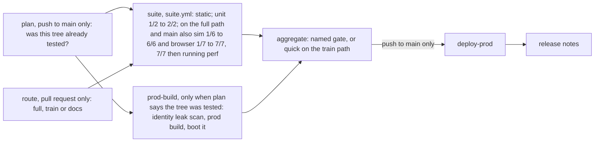

# Engineering: how throttlebrawl is built, checked and shipped

**In plain words.** This page describes the workshop, not the game. The code lives in a public GitHub repository. Several AI coding agents work on it at the same time, each on its own branch and in its own part of the code. When an agent finishes a piece of work, a robot runs the checks: the code compiles, the tests pass, a bot plays a full race in a real browser, the game stays fast on a phone-like profile, and there is a short note saying what changed. If everything is green, the work merges itself. Every green merge updates the playable game on a Hugging Face web page (the maintainer's answer). Each update also copies the project's source files to that page, so the Hugging Face copy doubles as a browsable mirror of the GitHub repository. A second "staging" page, which showed a work-in-progress branch on request, was retired on 2026-10-03 and keeps its last build. The maintainer plays on a phone, says what feels good or bad, and is only asked about taste, money over the cap, and anything public or irreversible.

Tags used on this page:

- `[decided]`: traces to a maintainer answer.
- `[default]`: a proposal. The maintainer may change it; an agent may change it only in a PR that updates the doc and says why in its `changes/` note. Until changed, agents follow it.
- `[open]`: waiting on the maintainer. Each one is listed in [Open questions](#open-questions).
- `(unverified)`: an external fact this page could not confirm.

External facts marked "verified 2026-09-29" were fetched from the vendor's own docs on that date and are quoted.

## Contents

- [Principles](#principles)
- [Repo layout](#repo-layout)
- [Toolchain](#toolchain)
- [npm scripts](#npm-scripts)
- [The gate: definition of done](#the-gate-definition-of-done)
- [Pre-commit hooks and leak scan](#pre-commit-hooks-and-leak-scan)
- [CI on GitHub Actions](#ci-on-github-actions)
- [The bundle train](#the-bundle-train)
- [Branch protection and auto-merge](#branch-protection-and-auto-merge)
- [Deploy: game Space and staging Space](#deploy-game-space-and-staging-space)
- [Big and generated assets](#big-and-generated-assets)
- [Phone testing](#phone-testing)
- [What-changed notes, in-game changelog and releases](#what-changed-notes-in-game-changelog-and-releases)
- [Parallel agent lanes](#parallel-agent-lanes)
- [Dev-time AI spend](#dev-time-ai-spend)
- [What always needs the maintainer](#what-always-needs-the-maintainer)
- [Open questions](#open-questions)
- [Verified external facts](#verified-external-facts)

## Principles

- **Velocity over ceremony.** `[decided]` The maintainer asked to "focus on velocity not just a million redundant checks". The gate below is the whole list; agents do not add parallel checks, review rituals or approval steps.
- **Decide only what is hard to change later.** `[decided]` Everything else gets a seam: an interface, a versioned file format or a config switch.
- **Main is always playable.** `[decided]` Every session ends with main green and the game Space showing a build you can play on the phone.
- **The maintainer is never a gate.** `[decided]` Work merges on green checks without a human review. See [What always needs the maintainer](#what-always-needs-the-maintainer) for the only exceptions.
- **Verify what the player sees.** `[default]` Checks assert rendered, observable results: the canvas is not blank, the race reaches the finish, the note text reaches the changelog. Internal flags alone do not count.
- **One toolchain.** `[decided]` npm, because the maintainer's other JavaScript repos use npm and pnpm needs "compelling reasons".
- **Python only offline.** `[default]` Python tools are allowed only under `tools/` and never in the game build.

## Repo layout

`[default]` The module folders under `src/` mirror the module map in [architecture.md](./architecture.md). **If they disagree, architecture.md wins**, and this section gets fixed in the same PR.

```text
/
├─ AGENTS.md              binding rules for every coding agent
├─ CLAUDE.md              one line: @AGENTS.md (Claude Code reads it; Codex and Copilot read AGENTS.md)
├─ README.md              what the game is, how to play, how to run it
├─ LICENSE                MIT; the holder line reads "the throttlebrawl contributors" (see below)
├─ THIRD_PARTY_ASSETS.md  every non-original asset: source, licence, where it is used
├─ .claude/workflows/     the saved run template (the rest of .claude/ is git-ignored local agent state)
├─ docs/                  public design docs (this file, architecture, spec, milestones, playtests/)
├─ changes/               what-changed notes, one small file per PR
├─ packs/                 content packs (pack zero is packs/base): rivals, bikes, weapons, barks, events, event modifiers, radio stations, regions, HUD presets
├─ src/                   the module map, copied from architecture.md (editor JSON Schema is generated on demand into git-ignored .cache/schemas/, see content-packs.md)
│  ├─ core/               shared types, deterministic math, seeded RNG, event types
│  ├─ road/               road network model and queries (DOM-free, like sim)
│  ├─ sim/                fixed-step simulation and its public contract (api.ts); DOM-free
│  ├─ content/            pack loading, validation, registry
│  ├─ tuning/             the parameter registry and presets (declarations live beside their systems)
│  ├─ input/              devices to actions, haptics
│  ├─ assets/             asset manifest loader (baked now, remote later)
│  ├─ stream/             chunk manager
│  ├─ render/             three.js scene, look layer, overlay
│  ├─ camera/             camera modes and rigs
│  ├─ audio/              synthesized engine, sfx, music, buses
│  ├─ ui/                 HUD, menus, touch layout, tuning panel (ui/tuning/), barks and interludes (ui/narrative/), changelog card
│  ├─ career/             progression, shop, fines, grudge memory (M4)
│  ├─ platform/           fullscreen, orientation, wake lock, service worker
│  ├─ save/               versioned local save and export code
│  ├─ replay/             input recorder and player
│  ├─ app/                boot, main loop, state machine, wiring
│  └─ dev/                test handle, bot player, perf probe, debug report
│  (plus src/main.ts, the composition root outside the module graph)
├─ public/                small static files (icons, web manifest)
├─ tests/
│  ├─ sim/                shared seeded-race batch and per-lane hooks
│  ├─ e2e/                Playwright bot race, device-path tests and screenshots
│  ├─ perf/               Playwright perf profile, budget.json and baseline.json
│  ├─ fixtures/           golden fixtures: save/ from M4, migrations/ from the first outside pack (neither exists at scaffold)
│  └─ replays/            bug-repro input recordings; not part of the gate
├─ tools/                 offline pipelines, never shipped: packs/, road/, gis/, blender/, audio/, ai/
├─ scripts/               Node helper scripts used by npm scripts and CI
├─ space/                 Hugging Face Space README template (prod)
└─ .github/               train.json (the bundle train's switch and numbers), dependabot.yml, deploy/
   └─ workflows/          ci.yml, suite.yml, train.yml, train-kick.yml, rerun-main.yml, dependabot-auto-merge.yml
```

- Unit tests sit next to the code as `*.test.ts`. `[default]`
- **The licence holder is not a person.** `[default]` `LICENSE` reads "Copyright (c) 2026 the throttlebrawl contributors". `package.json` has no `author` and no `contributors` field, and no tracked file names the maintainer personally. Changing the holder line is the maintainer's call. (Git history cannot be scrubbed later, and this is the first file every visitor opens.)
- `scratch/`, `*.local.md`, `local/`, `.cache/`, agent logs, `dist/`, `test-results/`, `playwright-report/` and `.env*` are git-ignored. `[decided]` for scratch ("scratch ignored") and for agent logs ("agent logs and scratch files are ignored by git"), `[default]` for the rest.
- `assets.lock.json` (repo root) pins the Hugging Face dataset repo at one commit; the dataset scripts are `scripts/assets.mjs` and `scripts/dataset-assets.mjs` (run W-Q, see [Big and generated assets](#big-and-generated-assets)).
- `tools/gis/` gets its own Python project file the day it is created. Blender scripts in `tools/blender/` run inside Blender's own interpreter, are linted with `ruff` only, and each exported GLB is validated. They are called through npm scripts that read a `BLENDER_EXE` environment variable. `[default]`, following the scaffold tweaks the maintainer approved.
- **`<lane-id>`** in branch names is the module folder name from architecture.md's ownership table (for example `lane/road/junctions`), or `infra` for shared files. `[default]`

## Toolchain

`[decided]` TypeScript, Three.js and Vite, installed with npm. The rest is `[default]`.

| Tool | Version line | Why |
|---|---|---|
| Node.js | 22 LTS. `.nvmrc` pins the Node CI runs (22.23.3); `engines` holds the floor the installed packages need (`>=22.13`) | ESLint 10 needs `^22.13.0` and Vitest 5 needs `^22.12.0` (npm registry, 2026-09-29), so a bare "22" could resolve to a Node that is too old. `.nvmrc` moved to the newest 22.x (22.23.3, released 2026-09-23) on 2026-09-30 so CI can install lint-staged 17, which needs `>=22.22.1`. `engines` stays at 22.13 until lint-staged 17 actually lands: `.npmrc` sets `engine-strict=true`, which also checks the root package, so raising the floor early makes `npm ci` refuse to run on any machine still on an older 22.x (checked on the dev machine, Node 22.20.0: "notsup Not compatible with your version of node/npm"). Whoever merges lint-staged 17 raises `engines` to `>=22.22.1` in the same PR, and every local machine needs Node 22.22.1 or newer first. `[default]` |
| TypeScript | `~6.0` | typescript-eslint 8.71.0 declares `typescript: '>=4.8.4 <6.1.0'` (npm registry, 2026-09-29), while the newest TypeScript is 7.0.2. Revisit when typescript-eslint widens its range. |
| Vite | 8.x | build and dev server |
| Three.js | r186 (`three` 0.186.x) with `@types/three` | renderer |
| ESLint | 10.x flat config with typescript-eslint typed rules | lint |
| Prettier | 3.x | format; no style debates |
| Vitest | 5.x | unit tests, sim tests, headless race batches |
| Playwright (`@playwright/test`) | 1.63.x, Chromium | bot playthrough, screenshots, perf profile |
| simple-git-hooks + lint-staged | current | git hooks without a second toolchain |
| secretlint | 13.x | secret patterns in the leak scan |
| knip | current | dead-code report; advisory, not in the gate |

Versions are from the npm registry on 2026-09-29. Exact versions are pinned in `package-lock.json`, and `.npmrc` sets `save-exact=true`.

**TypeScript settings.** `[default]` `strict`, `noUncheckedIndexedAccess`, `exactOptionalPropertyTypes`, `noImplicitReturns` and `verbatimModuleSyntax`. `src/sim/` **and** `src/road/` have their own `tsconfig` with `lib: ["ES2022"]` and no DOM types, and an ESLint `no-restricted-imports` rule bans `three`, `render/`, `audio/`, `ui/`, `input/` and browser globals from both (the ban list is architecture.md's [dependency rules](./architecture.md#dependency-rules)). "The sim does not depend on the renderer" becomes a compile error instead of a code-review comment.

**npm hardening.** `[default]` CI installs with `npm ci`. `.npmrc` sets `ignore-scripts=true`, so dependencies cannot run install scripts. Playwright browsers and git hooks are installed by explicit commands (`npx playwright install chromium`, `npm run hooks:install`). CI runs `npm audit signatures`. A dependency that truly needs its install script is allowlisted in `.npmrc` comments with the reason.

**Vite settings.** `[default]`
- `base: './'`, so the same build works at a Space root or under any sub-path.
- `server.host: '127.0.0.1'`, `preview.host: '127.0.0.1'` and `strictPort: true` on 5173 (dev) and 4173 (preview); `npm run phone` forwards exactly these ports. The host is set explicitly because Vite may bind only the IPv6 loopback on some systems, and `adb reverse` against an IPv6-only listener is untested (unverified). Never bind all interfaces (`host: true`).
- The browser tiers do not use 4173 locally. `playwright.config.ts` asks `scripts/preview-port.mjs` for a port: `PREVIEW_PORT` if set (and only then may it reuse a server already running there), 4173 on CI, and otherwise a free port from the OS, passed to `vite preview --port`. A fixed port with server reuse let parallel lane worktrees run their tests against another lane's build (camera-2, input and platform-2 reports, 2026-09-30). `npm run preview` and `npm run phone` still use 4173. `[default]`
- The build injects `BUILD_ID` (short commit), `BUILD_CHANNEL` (`prod`, `staging` or `dev`) and `BUILD_BRANCH`. The main menu footer and the debug report show them.

**Test handle.** `[default]` `window.__game` exists only when Playwright sets an init flag before the page loads. It exposes read-only sim state, the bot switch and a seed control, as in architecture.md's [testing seams](./architecture.md#testing-seams). The same init flag can also pin render settings (quality tier, dynamic resolution, device pixel ratio) for the perf run; those are not sim state. Production players never get it.

## npm scripts

`[default]` Names are stable, because CI, hooks and agents call them.

| Script | What it does |
|---|---|
| `dev` | Vite dev server |
| `build` | typecheck, then `build:dist` |
| `build:dist` | `vite build`, then `changelog:build` into `dist/`; `npm run check`'s build step, since its static tier already type-checks |
| `preview` | serve `dist/` locally |
| `typecheck` | `tsc` for the app and for the DOM-free sim config |
| `lint` / `lint:fix` | ESLint over `src/`, `tests/`, `scripts/`, `tools/` and config files |
| `format` / `format:check` | Prettier |
| `test` | Vitest: unit tests, sim tests, and, once they exist (save fixtures from M4; pack-migration fixtures from the first outside pack) `[default]`, the save-format and pack-migration fixture tests (`tests/fixtures/save/`, `tests/fixtures/migrations/`) |
| `test:sim` | headless batch of seeded bot races (default 50, as in architecture.md) asserting that races finish, nothing is NaN, and each recorded race replays **in the same run** to identical state hashes |
| `test:changed` | the unit and sim tests that import a file changed since `origin/main` (committed or not), through Vitest's `--changed`; not a gate step, not the pre-push hook, and not a lane's local loop: it follows the import graph, so it selects much of the suite, and lanes run their touched files by name instead ([Local loop](#local-loop-for-lanes)) |
| `packs:check` / `packs:migrate` | validate every file under `packs/` (schema, references, licence rules, jump-curvature rule), or (`packs:migrate`) a helper for format-bump PRs that rewrites the repo's own packs to the current format, with no fixtures until outside packs exist; owned by [content-packs.md](./content-packs.md#validation) |
| `e2e` | Playwright: one bot race at the phone-landscape viewport, plus two short device-path tests (keyboard, and pointer events on the touch overlay), with screenshots |
| `e2e:one` | build, then the browser specs named after `--` (for example `npm run e2e:one -- tests/e2e/ui-pause.spec.ts`); not a gate step, and lanes don't run it: CI runs the browser tiers ([Local loop](#local-loop-for-lanes)) |
| `perf` | Playwright perf run on the throttled phone-like profile, compared with `tests/perf/budget.json` and `tests/perf/baseline.json` |
| `leakscan` / `leakscan:all` | staged files, or the whole tree (see [leak scan](#pre-commit-hooks-and-leak-scan)) |
| `sizecheck` | fails on any committed file over 1 MB that is not allowlisted |
| `notes:check` | fails if the branch adds no valid note under `changes/`; the pre-commit hook runs it when a note is staged |
| `changelog:build` | turns `changes/` into `dist/changelog.json` |
| `assets:fetch` / `assets:verify` / `assets:add` / `assets:upload` | the dataset files `assets.lock.json` pins (run W-Q): download them into `.cache/assets/` and check each sha256 (an already-cached good file is not downloaded again); check the lock against the repo and every cached file; pin a new or changed file (`-- <file> --as <packId>/<path> [--region <id>]`); upload the pinned files the revision lacks or holds with other bytes (compared by content) with the signed-in `hf` CLI and pin the commit it made |
| `check` | runs the whole gate in CI order and prints what each step examined; `-- --tier <tiers>` runs some tiers (`static`, `unit`, `sim`, `browser`, `perf`, and `budget`: the build plus `perf --size-only`), and `-- --tier static,budget` is the static part of the bundle train's quick check |
| `phone` | helper for `adb reverse` (see [Phone testing](#phone-testing)) |
| `hooks:install` | installs the git hooks |
| `knip` | dead-code report, advisory |

## The gate: definition of done

`[decided]` The maintainer's done bar is "tests/lint/types + bot playthrough + perf + plain changelog". They added "focus on velocity not a million redundant checks", so agents add no further checks. The leak scan is also `[decided]` (a quick scan on every commit, "audit before public"). The remaining rows are cheap `[default]` additions that the gate needs to work. The table is the complete list.

| Step | Script | Passes when | Source |
|---|---|---|---|
| Types | `typecheck` | zero errors, app and sim/road configs | `[decided]` |
| Lint and format | `lint`, `format:check` | zero errors | lint `[decided]`, format `[default]` |
| Packs | `packs:check` | zero errors (warnings print) | `[default]`, required by [content-packs.md](./content-packs.md#validation) |
| Leak scan | `leakscan:all` | zero findings, and a nonzero count of files examined | `[decided]` |
| Size | `sizecheck` | no unexpected file over 1 MB | `[default]` |
| Unit and sim | `test`, `test:sim` | all green; seeded bot races replay to identical state hashes in the same run; save and pack-migration fixtures migrate, once they exist (save fixtures from M4; pack-migration fixtures from the first outside pack) | `[decided]` for the tests and replays; `[default]` for the fixtures |
| Build | `build:dist` (`build` without its typecheck, which the Types row runs) | `dist/` builds; the bundle stays within budget | `[default]` |
| Bot playthrough | `e2e` | see below | `[decided]` |
| Perf | `perf` | see below | `[decided]` |
| Notes | `notes:check` | on a pull request, at least one new `changes/` file; skipped on push to main | plain changelog `[decided]`, the per-PR file `[default]` |

**Where it runs.** `[decided]` (the maintainer, 2026-10-05: "Revive the train instead of limiting parallel lanes"): with the bundle train on (`"live": true` in `.github/train.json`, since 2026-10-06), the whole table goes green on every **bundle** of ready PRs instead of on every PR ([The bundle train](#the-bundle-train)). Each PR gets a quick check (Types, Lint and format, Packs, Leak scan, Size, Notes, Unit, and Build with the size budget), and the rest (Sim, Bot playthrough, Perf) runs once per bundle, then again on main after every landing. The table itself does not change.

`[default]` The details:

- **One command.** `npm run check` runs every step locally in the same order as CI. CI calls the same npm scripts, never its own copies. Each step prints what it examined (files linted, tests run, races simulated, screenshots taken, frames sampled), because a check that looked at nothing reads exactly like a pass.
- **Prove the gate can fail.** When the scaffold lands, break one spec on purpose, watch CI go red, then revert it. That happens once, not every PR.
- **Bot playthrough.** As in architecture.md's [testing seams](./architecture.md#testing-seams), the bot is a `BotController` that reads the sim snapshot and writes into the input layer's action state. It computes its action once per sim tick from that tick's snapshot, so a seeded run is deterministic and independent of frame rate. Playwright loads the production build from `vite preview`, starts the shortest race (race length is a setting), and lets the bot ride, once, at the phone-landscape viewport. The run passes when the assertions below hold.
  - **Assertions switch on with the feature that makes them possible.** From the scaffold: the page boots, a WebGL2 context was created, no console errors, and the screenshot canvas is not blank. From the PR that lands the race loop: the race reaches the finish before a timeout and a placing is recorded. From the PR that lands combat: at least one attack connects, on a seeded race where the bot is known to connect. Turning an assertion on, or adding a test for new behaviour, is normal agent work.
  - "Not blank" means pixel variance above a threshold, so a black or empty canvas fails. Screenshots at the start, mid-race and finish are uploaded as CI artifacts for eyeballing and kept 7 days.
  - `[default]` **Lockstep, not wall time** (the determinism run, 2026-10-03). The bot playthrough rides the whole race in lockstep at 8 ticks per frame, with every frame drawn (`__game.lockstep`; architecture.md's [testing seams](./architecture.md#testing-seams)). It asserts that every frame of the race stepped exactly 8 ticks, and it saves the race's debug file to `test-results/` so a failure can be replayed in Node. A Node bot race from the file's header gives the same inputs and state hashes (checked on 2026-10-03: 8,726 ticks, 146 hashes, 0 different, at both 7 and 8 ticks a frame). The other whole-race specs (ui-screens, ui-route-picker, road-events, career, tuning-panel, render-backdrop, ui-settings, ui-style-popups) fast-forward through the parts they do not check, and render-looks' render-only race rides in lockstep at 8 ticks a frame, every frame drawn (the test diet, 2026-10-05). Their waits are hang guards, not deadlines on the race.
  - `[default]` **No fixed waits in browser specs.** Lint bans `waitForTimeout` in `tests/e2e`, and also any `setTimeout` or `setInterval` there whose delay is not a literal of 100 ms or less. A spec waits on the game instead: a sim tick, a DOM state, `__game.fastForward`, or `frames(page, n)` from `tests/e2e/lockstep.ts`. A wait that really is about wall time (a long-press threshold, a CSS or UI timer, the audio clock, the look fallback's slow-frame watch) stays, with `// eslint-disable-next-line no-restricted-syntax -- <why>`. Reasons that start with "debt:" mark waits that should become tick waits.
  - **Two short device-path tests prove the real devices,** since the bot writes action state directly: one presses keys, one dispatches pointer events on the touch-control overlay elements, and each asserts the resulting `SimInput`.
- **CI rendering.** CI renders WebGL in software, and Chromium has announced that WebGL context creation will fail instead of falling back to SwiftShader (blink-dev "Intent to Remove: SwiftShader Fallback", seen only through a summarizer, so treat it as unverified; whether Playwright's bundled headless Chromium is affected is also unverified). Playwright therefore launches Chromium with `--use-angle=swiftshader --enable-unsafe-swiftshader`, which is harmless if not needed. The first assertion of every browser test is that a WebGL2 context exists, and the renderer string is printed. CI e2e and perf pin device pixel ratio 1, and the test flag leaves quality tiers and dynamic resolution off (the `high` tier at full resolution) unless a spec turns them on `[default]` (playtest 4, C9). Every CI job is planned to finish inside about 70% of 10 minutes (about 7 minutes), and its `timeout-minutes` is about 1.5 times its expected time, a guard against a hang rather than a budget `[default]` (2026-10-05). When a job grows past that, refresh the timings and rebalance first, then split the slowest test files (a split moves tests unchanged, never drops or weakens one), and only then add a slice ([CI](#ci-on-github-actions)).
- **Perf check.** Wall-clock timing on shared CI runners is noisy. So perf has two tiers, and both run with quality tiers and dynamic resolution off (the `high` tier at a fixed scale of 1.0, the heaviest scene a phone draws) through the test flag, because architecture.md's `auto` tier and dynamic resolution would otherwise make draw calls depend on runner speed:
  - **Hard gate, deterministic.** Draw calls and triangles from `renderer.info` at fixed camera checkpoints of a seeded race, and initial download size (M1 starting budget: JavaScript at most 500 KB gzip, whole first load at most 3 MB). The 3 MB is the M1 CI limit; architecture.md's 15 MB first-play figure is the ceiling for the A16 as content grows, and the stricter number binds CI. `[default]` Run W-O raised the CI limit to 5 MB for the spoken barks: 247 baked Opus clips, about 1.9 MB, each fetched only the first time its line is said, so the count of every dist file grew while the real first load did not. `[default]` The same run raised it to 6 MB for the real-road routes (the maintainer, 2026-10-01: "Yes, add as routes"): their road data, about 0.9 MB of JSON in the Pacific Northwest and San Francisco packs, ships beside the build and is fetched only when a race in that region starts. `[default]` Run W-P measured what fills it and did not raise it: the build writes its JSON assets (the road data fetched on demand) on one line (`scripts/json-assets.mjs`), about a fifth smaller, which took the whole build from 5.31 MB to 5.04 MB (2026-10-01: Opus voice clips 1.88 MB, JavaScript 1.49 MB, road JSON 1.15 MB, models 0.52 MB). `[default]` Run W-Q raised it to 15 MB, the architecture's first-play ceiling, for real rider and bike models (interview, 2026-10-02: "Real models now"): they come from the dataset repo and load per region, only when a race there starts, so `regionModelsKB` (3 MB) caps each region's own models and the size step prints the shared models and one race's worst; the build measured 5494 KB before any of them (models 509.5 KB, all shared). The limits live in `tests/perf/budget.json`, and changing them is a normal PR with the reason in its note.
    - The JavaScript limit counts the first load: the page's entry script, its modulepreloads and everything they import statically (`scripts/first-load.mjs`). Code the first screen does not need loads as a lazy `import()` chunk; `npm run perf` lists each lazy chunk's gzip size, and every dist file, lazy chunks included, still counts toward the 3 MB. `scripts/first-load.test.ts` builds the game and fails if a module meant to be lazy (the film pass, the model reader, the tuning panel, the self-test; since playtest 3's wave C also the sound engine, the race's moving parts in render (`render/race-parts.ts`), the career's backup codes, the pause menu's radio panel and the wheelie gauge's DOM, each fetched as the menu comes up) is pulled back into the first load, and if any pack's road data (networks, roads, routes; the Keys' hand-made roads included, fetched at boot since run W-S) is bundled into it. `[default]` The built `index.html` preloads those hand-made Keys road files (`<link rel="preload" as="fetch" crossorigin>`, `scripts/boot-preload.mjs`), so their download starts with the page instead of after the entry script has run; the app's own `fetch()` takes them from the preload. `[default]` (run W-S: moving them off the first-load JavaScript cost the start screen one round trip.)
    - **Headroom and each PR's own change.** `npm run perf` prints the first-load JavaScript's headroom under its budget. On CI (or locally with `--base origin/main`) it also builds the merge base with `origin/main` in a throwaway worktree under `.cache/` (about 4 s) and prints the pull request's own change against main, so a lane sees the squeeze in its own PR instead of as main's red when the last of several innocent merges crosses the line. A growth of 5 KB or more prints a warning. The line also goes to the job's step summary. `--size-only` skips the browser probes. `[default]` (brittle-test inventory R10, 2026-10-02: the budget was crossed three times that day, each time by the last of several merges.)
    - **A pull request's floor: 10 KB of headroom.** On a pull request (GitHub's `pull_request` event), the perf check FAILS a build that grows the first-load JavaScript and leaves less than 10 KB of headroom under the budget: "this PR leaves N KB of headroom; move something off the first load". A PR whose measured change does not grow the first load never fails it, so if main itself drifts inside the floor (two PRs that each fit, merged), only the PR that adds to it goes red, never every PR or the one that shrinks it; a change that was not measured is held to the floor. Main's pushes keep the 500 KB hard limit alone. The logic is `floorProblem` in `scripts/perf-limits.mjs`, unit-tested in `scripts/perf-limits.test.ts`, and every run prints whether the floor held or was not applied. `[default]` (the coordinator, 2026-10-03: the 500 KB budget was crossed 4 times on 10-02 and 10-03 by PRs that each fit alone; the floor turns the PR that eats the margin red instead of main.)
  - **Soft tier, throttled: a trend plus a 3x guard.** `[decided]` (the maintainer, 2026-10-02: "Trend plus 3x guard".) Chromium with 4x CPU throttling (the DevTools protocol's `Emulation.setCPUThrottlingRate`) and a phone-like landscape viewport (about 900×400 CSS pixels, touch, mobile). It records p50 and p95 frame time and sim step time p95 (from `dev/perf`) over 20 seconds of bot racing, for the classic look and each ink look. These numbers are a **trend, not a gate**: every run prints them with their ratio to the stored baseline in `tests/perf/baseline.json` (a `perf trend` line in the log, the probe's JSON in `test-results/`, and a table in the job's step summary). The gate fails only above **3x the baseline**, a catastrophe guard that runner noise cannot reach. Frame times come in whole display frames, so a frame guard gets half a frame of slack: exactly three times the baseline's frames passes, one frame more fails. The limit logic lives in `scripts/perf-limits.mjs`, and `scripts/perf-limits.test.ts` shows the guard fires. Why: CI renders in software at about 7 to 19 fps, and on 2026-10-02 the classic frame p95 drifted from about 83 to 150 ms in a day; the same game code printed 100.1 ms and then 150 ms, so the old 2x limit held main red on noise. Draw calls, triangles and the download size stay hard limits. The baseline is measured on CI runners and updated by a PR whose note gives the reason; the current one is from 2026-10-02 (8 CI runs on that day's main code).
  - **Truth.** The benchmark phone (Galaxy A16 5G) is the real test `[decided]`. The in-game debug overlay (`?debug=1`) shows fps, frame time and the renderer string. Any performance claim names the device, the renderer and the scene.
- **Recordings.** `tests/replays/` holds bug-repro input recordings, not gate fixtures. architecture.md says a replay plays only on a build with the same replay key (the hash of the sim code plus the sim content hash), so a committed recording would go stale on every content or tuning PR. A recording whose replay key no longer matches is skipped with a printed notice.
- **Seeded sim tests: isolation and seed searches.** `[default]` (the determinism run, 2026-10-03. On 2026-10-02, 55 of the day's 391 failure rows were seeded tests that another system's merge had reshuffled, and 21 more were tests that need their seeded race to contain something, such as a bust.)
  - **The isolation profile.** A seeded test of ONE behaviour (a rival's quirk, the landing judgment) races with `ISOLATED` from `tests/sim/batch.ts`, which turns off every optional world system: traffic, animals, road events, the event's cops, the patrol, the heat meter, the ground beside the road, and crash weapons; roadside weapons go as sparse as the slider allows. The test then turns back on only what it tests (`{ ...ISOLATED, 'ai.styleQuirks': 0 }`), so a new or retuned system cannot move its numbers. Every tuning declaration marked `system: true` must be in the profile; `tests/sim/isolation-profile.test.ts` fails when one is missing, so the lane that adds a world system marks its switch and adds it there.
  - **The trade-off.** Statistics measured in isolation stop catching interaction effects on those statistics (traffic meeting a wobbling lander, a roadblock taking the patrol's cops). The shared 50-race batch is not isolated: it keeps those systems on (except the three in `NO_ROAD_EVENTS`) and its files assert invariants over it. A test whose subject IS an interaction, or a claim about the whole shipped game (the patrol met in every race, the heat meter in every region), keeps the world on. When a system's lane wants to know how it changes something else, it writes that interaction test on purpose. One measured case: the heat's roadblock test needs chaos, and chaos comes from interactions, so it stays out of the profile (under `ISOLATED` the Pacific Northwest's bot never got off heat tier 0).
  - **Seed searches.** A test that needs its seeded race to contain something first (a bust, a steal) finds that race with `firstSeed(label, seeds, run, qualifies)` instead of naming a seed. It tries the seeds in order, so the same build always uses the same seed, and it prints which seed it used. When content reshuffles the races, it moves on to the next seed that qualifies. It fails only when no seed in the range qualifies, which is a real "this never happens any more" signal. A search tries at most 64 seeds, to keep its CPU bounded.
- **Assert the rule, not today's content.** `[default]` (the coordinator's CI analysis, 2026-10-04: 13 of the 28 red PR runs since 10-03 were fixed by editing a test that pinned a whole-game fact another lane had legitimately changed.) A test asserts the rule it protects and reads what it checks from the packs (every route the region offers, each traffic type's weight from its region file, a sign's words from its modifier), never a hand-written whole-game list, an exact count, player-facing text copied from a pack, or a seed that happened to produce the event (search with `firstSeed`, or in a browser spec try seeds in order). A seeded statistic is a band over enough races, never a floor at the measured value; budgets, determinism and replay checks stay exact, and the known-exception lists of the layout, geometry and reachability checks only shrink. Browser specs read the packs through `tests/e2e/packs-on-disk.ts` (plain JSON; the game's bundled loader does not run in the test runner), and `tests/sim/e2e-oracles.test.ts` keeps each of its readers equal to the game's own rule. A test picks the content it needs by rule (the Keys' opening race, the first Audit grudge, the weaver in the field), not by id, and a check of words the maintainer can veto skips a scene or line whose status is no longer live.
- **Main red after a merge.** Checks are not required to run against the very latest main (see [Branch protection](#branch-protection-and-auto-merge)), so two green PRs can rarely combine into a red main. CI runs again on every push to main: the whole suite whenever main moved after the PR's run, so its merged tree was never tested, and only the push's own checks (identity leak scan, prod build) when a green PR run already tested that exact tree ([CI](#ci-on-github-actions)). If main goes red, prod deploy does not run, so the public game stays on the last green build, and the run's keeper fixes it forward or reverts the culprit ([Parallel agent lanes](#parallel-agent-lanes)). A red first attempt is re-run once by itself while its commit is still main's head ([CI](#ci-on-github-actions), `rerun-main.yml`), so a flaky test alone does not hold main red. A revert is a new commit, never a history rewrite. With the [bundle train](#the-bundle-train) on, PRs on its path are tested on top of the main they land on, so they compose before they land, not after; a keeper's fix for a red main carries "[full-gate]" so it does not wait for the train, which waits while main is red.

### Local loop for lanes

The rules are in [AGENTS.md](../AGENTS.md#the-dev-machine-what-runs-locally); this section gives the reasons and the commands. `[default]` The gate above is unchanged, and CI runs all of it on every PR (on every bundle, once the [bundle train](#the-bundle-train) is on).

- **Why so little runs locally.** The maintainer, 2026-10-01: "I like thorough testing, but it seems like we're doing a lot of waiting on this pc instead of making more rapid, visible progress". Measured that day across 141 past lane runs (about 157 lane-hours), lanes spent 61% of their time waiting on tests: 32% on local suites, 22% watching CI and 7% in the pre-push hook, because the same suites ran locally, in the hook, then in CI. Then, on 2026-10-02, about 15 parallel agents running local Playwright browsers (software-rendered WebGL, which is CPU-heavy), builds and Vitest at once locked up the dev machine; the CPU was the limit, not the memory.
- **The commands a lane uses.** `VITEST_MAX_WORKERS=2 npx vitest run <file>...` for the test files it touches, named one by one, as often as it needs (two workers, so parallel lanes don't starve each other), and `npm run typecheck` once before pushing. A seeded sim test being written runs alone, by file; never `--project sim` whole. Lanes don't use `npm run test:changed` or `vitest related`: Vitest follows the import graph, so one content PR (#414, 36 files) selected 142 of the 261 unit test files and took 4.6 minutes at two workers (2026-10-03), and a `src/sim/` change pulls in most of the sim batch.
- **No browsers in lanes.** Lanes run no Playwright spec, `e2e:one`, perf run, dev server or `vite preview`; CI runs the browser tiers on every PR, and lanes read CI's logs, screenshots and artifacts. A run has one browser slot, for its live check: one headless `playwright-core` Chromium, driven from a script, against the game link. Never the Playwright MCP tools ([AGENTS.md](../AGENTS.md#the-dev-machine-what-runs-locally)).
- **Builds.** `vite build` (with `node scripts/perf.mjs --size-only`) runs locally only for a change to the build or the download size; CI's perf step measures the size of every PR anyway.
- **The pre-push hook** still runs and is never skipped; it runs the typecheck and the unit tests the push names ([hooks](#pre-commit-hooks-and-leak-scan)).
- `npm run check` with no `--tier` is what CI runs; nobody runs it on the dev machine.

## Pre-commit hooks and leak scan

`[decided]` A quick leak scan runs on every commit; machine-specific certificate settings stay in user-level config; `scratch/` is ignored; private context stays out of the repo.

`[default]` The hook tool is **simple-git-hooks + lint-staged**, not the Python pre-commit framework. It keeps one toolchain (npm), works the same for Claude Code, Codex and Copilot, and runs on every OS without extra installs. Install with `npm run hooks:install`; `npm ci` does not, since `.npmrc` turns off install scripts.

- **One hooks folder for every worktree.** Git worktrees share the main checkout's `.git/hooks`, so installing the hooks from any worktree rewrites them for all the others, from that worktree's `package.json`. So the hook commands stay stable pointers (`node scripts/pre-push.mjs`, `npx lint-staged`), and a change to what a hook does goes in the script or `lint-staged.config.mjs`, which each worktree reads from its own checkout, with no reinstall. Lanes never run `npm run hooks:install`; when a hook command itself changes on main, the coordinator runs it once, in the main checkout. The pre-push command falls back to the old typecheck-and-`--changed` hook in a checkout that has no `scripts/pre-push.mjs`, so older branches still push.
- **What pre-push tests** (`scripts/push-plan.mjs`, pinned by `scripts/push-plan.test.ts`), from the files the branch changes since its merge base with `origin/main`:
  - a push of `docs/`, `changes/` and Markdown only runs no tests;
  - a change to `package.json`, the lock file, the Vite or Vitest config, a tsconfig or `tests/setup/` runs the whole unit tier;
  - anything else runs the unit test files the push names: the test files it changed, and the test named after each source file it changed (`foo.ts` to `foo.test.ts`, a folder's `index.ts` to `<folder>.test.ts`). Import-graph selection (`vitest --changed`, which the hook used until 2026-10-03) picked 142 of the 261 unit test files for one content PR, and CI runs every test on every PR anyway.
  - The typecheck and the tests run at once, the tests with two workers unless `VITEST_MAX_WORKERS` says otherwise. `node scripts/pre-push.mjs --dry-run` prints the plan without running it.

| Hook | Runs | Measured on the dev machine |
|---|---|---|
| `pre-commit` | lint-staged (ESLint fix and Prettier on staged files; `packs:check` when pack files are staged; `notes:check` when a `changes/` note is staged), then `leakscan` and `sizecheck` on staged files | median 18 s, p90 63 s; `notes:check` adds about 1 s |
| `commit-msg` | leak scan of the commit message | instant |
| `pre-push` | `typecheck`, and the unit tests above | typecheck 11 to 14 s; 36 s for a 36-file content PR (10 test files), 10 s for a push that names no test file |

How these were measured: the pre-commit figures, and the pre-push hook before this design (median 79 s, p90 182 s over 262 pushes), are tool-call wall times from agent runs up to 2026-10-03. The new pre-push figures replay past PRs with `PREPUSH_BASE` and `PREPUSH_HEAD` on 2026-10-03, two test workers each. Replaying the same content PR (#414) the old way took about 298 s: a 20 s typecheck, then 142 test files in 278 s. Dropping the hook's tests altogether, leaving the typecheck alone, is still the maintainer's call `[open]`.

The browser tiers (e2e, perf) run in CI and in `npm run check`, not in hooks. Hooks are never skipped (`--no-verify` is banned in [AGENTS.md](../AGENTS.md)); if a hook is wrong, fix the hook.

**The leak scan** (`scripts/leak-scan.mjs`) is deliberately light:

- **Generic rules, committed in the repo:**
  - secretlint's recommended rules (API tokens, private keys, cloud credentials);
  - absolute user-home paths such as `C:\Users\<name>\`, `/Users/<name>/` and `/home/<name>/`;
  - email addresses, except a short committed allowlist that starts with `*@users.noreply.github.com`, `noreply@github.com` and `noreply@anthropic.com` (the address in Claude Code's commit trailer; without it the `commit-msg` hook would block every such commit and push agents toward the banned `--no-verify`);
  - private-network addresses and hostnames that look like machine names;
  - `.env` files and key files by name.
  - **Placeholders never match:** text in angle brackets such as `<name>` or `<owner>` is not a path or address. A unit test uses this doc's own examples as must-not-match cases and a real-looking path as a must-match case, so `leakscan:all` does not fail on the docs themselves.
- **Maintainer-specific denylist, never in the repo.** Employer names, personal details and anything else specific to the maintainer live in the maintainer's user-level git config, for example `git config --global --add throttlebrawl.leakscan.deny '<regex>'`. The script reads them with `git config --get-all throttlebrawl.leakscan.deny`. The repo never lists what is being hidden, which would itself be a leak. CI has no such config, so CI enforces only the generic rules; the local hook is the only place the private denylist applies.
- **Certificates and proxies.** Machine-specific network or certificate settings (for example `NODE_EXTRA_CA_CERTS` or proxy variables) live in user-level environment or config, never in the repo's `.npmrc`, scripts or workflows.
- **It reports what it examined.** The scan prints the number of files and bytes it checked, and fails if it checked zero files while files were staged. A scanner that looked at nothing and "passed" is the failure this rule exists for.
- **Before the first push** `[decided]` ("audit before public"). The first push is the docs-only commit, and it is made before `leakscan:all` exists (infra-1 builds it). `[default]` So the lead agent first sets the no-reply identity in user-level git config, then runs a one-off scan over the staged files and the commit with the same generic rules (secret patterns, user-home paths, non-no-reply emails, private addresses) plus the maintainer's private denylist. It checks `git log --format='%ae %ce'`, prints the number of files and bytes examined, and pushes only if it found nothing. infra-1's `leakscan:all` then re-audits the whole tree and `git log -p` from the docs commit onward, in infra-1's first PR, and checks that every commit carries the no-reply identity (see [Commit identity](#commit-identity)).

### Commit identity

`[decided]` (cockpit answer, 2026-09-29): public commits, the maintainer's and the agents', use the maintainer's GitHub no-reply address, which has the form `<id>+<login>@users.noreply.github.com`. The real number and login are set in user-level git config on the dev machine and are never written into the repo or the docs. The maintainer also chose GitHub's "block pushes that expose my email" switch and will turn it on later.

`[default]` Until that switch is on, the leak scan is the guard, and it has to be able to fire on the author field, not only on file contents:

- The `commit-msg` hook also checks the author and committer email of the commit being made (`git var GIT_AUTHOR_IDENT`, `git var GIT_COMMITTER_IDENT`) against the same email allowlist, so a real address fails locally before it is ever pushed.
- CI's `static` job checks the author and committer email of every commit in the PR's own range (`git log --format='%ae %ce' origin/main..${{ github.event.pull_request.head.sha }}`, not `HEAD`, which on a `pull_request` run is GitHub's synthetic merge commit) against the allowlist.
- Squash merges are made by GitHub, which picks their author email from the account's own email settings *(unverified)*. Because the repo is squash-only, every commit on `main` is one of these, and neither the local hook nor the PR-range check ever sees it. So `[default]` the maintainer's "Keep my email addresses private" setting must be on **before the first auto-merge** (only the block-pushes switch itself can wait). It sits on the same GitHub email settings page as the block switch *(unverified)*. infra-1 asks for it in its one "what's missing" message and does not arm auto-merge until the maintainer confirms.
- On `push` to `main`, `ci.yml`'s `static` job also checks `git log -1 --format='%ae %ce'` against the allowlist and fails loudly, so a squash commit carrying a real address is caught at the first merge and the maintainer can fix the setting. (After the fact, since history cannot be rewritten; the setting above is the real prevention.)

## CI on GitHub Actions

`[decided]` The repo is public from day one, and changes reach main by auto-merge on green checks. Actions minutes are free for this case: "GitHub Actions usage is **free** for **self-hosted runners** and for **public repositories** that use standard GitHub-hosted runners" (GitHub docs, verified 2026-09-29).

`[default]` The workflows:

- **`suite.yml`**: the test suite (`workflow_call`), called by `ci.yml` and by the train, so a PR, a train and main always run the same jobs and cannot drift. `full: true` runs every tier (16 jobs); `full: false` is the bundle train's quick check (3 jobs).
- **`ci.yml`** below: on `pull_request` to main and on `push` to main. It routes each PR, calls the suite, and on main deploys.
- **`train.yml`** and **`train-kick.yml`**: the [bundle train](#the-bundle-train), switched on since 2026-10-06.
- **`rerun-main.yml`**: a red main re-run once (below).
- **`dependabot-auto-merge.yml`**: [Dependabot](#dependabot).
- `staging.yml` was retired on 2026-10-03 (below).

**`ci.yml`**, triggered on `pull_request` to main and on `push` to main:



- **`route`** (`node scripts/train.mjs route`, pull requests only) reads what the PR changes (its merge commit against main) and who opened it, and picks its path. While the train is on, most PRs take the **train** path (the quick check); with it off, every PR takes the **full** path: the whole suite, exactly as before the train. See [The bundle train](#the-bundle-train) for the other two paths. A push to main always runs the whole suite (or the skip path, below). `[default]`
- **`suite`** calls `suite.yml`. Inside it, `static` (`npm run check -- --tier static`), `unit`, `sim` and `browser` run in parallel; their checks show as `suite / static`, `suite / unit (1/2)` and so on. The aggregate job (id `aggregate`) has `needs:` on `plan`, `route`, `suite` and `prod-build`, runs with `if: always()`, and fails unless every one succeeded (on a push to main whose tree was already tested, the skipped suite counts instead, see below). It is named **`gate`** on main and on the full and docs paths, and **`quick`** on the train path. **`gate` is the only required status check.** A single aggregate check means adding or renaming a job never strands PRs, and GitHub's own tip applies: "make sure that job names are unique across all workflows" (verified 2026-09-29). `[default]`
  - **Why static and unit are separate, and unit is sliced** (2026-10-05). They shared a job while together they took about 3 minutes; by #475's run the unit tests alone took 436 s, and the shared job 564 s against its 12-minute guard. The static checks take about 2 minutes on their own. On one runner of their own the unit tests still took 435 s (run 37261695645): about 980 s of tests, plus each of the 316 files' setup and import (about a fifth of Vitest's time), on three workers. Their slowest file, `tools/gis/region-routes.test.ts`, is the floor: 310 to 337 s beside other files, 138 to 174 s alone on a runner. So they run in two slices like the sim batch. `tests/sequencer.ts` starts the unit files longest first too, from the unit table in `tests/timings.json` (in Vitest's own order that file started 74 s into #475's run). Vitest's per-file time leaves out each file's setup and import, so the plan adds 0.8 s per unit file (`perFile` in `scripts/shard-plan.mjs`); without it, a 320-file slice planned at 203 s took 353 s (run 37266882407).
  - **Jobs and timeouts** (2026-10-05). The plan puts each sim slice at about 280 s of tests, each browser slice at about 335 s and each unit slice at about 270 s. On this layout's runs on 2026-10-05 (37261695645 to 37276170724, with five then six sim slices, six browser slices and an older table) the jobs took: static 118 to 126 s; unit 156 to 353 s; sim 174 to 535 s; browser 274 to 536 s. Each timeout is about 1.5 times the expected time, rounded up to whole minutes: static 4, unit 8, sim 10, browser 10. A push runs 16 suite jobs (it was 9), so at GitHub's limit of 20 at once, one push runs whole and the next starts on what is left; the runner minutes per push stay about the same, since the slices split the same work. The same files run at 0.55 to 1.5 times their table time from one runner to the next, and the tests grow as content lands (the cop-parking check runs one test per race and route), so a slice can still pass 70% of 10 minutes; refresh the table when one does. `[default]`
  - **The floors.** A slice cannot be quicker than its slowest file. On 2026-10-05 these were `tools/gis/region-routes.test.ts` (unit, up to 337 s beside other files, 138 to 174 s alone), `tests/sim/road-setpieces-live.test.ts` (300 to 400 s), and the browser specs `tests/e2e/ui-settings.spec.ts` and `tests/e2e/road-events.spec.ts` (about 350 s each). `tests/sim/cops-parking.test.ts` was the worst (434 s on average, one test per race and route, so it grows with every event); it runs by region since then. Adding slices does not help past a floor; splitting the file does.
- **Slices.** `unit` (2 slices), `sim` (6 slices) and `browser` (7 slices) are matrices. Each slice runs `npm run check -- --tier <tier> --shard <i>/<n>`: the test runner lists the tier's files (`vitest list` into a JSON file, since a 325-file list read through a pipe came back short on CI on 2026-10-05; `playwright test --list`), and `scripts/shard-plan.mjs` splits them by their measured CI seconds in `tests/timings.json`. Every file lands in exactly one slice, so nothing is skipped and the slices' test counts add up to the unsharded run's; each slice also fails if its runner ran a different number of files (Vitest) or tests (Playwright) than the plan gave it. `npm run check -- --tier browser --shard 1/7 --plan` prints every slice's files without running anything. On a push to main `fail-fast` is off, so a red slice never cancels another's result; a PR run fails fast (below). Locally, `npm run check` with no `--tier` still runs each tier whole. `[default]`
  - **Why measured times.** The runners' own `--shard` splits by file count, not time. On 2026-10-01 the two sim slices took about 290 s and 120 s, and browser slice 2 (its e2e, then perf) was the gate's critical path in 27 of the last 30 PR runs, at a median gate of 7.7 minutes. The plan simulates each runner (Vitest's 3 workers on CI's 4 vCPUs, starting the longest file first through `tests/sequencer.ts`; Playwright's 2 workers, by file path), and plans a file with no measured time as the table's mean time, so a new test file lands somewhere sensible; the plan step names every such file in a warning (an annotation on CI). The mean, not the median: most files are quick, so the median (9.5 s for sim on 2026-10-03) badly underprices a new slow file (three of the four geometry sweeps took 34 to 86 s). Stale times can only make the slices uneven, never drop a file. The times are what each file took on CI in this layout, so they include the slowdown of sharing a runner: three CPU-bound sim files at once ran about twice as slow as one alone. Refresh the table with `node scripts/timings.mjs <run-id>...` (green runs that ran the suite; a red job's other files count too) when slices drift apart by more than about a minute, or when one nears its 7-minute plan. It reads the unit, sim and browser jobs; the unit table only orders the unit job (it is not sliced).
  - **The shared seeded batch** (`simBatch()`, `presetBatch()`, see `tests/sim/batch.ts`) is computed once per runner and every file that reads it waits for it, so those files share one sim slice. A reader's measured time includes its wait, and the readers wait side by side, so the plan prices them like any other file (until 2026-10-03 it counted only the longest reader, and sim slice 1/4 took 537 s against a planned 387 s). The readers together are the floor of the slowest sim slice, and since 2026-10-05 no other file shares their slice: they wait on the Normal batch, which one worker computes in 218 to 375 s depending on the runner, so their measured times price the slice poorly, and other files there only stretch it (run 37270067041 put 15 other files beside them, and the slice took 535 s against a plan of 335). Computing the Normal batch in parallel chunks would lower this floor; that is `tests/sim/batch.ts`, the sim lane's. `[default]`
    - **The preset readers start first** (2026-10-05). The files that read the Easy or Hard batch (`dev-presets.test.ts`, `riders-difficulty.test.ts`) start before every other sim file, in `tests/sequencer.ts` and in the plan alike, so those two batches (about 120 s each) compute beside the Normal one (about 280 s) instead of after it. Before, the three longest readers started first and all waited for the Normal batch, and the reader slice took 517 s on #475's run. A reader that needs no batch result for a test does not belong in a reader file: `ai-feel.test.ts`'s grudge A/B (about 135 s, no batch) moved to `ai-grudge-ab.test.ts`, so it no longer waits about 280 s for one.
    - **The slowest files are split by test** (2026-10-05) where one file alone was over the plan: `riders-landings-held.test.ts` (437 to 575 s, two independent checks) is now one file per air command, the brake there and the kick in `riders-landings-held-kick.test.ts`, sharing `tests/sim/landings-held.ts`. The tests and their assertions are unchanged. The cop-parking check runs by region: `cops-parking.test.ts` (the coverage check and the Florida Keys), `cops-parking-pnw.test.ts` and `cops-parking-sf.test.ts`, sharing `tests/sim/cops-parking.ts`; the coverage check fails if a region appears that none of them runs.
  - **Browser slices** each build and test their own build (`build:dist`: the static tier already ran the typecheck that `build` would repeat in every slice); screenshots upload per slice (`screenshots-1` to `screenshots-7`). The e2e step was the critical path at about 390 s of an 8-minute job before it was first split.
- The last browser slice then runs perf on the same build, after its own e2e files (`--tier browser,perf`: one build, then e2e, then the size budget and the throttled probes one at a time), as the one-job layout did; the slice plan gives that slice fewer e2e seconds to make room. On a push to main that runs the suite, that build is the `dist` artifact `deploy-prod` ships. perf does not get a runner of its own: tried in #166, the ink look's frame p95 on a fresh runner printed 116.6 to 149.9 ms in 8 of 9 runs, against 50 to 100.1 ms after e2e in 22 of 23, and it failed main (reverted in #176). The build step belongs to both the `browser` and `perf` tiers; a run of both, or a plain `npm run check`, builds once. `[default]`
- **Fail fast on a PR.** `[default]` (the maintainer, 2026-10-05: "Let things fail fast to free resources for velocity of delivery".) A PR run holds 16 suite jobs plus the gate against GitHub's limit of about 20 at once, so a PR that is already red should not keep its slots. On a `pull_request` run only, the last step of every suite job (`static`, `unit`, `sim`, `browser`, in `suite.yml`) runs `if: failure()` and cancels the whole run with `gh run cancel $GITHUB_RUN_ID`; the matrices also set `fail-fast` for PR runs. Both hang on `suite.yml`'s `fail-fast` input, which only ci.yml turns on, and only on a PR; [the bundle train](#the-bundle-train) never does, since its control and report jobs come after the suite in the same run. ci.yml's `suite` call gets `actions: write` (and restates `contents: read`, since job permissions replace the workflow's), and every suite job inherits that token (`suite.yml` sets no permissions of its own, which could only lower it); no other job does, and the train's suite calls get `contents: read` only. A PR's quick check fails fast the same way. The run's other jobs end `cancelled`, and `gate` (`if: always()`, so it still runs after a cancel) reads a cancelled job as red, so a cancelled PR run is red, never green. The red job's own log and screenshots are the result to read; a cancelled slice says nothing about its own files. A fork's token is read-only, so there the cancel is refused, the step logs a notice and the run goes on as before. A push to main is unchanged: no cancel, `fail-fast` off, every job runs to the end, and `rerun-main.yml` re-runs only its failed ones. `scripts/tested-tree.test.ts` checks this wiring.
- **No `paths:` filter on `ci.yml`.** A required check behind a path filter never reports on a docs-only PR, which leaves that PR unmergeable forever. Docs-only PRs just run the fast path.
- Checkout uses `fetch-depth: 0` in every job that runs checks or builds (`plan` and the aggregate check out only `scripts/`, `route` only `scripts/` and `.github/` at depth 2), so `notes:check` and `changelog:build` can read history.
- `notes:check` runs only on `pull_request` events, diffing `origin/main...HEAD`. On `push` to main it is skipped, because there is no branch to diff and the squash commit already carries the note. A Dependabot-only PR is exempt ([Dependabot](#dependabot)).
- **Main re-runs the suite only for a tree no green PR run tested.** `[default]` (2026-10-03; before, every push to main ran the whole suite again.) On a push to main, the `plan` job (`scripts/tested-tree.mjs decide`) looks for an artifact named `tested-tree-<tree>`, where `<tree>` is the pushed commit's tree. A full-path PR run's `gate` uploads that artifact, kept 7 days, when it goes green (the quick check of the train and docs paths never does, since it did not run the whole suite), naming the tree of the merge commit that run tested: GitHub's merge of the PR head into main as it was at the push. The squash commit GitHub writes on merge has that same tree whenever main has not moved since.
  - **Found** (from a same-repo `pull_request` run of `ci.yml`): the suite is skipped. `prod-build` runs what depends on the push rather than the tree: the leak scan, which checks the squash commit's author and committer (`LEAKSCAN_IDENTITY_RANGE`), and `build:dist` with the prod stamp and this commit's changelog dates. It then boots that build in Chromium (`tests/e2e/boot.spec.ts`: the page loads, WebGL2 exists, no console errors or failed requests, the canvas is not blank, the stamp names this commit), and only then uploads the `dist` artifact `deploy-prod` ships.
    - **What this path does not re-test.** The shipped build is not the build the PR run raced. The prod channel loads no draft packs (`src/app/index.ts`, `includeDrafts: build.channel !== 'prod'`; 6 pack files were `draft` on 2026-10-03), while every PR run tests a dev build with drafts loaded. The headless tests already load without drafts (`src/app/headless.ts`), so a registry that breaks without its drafts goes red on the PR; the boot catches a prod build that cannot start. What stays untested on this path is a browser-only break past the boot: a race, region or screen that needs a draft entry in the browser app. Before 2026-10-03 every main push ran the whole browser tier and perf on the prod build it shipped. The trade-off is taken for the time saved, about 12 of 20 merges; if a draft-only break ever reaches prod, the fix is to run the PR's browser tier with drafts off, not to drop the skip.
  - **Not found,** or any doubt (an API error, a fork's run, another workflow's artifact): the whole suite runs, as before, and `prod-build` is skipped. Main still catches composition reds, two green PRs that are red together, because the merged tree of a moved main was never tested.
  - **The aggregate** (`scripts/tested-tree.mjs gate`) is green on exactly two shapes: `route` succeeded or was skipped, the suite succeeded and `prod-build` was skipped; or, only when `plan` said the tree was tested, the suite was skipped and `prod-build` succeeded. The `suite` job's result is the called workflow's: a failed or cancelled job inside makes it fail. That jobs skipped by their own `if:` inside it (sim and browser in the quick check) still leave it `success` is *(unverified until the train is first switched on)*; the full path never skips one. A failed, cancelled or missing job fails it on either path, and `deploy-prod` still needs it. On a PR, `plan` is skipped and the suite starts at once. A failed `plan` job (as opposed to an API error inside it, which says run the suite) leaves main red with the suite skipped, and `rerun-main.yml` re-runs it.
  - **Every job below a skippable job opens its `if:` with a status function** (`!cancelled() && …` or `always()`), and checks its own upstream's `result` explicitly. A job skipped by its own `if:` is now always upstream of `deploy-prod` and `release` (`prod-build` on the suite path, the suite on the skip path). Without a status function GitHub adds `success()`, which reads every ancestor, not only the jobs in `needs:`: "a failure or skip applies to all jobs in the dependency chain from the point of failure or skip onwards" (GitHub docs, `jobs.<job_id>.needs`; actions/runner#2205). The deploy would skip on every main push while `gate` stays green. `scripts/tested-tree.test.ts` checks this rule for every job in `ci.yml`.
  - **Why:** after the CI split, 22 main push runs (1,227 job-minutes, 17.7% of all CI minutes) re-tested a tree whose PR run had already passed, and none of them was red; the 16 runs on a moved main caught all 3 main reds. 60 of 60 squash merges checked on 2026-10-03 had the tree of git's own merge of (main before the squash, PR head). The run API exposes neither the merge commit nor `base.sha`, and run timestamps flip at the edges, so the PR run records the tree it tested and main looks it up by name across the repo.
  - It is not a removed check: the whole gate still runs on every PR, and on every main push whose tree no PR run tested.
- **Every green main run deploys its own run's build.** `[default]` Main push runs share the workflow's concurrency group (`ci-push-refs/heads/main`, never cancelled in progress), so they run one at a time, in push order. GitHub keeps only the newest waiting run: a merge that lands while another is waiting goes live bundled into the next build, and its own run shows as cancelled before it starts. `deploy-prod` and the release job also run under `concurrency: { group: prod-deploy, cancel-in-progress: false }`, so nothing cancels an upload part-way. Before uploading, `scripts/prod-deploy-check.mjs` reads the prod Space's newest `deploy <sha>` commit through the Hub API and skips only if prod already serves a newer main commit, which is what a re-run of an old run would otherwise overwrite. When what prod serves is unknown (the API fails, or the id does not resolve), it deploys.
  - **Why not "deploy only main's head"?** That was the first rule, and it starved prod: while merges landed faster than one main CI run (a median 10.5 minutes over the last 19 green ones), every run found main had moved and skipped its upload. On 2026-09-30 and 10-01, 39 of 59 green main runs skipped, and prod stayed on one build for up to 145 minutes across 6 green runs. Deploying main's head from an older run is not an option either: that build never passed the gate.
  - **The trade-off.** While merges keep landing, prod is up to one CI run behind main, rather than stuck; it catches up within one run of the last merge. There are more uploads: one per green run (59 instead of 20 over those 12.4 hours, about 5 an hour), each about 10 s and 3 or 4 commits on the Space, and one release per deploy that has player notes. A red last run leaves prod on the previous green build, which is now minutes old rather than hours.
- **A red main is re-run once** (`rerun-main.yml`). `[default]` When a push run of ci on main fails on its first attempt and its commit is still main's head, a small `workflow_run` job re-runs that run's failed jobs once (`gh run rerun --failed`). GitHub re-runs their dependents with them, so a green second attempt runs `gate`, `deploy-prod` and `release` as a first attempt would.
  - It never re-runs a second attempt or a PR's run. It skips a commit main has moved past: the newer commit's own run decides main's colour, and a re-run of an older commit would queue in ci's concurrency group, where it could replace the newer commit's waiting run.
  - Its token has only `actions: write` and `contents: read`, and it checks out no code.
  - Each decision goes into the run's summary and a notice, so `gh run list --workflow rerun-main.yml` is the flake ledger. A rescue still means a flaky test to fix.
  - Measured: on 2026-10-02, 13 first attempts on main went red, and the rule would have fired on 5 of them (the other 8 had a newer main commit by the time they finished). One red run that day was re-run by hand (run 37052696293): its failed `browser (1/4)` and its timed-out `sim (3/3)` ran again, and attempt 2 deployed using the `dist` artifact that attempt 1's `browser (4/4)` had kept, so a failed-jobs re-run of main does reach prod. On 10-03, main stayed red for 42 minutes on b86069b, a one-step frame-time jitter on a tree whose PR run had passed.
  - On the skip path, a red first attempt can only be `plan`, `prod-build`, `gate`, the deploy or the release; the re-run repeats the failed job and its dependents, and "any outputs for any successful jobs in the previous workflow run will be used for the re-run" (GitHub docs, "Re-running workflows and jobs", GHES 3.8 edition, fetched 2026-10-03), so `plan`'s `skip=true` still holds and `gate` judges the skip path again.
  - It works with the workflow's own `GITHUB_TOKEN` (`actions: write`): rerun-main run 37122672549 logged re-running the failed jobs of ci run 37121838847 once. By the evening of 2026-10-03, its first day, it had started 61 times: its job ran 3 times and was skipped 58 times.
- **A pull request red only because of main** gets `gh pr update-branch` once main is green, not a re-run. `[default]` A pull request's run tests GitHub's merge of the branch with main as it was at the push, and a re-run tests that same merge again: "The workflow will also use the same `GITHUB_SHA` (commit SHA) and `GITHUB_REF` (git ref) of the original event that triggered the workflow run" (GitHub docs, "Re-running workflows and jobs", verified 2026-10-03). `update-branch` merges the new main into the branch, which starts a fresh run. A branch merges `origin/main` itself only for a real conflict or for code it needs, because every push costs about 18 CI jobs (`route`, 16 suite jobs and the gate; 5 on the train path: `route`, the quick check's 3 jobs and `quick`) and GitHub runs at most 20 at once for this repo. The run's keeper does this ([Parallel agent lanes](#parallel-agent-lanes)); the lane that opened the PR has already finished.
- Caches: npm's download cache (`~/.npm`, keyed by the lock file, through `actions/cache` rather than setup-node's built-in cache, so a caller can restore it without saving), Playwright browsers (keyed by the browser builds Playwright pins, not the whole lock file), and Chromium's system packages. `playwright install --with-deps` installs about 14 Ubuntu packages (fonts, mesa) from the Ubuntu mirror, which sometimes crawls: 32 MB took 7.5 minutes at 72 kB/s on 2026-10-01, and 299 s in another run, against 13 to 45 s normally. The browser jobs keep those `.deb` files between runs and put them in apt's own archive folder first, so apt installs the same packages and downloads only what changed; slice 1 saves the set again only when it differs. Pull request and main runs save caches; a train only restores them (`save-caches: false`), because it runs PR code in main's cache scope. `[default]`
- `permissions:` are set per job to the minimum. Only the deploy and release jobs get `id-token: write` or `contents: write`; the train's writers are listed in [The bundle train](#the-bundle-train).
- Actions from `actions/*` are pinned to major versions; any third-party action is pinned to a full commit SHA.
- Fork PRs get no secrets and no OIDC token, which is GitHub's default for `pull_request` from forks. Deploy jobs never run for them.

**`staging.yml` was retired** on 2026-10-03. `[default]` From the switch to on-request runs until the retirement it was started 0 times, so the staging Space has served the 2026-10-01T20:21Z build since; prod already deploys every green main run, and branches that still carried the old push-triggered file kept starting runs that deployed nothing. The staging Space itself stays as it is: nothing deletes it, and no workflow writes to it. Bringing it back is restoring `staging.yml` and `space/README.staging.md` from git history.

### Dependabot

The maintainer asked for "dependabot for everything it supports" (2026-09-30), under the standing rule "I don't want new bills, accounts, or services". Dependabot is built into GitHub, so it adds none of those. Dependabot alerts and security updates are switched on in the repo settings. `[default]` The mechanics:

- **`.github/dependabot.yml`** has one entry per ecosystem in the repo: `npm` (root), `github-actions` (`/`, which covers `.github/workflows`), `uv` for `tools/gis` (GitHub lists `uv` as a supported `package-ecosystem`, so the `pip` fallback is not needed there), and `pip` for `.github/deploy`. That last one is the `hf` CLI the deploy steps install: `huggingface_hub` is pinned in `.github/deploy/requirements.txt`, and `ci.yml` installs from that file into a throwaway venv, instead of an inline `pipx install` pin that Dependabot could not see. Each is checked weekly on Monday. Minor and patch bumps come as one grouped PR per ecosystem, and each major bump gets its own PR. One exception: `dependabot/fetch-metadata` is excluded from the grouped actions PR (`exclude-patterns`), so it always comes alone (see Auto-merge). Open version-update PRs are capped at 5 for npm, 3 each for actions and uv, and 2 for pip; security-update PRs have no cap. Commit prefixes are `deps`, `deps(actions)`, `deps(gis)` and `deps(deploy)`. `labels: []` is set because by default "Dependabot creates these default labels automatically, as necessary in your repository", and creating labels is a settings change. Two npm majors are ignored: `@types/node` (the types follow the Node 22 pinned in `.nvmrc` and `engines`) and `typescript` (held on `~6.0`, see [Toolchain](#toolchain); remove that ignore when typescript-eslint allows 7). On the first run, the TypeScript 7 attempt failed the update job ("Error while updating peer dependency"), and Dependabot opened a PR for `@types/node` 26.
- **Auto-merge** (`.github/workflows/dependabot-auto-merge.yml`): on a PR that GitHub says Dependabot opened, `dependabot/fetch-metadata` (pinned by commit SHA) reads the update. For npm or actions bumps that are minor or patch, where the package did not change maintainers, the workflow arms `gh pr merge --auto --squash`. It never arms a PR whose dependency names include `dependabot/fetch-metadata`: that action runs in this job with a write token, so the workflow must not be able to merge a new version of itself. The required `gate` check still decides, as for every PR. The workflow's token gets `contents: write` and `pull-requests: write` on that one job; everything else gets nothing. It uses `pull_request`, not `pull_request_target`: nothing checks out PR code, and GitHub's docs say "You can use the `permissions` key in your workflow to increase the access for the token" on Dependabot runs.
- **Left for review:** majors, the `uv` PRs (the gate does not run the GIS tool's Python tests, so green would say nothing about them), the `pip` PRs for the deploy CLI (the gate never runs an upload), `fetch-metadata` bumps, and bumps where the package changed maintainers. For a deploy CLI bump, read the `huggingface_hub` release notes for changes to `hf upload` and `--delete` (including its rule that keeps `.gitattributes`, see [Deploy](#deploy-game-space-and-staging-space)); the first push to main after merging exercises it. Whoever picks one up runs the relevant checks (for `tools/gis`, `uv run --directory tools/gis pytest` plus `ruff` and `mypy`, per its README), then merges or closes it.
- **The gate makes room for Dependabot without loosening for anyone else:**
  - `notes:check` exempts a PR only when the event says `dependabot[bot]` opened it (`NOTES_PR_AUTHOR` in `ci.yml`) **and** every commit on it has Dependabot's author address. If a person or agent pushes to a Dependabot branch, the note is required again. `npm run check` lists the notes step for an exempt PR as NOT ACTIVE, with the reason, because an active step that examined nothing fails the gate. The first real Dependabot PR hit exactly that failure.
  - The identity check already accepts Dependabot. Its commits are authored by `49699333+dependabot[bot]@users.noreply.github.com` and committed by `noreply@github.com` (read from a real Dependabot PR on 2026-09-30); both are on the allowlist, and a unit test pins that.
  - `.npmrc` keeps `ignore-scripts=true`.
- **Expected side effect *(unverified until the first Dependabot merge)*:** auto-merge armed with the workflow's own `GITHUB_TOKEN` merges as that token, and GitHub's docs say "events triggered by the `GITHUB_TOKEN` will not create a new workflow run". So a Dependabot merge probably does not start `ci.yml` on main, which means no prod deploy and no release for it. The bump reaches the game with the next merge from anyone else. Fixing that would need a personal token or an app, which is a new credential, so it is left as is.

## The bundle train

`[decided]` (the maintainer, 2026-10-05, asked why CI runs pile up: "It seems like we may have too many concurrent github actions. Why don't they get superseded or combined or something?"; and, asked about batching: "Revive the train instead of limiting parallel lanes. Or use a collector method or something."). Lanes keep running in parallel; the train is what combines their CI. It was first built on 2026-10-02 ("Yes, build it") and parked as a draft the same day ("Park it as a draft", #350); this is that design, ported onto the CI of 2026-10-05.

- Each PR gets a quick check (types, lint, the unit tests, the build and its size budget).
- Ready PRs are combined, and the full suite (the sim races plus the browser tier and perf) runs once on the combination.
- Green: they all land. Red: the bundle splits to find the culprit, and the rest still land.
- Main keeps running the full suite after every landing, as a backstop.
- "The full gate green on every PR" becomes "the full gate green on every bundle".

**Why.** A newer push to the same PR already supersedes that PR's older run (ci.yml's concurrency group cancels it). But every PR is its own branch, so nothing combined the runs of different PRs: each ran 16 suite jobs and the gate on its own, and GitHub runs about 20 jobs at once for this repo. From 12:02Z to 22:38Z on 2026-10-05, ci.yml ran 108 times (74 pull request runs, 34 main pushes); the 35 green PR runs took a median 31 minutes from start to last update, queueing included (90th percentile 89), and at 22:38Z 19 runs were still unfinished. A merge queue would combine PRs, but GitHub's needs an organization-owned repo ("Pull request merge queues are available in any public repository owned by an organization", verified 2026-09-29), so the train is built from GitHub Actions: `.github/workflows/train.yml`, `train-kick.yml`, `suite.yml`, and `scripts/train.mjs` (unit-tested in `scripts/train.test.ts`). Everything below is `[default]`.

**The switch.** `"live"` in `.github/train.json`, on since 2026-10-06 (it shipped off on 2026-10-05, #559). Off, every PR runs the full gate itself, exactly as before the train, and the train runs only as a dry run (`train.yml`'s `plan` job stops at once, one short job per finished ci run). Turning it on or off is a PR that changes that file, so it takes the full path itself. Turning it on also needs AGENTS.md's definition of done reworded for the train, in its own PR. The file also holds `cap` (8, the most PRs a train carries), `landingMinutes` (10) and `mainWaitMinutes` (15). After turning it off, a PR still waiting for a train needs a new CI run on a new merge commit to get a `gate` from the full path: a new push, or `gh pr update-branch <n>`.

**Each PR's path** (ci.yml's `route` job, from what the PR changes against main and who opened it):

| Path | Which PRs | What runs on the PR | Where its `gate` comes from |
|---|---|---|---|
| full | every PR while the train is off; with it on, a PR from a fork, a Dependabot PR, "[full-gate]" in the title or body, any change under `.github/`, or no changed files found | the full suite (16 jobs), as before the train | its own run |
| train | every other PR | the quick check, 3 jobs: `static` running `npm run check -- --tier static,budget` (the static tier, then the build and `perf --size-only`, the size budget with its pull-request floor), and the two `unit` slices | a train: a commit status on the PR's head commit |
| docs | only `docs/**`, `changes/**` and `*.md` files | the quick check | the quick check (its aggregate job is named `gate`) |

- A change under `.github/` takes the full path because a train runs main's workflow files, not the PR's.
- The escape hatch is read when the PR's CI runs: put "[full-gate]" in the title or body when opening the PR, or push again after adding it. The keeper uses it for a fix to a red main.
- Only a full-path run records the tree it tested for main's skip path ([CI](#ci-on-github-actions)); a quick check never vouches for a tree, so main runs its whole suite after a train or docs landing.

**When it runs.** When any `ci` run finishes (a PR's quick check, a full run, a main push); when `train-kick` runs (auto-merge armed, or a draft marked ready, with no new ci run); and when a finished train sends the next one (`workflow_dispatch`, the one event GitHub's own token may start a run with). One train at a time: the concurrency group `train` never cancels a running train. GitHub keeps one waiting run per group and replaces it with a newer one, which loses nothing, because every run plans from scratch.

**Who rides** (`scripts/train.mjs plan`): an open PR from this repo, not a draft, auto-merge armed, a green `quick` check on its head commit, no "[full-gate]", no `gate` check run on that commit, and its `gate` status absent or pending. The train departs with whatever is eligible, lowest PR number (oldest) first, up to 8. It never waits to fill.

**The tree.** base = main's commit when the train departs. Each PR's head commit merges onto it in that order (`git merge-tree --write-tree`, the same merge machinery as `git merge`), and each step is recorded as a merge commit with a fixed identity (GitHub Actions' no-reply address) and date. So every job rebuilds the same commits from (base, heads) and checks that the tree is the one the plan made. No train branches are pushed (branches are never deleted here, so they would pile up). A PR that conflicts with main gets `gate` = failure ("conflicts with main; merge origin/main and push") and a comment. One that conflicts only with an earlier PR of the bundle waits for the next train: once that PR lands, it conflicts with main and is told so.

**The suite.** Exactly what a push to main runs: `suite.yml` with `full: true` (static, unit in 2 slices, sim in 6, browser in 7 with perf in the last), the same file ci.yml calls, so the two cannot drift.

**The landing invariant.** A set of PRs gets `gate` = success only if:

- exactly (main at departure + that set, in that order) passed the full suite;
- main has not moved since departure (checked again at report time);
- every PR of the set still has the tested head commit, and is open, not a draft and armed.

Then success goes on each head commit, linked to the train's run and naming the train and its PRs, and auto-merge squashes them. Otherwise nothing passes, and a new train departs:

- main moved (a fork, Dependabot, docs or [full-gate] PR landed);
- a PR changed. A PR pushed after departure has a new head commit with no status, so it simply waits for a later train.

The report then waits up to 10 minutes for the passed PRs to merge. One that has not merged by then gets its success taken back (pending again), so it can never land later on a main it was not tested on. If posting the successes fails part-way, those already posted are taken back too. The report also says whether main's new tree is exactly the tested tree.

**Red.** A red bundle of n PRs drops each of them to cap ceil(n/2). The next train takes the smallest cap first, oldest first, so the older half rides alone on the then-current main and lands if green; the rest ride next, on top of what landed. A PR alone (cap 1) that fails on main gets `gate` = failure, with the failing test names (read from the job logs), the run link and a PR comment. A second suite (`control`) then runs on the PR's own branch, after the first:

- if that passes, the comment calls it a composition failure with what landed on main since the branch, and lists those PRs;
- if it fails too, the failure is the PR's own.

A PR is never blamed while main itself is red: the report reads main's own ci run on that commit, waiting up to 15 minutes if it is still running. The bounds:

- Each red lowers a head commit's cap (8, 4, 2, 1), so a commit rides at most 4 red trains before it lands or fails.
- The train runs one full suite at a time (16 jobs; `control`, when it runs, comes after it), and main's backstop runs one at a time. Two full suites at once are 32 jobs, more than the 20 GitHub runs at once, so one of them queues.
- A flake costs a split, not a failure: the halves pass and land.

**Main red.** While main's own CI on its newest commit is red, the train does not depart: a red bundle would say nothing about its PRs. On a red first attempt, `rerun-main.yml` re-runs main's failed jobs once ([CI](#ci-on-github-actions)); the train's `wait-main` job waits for that second attempt (or for main to move on), then sends the next train. A second red stops the train until the keeper lands a fix with "[full-gate]".

**State.** It lives only in the `gate` status on each head commit; nothing else is stored:

- none: new;
- pending: riding or waiting. The description ends with "[cap N]", the biggest bundle it may ride in next: "riding train 12: main abc1234 + #340 #342 [cap 8]", "train 12 was red with 4 PRs; splits [cap 2]", "train 12: main moved; waits for the next train [cap 8]";
- success: "passed train 12: main abc1234 + #340 #342" (landing);
- failure: "train 12: fails alone on main abc1234; see the PR comment", or a conflict. A new push rides again.

**Rights.** No repo setting, protection rule, secret, variable or label changes: the required `gate` check has no app attached (`app_id: null`, read from the branch protection on 2026-10-05), so a commit status from the train satisfies it.

- `plan` reads only, and runs no PR code: it merges git objects without a working tree.
- `suite` and `control` run PR code with `contents: read` only, and never save caches (a train runs in main's cache scope).
- `announce` and `report` (commit statuses, PR comments, sending the next train) and `wait-main` (sending the next train) check out and run main's own scripts only.
- PR titles, bodies and branch names reach scripts through env or the API, never an expression in a `run:` line. No `pull_request_target`; forks never ride. `scripts/train.test.ts` checks these rules on the workflow files.

**Dry run.** `gh workflow run train.yml --ref main -f dry_run=true` plans, assembles and runs the suite, then prints what it would post. It posts no status, writes no comment and sends no train. Add `-f prs="341 342"` to bundle exactly those PRs, in that order, eligible or not. A dry run has its own concurrency group (`train-dry`), so it never waits behind a live train or replaces one.

**What it costs.** Arithmetic from the job counts, not a measurement: a PR on the train path runs 5 jobs per push (`route`, the quick check's 3 and `quick`) instead of the full path's 18 (`route`, 16 suite jobs and `gate`); a bundle runs 16 once, however many PRs ride; main's backstop runs 16 per landing, and since GitHub keeps only the newest waiting main run, a bundle of several PRs usually gets 2 main runs, its first landing and its last. The replay model in #350's description (54 to 59 job-minutes per merged PR instead of 150) was made for the 9-job suite of that day and has not been redone for 16 jobs.

**Known limits.**

- GitHub lands a passed bundle one PR at a time, in its own order. For clean merges the result is the same tree, and the report prints whether it was. If GitHub merges only part of a passed bundle, main holds a subset nobody tested until the next train. Main's backstop CI checks every landing.
- A train's checks show on main's newest commit (that is the commit a `workflow_run` or `workflow_dispatch` run belongs to). A red `suite / ...` check there is a bundle's result, not main's; main's own result is its `ci` run.
- *(unverified until the train is first switched on)* The quick check's `suite` job reports `success` with sim and browser skipped by their own `if:`; a passed PR is squash-merged as whoever armed its auto-merge, so its push to main starts ci.yml as a lane's merge does today; and whether a run re-run with GitHub's token fires `workflow_run` (`wait-main` sends the next train itself, so the train does not depend on it).

**Turning it on** (done on 2026-10-06; the dry runs before it are in that PR): a dry run on 2 or 3 armed lane PRs that merge cleanly (`plan` departs and names a tree; each suite job's "Assemble the train's tree" step prints "(the planned tree)"; `report` prints "would post gate=..." and "Dry run: posted nothing"; then `gh api repos/<owner>/<repo>/commits/<head>/status` shows no `gate` context); then a PR setting `"live": true`, and AGENTS.md's PR; then watch the first real train end to end (the PR's aggregate is named `quick`; `announce` posts "riding train N"; `report` posts `gate` = success and the PR merges, confirmed with `gh pr view <n> --json state,mergedAt`). To roll back: a PR setting `"live": false`, then `gh pr update-branch` on the PRs that were waiting.

## Branch protection and auto-merge

`[decided]` Merge on green, with no human gate. Protection on a free plan requires a public repo: "Protected branches are available in public repositories with GitHub Free and GitHub Free for organizations" (GitHub docs, verified 2026-09-29).

`[decided]` (cockpit answer, 2026-09-29): the repo and both Spaces are created now. The repo's first commit is these docs, after a leak scan, and the Spaces stay empty until the first deploy. `[default]` That first docs commit is the one push that goes straight to `main`, because the branch has to exist before its rules can do anything. Every later change arrives through a PR, on a branch, as [AGENTS.md](../AGENTS.md#runs-lanes-one-keeper-one-live-check) says.

`[default]` The first commit is an explicit allowlist, not "everything in the project folder": `docs/`, `AGENTS.md`, `CLAUDE.md` (the one-line import) and a minimal `.gitignore` that already lists `scratch/`, `*.local.md`, `local/`, `.cache/`, `node_modules/`, `dist/` and `.env*`. It is staged with `git add <each path>`, never `git add -A` or `git add .`. Before pushing, `git ls-files` must print exactly those paths. Nothing else in the project folder (planning notes, research, copies of source manuals) is ever committed, because a public repo cannot be scrubbed without a history rewrite, which is banned.

`[default]` Settings on `main`, applied once when the repo is created:

- Require a pull request before merging, with **0** required approvals. There is one human, and agents act with the maintainer's credentials, so an approval rule would either block everything or approve nothing.
- Require the status check `gate`. It accepts any source (a check run or a commit status: `app_id: null`), which is what lets the [bundle train](#the-bundle-train) post it.
- **Do not** require branches to be up to date before merging. Merge queues would handle that safely, but "Pull request merge queues are available in any public repository owned by an organization" (verified 2026-09-29), which a personal-account repo is not. Strict mode without a queue forces every parallel lane to rebase and re-run after each merge, which serializes the whole fleet. Post-merge CI on main covers the rare semantic conflict. The repo owner is the maintainer's personal account `[decided]`. If conflicts between lanes turn out to be common, moving the repo to a free organization (which unlocks merge queues) is a later call for the maintainer, and GitHub can transfer a repo; see [Open questions](#open-questions).
- Keep the defaults that block force pushes and branch deletion on main: "By default, each branch protection rule disables force pushes to the matching branches and prevents the matching branches from being deleted" (verified 2026-09-29).
- Turn on **"Do not allow bypassing the above settings"**. Agents push with the maintainer's own credentials, and "By default, the restrictions of a branch protection rule don't apply to people with admin permissions" (verified 2026-09-29). Without this setting, an agent could push straight to main.
- Repo settings: **Allow auto-merge** on; squash merging only; **Automatically delete head branches on** `[decided]` (the maintainer, 2026-10-05: delete merged branches; 543 merged PR branches were removed that day, and each merged PR keeps a Restore-branch button).

**How an agent merges.** Open the PR and arm auto-merge in the same step: `gh pr merge --auto --squash`. Do not wait for checks and then merge, since that races GitHub's mergeability computation. Confirm the merge by asking GitHub for the PR's state (`gh pr view --json state,mergedAt`), never by trusting a command's exit code.

## Deploy: game Space and staging Space

`[decided]` The game is hosted on a Hugging Face Space covered by the maintainer's existing plan ("don't want new bills"). A second staging Space got the agents' latest branch, from 2026-10-03 only on request (the maintainer: "Yes, do it now" to the plan that makes per-PR staging on demand); its workflow was retired the same day after 0 requests ([CI](#ci-on-github-actions)), and the Space keeps its last build. The phone always opens the direct `*.hf.space` URL, not the huggingface.co page, which wraps the game in an iframe.

`[decided]` (cockpit answer, 2026-09-29): the plan was ratified with one note, "Mirror repo to hf", given on both the ratify card and the repo-creation card. The maintainer left the design to the coordinator ("whatever seems best according to best practices…"), so the mechanics below that carry it out are `[default]`.

Names `[default]`: the GitHub repo is `<github-owner>/throttlebrawl` (public, MIT), and the two Spaces sit under the maintainer's Hugging Face account as `<hf-user>/throttlebrawl` (the game) and `<hf-user>/throttlebrawl-staging`. The placeholders stand for the maintainer's own account names, which the repo URL and the Space URLs show anyway; this doc does not repeat them. (The GitHub login contains an employer abbreviation that the maintainer's private denylist may list, so a tracked file that spelled it out could fail the local leak-scan hook on its own commit; the placeholders and the variables below avoid that.)

`[default]` **Workflows never hard-code account names.** The GitHub side uses `${{ github.repository }}` and `${{ github.repository_owner }}`. The Hugging Face side uses two GitHub Actions repository variables, `HF_SPACE_PROD` and `HF_SPACE_STAGING`, holding the full `<hf-user>/<space>` ids (`<hf-user>/throttlebrawl` and `<hf-user>/throttlebrawl-staging`). The maintainer sets them once, when the Spaces are created, beside the Trusted Publisher claims. Workflows use `${{ vars.HF_SPACE_PROD }}` for `hf upload` and `HF_OIDC_RESOURCE: spaces/${{ vars.HF_SPACE_PROD }}` (staging likewise). The README links to the game by its `*.hf.space` URL and to the source by relative paths, and no tracked file spells out the GitHub owner. At the real-name move (M5), only these variables and the Trusted Publisher claims change. Where this doc writes `<hf-user>`, it means the Hugging Face account; `<github-owner>` is the GitHub account; the two are never interchangeable.

`[default]` The mechanics:

- **GitHub stays canonical.** All work happens in the GitHub repo. A Space is a read-only mirror plus the host: nobody commits to a Space by hand, and the next deploy overwrites any edit made there.
- **Static Spaces, built in CI.** "Static Spaces are free for everyone: they are served directly without running on compute" (HF docs, verified 2026-09-29). HF's "Static HTML Spaces" docs describe two modes: commit the built files and point `app_file` at them, or have HF run the build itself through `app_build_command` in a build job. We use the first. Vite builds in GitHub Actions, which is free for public repos (see [CI](#ci-on-github-actions)), and the bytes the gate tested are the bytes players get. HF build jobs would run, and spend build credits, on every auto-merged push; how those credits are billed is *(unverified)*.
- **The Space README frontmatter:** `sdk: static`, `app_file: dist/index.html`, and **no** `app_build_command`. Vite's `base: './'` keeps every asset path relative, so the build works from the `dist/` folder. It works (checked by infra-1 on the staging Space, 2026-09-29): the `*.static.hf.space` address serves the `app_file`'s folder as its web root, so `/` redirects to `/index.html`, which is the built page, `./assets/` resolves, and the mirrored source files are stored on the Space but not served.
  - `[default]` **Fallback layout.** If the smoke test shows the build does not boot from `app_file: dist/index.html` (a blank canvas, 404s on `./assets/`, or the root serving the source `index.html` that the mirror also places at the Space root), `space-stage.mjs` switches layout: the contents of `dist/` go at the Space root with `app_file: index.html`, and the tracked source tree goes under `source/`. It is the same single normal commit, and the file-list check then compares `source/` with `git ls-files`.
- **Each deploy uploads a source mirror plus the prebuilt `dist/`.** The upload is the full tracked source tree (exactly what `git ls-files` lists at the deployed commit) plus the `dist/` folder the gate built, sent as one normal commit on the Space. It is never a force-push and never a history rewrite. The Space is then both a browsable copy of the source and the host. A Node script, `scripts/space-stage.mjs`, stages the upload, and the deploy runs, in effect:

  ```bash
  node scripts/space-stage.mjs --out .cache/space --readme space/README.prod.md
  # copies every file `git ls-files` lists, then dist/, then writes README.md as
  # the Space frontmatter followed by the repo README's body
  hf upload "${{ vars.HF_SPACE_PROD }}" .cache/space . --repo-type space --delete "*" --commit-message "deploy ${GITHUB_SHA::7}"
  ```

  - **Exclusions come from git itself.** Only tracked files are copied, so `node_modules/`, `.git/`, `scratch/`, `*.local.md`, `.cache/`, `.env*` and everything else git ignores never reach the Space. `dist/` is the one ignored folder that is added on purpose.
  - **One README.** The repo's own `README.md` has no Space frontmatter, so the staged copy replaces it with the template's frontmatter followed by the repo README's body.
  - `--delete "*"` removes files that are no longer in the tracked tree or the build, such as the previous build's stale hashed files, as in HF's own example, which syncs "the local Space by deleting remote files and uploading all files except the ones in `/logs`". Replacing a deploy target's files this way is deployment, not the kind of deletion AGENTS.md forbids.
  - **What the upload examined.** The stage script prints the number of files and bytes it staged. infra-1 checks once that the Space's file list equals `git ls-files` plus `dist/`, so an exclusion that silently stops working shows up.
  - Mirroring publishes nothing new: the GitHub repo is already public, and the leak scan and size check have already passed on every mirrored file in the gate.
- **Staging** got the same mirror from `staging.yml`, retired on 2026-10-03 ([CI](#ci-on-github-actions)). No workflow uploads to `${{ vars.HF_SPACE_STAGING }}` now.
- **File size rules** (verified 2026-09-29):
  - `hf upload` needs no Git LFS or Xet setup: "you don't need to set up Git LFS or git-xet for the Hub: large files are stored in Xet automatically."
  - Only a git push to a Space has the 10 MB rule: "With a git push, files larger than 10MB must be tracked with git-xet (recommended) or Git LFS."
  - We never git-push to Spaces, so the Spaces should need no `.gitattributes` *(unverified)*. HF creates each Space with a default `.gitattributes`, and `hf upload --delete "*"` never removes it: huggingface_hub keeps that file "even if it matches the pattern" (checked in its 1.30.0 source by infra-1). So the repo tracks its own `.gitattributes` (LF line endings), which each deploy uploads over the default, and the Space's file list still equals `git ls-files` plus `dist/`. infra-1 checks that the served build loads and that the file list shows no pointer-file artefacts after the first deploy. If anyone ever does push by git, the 10 MB rule applies.
  - HF's hard limit is "500GB" per file, and it recommends fewer than 10k entries per folder. Neither matters at our size.
  - The mirror stays small anyway: `sizecheck` keeps every tracked file under 1 MB, `dist/` sits inside the first-load budget, and big or generated assets live in the HF dataset repo ([Big and generated assets](#big-and-generated-assets)), not in the tracked tree.
- **Auth: Trusted Publishers, no stored token.** HF can exchange GitHub's OIDC token for a one-hour token scoped to one repo (verified 2026-09-29).
  - The workflow sets `permissions: id-token: write` and `HF_OIDC_RESOURCE: spaces/${{ vars.HF_SPACE_PROD }}` (staging: `HF_SPACE_STAGING`), and uses `huggingface_hub>=1.19.0` (the standalone `hf` installer).
  - "Claims are matched exactly. No regex, no prefix matching." So the **prod** Space trusts repository + workflow `ci.yml` + branch `main`, and the **staging** Space trusted repository + workflow `staging.yml` with no branch claim (retired; nothing presents that claim now).
  - Fallback: a fine-grained HF token scoped to the two Spaces, stored as the GitHub secret `HF_TOKEN`.
  - Both need the maintainer once, in the HF settings UI, when the Spaces are created (along with setting the two repository variables above).
- **When prod deploys.** `[decided]` (cockpit answer, 2026-09-29): every green merge goes live on the game Space, so the public game is always the newest working build and the maintainer is never a gate. This replaces the first rule set's "only preview links" on purpose. Every green push to main runs `deploy-prod` after `gate`; a red build never deploys. Switching to a manual "ship" step later would be a one-line workflow change `[default]`.
- **Origins are separate.** Prod and staging are different `*.hf.space` subdomains, so their saves, caches and service workers never collide. A staging save does not carry over to prod; the save export code bridges them.
- **Renaming a Space changes its URL,** and that loses every player's local save and PWA install on that origin. The real name (due before M5 `[decided]`) is therefore a planned move. `[decided]` (cockpit answer, 2026-09-29): at the real-name time, new Spaces are created under the real name, and the old game Space becomes a one-page "we moved" link. Nothing is deleted, and saves move with the export code. `[default]` The old staging Space stops receiving deploys and gets the same one-page link, the changelog announces the move, and creating the new Spaces is still confirmed with the maintainer at the time. Earlier hosting research quotes HF custom domains as "part of PRO" (not re-checked here); a custom domain would be a new bill, which the maintainer ruled out for now.
- **Offline.** `[decided]` "Offline definitely preferable". `[default]` As built (playtest 4 run B, B14, an M5 item done early): `src/platform/sw.ts` is built on its own as `dist/sw.js` beside `index.html` by `scripts/service-worker.mjs`, which puts the build's config in front of it: a cache name (`offline-<build id>-<hash of every file's path and bytes>`) and the list of every file the build wrote, `public/` included. platform/ registers it once the page has loaded (production builds only), and it caches the whole build (about 9.2 MB on 2026-10-05), so a loaded game plays with the network off. A file under `assets/` (content-hashed) is taken from the last build's cache when it is there, so a deploy downloads only what changed; `changelog.json`, written after the build, is kept the first time the page reads it. `[default]` (playtest 4 run A's live check, mustFix 2: a deploy that landed during a tab's install left 650 of 668 files cached, and offline the landmark chunk failed) The install is all or nothing and holds only its own build: any file that fails (a 404 once a deploy has replaced the build, a connection dropped twice) fails it and drops the half-filled cache, so the worker never takes the page with a hole in it; the browser keeps the last worker and tries again at the next launch. A file outside `assets/` must pass the check the build step hands the worker: its SHA-256, or for `index.html` its own entry script's name, because the game Space adds a script of its own to HTML (checked against the live host, 2026-10-05). At run time only the changelog is kept from the network; a newer build's page and chunks, played online after a deploy, are passed on and never mixed into the cache. When a lazy chunk's import fails anyway (a tab left open across a deploy, its chunk names now 404), platform/'s `reloadOnStaleChunk` reloads the page to the current build, once per build (remembered in session storage) and never with the network off. The page the worker serves leaves out its `rel=preload` hints: Chrome refuses a preload a worker answered ("cross-world service worker resource mismatch", 5 warnings for each of the 37 boot road files) and fetches the file again; the first load, before the worker, keeps them. `public/manifest.webmanifest` and two code-drawn icons make the game installable; the browser's automatic install banner is held back and the menu's "Install app" button, shown only while the browser offers an install, opens its prompt from the player's tap, so it never nags. The browser specs block service workers (`playwright.config.ts`) except `tests/e2e/app-offline.spec.ts`, which loads the game, goes offline, reloads and races, and checks the worker's page has no preload hints and logs no preload warnings. The install against a deploy landing part way is unit-tested in `src/platform/offline-worker.test.ts`. The policy, as planned: content-hashed assets and baked packs are cache-first (their names change whenever their bytes do); `index.html`, `changelog.json` and the manifest are network-first with a 3 s timeout and then the cache. Caches are keyed by build id, the worker is scoped to the build base, and it uses `skipWaiting` and `clients.claim`, so a reload gets the newest build; the same policy runs on the staging Space. A cache-first worker for the HTML entry would show the previous build after every deploy and break the "play the newest build, tell me in chat" loop, and plain network-first for everything would hang a launch on a weak mobile signal for no benefit on hashed files.

## Big and generated assets

`[decided]` Large or generated assets live in a Hugging Face dataset repo, which keeps git lean. All assets load through one manifest, so bundling now and streaming later is a switch: "I don't want to be limited in the future".

`[default]` The mechanics:

- **In git:** code, data packs, small hand-made files. Anything over 1 MB is blocked by `sizecheck` unless it is allowlisted with a reason. No Git LFS in the GitHub repo.
- **In the dataset repo** (public, for example `<hf-user>/throttlebrawl-assets`, with a dataset card): generated audio, baked GIS tracks above the size limit, concept art, Blender outputs, AI-generated voice lines.
- **The asset manifest** lists every logical asset, and the game asks the manifest loader for ids and never hard-codes URLs. The schema is owned by [architecture.md](./architecture.md#asset-manifest) (`baked`, `remote` and `procedural` sources); this page does not repeat it. A `license` field is wanted there for `THIRD_PARTY_ASSETS.md`; that is a request to the architecture owner.
- **As built (run W-Q).** M1 had no dataset assets (code-made assets came first `[decided]`); real rider and bike models are the first (interview, 2026-10-02: "Real models now"; round 7 on offline play: the build copies the pinned files into the game). The dataset is public: `<hf-user>/throttlebrawl-assets` (created by the maintainer, 2026-10-02; `assets.lock.json` names it), with a dataset card that gives MIT for our files and labels AI-made ones.
- **`assets.lock.json`** pins the dataset repo and an exact commit `revision` (never a branch), and lists each file's `path` (`<packId>/<path under the pack's assets/>`, so its asset id is the one a `modelAsset` names), `bytes`, `sha256` and optional `region`. Builds are reproducible, and changing assets is a normal PR that bumps the lock.
- **At build time** the Vite plugin in `scripts/dataset-assets.mjs` fetches any pinned file not in `.cache/assets/` from `https://huggingface.co/datasets/<repo>/resolve/<revision>/<path>` (public, no token; checked from the dev machine and CI, 2026-10-02), checks its sha256, and emits it at `assets/ds/<region or shared>/<name>-<sha8>.<ext>` (bake-in mode). A file that cannot be had fails the build with the reason. `virtual:dataset-assets` carries the manifest rows (`source: 'dataset'`), and the game loads them from its own origin like any baked file, so offline play and caching are unchanged. A machine with a warm cache builds offline.
- **Stream mode, later.** The same manifest entry can be fetched at runtime and cached, for big GIS regions. Browser CORS behaviour of HF resolve URLs is unverified, and it must be probed before stream mode is relied on.
- **Uploading new assets:** `npm run assets:add -- <file> --as <packId>/<path> [--region <id>]` pins a file and copies it into the cache; `npm run assets:upload` uploads every pinned file the revision lacks, or holds with other bytes, with `hf upload` from a machine where the maintainer's `hf` CLI is already logged in, pins the commit it made, and checks every pinned file is there with its pinned bytes. It compares by content, never by path alone, so a changed file at an existing path goes up too: the Hub's paths-info answer gives an LFS file's sha256, and a plain-git file's git blob id, which the script computes from the cached bytes (a file not cached yet is fetched and sha256-checked first). `[default]` Agents never run an interactive login. Then commit `assets.lock.json` in a normal PR. Two PRs that both bumped the lock: keep both file lists and the newer revision (it holds every earlier upload), then `assets:fetch` and `assets:verify`.
- **Licences:** every non-original asset goes in `THIRD_PARTY_ASSETS.md`. AI-generated assets are labelled as such. Baked tracks derived from OpenStreetMap carry the ODbL notice and attribution the GIS research describes; which data source is used is the world lane's call.
- **Models and texture atlases (playtest 3).** `[decided]` The look is "models + small atlases": stylized models with flat colours by role, plus small baked texture sheets for facades, signs and murals, which Codex builds and optimises (the maintainer, playtest 3, round 2). `[default]` The mechanics (the playtest 3 asset plan, lane C0a):
  - **One atlas per region**, 1024 by 1024 PNG-8 (indexed, at most 64 colours), committed at `packs/<pack>/assets/textures/atlas/<region>.png` with its layout beside it at `<region>-layout.json` (a different asset id: ids drop the extension). Not KTX2: three's transcoder alone is about 584 KB raw, far more than an atlas, and KTX2 is not an allowed asset format. Not WebP: no deterministic encoder without a new dependency.
  - **Determinism and the split of tools.** Blender builds geometry only (`tools/blender/`, byte-identical rebuilds, checked by `asset:check` on a machine with Blender). Atlases are drawn by code in plain Node with integer primitives and a seeded RNG (`tools/atlas/`), so CI can rebuild one and compare its decoded pixels and palette with the committed file, which a Blender render could not promise.
  - **What an atlas may hold.** Shapes, patterns, murals and real landmark lettering only. Invented words (shop names, billboards, signs) stay pack text that the game paints, so the in-game "cut this" veto keeps working.
  - **Where models live.** A region's own models are baked into its region pack (`packs/region-sf/`, `packs/region-pnw/`); the Keys' stay in `packs/base`, which is the Keys' pack. Each row of the Blender catalog names its `pack` and `region`, one catalog file per batch (`tools/blender/catalog/`), so two batches never edit the same rows.
  - **The per-region budget sees them.** The perf check matches each model and atlas in `dist/` to its pack file by content, and counts a region pack's files, a region's atlas and any base-pack model whose catalog row names a region as that region's own bytes, against the 3 MB per-region limit (`regionModelsKB`). Every other base-pack model counts as shared. Its `[examined]` line prints each region's own bytes.

## Phone testing

`[decided]` Before a build is on a Space, the phone reaches the dev machine through Android wireless debugging, with `adb reverse` to `localhost`, so the phone treats the game as a secure site, which tilt (DeviceOrientation) requires; later features such as a service worker would need it too. Fullscreen, orientation lock and vibration are gated on a user tap instead (per MDN's API notes; unverified on the device). A USB cable is the fallback.

`[default]` Steps:

1. **One time:** install Android platform-tools on the dev machine. On the phone, enable Developer options, then Wireless debugging.
2. **Pair:** Wireless debugging → "Pair device with pairing code", then `adb pair <phone-address>:<pairing-port>` and enter the code. Then run `adb connect <phone-address>:<port>` with the port shown on the Wireless debugging screen. Phone and computer must be on the same network. Some networks block this, and that is when the cable is used.
3. **Tunnel:** `npm run phone` runs `adb reverse tcp:5173 tcp:5173` for the dev server (and `tcp:4173` for `vite preview`), checks that the device is listed, and prints the URL.
4. **Play:** open `http://localhost:5173` in Chrome on the phone. `localhost` is a secure context. A plain `http://` LAN address is not, so tilt would silently fail there; never hand the phone one.
5. **Inspect:** `chrome://inspect` on the desktop browser shows the phone's tab, with console and performance tools.
6. **Cable fallback:** USB debugging on, plug in, then the same `npm run phone`.

For a quick look without a dev machine, open the game Space's `*.hf.space` URL on the phone, which serves main's newest green build; it is HTTPS already. Add `?debug=1` for the fps overlay.

## What-changed notes, in-game changelog and releases

`[decided]` The game shows "what's new since you last played" on each device, tracking the last build seen locally instead of assuming. It also has a full changelog page in the menu, and the same notes go into GitHub releases. Notes are written in plain words.

`[default]` The mechanics:

- **One small file per PR** in `changes/`, named `<yyyy-mm-dd>-<slug>.md`. Parallel lanes never edit the same file, so notes never cause merge conflicts.

  ```markdown
  ---
  kind: new        # new | fixed | changed | tuning | dev
  audience: player # player | dev
  ---
  Cops now chase you. Go down near one and you're busted.
  ```

  Write it for the player: what they will notice, in one or two sentences. Internal work uses `audience: dev`, which shows only on the full changelog page's developer section. Every PR adds at least one file (`notes:check`), except a PR that only Dependabot touched ([Dependabot](#dependabot)).
- **Build:** `changelog:build` reads every note, takes the date and commit when each file first appeared in history, and writes `dist/changelog.json`. Notes are never deleted or edited after merge. A correction is a new note.
- **In game:** the client stores the last build time it showed. On launch, the "since you last played" card lists player notes newer than that, and the menu page lists everything. A first launch shows a short welcome instead of the whole history.
- **GitHub releases:** after a prod deploy, the release job collects player notes added since the last `build-*` tag. If there are any, it creates tag `build-<yyyy.mm.dd>-<run>` and a release whose body is those notes (`gh release create`). A merge with only developer notes makes no release. Tags and releases are created by the workflow, which is not a push to main, so branch protection is unaffected.

## Parallel agent lanes

`[decided]` Many agents work in parallel in separate areas and merge on green. Claude Code leads, with Codex and Copilot as helpers, all bound by the repo's AGENTS.md. Every session ends playable. When the maintainer returns after a break, the lead agent gives a three-line resume card in chat, with no nudges, ever.

`[default]` How that works. The rules themselves are in [AGENTS.md](../AGENTS.md#runs-lanes-one-keeper-one-live-check); this section gives the reasons.

- **One lane, one area, one branch.** Branches are named `lane/<lane-id>/<topic>`, where `<lane-id>` is defined in [Repo layout](#repo-layout). File ownership follows the module map in [architecture.md](./architecture.md#ownership-table). A lane edits only its own folders plus its own `changes/` note and tests.
- **Shared files have one owner, with one exception.** `package.json`, `package-lock.json`, `tsconfig*`, ESLint and Vite config, `.github/`, `AGENTS.md` and this doc belong to the infra lane (the lead agent by default). The exception (the maintainer, 2026-10-01, to cut waiting on extra PRs): a lane may make a small edit to a shared config or script in its own PR when only its change needs it, such as a `package.json` script, a config option or a test setup file, and says so in its PR note. Dependency changes still go in a tiny dependency PR first, or the lock file is regenerated with `npm install` after merging main (a pushed branch is never rebased, since that would need a force-push). `.github/`, `AGENTS.md` and this doc still change only in their own PR. Nobody hand-merges `package-lock.json`.
- **Shared contracts change first.** A change to a data-pack schema or a cross-module interface lands as its own small PR, merged before the lanes that use it. That keeps lanes from coding against a moving target.
- **Local isolation:** parallel agents on one machine each use their own `git worktree`, never the same checkout.
- **Lanes emit status.** `[decided]` Each lane writes a small machine-readable status record (lane id, task id, state, PR link, last gate result) to the orchestrator's journal outside the repo, for a maintainer-private progress view. Big orchestrated runs resume from their journals after usage limits `[decided]`. The field list is `[default]`.
- **Runs: lanes, one keeper, one live check.** A run is a pool of build lanes working in parallel, one keeper that starts with them, and one live check at the end. The saved template is `.claude/workflows/lane-run.js` (a Claude Code workflow script; it holds no rules, only the run's shape, and points every agent at AGENTS.md). Big parallel runs stay `[decided]` (the maintainer, 2026-10-03: "Keep as is", after a retrospective proposed smaller themed runs; the maintainer explores each build on their own, with no "what's new: try this" list).
  - **A lane ends at push.** It pushes one topic when ready, arms auto-merge, checks the PR's checks once and finishes. Measured on 2026-10-02, before this rule: 62% of PR runs went red on the first try, 68% of red runs were not the PR's fault, main was red about 16 of 24 hours, lanes spent 34% of their time watching CI, and 97 of 219 pushes only merged main back in. After it, together with the machine-safety rules, a builder lane's median time fell from 103 to 37 minutes.
  - **The keeper** owns main's health and every PR of its run, from the start of the run until no PR from it has been open for about 45 minutes: it lands PRs red only because of main with `gh pr update-branch` ([CI](#ci-on-github-actions)), fixes a PR's own red on its branch, and fixes forward or reverts the culprit when main is red. Before the keeper, a red main had no clear owner.
  - **One live check per run** drives the game link in the run's one browser slot, after the keeper finishes and prod serves main's head. It reports defects it reproduced; anything it did not check is unverified.
- **Verification** `[decided]` (the maintainer, 2026-10-03: "Tests in CI + one live check"). A bug class that escaped to a playtest or a live check becomes a per-PR CI test: a sim or unit test, a layout check (HUD pieces that overlap, text that does not fit), or a geometry and placement sweep. Each run keeps its one live check, and independent reviewers are for high-stakes changes only: CI infrastructure, budgets, global configuration and published docs. Why: of the 30 must-fix defects found by verifiers and live checks up to 2026-10-03, 27 were found after merge; about half were catchable by a unit or sim test, a fifth by a headless geometry sweep, and about a tenth needed pixels. The maintainer's 2026-10-02 call, "fewer gates placed strategically", stands.
- **Main always playable.** Main is only ever changed by green merges, prod deploys only from green main, and the keeper fixes a red main first (see [the gate](#the-gate-definition-of-done)). Composition reds (two green PRs that are red together) remain; GitHub's merge queue, which needs the repo to move to an organization, is the maintainer's call once about a week of data is in (around 2026-10-09). A home-made bundle train (#350) was parked as a draft on 2026-10-02 ("Park it as a draft") and revived on 2026-10-05 `[decided]` ("Revive the train instead of limiting parallel lanes"); it shipped switched off and was switched on on 2026-10-06 ([The bundle train](#the-bundle-train)).
- **Run end.** Every branch is pushed and every PR merged or left as a draft with a line saying what's missing. Nothing lives only on one machine.
- **One home for process rules** `[decided]` (the maintainer, 2026-10-03: "Consolidate into repo but be careful about oversharing etc"). Rules live in AGENTS.md, reasons and mechanics here, product decisions in the product docs and [the playtest pages](./playtests/README.md). A run's private notes stay outside the repo, and nothing committed restates a rule from another file.
- **Resume card** (composed by the lead agent from `gh pr list`, recent notes and the Space links):

  ```text
  Play: <game Space link> (build <id>)
  New since you left: <two or three player notes>
  Waiting on you: <taste calls or open questions, or "nothing">
  ```

- **Feel-critical tuning** (camera, steering, hit response) stays in one tight loop `[default]`, rather than being split across lanes. The loop is driven by the maintainer's playtests (play, then tell in chat `[decided]`) and the in-game tuning panel with presets from M1 `[decided]`.
- **No autonomous work between sessions.** `[decided]` Agents do not schedule or run unattended weekly or overnight work (usage limits). Auto-progress stays on the idea shelf ("maybe later").

## Dev-time AI spend

`[decided]` Up to about $25 per batch and $75 per month; "prove before scaling, and do so intentionally"; local GPU or Hugging Face runs preferred; a plain cost note after each run.

`[default]` The mechanics:

- **What counts:** metered money spent while building the game: paid API calls, rented GPU time, paid inference. Existing subscriptions the maintainer already pays for do not count. Adding any new subscription or bill needs the maintainer.
- **Prove small first:** run a pipeline on a handful of items, show the result and its cost, and only then run the batch.
- **Before a batch:** estimate the cost. If the estimate is over $25, or month-to-date spend plus the estimate would pass $75, stop and ask. If month-to-date spend cannot be established, ask.
- **After a batch:** one plain line in the session report: what ran, where (local GPU, HF, or a paid API), the cost, and the month-to-date total.
- **The ledger** lives in the git-ignored `local/spend-ledger.md` on the maintainer's machine, not in the public repo.
- **Keys:** never ship a key in the client. A static Space exposes its variables to browser JavaScript (`window.huggingface.variables`, HF docs verified 2026-09-29). Live AI features are parked until the game is fun `[decided]`.

## What always needs the maintainer

`[decided]` These, and only these: taste calls, spending over the cap, anything irreversible or public-facing, and repo creation. Concretely:

- **Creating** any GitHub repo, HF Space or HF dataset repo (confirmed at the time `[decided]`), and the one-time settings that come with it: branch protection, Trusted Publisher claims, secrets. The repo and both Spaces were approved for creation on 2026-09-29 `[decided]` (cockpit answer); the dataset repo, and the new Spaces at the real-name time, are still confirmed when they are needed.
- **The public commit identity** is settled: the GitHub no-reply address `[decided]` (cockpit answer, 2026-09-29; see [Commit identity](#commit-identity)). Turning on GitHub's "block pushes that expose my email" switch is the maintainer's own later step.
- **Deleting** tags, releases, repos, Spaces or datasets, files inside a dataset repo, or any branch by hand. `[decided]` ("never delete"). Merged PR branches are the one exception: GitHub deletes them on merge `[decided]` (2026-10-05). Removing or renaming tracked files inside a normal PR (refactors, dead code, vetoed content) is ordinary editing and is allowed when the PR note says why; git history keeps them `[default]`. Deploys that replace a Space's files (the source mirror and the build) are also allowed.
- **Changing** repo visibility, licence, ownership or protection rules. `[decided]` Removing a whole check from the gate needs the maintainer `[default]`; adding assertions, fixing a check or tuning a budget is a normal PR with the reason in its note.
- **Renaming** the game, repo or Spaces (this changes public URLs and loses local saves). How the Spaces follow the real name is decided (see [Deploy](#deploy-game-space-and-staging-space)); acting on it is still confirmed at the time.
- **Money:** a batch or month over the spend cap, or any new subscription or bill.
- **Going outward** beyond the pipeline: announcing, posting links, submitting to stores or directories. The v1 public launch is gated on feel, look, runs well on the A16, and personality `[decided]`.
- **Taste:** the look style, final names, and vetoes on invented content. Agents invent freely within the tone guide and there is a taste log `[decided]`; the maintainer vetoes after the fact rather than approving before. The mechanism is owned by the content docs and is not repeated here `[default]`: a vetoed item gets `status: "vetoed"` in its pack file (the loader skips it and the generator reads it as a negative example), and the lesson goes into the [tone guide's taste log](./tone-guide.md#taste-log). See [content-packs.md](./content-packs.md#in-game-veto-cut-this).
- **Vetoes arrive two ways** `[decided]`: in chat, or in game, where a long-press on a bark subtitle, billboard or sign (and, from M4, a radio track, long-pressed in the pause menu's station panel `[decided]`) offers "cut this" and adds a flag to the debug report. Agents treat each flag as a work item: they mark the item vetoed in a normal PR with a `changes/` note, and log the lesson. The report lists flags as content references (`<packId>:<type>/<entryId>#<itemId>`, per content-packs.md). Nobody waits to be asked.

Everything else, agents decide, record as `[default]` in the docs, and keep moving.

## Open questions

- **Slim the pre-push hook to the typecheck alone?** `[open]` CI runs every unit test on every PR. Since 2026-10-03 the hook runs only the unit tests a push names, about 36 s for a content PR instead of about 5 minutes ([hooks](#pre-commit-hooks-and-leak-scan)); dropping those tests too would remove a check from a hook, so it waits for the maintainer.

Both of this page's first questions were answered in the maintainer's cockpit on 2026-09-29:

- **Public commit identity** `[decided]`: the GitHub no-reply address, with the "block pushes that expose my email" switch to follow. See [Commit identity](#commit-identity).
- **Does every green merge go straight to the public game Space?** `[decided]`: yes. See [Deploy](#deploy-game-space-and-staging-space).

The same round ratified the plan with the note "Mirror repo to hf" (carried out in [Deploy](#deploy-game-space-and-staging-space)), approved creating the repo and both Spaces now, and approved launching the M1 run right after the repo exists `[decided]`.

Not open: the repo owner is the maintainer's personal account `[decided]`. Moving to a free organization for merge queues would only be raised if lane conflicts turn out to be common; it blocks nothing.

## Verified external facts

Fetched 2026-09-29 from the vendor's own documentation and quoted above:

- Hugging Face static Spaces (`spaces-sdks-static`, the "Static HTML Spaces" page): free, no compute; the two modes, committed build files with `app_file` or an HF-run build through `app_build_command`; variables exposed via `window.huggingface.variables`. How HF build jobs are billed was not checked.
- Hugging Face Spaces with GitHub Actions (`spaces-github-actions`, `repositories-github-actions`): `hf upload` stores large files in Xet automatically; the 10 MB rule for git pushes; `hub-sync` parameters.
- Hugging Face Trusted Publishers (`trusted-publishers`): OIDC exchange, one-hour repo-scoped tokens, exact claim matching, `HF_OIDC_RESOURCE`.
- Hugging Face storage limits (`storage-limits`): the 500 GB per-file hard limit; fewer than 10k entries per folder.
- Hugging Face CLI guide: `hf upload --delete`, `hf download --revision --local-dir`.
- GitHub docs: protected-branch availability on the free plan for public repos, admin bypass defaults, merge-queue availability, the auto-merge setting, Actions billing for public repos.
- npm registry: current versions and typescript-eslint's TypeScript peer range.
- Fetched 2026-09-30 for [Dependabot](#dependabot): GitHub's "Dependabot options reference" (the `uv` ecosystem row, `groups.update-types`, the default-label and `labels: [ ]` rules, the default limit of five open version-update PRs, and `/` for actions); "Automating Dependabot with GitHub Actions" (the auto-merge example uses `on: pull_request` with `contents: write` and `pull-requests: write`); "Troubleshooting Dependabot on GitHub Actions" (Dependabot runs get only Dependabot secrets and a read-only token unless `permissions` raises it); the `GITHUB_TOKEN` rule on triggering workflows; and the `dependabot/fetch-metadata` v3.1.0 README and source (`package-ecosystem` is read from the branch name, for example `npm_and_yarn`).

- Fetched 2026-10-03 for [CI](#ci-on-github-actions): GitHub's "Re-running workflows and jobs" (a re-run uses the original event's `GITHUB_SHA` and `GITHUB_REF`).

Unverified and to be probed when first used: CORS on HF resolve URLs and the resolve-URL pattern; `adb reverse` against an IPv6-only listener; HF custom-domain terms; whether Playwright's headless Chromium still gets WebGL without the SwiftShader flags; HF build-credit billing; which email GitHub puts on squash-merge commits (and on the synthetic merge commit of a pull request run). (Settled by infra-1: a static Space serves `app_file: dist/index.html` with `dist/` as the web root, and `hf upload --delete "*"` never removes a Space's `.gitattributes`, so the repo tracks its own; see [Deploy](#deploy-game-space-and-staging-space).)
