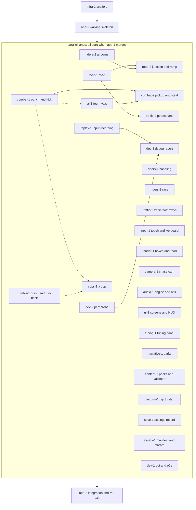

# Milestone 1: crude everything

> **In plain words.** Milestone 1 is the first build you can actually play on your phone. You race for about two minutes down a hand-made stretch of Keys coastal highway, against four box-shaped rivals, with traffic both ways, a cop, and pedestrians who dive clear. You can punch and kick. A kick lands only when you are close enough and your timing is right. You can crash, run back to your bike, and cross the finish line to see your place. Engine and hit sounds are generated in code, and a hidden tuning panel lets you change the feel mid-race. Everything is deliberately crude: boxes instead of models, one look, one road. This page is the build plan: 30 tasks. One setup lane lands first. Then seventeen lanes build in parallel, each in its own part of the code, each with tests a robot runs and a few plain things to try on the phone.

## How to read this plan

- The tags work as in [the product spec](../product-spec.md#how-to-read-this-spec):
  - `[decided]`: traces to a maintainer answer.
  - `[default]`: a proposal agents build as written, which the maintainer may change.
  - `[open]`: waits on the maintainer.
- A **lane** is one agent working in one area of the code, on its own branch `lane/<lane-id>/<topic>`, where `<lane-id>` is the module folder name ([engineering](../engineering.md#repo-layout)).
- Every task below lists six things:
  - **Owns**: the only paths the lane edits, plus its own unit tests beside the code and its own `changes/` note.
  - **Needs**: the interfaces and inputs it depends on.
  - **Builds**: what the task makes.
  - **Automated acceptance**: what CI checks: unit or sim tests, the bot playthrough and the perf probe.
  - **Phone check**: a few plain words on what the maintainer might try.
  - **Order**: when the task can start and what it waits for.
- Numbers are starting values for the tuning panel, not promises. They are collected in [Starting numbers](#starting-numbers).
- This plan follows [the roadmap](../roadmap.md). The module map and contracts come from [the architecture doc](../architecture.md), the gate and CI from [the engineering doc](../engineering.md), and the file formats from [the content-pack doc](../content-packs.md).

## Contents

- [What M1 delivers](#what-m1-delivers)
- [What M1 does not build](#what-m1-does-not-build)
- [Starting numbers](#starting-numbers)
- [The task graph](#the-task-graph)
- [Lane 0: the scaffold, then the walking skeleton](#lane-0-the-scaffold-then-the-walking-skeleton)
- [The parallel lanes](#the-parallel-lanes)
- [Simulation lanes](#simulation-lanes)
- [Presentation and control lanes](#presentation-and-control-lanes)
- [Data, runtime and QA lanes](#data-runtime-and-qa-lanes)
- [Integration and the exit pass](#integration-and-the-exit-pass)
- [Cross-lane rules for M1](#cross-lane-rules-for-m1)
- [M1 exit](#m1-exit)
- [If M1 runs long](#if-m1-runs-long)
- [Decisions M1 touches](#decisions-m1-touches)
- [Sources](#sources)

## What M1 delivers

**The approved list** [decided]. The maintainer approved this list on the blueprint page: "a curvy road with hills, your bike, 4 box rivals, traffic cars, touch and keyboard controls, auto-target attacks, crash and run-back, a finish line with placing, engine and hit sounds, the chase cam, a cop, and the tuning panel". The maintainer also decided that M1 is everything, equally crude, cops included. The controls follow the maintainer's answers:

- drag up for scaled throttle, sideways to steer, lift to coast;
- a brake button;
- one auto-target attack button: drag off it to pick a side, swipe down on it to kick;
- keyboard as important as touch.

**Coordinator additions** [default]. These were marked as the coordinator's defaults on the blueprint page, "to test the network and the jumps early":

- a ramp shortcut;
- one junction;
- pedestrians who dive clear;
- a "copy debug report" button.

**Added by this plan** [default], each with its reason:

- **A real range and timing window for hits and kicks.** In the look-lab sample a kick could land at any moment and always sent the rival flying. The maintainer flagged that for later polish. M1 builds the gate: wind-up, a short active moment, recovery, and a reach box. M2 polishes how it feels.
- **A crude hit-stop.** The tuning panel's hit-stop slider is decided for M1, and it needs something to tune. This moves a small piece of [the architecture doc's](../architecture.md#what-m1-builds-and-what-stays-a-seam) M2 hit-stop into M1. Takedown slow motion stays in M2.
- **Traffic both ways (an oncoming lane) and trucks as big hazards.** Both are decided for v1 traffic. Putting them in M1 follows the decision that M1 is everything, equally crude. Oncoming density has its own slider, so a playtest can turn it down.
- **Text-bubble barks for the four rivals.** M1 voices are text bubbles [decided], and a few lines test the personality pillar early.
- **Volume sliders and mute, and the left-handed mirror.** These follow [the product spec's landing order](../product-spec.md#v1-scope-and-launch-bar).
- **A frame-rate cap on the tuning panel** (full rate, half, a third: divisors of the measured refresh rate). The frame-rate priority is decided, smooth first with a battery saver at about 30 fps (cockpit answer, 2026-09-29), and the cap lets the maintainer feel the battery saver on the M1 build.
- **One pickup weapon and the timed steal.** This follows [the content-pack doc's M1 minimum](../content-packs.md#what-m1-needs). It is the first item to slip to M2 if needed.

**The workshop** [default], per the engineering and architecture docs:

- the gate;
- CI with auto-merge;
- the staging and game Spaces;
- input recording;
- the determinism self-test;
- the bot and the perf probe;
- the tap-to-start sequence;
- a plain menu.

**How M1 is built** [decided]:

- M1 is built by one big parallel orchestrated run, and the maintainer plays it when it lands. The run goes big, and it resumes from its journals after a usage limit.
- The run launches right after the repo is created (cockpit answer, 2026-09-29).
- Every lane emits machine-readable status (see [Cross-lane rules](#cross-lane-rules-for-m1)), so a maintainer-private progress view outside the repo can show the lanes and how each is doing.

**The real-road side quest** [decided]. A GIS lane starts alongside M1 and builds the real Overseas Highway (US 1 through the Florida Keys) from public data, in parallel and without blocking M1. It is planned as [gis-1 in M2.md](./M2.md#gis-1--the-real-overseas-highway-side-quest-running-since-m1) and is not one of the 30 tasks below. What M1 owes it is a shared format: the hand-built track is baked into exactly the format the GIS pipeline emits ([road-1](#road-1--a-curvy-road-with-hills-both-ways)). If the real road turns out to be fun, it replaces the hand-built track in M2: the maintainer rides both and picks, and the other stays as an alternative route (cockpit answer, 2026-09-29). Keys data is unprobed: the earlier probe covered CA-1 at Big Sur, not the Keys.

## What M1 does not build

Each of these has a later home in [the roadmap](../roadmap.md#where-each-v1-item-lands). M1 leaves its seam (a type, a field or an interface) where [the architecture doc](../architecture.md#what-m1-builds-and-what-stays-a-seam) says so.

- **Feel.** Takedowns and slow motion, the fuller tumble with traffic contacts, and haptics. Also gamepad, tilt, assists, the settings screen beyond volumes and the mirror, look-back and other cameras, the veto, and the what's-new card (all M2).
- **Look.** The chosen look, the zine overlay, zine menus, Keys scenery, animals and oddities, HUD presets, the layout editor, and movable buttons (M3).
- **Career.** Cash, the shop, bikes beyond the one, and busts with real fines. Also grudges, the three other named racers (Sgt. Pruitt is already the M1 cop), interludes, the save profile and export code, weird events, and radio (M4).
- **Launch polish.** Quality tiers, dynamic resolution, offline play, the name, and accessibility beyond the mirror (M5).

## Starting numbers

All of these are `[default]` tuning parameters: starting values for the panel, to be replaced by what feels right on the phone. Tick counts use the architecture doc's 60 Hz tick and its rounding rule, `ticks = max(1, round(seconds × 60))`. Conversions were computed by script.

| Parameter | Starting value | Ticks at 60 Hz | Where it comes from |
|---|---|---|---|
| M1 bike top speed | 85 mph = 38.0 m/s | | the product spec's slow starter bike |
| Oncoming car cruising speed | 55 mph = 24.6 m/s | | the product spec's fairness example |
| Reaction range (closing speed × 2 s) | (38.0 + 24.6) × 2 ≈ 125 m | | the product spec's fairness rule |
| Threat draw distance (traffic, riders, cop, hazards) | 200 m | | the architecture doc's `minThreatDrawM` |
| Traffic population window | ±400 m around each sim anchor | | this plan |
| Traffic density | 1 vehicle per 120 m of lane, each way (about 7 per direction in the window) | | this plan |
| Punch: wind-up / active / recovery | 0.12 / 0.08 / 0.25 s | 7 / 5 / 15 | this plan |
| Punch reach box | \|Δs\| ≤ 1.2 m, \|Δd\| ≤ 1.4 m | | this plan; stored as the `punch` entry's `reach` `{ sM: 1.2, dM: 1.4 }` ([weapon format](../content-packs.md#weapon)) |
| Kick: wind-up / active / recovery | 0.22 / 0.10 / 0.45 s | 13 / 6 / 27 | this plan |
| Kick cooldown after recovery | 0.5 s | 30 | this plan; stored as the `kick` entry's `cooldownS` |
| Kick reach box | \|Δs\| ≤ 1.0 m, \|Δd\| ≤ 1.7 m | | this plan; stored as the `kick` entry's `reach` `{ sM: 1.0, dM: 1.7 }` |
| Auto-target acquisition box | \|Δs\| ≤ 4 m, \|Δd\| ≤ 3 m | | this plan |
| Hit-stop on player-involved hits | 60 ms | 4 | the product spec's 40–80 ms range; stored as the weapon's `hitStopMs`, scaled by `combat.hitStopScale` |
| Pipe: wind-up / active / recovery | 0.34 / 0.10 / 0.42 s | 20 / 6 / 25 | the content-pack doc's example weapon |
| Pipe steal window, from the start of the wind-up | 0.12 – 0.34 s | ticks 7 – 20 | the content-pack doc's example weapon |
| Bust radius and dwell | 14 m for 1.0 s | 60 | the content-pack doc's example cop; the dwell is this plan's |
| Tumble at rest, or its timeout | under 0.5 m/s for 0.5 s, or 5 s | 30, or 300 | this plan. Tuned toward "the run-back starts fast" [decided]: shorten these first if crashes feel slow |
| Skip run-back delay | 3 s | 180 | the product spec. Also tuned toward a fast run-back |
| Attack side drag / kick swipe | 24 px sideways / 24 px down within 80 ms, or at least 45° below horizontal | | the architecture doc's `attackDragPx`, `kickSwipePx` and `kickSwipeMs` defaults. 80 ms is chosen so that a swipe always finishes before the punch wind-up (7 ticks, about 117 ms) ends, and [input-1](#input-1--touch-and-keyboard) adds a check for that |
| Race end timeout | 30 s after the player finishes or is busted | 1800 | this plan |
| Prize, and the cop's fine | from data: the event's `rewards.byPlaceCash` and the cop's `law.fineCash` | | [the content-pack doc](../content-packs.md) |
| Cop's speed | rides the base bike entry, scaled by the cop file's `law.pursuitSpeedScale` | | [the content-pack doc](../content-packs.md) |
| Remount | restores health to full | | this plan |
| Cop tuning parameters | `cops.spawnDelayS` and `cops.followGapM`, set so the cop does not shadow a crash. The bust radius (14 m) and dwell (1.0 s) are data on the cop (`law.bustRadiusM`, `law.bustDwellS`), scaled by `cops.bustRadiusScale` and `cops.bustDwellScale` (default 1.0) | | this plan |
| Bark bubble time | max(2 s, characters ÷ 15 per second), so 2.8 s for 42 characters | | the tone guide |
| Race route | about 3.5 km: roughly 110–120 s at 29–32 m/s average | | this plan |
| Race field | the player, 4 rivals and 1 cop | | [decided] (4 box rivals, a cop) |

## The task graph

- Solid arrows inside the box are hard dependencies: the later task needs the earlier one merged.
- Dashed arrows are soft ones: the later task starts at once and switches a feature on when the earlier one lands. For example, the cop chases from day one and becomes hittable when combat lands.
- `app-2` runs alongside everything as the integration lane, and closes M1 when every other task is merged.

## Lane 0: the scaffold, then the walking skeleton

Lane 0 is the lead agent. Its two tasks land in order, before any other lane merges. [default] That follows the architecture doc's rule that, [until the walking skeleton exists](../architecture.md#dependency-rules), one lane builds vertically across every module and owns the contracts.

### infra-1 · The scaffold (lands first)

- **Goal.** A real, nearly empty repo where the whole gate runs, work merges itself on green, and every branch push shows up on the staging Space.
  - [decided]: a public MIT repo, auto-merge on green checks, and hosting on a Hugging Face Space plus a staging Space.
  - [default]: the mechanics, which follow [the engineering doc](../engineering.md).
- **Owns:**
  - the repo root files: `package.json`, `package-lock.json`, `tsconfig*.json`, the ESLint, Prettier, Vite, Vitest and Playwright configs, `.npmrc`, `.nvmrc` and `.gitignore`;
  - `.github/workflows/`, `scripts/` and `space/`;
  - `README.md`, `LICENSE` (holder line "the throttlebrawl contributors"; `package.json` has no `author` field, per [the engineering doc](../engineering.md#repo-layout)), `THIRD_PARTY_ASSETS.md`, and `CLAUDE.md` importing the existing `AGENTS.md` (the first docs commit already holds a minimal `.gitignore` and `CLAUDE.md`, which infra-1 extends);
  - `index.html`, a placeholder `src/main.ts`, and its own `changes/` note.

  After infra-1, the root files, `.github/`, `scripts/` and `space/` stay with the infra lane (the lead agent, by default), as [the engineering doc](../engineering.md#parallel-agent-lanes) says. `index.html` and `src/main.ts` pass to app-1.
- **Needs:** the repo and both Spaces, which the maintainer approved on 2026-09-29 [decided]. They are created before infra-1 starts: the repo's first commit is these docs, after a one-off leak scan, and the Spaces stay empty until infra-1's first deploy. That first commit is an explicit allowlist (`docs/`, `AGENTS.md`, `CLAUDE.md` and a minimal `.gitignore`), staged path by path and never with `git add -A`, and `git ls-files` must print exactly those paths before the push ([details](../engineering.md#branch-protection-and-auto-merge)). The answers infra-1 used to ask for are settled [decided] (cockpit answers, 2026-09-29):
  - public commits use the GitHub no-reply address ([commit identity](../engineering.md#commit-identity)); it is set in user-level git config before the first docs commit (by the lead agent, not infra-1), and the real one is never written into the repo;
  - every green merge goes straight to the game Space;
  - each deploy mirrors the tracked source tree plus the prebuilt `dist/` to the Space (the maintainer's "Mirror repo to hf" note).

  What may still need the maintainer once is the one-time settings that come with creation, if they were not done then: the branch protection and repo settings from [the engineering doc](../engineering.md#branch-protection-and-auto-merge), the Trusted Publisher claims (or the `HF_TOKEN` secret) on both Spaces, the two repository variables `HF_SPACE_PROD` and `HF_SPACE_STAGING` (the full Space ids), and GitHub's "Keep my email addresses private" setting, which must be on before the first auto-merge because GitHub authors the squash commits ([commit identity](../engineering.md#commit-identity)). infra-1 does not arm auto-merge until the maintainer confirms that setting. The lane prepares everything locally first and asks for whatever is missing in one message.
- **Builds:**
  1. The toolchain, pinned as in [the engineering doc's table](../engineering.md#toolchain), with `three` pinned exactly.
  2. The npm scripts with their stable names from [the engineering doc](../engineering.md#npm-scripts), including `check`, which runs the whole gate and prints what each step examined.
  3. The TypeScript settings, plus the DOM-free configs for `src/sim/` and `src/road/`.
  4. ESLint rules:
     - the module map's allowed imports, as per-folder `no-restricted-imports` or `eslint-plugin-boundaries`, from [the architecture doc's graph](../architecture.md#module-map);
     - the determinism bans for `src/sim/**` and `src/road/**`.

     Because the folders are empty at this point, a **lint-rule test** runs ESLint on small snippets (a sim file importing `three`, `Math.random()` in the sim) and asserts that each is an error. That proves the rules fire, and keeps proving it.
  5. The leak scan, with its must-match and must-not-match self-test and the author and committer email check ([commit identity](../engineering.md#commit-identity)), plus `sizecheck`, `notes:check` and `changelog:build`.
  6. The Vite settings: `base: './'`, the explicit hosts and strict ports, and the injected `BUILD_ID`, `BUILD_CHANNEL` and `BUILD_BRANCH`.
  7. The two workflows from [the engineering doc's CI section](../engineering.md#ci-on-github-actions):
     - `ci.yml`: static, unit and browser jobs, then the single required `gate` check, then the production deploy and the release notes on pushes to `main`;
     - `staging.yml`: any other branch runs `leakscan:all` and `sizecheck`, builds, gets a boot smoke test and deploys to the staging Space.
  8. The Space README templates (`sdk: static`, `app_file: dist/index.html`, no `app_build_command`), `scripts/space-stage.mjs`, and the source-mirror deploy with `hf upload`: the tracked tree plus the prebuilt `dist/`, as one normal commit per deploy, to both Spaces, following [the deploy section](../engineering.md#deploy-game-space-and-staging-space).
  9. A hello page: `src/main.ts` makes a WebGL2 context, clears it to a colour and shows the build stamp, so the browser tests have something real to check.
  10. `npm run phone`, for the `adb reverse` route in [phone testing](../engineering.md#phone-testing).
- **Automated acceptance:**
  - `npm run check` is green locally and in CI, and every step prints a nonzero count of what it examined.
  - The gate is shown to go red once: a deliberately broken test makes `gate` fail, and reverting it makes it pass. The PR note records this.
  - The lint-rule tests show the boundary and determinism rules firing.
  - `leakscan:all` examines more than zero files and finds nothing. It also runs over `git log -p`, over the full history from the docs commit onward, in infra-1's first PR (the docs commit itself got a one-off scan before its push). [decided: a leak audit before going public]
  - The browser boot test passes: the page loads, a WebGL2 context exists, the renderer string is printed, there are no console errors, and the canvas is not blank.
  - The size budget holds: JavaScript at most 500 KB gzip, and the whole first load at most 3 MB.
  - The staging Space serves the build at its `*.hf.space` address from `app_file: dist/index.html`, and its stamp shows the branch and commit. The merge is confirmed by asking GitHub for the PR's state, not by an exit code.
  - If the served build does not boot from `app_file: dist/index.html` (blank canvas, 404s on `./assets/`, or the root serving the source `index.html`), the fallback layout from [the deploy section](../engineering.md#deploy-game-space-and-staging-space) is used instead: `dist/` contents at the Space root, source under `source/`.
  - After the first deploy the served build loads and the Space's file list shows no pointer-file artefacts. (`hf upload --delete "*"` never removes the Space's default `.gitattributes`, so the repo's own tracked `.gitattributes` replaces it.)
  - After infra-1 merges, `main`'s squash commit carries a no-reply author and committer (printed), and the `push`-to-`main` run of `static` checks `git log -1 --format='%ae %ce'`.
  - The Space's file list, read back after the upload, equals `git ls-files` at that commit (under `source/` in the fallback layout) plus the build: nothing from `scratch/`, `node_modules/` or any other git-ignored path. The stage script's printed file count matches.
  - A test commit with a non-allowlisted author email is refused by the `commit-msg` hook, so the interim email guard is shown to fire.
- **Phone check:** open the staging link. A coloured screen with a build number appears.
- **Order:** first. Nothing else merges before it.

### app-1 · The walking skeleton (lands second)

- **Goal.** One crude race, playable on the phone from start to finish. Every module exists behind its public `index.ts`, and the skeleton wires them all together. That way the parallel lanes fill modules in instead of wiring them. [default]
- **Keep it small.** Every lane waits for app-1, so it is the longest pole. It builds real code only for what a keyboard-driven race needs: the sim contract, the world store, one road, riders on it, the loop, boxes, a follow camera, a HUD and results. For the bot, the self-test, input recording, the asset manifest and the stream, and the content hashes, app-1 ships only the typed `index.ts` interface with a trivial body, and the owning lane ([dev-1](#dev-1--bot-and-browser-tests), [dev-2](#dev-2--perf-probe-and-budgets), [replay-1](#replay-1--input-recording), [assets-1](#assets-1--manifest-and-one-chunk-streaming), [content-1](#content-1--pack-loader-and-validator)) builds the real thing. [default]
- **Owns:** all of `src/`, `packs/base/`, `tools/` and `tests/` for the duration. It is the contract owner until it merges.
- **Needs:** infra-1.
- **Builds:**
  - **`core/`:** ids, deterministic math tables, a seeded random generator with the named streams (traffic, ai, combat, peds, cops, tumble, modifiers), an FNV-1a hash helper, version-header helpers, the touch-layout record type, and a `TuningParamDecl` type for tuning declarations.
  - **`sim/api.ts`:** the contract from [the architecture doc](../architecture.md#sim-contract-srcsimapits): `SimInput` (quantized), `SimSnapshot`, `SimEvent`, `SimConfig`, `createSim` and `hash()`. `SimEvent` adds `attackStart` and `attackMiss` to the architecture doc's list, which is a minimum. [default] Three more entries are part of the contract [default]:
    - `sim.applyParam(id, value)`, legal only between steps and taking effect on the next tick. The replay format records `{tick, id, value}`, and playback re-applies it before stepping that tick. This is how a mid-race tuning change reaches the sim ([tuning-1](#tuning-1--the-tuning-panel), [replay-1](#replay-1--input-recording)).
    - `SimConfig.difficulty`, the resolved scales `{ riderAggression, copFrequency, rubberBand }`, all 1.0 in M1 (that is Normal); the preset id is carried for display only. It is read by riders-3's rubber-band factor, ai-1 and cops-1. The Easy, Normal and Hard presets land in M2, which only adds the preset resolution in `buildSimConfig`, so no reader changes [decided for the presets in M2; default for the shape, per [the architecture doc](../architecture.md#sim-contract-srcsimapits)].
    - An aggregated list of the sim's tuning declarations, exported as data, so `app/` never imports a sim sub-folder ([Cross-lane rules](#cross-lane-rules-for-m1)).
  - **`sim/world/`:** an entity store iterated in ascending id order. One fixed order per tick [default]: controllers, riders, combat, cops, traffic, peds, tumble, race, modifiers (empty), then the event flush. The `timeScale` field. A stub `index.ts` for every sim sub-folder. Only the tick order and the registry API are contract. Each sim sub-folder keeps its own per-entity state as plain data (numbers, or typed arrays keyed by entity id; no closures and no class instances), so M2's race-state snapshots can serialize it. [default]
  - **`road/`:** three edges joined end to end by pass-through junctions, so no lane ever assumes "one edge, `s` from 0 to L". Gentle curves and one hill, one lane each way, the queries (`toWorld`, `frameAt`, `surfaceHeight`, `lanesAt`, `project`, and the neighbours across an edge end) and distance-to-finish. [default]
  - **`content/`:**
    - loads `packs/base` through a generated index;
    - Zod schemas for [the content-pack doc's M1 minimum](../content-packs.md#what-m1-needs);
    - a registry freeze and the two content hashes, as trivial bodies behind their interface (content-1 builds the real ones).
  - **`app/`:**
    - the loop from [the architecture doc](../architecture.md#fixed-timestep-and-the-loop): an accumulator, a 0.25 s clamp, a cap of 4 steps per frame, interpolation, and `pause()` and `resume()`. `platform/` owns every lifecycle listener (`visibilitychange`, `pagehide`, `fullscreenchange`) and emits `onHidden` and `onShown` callbacks, which `app/` only reacts to ([platform-1](#platform-1--tap-to-start-and-phone-hygiene));
    - a state machine: boot, tap to start, menu, race, results, back to the menu.
  - **Presentation and devices:**
    - `input/`: the keyboard (throttle, brake, steer, attack), a minimal touch layout, and latching;
    - `render/`: a road ribbon, the player and one rival as boxes, fog, and one placeholder look behind the look interface;
    - `camera/`: a simple follow camera;
    - `audio/`: the bus graph, and one engine tone that follows speed;
    - `ui/`: the start screen, a menu with a "Race" button, a HUD with speed and position, and results with placing.
  - **Runtime:**
    - `platform/`: the tap-to-start sequence;
    - `tuning/`: the registry and a panel stub with two sliders;
    - `save/`: a settings record with a version;
    - `replay/`: an interface for in-memory input recording, with a trivial body;
    - `assets/` and `stream/`: interfaces for a manifest with `procedural` and `baked` sources and a one-chunk stream, with trivial bodies.
  - **Dev and seams:**
    - `dev/`: `window.__game` (only behind the test flag), and interfaces for a `BotController` (a throttle-only stub that holds the throttle and steers along the route) and for the `?selftest=1` race;
    - `career/`: an empty seam.
  - **The composition root and the import contract PR.** `src/main.ts` is the composition root. It sits outside the module graph and may import `app/` and `dev/`. `main.ts` injects callbacks into `app/`, and `app/` passes them to `ui/`, `platform/`, `tuning/` and `assets/` as plain functions typed in `core/`. The callbacks are: `onCopyReport`, `resumeAudio`, `recordTuningChange`, `packIndex`, `rendererStats`, `roadQueries` (for the bot's route) and `getReplayAndSettings` (for the debug file). That keeps every import inside the architecture doc's allow-list, and lets `dev/` ship in production builds without any module importing it. [default]
- **Automated acceptance:**
  - A browser race, driven by the stub bot, reaches results with a placing at the phone-landscape viewport. Screenshots at the start, midway and at the finish are not blank.
  - The road's three edges are crossed at least twice in that race, with no NaN and a valid road position at every tick.
  - The lint-rule tests from infra-1 pass against the real folders, including the composition-root rule.
  - The first draw-call, triangle and frame-time numbers are stored in `tests/perf/` as the starting budget and baseline, with the renderer string.

  The 50-seeded-race batch, the replay-hash check and `?selftest=1` move to [dev-1](#dev-1--bot-and-browser-tests), [replay-1](#replay-1--input-recording) and [dev-2](#dev-2--perf-probe-and-budgets), which build the real bot, recorder and self-test.
- **Phone check:** on the staging link, tap to start, ride to the finish against one box, and see your place. Say how smooth it felt.
- **Order:** second. When it merges, the contract-PR rule starts ([Cross-lane rules](#cross-lane-rules-for-m1)) and every task below may start.

## The parallel lanes

Every lane below may start as soon as app-1 is on `main`. A few tasks inside a lane wait on another task, as each task's **Order** line says. There are seventeen lanes besides lane 0. The platform, save, replay and assets row covers four small folders, which one agent or up to four can take. Sizes are rough (S, M or L) and are only for spreading work across agents. [default]

| Lane | Branch | Owns | Tasks | Size |
|---|---|---|---|---|
| road | `lane/road/<topic>` | `src/road/`, `tools/road/`, `packs/base/regions/florida-keys/networks/`, `.../roads/`, `.../routes/` (except files prefixed `osm-`, which belong to the GIS side-quest lane) | road-1, road-2 | L |
| sim riders | `lane/sim/riders`, `lane/sim/race` | `src/sim/riders/`, `src/sim/race/`, `packs/base/bikes/`, `packs/base/events/`, the player preset in `packs/base/riders/` | riders-1, riders-2, riders-3 | L |
| sim combat | `lane/sim/combat` | `src/sim/combat/`, `packs/base/weapons/` | combat-1, combat-2 | M |
| sim ai | `lane/sim/ai` | `src/sim/ai/`, the four rival files in `packs/base/riders/` | ai-1 | M |
| sim traffic | `lane/sim/traffic`, `lane/sim/peds` | `src/sim/traffic/`, `src/sim/peds/`, `packs/base/traffic/`, `packs/base/regions/florida-keys/region.json` | traffic-1, traffic-2 | M |
| sim cops | `lane/sim/cops` | `src/sim/cops/`, the cop file in `packs/base/riders/`, `packs/base/crews/` | cops-1 | S |
| sim tumble | `lane/sim/tumble` | `src/sim/tumble/` (including the on-foot run-back) | tumble-1 | M |
| input | `lane/input/<topic>` | `src/input/` | input-1 | M |
| render | `lane/render/<topic>` | `src/render/` | render-1 | L |
| camera | `lane/camera/<topic>` | `src/camera/` | camera-1 | S |
| audio | `lane/audio/<topic>` | `src/audio/` | audio-1 | M |
| ui | `lane/ui/<topic>` | `src/ui/` except `src/ui/tuning/` and `src/ui/narrative/`, plus `packs/base/hud/` | ui-1 | M |
| tuning | `lane/tuning/<topic>` | `src/tuning/`, `src/ui/tuning/`, `packs/base/tuning/` | tuning-1 | S |
| narrative | `lane/ui/narrative` | `src/ui/narrative/`, `packs/base/barks/` | narrative-1 | S |
| content | `lane/content/<topic>` | `src/content/` (its `schema/` folder is a contract), `tools/packs/`, `packs/base/pack.json` | content-1 | M |
| platform, save, replay, assets | `lane/platform/…`, `lane/save/…`, `lane/replay/…`, `lane/assets/…` | `src/platform/`, `src/save/`, `src/replay/`, `src/assets/`, `src/stream/` | platform-1, save-1, replay-1, assets-1 | S each |
| dev | `lane/dev/<topic>` | `src/dev/`, the `tests/e2e/` harness and `tests/e2e/bot-race.spec.ts`, `tests/sim/batch.ts` (the shared seeded-race batch), `tests/perf/` | dev-1, dev-2, dev-3 | M |
| app (lane 0) | `lane/app/<topic>` | `src/app/`, `src/main.ts`, `index.html`, and the contract files `src/core/`, `src/sim/api.ts`, `src/sim/world/` | app-2 | S, continuous |
| infra (lane 0) | `lane/infra/<topic>` | the repo root files, `.github/`, `scripts/`, `space/`; dependency PRs | after infra-1: as needed | S, continuous |

## Simulation lanes

### road-1 · A curvy road with hills, both ways

- **Goal.** The M1 track: about 3.5 km of hand-made, Keys-flavoured coastal highway with bridges and causeways, real bends, and hills from bridge humps. It has one lane each way plus shoulders, so a race lasts about two minutes.
  - [decided]: a curvy road with hills, and track 1 is a coastal highway.
  - [decided]: the hand-built track is baked into exactly the format the GIS pipeline emits (the same `json-columns` profile tables, networks and routes; see [the road format](../content-packs.md#road-networks-roads-and-routes)). The real Overseas Highway can then replace it in M2 by a data switch.
  - [default]: the length and the layout. The Keys are nearly flat, so the hills are exaggerated bridge humps.
- **Owns:** `src/road/`, `tools/road/` (the road compiler), and `packs/base/regions/florida-keys/networks/`, `roads/` and `routes/`.
- **Needs:**
  - `core/math`;
  - [the baked road format](../content-packs.md#road-networks-roads-and-routes);
  - [the coordinate rules](../architecture.md#coordinates).
- **Builds:**
  - Catmull-Rom control points, turned by the compiler into baked `json-columns` samples at 2 m (`x`, `y`, `z`, `kappa`, `grade`, `bankRad`), computed with `core/math` so every engine reads the same numbers.
  - Lane sections: `L1` (oncoming, direction −1), `R1` (direction +1) and shoulders.
  - A helper for the curved-road kinematics (`1 − kappa·d`, clamped) that the riders lane uses.
  - The main road as three edges joined by pass-through junctions, with junction transfer at each edge end (overshoot distance carries into the next edge, and `d` maps through the lane table) and the `nextEdges` and neighbour queries. This is here, not in road-2, because six lanes start in parallel and must not assume a single edge.
  - Features: bridge humps, three or four `roadsideZone` stretches for pedestrians, and a `copSpawn`.
  - The route, with a start grid, a finish and checkpoints.
  - The road lint rules as a module, `src/road/validate.ts`, which the content lane's validator calls.
- **Automated acceptance:**
  - Unit tests:
    - `toWorld` and `project` round-trip within 1 cm on straights and bends;
    - a right-hand bend has positive `kappa`;
    - on a bend, movers inside and outside at the same speed gain the same `s` (the `1 − kappa·d` rule);
    - an oncoming mover travels toward decreasing `s`.
  - Road lint: the sample count and spacing rule, `|kappa|·dMax < 0.5`, features inside the road, and ends within 0.5 m of their junctions. Each rule has a failing fixture.
  - The lint runs on any file in the baked format, so the GIS lane's output goes through the same rules. A fixture in the GIS output shape (a stretch with a `provenance` block) passes the lint and loads as a route.
  - Movers cross a pass-through junction without losing or doubling distance, and the mover lanes' scripted tests (riders-1, traffic-1, ai-1, tumble-1, riders-3) each cross at least one edge boundary.
  - A sim test prints how long the bot takes on the route, and fails outside 60–240 s.
- **Phone check:** the road bends and rises over the bridge humps. You can see oncoming cars in the other lane.
- **Order:** starts when app-1 merges. road-2 and traffic-2 build on it.

### road-2 · One junction and the ramp shortcut

- **Goal.** Prove the road network early. A short shortcut road splits off at a junction, jumps a ramp and rejoins.
  - [default]: this is a coordinator addition to M1.
  - [decided]: one connected road network, and jumps and ramps in v1 with one ramp shortcut.
- **Owns:** the same paths as road-1.
- **Needs:** road-1, and riders-2 for the flight itself.
- **Builds:**
  - Connector edges at the split and the merge, generated by the compiler, for both directions: oncoming (`L1`) connectors as well as driving-direction ones. Junction transfer itself is already built in road-1.
  - A split zone where the rider's lateral position picks the connector, with no button press.
  - The shortcut road, with a `shortcut` lane and a ramp lip baked into its elevation.
  - A rejoin junction, the route's allowed-road set, and distance-to-finish across both paths.
  - The jump-curvature lint.
  - A rule for traffic: vehicles never route onto `shortcut` lanes, and at junctions they take only `drive`-lane connectors ([traffic-1](#traffic-1--traffic-both-ways)).
- **Automated acceptance:**
  - Sim unit tests:
    - a mover inside the split zone takes the connector, and one outside it stays on the main road;
    - no distance is lost or doubled at a transfer;
    - race progress never decreases along either path;
    - the shortcut is shorter by distance-to-finish;
    - the jump lint fails on a fixture ramp placed on a bend.
  - The browser bot takes the shortcut once (dev-1 switches on that assertion).
- **Phone check:** aim for the shortcut, hit the ramp, fly, land and gain time. Missing it is fine too.
- **Order:** after road-1. The jump works once riders-2 is merged.

### riders-1 · Bike handling

- **Goal.** Arcade but weighty handling for the one M1 bike.
  - [decided]: arcade but weighty handling, and your bike.
  - [default]: the model.
- **Owns:** `src/sim/riders/`, `packs/base/bikes/`, and the player preset in `packs/base/riders/`.
- **Needs:** the road queries and `SimInput`.
- **Builds:**
  - The riding model:
    - scaled throttle, brake, coasting drag and the effect of grade;
    - steering as a turn rate on `yaw`, and lean derived from sideways acceleration;
    - the signs flipped for riding the wrong way (`dir −1`).
  - The shoulder and barrier rules: a wobble or a crash, depending on speed and angle. A crash emits a `crash` event for tumble-1.
  - One bike file: the slow starter at about 85 mph (38.0 m/s) top speed [default], and a speed scale on the tuning panel.
- **Automated acceptance:** unit tests that check:
  - full throttle on the flat converges to top speed;
  - letting go slows the bike;
  - braking from top speed stops within a bounded distance;
  - steering can't push past the shoulder without a wobble or crash event;
  - there is no NaN at zero speed or across a junction transfer;
  - 600 ticks of scripted input give the same hash every run.
- **Phone check:**
  - Speeding up feels gradual but strong, and letting go coasts.
  - The bike leans into turns.
  - You can thread between cars.
- **Order:** as soon as app-1 merges.

### riders-2 · Jumps and airtime

- **Goal.** Take off at a ramp lip, fly and land. [decided]: jumps and ramps in v1. [default]: the rules follow [the architecture doc](../architecture.md#jumps-ramps-and-airtime).
- **Owns:** `src/sim/riders/`, the same lane as riders-1.
- **Needs:** a fixture road with a ramp. road-2 brings the real one.
- **Builds:**
  - The switch to `Airborne` when the ballistic height is above the surface on the next tick.
  - An absolute height and vertical speed while airborne, with `h` reported above the road.
  - Landing quality: clean, wobble or crash.
  - `jump` and `land` events, which M2's style cash reads for airtime.
- **Automated acceptance:** unit tests that check:
  - take-off happens at the lip, with a `jump` event, and landing emits `land`;
  - `h` never goes negative in flight;
  - a straight landing is clean, while a landing with high sideways speed wobbles or crashes;
  - a scripted jump gives the same hash every run.
- **Phone check:** the bike flies off the ramp and lands believably.
- **Order:** any time after app-1. road-2's jump needs it.

### riders-3 · Race: grid, placing and finish

- **Goal.** A race with a start, live positions and a finish line with placing. [decided]
- **Owns:** `src/sim/race/` and `packs/base/events/`.
- **Needs:** road-1's route and distance-to-finish.
- **Builds:**
  - The start grid from the route.
  - Progress from distance-to-finish, positions every tick, and a `finish` event per rider.
  - Race end: the player has finished, and everyone else has finished or the race-end timeout has passed (30 s, [Starting numbers](#starting-numbers)).
  - The slight rubber-band factor that the AI reads, scaled by `SimConfig.difficulty.rubberBand` (1.0 in M1; Easy and Hard land in M2). [decided: "arcade fair, slight rubberband"]
  - One `classic-race` event with one length, one required objective (finish), and prize money that the results screen shows, read from the event's `rewards.byPlaceCash`. There is no cash ledger until M4.
  - Style-cash events are already emitted by the lanes that own them (`nearMiss`, `jump` and `land`, `weaponGrab`), so M2 can score style without touching M1's sim. Nothing scores them in M1.
  - A bust from cops-1 ends the race for the player.
  - [default] (as built) Riders still running when the race-end timeout passes are classified by position as finished (their `finish` event carries `classified: true`), and riders in a tumble or on foot at that moment end `down`, so every racer ends finished, down or busted. The law never races or takes a place. A racer passing each of the route's checkpoints emits `lapOrCheckpoint`. The rubber band is `1 + k·clamp(gap ÷ range, −1, 1)` around the nearest racing player, with `k` = the tuning key `race.rubberBandStrength` (0.06, ai-1's interim value) × `difficulty.rubberBand` and `range` = `race.rubberBandRangeM` (150 m); the AI reads it with `rubberBandFactor(world, id)` from `src/sim/race/`. The event's `field.rubberband` is not wired into `SimConfig` yet.
- **Automated acceptance:** sim tests that check:
  - the placing order matches progress at every checkpoint;
  - every rider ends as finished, down or busted;
  - the race always ends;
  - the rubber-band factor stays within its bounds.

  dev-1's browser test checks that a placing is shown.
- **Phone check:** positions update as you pass people, the finish is obvious, and you see your place.
- **Order:** as soon as app-1 merges.

### combat-1 · Punch and kick with real timing windows

- **Goal.** Auto-target attacks that land only when the target is in reach during the attack's short active moment, so a kick that sends a rival flying is earned.
  - [decided]: one auto-target attack button, dragging off it to pick a side, swiping down to kick, and health-only damage.
  - [default]: the windows and the numbers.
- **Owns:** `src/sim/combat/` and `packs/base/weapons/` (`punch` and `kick`, which are weapon entries like any other).
- **Needs:**
  - the `SimInput` attack flags;
  - rider snapshot fields;
  - tumble-1's crash entry for a rider knocked off at zero health.
- **Builds:**
  - **Attack phases.** Each rider has an attack state: idle, wind-up, active, recovery, and, for the kick, a cooldown. The durations come from the weapon data ([Starting numbers](#starting-numbers)) and are counted in scaled time (see the timer rule in [Cross-lane rules](#cross-lane-rules-for-m1)), so M2's slow motion needs no rewrite.
  - **Auto-target.** On `attack`, pick the nearest valid rider inside the acquisition box.
    - Prefer a non-cop, unless the side override points at the cop. [default, from the product spec]
    - The side is the sign of Δd. The side flags can override it during the wind-up.
    - A `kick` flag during the wind-up turns it into a kick, which starts the kick's wind-up.
    - With nobody in the box, you swing at air.
  - **The hit test.** It runs only during the active phase, against that attack's reach box on the chosen side. Nobody there means an `attackMiss` event.
  - **A landed hit:**
    - damage to health and a short stagger;
    - sideways knockback, stronger for a kick;
    - at zero health the target is knocked off, with a `crash` event whose `causeId` is the hit.
  - **Presses and repeats:**
    - one hit per attack;
    - presses during wind-up or recovery are ignored;
    - a kick requested during its cooldown becomes a punch, so the button never feels dead.
  - **Crude hit-stop.** A landed hit that involves the player sets `timeScale` to 0 for the weapon's `hitStopMs` × `combat.hitStopScale` (60 ms × 1.0 = 4 ticks by default, counted on raw ticks, because a countdown scaled by a zero `timeScale` would never end). Inputs are still sampled during it. Rival-against-rival hits get no hit-stop. [default]
  - **Events:** `attackStart`, `hit`, `kick` and `attackMiss`, each with its `causeId`.
- **Automated acceptance:** sim unit tests:
  1. A kick with the rival 3 m to the side produces an `attackMiss`, and no knockback.
  2. A kick with the rival 1.2 m alongside lands exactly one hit, during the active phase, and the rival's sideways speed rises.
  3. A rival who brakes out of reach during the wind-up is missed.
  4. Mashing kick 20 times in one second lands no more kicks than the phase timing allows, which is at most one per kick cycle.
  5. A drag flips the side during the wind-up, but not once the active phase has started.
  6. With a cop and a rival both in reach, the rival is targeted. With the side override pointing at the cop, the cop is.
  7. Health reaching zero knocks the rider off, with a `crash` event caused by the hit.
  8. After a player-involved hit, positions don't move for 4 ticks while inputs are still recorded.
  9. A scripted fight gives the same hash every run.
  10. At `timeScale` 0.5 a punch wind-up takes 14 ticks, and the hit-stop still ends after 4 raw ticks.

  dev-1's browser test checks that at least one attack connects in the seeded race.
- **Phone check:**
  - A quick tap punches at once.
  - A kick lands only when you're right alongside, and mashing doesn't launch everyone.
  - A kick that lands visibly shoves the rival.
- **Order:** as soon as app-1 merges.

### combat-2 · One pickup weapon and the steal

- **Goal.** One roadside pipe you can pick up and swing, and the timed snatch: press attack while an opponent's weapon is winding up or held out.
  - [decided]: the weapon list, and the snatch on the wind-up. The 3DO manual (1994) says "To Grab Weapon: C (when opponent is holding it out)".
  - [default]: one weapon in M1.
- **Owns:** `src/sim/combat/` and `packs/base/weapons/lead-pipe.json`.
- **Needs:** combat-1, and ai-1 for a rival who swings.
- **Builds:**
  - Picking up the pipe, and the held-weapon swing (20 / 6 / 25 ticks).
  - The steal window, ticks 7–20 of the opponent's wind-up, and a `weaponGrab` event.
  - Dropping the weapon on a wreck.
  - The telegraph cues as events: render-1 shows a glint and audio-1 plays a cue.
- **Automated acceptance:** unit tests that check:
  - attack pressed at ticks 7–20 of an opponent's swing grabs the weapon;
  - at tick 3 or tick 22 it's a normal punch;
  - a grab moves the weapon exactly once;
  - a dropped weapon can be picked up again.

  content-1's lint checks that the steal window sits inside the wind-up, in ticks.
- **Phone check:** you can snatch a rival's pipe if you time it, and the glint tells you when.
- **Order:** after combat-1 and ai-1. It is the first item to slip to M2 ([If M1 runs long](#if-m1-runs-long)).

### ai-1 · Four box rivals

- **Goal.** Four rivals who race you and pick fights.
  - [decided]: 4 box rivals, and rival-vs-rival fights in v1.
  - [default]: their M1 behaviour, and that they carry the four regulars' names: Deacon Vane, Dial-Up, Chad Speedwell and Kevin from Accounting.
- **Owns:** `src/sim/ai/` and the four rival files in `packs/base/riders/`.
- **Needs:**
  - riders-1;
  - riders-3's rubber-band factor;
  - combat-1's attack flags. Rivals drive through `SimInput` exactly like the player.
- **Builds:** an `AIController` inside the sim that:
  - follows the route, with a target lane and a target speed from the event's `field.paceMps` ([the event format](../content-packs.md#event)) plus the rubber-band factor, which `SimConfig.difficulty.rubberBand` scales (pace comes from the event, not the bike, as the product spec proposes);
  - avoids traffic ahead crudely, by changing lane or braking;
  - attacks whoever is in its reach window, the player or another rival;
  - uses two named style presets from [the rider format](../content-packs.md#rider-rivals-cops-player-presets), `heavy-hitter` and `racer`, with a rider's own `personality` numbers overriding them.
- **Automated acceptance:**
  - In 50 seeded races, every rival finishes or ends down or busted, and none is ever stuck with no progress for 10 s while not down.
  - The batch prints how many hits rivals landed on the player, and fails at zero.
  - The batch prints the gap from first to last at the finish.
  - A scripted race gives the same hash every run.
- **Phone check:**
  - Rivals ride near you and pick fights.
  - They don't all pile into the same car.
  - Someone is always close.
- **Order:** as soon as app-1 merges. Attacks switch on when combat-1 lands.

### traffic-1 · Traffic both ways

- **Goal.** Cars and trucks in both directions, readable and fair.
  - [decided]: "traffic cars" in the approved M1, and v1 traffic with cars, trucks and an oncoming lane.
  - [default]: trucks and the oncoming lane in M1.
- **Owns:** `src/sim/traffic/`, `packs/base/traffic/` and `packs/base/regions/florida-keys/region.json`.
  - `packs/base/traffic/` holds `traffic-type` entries for size, speed, behaviour flags and whether hitting one crashes you. [The architecture doc](../architecture.md#movers-on-the-network) makes vehicle types content, and [the content-pack doc](../content-packs.md#traffic-type) defines the schema; the schema code lands in a small contract PR.
- **Needs:** road lanes, and the sim anchors.
- **Builds:**
  - Intelligent-Driver-Model car-following in each lane, both ways, so cars brake behind a stopped rider or a crash for free.
  - Population and recycling:
    - deterministic, within the population window around the sim anchors;
    - vehicles spawn only beyond reaction range (closing speed × 2 s, about 125 m at M1 speeds) [default, the product spec's fairness rule];
    - rare seeded lane changes.
  - Route choice at junctions: vehicles never route onto `shortcut` lanes, and take only `drive`-lane connectors, in both directions ([road-2](#road-2--one-junction-and-the-ramp-shortcut)).
  - Density sliders for each direction, so oncoming traffic can go to zero.
  - Contact rules:
    - a first contact wobbles you, and you crash only if you are already unstable;
    - trucks are big: hitting one crashes you.
  - `nearMiss` events.
- **Automated acceptance:** sim tests that check:
  - no two vehicles overlap in a lane;
  - a car stops behind a stopped obstacle without touching it;
  - no vehicle ever spawns inside reaction range of a sim anchor;
  - oncoming vehicles move toward decreasing `s`;
  - in the shared 50-race batch, no vehicle ever enters a shortcut edge;
  - a scripted close pass fires a `nearMiss`;
  - a scripted run gives the same hash every run.

  dev-2's perf gate checks vehicle draw calls.
- **Phone check:**
  - You can read oncoming cars in time.
  - Weaving through traffic feels fair.
  - Hitting a truck hurts.
- **Order:** as soon as app-1 merges.

### traffic-2 · Pedestrians

- **Goal.** People at the roadside who dive clear, cartoonishly.
  - [decided]: they dive away cartoonishly, there is no gore, and hitting something big crashes you.
  - [default]: pedestrians in M1, a coordinator addition.
- **Owns:** `src/sim/peds/`. The pedestrian kinds go in `region.json`, which is the same lane.
- **Needs:** road-1's `roadsideZone` features, or a fixture road.
- **Builds:**
  - Spawns from roadside zones; pedestrians cross or loiter.
  - A threat range that grows with the rider's speed and triggers a dive: a short scripted arc to the side.
  - `pedDive` events.
  - A small animal, such as a chicken, is optional.
- **Automated acceptance:**
  - Across 50 seeded races, riders and pedestrians never make contact.
  - Every threatened pedestrian produces a `pedDive`.
  - A scripted run gives the same hash every run.
- **Phone check:** people dive out of the way, comically, and nobody gets hurt.
- **Order:** after road-1. It is the third item to slip to M2 if needed.

### cops-1 · A cop

- **Goal.** One cop who chases you, can be hit like any rider, and busts you if you go down near him.
  - [decided]: a cop in M1, classic chase and bust, and "you should be able to treat them like other riders".
  - [default]: the crude bust, and that the M1 cop is Sgt. Pruitt, a county deputy under a parody agency name. That follows the law mix: real agency structure (county deputies, state troopers, maybe marine patrol) under parody names, plus fully parody forces. The maintainer said "maybe a mix of all".
- **Owns:** `src/sim/cops/`, `packs/base/riders/sgt-pruitt.json`, and `packs/base/crews/` for the law agency. The agency name is a parody name ([the law mix](../tone-guide.md#region-1-the-florida-keys-and-a1a-v1)).
- **Needs:**
  - riders-1;
  - combat-1, so the cop can be hit;
  - tumble-1, for the "down" state.
- **Builds:**
  - A rider with the `law` faction, spawned from the `copSpawn` feature after the start (one cop per race). He rides the base bike entry, scaled by `law.pursuitSpeedScale`.
  - The chase: the cop targets the player, or whoever caused chaos nearby. [default] A follow gap (`cops.followGapM`) and a spawn delay (`cops.spawnDelayS`) keep him from shadowing every crash, so a playtest does not end in "Busted" most of the time.
  - The crude bust. If the player is down within the cop's `law.bustRadiusM` (14 m) for its `law.bustDwellS` (1 s), each times its `cops.*Scale` tuning key:
    - a `bust` event fires;
    - the race ends for the player;
    - the results screen shows "Busted" and the cop's fine, read from `law.fineCash`. There is no cash ledger until M4.
  - Cop frequency reads `SimConfig.difficulty.copFrequency` (1.0 in M1; the presets land in M2).
  - A siren cue event for audio-1.
- **Automated acceptance:** sim tests that check:
  - a bust fires when you are down inside the radius for the full dwell;
  - no bust fires outside the radius, or for a shorter time;
  - a knocked-down cop can't bust anyone until he is back up;
  - in the shared 50-race batch the player-bust rate is printed, and fails above 30% [default];
  - a scripted chase gives the same hash every run.
- **Phone check:**
  - The siren tells you he's coming.
  - You can knock him down.
  - Go down near him and you're busted.
- **Order:** as soon as app-1 merges. He becomes hittable when combat-1 lands, and the bust works when tumble-1 lands.

### tumble-1 · Crash and run-back

- **Goal.** Crashes that are funny and never leave you stuck, then running back to the bike, or skipping the run.
  - [decided]: run back to the bike, skippable.
  - [decided]: crashes are big and funny, recovery is quick, and it is never gory or lingering. The rest of the crash tone (riders going over a bridge rail, the funny splash, a time penalty and a respawn on the bridge, and knocked-off rivals who get up and shake a fist) is scheduled for M2 ([the roadmap](../roadmap.md#m2--feel-pass)). The M1 barrier-only tumble keeps riders on the bridge until then.
  - [default]: real physics only for crash tumbles, crude in M1. The 5 s timeout and the 3 s skip are starting values, to be tuned toward "the run-back starts fast".
- **Owns:** `src/sim/tumble/`, including the `OnFoot` run-back.
- **Needs:**
  - road `project` and `surfaceHeight`;
  - crash events from riders-1, combat-1 and traffic-1.
- **Builds:**
  - [The architecture doc's crude tumble](../architecture.md#crash-tumble): one world-space body each for the rider and the bike, colliding with the ground and the barriers only.
  - Rest detection (under 0.5 m/s for 30 ticks) or a 5 s timeout, then the hand-back:
    - the bike is parked on the nearest drivable spot;
    - the rider runs to it on foot, steered by the player so traffic can be dodged, and remounts.
  - `skipRunBack` remounts after 3 s. A remount restores health to full.
- **Automated acceptance:**
  - In 50 seeded races, every crash hands back within the timeout plus the run.
  - After hand-back, the rider and the bike sit inside the drivable width.
  - A skip remounts after exactly 180 ticks.
  - There is no NaN during a tumble, and a scripted crash gives the same hash every run.
- **Phone check:**
  - Crashes look silly, not gory.
  - You're never stuck.
  - Running back and skipping both work.
- **Order:** as soon as app-1 merges.

## Presentation and control lanes

### input-1 · Touch and keyboard

- **Goal.** Two-thumb landscape touch controls, and a keyboard that is just as good.
  - [decided]:
    - drag up for scaled throttle, sideways to steer, lift to coast;
    - a brake button;
    - one attack button: drag off it for the side, swipe down on it to kick;
    - the keyboard as important as touch;
    - a left-handed mirror.
  - [default]: the floating stick and the thresholds.
- **Owns:** `src/input/`, and its own browser specs `tests/e2e/input-*.spec.ts`.
- **Needs:** `SimInput`, and the layout record type in `core/`.
- **Builds:**
  - **The floating stick.** It appears where the left thumb lands, anywhere in the left 40% of the screen. Touches within 24 px of the edge are ignored, because the phone's back gesture takes them.
  - **The brake button.**
  - **The attack button:**
    - `attack` is set on touch-down, with the auto-target side;
    - a sideways drag beyond 24 px sets a side flag;
    - a downward swipe sets `kick` ([Starting numbers](#starting-numbers)). The swipe window plus one tick must stay shorter than the punch wind-up, and so must the side-drag threshold time, or a real kick would sometimes arrive after the punch is already active and come out as a punch. A unit invariant checks this against the weapon data, and content-1's lint can reuse it;
    - a tap while on foot skips the run-back.
  - **Pointer handling:** Pointer Events tracked by `pointerId`, pointer capture, `pointercancel` treated like a release, and `touch-action: none`.
  - **Latching,** so a tap shorter than one tick is never lost.
  - **The keyboard map** from [the product spec](../product-spec.md#keyboard-equal-priority). The cruise key stays reserved.
  - **The left-handed mirror,** read from the layout record.
  - **Tilt** as a seam only.
- **Automated acceptance:**
  - Unit tests:
    - a tap sets `attack` on the next sampled tick, exactly once;
    - a 30 px drag to the right sets `attackSideRight`;
    - a 30 px swipe down in 70 ms sets `kick`, while a slow 30 px drag down over 300 ms does not;
    - a swipe that takes 100 ms does not convert, and the invariant above holds for the shipped values;
    - a `pointercancel` releases the throttle;
    - the mirrored layout swaps the zones.
  - Browser device-path specs:
    - pointer events dispatched on the touch overlay produce the expected `SimInput`, including a swipe-down kick;
    - key presses do the same.
- **Phone check:**
  - The stick appears under your thumb.
  - There are no accidental back gestures in fullscreen. Whether Chrome's fullscreen needs a double swipe is *(unverified)*, so check it.
  - A quick tap always punches, and swiping down kicks.
  - Nothing lags.
- **Order:** as soon as app-1 merges.

### render-1 · Boxes, road and a placeholder look

- **Goal.** A crude world that reads at speed: the road, water, rails, boxy riders, cars, trucks, the cop and pedestrians.
  - [decided]: Three.js, and the look is chosen after M1.
  - [default]: the placeholder look.
- **Owns:** `src/render/`.
- **Needs:** the snapshot fields, the road profiles, and the skeleton's look interface.
- **Builds:**
  - **The road:** a mesh from the profiles, dashes and posts for a sense of speed, a water plane and bridge rails.
  - **Entity views** built from primitives:
    - a rider on a bike that leans, shows its attack pose from the attack phase, and wobbles;
    - instanced car and truck boxes;
    - the cop with a flashing light bar;
    - pedestrians with a dive pose;
    - the ramp.
  - **One placeholder look:** flat-shaded low-poly. It is not a style pick; it was chosen because it reads well at speed. [default]
  - **Rendering rules:**
    - interpolation between snapshots;
    - threats drawn out to 200 m, with fog only beyond that;
    - a device-pixel-ratio cap of 1.5;
    - a crude handler for a lost WebGL context.
  - **Cues:** the steal glint for combat-2.
- **Automated acceptance:**
  - Browser screenshots are not blank.
  - The perf hard gate holds at fixed checkpoints: at most 120 draw calls and 150 k triangles, the architecture doc's starting budgets.
  - A unit test checks that the view pool matches the live entity count after spawns and despawns.
  - A browser test that forces a context loss sees the scene come back.
- **Phone check:**
  - You can tell rivals, the cop, cars and trucks apart at a glance.
  - The humps are visible.
  - Nothing flickers.
- **Order:** as soon as app-1 merges. Views are added as each entity kind lands.

### camera-1 · The low chase cam

- **Goal.** The low chase cam [decided]: steady and readable.
- **Owns:** `src/camera/`.
- **Needs:** the interpolated snapshot and the road frame.
- **Builds:** from [the architecture doc's camera section](../architecture.md#camera):
  - a critically damped spring aimed at a look-ahead point on the road;
  - roll at 20–40% of the bike's lean;
  - a field-of-view kick with speed;
  - a framing bias toward the auto-target;
  - event shake, scaled by `camera.shakeScale`.
- **Automated acceptance:** unit tests that check:
  - a step change settles without overshoot;
  - there is no NaN at zero speed or across the junction;
  - the camera reads only snapshot and road data (the lint rule enforces this).
- **Phone check:**
  - The camera sits low and steady.
  - You can see a rival alongside.
  - Nothing makes you queasy.
- **Order:** as soon as app-1 merges.

### audio-1 · Engine and hit sounds

- **Goal.** Engine and hit sounds made in code, loud where it counts.
  - [decided]: the engine is synthesized in code first, and M1 and M2 keep a single original score.
  - [default]: the rest.
- **Owns:** `src/audio/`, and its own browser specs `tests/e2e/audio-*.spec.ts`.
- **Needs:** snapshot rpm and throttle, the M1 events, and the settings volumes.
- **Builds:**
  - The four buses (master, music, effects, voices) with a light limiter.
  - The synthesized engine, driven by the bike's engine profile:
    - rich upper harmonics, because phone speakers drop the low end;
    - other riders at lower cost, with distance and Doppler.
  - Synthesized cues: punch, kick, hit, miss and crash, with hit sounds landing on the hit-stop tick.
  - Telegraphs: a horn from oncoming traffic, and the cop's siren.
  - A crude original music loop.
  - A cap on the number of voices.
- **Automated acceptance:**
  - A unit test checks that every M1 event type that should make a sound has a cue.
  - The bus gains follow the settings.
  - A browser test renders the engine patch offline and checks that it isn't silent and has energy above 300 Hz.
- **Phone check:**
  - The engine pitch follows your speed and is audible on the phone speaker.
  - Hits sound meaty.
  - You hear the oncoming horns and the siren.
- **Order:** as soon as app-1 merges.

### ui-1 · Screens, HUD and touch visuals

- **Goal.** Everything a player sees around the race.
  - [decided]: menus are fine, and M1 starts races from menus only.
  - [default]: the layout.
- **Owns:** `src/ui/` except `src/ui/tuning/` and `src/ui/narrative/`, `packs/base/hud/` (one `classic` layout), and its own browser specs `tests/e2e/ui-*.spec.ts`.
- **Needs:** the snapshot, the settings record, and the layout record.
- **Builds:**
  - **The start screen:** "tap to start", plus a small card showing the controls.
  - **The menu:** Race, and Settings with four volume sliders, mute and the left-handed mirror. The build id sits in the footer.
  - **The HUD:** speed, position, your health, and the health of whoever you're targeting.
  - **Touch-control visuals:** the stick ring and the attack and brake buttons, drawn from the layout record.
  - **The pause screen.** The decided pause menu is resume, restart, quit, the controls and HUD editor, the tuning panel (hidden unless enabled) and "copy debug report". [decided] M1 builds:
    - resume, restart and quit;
    - the "copy debug report" and "save debug file" buttons, through the injected `onCopyReport` callback;
    - the build id, which opens the tuning panel on a long-press (so the panel is hidden unless you know where to look);
    - no controls and HUD editor entry yet. It lands in M2 as a controls settings page, and gains the full editor in M3 ([the roadmap](../roadmap.md#m2--feel-pass)).
  - **The results screen:** your place and the prize, or "Busted" and the fine.
  - **The rotate-your-phone screen.**
- **Automated acceptance:** browser tests that check:
  - menu, race and results show a placing;
  - pause and resume work;
  - a volume slider changes the master gain;
  - the HUD elements are present;
  - no text overflows at the phone-landscape viewport.
- **Phone check:**
  - Everything is readable at arm's length.
  - Nothing covers the stretch of road where rivals appear.
  - The buttons are big enough.
- **Order:** as soon as app-1 merges.

### tuning-1 · The tuning panel

- **Goal.** The hidden tuning panel, usable mid-race on the phone, with presets that agents lock in.
  - [decided]: the panel from M1, with sliders for hit-stop, knockback, steering and shake used mid-race, and a "save preset" that agents lock in.
  - [default]: the rest.
- **Owns:** `src/tuning/`, `src/ui/tuning/` and `packs/base/tuning/`.
- **Needs:**
  - every lane's tuning declarations, as plain data exported by each module and collected by `app/` ([Cross-lane rules](#cross-lane-rules-for-m1));
  - a `recordTuningChange` callback injected by `app/` (which `main.ts` wires to replay-1). `tuning/` may import only `core/`, so it never imports the replay module.
- **Builds:**
  - The registry, built from the declarations (`id`, `group`, `default`, `min`, `max`, `step`, `unit`, `affectsSim`).
  - The panel, built from the registry. Its groups are hit-stop, knockback, steering and shake [decided], plus speed, traffic density per direction, and a frame-rate cap that is a divisor of the measured refresh rate: full, 1/2 or 1/3 (90, 45 and 30 fps on a 90 Hz screen; 60, 30 and 20 on a 60 Hz one) [default].
  - Three ways to open it: a three-finger tap on the pause screen, the backquote key, or a long-press on the build id. It stays open as a see-through overlay when the race resumes.
  - Changes that affect the sim are applied through `sim.applyParam(id, value)` between steps, and recorded as an event at a tick.
  - The frame-rate cap options are divisors of the measured refresh rate, labelled by what they do on the device: every frame, every 2nd frame, every 3rd frame (with the resulting fps beside each). On a 90 Hz screen *(unverified for the A16)* that gives 90, 45 and 30 fps, and a fixed 60 fps cap would skip every third frame and judder, so it is not offered. The fair comparison is full rate against about 30 fps.
  - "Save preset" (on the device) and "Copy preset as JSON".
- **Automated acceptance:**
  - Unit tests:
    - every declaration's default lies inside its range;
    - the panel shows one control per visible declaration;
    - a mid-race change that affects the sim is recorded, and the replay reproduces the hashes.
  - Browser tests:
    - backquote opens the panel;
    - changing knockback changes the outcome of a seeded fight, compared with a control run;
    - "Copy preset" gives JSON that `packs:check` accepts as a `tuning-preset`.
- **Phone check:**
  - Open the panel from the pause screen, drag knockback and shake, resume, and feel the difference.
  - Set the frame-rate cap to a third of the refresh rate and back.
  - Copy the preset and paste it in chat.
- **Order:** as soon as app-1 merges.

### narrative-1 · Text-bubble barks

- **Goal.** Rivals say short, in-character lines in text bubbles.
  - [decided]: M1 voices are text bubbles, and barks are tagged and non-repetitive.
  - [default]: that M1 has barks at all.
- **Owns:** `src/ui/narrative/` and `packs/base/barks/`.
- **Needs:** the `race-start`, overtake and `hit` events.
- **Builds:**
  - The M1 selector from [the content-pack doc's staging note](../content-packs.md#bark-sets-and-line-selection):
    - a trigger match;
    - a cooldown per line and a no-repeat ring;
    - a weighted pick on the presentation random stream, which never touches the sim.
  - One bubble at a time.
  - Lines for `race-start`, `overtake` and `hit-landed` for each of the four rivals: the approved line from [the tone guide](../tone-guide.md#the-rivals) plus drafts within it.
  - A content id on every line, ready for the M2 veto.
- **Automated acceptance:**
  - Unit tests:
    - no line repeats while it is in the ring;
    - the gaps per speaker and across all speakers hold;
    - a 42-character line shows for 2.8 s.
  - `packs:check` passes, with its warning over 80 characters and its banned-name check.
- **Phone check:**
  - Rivals say something short and in character.
  - Bubbles are readable at speed.
  - It isn't spammy.
- **Order:** as soon as app-1 merges. It is the second item to slip to M2 if needed.

## Data, runtime and QA lanes

### content-1 · Pack loader and validator

- **Goal.** The content pipeline that every lane's data goes through.
  - [decided]: data files plus content packs now.
  - [default]: the format, which [the content-pack doc](../content-packs.md) owns.
- **Owns:**
  - `src/content/`, including `src/content/schema/`, which is a contract;
  - `tools/packs/`;
  - `packs/base/pack.json`.
- **Needs:** the skeleton's first schemas.
- **Builds:**
  - Zod schemas for every M1 type, with the reserved type names (`event-modifier`, `station`, `patch`) claimed.
  - `packs:check`, which runs:
    - schema checks and reference checks;
    - id checks;
    - the public-safety lint;
    - the weapon steal-window lint and the tuning-key lint;
    - a hook that runs the road lane's rules.
  - The indexer, whose `pack.index.json` is generated and never committed.
  - The registry freeze, the sim and full content hashes, and skipping of `vetoed` entries and items.
- **Automated acceptance:**
  - Every lint rule has a passing fixture and a failing one.
  - `packs:check` prints a nonzero count of files examined.
  - Editing a bark changes the full hash but not the sim hash. Editing a bike's `handling` changes both; editing its `paint` changes only the full hash ([which fields are sim-facing](../content-packs.md#which-fields-count-as-sim-facing)).
- **Phone check:** none; this lane is invisible.
- **Order:** as soon as app-1 merges. Other lanes' schema additions, such as the `traffic-type`, arrive as small contract PRs to the schema folder.

### platform-1 · Tap to start and phone hygiene

- **Goal.** One tap that gives fullscreen, landscape and sound, and a page the phone's own gestures can't hijack. [default]: the sequence follows the touch research and [the architecture doc](../architecture.md#input).
- **Owns:** `src/platform/`.
- **Needs:** a `resumeAudio` callback injected by `app/`. `platform/` may import only `core/`, so it never imports the audio module.
- **Builds:**
  - The start-tap sequence, in order:
    1. fullscreen, with the browser's navigation UI hidden;
    2. the landscape lock, catching a failure and re-locking whenever fullscreen changes;
    3. the tilt permission request where the browser has one, for M2;
    4. resuming the `AudioContext`.
  - The trigger for the rotate-your-phone screen.
  - Every lifecycle listener (`visibilitychange`, `pagehide`, `fullscreenchange`), emitting `onHidden` and `onShown` callbacks. `app/` reacts to them by pausing (and, from M2, by asking for a snapshot). No other module adds one, so a hidden page pauses exactly once.
  - Guards: no pull-to-refresh, no long-press browser menu, no text selection, and respect for the safe-area insets.
  - The app-id constant.
- **Automated acceptance:**
  - With mocked APIs, the sequence runs in order inside one tap and survives any single call being rejected.
  - A failed orientation lock shows the rotate screen (browser test).
  - Hiding the page pauses the race.
- **Phone check:**
  - One tap gives fullscreen, landscape and sound.
  - Locking the phone pauses the race.
  - There is no pull-to-refresh.
- **Order:** as soon as app-1 merges.

### save-1 · The settings record

- **Goal.** Settings survive a reload, and a broken storage never breaks the game. [default]: per [the architecture doc's save format](../architecture.md#save-format).
- **Owns:** `src/save/`.
- **Needs:** the version-header helpers in `core/`.
- **Builds:**
  - The versioned settings envelope, with name-neutral storage keys.
  - Every storage read and write wrapped in try/catch, with an in-memory fallback and a one-time notice.
  - Fields: volumes, mute, the mirror, and the chosen tuning preset.
  - No profile and no export code until M4.
- **Automated acceptance:**
  - Storage that throws still boots with defaults.
  - A record newer than the build is refused and kept.
- **Phone check:** your volume and mirror settings survive a reload.
- **Order:** as soon as app-1 merges.

### replay-1 · Input recording

- **Goal.** Every race quietly records its inputs, for bug replays now and ghosts later. [decided] [default]: the format, per [the architecture doc](../architecture.md#replay-and-input-recording).
- **Owns:** `src/replay/`.
- **Needs:** `SimInput`, `sim.hash()` and the replay key parts.
- **Builds:**
  - Recording the player slot's inputs per tick, run-length encoded, plus tuning-change events `{tick, id, value}`.
  - A header with the format version, the replay key (`simCodeHash + simContentHash`; in M1 the code part is the build commit, until M2's [app-3](./M2.md#app-3--the-m2-contract-prs) splits out the sim chunk hash), the `SimConfig`, and a state hash every 60 ticks.
  - Playback through a `ReplayController`, with desync detection. It re-applies each recorded tuning change with `sim.applyParam` before stepping that tick.
  - The last race is kept in memory only, and there is no separate replay export: dev-3's debug file carries the replay. Keeping it on the device across reloads (in `localStorage`, [M2 replay-2](./M2.md#replay-2--the-saved-recording-and-resume-after-a-reload)) arrives with M2's race snapshots, which need it anyway.
- **Automated acceptance:**
  - Run-length encoding round-trips.
  - The replay-hash check over the shared 50-race batch: each race replays in the same run to identical state hashes.
  - A tampered input reports a desync at the right tick.
  - A mid-race tuning change is recorded, and the replay reproduces the hashes.
- **Phone check:** none directly. dev-3's debug file carries the replay.
- **Order:** as soon as app-1 merges.

### assets-1 · Manifest and one-chunk streaming

- **Goal.** Every asset loads through one manifest from day one. The maintainer's goal: "I don't want to be limited in the future". [decided]
  - [default]: baked assets now and streaming later, per [the architecture doc](../architecture.md#asset-manifest).
- **Owns:** `src/assets/` and `src/stream/`.
- **Needs:** the content index.
- **Builds:**
  - The manifest with `baked` and `procedural` sources, per-asset progress, and a procedural stand-in when an asset fails.
  - The `stream/` interface: it activates the single M1 chunk at load and carries the "hold the sim until data is loaded" contract, which does nothing in M1.
- **Automated acceptance:** a missing optional asset falls back to its procedural stand-in. The one-chunk stream is a no-op interface in M1, so it has no test of its own.
- **Phone check:** none.
- **Order:** as soon as app-1 merges.

### dev-1 · Bot and browser tests

- **Goal.** A robot that plays a real race in a real browser, so every PR proves the game still works. [decided]: a bot playthrough is part of the done bar.
- **Owns:** `src/dev/bot/`, `src/dev/handle/`, the `tests/e2e/` harness, `tests/e2e/bot-race.spec.ts`, and `tests/sim/batch.ts`.
- **Needs:** the skeleton's throttle-only bot stub, and each lane's features as they land.
- **Builds:**
  - **The shared seeded-race batch,** `tests/sim/batch.ts`. It runs the 50 seeded races once (each with a bot in the player slot, four rivals, the cop, traffic both ways and pedestrians) and caches the event logs and results. Each lane adds its own `tests/sim/<lane>-*.test.ts` that asserts over the shared results, so no lane runs its own 50 races and no two lanes edit one spec.
  - A `BotController` that:
    - follows the route;
    - attacks when a target is in its window;
    - takes the ramp shortcut once road-2 lands;
    - skips the run-back after a crash.
  - The test handle.
  - The M1 assertions, each switched on in the PR that makes it possible ([engineering](../engineering.md#the-gate-definition-of-done)):
    - the race finishes with a placing;
    - at least one attack connects in the seeded race;
    - the bot took the shortcut.
  - Screenshots at the start, midway and at the finish.
- **Automated acceptance:** those assertions, at the phone-landscape viewport. `test:sim` runs the batch: 50 seeded races finish, with no NaN and a valid mode and road position for every mover at every tick.
- **Phone check:** none; the maintainer plays for real.
- **Order:** as soon as app-1 merges.

### dev-2 · Perf probe and budgets

- **Goal.** Speed numbers on every PR, and a one-link frame-rate readout on the phone. [decided]: a perf check is part of the done bar, and the A16 is the benchmark.
- **Owns:** `src/dev/perf/` and `tests/perf/`.
- **Needs:** a `rendererStats` callback (draw calls, triangles, the renderer string) that `main.ts` injects from render-1, and the sim step timer.
- **Builds:**
  - `dev/perf`: frame-time percentiles, sim step time, draw calls, triangles, and heap size where the browser shows it.
  - The `?debug=1` overlay: frames per second, frame time, the renderer string and the measured display refresh rate.
  - The hard gate: draw calls and triangles at fixed checkpoints, JavaScript at most 500 KB gzip, and the first load at most 3 MB.
  - The soft tier: CPU-throttled, compared against the stored baseline, and failing only above twice the baseline.
  - `?selftest=1`: the build-time hash compared with the one the browser computes. The self-test race puts every slot on the in-sim `AIController`, or replays a fixed input stream baked at build time. It never uses `BotController`, because the bot lives outside the determinism rules and its steering maths could differ between CI and the phone and cause a false MISMATCH.
- **Automated acceptance:** the gate itself. Every run prints its numbers with the renderer string.
- **Phone check:**
  - `?debug=1` shows a steady number; say what it is.
  - `?selftest=1` says MATCH.
- **Order:** as soon as app-1 merges.

### dev-3 · The debug report

- **Goal.** One button that turns "something broke on my phone" into something an agent can fix.
  - [default]: this is a coordinator addition.
  - [decided]: stats are parked, so for now nothing is sent anywhere automatically. The maintainer may choose opt-in stats later.
- **Owns:** `src/dev/report/`.
- **Needs:** replay-1's recording, dev-2's numbers and the settings record, all reached through the `getReplayAndSettings` and `rendererStats` callbacks that `main.ts` injects (`dev/` does not import `replay/`, `save/` or `render/`).
- **Builds:**
  - **"Copy debug report":** a text summary of at most 2 KB, copied to the clipboard. It holds:
    - the build id, channel and branch;
    - the replay key and both content hashes;
    - the renderer string, pixel ratio and canvas size;
    - a digest of the settings and the tuning-preset changes;
    - frame-time percentiles;
    - recent errors and the last ~30 events;
    - an empty veto list, reserved for M2, where the in-game "cut this" flags go. [decided] Agents then remove each item and record it in the taste log.
  - **"Save debug file":** the full report plus the replay, as a `.txt` file shared through the phone's share sheet, or downloaded as a fallback.
  - The report is wired in from the app entry point, because nothing imports `dev/`.
- **Automated acceptance:**
  - A unit test checks that the summary stays within 2 KB even with long error lists.
  - Browser tests:
    - "copy" puts text with the build id and replay key on a mocked clipboard;
    - the saved file's replay loads and matches its hashes.
- **Phone check:** copy the report from the pause screen and paste it in chat. It arrives readable.
- **Order:** after replay-1 and dev-2.

## Integration and the exit pass

### app-2 · Integration and the M1 exit pass

- **Goal.** Keep `main` whole while seventeen lanes land, then close M1. [default] The seventeen are the lanes in the table above; the GIS side-quest lane runs beside them and is not counted.
- **Owns:** `src/app/`, `src/main.ts`, `index.html`, and, as contract owner, `src/core/`, `src/sim/api.ts` and `src/sim/world/`.
- **Needs:** every other task.
- **Builds:**
  - Tiny wiring PRs whenever a lane needs one.
  - The state machine: menu, race, then results or "Busted", then back to the menu, with pause and restart.
  - The collection of every module's tuning declarations.
  - The exit pass:
    1. run [the exit checklist](#m1-exit);
    2. move anything that slipped into M2 with a doc PR;
    3. confirm the demo on the game Space;
    4. write the player-facing `changes/` note;
    5. compose the resume card.
- **Automated acceptance:** the [M1 exit criteria](#automated-exit-criteria).
- **Phone check:** the whole [M1 phone playtest](#the-m1-phone-playtest).
- **Order:** continuous from app-1 on. It closes last.

## Cross-lane rules for M1

All `[default]`, following [the engineering doc's lane rules](../engineering.md#parallel-agent-lanes) and [the architecture doc's dependency rules](../architecture.md#dependency-rules).

- **Contracts after the skeleton.** Contract files change only in a small, separate contract PR that merges before anything uses it. They are:
  - `src/core/**`, `src/sim/api.ts` and `src/sim/world/`;
  - the content schema folder;
  - the module-map lint rules.

  A lane that needs a contract change opens that PR on its own branch (`lane/core/<topic>`, `lane/sim/api-<topic>` or `lane/content/schema-<topic>`) touching only contract files. It then builds on it once it merges. The lead agent keeps contract PRs moving.
- **Wiring is done once.** The skeleton wires every module through its `index.ts`, so lanes fill modules in behind interfaces that already exist. A new wire is a tiny app-2 PR.
- **Tuning declarations live with their systems.** Each module exports its tuning declarations as plain data typed by `core/`. For example, `src/sim/combat/` exports `combat.hitStopScale` (a scale on each weapon's own `hitStopMs`). The sim's declarations are gathered into the aggregated list that `src/sim/api.ts` exports, so `app/` imports only the sim contract, never a sim sub-folder. `app/` hands the combined list to `tuning/`. Sim-affecting values reach the sim through `SimConfig` at race start and through `sim.applyParam` mid-race. That keeps the sim from importing `tuning/`, and keeps every lane in its own files.
- **Imports stay inside the allow-list.** The architecture doc's module graph is enforced by lint, so a capability the graph does not draw reaches a module as a callback that `app/` injects, typed in `core/`, and not as an import. `src/main.ts` is the composition root, outside the graph: it may import `app/` and `dev/`, and it supplies the callbacks (see [app-1](#app-1--the-walking-skeleton-lands-second)). Nothing else imports `dev/`. A lane that truly needs an edge the graph does not draw changes the graph in a contract PR, as the architecture doc says.
- **Gameplay timers use scaled time.** Timers for attack phases, the bust dwell, tumble rest detection and the run-back advance by `timeScale` on each tick, and are compared against durations. The durations in [Starting numbers](#starting-numbers) are stated at `timeScale` 1. Only the hit-stop and slow-motion countdowns run on raw ticks. That way M2's slow motion needs no rewrite.
- **One shared seeded-race batch.** dev-1 owns `tests/sim/batch.ts`, which runs the 50 seeded races once and caches the results. Every other lane asserts over those results in its own `tests/sim/<lane>-*.test.ts` files.
- **Lanes emit status.** Each lane writes a small machine-readable status record at each step (lane id, task id, state, PR link and the last gate result) to the orchestrator's journal, outside the repo, so the maintainer's private progress view can show it. [decided that lanes emit status] The [engineering doc](../engineering.md#parallel-agent-lanes) carries the same line; the record's exact fields are this plan's `[default]`.
- **Ownership differs slightly from the architecture doc.** M1 lets one lane own several disjoint folders, carves `src/ui/tuning/` out of `ui/` for the tuning lane (as `src/ui/narrative/` is carved out for the narrative lane), and keeps tuning declarations beside their systems, so `src/tuning/` owns only the registry and the presets. [default] The architecture doc's [ownership table](../architecture.md#ownership-table) says the same.
- **The GIS side quest owns its own files.** It owns `tools/gis/` and the `osm-` prefixed files in `networks/`, `roads/` and `routes/`. The road lane owns every other file there.
- **Pack files have one owner each.** Owners are listed in [the lane table](#the-parallel-lanes). `region.json` belongs to the traffic lane in M1. Other lanes ask for changes to it with a one-line PR.
- **Browser tests are split by file.** The dev lane owns the harness and the bot race. Other lanes add their own `tests/e2e/<lane>-*.spec.ts` files, so no two lanes edit one spec.
- **One note per PR.** Every PR adds its own small file under `changes/`, written for the player, or marked `audience: dev` for internal work.
- **Main stays playable.** If `main` goes red, fixing it comes before new work, by a fix-forward or revert PR.
- **Local isolation.** Parallel agents on one machine each use their own `git worktree`.

## M1 exit

### Automated exit criteria

M1 is **done** when all of these hold on `main`. [default]

1. `npm run check` and CI's `gate` are green, and every step prints a nonzero count of what it examined.
2. `test:sim` runs 50 seeded races, each with a bot in the player slot, four rivals, the cop, traffic both ways and pedestrians. Every race ends. There is no NaN. Every mover always has a valid mode and road position. Every race replays in the same run to identical state hashes.
3. The scenario tests in each task pass: the combat timing windows, the bust, crash hand-back, the junction split, ramp flight, traffic spawn fairness and pedestrian dives.
4. The browser bot race at the phone-landscape viewport:
   - boots, with a WebGL2 context and no console errors;
   - finishes with a placing, lands at least one attack, and takes the ramp shortcut;
   - produces screenshots that are not blank.
5. The device-path browser tests show keyboard and touch input producing the expected `SimInput`, including a swipe-down kick.
6. The perf hard gate holds: at most 120 draw calls and 150 k triangles at the checkpoints, JavaScript at most 500 KB gzip, and a first load of at most 3 MB. The soft tier stays within twice its baseline. The numbers are printed with the renderer string.
7. `?selftest=1` shows MATCH in CI's Chromium.
8. The debug report can be copied (browser test).
9. The build is live on the game Space, where every green merge deploys [decided] (cockpit answer, 2026-09-29). A player-facing `changes/` note says what's new.

If an addition slips to M2 ([If M1 runs long](#if-m1-runs-long)), its criteria move with it. For example, if road-2 slips, the shortcut assertion and the junction and ramp tests move to M2.

### The M1 phone playtest

These are suggestions for what to try, in plain words. They steer M2; they don't gate anything.

1. Open the link and tap to start. The game should go fullscreen and sideways, with sound.
2. Ride with your left thumb. The stick appears where you touch, pushing up goes faster, letting go coasts, and the brake works.
3. Weave through traffic. Oncoming cars should show up in time, and a truck should hurt.
4. Get alongside a rival. A tap punches, and a swipe down kicks. Kicks should land only when you're close, and mashing shouldn't send everyone flying.
5. Crash, or get knocked off. It should be funny, you run back (or skip), and you're never stuck.
6. Go down near the cop. You should get busted.
7. Try the ramp shortcut. You fly and gain time.
8. Watch the roadside. People dive out of the way.
9. Cross the finish and see your place.
10. From the pause screen, open the tuning panel. Move knockback and shake, resume, and feel the difference. Try the frame-rate cap at full rate and at a third of it (about 30 fps), and at half as well. The options are divisors of your screen's refresh rate, so each one is even. Copy the preset.
11. Copy the debug report.
12. Open the link with `?debug=1` and note the frame rate. Open it with `?selftest=1`; it should say MATCH.

Then tell the lead agent in chat:

- the funniest moment;
- anything that felt like a cheat;
- the frame-rate number;
- the preset and the debug report, pasted.

### What done means

- **Done, not phone-verified.** The automated criteria hold and the demo is live. The lead agent reports it that way, and M2 lanes carry on. Lanes that finish their M1 tasks early may start their M2 tasks as soon as their own M1 work is merged. [default]
- **Phone-verified.** The maintainer has played it. The maintainer's notes become tuning changes, fixes or shelf entries in M2. Nothing waits for this step. [decided: the maintainer is never a gate; feedback is play, then tell in chat]

## If M1 runs long

- Items from the approved list never slip. If time is short, they get cruder instead. [default]
- The workshop (gate, CI, deploy, recording, bot, perf probe) doesn't slip. [default]
- The hit timing window and the crude hit-stop are `[default]` additions to the approved list. The maintainer called the missing kick timing gate "polish later", so if M1 runs long they may slip to the top of M2 after road-2, but never before anything on the approved list. Until then they stay in M1 because they make the fights readable. [default]
- The other additions in [What M1 delivers](#what-m1-delivers) may move to the top of M2. When one does, the lead agent says so in a small PR to this plan and [the roadmap](../roadmap.md), with a `changes/` note, never silently. They slip in this order:
  1. combat-2, the pickup and the steal;
  2. narrative-1, the barks;
  3. traffic-2, the pedestrians;
  4. road-2, the junction and the ramp shortcut;
  5. the hit timing window and the crude hit-stop.

  The debug report (dev-3) is the last thing to slip, because it is how problems on the phone reach the agents.
- Known risks, and where they are handled:
  - Feel is open-ended, and the tuning panel exists for exactly that.
  - CI renders WebGL in software, with the flags in [the engineering doc](../engineering.md#the-gate-definition-of-done).
  - The Android back gesture: input-1's edge strip plus the phone check.
  - Cross-device determinism: `?selftest=1`.
  - Oncoming traffic being too hard: its density slider.

## Decisions M1 touches

All of these were answered in the maintainer's cockpit on 2026-09-29, and every answer is [decided]. None is open.

| Decision | The answer | Effect on M1 |
|---|---|---|
| `repo-and-spaces-create` | Create the repo and both Spaces now, with these docs as the first commit after a leak scan | infra-1 starts on an existing repo and empty Spaces |
| `m1-build-launch` | Launch the M1 run right after the repo is created | The big run starts at once |
| `plan-ratify` | Ratified, with the note "Mirror repo to hf" | infra-1 builds the source-mirror deploy |
| `engineering-commit-identity` | The GitHub no-reply address | Set in git config before the first docs commit; infra-1 builds the author-email check |
| `engineering-prod-auto-deploy` | Every green merge goes live | The M1 demo lives on the game Space |
| `architecture-frame-rate-priority` | Smooth first, with a ~30 fps battery saver | The tuning panel's cap lets the maintainer feel the battery saver |
| `roadmap-side-quest-order` | Look experiments with AI concept art first | None in M1's tasks. The GIS side-quest lane starts after lane 0 [decided]; look exploration is the first of the other three when capacity allows |
| `milestones-real-road-swap` | The maintainer rides both and picks; the other stays as an alternative route | None in M1. The shared road format is what makes it a data switch in M2 |

## Sources

This section lists sources; it makes no design choices.

- The approved M1 list and the coordinator additions come from the blueprint playback page and its verification ledger. The look-lab kick note comes from the maintainer's look-lab feedback. The shared road format, the crash tone, the difficulty and pause answers, the law mix and the build process come from the later amendment round.
- Module ownership, contracts and seams come from [the architecture doc](../architecture.md). The gate, CI, deploy and lane rules come from [the engineering doc](../engineering.md). Formats come from [the content-pack doc](../content-packs.md). Behaviour and scope come from [the product spec](../product-spec.md), and the writing rules from [the tone guide](../tone-guide.md).
- The weapon-steal quote is from the Road Rash 3DO manual (1994), as checked in the product spec.
- The touch and platform details come from the touch-control research, and are *(unverified)* until tested on the phone.
