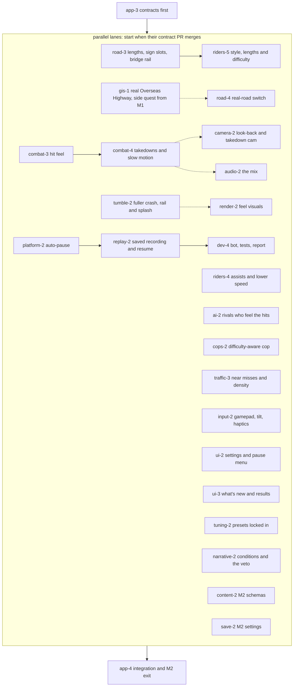

# Milestone 2: feel pass

> **In plain words.** Milestone 2 keeps the same road and makes it feel good. A clean hit freezes for a split second, and a kick that sends a rival into a truck gets a short slow-motion beat. Crashes get bigger and funnier: the bike cartwheels, riders sometimes go over the bridge rail and land with a splash, and you are back on the road fast. Knocked-off rivals get up and shake a fist at you. The phone buzzes on hits, a PS4-style pad works, and tilt steering becomes an option. There are Easy, Normal and Hard settings, a proper pause menu, and the game pauses itself when you switch apps or take a call, then picks the race up where you left it, even after the page reloads. You can long-press a line of rival trash talk, a sign or a billboard and choose "cut this". Risky riding (near misses, airtime, riding the oncoming lane, chained takedowns, stolen weapons) earns style cash. If the real Overseas Highway, built from public map data on a side lane, turns out to be fun, it replaces the hand-made road here; you decide by riding both.

## How to read this plan

- The tags work as in [the product spec](../product-spec.md#how-to-read-this-spec):
  - `[decided]`: traces to a maintainer answer.
  - `[default]`: a proposal agents build as written, which the maintainer may change.
  - `[open]`: waits on the maintainer. Each one is in [Decisions M2 touches](#decisions-m2-touches).
- This plan follows the structure of [the M1 plan](./M1.md#how-to-read-this-plan): lanes, branches `lane/<lane-id>/<topic>`, and per task **Owns**, **Needs**, **Builds**, **Automated acceptance**, **Phone check** and **Order**. It is a little lighter than M1: tasks inherit M1's rules unless they say otherwise.
- *When* things land is owned by [the roadmap](../roadmap.md#m2--feel-pass). *What* they are is owned by [the product spec](../product-spec.md), and *how* by [the architecture doc](../architecture.md), [the content-pack doc](../content-packs.md) and [the engineering doc](../engineering.md). Where this plan adds an item that the roadmap's M2 table does not list, it says so and tags it `[default]`.
- Numbers are starting values for the tuning panel, collected in [Starting numbers](#starting-numbers). Tick counts use the 60 Hz rule `ticks = max(1, round(seconds × 60))`, computed by script.

## Contents

- [What M2 delivers](#what-m2-delivers)
- [What M2 does not build](#what-m2-does-not-build)
- [Starting numbers](#starting-numbers)
- [The task graph](#the-task-graph)
- [The lanes](#the-lanes)
- [Contracts first](#contracts-first)
- [Simulation lanes](#simulation-lanes)
- [Road and the real-road side quest](#road-and-the-real-road-side-quest)
- [Presentation and control lanes](#presentation-and-control-lanes)
- [Data, runtime and QA lanes](#data-runtime-and-qa-lanes)
- [Integration and the exit pass](#integration-and-the-exit-pass)
- [Cross-lane rules for M2](#cross-lane-rules-for-m2)
- [M2 exit](#m2-exit)
- [Dependencies](#dependencies)
- [Risks](#risks)
- [If M2 runs long](#if-m2-runs-long)
- [Decisions M2 touches](#decisions-m2-touches)
- [Sources](#sources)

## What M2 delivers

**Goal.** Make landing a hit at speed feel great. The core fun is "landing a hit at speed". [decided]

**From the roadmap's M2 table** (see [the roadmap](../roadmap.md#m2--feel-pass) for each item's source):

- tuned hit-stop, knockback and a camera jolt on hits [default];
- Burnout-style takedowns with a short in-flow slow motion, on by default, with a toggle [decided for the takedowns and the toggle; default for M2];
- the fuller crash tumble, with contacts against traffic [default];
- the audio mix, with the single original score [decided that M1 and M2 keep a single original score; default for the rest];
- haptics with a toggle [decided for the toggle; default for M2];
- gamepad support, including a PS4-style pad paired to the phone over Bluetooth [decided, around M2];
- tuning presets from playtests, locked in as the shipped default [decided for the mechanism; default for M2];
- tilt steering as an option, with a sensitivity slider and recalibration at race start [decided for the option; default for M2];
- assist options: steering assist, auto-throttle and the lower-overall-speed setting [decided that assists and the lower-speed setting exist; default for the rest];
- settings for speed units, the slow-motion toggle, the haptics toggle, reduce screen shake and the frame-rate cap [decided for units, the two toggles and reduce-shake; default for the cap and for M2];
- a race-length choice: short, standard or long [decided for the choice; default for M2];
- look-back and takedown cameras [decided that all camera modes come, staged; default for M2];
- the in-game veto [decided for the flow; default for M2];
- the "what's new since you last played" card and the changelog page [decided for both; default for M2];
- barks with conditions and specificity scoring [default];
- anything that slipped from M1, such as the pickup weapon and steal [default].

**From the maintainer's later answers** (all decided in the amendment round; placing them in M2 is this plan's `[default]` unless tagged):

- **Crash tone.** Crashes are big and funny, and recovery is quick: ragdoll tumbles, the bike cartwheels, riders sometimes go over the rail, and the run-back starts fast. Going over a bridge rail ends in a funny splash (a gator or a fisherman reacts), a time penalty and a respawn on the bridge. There is no swimming. Knocked-off rivals tumble, get up, shake a fist, and a grudge is noted. Never gory or lingering. [decided] The fuller tumble is already in the roadmap's M2, so this is where the tone lands.
- **Difficulty presets.** Easy, Normal and Hard set rival aggression, cop frequency and rubber-banding. Assists toggle separately. [decided]
- **The pause menu.** Resume, restart, quit, the controls and HUD editor, the tuning panel (hidden unless enabled) and "copy debug report". [decided] The controls and HUD editor itself is M3 ([the roadmap](../roadmap.md#m3--look)); in M2 that entry opens the controls settings (mirror, sizes, steering method) and gains the full editor when M3 lands. [default]
- **Auto-pause and resume mid-race.** The game pauses itself on an app switch, a screen lock or a call, and resumes mid-race even after the tab reloads. This needs race-state snapshots, which the maintainer called an architecture item. [decided] This plan meets it by saving the race's recording and re-running it headlessly to the saved tick ([replay-2](#replay-2--the-saved-recording-and-resume-after-a-reload)), which needs no per-field state serializer. [default] The architecture doc needs a matching section, flagged in [app-3](#app-3--the-m2-contract-prs).
- **Style cash.** It comes from near-miss traffic, airtime, oncoming-lane riding, takedown combos and weapon steals, plus "maybe other stuff". [decided] In M2 the sim scores style and the results screen shows it as part of the prize; banking it into a cash ledger waits for M4's career, like every other prize. [default]
- **The real road.** A side-quest lane builds the real Overseas Highway (US 1 in the Florida Keys) from public data, in parallel since M1, without blocking it. If the real road is fun, it replaces the hand-built track in M2. [decided] The maintainer judges "fun" by riding both: their pick becomes the career's road, and the other stays in the game as an alternative route. [decided] (`milestones-real-road-swap`, cockpit answer, 2026-09-29)

**Added by this plan** [default], each with its reason:

- **A few crude signs and billboards on the road.** The veto names signs and billboards, and M3's scenery is still to come. Two or three placeholder boards give the veto something to cut in M2.
- **An in-race "grudge noted" marker.** The maintainer decided a knocked-off rival notes a grudge. Career grudges are M4, so in M2 the note lasts for the current race only: that rival targets you more until the finish. The M4 career then keeps it, saved across play sessions [decided] (`milestones-career-grudges-persist`, cockpit answer, 2026-09-29).
- **A minimal "Data licences" line in the menu, only if a road baked from OpenStreetMap ships.** The OSMF attribution guideline for games asks for attribution "in the menu" or on "the credits page", with a licence link in an easily found place such as "in the menu under "Data licences"" (quoted in the GIS research). The full credits page is M5, so M2 adds one line if and only if an OSM-derived road is in the build.

## What M2 does not build

Each of these has a later home in [the roadmap's lookup table](../roadmap.md#where-each-v1-item-lands).

- **Look.** The chosen style, the zine overlay, zine menus, Keys scenery beyond the placeholder boards, animals and oddities, far-chase and helmet cameras, HUD presets, the HUD editor, movable buttons and the minimap (M3).
- **Career.** The cash ledger, the shop, bikes beyond the M1 bike, grudges that last past a race, the other named racers, interludes, the save profile and export code, weird events and radio (M4).
- **Launch polish.** Quality tiers and dynamic resolution (unless the phone probe misses the budget earlier), offline play, the real name and the rest of accessibility (M5).
- **Later, not planned for v1.**
  - Tricks and the combo meter: on the idea shelf, a prototype after v1. [decided: shelf; default that the prototype is after v1]
  - The cruise-control button and cruise mode: both stay together on the shelf until a playtest asks for them. [decided] (`product-cruise-meaning`, cockpit answer, 2026-09-29) The `cruise` action stays reserved.
  - Dynamic music and radio DJ lines: the maintainer put both "later" (radio DJ lines "come later with the AI barks"). [decided that they come later; default that later means after v1] Radio stations themselves are M4.

## Starting numbers

All `[default]` tuning values, to be replaced by what feels right on the phone. Values that already exist in M1 keep their [M1 starting numbers](./M1.md#starting-numbers).

| Parameter | Starting value | Ticks at 60 Hz | Where it comes from |
|---|---|---|---|
| Hit-stop on player-involved clean hits | 60 ms, range 40–80 ms | 4 (range 2–5) | the product spec's 40–80 ms |
| Takedown attribution window | 2 s after your hit | 120 | the product spec |
| Takedown slow motion | 0.8 s at `timeScale` 0.3, range 0.6–1.0 s | 48 (range 36–60) | the product spec's 0.6–1.0 s and the architecture doc's 0.3 example |
| Slow-motion cooldown | 8 s | 480 | the product spec |
| Takedown combo window | 5 s of world time between takedowns | 300 | this plan |
| Oncoming-lane riding, scored stretch | at least 2 s in a lane whose `direction` differs from your `dir`, above half your top speed | 120 | this plan |
| Airtime, scored | at least 0.5 s airborne, in world time | 30 | this plan |
| Bridge-rail splash penalty | 4 s, then respawn on the bridge | 240 | this plan (the maintainer decided "a time penalty") |
| Rival get-up and fist shake | 1.5 s | 90 | this plan |
| Saved-recording interval | every 5 s, plus on hide and on pause | 300 | this plan: a full re-run of a 5-minute race is 18 000 ticks, about 27 s at the sim's 1.5 ms-per-tick budget as a worst case. A headless re-run skips rendering and should run far below that budget, but the real figure is *(unverified)* until the phone prints it. If a long race's fast-forward takes more than 3 s on the A16, the reserved `sim.serialize()` becomes a follow-up contract PR |
| Race lengths | short about 2 min, standard about 4, long about 6 | | the product spec. At M1's 29–32 m/s average that is about 3.5–3.8 km, 7.0–7.7 km and 10.4–11.5 km. The M1 route is the short one |
| Difficulty: rival aggression scale | Easy 0.75, Normal 1.0, Hard 1.25 | | this plan; tuning declarations `difficulty.<preset>.riderAggression` |
| Difficulty: cop frequency scale | Easy 0.5, Normal 1.0, Hard 1.5 | | this plan; `difficulty.<preset>.copFrequency` |
| Difficulty: rubber-band strength scale | Easy 1.5, Normal 1.0, Hard 0.5 | | this plan; `difficulty.<preset>.rubberBand`. Stronger means the pack stays closer to you |
| Gamepad stick dead zone | 0.12 | | this plan |
| Tilt dead zone and full lock | 2° and 25° from the calibrated rest angle | | this plan; the axis mapping is *(unverified)* until tested on the phone |
| Tilt smoothing | low-pass of about 0.1 s | | this plan |

The slow motion's 0.8 s is real time. At a time scale of 0.3 it covers about 0.24 s of world time, so the world visibly crawls, and the player keeps steering throughout. [default, per [the architecture doc](../architecture.md#time-scale-hit-stop-and-slow-motion)]

Style durations (airtime, the oncoming stretch, the combo window) are measured in scaled world time, the sum of `timeScale / 60` over the ticks, not in raw ticks. Otherwise a 0.25 s hop inside slow motion would count as 0.5 s of airtime and the combo window would stretch during slow motion. Hit-stop (`timeScale` 0) adds nothing. [default]

## The task graph

- Solid arrows are hard dependencies: the later task needs the earlier one merged. Dashed arrows are soft: the later task starts at once and switches the feature on when the earlier one lands.
- The dashed arrow into road-4 also means "only if": road-4 runs only when gis-1 has a road ready and the maintainer has ridden both roads and picked one (`milestones-real-road-swap` [decided]).
- Milestones overlap [default, per [the roadmap](../roadmap.md#how-work-flows-and-why-nothing-waits-for-the-maintainer)]. A lane whose M1 tasks have merged may start its M2 tasks while other M1 lanes are still working.

## The lanes

The lane ids and branch names are M1's. The ownership is M1's too, except for the few new paths below, each with one owner. [default]

| Lane | Owns in M2 (changes from M1 in bold) | Tasks | Size |
|---|---|---|---|
| sim combat | `src/sim/combat/`, `packs/base/weapons/` | combat-3, combat-4 | M |
| sim tumble | `src/sim/tumble/` | tumble-2 | L |
| sim riders | `src/sim/riders/`, `src/sim/race/`, `packs/base/bikes/`, `packs/base/events/` | riders-4, riders-5 | M |
| sim ai | `src/sim/ai/`, the rival files in `packs/base/riders/` | ai-2 | S |
| sim cops | `src/sim/cops/`, the cop file, `packs/base/crews/` | cops-2 | S |
| sim traffic | `src/sim/traffic/`, `src/sim/peds/`, `packs/base/traffic/`, `region.json` | traffic-3 | S |
| road | `src/road/`, `tools/road/`, the region's `networks/`, `roads/` and `routes/` | road-3, road-4 | M |
| gis (side quest) | **`tools/gis/`**, **the `osm-*` and `tiger-*` files in `packs/base/regions/florida-keys/networks/`, `roads/` and `routes/`**, **`packs/base/LICENSES/`** | gis-1 | M |
| input | `src/input/` | input-2 | M |
| camera | `src/camera/` | camera-2 | S |
| audio | `src/audio/` | audio-2 | M |
| render | `src/render/` | render-2 | M |
| ui | `src/ui/` except `src/ui/tuning/` and `src/ui/narrative/`, `packs/base/hud/` | ui-2, ui-3 | M |
| tuning | `src/tuning/`, `src/ui/tuning/`, `packs/base/tuning/` | tuning-2 | S |
| narrative | `src/ui/narrative/`, `packs/base/barks/` | narrative-2 | M |
| content | `src/content/`, `tools/packs/`, `packs/base/pack.json` | content-2 | S |
| platform, save, replay | `src/platform/`, `src/save/`, `src/replay/` | platform-2, save-2, replay-2 | S, S, M |
| dev | `src/dev/`, the `tests/e2e/` harness, `tests/perf/` | dev-4 | M |
| app (lane 0) | `src/app/`, `src/main.ts`, the contract files `src/core/`, `src/sim/api.ts`, `src/sim/world/` | app-3, app-4 | S, continuous |

- The gis lane owns only files that its pipeline emits, with an `osm-` or `tiger-` prefix, so it never collides with the road lane's hand-made files. A baked stretch needs its own network file (junctions and `crs`), road files and routes, so the prefix covers all three folders. Which route an event uses stays with the road and sim riders lanes. [default]
- Two registrations that belong to other lanes go by one-line PRs: the traffic lane lists the baked network in `region.json`'s `networks`, and the content lane adds a `licenseRules` entry in `pack.json` for `tiger-*` files with the USGS and Census courtesy credit (the `osm-*` prefix already matches the ODbL rule). [default]
- CI never runs `tools/gis`. Its baked output is committed and gated by `packs:check` like any pack file. [default]
- The gis lane is a side quest: it never blocks M2, and no M2 exit criterion depends on it. [decided for "without blocking"; default for the rest]
- Where two lanes touch a neighbour's folder in M2 (the "Data licences" menu line, the event's route references, the pause-menu entries for soak and radio in later milestones), the owner of the folder makes the change, and the other lane asks with a one-line PR. [default, per [the M1 cross-lane rules](./M1.md#cross-lane-rules-for-m1)]

## Contracts first

### app-3 · The M2 contract PRs

- **Goal.** Land every M2 change to a shared contract as small PRs before the lanes that use them, so no lane codes against a moving target. [default, per [the M1 cross-lane rules](./M1.md#cross-lane-rules-for-m1)]
- **Owns:** `src/core/`, `src/sim/api.ts`, `src/sim/world/`.
- **Builds**, as separate small PRs:
  1. **New `SimEvent` types:** `takedown` (already listed in the architecture doc; now with `data.kind` = `traffic`, `scenery` or `health`), `slowmoStart` and `slowmoEnd`, `railOver`, `splash`, `respawn`, `getUp`, `fistShake`, `grudgeNoted` and `style` (`data.kind` = `nearMiss`, `airtime`, `oncoming`, `takedownCombo` or `weaponSteal`, plus a points value).
  2. **`SimConfig` fields:** `difficulty { riderAggression, copFrequency, rubberBand }` already exists since M1 (all 1.0), and M2 adds the Easy, Normal and Hard preset resolution in `buildSimConfig` (item 3), plus the per-slot assists (`slots[i].assists { steer, autoThrottle }`; AI slots ignore them, so a second human with different settings stays possible), the slow-motion toggle and the lower-overall-speed multiplier. They are all sim state, so they go into the replay header. [default, per [the determinism rules](../architecture.md#determinism-rules)]
  3. **`buildSimConfig`:** the one place that turns settings and the content registry into a `SimConfig`, in `src/app/` (the SimConfig assembly M1 already puts in `app/`, since the sim may not import `content/` or `tuning/`). It resolves the chosen difficulty from the `difficulty.<preset>.*` tuning declarations, the assists, the speed multiplier and the race length. The race module only reads the result. Settings that feed `SimConfig` apply at the next race start or restart, and the pause menu says "applies next race". A mid-race change would break replays. [default]
  4. **Resume support** (an architecture item, described in [the architecture doc](../architecture.md#resume-after-a-reload)):
     - The race's recording (header plus inputs) is the saved state. On resume, `app/` builds a fresh headless sim from the `SimConfig` in the recording's header, never from the current settings, and re-runs it with the recorded inputs to the saved tick. AI inputs are a deterministic function of sim state, so only the human and bot inputs are stored.
     - No per-field serializer is built in M2. The names `sim.serialize()` and `restoreSim()` stay reserved, and are built only if the phone's printed fast-forward time for a long race exceeds 3 s.
     - The replay key's code part becomes finer so that a deploy that leaves the sim untouched still resumes: `simCodeHash + simContentHash`, where `simCodeHash` is the content hash of one Vite chunk that holds `src/sim`, `src/road` and `src/core` (through `manualChunks`). In M1 the code part was the build commit. [The architecture doc](../architecture.md#resume-after-a-reload) states the same key. [default]
  5. **`SimSnapshot` fields:** `slowmo` (active and remaining ticks) and, per rider, `styleTally` and `grudgeNotedBy`.
- **Automated acceptance:** each contract PR compiles every module against it (the gate's typecheck). A resume test records 600 ticks of scripted inputs, builds a fresh headless sim from the header and fast-forwards it to tick 600 with the recorded inputs, gets the same hash as the original at every 60th tick, and then steps both 600 more ticks with the same inputs to identical hashes. A second test builds the same bundle with a change only in `src/ui/` and gets the same `simCodeHash`.
- **Phone check:** none.
- **Order:** first. Lanes that don't need a new contract start at once.

## Simulation lanes

### combat-3 · Hit feel

- **Goal.** A clean hit reads and feels meaty, and a kick that sends a rival flying is earned. This is the polish the look-lab kick needed. [default]
- **Owns:** `src/sim/combat/`, `packs/base/weapons/`.
- **Needs:** M1's combat-1 and its timing windows.
- **Builds:**
  - Hit-stop tuned inside the 40–80 ms range, and still only for player-involved hits. [default, per [the product spec](../product-spec.md#combat)]
  - Knockback as a short curve instead of one impulse: a peak, then a decay over about 0.3 s, stronger for a kick and scaled by the attacker's mass and the target's `knockbackResistance`.
  - A stagger that briefly limits the target's steering, so a follow-up is possible.
  - A `hitImpulse` value on `hit` events, for the camera jolt and the haptics.
  - Health recovering slowly when out of combat, as the product spec proposes. [default]
- **As built** [default for every number; each is a tuning slider in the `combat` group]:
  - The shove's lateral speed falls linearly from its peak to zero over `combat.knockbackDecayS` (0.4 s, a little longer than the 0.3 s above, so the kick reads as a swerve), which moves the target peak × 0.2 m. The peak is the weapon's `knockback.lateralMps` × `combat.knockbackScale` (× `combat.kickShoveScale` for a kick) × the attacker-to-target mass ratio (rider plus bike, clamped 0.5–2) × the attacker's bike `hitPowerScale` × (1 − the target's bike `knockbackResistance`). A shove stops at the drivable edge.
  - The stagger (`combat.staggerScale`) also sets the riders phase's wobble for its length: half steering, a little drag and a shaking bike. An attack pressed while staggered is kept and starts on the tick the stagger ends, reading the kick flag then, so the button never feels dead (M1 dropped it).
  - `hitImpulse` is (damage + peak shove in m/s) / 40, capped at 1: about 0.3 for a punch, 0.9 for a kick.
  - Health comes back at `combat.regenPerS` (3 points a second, in whole points) after `combat.regenDelayS` (5 s of world time) with no attack started, landed or taken.
- **Playtest 1 amendment: a kick is a clear shove, and a punch staggers.** [decided] (playtest 1, 2026-09-30: "kicking should have the effect of moving the kicked over a bit like swerving") The kick's shove is 18 m/s peak, which moves the target 3.6 m, about a lane, possibly into traffic or onto the shoulder. The punch's is 1.5 m/s, 0.3 m, so it mostly staggers [default for the numbers]. A rider's hit on a player shoves and wobbles by `combat.onPlayerScale` (0.4, so a rival's kick moves you about 1.4 m, near M1's 1.7 m) [default]. The playtest also said nothing felt unfair and rivals stay as they are, and with the full shove on the player, a bot batch of 8 races saw hits on the player rise from 27 to 51 and knock-offs from 0 to 7; at 0.4, a 24-race batch saw 92 hits on the player against main's 94, and 0 knock-offs against main's 1.
- **Playtest 1 amendment: a swipe-down becomes a kick.** [decided] (playtest 1, 2026-09-30: "Can't kick") A kick flag converts any attack but a kick while it is in its wind-up (M1's rule) or while it is at most `combat.kickConvertMs` old (250 ms, 15 ticks, in any phase) [default]. Inside that window the kick keeps the attack's age, so a swipe lands on the kick's own 13-tick schedule from the press, never later; a punch that already landed stands, and the kick follows it. A kick still cooling down converts nothing. The input lane's gesture-timing invariant checks its swipe window (the window's ticks plus one sampling tick) against `combat.kickConvertMs` instead of the punch's 7-tick wind-up.
- **Automated acceptance:** sim tests that check:
  - hit-stop lasts exactly the declared ticks, and a rival-against-rival hit gets none;
  - a kick's peak lateral speed beats a punch's, at equal mass;
  - health recovers only after the out-of-combat delay;
  - a scripted fight still hashes the same every run;
  - for the amendment: a landed kick moves the target 3–4.2 m and a punch under 0.6 m; a kick flag first seen 12 or 13 ticks after the press (a 180 or 200 ms swipe) turns the punch into a kick that lands on tick 13 or 14; a kick flag after the window changes nothing.
- **Phone check:** hits feel meaty, and a kick visibly throws the rival sideways.
- **Order:** as soon as the M2 contracts it needs have merged.

### combat-4 · Takedowns and slow motion

- **Goal.** Burnout-style takedowns: knock a rival into traffic for a short, in-flow slow-motion beat and bonus cash, with the slow motion on by default and a toggle. [decided]
- **Owns:** the same as combat-3.
- **Needs:** combat-3; tumble-2 for traffic and scenery contacts (soft: health takedowns work first).
- **Builds:**
  - **Attribution.** A rival going down within 2 s of your hit is your takedown, whether into traffic, into scenery or by running out of health. [default, per the product spec]
  - **Slow motion** on big takedowns only (traffic or scenery): `timeScale` 0.3 for 0.8 s of real time, player-involved only, with an 8 s cooldown so a pile-up can't chain it. Off when the toggle is off. [decided for the in-flow slow motion and the toggle; default for the numbers]
  - `takedown`, `slowmoStart` and `slowmoEnd` events, each with its `causeId`.
  - **Hit-stop inside slow motion.** Hit-stop wins: while `timeScale` is 0 for a hit-stop, the slow motion's remaining time pauses too, and resumes after. [default]
  - The takedown count per race, for the results screen and for M4's takedown-hunt events.
- **Automated acceptance:** sim tests that check:
  - a scripted kick into an oncoming car emits one `takedown` with `kind: traffic`, and one `slowmoStart` 0 ticks later and `slowmoEnd` 48 ticks later;
  - a second big takedown inside 480 ticks gets no slow motion;
  - with the toggle off, the same scripted race has the same takedown and no slow motion;
  - a rival-against-rival takedown gets no slow motion;
  - a race with slow motion replays to identical hashes.
- **Phone check:** a takedown reads clearly, the slow motion feels like a beat and not a cutscene, and you can still steer through it.
- **Order:** after combat-3.

### tumble-2 · The fuller crash, the rail and the splash

- **Goal.** Crashes that are big and funny, with quick recovery. [decided] The fuller rig from [the architecture doc](../architecture.md#crash-tumble), plus the bridge rail.
- **Owns:** `src/sim/tumble/`.
- **Builds:**
  - **The point-mass rig:** a particle cluster for the rider and one for the bike, with distance constraints, stepped at the sim tick under the determinism rules. It keeps an explicit velocity per particle (velocity += acceleration × dt, position += velocity × dt, then the constraints are projected), with `dt = timeScale / 60` and no integration at all when `timeScale` is 0. Plain position-Verlet stores velocity as the last position difference, so it would gain or lose energy whenever `timeScale` changes, which is exactly when takedowns and crashes overlap. [default; the same rig the architecture doc's [crash tumble](../architecture.md#crash-tumble) describes]
  - **Contacts** against the road, barriers, and oriented boxes built each tick from nearby traffic and riders. Contacts become events, so a car brakes and a rival wobbles or crashes. [default]
  - **The cartwheel.** Bike and rider separate on a big impact, and the bike tumbles end over end. Ragdoll tumbles for the rider. [decided]
  - **Over the rail.** Where the road has a `rail` barrier ([content-2](#content-2--the-m2-schemas) defines it), a tumble body whose height is above the rail's `heightM` and which crosses the barrier line fires `railOver`, then `splash` when it reaches the water plane (the region's sea level), then a respawn on the bridge after the 4 s penalty. There is no swimming mode. [decided]
  - **Rivals get up.** A knocked-off rival tumbles, stands, shakes a fist (`getUp`, then `fistShake`), notes the grudge (`grudgeNoted`) and runs back. [decided] Never gory or lingering. [decided]
  - **Quick recovery.** The run-back starts as soon as the bodies settle, and the M1 skip still works. [decided]
- **Needs:** app-3's events; content-2's `rail` barrier and `barrierAt`; road-3's bridge-rail data; M1's tumble-1.
- **Automated acceptance:**
  - On [dev-4's shared seeded batch](#dev-4--bot-tests-and-the-debug-report-for-m2), every crash hands back within its timeout plus the run, and every splash respawns on the bridge within the penalty plus one second.
  - No body ever ends a hand-back below the water plane or outside the drivable width.
  - A scripted crash into a car makes that car brake (a `crash` contact event with the right `causeId`).
  - No NaN in 10 000 ticks of scripted tumbles, and scripted crashes hash the same every run.
  - A tumble that crosses a `slowmoStart` and `slowmoEnd` boundary keeps its speed within 2 % of the same tumble at `timeScale` 1, and a 4-tick hit-stop moves no body.
- **Phone check:** crashes are big, silly and never gory. Going over the rail is funny, not annoying, and you're back quickly.
- **Order:** as soon as the contracts land. Splash needs road-3.

### riders-4 · Assists and lower overall speed

- **Goal.** Assist options, offered without being obtrusive. [decided]
- **Owns:** `src/sim/riders/`, `packs/base/bikes/`.
- **Needs:** the `SimConfig` assist fields.
- **Builds:**
  - **Steering assist** at off, light or strong: it nudges yaw away from the shoulder and barriers, never onto a fixed line. [default; the touch research reports Real Racing 3's steering assist being criticised for forcing "the defined line for every corner" *(unverified: search summary)*]
  - **Lower overall game speed:** a multiplier `m` on every mover's speed and acceleration, changed only between races, recorded in replays. It is not a time scale: timers and inputs are unaffected. Gravity in the sim is scaled by `m²`, so every jump trajectory keeps its shape (flight time grows by 1/m like everything else) and the ramp shortcut and `gap` features stay crossable. [decided that it exists; default for the mechanism, per [the product spec's settings](../product-spec.md#settings)]
  - Assists are independent of the input method, and apply per human slot (`SimConfig.slots[i].assists`); AI slots ignore them. [default]
- **Automated acceptance:** sim tests with a non-default value for each setting:
  - strong assist keeps a scripted drift-toward-the-rail run off the shoulder, while off lets it touch;
  - a 0.8 speed multiplier makes the bot's route time about 1/0.8 as long, within 5 %, and at the minimum multiplier the bot still takes the ramp shortcut and lands clean;
  - both are in the replay header and reproduce their hashes.
- **Phone check:** strong assist is forgiving without feeling like a rail, and the lower speed makes fights easier to read.
- **Order:** as soon as the contracts land.

### riders-5 · Style, race lengths and difficulty

- **Goal.** Style cash for risky riding, a race-length choice, and Easy, Normal and Hard. [decided for all three; default for M2]
- **Owns:** `src/sim/race/`, `packs/base/events/`.
- **Needs:** app-3's `style` event and `buildSimConfig`; road-3's routes for the lengths.
- **Builds:**
  - **Style scoring** in the race module, from events other modules already emit: near-miss traffic (`nearMiss`), airtime (`jump` to `land` of at least 0.5 s of world time), oncoming-lane riding (2 s or more of world time in a lane whose `direction` differs from the rider's own `dir`, above half top speed; on a route leg ridden at `dir = −1` the oncoming lane is the `direction +1` one), takedown combos (takedowns within 5 s of each other, each one worth more than the last) and weapon steals (`weaponGrab`). [decided for the sources; default for the rules] Each emits a `style` event, and the rider's `styleTally` adds up. The points values are data in the event's rewards, so "maybe other stuff" is a data change when it reuses an existing event. [default]
  - **Race length:** the M1 event gains `short`, `standard` and `long` lengths from road-3's routes, chosen before the race. [default, per [the event format](../content-packs.md#event)]
  - **Difficulty presets** Easy, Normal and Hard, with the scales in [Starting numbers](#starting-numbers), declared as tuning parameters `difficulty.<preset>.riderAggression`, `.copFrequency` and `.rubberBand` (app-3 declares them in `src/core/difficulty.ts`, aggregated into the sim's tuning list with `affectsSim` false, so riders-5 does not declare them again) [default]. That keeps them adjustable in the tuning panel and needs no new entry type or folder; a `difficulty` entry type can come later if packs need their own. `buildSimConfig` (app-3) resolves the chosen preset into `SimConfig.difficulty`; the race module, the AI lane and the cop lane only read it. The default is Normal. [decided for the three presets and what they set; default for the numbers, for Normal and for the mechanism]
- **Automated acceptance:**
  - A scripted near miss, a 0.6 s jump, a 2.5 s oncoming stretch, two takedowns 3 s apart and a steal each emit exactly one `style` event of the right kind; the second takedown scores more than the first.
  - The same oncoming test on a leg ridden at `dir = −1` scores the `direction +1` lane and not the rider's own lane.
  - A jump that spends its flight inside slow motion is measured in world time, not ticks.
  - Each race length's bot time falls inside its band (about 2, 4 and 6 minutes, ±30 %), from one bot race per length, not a batch.
  - On [dev-4's shared seeded batch](#dev-4--bot-tests-and-the-debug-report-for-m2), Hard shows more rival hits on the player and more cop spawns than Easy, and the printed numbers say by how much. This tests the non-default presets, not only Normal.
- **Phone check:** style pops up when you ride dangerously, and Easy and Hard feel different.
- **Order:** style at once; lengths after road-3; difficulty after content-2.

### ai-2 · Rivals who feel the hits

- **Goal.** Rivals react to the new feel: they recover, hold a race-long grudge and fight to their difficulty. [decided for grudge targeting and the crash tone; default for the rest]
- **Owns:** `src/sim/ai/`, the rival files in `packs/base/riders/`.
- **Needs:** tumble-2's `grudgeNoted`; app-3's `SimConfig.difficulty` (from `buildSimConfig`).
- **Builds:**
  - **Race-long grudge:** a rival who noted a grudge against you raises you in its target choice until the finish. [default; M4's career keeps it longer]
  - **Takedown intent:** `heavy-hitter`-style rivals prefer hits that push you toward oncoming traffic or the rail.
  - **Difficulty:** aggression scales with the preset.
  - The difficulty's rubber-band scale applies to the M1 rubber-band factor.
- **Automated acceptance:**
  - On dev-4's shared seeded batch, a rival you knocked off targets you more often afterwards than before (printed counts; fails only if it doesn't rise).
  - Hard's rubber-band factor keeps the pack's first-to-last gap wider than Easy's (printed).
  - Scripted races hash the same every run.
- **Phone check:** a rival you just dumped comes looking for you.
- **Order:** after tumble-2's events land; difficulty after app-3's `SimConfig.difficulty`.

### cops-2 · A difficulty-aware cop

- **Goal.** Cop frequency follows the difficulty preset. [decided]
- **Owns:** `src/sim/cops/`, the cop file.
- **Needs:** app-3's `SimConfig.difficulty`.
- **Builds:** the spawn chance and the time to first spawn scale with the preset; the siren cue leads the cop's arrival by a clear margin; a knocked-off cop gets up and runs back like any rider (through tumble-2). The full spawn mix is M4. [default]
- **Automated acceptance:** Hard spawns more cops than Easy across dev-4's shared seeded batch (printed); a knocked-down cop still can't bust anyone until he is back up.
- **Phone check:** you hear the cop before you see him.
- **Order:** after app-3's `SimConfig.difficulty`.

### traffic-3 · Near misses and oncoming density

- **Goal.** Near misses that feel earned, and oncoming density that can ease in. [default]
- **Owns:** `src/sim/traffic/`, `src/sim/peds/`, `packs/base/traffic/`, `region.json`.
- **Builds:** the `nearMiss` rule tightened to "passed within about 1 m sideways at a closing speed above a threshold", so style can't be farmed by crawling past parked cars; an optional ease-in of oncoming density over the first part of a race, a tuning value that M1's playtest decides; the two or three placeholder sign and billboard items added to `region.json` for road-3's slots; and the region's traffic mix reaching `SimConfig`, so the weights in `region.json` pick the vehicles (M1 left per-category defaults in the sim, see [traffic-1](M1.md#traffic-1--traffic-both-ways)). [default]
- **Automated acceptance:** a scripted slow pass fires no `nearMiss`, and a fast one fires exactly one; with ease-in on, oncoming density at the start is below its full value (printed).
- **Phone check:** near misses feel like near misses.
- **Order:** at once.

## Road and the real-road side quest

### road-3 · Race lengths, sign slots and the bridge rail

- **Goal.** The road data M2 needs: a short, a standard and a long route, a few sign and billboard slots, and a bridge rail you can go over. [default]
- **Owns:** `src/road/`, `tools/road/`, the region's `networks/`, `roads/` and `routes/` (except the gis lane's prefixed files).
- **Needs:** content-2's `barriers` field.
- **Builds:**
  - The standard and long routes on the hand-made network: an extended road, or a closed loop with laps for the long one. [default, per [the route format](../content-packs.md#route-file-regionsregionroutesidjson)]
  - Two or three `billboard` feature slots naming the placeholder items, each with a stable content reference for the veto.
  - `barriers` entries with `kind: "rail"` along the hand-made road's bridge stretches, and the `barrierAt(edge, s, side)` query in `road/`. The water is the region's sea level (world `y = 0` in the network's `crs`), so tumble-2 knows where a splash lands. [default]
- **Automated acceptance:** the pack check passes, with the lap-count rule; every slot's item resolves to a live region item; each route's bot time is printed; `barrierAt` returns the rail on a bridge stretch and nothing off it.
- **Phone check:** the long race feels long, not padded.
- **Order:** at once. riders-5's lengths wait on it.

### gis-1 · The real Overseas Highway (side quest, running since M1)

- **Goal.** Build the real Overseas Highway, US 1 through the Florida Keys, from public data, in the same baked road format the hand-made track uses, without blocking any milestone. [decided] The earlier probe covered CA-1 at Big Sur, not the Keys, so Keys data is unprobed. [decided]
- **Owns:** `tools/gis/` (its own Python project), the prefixed network, road and route files it emits, and `packs/base/LICENSES/`.
- **Needs:** the baked road format and its lint ([content packs](../content-packs.md#road-networks-roads-and-routes)); nothing from any M2 lane.
- **Builds:**
  - An offline bake of one 5–8 km stretch that includes a long bridge, following the research pipeline: fetch once, stitch, smooth, resample at 2 m, add elevation, then "gameplay-fy" (bridge humps exaggerated, long straights compressed). [default, per [the roadmap's side-quest table](../roadmap.md#side-quests)] A point-to-point highway is not a loop, and the road model has no U-turns (a dead end is a barrier), so one such stretch can host the short race length and maybe the standard one, but not the roughly 10–11 km long one. A longer stretch, or a second one, lets more lengths switch. [default]
  - **Elevation is a "later" layer pulled forward.** The maintainer listed elevation, land cover, traffic density and landmarks as GIS data for later. Elevation comes into this first proof only because the decided "road with hills" needs bridge humps for the real road to replace the hand-made one. Land cover, traffic density and landmarks stay later. [default for pulling elevation forward; decided that the rest is later]
  - Provenance on every file, with the source, query, retrieval time and hash. [default, per [road-data provenance](../content-packs.md#provenance-and-licence-of-road-data)]
  - A second route over that stretch, so the event can switch routes by data alone.
  - The source choice is the lane's: OpenStreetMap (ODbL, with attribution and the published bake script) or TIGER/Line plus USGS elevation (public domain, courtesy credit). The maintainer finds the licences "all basically fine". [decided for the licence stance; default for the source]
- **Automated acceptance:** the baked files pass the pack check, including the spacing, junction and jump-curvature rules; the licence rule covers every OSM-derived file; the bot finishes a race on the real route and prints its time; the perf gate holds on it.
- **Phone check:** does the real road feel like the Keys, and is it fun at speed?
- **Order:** any time; it has run beside M1 from the start. [decided] It is done when its route passes the checks, whether or not it is adopted.

### road-4 · The real-road switch

- **Goal.** If the real road is fun, it replaces the hand-built track in M2. [decided] The maintainer rides both and picks; the pick becomes the career's road, and the other stays in the game as an alternative route. [decided] (cockpit answer, 2026-09-29)
- **Owns:** the road lane's route files. The event's route references in `packs/base/events/` change by a one-line PR from the sim riders lane, and the "Data licences" menu line by a one-line PR from the ui lane.
- **Needs:** gis-1 ready, both roads offered in the build as selectable routes, and the maintainer's pick after riding them.
- **Builds:** a data change only. If the maintainer picks the real road, each event length that the real route can host points at it, and the hand-made road stays in the pack as an alternative route. If they pick the hand-made road, it stays the career's road and the real one stays in as the alternative route. A length that the real route cannot fit (see gis-1) keeps the hand-made route either way. If an OSM-derived road ships, the menu gets its one "Data licences" line in the same round of PRs ([What M2 delivers](#what-m2-delivers)). [decided for the pick and the alternative route; default for the rest]
- **Automated acceptance:** the M2 exit criteria all pass on each length that switched, including the bot's takedown and the perf gate, and the length-band test runs per route.
- **Phone check:** ride both roads and say which one you prefer.
- **Order:** only when both needs are met. If they aren't met by the M2 exit, the switch moves to whenever they are; it never holds M2 open. [default]

## Presentation and control lanes

### input-2 · Gamepad, tilt and haptics

- **Goal.** A PS4-style pad works, including over Bluetooth to the phone; tilt steering is an option; the phone buzzes on hits. [decided for all three; default for M2]
- **Owns:** `src/input/`, and its own `tests/e2e/input-*.spec.ts`.
- **Builds:**
  - **Gamepad:** the Gamepad API polled once per frame into the action map, with the `standard` mapping, a stick dead zone, and default bindings (left stick steer, right trigger throttle, left trigger brake, Cross to attack with the auto-target side, Square and Circle to attack forced left and right, Triangle to kick, R1 for look-back). Every binding is remappable. Whether a PS4 pad reports the `standard` mapping on Android Chrome is *(unverified)*, so the phone check confirms it. [default]
  - **Tilt** as an option: steer angle = `asin(g_long / |g|)`, where `g_long` is the gravity component along the device's long axis, read from `devicemotion`'s `accelerationIncludingGravity`. The sign follows `screen.orientation.angle`, the result is low-pass filtered (about 0.1 s) and zeroed at race-start calibration, and `beta` is the fallback when `devicemotion` is absent. Euler `beta` degrades when a phone is held upright in landscape, where `gamma` nears its ±90° limit, while the gravity component has no such limit. The plan also has a sensitivity slider and a hybrid mode where tilt and thumb add together. The whole mapping is *(unverified)* until tested on the phone (the touch research marks its own derivation unverified). [decided for the option; default for the rest]
  - **Haptics** in `input/feedback`: `navigator.vibrate` patterns keyed by event (hit landed, hit taken, takedown, crash), gated by the toggle, and silently absent where unsupported. [decided for the toggle; default for the patterns]
  - **Auto-throttle** as an input option, and **pull-back brake** as an option whose default the playtests decide. [default]
- **Automated acceptance:**
  - A mocked Gamepad API drives the action map to the expected `SimInput`, including a kick.
  - A mocked `navigator.vibrate` fires only with haptics on.
  - Tilt maps to the same steer sign in both landscape orientations (angle 90 and 270), and at simulated hold pitches of 20°, 45° and 70° it gives the same sign and a monotonic response.
  - Auto-throttle produces full throttle with no touch on the stick.
- **As built** (first PR) [default]:
  - The pad is polled on every input sample (once per sim tick, 60 Hz), so it works with no app wiring. The d-pad also steers, Cross also asks to skip the run-back (as the touch attack button does), and a pad without the `standard` mapping is read with the same indices. The stick's dead zone is radial.
  - Tilt uses the gravity component along the screen's horizontal axis, `(cos a, −sin a)` in device axes for screen angle `a`, which is the device's long axis in landscape. The `beta` fallback rebuilds gravity from `beta` and `gamma`. At a steep hold pitch the same wheel turn dips the long axis less (at 70°, about a third as much), so small turns sit inside the 2° dead zone there; the sensitivity slider covers it. The steering methods are `thumb` (the default), `tilt` (the stick throttles and brakes but does not steer) and `both` (added).
  - Auto-throttle gives full throttle whenever the brake is not pressed. Pull-back brake is off by default until a playtest decides. Both are applied in `input/`, so they are recorded as ordinary inputs; the sim's `slots[i].assists.autoThrottle` field stays for a sim-side assist if one is wanted.
  - Haptics buzz once per sim step at most (the strongest event wins), a weaker buzz never cuts into a stronger one still playing, and hit buzzes grow with combat-3's `hitImpulse` where a hit carries one.
  - New `input.*` tuning values: `gamepadDeadZone` 0.12, `tiltDeadZoneDeg` 2, `tiltFullLockDeg` 25 and `tiltSmoothingS` 0.1, the starting numbers above.
  - Still to wire outside `src/input/`: `app/` feeds `input.onEvents(events, playerId)` after each step and calls `input.calibrateTilt()` at race start; `ui-2` and `save-2` add the settings (steering method, tilt sensitivity, auto-throttle, pull-back brake, haptics, hidden where `input.haptics.supported` is false) and pass them to `input.setOptions`.
- **Phone check:** the pad works over Bluetooth; tilt is usable; the buzzes feel right and not naggy.
- **Order:** at once.

### camera-2 · Look-back, the takedown camera and the hit jolt

- **Goal.** The next camera modes by value: look-back and a short takedown framing. [decided that all camera modes come, staged; default for M2]
- **Owns:** `src/camera/`.
- **Builds:** `lookBack` on the held action; `takedown`, a short framing on a player takedown that holds the victim in view during the slow motion and returns smoothly; a jolt from `hitImpulse`; all shake scaled by the reduce-shake setting. [default, per [the architecture doc's camera section](../architecture.md#camera)]
- **Playtest 1 amendment: a higher camera, further back.** [decided] (playtest 1, 2026-09-30: "Camera too low to see oncoming traffic") M1's chase cam sat 5.5 m back and 1.6 m up, below the rider's helmet (about 1.9 m), so the rider's own body hid the horizon where oncoming traffic appears. The new starting values are 7 m back (`camera.chaseDistanceM`) and 2.6 m up (`camera.heightM`) [default for the numbers]. Both stay tuning sliders, and the chase cam keeps its `lowChase` mode id.
- **As built** [default]. Every number below is a `camera.*` tuning slider.
  - **Look-back** is a hard cut while `CameraContext.lookBack` is held: the camera moves 2.5 m ahead of the rider and 2.3 m up, looking 25 m back down the road. On release it cuts straight back. A cut is the quickest read, and nothing swings through the rider.
  - **The takedown framing** starts on a `takedown` credited to the followed rider. It blends in with smoothstep over 0.3 s to a camera 9 m back and 3.6 m up, swung 30° away from the victim and aimed 60 % of the way to it. It holds until the matching `slowmoEnd` (matched by `causeId`), or for 1 s when no slow motion follows. It is fully off one blend time after the release. The chase springs keep running underneath, so it lands exactly on the chase framing. A held look-back wins over it.
  - **The hit jolt** is a directional push away from the other rider. A full jolt is 0.35 m, reached at a `hitImpulse` of 6 m/s, and it springs back at 14 1/s without crossing zero. The thrower gets half. The camera reads `hitImpulse` as the target's knockback speed in m/s; until combat-3 publishes it, a kick counts as 5 m/s and anything else as 2 m/s, from M1's knockback numbers.
  - **Reduce-shake** is `setShakeAmount(0..1)`. It multiplies `camera.shakeScale` for both the event shake and the jolt.
  - **Wiring left to app-4:** pass the held look-back action in `CameraContext.lookBack`, and call `setShakeAmount` from the reduce-shake setting once save-2 stores it. The takedown framing and the jolt need no new wiring: they read the events and entities `app/` already passes in.
- **Automated acceptance:** unit tests that check each mode settles without overshoot, the takedown framing ends by `slowmoEnd` plus its blend time, and reduce-shake at zero produces no shake offset. For the amendment, a test settles the camera and projects an oncoming car 125 m ahead (the reaction range) through the same three.js calls render makes. The car must be inside the view and clear of the rider's silhouette, standing still and at top speed, on a straight road and on a bend, and on the phone's screen shape and on 16:9. M1's numbers must fail the same check.
- **Phone check:** the takedown camera is exciting, not disorienting; look-back is quick to use.
- **Order:** at once; the takedown framing switches on when combat-4 lands.

### audio-2 · The mix

- **Goal.** Loud where it counts: engine, hits in sync with hit-stop, crashes, horns, the siren and the one original score. [decided for the priorities and the single score; default for the mix]
- **Owns:** `src/audio/`, and its own `tests/e2e/audio-*.spec.ts`.
- **Builds:** hit sounds on the hit-stop tick; layered crash sounds scaled by impact; a splash; a slow-motion treatment (pitch down and a low-pass on the effects bus, with the music ducked); horns and the siren as telegraphs; the original score as a fuller loop; a bus-level mix check on the phone speaker. [default]
- **Automated acceptance:** every M2 event type that should make a sound has a cue; an offline render of a scripted takedown shows the slow-motion filter on the effects bus; the bus gains still follow the settings.
- **Phone check:** hits sound meaty on the phone speaker; the slow motion sounds like slow motion; nothing clips in a pile-up.
- **Order:** at once; the slow-motion treatment switches on when combat-4 lands.
- **As built** [default]: the slow-motion treatment follows `SimSnapshot.slowmo` (and the `slowmoStart` and `slowmoEnd` events on their own tick), so it needs no switch when combat-4 lands. Its feel numbers are tuning sliders: `audio.slowmoLowpassHz` 900 Hz, `audio.slowmoPitchSemis` −5 semitones, `audio.slowmoMusicDuck` 0.35, plus `audio.crashImpactScale` 1 and `audio.hornLaneHalfWidthM` 1.8 m. Silent by choice: `getUp`, `fistShake` and `grudgeNoted` (seen and barked, not sounded). Player-only: `style` (a chime), `respawn` and `nearMiss` (a whoosh). The siren event whoops only when a chase starts. The acceptance renders are `tests/e2e/audio-mix.spec.ts`.

### render-2 · Feel visuals

- **Goal.** What the new feel looks like, still in the placeholder look. [default]
- **Owns:** `src/render/`.
- **Builds:** a hit flash and spark burst; a slow-motion tint; the cartwheeling bike and the ragdoll rider from tumble-2's bodies; the splash, with a gator or a fisherman reacting [decided]; the get-up and fist-shake pose; the placeholder signs and billboards, tagged with their content references, plus `pickContentAt(x, y)` and `visibleContentRefs()` for the veto ([architecture](../architecture.md#in-game-veto-cut-this)).
- **Automated acceptance:** screenshots at a scripted takedown and a scripted splash are not blank; `pickContentAt` on a placeholder board returns its content reference; the perf hard gate holds during slow motion and a pile-up.
- **Phone check:** you can read the takedown, and the splash made you laugh.
- **Order:** at once; each view switches on as its sim task lands.

### ui-2 · The settings screen and the full pause menu

- **Goal.** Every M2 setting in one place, and the pause menu the maintainer asked for. [decided for the pause entries and the settings; default for the layout]
- **Owns:** `src/ui/` except `src/ui/tuning/` and `src/ui/narrative/`, `packs/base/hud/`, and its own `tests/e2e/ui-*.spec.ts`.
- **Builds:**
  - **Settings:** speed units, difficulty (Easy, Normal, Hard), assists, lower overall speed, race length, steering method (thumb, tilt, both), throttle (scaled or auto), pull-back brake, haptics, slow motion, reduce screen shake, the frame-rate cap, gamepad bindings, and "show tuning panel in the pause menu" (off by default). Settings that feed `SimConfig` (difficulty, assists, speed, slow motion) apply at the next race start or restart, and the pause menu labels them "applies next race". [decided for the list the maintainer named; default for the rest]
  - **The pause menu:** resume, restart, quit, controls and HUD, the tuning panel (only when the setting is on; M1's long-press on the build id still opens it), and copy debug report. [decided]
  - **The resume card:** after a reload mid-race, "Resume race" or "Start over". `ui/` only draws the card and reports the tap; `app/` (app-4) decides whether a saved recording exists, runs the fast-forward behind a spinner, and runs platform's Start-tap sequence on the "Resume race" tap, because a reload loses user activation (fullscreen, orientation lock and `AudioContext.resume()` need it again). `ui/` never imports `replay/`. [default]
- **Automated acceptance:** browser tests that check every setting persists across a reload and changes something observable when set to a non-default value (the units change the HUD, the slow-motion toggle stops the slow motion, and so on); the pause menu lists exactly the decided entries; the tuning entry is hidden by default and shown when enabled.
- **Phone check:** settings are easy to find and readable at arm's length.
- **Order:** at once; each setting appears as its feature lands.

### ui-3 · What's new, the changelog page and the results screen

- **Goal.** "What's new since you last played", per device, and a full changelog page. [decided]
- **Owns:** the same as ui-2.
- **Builds:** the card on launch, listing player notes newer than this device's `lastSeenBuild`, and a short welcome on first launch instead of the whole history; the changelog page in the menu from `dist/changelog.json`; the results screen showing place, prize, takedowns and the style tally; short style pop-ups during the race ("NEAR MISS", "ONCOMING", "AIRTIME") in the tone guide's plain, dry voice. [default, per [the engineering doc](../engineering.md#what-changed-notes-in-game-changelog-and-releases)]
- **Automated acceptance:** unit and browser tests that check the card shows only notes newer than the stored build, shows nothing when there are none, and updates `lastSeenBuild` after it is seen.
- **Phone check:** the card tells you what's new in a glance.
- **Order:** at once.

### tuning-2 · Presets locked in

- **Goal.** The maintainer's playtest presets become the shipped default. [decided for the mechanism]
- **Owns:** `src/tuning/`, `src/ui/tuning/`, `packs/base/tuning/`.
- **Builds:** each preset the maintainer pastes in chat becomes a pack file and, when they say it feels right, the base pack's default ([the tuning-preset format](../content-packs.md#tuning-presets)); the new M2 declarations (slow motion, takedown window, knockback curve, assists, style thresholds); a "differs from default" marker on each panel row.
- **Automated acceptance:** every declaration's default is in range; a pasted preset passes `packs:check`; switching the default preset changes a seeded fight's outcome against a control run.
- **Phone check:** paste your favourite preset; the next build feels like it.
- **Order:** at once, and again whenever a preset arrives.

### narrative-2 · Barks with conditions, and the veto

- **Goal.** Barks that fit the moment, and a "cut this" that works in the game. [decided for contextual barks and the veto flow; default for the mechanics]
- **Owns:** `src/ui/narrative/`, `packs/base/barks/`.
- **Builds:**
  - `when` conditions and specificity scoring, from [the selection algorithm](../content-packs.md#selection-algorithm), with memory facts reading from the current race until M4.
  - New lines for the M2 triggers (`takedown-into-traffic`, `knocked-down-by-target`, `crash-self`, `near-miss`), written within [the tone guide](../tone-guide.md#the-bark-system).
  - **The veto:** a long-press of 500 ms or more on a bark bubble, on a billboard or sign in the paused scene (through `render`'s `pickContentAt`, wired by app-4), and on the pause screen's "recently seen" list (the last 20 barks, signs and billboards shown), offers "cut this". The flag `{contentRef, raceId, tick}` goes into the settings record and the debug report, and the item stops showing on that device. The long-press is not recognised inside the stick or attack zones mid-race. [decided for the flow and for barks, billboards and signs; default for where it is guaranteed, per [the product spec](../product-spec.md#ux-and-menus)]
  - **The agent's side.** Agents act on each flag by setting the item's status to `vetoed` and adding a line to [the taste log](../tone-guide.md#taste-log) ([the file-side flow](../content-packs.md#in-game-veto-cut-this)). [decided]
- **Automated acceptance:** unit tests for condition matching and specificity; a browser test that long-presses a bubble, confirms "cut this", and finds the content reference in the copied debug report; a second browser test that long-presses a placeholder billboard while paused and finds its content reference in the debug report; a vetoed line never shows again in a seeded race.
- **Phone check:** lines fit what just happened; cutting a line takes two taps from the pause screen.
- **Order:** at once.

## Data, runtime and QA lanes

### content-2 · The M2 schemas

- **Goal.** The data formats M2 needs, as small contract PRs. [default]
- **Owns:** `src/content/`, `tools/packs/`, `packs/base/pack.json`.
- **Builds:**
  - Style point values in the event's `rewards` block (for example `perAirtimeCash`, `perOncomingSecondCash`, `takedownComboScale`, `perStealCash`, beside the existing `perNearMissCash`), added as optional fields so no format bump is needed.
  - **Barriers:** an optional `barriers` list on a road file, `[{ "s0", "s1", "side": "left" | "right" | "both", "kind": "rail" | "wall", "heightM" }]`, so it needs no format bump. Water is the region's sea level, world `y = 0` in the network's `crs`; there is no per-road water height. `road/` gains `barrierAt(edge, s, side)`. A `rail` lets a tumble body above `heightM` cross; a `wall` does not. Three lanes would otherwise each invent a shape. [default; the shape is in [the road format](../content-packs.md#road-file-regionsregionroadsidjson)]
  - The new bark triggers and facts in their registries.
  - No difficulty entry type: the difficulty scales are tuning declarations ([riders-5](#riders-5--style-race-lengths-and-difficulty)). [default]
- **Automated acceptance:** each new rule has a passing and a failing fixture, and `packs:check` prints its file count.
- **Phone check:** none.
- **Order:** first among the data lanes; road-3 and tumble-2 build on it.

### platform-2 · Auto-pause everywhere

- **Goal.** The game pauses itself on an app switch, a screen lock or a call. [decided]
- **Owns:** `src/platform/`.
- **Builds:**
  - Pause on `visibilitychange` to hidden, on `pagehide`, and on a lost fullscreen. `platform/` imports only `core/`, so it raises a pause signal that `app/` receives (app-4). `app/` pauses the loop and asks replay-2 to write the recording now; there is no direct `platform/`-to-`replay/` import. Resume only from the pause menu, never straight into a race. Whether an incoming call fires `visibilitychange` on Android Chrome is *(unverified)*, so the phone check covers it. [default]
  - **Screen Wake Lock.** `navigator.wakeLock.request('screen')` while a race is running, re-requested on `visibilitychange` to visible, released on pause and in menus. Without it, a pad-only or tilt-only ride with no touches lets Android's screen timeout hide the page and trigger auto-pause. The API is Chrome 84 and later on desktop and Android per MDN's browser-compat data (fetched 2026-09-29). [default]
- **Automated acceptance:** browser tests that hide the page and fire `pagehide`, and see the race paused with a recording written; a mocked wake lock is requested when a race starts and released on pause.
- **Phone check:** switch apps, lock the phone, take a call: the race is paused each time. Ride a minute with the pad and no touches: the screen stays on.
- **Order:** at once.

### replay-2 · The saved recording and resume after a reload

- **Goal.** The race resumes mid-race even after the tab reloads. [decided] This needs race-state snapshots. [decided] Here the state is the recording, re-run to the saved tick. [default]
- **Owns:** `src/replay/`.
- **Needs:** app-3's resume support (the header carries the `SimConfig`, and the finer replay key); platform-2's pause signal, delivered through `app/`.
- **Builds:**
  - **Persist the recording** (header, the inputs so far, and the replay key) every 5 s, and when `app/` reports a pause or a hide. It is written synchronously to `localStorage` inside try/catch, because a hidden tab may not get to finish an asynchronous IndexedDB write; a 5-minute recording is at most about 105 KiB before run-length encoding ([the architecture doc](../architecture.md#replay-and-input-recording)). The most recent write wins, so a hide loses at most the last 5 s if the tab is killed first. [default]
  - **Offer the resume.** On boot, `replay/` hands `app/` the saved recording if its replay key matches the running build. `app/` shows the card (ui-2), runs the headless fast-forward behind a spinner, and drops the player into the pause menu; the recording carries on from that tick. `replay/` imports only the sim's types; building and stepping the sim is `app/`'s job. [default]
  - **A recording from a different replay key** (a deploy that touched the sim landed in between) cannot resume exactly. It is discarded with a one-line notice, and its recording is kept for the debug file. [default] With the finer `simCodeHash + simContentHash` key, a deploy that changes only the UI, audio or render code still resumes. See [Risks](#risks).
- **Automated acceptance:** a browser test that reloads mid-race, resumes, rides on, and matches the state hash of an uninterrupted control run at a later tick; a test that a recording with another replay key is refused with the notice; the fast-forward time for a 6-minute race is printed in the `?debug=1` overlay and the debug report.
- **Phone check:** lock the phone mid-race, wait, come back: resume where you were. Do the same after swiping the tab away and reopening it. Read the printed fast-forward time.
- **Order:** after app-3 and platform-2.

### save-2 · The M2 settings

- **Goal.** Every M2 setting survives a reload. [default]
- **Owns:** `src/save/`.
- **Builds:** the settings record gains difficulty, assists, speed multiplier, race length, steering method, throttle mode, pull-back brake, units, the toggles, the frame-rate cap, gamepad bindings, `lastSeenBuild` [decided: the maintainer asked to track the last-seen build locally] and `vetoes` [default, per [the veto runtime](../architecture.md#in-game-veto-cut-this); decided that flags reach the debug report]. Every one of these is an additive field with a schema default, so `version` does not bump: missing fields take their defaults on read. A bump is only for a rename or a change of meaning, and waits for M4's migration runner and golden fixtures. Otherwise an ad hoc "upgrade in place" would be a migration without the runner, and a rollback deploy would refuse the newer record. [default, per [the save format](../architecture.md#save-format)]
- **Automated acceptance:** an M1 settings record loads with M2 defaults filled in; an M2 record loads on an M1-era build without refusal; a record with a `version` newer than the build understands is still refused and kept.
- **Phone check:** your settings survive an update.
- **Order:** at once.
- **As built** [default]: the fields and their defaults are `difficulty` `normal`, `assists.steer` `off`, `speedMultiplier` 1 (kept only in (0, 1]), `raceLength` `standard`, `steering` `thumb`, `tiltSensitivity` 1 (clamped to 0.25–4), `throttle` `scaled` (auto-throttle is `auto`; `settingsAssists()` gives the sim's `{steer, autoThrottle}`), `pullBackBrake` off (M1 has none; the playtest decides), `haptics` on, `slowMo` on, `reduceShake` off, `frameRateCap` `full` (or `half`, `third`), `showTuningPanel` off, `gamepadBindings` `{}` (only remapped actions, action id to control tokens in `input/`'s vocabulary), `lastSeenBuild` null and `vetoes` `[]` (one flag per content reference, at most 1000; `withVeto()` adds one). Fields a later build wrote survive this build's load and save. The acceptance tests are `src/save/save-m2.test.ts`, which loads M2 records through a frozen copy of the M1-era store.

### dev-4 · Bot, tests and the debug report for M2

- **Goal.** Every M2 feature is proved by a robot, and the debug report carries what agents need. [default]
- **Owns:** `src/dev/`, the `tests/e2e/` harness and `tests/e2e/bot-race.spec.ts`, `tests/perf/`.
- **Builds:**
  - The bot lands at least one takedown in the seeded race and rides once with a mocked gamepad; the perf run includes a slow-motion pile-up checkpoint; the debug report gains the veto list, the difficulty and assists, the saved recording's replay key and the printed fast-forward time.
  - **One shared seeded batch** in `test:sim`: 50 short races on Normal plus 20 each on Easy and Hard, with the wall time printed. Lanes register invariant and stat hooks on it (`tests/sim/hooks/<lane>.ts`) instead of running batches of their own, because separate batches would duplicate the sim time and crowd the 10-minute gate. [default]
- **Automated acceptance:** those assertions, switched on in the PR that makes each possible; the gate stays under its 10-minute target, and if the new specs push it over, work is cut before runners are added ([engineering](../engineering.md#the-gate-definition-of-done)).
- **Phone check:** copy the report after a veto; it lists the cut item.
- **Order:** at once; each assertion switches on with its feature.

## Integration and the exit pass

### app-4 · Integration and the M2 exit pass

- **Goal.** Keep `main` whole while M2 lands, then close M2. [default]
- **Owns:** `src/app/`, `src/main.ts`, and the contract files.
- **Builds:** the resume flow in the state machine (boot → resume card → Start-tap sequence → headless fast-forward → paused race), including the wiring between the modules that may not import each other (platform's pause signal to replay's recorder, replay's recording to a headless sim, `ui/`'s resume card); wiring for the veto picker between `render/` and `ui/`, for billboards and signs as well as barks; the collection of M2 tuning declarations; and the exit pass: run [the exit checklist](#m2-exit), move anything that slipped with a doc PR, confirm the demo on the game Space, write the player-facing `changes/` note and compose the resume card.
- **Automated acceptance:** the [M2 exit criteria](#automated-exit-criteria).
- **Phone check:** the whole [M2 phone playtest](#the-m2-phone-playtest).
- **Order:** continuous; closes last.

## Cross-lane rules for M2

[M1's cross-lane rules](./M1.md#cross-lane-rules-for-m1) all still hold. In addition:

- **Contract PRs from app-3 merge first**, one per contract, before any lane codes against them. [default]
- **Feel-critical tuning stays in one tight loop.** Camera, steering and hit response are tuned together from the maintainer's playtests and pasted presets, not split across lanes. [default, per [the engineering doc](../engineering.md#parallel-agent-lanes)]
- **Every setting gets a non-default test.** A setting whose non-default value changes nothing observable is a bug. [default]
- **The build process.** M2 runs as a big parallel orchestrated run, as M1 did, and resumes from journals after usage limits. Lanes emit machine-readable status, so progress can be watched from outside the repo. [decided for M1's run and for "go big"; default for applying it to M2]

## M2 exit

### Automated exit criteria

M2 is **done** when all of these hold on `main`. [default]

1. `npm run check` and CI's `gate` are green, and every step prints a nonzero count of what it examined.
2. Sim tests check hit-stop and slow-motion durations in ticks. Slow motion fires only on player-involved big takedowns, and its cooldown stops a pile-up from chaining it. Replays with slow motion reproduce their hashes. (From [the roadmap](../roadmap.md#m2--feel-pass).)
3. In 50 seeded races with the fuller tumble, every crash hands back, every splash respawns on the bridge, and every race replays to identical hashes.
4. A mocked Gamepad API drives the action map, a mocked `navigator.vibrate` fires only with haptics on, and tilt maps correctly in both landscape orientations. (From the roadmap.)
5. The veto adds a content reference to the debug report (browser test). (From the roadmap.)
6. The what's-new card shows only notes newer than the last build this device saw. (From the roadmap.)
7. A reload mid-race resumes and matches an uninterrupted control run's hash at a later tick.
8. Easy and Hard differ in the seeded batch in the printed direction, and every setting passes its non-default test.
9. The browser bot race lands a takedown, finishes with a placing, and produces non-blank screenshots.
10. The perf hard gate holds, including the slow-motion pile-up checkpoint, and the soft tier stays within twice its baseline.
11. The build is live on the game Space, with a player-facing `changes/` note.

Anything that slips to M3 takes its criteria with it.

### The M2 phone playtest

Suggestions, in plain words. They steer M3; they don't gate anything.

1. Land a clean kick. Does it freeze for a beat and feel meaty?
2. Kick a rival into an oncoming car. Does the slow motion read clearly, and can you still steer?
3. Crash hard. Is it funny? Go over the bridge rail if you can. Is the splash worth it?
4. Watch a rival you knocked off. Does he get up, shake a fist and come after you?
5. Feel the buzzes. Right strength, or too much?
6. Pair the PS4 pad over Bluetooth and ride a race with it.
7. Try tilt, thumb and both. Which do you want as the default?
8. Try Easy and Hard. Do they feel different?
9. Ride dangerously: near misses, the oncoming lane, a jump. Does the style pop-up feel rewarding?
10. Lock the phone mid-race, then come back. Then swipe the tab away, reopen it and resume.
11. Long-press a rival's line and cut it. Open the pause menu and check the entries.
12. Paste the tuning preset you like, and say whether pulling the stick back should brake.

Then tell the lead agent in chat: the best hit, anything that felt like a cheat, and your preset.

### What done means

As in M1: **done, not phone-verified** when the automated criteria hold and the demo is live, and **phone-verified** once the maintainer has played it. Nothing waits for the second step. [decided that the maintainer is never a gate]

## Dependencies

- **Needs from M1:** the whole workshop, the timing windows, the crude tumble, the tuning panel, the debug report and input recording. Slipped M1 items (the pickup and steal, barks, pedestrians, the junction and ramp) arrive at the top of M2, in M1's slip order. [default]
- **Needs from the maintainer:** nothing blocks M2. A pasted preset, the steering default and the maintainer's pick between the two roads improve it.
- **Unblocks** (from [the roadmap](../roadmap.md#m2--feel-pass)): the locked feel preset (the launch bar's "feel"); the default steering; whether pulling the stick back brakes; the takedown slow-motion durations; and whether shelf ideas like boost earned by aggression earn a place. The settings screen ships the decided smooth-first frame-rate default, with the ~30 fps battery saver as an option.

## Risks

- **Slow motion can feel like an interruption.** The numbers are tuning values, the cooldown stops chains, and the toggle is there. Worth the playtest's attention.
- **The fuller tumble is the biggest sim task.** If the point-mass rig misbehaves, the crude M1 body stays, and the rail and splash work with it. The architecture doc keeps an external engine as a fallback option *(unverified whether it is cross-engine deterministic)*.
- **Resuming across a deploy.** With every green merge deploying straight to the game Space (`engineering-prod-auto-deploy`, [decided] yes), a reload can land on a newer build. Keying the resume on the sim's own code and content (`simCodeHash + simContentHash`) means only a deploy that touched the sim refuses it, with a one-line notice. A service worker (M5) would keep the old build for a while; this plan does not pull that earlier.
- **Fast-forward time and storage on the phone.** Re-running a long race headlessly may take a few seconds on the A16, and writing about 105 KiB to `localStorage` on hide is *(unverified)* there. The debug report records both; past 3 s, the reserved `sim.serialize()` is built.
- **No serializer tax on sim lanes.** A per-field serializer would need every future sim field in every lane added to it, or a resume would silently desync. Re-running from the recording avoids that, and the determinism checks already cover it. This is the reason M2 does not build one.
- **Gamepad mapping and tilt axes** on Android Chrome are *(unverified)*. The phone checks cover both, and bindings are remappable.
- **A crowded M2.** Slipped M1 items land first. The slip rules below keep the feel core intact.
- **CI time.** More browser specs press on the under-10-minutes target; cut before adding runners.

## If M2 runs long

- The feel core never slips: tuned hit-stop, takedowns with slow motion, the fuller tumble with the rail and splash, and auto-pause. If time is short, they get cruder instead. [default]
- The other items may move to the top of M3, each by a small PR to this plan and [the roadmap](../roadmap.md), with a `changes/` note, never silently. They slip in this order: [default]
  1. the takedown camera (camera-2's framing; look-back stays);
  2. the in-race style pop-ups (the scoring and the results tally stay);
  3. tilt (the gamepad stays);
  4. resuming after a reload (auto-pause stays, and resuming from the pause menu without a reload stays).
- road-4 never holds M2 open: it runs whenever its two conditions are met.

## Decisions M2 touches

All of these were answered in the maintainer's cockpit on 2026-09-29, and every answer is [decided]. None is open.

| Decision | The answer | Effect on M2 |
|---|---|---|
| `milestones-real-road-swap` | The maintainer rides both and picks; the other stays as an alternative route | road-4 switches routes by data once gis-1 is ready and the pick is made |
| `architecture-frame-rate-priority` | Smooth first, with a ~30 fps battery saver | The settings screen defaults to the full display rate and offers the battery saver |
| `engineering-prod-auto-deploy` | Every green merge goes live | A reload can land on a newer build mid-race; a recording whose sim code or content changed is refused with a notice |
| `product-cruise-meaning` | Both stay together on the shelf | The `cruise` action stays reserved; nothing is built |
| `roadmap-side-quest-order` | Look experiments with AI concept art first | None in M2's tasks; the real-road side quest already runs from M1 [decided] |

Taste calls that M2 surfaces but that are not open questions: the default steering (thumb, tilt or both) and whether pulling the stick back brakes. Both are playtest answers, and agents build the current defaults until then.

## Sources

This section lists sources; it makes no design choices.

- The roadmap's M2 table and the maintainer's amendment answers on crash tone, difficulty, the pause menu, auto-pause and resume, style cash, the veto and the real-road lane.
- [The M1 plan](./M1.md) for structure, lane ids and starting numbers; [the architecture doc](../architecture.md) for the time scale, the tumble, the veto runtime and the save format; [the content-pack doc](../content-packs.md) for events, routes, barks and tuning presets; [the engineering doc](../engineering.md) for the gate, notes and lane rules; [the product spec](../product-spec.md) and [the tone guide](../tone-guide.md) for behaviour and writing.
- The GIS research for the bake pipeline and the OSMF games attribution guideline; the touch-control research for tilt, gamepad and haptics facts, which stay *(unverified)* until tested on the phone.
- Tick counts, lengths and the worst-case re-run cost were computed by a script in the planning lane. The Screen Wake Lock support figure comes from MDN's browser-compat data, fetched 2026-09-29.
