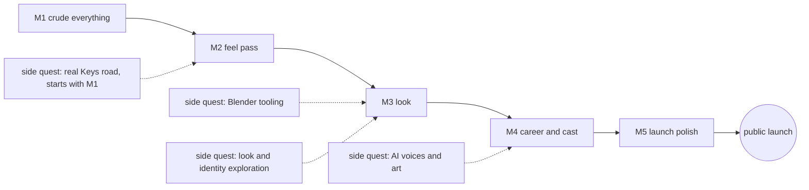

# throttlebrawl: roadmap

> **In plain words.** This page sets the order the game gets built in. There are five milestones. Each one ends with a build you can play on your phone, and each one improves one thing. M1 makes everything exist in a crude form. M2 makes it feel good. M3 gives it a look. M4 adds the career and the full cast of rivals. M5 polishes it for a public launch. Four side quests run alongside: real map data for the Keys road (this one starts with M1), AI-made voices and art, Blender art tools, and look experiments. They never hold up a milestone. Many agents work at once, each in its own part of the code. The maintainer plays whenever they like and says what they think in chat. Those notes steer the next work, but nothing sits waiting for them. The maintainer is needed only for taste calls, money over the cap, and anything public or irreversible. Even then only that one task pauses, and a taste call never stops work: agents build a default and the maintainer vetoes it later.
>
> Each milestone has its own detailed build plan: [M1](./milestones/M1.md), [M2](./milestones/M2.md), [M3](./milestones/M3.md), [M4](./milestones/M4.md) and [M5](./milestones/M5.md).

## How to read this roadmap

The tags mean what they mean in [the product spec](./product-spec.md#how-to-read-this-spec):

- **[decided]**: traces to a maintainer answer.
- **[default]**: a proposal. Agents build it as written, and the maintainer may change it at any time.
- **[open]**: needs the maintainer. Each one is also listed in [Open decisions](#open-decisions).

Each milestone table also has a **Source** column:

- **blueprint**: the roadmap section of the blueprint playback page. The maintainer reviewed that page and said it "mostly looks right". On the page, the M1 list carried the maintainer's own chip, and the M2–M5 lists carried no chip. So an M2–M5 item is `[decided]` only where a specific interview answer pins it to that milestone. Otherwise it is `[default]`: a plan the maintainer has seen but did not pick item by item.
- **decision**: a specific maintainer answer from the interview.
- **added**: added by this roadmap or a sibling doc. Always `[default]`.

This doc owns *when* things are built. *What* they are lives in the [product spec](./product-spec.md), and *how* they are built lives in [the architecture doc](./architecture.md), [the content-pack doc](./content-packs.md) and [the engineering doc](./engineering.md). If this page disagrees with one of those about what something is, that doc wins. If one of them disagrees with this page about when something lands, this page wins, and the other doc is corrected.

## Contents

- [The shape at a glance](#the-shape-at-a-glance)
- [How work flows, and why nothing waits for the maintainer](#how-work-flows-and-why-nothing-waits-for-the-maintainer)
- [M1 · Crude everything](#m1--crude-everything)
- [M2 · Feel pass](#m2--feel-pass)
- [M3 · Look](#m3--look)
- [M4 · Career and cast](#m4--career-and-cast)
- [M5 · Launch polish](#m5--launch-polish)
- [Regions, alongside the milestones](#regions-alongside-the-milestones)
- [Playtest 4, alongside the milestones](#playtest-4-alongside-the-milestones)
- [Side quests](#side-quests)
- [Where each v1 item lands](#where-each-v1-item-lands)
- [Decisions and when they matter](#decisions-and-when-they-matter)
- [After v1](#after-v1)
- [Open decisions](#open-decisions)
- [Sources](#sources)

## The shape at a glance

Solid arrows show the order in which milestones finish. Dashed arrows show where a side quest's output is most useful. A dashed arrow never means "waits for".

- Five milestones, every one playable on the phone. [decided that `main` is always playable, so every milestone is too; default for the five-milestone shape, which the maintainer reviewed on the blueprint page, and for the contents, as tagged below]
- The full spec, architecture and a plan for every milestone come before any game code. The maintainer asked for "Even deeper". [decided] This page specs M2–M5 at the level of contents, demo, exit criteria and what each unblocks. Each later milestone also has a task-level plan like [M1.md](./milestones/M1.md) (linked from each section below). Those plans are revised when the milestone's lanes start, so that they can use the playtest notes that have arrived by then. [default]

## How work flows, and why nothing waits for the maintainer

The maintainer is never a gate. [decided] They are needed only for taste calls, spending over the cap, and anything irreversible or public-facing. [decided] Here is how that works day to day. The mechanisms are `[default]` unless tagged otherwise.

- **Lanes start on merged interfaces, not on playtests.** A lane (one agent working on one area of the code) starts as soon as the interfaces it codes against are on `main`. It never waits for the maintainer to play the previous build.
- **Milestones overlap.** Milestones are ordered by when they finish. They are not strict phases. A lane whose M1 tasks have merged may start its M2 tasks while other M1 lanes are still working, as long as `main` stays playable. The one exception is M1's lane 0 (the scaffold and the walking skeleton), which must land before any other lane starts.
- **Two kinds of done.** A milestone is **done** when its automated exit criteria are green on `main` and its demo is live on the game Space. Agents report it as "done, not phone-verified", because agents can't run the benchmark phone. It becomes **phone-verified** when the maintainer has played it. Nothing waits for that second step.
- **Playtests steer.** The feedback loop is: play the build, then tell the lead agent in chat. [decided] The maintainer can also paste a tuning preset from the in-game panel [decided] or a debug report. Agents turn each note into work in the current milestone: a tuning change, a fix, or an idea-shelf entry. Each milestone below lists a **phone playtest**, which is a suggestion of what to try, not a checklist that must be passed.
- **Taste calls have defaults.** Agents invent content freely within the tone guide, and the maintainer vetoes afterwards. [decided] The same goes for other taste calls, such as the look style and names: agents build a sensible default and keep going. The maintainer's pick later becomes a data change.
- **Open questions have defaults.** All thirteen planning questions were answered in the maintainer's cockpit on 2026-09-29, and the plan was ratified ("Yes, but I have notes", with the one note "Mirror repo to hf", which [the engineering doc's deploy section](./engineering.md#deploy-game-space-and-staging-space) carries out). [decided] Any new open question will still say what gets built if it goes unanswered. See [Decisions and when they matter](#decisions-and-when-they-matter).
- **What does pause.** Only the task that needs the maintainer pauses, and every other lane keeps going. [decided for the list, per [the engineering doc](./engineering.md#what-always-needs-the-maintainer)] Taste calls are not on it, because they have defaults. These tasks pause:
  - creating the repo, the Spaces or a dataset repo (the repo and both Spaces were approved on 2026-09-29, so this now means the dataset repo and the real-name Spaces);
  - renames;
  - the public launch announcement;
  - deleting anything;
  - spending over the cap.

  The public commit identity, which used to be one more pause before the first push, is settled: the GitHub no-reply address. [decided] (cockpit answer, 2026-09-29; see [the engineering doc](./engineering.md#commit-identity))
- **Unattended work.** Agents don't schedule recurring autonomous work, such as weekly runs, because of usage limits. [decided] A big orchestrated run that the maintainer launches, like the one that builds M1, may carry on while they are away, and it resumes from its journals after a usage limit. [decided] The M1 run launches right after the repo is created, and the maintainer plays M1 on the phone when it lands. [decided] (cockpit answer, 2026-09-29) Lanes emit machine-readable status, so a maintainer-private progress view outside the repo can show which lanes are running and how they are doing. [decided]
- **Sessions end clean.** Each session ends with `main` green and playable, and when the maintainer comes back after a break they get a three-line resume card in chat, with no nudges, ever. [decided]
- **The launch is the one real gate.** A public v1 launch needs all four: feel, look, runs well on the A16, and personality. The maintainer judges them. [decided] Pointing people at the game is an outward step, so it's the maintainer's call. Building never waits on it.

## M1 · Crude everything

**Goal:** every part of the loop exists, crudely, and runs on the phone. M1 is everything, equally crude, cops included. [decided]

The detailed task plan, with lanes, owned files and acceptance tests, is [milestones/M1.md](./milestones/M1.md).

| Item | Tag | Source |
|---|---|---|
| A curvy road with hills. The Keys are nearly flat, so the hills come from bridge humps and causeway rises | [decided] for the road; [default] for the humps | blueprint |
| The hand-made track uses exactly the road data format that the real-road (GIS) pipeline emits, so the real Overseas Highway can replace it later by a data switch | [decided] | decision |
| Your bike | [decided] | blueprint |
| 4 box rivals | [decided] | blueprint |
| Traffic cars | [decided] | blueprint |
| Traffic in both directions, meaning an oncoming lane | [default] for M1; [decided] for v1 | added (v1 traffic includes an oncoming lane) |
| Trucks as big hazards | [default] for M1; [decided] for v1 | added |
| Touch and keyboard controls | [decided] | blueprint |
| Auto-target attacks: drag off the button to pick a side, swipe down to kick | [decided] | blueprint, decision |
| A real range and timing window for hits and kicks | [default] | added. In the look-lab sample a kick could land at any moment and always sent the rival flying. The maintainer flagged that for later polish. M1 builds the basic gate, and M2 polishes how it feels |
| Crash and run-back, skippable | [decided] | blueprint, decision |
| A finish line with placing | [decided] | blueprint |
| Engine and hit sounds, made in code | [decided] | blueprint, decision |
| The low chase cam | [decided] | blueprint, decision |
| A cop: chases you, can be hit, and busts you if you go down near him | [decided] for the cop and the bust; [default] for the crude M1 bust | blueprint, decision |
| The tuning panel | [decided] | blueprint, decision |
| A crude hit-stop, so the panel's hit-stop slider does something from M1 | [default] | added |
| A ramp shortcut | [default] for M1; [decided] for v1 | blueprint (a coordinator addition, "to test the network and the jumps early") |
| One junction | [default] | blueprint (coordinator addition) |
| Pedestrians who dive clear | [default] for M1; [decided] for v1 | blueprint (coordinator addition) |
| A "copy debug report" button | [default] | blueprint (coordinator addition) |
| Text-bubble barks for the four rivals | [decided] that M1 voices are text bubbles; [default] that M1 has barks | decision |
| Volume sliders and mute, and the left-handed mirror | [default] for M1; [decided] for v1 | product spec landing order |
| A frame-rate cap on the tuning panel, so full rate and about 30 fps can be compared | [default] | added. The frame-rate priority itself is decided (smooth first, cockpit answer, 2026-09-29); the cap lets the maintainer feel the battery saver early |
| One pickup weapon and the timed steal | [default]; may slip to M2 | added ([the content-pack doc's M1 minimum](./content-packs.md#what-m1-needs)) |
| The workshop: the gate, CI, staging and game Spaces, input recording, the determinism self-test, the bot and the perf probe | [default] | [engineering](./engineering.md), [architecture](./architecture.md#testing-seams) |

**Playable demo.** Open the game link on the phone and tap to start: the game goes fullscreen and landscape, with sound. Race a stretch of hand-made Keys coastal highway, about two minutes long, against four box rivals, a cop, and traffic both ways. Punch and kick, get knocked off, run back or skip, maybe get busted, then cross the line and see your place. Open the tuning panel from the pause screen and change the feel mid-race.

**Exit criteria.** They are listed in full in [M1.md's exit section](./milestones/M1.md#m1-exit). In short:

- automated: the whole gate is green on `main`;
- 50 seeded headless races finish, and each one replays to identical state hashes;
- the timing-window, bust, crash and junction scenario tests pass;
- a bot finishes a race in a real browser with a placing, lands a hit and takes the ramp shortcut;
- the perf budget holds;
- the build is live on the game Space (every green merge deploys there, [decided], cockpit answer, 2026-09-29);
- plus a short phone playtest.

**Unblocks:**

- The **look test**, which comes after M1. [decided] It is done in M3.
- A first feel of the **battery saver** against the smooth-first default (`architecture-frame-rate-priority` is decided: smooth first), via the tuning panel's cap.
- The first **real A16 numbers**, which replace the starting performance budgets in [the architecture doc](./architecture.md#performance-budgets).
- **M2's priorities**: which of steering, hits and camera feel worst on the phone.
- Whether **oncoming traffic** starts at full density or eases in. This is a tuning call.
- Whether the **junction and ramp shortcut** are fun, which keeps or reshapes the track.
- The **real-road comparison**: the GIS side quest starts beside M1, and its first stretch can be ridden against the hand-made track in M2.

## M2 · Feel pass

**Goal:** make landing a hit at speed feel great. The core fun is "landing a hit at speed". [decided]

The detailed task plan is [milestones/M2.md](./milestones/M2.md).

| Item | Tag | Source |
|---|---|---|
| Hit-stop tuned, plus knockback and a camera jolt on hits | [default] | blueprint |
| Burnout-style takedowns with a short in-flow slow motion, on by default, with a toggle | [decided] for the takedowns and the toggle; [default] for M2 | blueprint, decision |
| The fuller crash tumble, with contacts against traffic. The tone: crashes are big and funny and recovery is quick, with ragdoll tumbles, a bike that cartwheels, riders who sometimes go over the rail, and a run-back that starts fast. Never gory or lingering | [decided] for the tone; [default] for M2 and the traffic contacts | decision, [architecture](./architecture.md#crash-tumble) |
| Over-the-rail crashes: a funny splash (a gator or a fisherman reacts), a time penalty and a respawn on the bridge. No swimming | [decided]; [default] for M2 | decision |
| Knocked-off rivals tumble, get up and shake a fist, and a grudge is noted (for the current race in M2; the career keeps it from M4) | [decided] for the behaviour; [default] for M2 | decision |
| Difficulty presets Easy, Normal and Hard, which set rival aggression, cop frequency and rubber-banding. Assists toggle separately | [decided]; [default] for M2 | decision |
| The full pause menu: resume, restart, quit, the controls and HUD editor (its full editor lands in M3), the tuning panel (hidden unless enabled) and "copy debug report" | [decided]; [default] for M2 | decision |
| Auto-pause on app switch, screen lock or a call, and resume mid-race even after the tab reloads, using race-state snapshots | [decided]; [default] for M2 | decision |
| Style cash scored during a race, from near-miss traffic, airtime, oncoming-lane riding, takedown combos and weapon steals, plus "maybe other stuff". The results screen shows it, and banking it waits for M4's career | [decided] for the sources; [default] for M2 and the amounts | decision |
| The real Overseas Highway, built by the GIS side quest since M1, replaces the hand-made track if the real road is fun. The maintainer rides both and picks; the pick becomes the career's road, and the other stays as an alternative route | [decided] (`milestones-real-road-swap`, cockpit answer, 2026-09-29) | decision |
| The audio mix: engine, hits in sync with hit-stop, crashes, horns, the siren, and the one original score | [default]; [decided] that M1 and M2 keep a single original score | blueprint, decision |
| Haptics, with a toggle | [decided] for the toggle; [default] for M2 | blueprint |
| Gamepad support, including a PS4-style pad paired to the phone over Bluetooth | [decided] (around M2) | decision |
| Tuning presets from playtests, locked in as the shipped default | [decided] for the mechanism; [default] for M2 | blueprint |
| Tilt steering as an option, with a sensitivity slider and recalibration at race start | [decided] for the option; [default] for M2 | product spec landing order |
| Assist options: steering assist, auto-throttle, and the lower-overall-speed setting | [decided] that assist options and the lower-speed setting exist; [default] for the rest of the set and for M2 | added |
| Settings: speed units, the slow-motion toggle, the haptics toggle, reduce screen shake, and the frame-rate cap | [decided] for units, the two toggles and reduce-shake; [default] for the frame-rate cap and for M2 | added |
| A race-length choice: short, standard or long | [decided] for the choice; [default] for M2 | added |
| Look-back camera | [decided] that all camera modes come, staged; [default] for M2 | decision |
| Takedown camera, for the slow-motion beat | [default] | added |
| The in-game veto: long-press a bark, sign or billboard and choose "cut this". The flag goes into the debug report, and agents then remove the item and record it in the taste log | [decided] for the flow; [default] for M2 | decision |
| The "what's new since you last played" card and the changelog page | [decided] for both; [default] for M2 | added |
| Barks gain conditions and specificity scoring | [default] | [content-pack staging note](./content-packs.md#bark-sets-and-line-selection) |
| The pickup weapon and steal, if they slipped from M1 | [default] | added |

**Playable demo.** Same road, new feel. A clean kick freezes for a beat. A rival knocked into a truck gets a slow-motion moment. The phone buzzes on hits. A PS4 pad works. Tilt is an option in the settings.

**Exit criteria (automated):**

- Sim tests check hit-stop and slow-motion durations in ticks. Slow motion fires only on player-involved takedowns, and its cooldown (about 8 s) stops a pile-up from chaining it. Replays with slow motion reproduce their hashes.
- A mocked Gamepad API drives the action map. A mocked `navigator.vibrate` fires only with haptics on. Tilt maps correctly in both landscape orientations.
- The veto adds a content reference to the debug report (browser test).
- The what's-new card shows only notes newer than the last build this device saw (unit and browser tests).
- The difficulty presets, the rail splash and respawn, the style-cash scoring, and reload-resume each have their own tests, listed in [M2's exit criteria](./milestones/M2.md#automated-exit-criteria).
- The gate and the perf budget stay green.

**Phone playtest:**

- Do hits feel meaty?
- Does a takedown read clearly?
- Do the buzzes feel right?
- Does the pad work over Bluetooth?
- Is tilt any good?
- Does the slow-motion toggle work?

Paste the preset you like.

**Unblocks:**

- The **locked feel preset**, which is the launch bar's "feel".
- The **default steering**: thumb or tilt, left undecided.
- Whether **pulling the stick back** also brakes by default.
- **Takedown slow-motion durations**.
- Whether shelf ideas like **boost earned by aggression** earn a place.

## M3 · Look

**Goal:** a visual identity, chosen by eye on the phone.

The detailed task plan is [milestones/M3.md](./milestones/M3.md).

| Item | Tag | Source |
|---|---|---|
| A look test on the phone picks the style, using the real game scene | [decided] (look test after M1) | blueprint, decision |
| The four look-lab styles as swappable looks, plus the zine/photocopy overlay (off, subtle, full) | [default] | [architecture](./architecture.md#look-layer-swappable) |
| Visual identity from a signature palette, character design, the zine overlay, and AI concept-art exploration | [decided] | decision |
| A look test of rider proportions: exaggerated against realistic | [default] (the maintainer said "idk") | decision (tentative) |
| Palettes compared, then set per time of day. Lighting presets for dawn, noon, golden hour, dusk and night | [default] for the palettes (tentative); [decided] that each event sets a time of day | decision |
| The Blender-script art pipeline, at minimum one scripted asset in the game | [default] | blueprint |
| Zine-style menus | [decided] for the style; [default] for M3 | blueprint, decision |
| Keys scenery: long bridges, water, mangroves, stilt houses, palms, bait shacks, signs and billboards | [decided] for Region 1; [default] for the details | blueprint |
| Animals and wasteland oddities in traffic | [decided] for v1; [default] for M3 | added |
| Far chase and helmet cameras | [decided] that all cameras come; [default] for M3 | added |
| HUD presets (Full, Classic, Minimal), the HUD editor, movable and resizable buttons, and the minimap | [decided] for configurability and the presets; [default] for the minimap and for M3 | product spec landing order |
| Character design for the eight rivals, told apart by shape as well as colour | [decided] for character design as an identity source; [default] for the rest | added |

**How the look test works without making the maintainer a gate.** [default]

- Agents build a look switcher on the pause menu. It flips style, overlay, proportions and palette live on the phone.
- The switcher ships with a recommended default.
- Work that doesn't depend on the style keeps going: scenery geometry, menu layout, the HUD editor and the art pipeline.
- When the maintainer picks, the pick becomes the default look id in the base pack. That is a data change, and until then the recommended default stays.

**Playable demo.** The Keys look like somewhere. Switch looks, the overlay and rider proportions from the pause menu and ride each one.

**Exit criteria (automated):**

- Every look renders a non-blank frame in the browser test, with screenshots.
- The perf hard gate holds for every look, including the one combined full-screen pass.
- The pipeline's scripted asset validates and loads through the asset manifest.
- The HUD presets validate, and the editor round-trips a layout.

**Phone playtest:**

- Which look makes you want to keep playing?
- In each look, can you still read rivals, the cop and traffic at speed?
- Do the menus feel like a 90s zine?

**Unblocks:**

- The **look pick**, a taste call.
- The **rider proportions** and the **per-time-of-day palettes**.
- The **art direction for M4's interludes**.
- Brainstorming the **real name** and the **streaming outfit's name**, which is still a placeholder in [the tone guide](./tone-guide.md#other-writing-surfaces).

## M4 · Career and cast

**Goal:** the full game loop on the one track: ride, fight, crash, get busted, earn, buy, advance, and beat the boss. [decided]

The detailed task plan is [milestones/M4.md](./milestones/M4.md).

| Item | Tag | Source |
|---|---|---|
| About 10 events in 3 tiers, ending in a boss grudge race, roughly 1–2 hours of play; since then each region's road network is its career map (interview, 2026-10-02), and playtest 3 (2026-10-03) makes the career longer, with real struggle, then seasons ([product spec](./product-spec.md#career)) | [decided] | blueprint, decision, [playtests](./playtests/README.md) |
| Four event types (classic race, takedown hunt, cop escape, grudge match), each with its own objective ("Objectives mix") | [decided] | blueprint, decision |
| The proposed event list and boss from [the product spec](./product-spec.md#career) | [default] | product spec |
| Eight named rivals: 4 regulars plus 4 locals. They have styles, grudge targeting, rival-vs-rival fights, weapon use and steals, and simple gang-ups (rivals may side with you or against you) | [decided] | blueprint, decision |
| The first fixed crew, Mother Rust's gang | [default] | product spec |
| Cops and busts: the spawn mix (tier-rising, every race, chaos-summoned), fines, Sgt. Pruitt, and a baton and taser you can steal | [decided] for the mix, the bust and fine, Pruitt, and the baton and taser; [default] for fines scaling by tier and for stealing from cops | blueprint, decision |
| Cash from placing, takedowns and near-misses, with M2's style cash now banked (near-miss traffic, airtime, oncoming-lane riding, takedown combos and weapon steals, plus "maybe other stuff"); no betting | [decided] for the sources; [default] for M4 and the amounts | decision |
| Three bikes, each a clear step up (six since playtest 3, 2026-10-03: a Sport 600, a Grand Tourer 1100 and a Supersport 900 join them), plus slow novelty rides: a moped or scooter, a dirt bike and an old chopper; paint-only customization | [decided] for the vehicle kinds, three step-up bikes and paint-only, and (playtest 4, 2026-10-04) for keeping the prices as they are, about 3 to 4 races a bike for a player who follows the map; [default] for which kind fills which slot | blueprint, decision |
| Secret joke rides: a riding lawnmower, a mobility scooter and a golf cart | [decided] that they are wanted; [default] that they arrive as easter eggs in M4 | decision |
| The Keys law is a mix of real agency structure (county deputies, state troopers, maybe marine patrol) under parody names, plus fully parody forces | [default] (the maintainer: "maybe a mix of all") | decision |
| All v1 weapons: club or pipe, chain, wasteland junk, and the cops' baton or taser | [decided] for the list; [default] for M4 | decision |
| Interludes: short stills with text, mixed by context | [decided] for stills and text; [default] for the mix | blueprint, decision |
| Barks with memory (grudge history), at least 5 lines per common trigger per rival | [decided] for memory; [default] for the counts | blueprint, [tone guide](./tone-guide.md#the-bark-system) |
| Grudges saved with the career, so rivals keep them across play sessions | [decided] (`milestones-career-grudges-persist`, cockpit answer, 2026-09-29) | decision |
| Learn by riding event 1, with prompts that appear as they become relevant | [decided] | decision |
| The first run is menu first: the start tap lands on the main menu with "Start career" as the obvious first tap | [decided] (the maintainer, playtest 4, 2026-10-04: "Menu first"; it replaced the earlier race-first `[default]`) | decision |
| Every race starts with a 3-2-1-GO countdown | [decided] (playtest 4: "Races should have a 3 2 1 go type countdown"); [default] for the timing | decision |
| A race from the main menu has options: bike (no garage trip), light and weather, rivals and cops, difficulty, length and traffic, remembered between races ([product spec](./product-spec.md#ux-and-menus)) | [decided] for the options (playtest 4, P4-12 and P4-13); [default] for the screen and the values; new race and challenge types [open] | decision |
| The ending: beating the boss plays a next-region teaser, and free play continues | [decided]; [default] that v1 free play means replaying any event | decision |
| Failure mode: Road Trip as the default, with a `failureMode` seam for the later Classic and Hardcore options (which follow the loop and may slip past M4) | [decided] for Road Trip as the default and the two later options (`product-failure-states`, cockpit answer, 2026-09-29); [default] for their timing | decision, product spec |
| Saving on the device plus a copyable export code; save migrations and golden fixtures | [decided] for local save plus code; [default] for M4 | decision, [architecture](./architecture.md#save-format) |
| Weird events: at least one of each kind (nature, human, wasteland, league) | [decided] for the kinds; [default] for M4 rather than the shelf | decision |
| Radio: stations by genre plus regional stations, with surf and rockabilly first for the Keys, and a hidden pirate station per region. Tracks are code-made only for now (interview, 2026-10-02: "More code-made music only"), which sets aside the 2026-09-29 answer's AI-generated tracks; the maintainer cuts the ones they don't like with "cut this". DJ lines come later. Playtest 4 (2026-10-04) asks for richer music in every region, the Pacific Northwest's first | [decided] for genre and regional stations, those two first, code-made tracks only for now, the veto, the DJ timing and richer music in every region; [default] for M4 | decision |
| A shortlist of real names, from which the maintainer picks before M5 | [decided] that the real name comes before M5; [default] for the process | decision |
| A first batch of easter eggs | [decided] that all kinds are wanted; [default] for M4 | decision |

**Playable demo.** Start a career on the phone. Ride event 1 while the prompts teach you, earn cash, and buy the next bike. Named rivals remember what you did to them, and Sgt. Pruitt busts and fines you. A parade or a hurricane gust turns up now and then. Beat the boss, watch the teaser, and keep playing.

**Exit criteria (automated):**

- A headless career test has a bot play every event and the boss in the simulation, and the career ends in the teaser and free play.
- Each objective type has unit tests.
- Saves round-trip, export codes decode, and every golden save fixture migrates.
- The pack check's bark coverage report shows that every rival has enough lines per trigger.
- Weird events replay deterministically.

**Phone playtest:**

- Is the pacing right?
- Do grudges show?
- Does a bust sting without ruining the evening?
- Do rivals, signs and billboards make you laugh? Veto what misses.

**Unblocks:**

- The **Classic and Hardcore options**, which follow the Road Trip default once the loop is in.
- The **real-name pick**.
- **Bike prices and career pacing**.
- **More regions**, after the Pacific Northwest and San Francisco, which no longer wait for v1 ([Regions, alongside the milestones](#regions-alongside-the-milestones)). [decided]

## M5 · Launch polish

**Goal:** the v1 candidate, ready to share proudly.

The detailed task plan is [milestones/M5.md](./milestones/M5.md).

| Item | Tag | Source |
|---|---|---|
| Speed on the A16: quality tiers and dynamic resolution. These come earlier if a phone probe misses the frame budget | [decided] for the benchmark; [default] for the mechanism and timing | blueprint, [architecture](./architecture.md#quality-tiers-and-dynamic-resolution) |
| A one-tap soak run: the bot rides for 15 minutes on the phone and writes the frame numbers into the debug report | [default] | added, so the maintainer never has to time anything by hand |
| The rest of accessibility: text size, reduce motion, and a shape and colour check | [decided] for the basics "without being obtrusive"; [default] for the remainder | blueprint, product spec |
| Onboarding polish | [default] | blueprint |
| The real name applied, with a storage-key migration and a changelog notice. New Spaces are created under the real name, and the old game Space becomes a one-page "we moved" link; nothing is deleted. Creating the new Spaces is confirmed with the maintainer at the time | [decided] (real name before M5; `milestones-rename-hosting`, cockpit answer, 2026-09-29) | blueprint, decision |
| A pre-launch leak re-audit over the whole tree and the whole git history. The audit the maintainer decided on, "before going public", runs earlier: a one-off scan before the first docs push, then `leakscan:all` over the whole history in M1's infra-1 | [default] for the M5 re-audit; [decided] for the audit before going public | blueprint, decision |
| Offline play and installing as an app (built early, playtest 4 run B: the offline worker, the web manifest and the menu's Install button; the browser test that loads the game with the network off is `tests/e2e/app-offline.spec.ts`) | [decided] that offline is preferred; [default] for the mechanism | product spec, [engineering](./engineering.md#deploy-game-space-and-staging-space) |
| A credits and data-licences page (built early, playtest 4 run C: the menu's Credits button; the rule test is `scripts/credits.test.ts`) | [default] | product spec |
| A replay viewer with cinematic cameras | [decided] that cinematic replay cameras are wanted; [default] for M5, and it may move after v1 | added |
| More easter eggs | [default] | decision |
| The public launch: sharing the game Space link | [decided] launch bar; the announcement is the maintainer's call | blueprint |

The blueprint lists "the public Space" in M5. The repo and the Spaces are public from day one [decided], so here "public" means the launch: the moment people are pointed at the game.

**Playable demo.** The v1 candidate: the whole career, in the chosen look, at a steady frame rate on the A16, working offline once it has loaded.

**Exit criteria (automated):**

- The perf gates hold.
- The soak tool writes its report.
- A browser test loads the game with the network off.
- The leak audit finds nothing across the whole tree and the history.
- The rename migration test reads the old storage key once and moves it.

**The launch bar** comes after the automated criteria. It has four parts, all judged by the maintainer: feel, look, runs well on the A16, and personality. [decided] The checks for each are in [the product spec](./product-spec.md#the-launch-bar).

**Phone playtest:** the launch bar itself. Also run the soak and paste the report.

**Unblocks:**

- The **public launch**, which is the maintainer's outward step.
- Then the [After v1](#after-v1) work.

## Regions, alongside the milestones

Tag: `[decided]` (playtest 1c, 2026-09-30) for regions now, their order and new race types waiting; `[default]` for the mechanics.

Regions no longer wait for v1. The maintainer, after the third phone playtest: "I do think we should start adding other regions races etc to avoid over optimizing, keep things fun, ensure everything works".

- **The order:** "Pnw and sf first then others". The Pacific Northwest and San Francisco come first. [decided]
- **The shape:** each region is crude first, a content pack that reuses everything the game already has: its own road, local rivals, a local cop, traffic, signs and billboards. Both started in M2 as `region-pnw` (#161) and `region-sf` (#165). The menu's region picker starts a race in either one ([content packs](./content-packs.md#region-packs-at-runtime)). [decided] for crude-first packs that reuse everything; [default] for one pack per region.
- **Alongside, not a milestone:** regions run in parallel with M2 to M5. The engine gaps a region shows are handed to the lane that owns that code, such as region palettes, scenery beyond palms, real climbs and fog. They do not make a region milestone. [default]
- **Build-out, not new regions** `[decided]` (the maintainer, 2026-10-01): "polish and build out the regions we have now (more roads, GIS-based network maybe, better visuals and experience, stuff like that)". New regions wait with the new race types. Real roads became routes the same day ("Yes, add as routes"): Chuckanut Drive and the Columbia River Highway in the Pacific Northwest, Russian Hill and Twin Peaks in San Francisco, picked on the menu after the region ([content packs](./content-packs.md#region-packs-at-runtime)).
- **What each region builds first** `[decided]` (interview, 2026-10-02): San Francisco's downtown towers, then the waterfront, Chinatown and North Beach, and the Mission; the Keys' distinct keys, then sandbars, mangrove back roads and a secret island. Playtest 3 (2026-10-03) adds real places (Duval Street, downtown Portland, the Golden Gate first) and the Seven Mile Bridge with jumps between the old and new spans. The details are in [the product spec](./product-spec.md#world-frame).
- **Career order** `[decided]` (playtest 3, 2026-10-03: "In order"): the career opens the Keys first, the Pacific Northwest after the Keys boss and San Francisco after the Pacific Northwest boss; places already raced stay open.
- **New race types wait:** "These can wait until later". The regions reuse the existing race; no new race type is built for them yet, except the drift events playtest 3 asked for. [decided] Playtest 4 (2026-10-04) leaves new race and challenge types [open]: "idk I need to consider more options and compare to career, other games, etc"; nothing is built until he decides ([Open decisions](#open-decisions)).
- **What comes next:** the next region is the maintainer's pick once these two play well. The candidates are the shelf regions in [the product spec](./product-spec.md#world-frame). [decided] for "then others"; [default] that the maintainer picks which one, as a taste call.

## Playtest 4, alongside the milestones

Tag: `[decided]` (the maintainer, playtest 4, 2026-10-04) for every item below; `[default]` for the timing and the numbers. The answers are in [playtest 4](./playtests/playtest-4.md); the design is in the product spec section named in each row. Phone play is the primary play, so every control change is designed for the touch screen first, with the keyboard and gamepad kept at parity, and any new input or setting that changes the sim is recorded in the replay. This is polish and correction alongside M4 and M5, not a new milestone: the maintainer's standing direction is "more polish, correction, more complete worlds".

| Item | Decision | Where | Built by 2026-10-05 |
|---|---|---|---|
| First run | Menu first, replacing the race-first `[default]` of M4 | [Career](./product-spec.md#career) | yes |
| Race start | A 3-2-1-GO countdown | [Career](./product-spec.md#career) | yes |
| Wheelie | A button, hold to lift, release to drop; the trunk launch from about 3 m/s | [Controls](./product-spec.md#controls) | the button, yes; the trunk speed, not yet |
| Attacks | Auto-aim plus swipe; no kick wait; presses buffered; a bump never cancels an attack | [Controls](./product-spec.md#controls) | yes |
| Drift | Anywhere above about 40 mph | [Controls](./product-spec.md#controls) | yes |
| U-turn | Its own gesture; hairpin braking never flips you | [Controls](./product-spec.md#controls) | yes |
| Steering feel | Arcade by default, plus a true Free mode, then the shortcut and spot fixes | [Controls](./product-spec.md#controls) | Arcade and Free, yes; the spot fixes, not yet |
| Smoking bikes | About 5 to 10 % slower | [Combat](./product-spec.md#combat) | yes |
| Golf carts | They swerve onto the verge; a clip is still a crash | [Traffic](./product-spec.md#traffic-and-pedestrians) | yes |
| Bike prices | Kept: about 3 to 4 races a bike | [Cash](./product-spec.md#cash) | nothing to build |
| The Seven Mile Bridge | The respawn on the highway stays; the old road is easy to get onto | [World frame](./product-spec.md#world-frame) | yes |
| Places | An identity pass for every real place, order up to the coordinator | [World frame](./product-spec.md#world-frame) | in progress |
| Menu races | Options: bike, route, time and weather, rivals and cops, length or laps | [UX and menus](./product-spec.md#ux-and-menus) | not yet |
| Music | Richer in every region | [Audio](./product-spec.md#audio) | in progress |
| New race and challenge types | `[open]` | [Open decisions](./product-spec.md#open-decisions) | no |

The last column is a status as of the date at its head, read from the merged changes then; it goes stale, and the changelog is the record.

## Side quests

Side quests are separate lanes that run beside the milestones. The GIS lane (the real Keys road) is decided and starts with M1. [decided] The other three are optional, and some of them may simply be fun for the maintainer to watch or steer. The rules are `[default]` unless tagged.

- **Never a blocker.** No milestone's exit criteria depend on a side quest's output. [default] (the blueprint listed side quests as a coordinator addition)
- **Outputs land as data, through the normal gate.** A side quest delivers pack entries or manifest assets in a normal PR. Adopting its output is then a data switch, such as a route choice, an asset source or a default look id, never a rewrite.
- **Own paths.** Each quest owns its folder under `tools/` and its paths in the Hugging Face dataset repo. It touches `packs/` only through normal PRs.
- **Money.** Dev-time AI spend is capped at about $25 per batch and $75 per month. The maintainer's rule is "prove before scaling and do so intentionally", and local GPU or Hugging Face runs are preferred. [decided] Each paid run ends with one plain cost line. The mechanics are in [the engineering doc](./engineering.md#dev-time-ai-spend).
- **When they run.** The GIS lane starts in M1, as soon as lane 0 has landed, and runs in parallel without blocking M1. [decided] The other side quests run when a session has spare lanes, or when the maintainer asks for one. [default] Of those three, look experiments with AI concept art go first, so there are pictures to react to before the M3 look test [decided] (`roadmap-side-quest-order`, cockpit answer, 2026-09-29); AI voices and Blender tools follow in either order [default].

| Side quest | Goal | Owns | First proof | Lands when | Tags |
|---|---|---|---|---|---|
| **GIS pipeline: the real Keys road** | Bake the real Overseas Highway (US 1 through the Florida Keys) from public data into the same road format the hand-built track uses, recognisably real but tuned for fun. The road data quality is *(unverified)*: Keys data is unprobed, because the earlier probe covered CA-1 at Big Sur, not the Keys (see [the region stub](./content-packs.md#region-1-stub-the-florida-keys)) | `tools/gis/` (its own Python project), baked `packs/base/regions/florida-keys/roads/` files with an `osm-` prefix if OpenStreetMap is the source. The task plan is [gis-1 in M2.md](./milestones/M2.md#gis-1--the-real-overseas-highway-side-quest-running-since-m1) | A Keys data probe first, then one stretch of about 5–8 km, including a long bridge, baked with elevation (exaggerated for bridge humps). It passes the pack check, credits its sources, and loads as an alternative route | Starts with M1 and runs in parallel. If the real road is fun, it replaces the hand-built track in M2, by a data switch. [decided] The maintainer rides both and picks; the other road stays as an alternative route. [decided] (cockpit answer, 2026-09-29) The real Keys may be mostly straight and flat *(unverified)* | [decided] for the Overseas Highway as the target, the parallel start from M1, the shared road format, the replace-if-fun landing, curated real roads proved step by step, licences "all basically fine", and more real data later; [default] for the source choice (OpenStreetMap, or TIGER plus USGS elevation). See [road data provenance](./content-packs.md#provenance-and-licence-of-road-data) |
| **AI asset pipeline** | Offline AI assets: voiced rival lines, AI-written bark batches, images, and AI-generated radio tracks for M4 (one of the two decided track sources, beside code-made tracks) | `tools/ai/`, `tools/audio/`, the dataset repo | Voice about 5 lines for one rival on the local GPU, state the cost, and play one line in the game as a `remote` asset. That also proves browser fetching from the dataset repo, which is *(unverified)* until then | Any time after M1. Voiced lines add audio to lines that already exist, and subtitles stay. AI bark batches arrive as vetoable bark sets | [decided] for code-made first with AI as a side quest, offline first with live AI optional later, and the spend caps; [default] for the rest. See [AI-generated batches](./content-packs.md#ai-generated-batches) and [big and generated assets](./engineering.md#big-and-generated-assets) |
| **Blender tooling** | Headless Blender scripts that build and export game assets, beyond M3's minimal pipeline: batch tools, and experiments such as pre-rendered rider sprites | `tools/blender/`, run through npm scripts that read `BLENDER_EXE`; each exported GLB is validated | One scripted bike exported to GLB, loaded through the manifest, replacing the code-made bike behind a switch | Any time. If it delivers M3's minimal pipeline early, that M3 item is already done | [decided] that assets start code-made and Blender scripts are part of that; [default] that the extended tooling is a side quest |
| **Look and identity exploration, including AI concept art** | Find the game's visual identity: concept art, a signature palette proposal, rider character sheets and zine-overlay references | `tools/ai/concept/`, the dataset repo, and a lookbook page in `docs/` when there is something to show | 8–12 concept images for one rival and one Keys scene, with the cost noted | Its outputs are candidates for the M3 look test, and the maintainer's reactions go into the [taste log](./tone-guide.md#taste-log) | [decided] that identity comes from a signature palette, character design, the zine overlay and AI concept-art exploration, and that this is the first of the three optional side quests to start (cockpit answer, 2026-09-29); [default] that it is a side-quest lane |

Public safety applies to every side quest: no real people, brands or agency insignia in generated art, and every AI asset is labelled as AI-generated in `THIRD_PARTY_ASSETS.md`. [default]

## Where each v1 item lands

A lookup for agents. "Crude" means the M1 version.

| v1 item | M1 | M2 | M3 | M4 | M5 | Side quest |
|---|---|---|---|---|---|---|
| The Keys coastal-highway track | hand-made road with bridge humps, in the GIS road format | the maintainer rides both and picks; the other stays as an alternative route | Keys scenery | | | the real Overseas Highway from GIS data, in parallel since M1 |
| Junction and ramp shortcut | one of each [default] | | | | | |
| Riding and handling | crude | tuned, plus assists | | | | |
| Punch and kick with timing windows | crude | polished | | | | |
| Weapons and steals | one pipe [default] | slipped items | | all v1 weapons | | |
| Hit-stop | crude | tuned | | | | |
| Takedowns and slow motion | | yes | | | | |
| Crash and run-back | crude tumble | fuller, funny tumble; rail splash and bridge respawn; rivals shake a fist | | grudge kept in the career | | |
| Difficulty presets | one difficulty field in the sim config (a seam) | Easy, Normal, Hard | | | | |
| Pause menu | resume, restart, quit, debug report, tuning panel | the full menu | controls and HUD editor entry | | | |
| Auto-pause and mid-race resume | pauses when the page is hidden | snapshots and reload resume | | | | |
| Style cash | the events it needs (near-miss, jump, land, weapon grab) | scored, shown on results | | banked into cash | | |
| Vehicles | one starter bike | | | three step-up bikes, moped or scooter, dirt bike, old chopper, joke rides | | |
| The law | Sgt. Pruitt under a parody agency | | | the mix of real structure and parody | | |
| Rivals | 4 boxes | | character design | all 8, with grudges | | |
| Cops and busts | one cop, crude bust | | | spawn mix, fines, Pruitt | | |
| Traffic | cars and trucks, both ways | | animals and oddities | | | |
| Pedestrians | crude [default] | | | | | |
| Touch and keyboard controls | yes | tilt | movable buttons | | | |
| Gamepad | | yes | | | | |
| Tuning panel | yes, with frame-rate cap | presets locked in | | | | |
| Settings | volumes, mute, mirror | units, assists, toggles, race length | HUD presets and editor | failure mode (Road Trip) | text size, reduce motion | |
| Cameras | low chase | look-back, takedown | far chase, helmet | | cinematic replay | |
| Audio | engine, hits, crashes, one score loop | the mix | | radio stations | | voiced lines |
| Barks | text, 3 triggers | conditions | | memory, full coverage | | AI batches |
| The look | placeholder | | chosen style, overlay | | | concept art |
| Menus | plain | | zine style | interludes | onboarding polish | |
| Career, cash, bikes, paint | results screen only | | | yes | | |
| Save and export code | settings record only | | | yes | | |
| Debug report | yes [default] | veto flags | | | soak numbers | |
| What's new card and changelog page | notes are collected from the scaffold on | card and page | | | | |
| Weird events | empty seam | | | first set | | |
| Easter eggs | | | | first batch | more | |
| Offline and install | | | | | yes | |
| Performance | budgets, CI gate | | | | A16 speed pass | |
| Real name | | | ideas | shortlist | applied | |

## Decisions and when they matter

All thirteen planning questions were answered in the maintainer's cockpit on 2026-09-29, so none is open. Each answer below is `[decided]`, and the "Where" column points at the text that now carries it.

| Decision | The maintainer's answer | Matters from | Where |
|---|---|---|---|
| `plan-ratify`: is the plan right | Yes, with one note: "Mirror repo to hf" | Now | [engineering](./engineering.md#deploy-game-space-and-staging-space) |
| `repo-and-spaces-create`: create the repo and both Spaces | Create all three now; the first commit is these docs, after a leak scan; the Spaces stay empty until the first deploy (same note: "Mirror repo to hf") | Now | [engineering](./engineering.md#branch-protection-and-auto-merge) |
| `m1-build-launch`: when the M1 run starts | Right after the repo is created; the maintainer plays M1 when it lands | Now | [M1.md](./milestones/M1.md#what-m1-delivers) |
| `engineering-commit-identity`: which email appears on public commits | The GitHub no-reply address, with the "block pushes that expose my email" switch to follow | Before the first docs push | [engineering](./engineering.md#commit-identity) |
| `engineering-prod-auto-deploy`: does every green merge go straight to the game Space | Yes | M1 | [engineering](./engineering.md#deploy-game-space-and-staging-space) |
| `architecture-frame-rate-priority`: smooth or battery-first by default | Smooth first: full display rate, a softer picture under load, a ~30 fps battery saver in settings | M2's settings screen | [architecture](./architecture.md#fixed-timestep-and-the-loop) |
| `product-cruise-meaning`: what "cruise mode" meant | Both the cruise mode and the cruise-control button, together on the shelf | Nothing | [product spec](./product-spec.md#controls) |
| `product-failure-states`: how much losing hurts | Road Trip is the default; Classic and Hardcore come later as options | M4 | [product spec](./product-spec.md#failure-states) |
| `roadmap-side-quest-order`: which optional side quest starts first | Look experiments with AI concept art | Nothing | [Side quests](#side-quests) |
| `milestones-real-road-swap`: how the real Overseas Highway replaces the hand-made road | The maintainer rides both and picks; the other stays as an alternative route | End of M2 | [M2.md](./milestones/M2.md#road-4--the-real-road-switch) |
| `milestones-career-grudges-persist`: whether rivals' grudges survive closing the game | Yes, grudges are saved with the career (free-roam heat stays later) | M4 | [M4.md](./milestones/M4.md#save-3--the-profile-and-the-export-code) |
| `milestones-radio-music-source`: where the radio tracks come from | Both code-made and AI-generated tracks, cut with "cut this" like rival lines; code-made only for now since the interview of 2026-10-02 | M4 | [M4.md](./milestones/M4.md#radio-1--surf-and-rockabilly-radio-m4-late) |
| `milestones-rename-hosting`: how the Spaces follow the real name | New Spaces under the real name; the old game Space becomes a one-page "we moved" link; nothing deleted | Before M5 | [M5.md](./milestones/M5.md#the-real-name) |

Taste calls that come up later are not open questions yet, because the options don't exist yet:

- **The look style**: in M3, from the look switcher.
- **The real name**: agents shortlist during M4, and the maintainer picks before M5. [decided for "before M5"]
- **The streaming outfit's name**: before the launch.
- **Going public with the launch**: after M5.
- **The region after the Pacific Northwest and San Francisco**: "Pnw and sf first then others"; the maintainer picks the next one once those two play well (playtest 1c, 2026-09-30). [decided] for the order; [default] for when the pick comes

## After v1

- Ideas on [the idea shelf](./product-spec.md#idea-shelf) earn their way in through playtests. [default]
- Regions are not here any more: they run alongside the milestones ([Regions, alongside the milestones](#regions-alongside-the-milestones); playtest 1c, 2026-09-30). [decided]
- These come later [decided: later; default: not in v1]:
  - light persistence (cop heat carried between sessions, and grudges outside a career; the career save keeps grudges from M4, [decided], cockpit answer, 2026-09-29);
  - cop radio chatter;
  - cloud save;
  - multiplayer, which the design never blocks;
  - weather, dynamic music and radio DJ lines, a playable cop mode, and deep crews.
- Stats and live AI are parked, not refused: the maintainer decides them once something fun exists. [decided]

## Open decisions

One is open: new race and challenge types (`product-new-race-types`, playtest 4, 2026-10-04; see [the product spec](./product-spec.md#open-decisions)). This page's own question, `roadmap-side-quest-order`, was answered on 2026-09-29: look experiments with AI concept art start first among the three optional side quests. [decided] The four milestone questions (`milestones-real-road-swap`, `milestones-career-grudges-persist`, `milestones-radio-music-source` and `milestones-rename-hosting`) were answered in the same round and are in [the table above](#decisions-and-when-they-matter).

## Sources

This section lists sources; it makes no design choices.

- Maintainer decisions and intent from the September 2026 interview, including the look-lab feedback and the later amendment round (weird events, radio, the in-game veto, race-first, the ending, easter eggs, GIS as a parallel lane, vehicles, style cash, the law mix, difficulty and pause, the crash tone, and the build process).
- The blueprint playback page's roadmap, look-lab and "how we work" sections. The maintainer said the page "mostly looks right".
- The blueprint verification ledger, which records which M1 items the maintainer approved and which were coordinator additions.
- The sibling docs in this folder: [product spec](./product-spec.md), [tone guide](./tone-guide.md), [architecture](./architecture.md), [content packs](./content-packs.md) and [engineering](./engineering.md).
- Research notes on touch controls, Road Rash mechanics, OpenStreetMap and GIS tracks, and hosting. Claims taken from them are marked *(unverified)* where they were unverified there.
